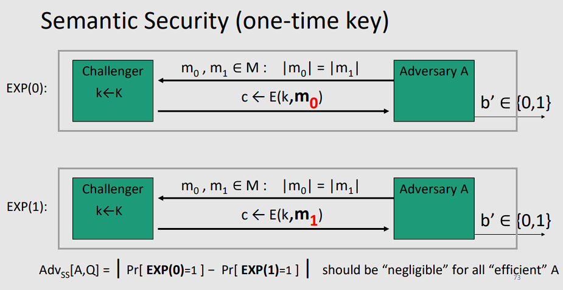

# Stream Ciphers

## 1 ⋅ Outline

Un **stream cipher** è un cifrario che cifra un messaggio bit per bit o byte per byte, a differenza dei cifrari a blocchi che cifrano un blocco di testo alla volta.

Si tratta di cifrature simmetriche che combinano il plaintext con un **keystream** (una sequenza di bit o byte casuali) per produrre il ciphertext, tipicamente attraverso lo XOR.

Le slide si possono trovare [qui](https://virtuale.unibo.it/pluginfile.php/1987588/mod_resource/content/1/Lecture%202%20-%20OTP%20%2B%20Stream%20Ciphers.pdf).

Parleremo di:
- One-Time Pad
- Perfect Secrecy
- Pseudorandom Generators and Stream Ciphers
- Tipi di attacchi
- Sicurezza dei generatori pseudo-casuali
- Sicurezza semantica

## 2 ⋅ Symmetric Ciphers

 **Definizione**:

> Un **cifrario** simmetrico definito su $(K, M, C)$ è una coppia di algoritmi "efficienti" $(E,D)$ dove:
> - $E: K \times M \to C$ è l'algoritmo di cifratura
> - $D: K \times C \to M$ è l'algoritmo di decifratura
> 
> Cosicché $\forall m \in M, \forall k \in K : D(k, E(k, m)) = m$
>
> In particolare:
> - $E$ è spesso random
>   - Oltre alla chiave si usa spesso un vettore di inizializzazione o un nonce in modo da rendere la cifratura più sicura.
> - $D$ è deterministico
>   - Questo vuol dire che se si cifra lo stesso messaggio con la stessa chiave, si ottiene lo stesso ciphertext

## 3 ⋅ One-Time Pad (OTP)

Il **One-Time Pad** è un cifrario simmetrico che è stato proposto da Vernam nel 1917.

Si tratta del primo esempio di un cifrario "sicuro".

Abbiamo che:
- $K = M = C = \{0, 1\}^n$
- $E(k, m) = k \oplus m$
- $D(k, c) = k \oplus c$
- $k$ è una chiave usata **una sola volta**
- $k$ è una sequenza di bit casuali della stessa lunghezza del messaggio (ovvero ha una distribuzione **uniforme** su $K$, ovvero lo spazio delle chiavi)

Da notare che:

$$
\begin{align*}
D(k, E(k, m)) & = k \oplus (k \oplus m) \\
& = (k \oplus k) \oplus m \\
& = 0 \oplus m \\
& = m
\end{align*}
$$

### 3.1 ⋅ Vantaggi e svantaggi

**Vantaggi**:
- Molto veloce per fare la cifratura e la decifratura

**Svantaggi**:
- La chiave usata è molto lunga.
- Deve essere lunga tanto quanto il plaintext. Inoltre deve essere inviata in un **modo sicuro**. Ma se esiste già un canale per trasmettere la chiave della stessa lunghezza del messaggio in modo sicuro, allora perché non usare lo stesso canale per trasmettere il messaggio stesso?

## 4 ⋅ Cosa è un cifrario sicuro?

Cosa può fare un attaccante?
- Per ora assumiamo possa fare solo un **CipherText (CT) only attack**

Possibili requisiti di sicurezza:
-  **L'attaccante non deve poter trovare la chiave**
   -  $E(k, m)$ sarebbe, quindi, sicura
- **L'attaccante non può trovare tutto il plaintext**
   -  $E(k, m_0 || m_1) = m_0 || k \oplus m_1$ sarebbe sicuro.
      -  Nota che $||$ vuol dire concatenazione

Idea di Shannon:
> **CT** non dovrebbe rivelare alcuna informazione su **PT**

### 4.1 ⋅ Definizione **perfect secrecy**

Un cifrario $(E,D)$ su $(K,M,C)$ ha una **perfect secrecy** se:

$$
\forall m_0, m_1 \in M \text{ con } len(m_0) = len(m_1) \text{ e } \forall c \in C
\\ \ \\
Pr[E(k, m_0) = c] = Pr[E(k, m_1) = c]
$$

Dove $k$ è uniforme in $K$ ($k \longleftarrow K$)

##### **Nota** : Non ci sono assunzioni sull'attaccante, ed è per questo che si chiama anche **unconditional security**, oltre a **perfect secrecy**.

Pertanto, **perfect secrecy** abbiamo:
- Dato **CT**, non si può capire se è stato cifrato $m_0$ o $m_1$.
- Quindi anche il più forte degli avversari non impara nulla di **PT** da **CT**.
- Non ci sono attacchi solo **CT**, ma altri attacchi sono comunque possibili

### 4.2 ⋅ Perfect secrecy e OTP

Il **One-Time Pad** ha la **perfect secrecy**.

#### 4.2.1 ⋅ Dimostrazione

$$
\forall m, c \quad Pr[E(k, m) = c] = \frac{\text{\#keys k}\in\text{K s.t. } E(k,m)=c}{|K|}
$$

Quindi se il numero di chiavi che cifrano $m$ in $c$ è lo stesso di quelle che cifrano $m'$ in $c$, allora la probabilità è la stessa. Pertanto dobbiamo dimostrare che il numero di chiavi che cifrano $m$ in $c$ è una costante.

Quante chiavi ci sono che cifrano $m$ in $c$? Una sola. Pertanto la probabilità è $\frac{1}{|K|}$.

### 4.3 ⋅ Lati negativi di perfect secrecy

In generale, vige un teorema che ci dice che:

> Se un cifrario ha la **perfect secrecy**, allora la chiave deve essere lunga quanto il messaggio.
>
> $$
> \text{Perfect secrecy } \implies |K| \geq |M|

Questo vuol dire che, nella pratica, è difficile ottenere la **perfect secrecy**.

## 5 ⋅ Pseudorandom Generators and Stream Ciphers

L'idea è quella di rimpiazzare le chiavi **casuali** dell'OTP con delle chiavi **pseudo-casuali**.

### 5.1 ⋅ Pseudorandom Generators (PRG)

**PRG** è una funzione tale che:

$$
G: \underbrace{\{0, 1\}^s}_\text{Seed space} \to \{0, 1\}^n \quad,\quad n \gg s
$$

Dove $G$ è computabile in modo efficiente da un algoritmo deterministico.

Uno **Steam Cipher** non può avere **perfect secrecy**, in quanto la chiave di partenza è molto più corta del messaggio.

Abbiamo quindi bisogno di una definizione diversa di sicurezza, più lasca.

Alcuni esempi di algoritmi PRG (deboli e quindi non da usare per crypto) sono:

```python
# Linear congruential generator
# con parametri a, b (interi) e p (numero primo)

r[0] := seed
for i = 1 to n:
    r[i] <- (a * r[i-1] + b) mod p
    output di alcuni bit di r[i]

# glibc random():
r[i] <- (r[i-3] + r[i-31]) mod 2^32
output r[i] >> 1
```

## 6 ⋅ Sicurezza di OTP e PRG

### 6.1 ⋅ Two time pad

Mai usare nello stesso steam cipher una **chiave per più di 1 messaggio**.

Questo in quanto si possono prendere i due messaggi cifrati, $c_1, c_2$, e ottenere:

$$
c_1 \oplus c_2 = (m_1 \oplus k) \oplus (m_2 \oplus k) = m_1 \oplus m_2
$$

Che è lo XOR dei due messaggi in chiaro. Quest'ultimo messaggio è facile da decifrare.

### 6.2 ⋅ Real world examples

#### 6.2.1 ⋅ MS-PPTP

Su Windows NT 4.0, il **Microsoft Point-to-Point Tunneling Protocol**.

#### 6.2.2 ⋅ 802.11b WEP

Il **Wired Equivalent Privacy** è un protocollo di sicurezza per reti wireless.

Si prendeva il messaggio $m$, si concatenava con il CRC, ovvero il **Cyclic Redundancy Check**, che serve a verificare l'integrità del messaggio, e si cifrava il tutto usando il PRG ottenuto dall'IV (Initialization Vector) e la chiave. Poi si passavano IV e messaggio cifrato.

IV era di 24 bit, quindi dopo $2^{24}$ pacchetti, si ripeteva la chiave. Inoltre, il CRC era facilmente attaccabile, in quanto era lineare rispetto al contenuto del messaggio. 

**Pertanto senza sapere il contenuto del messaggio si poteva malomettere in un modo non tracciabile come erroneo.**

Si può dire che OTP è **malleabile**, nel senso che non rispetta la richiesta di l'integrità.

#### 6.2.3 ⋅ RC4

RC4 è uno stream cipher molto usato. Viene usato un *seed* di 128 bit per generare una chiave di lunghezza arbitraria, di solito 2048 bit.

Ci sono alcuni problemi di sicurezza:
- **Bias**: i primi byte generati non sono casuali
- **Related key attacks**: attacco possibile


#### 6.2.4 ⋅ CSS

Il **Content Scrambling System** è un sistema di protezione vecchio e particolarmente debole.

Questo, ma anche altri, usano **Linear feedback shift register (LFSR)**, ovvero si prende un registro di bit e si fa uno shift a sinistra, prendendo il bit più a sinistra e facendo lo XOR con un bit di feedback.

### 6.3 ⋅ Esempi moderni

#### 6.3.1 ⋅ eStream

$$
PRG: \underbrace{\{0,1\}^s}_\text{Seed} \times \underbrace{R}_\text{Nonce} \to \{0,1\}^n \quad, \quad n \gg s
$$

Il **Nonce** è un valore che non si ripete per una data chiave, ovvero c'è una coppia $(k, r)$ che non si usa mai più di 1 volta.

*Si può riusare la chiave se il nonce cambia.*

$$
E(k,m,r) = m \oplus PRG(k,r)
$$

#### 6.3.2 ⋅ Salsa20

Implementazione di **eStream** che è sia software che hardware, ed è pensata per essere molto veloce su *x86*.

$$
\text{Salsa20} : \{0,1\}^{128 \text{ or } 256} \times \{0,1\}^{64} \to \{0,1\}^n
\\ \ \\
\text{Salsa20}(k, r) := H(k, (r,0)) \ || \ H(k, (r,1)) \ || \ \ldots
$$

Siano $\tau_i$ delle costanti di 32 bit, abbiamo:

$$
H(k, (r, i)) = \text{Salsa20}(k, \tau_i, r)
$$

#### 6.3.3 ⋅ Performance

Possiamo confrontare alcune funzioni in base a come funzionano su un processore. Per esempio:
- RC4
  - 126 MB/s
- Salsa20 (eStream)
  - 643 GB/s
- Sosemanuk (eStream)
  - 727 GB/s

## 7 ⋅ Quando è sicura la PRG?

Deve essere:
- **Unpredictable**
- **Sicura**

Vedremo che queste due nozioni sono equivalenti.

### 7.1 ⋅ Unpredictable

Supponiamo che una PRG sia **predictable**:

$$
\exists i : G(k)\mid_{1,...,i} \ \mapsto^{Algoritmo} \ G(k) \mid_{i+1,...,n}
$$

Abbiamo che $c \oplus m = G(k)$.

Pure qualcosa come $G(k) \mid_{1,...,i} \ \mapsto^{Algoritmo} \ G(k)\mid_{i+1}$ è un problema.

In generale diciamo che $G: K \mapsto {0,1}^n$ è **predictable** se:

$$
\exists \text{ "efficient" algorithm } A \text{ and } \exists 1 \leq i \leq n-1 \text{ such that } 
\\ \ \\
\forall k \in K \quad , \quad  Pr[A(G(k)\mid_{1,...,i}) = G(k)\mid_{i+1}] > \frac{1}{2} + \epsilon
\\ \ \\
\text{for some non-negligible } \epsilon
$$

PRG è **unpredictable** se non è **predictable**, ovvero:
> $\forall i$ non esiste un avversario efficiente che può predirre il bit $i+1$ per un non trascurabile $\epsilon$.

Un'altra possibile definizione sarebbe dire che sia indistinguibile se viene codificata una stringa usando $G$ oppure se è una stringa casuale.

#### 7.1.1 ⋅ Esempio

Supponiamo di avere $G:K\mapsto{0,1}^n$ affiché per tutte le $k$, abbiamo $XOR(G(k))=1$, ovvero $G(k)$ ha un numero dispari di 1.

La funzione $G$ è predictable? Si, perché dati i primi $n-1$ bit possiamo predirre l'$n$-esimo bit.

#### 7.1.2 ⋅ Nota

Una cosa importante per la PRG è che la lunghezza $s$ del seed sia sufficientemente grande, cosicché un avversario non possa fare brute force (cercare tutti i possibili $2^s$ seed sia impossibile).

## 8 ⋅ Test statistici

Definiamo un **test statistico** su $\{0,1\}^n$:

> Un **test statistico** su $\{0,1\}^n$ è un algoritmo $A$ tale che $A(x)) \in \{0,1\}$, ovvero $A : \{0,1\}^n \to \{0,1\}$.
>
> Esempi:
> - $A(x) = 1$ sse $x$ ha un numero dispari di 1
> - $A(x) = 1$ sse $x$ ha una sequenza di 0 di lunghezza $> 100$

### 8.1 ⋅ Vantaggio statistico

Siano:
- $G:K \to \{0,1\}^n$ una **PRG**.
- $A:\{0,1\}^n \to \{0,1\}$ un **test statistico** su $\{0,1\}^n$.

Definiamo il **vantaggio statistico** di $A$ su $G$ come:

$$
\text{Adv}_{PRG}[A,G] = \left| \underset{k \leftarrow K}{Pr}[A(G(k))=1] - \underset{r\leftarrow \{0,1\}^n}{A(r)=1} \right| \in [0,1]
$$

Abbiamo 3 casi:
- Se $Adv$ è vicino a 0, allora $G$ è **indistinguibile** da una sequenza casuale
- Se $Adv$ è vicino a 1, allora $G$ è **predictable**
- Se $Adv$ è non trascurabile, allora $G$ è **non sicura**

#### 8.1.1 ⋅ Esempio di vantaggio

Supponiamo che $G: K\to\{0,1\}^n$ che soddisfa $\text{msb(G(k))=1}$ per $2/3$ delle chiavi di $K$.

Definiamo il test statistico $A(x)$ come:

$$
\text{if [ msb(x) = 1 ] output "1" else output "0"}
$$

Allora:

$$
Adv_{PRG}[A,G] = \left| \frac{2}{3} - \frac{1}{2} \right| = \frac{1}{6}
$$

Questa è una quantità **non trascurabile**, pertanto $G$ non è una buona **PRG**.

### 8.2 ⋅ Sicurezza delle PRG

Definizione:

> Diciamo che $G : K \to {0,1}^n$ è **sicura** se per ogni test statistico efficiente $A$ il vantaggio statistico è trascurabile.

Ci sono delle PRG provabili come sicure? (Non è conosciuto, e si può ridurre al problema P vs NP)

## 9 ⋅ Teorema - PRG sicura è imprevedibile

Sia $G: K \to {0,1}^n$ una **PRG**.

Il teorema ci dice:

> Se $\forall i \in {0,...,n-1}$, $G$ è **unpredictable** in una posizione $i$, allora $G$ è sicura.

Essenzialmente: se il prossimo bit non è prevedibile, allora la PRG è sicura.

### 9.1 ⋅ Più in generale

Siano $P_1$ e $P_2$ due distribuzioni su ${0,1}^n$.

Allora diciamo che $P_1$ e $P_2$ sono **indistinguibili computazionalmente** (denotato come $P_1 \approx_p P_2$) se:

$$
\text{se } \forall \text{ algoritmo efficiente } A \text{ si ha che }
\\ \ \\
\left| \underset{X \leftarrow P_1}{Pr} [A(X) = 1] - \underset{X \leftarrow P_2 }{A(X) = 1} \right| < \text{trascurabile}
$$

Per esempio: una PRG è sicura se $\{k \leftarrow K : G(k)\} \approx_p \text{uniform}(\{0,1\}^n)$.

## 10 ⋅ Sicurezza semantica

Siano $(E,D)$ un cifrario simmetrico su $(K,M,C)$.

Andiamo a rielaborare "Shannon's perfect secrecy", che era:

> $(E,D)$ ha una sicurezza perfetta se $\forall m_0, m_1 \in M \ (|m_0| = |m_1|)
>
> $$
> \{E(k,m_0)\} = \{E(k,m_1)\} \quad \forall k \in K
> $$

Lo andiamo a riscrivere unado una definizione più lasca, ovvero piuttosto che richeidere che la distribuzione sia identica, richiediamo che essa sia computazionalmente indistinguibile:

> $(E,D)$ ha una **sicurezza semantica** se $\forall m_0, m_1 \in M \ (|m_0| = |m_1|)$
>
> $$
> \{E(k,m_0)\} \approx_p \{E(k,m_1)\} \quad \forall k \in K
> $$

### 10.1 ⋅ Sicurezza semantica e PRG

Definiamo un cifrario $Q=(E,D)$ e un avversario $A$ che definisce il gioco come segue:

Per $b=0,1$, definisci l'esperimento $\text{EXP}(0)$ e $\text{EXP}(1)$ come segue:



Essenzialmente viene passato un messaggio che può essere o $m_0$ o $m_1$, e l'avversario deve indovinare quale dei due è stato passato, facendo un output $b'$.

Il vantaggio dell'avversario è definito come:

$$
\text{Adv}[A,Q] = \left| Pr[\text{EXP}(0) = 1] - Pr[\text{EXP(1) = 1}] \right| \in [0,1]
$$

Definizione di sicurezza semantica:
> Un cifrario $Q=(E,D)$ è **semanticamente sicuro** se per ogni avversario efficiente $A$ il vantaggio è trascurabile, ovvero $\text{Adv}[A,Q]$ è trascurabile.

Essenzialmente, possiamo per esempio immaginare che nel caso peggiore abbiamo come valore 1.

### 10.2 ⋅ Stream ciphers e sicurezza semantica

Teorema:
> $G$ è una PRG sicura $\implies$ lo stream cipher $Q$ derivato da $G$ è **semanticamente sicuro**.

In particolare: $\forall$ avversari con semantica sicura, $\exists$ una PRG avversaria $B$ (ovvero un test statistico) tale che $Adv_{PRG}[A,Q] \leq 2 \cdot Adv_{PRG}[B,G]$

### 10