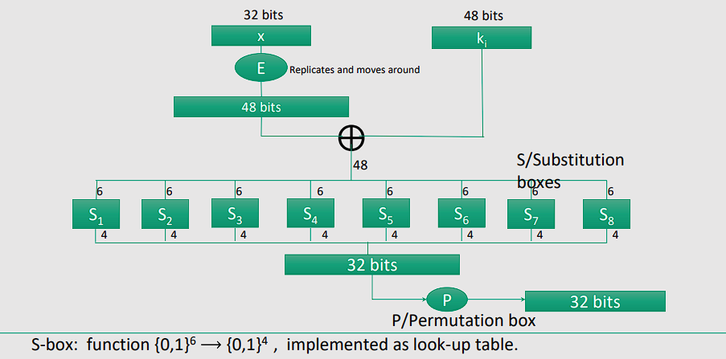
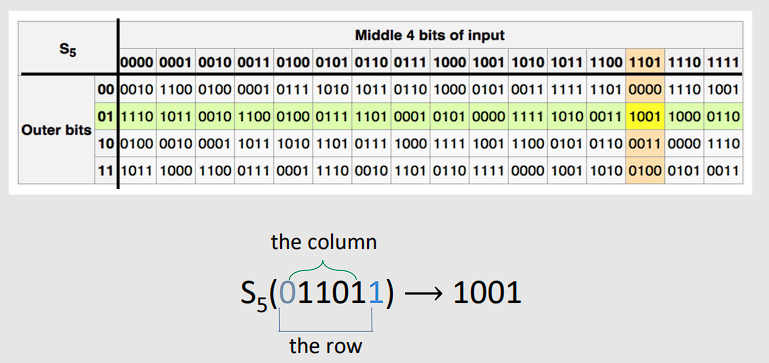

# Block Ciphers

## 1 ⋅ Introduzione

Le slide si possono trovare [qui](https://virtuale.unibo.it/pluginfile.php/1991295/mod_resource/content/1/Lecture%203%20-%20Block%20Ciphers.pdf).

Questo documento presenta i seguenti argomenti:
- Block ciphers
- Pseudo Random Functions (PRFs)
- Pseudo Random Permutations (PRPs)
- DES - Data Encryption Standard
- AES - Advanced Encryption Standard

## 2 ⋅ Block Ciphers

### 2.1 ⋅ Introduzione

Possiamo immaginare di avere un **PT Block** (Plain Text Block) e un **CT Block** (Cipher Text Block) di dimensione fissa, che rimane costante (siano $n$ bits).

Si passa da uno all'altro utilizzando una chiave $Key$ di dimensione $k$ bits. Questa dimensione dipene dall'algoritmo di cifratura usato, per esempio DES usa un blocco di 64 bits e una chiave di 56 bits, mentre AES usa un blocco di 128 bits e chiavi di 128, 192 o 256 bits.

### 2.2 ⋅ Introduzione a Block Ciphers iterativi

Questi sono cipher che prendono il blocco in input e applicano la chiave $k$, dopo averla espansa in tante chiavi $k_i$.

$m$, ovvero il messaggio, passerà per tante $R(k_i,m_{i-1})$, chiamate **round function**.

Per esempio, $3DES$ ha 48 round, mentre $AES-128$ ha 10 round.

### 2.3 ⋅ Prestazioni

Da notare che la performance degli stream cipher è molto più alta rispetto ai block cipher. Si passa da 727 MB/s nel caso di Sosemanuk, che è un tipo di stream cipher, a 109 MB/s nel caso di AES-128.

## 3 ⋅ PRPs e PRFs

### 3.1 ⋅ Definizioni 

Una **Pseudo Random Function** (PRF) definita su $(K,X,Y)$ è una funzione $F:K \times X \rightarrow Y$ tale che esiste un algoritmo efficiente per calcolare $F(k,x)$ per ogni $k \in K$ e $x \in X$.

Una **Pseudo Random Permutation** (PRP) definita su $(K,X)$ è una funzione $E : K \times X \rightarrow X$ tale che:
- Esiste un algoritmo efficiente e **deterministico** per calcolare $E(k,x)$
- La funzione $E(k,\cdot)$ è invertibile (biunivoca, ovvero per ogni $x$ esiste un solo $y$ e viceversa)
- Esiste una algoritmo efficiente per calcolare $E^{-1}(k,y)$ (Anche scritto $D(k,y)$ in quanto è decrittazione)

Da notare che una PRP è anche una PRF, ma non il contrario.

Una PRP è una PRF dove $X=Y$ ed è invertibile in modo efficiente.

### 3.2 ⋅ Secure PRFs

Sia $F : K \times X \rightarrow Y$ una PRF. Impostiamo innanzitutto delle notazioni:
- $Funs[X,Y]$ è l'insieme di tutte le funzioni da $X$ a $Y$
- $S_F = \{F(k,\cdot) : k \in K\} \subseteq Funs[X,Y]$
  - Questo è l'insieme delle funzioni generate da $F$ con tutte le chiavi possibili
  - Mentre $Funs[X,Y]$ è l'insieme di tutte le funzioni possibili a parte dallo stesso superset delle chiavi per raggiungere qualsiasi possibile risultato

Intuizione della definizione:
- Una PRF è **sicura** se una funzione scelta casualmente da $Funs[X,Y]$ è indistinguibile da una funzione casuale in $S_F$.

Da notare che $S_F$ ha dimensione $|K|$. D'altro canto, $Funs[X,Y]$ ha dimensione $|X|^{|Y|}$.

#### 3.2.1 ⋅ Definizione di PRF sicura

Consideriamo una PRF $F:K \times X \rightarrow Y$. Per $b = 0,1$ definiamo l'esperimento $EXP(b)$ come:
- Mandiamo dei messaggi $x_1, \dots, x_q$ ad uno sfidante $f$ che, preso il messaggio, ci calcola una delle seguenti:
  - $b = 0; f \leftarrow F(k,\cdot)$
  - $b = 1; f \leftarrow Funs[X,Y]$
- Poi rimanda indietro il messaggio  calcolato $f(x_1)$.
- A questo punto l'avversario $A$ deve calcolare $b'$ e cercare di azzeccare la $b$ usata da $f$.

Definiamo una PRF sicura come:
> $F$ è una **PRF sicura** se per ogni avversario efficiente $A$, abbiamo che:
>
> $$
> Adv_{PRF}[A,F] := |Pr[EXP(0) = 1] - Pr[EXP(1) = 1]| \leq negl(n)

### 3.3 ⋅ Secure PRPs

Sia $E : K \times X \rightarrow X$ una PRP. Impostiamo delle notazioni:
- $Perms[X]$ è l'insieme di tutte le funzioni da $X$ a $X$ che sono biunivoche (ovvero, l'insieme di tutte le possibili permutazioni)
- $S_E = \{E(k,\cdot) : k \in K\} \subseteq Perms[X]$

Intuizione della definizione:
- Una PRP è **sicura** se una permutazione scelta casualmente da $Perms[X]$ è indistinguibile da una permutazione casuale in $S_E$.

#### 3.3.1 ⋅ Definizione di PRP sicura

Consideriamo una PRP $E:K \times X \rightarrow X$. Per $b = 0,1$ definiamo l'esperimento $EXP(b)$ come:
- Mandiamo dei messaggi $x_1, \dots, x_q$ ad uno sfidante $f$ che, preso il messaggio, ci calcola una delle seguenti:
  - $b = 0; f \leftarrow E(k,\cdot)$
  - $b = 1; f \leftarrow Perms[X]$
- Poi rimanda indietro il messaggio  calcolato $f(x_1)$.

Definiamo una PRP sicura come:
> $E$ è una **PRP sicura** se per ogni avversario efficiente $A$, abbiamo che:
>
> $$
> Adv_{PRP}[A,E] := |Pr[EXP(0) = 1] - Pr[EXP(1) = 1]| \leq negl(n)

## 4 ⋅ DES

Nel 1976 il NIST ha scelto il DES come standard per la cifratura dei dati. Questo è un algoritmo iterativo a blocchi con una chiave di 56 bits e un blocco di 64 bits.

Nel 1997 è stato dimostrato che il DES non è più sicuro, quindi è stato sostituito dal AES nel 2000.

### 4.1 ⋅ DES - Feistel Network

Siano date un insieme di funzioni $f_1, ... f_d: \{0,1\}^n \rightarrow \{0,1\}^n$ (non necessariamente invertibili).

**Obbiettivo**: trovare una funzione **invertibile** $F: \{0,1\}^{2n} \rightarrow \{0,1\}^{2n}$ tale che usi queste funzioni.

Come si fa?

**Possiamo dimostrare** che per un set arbitrario di funzione, esiste un Feistel network che è invertibile. (Questo lo descriveremo in seguito).

I Feistel network sono molto usati in crittografia e in generale per i block cipher, per esempio in DES, ma non vengono usati per esempio da AES.

### 4.2 ⋅ DES - Struttura

Prendiamo l'input di $2n$ bit, lo dividiamo in due parti di $n$ bit ciascuna (chiamate $R_0$ e $L_0$), e poi facciamo:
- $R_i = f_i(R_{i-1}) \oplus L_{i-1}$
- $L_i = R_{i-1}$

E, al contrario in quanto è invertibile, abbiamo:
- $R_{i-1} = L_i$
- $L_{i-1} = f_i(L_{i-1}) \oplus R_{i-1}$

### 4.3 ⋅ DES - 16 round Feistel network

L'input è un blocco di `64 bit`, la chiave è di `56 bit` e il blocco di output è di `64 bit`.

La chiave viene espansa in `16` chiavi di `48 bit` ciascuna. Queste chiavi vengono usate per creare le funzioni $f_i$:

$$
f_1,...,f_{16} : \{0,1\}^{32} \to \{0,1\}^{32} \quad, \quad f_i(\cdot) = F(k_i,\cdot)
$$

#### 4.3.1 ⋅ La funzione F

La funzione $f_i(x) = F(k_i,x)$ funziona nel modo seguente:

La spiegazione è:
- $x$ viene espansa in `48 bit`
- Viene fatta una XOR con la chiave $k_i$
- Il risultato viene spezzato in `8 blocchi` da `6 bit` ciascuno, i quali vengono passati attraverso delle `S-boxes`
- Queste restituiscono `4 bit` ciascuna
- Combinando il risultato usando $P$, ovvero un permutation box, otteniamo il risultato finale
  - Il funzionamento di $P$ è simile a quello delle S-boxes, ma è una permutazione

Le `S-boxes`, ovvero substitution boxes, sono delle tabelle di sostituzione che prendono in input `6 bit` e restituiscono `4 bit`.

Funzionano nel seguente modo:

Essenzialmente vanno a prendere i bit esterni per capire la riga e i bit interni per capire la colonna. Questo ci permette di avere una sostituzione non lineare.

#### 4.3.2 ⋅ Scelta di S-boxes e P-box

Da notare che la scelta di queste parti non può essere fatta in modo random, in quanto risulterebbe in un algoritmo non sicuro.

Pertanto vengono fatte diverse scelte per rendere l'algoritmo sicuro nella scelta delle S-boxes e delle P-boxes:
- Nessun output dovrebbe essere simile ad una funzione lineare per i bit di input.
- Gli S-Boxes sono mappe 4 a 1, ovvero ci sono 4 pre-immagini per ogni output
  - Questo è importante per evitare attacchi di tipo *differenziale*
- ...

### 4.4 ⋅ DES - Exhaustive search

Obbiettivo: date alcune coppie di input ed output $(m_i, c_i = E(k,m_i)), i=1,...,3$ trovare la chiave $k$.

#### 4.4.1 ⋅ Lemma

Suppobniamo **DES** sia un ***ideal cipher*** (ci siano $2^{56}$ funzioni invertibili $\Pi_1, ..., \Pi_{2^{56}} : \{0,1\}^{64} \to \{0,1\}^{64}$).

Allora $\forall m, c$ c'è al massimo ***una*** chiave $k$ tale che $c = DES(k,m)$, con probabilità $\geq 1 - 1/256 \approx 99.5%$

Dimostrazione:

$$
Pr[\exists k' \neq k : c=DES(k,m)=DES(k',m)] 
\\ \ \\
\leq \sum_{k'\in {0,1}^{56}} Pr[DES(k',m) = c] 
\\ \ \\
\leq 2^{56} \cdot 2^{-64} = 2^{-8} = 1/256
$$

Spiegazione:
- La prima disuguaglianza è data dal fatto che se esiste una chiave diversa da $k$ che mappa $m$ in $c$, allora la probabilità che $c$ sia mappato da una di queste chiavi è al massimo $1/256$.
- La seconda disuguaglianza è data dal fatto che ci sono $2^{56}$ chiavi possibili e la probabilità che una di queste mappi $m$ in $c$ è $2^{-64}$.
  - Questo perché ci sono $2^{64}$ possibili output e $2^{64}$ possibili input, quindi la probabilità è $2^{-64}$.

Date 2 paia di DES $(m_1, c_1 = DES(k, m_1)), (m_2, c_2 = DES(k, m_2))$ abbiamo una probabilità che siano unici del $\approx 1 - 1/2^{8}$.

Per AES, date due paia di input/output, la probabilità che siano uniche è di $\approx 1 - 1/2^{128}$.

Pertanto notiamo che due paia di input/output sono abbastanza per identificare la chiave, usando l'"exhaustive key search".

#### 4.4.2 ⋅ Sicurezza di DES

Si dimostra, negli anni, che DES è molto facile da attaccare:
- 1997: internet search - 3 mesi
- 1998: EFF machine - 3 giorni (con 2200 CPU)
- 1999: combined search - 22 ore (con 10000 CPU)
- 2006: COPACOBANA - 7 giorni

E così via, oggigiorno si può fare in pochi secondi con un computer sufficientemente potente. (E in pochi giorni con un qualsiasi computer)

In sostanza, 56-ciphers non dovrebbero essere usati.

Prima di passare ad AES, ci sono state due evoluzioni di DES (importanti da notare in quanto la loro costruzione può essere applicata anche ad altri block-cipher):
- 3DES (Triple DES)
- DESX

#### 4.4.3 ⋅ Triple DES

Consideriamo il **block cipher** con $E : K \times M \to M$ e $D : K \times M \to M$.

Definiamo $3E: K^3 \times M \to M$ come:

$$
3E(k_1, k_2, k_3, m) = E(k_1, D(k_2, E(k_3, m)))
$$

Per **3DES** abbiamo che:
- La lunghezza della chiave è di `168 bit` (56 bit per chiave e 3 chiavi)
- L'algoritmo è 3 volte più lento di quello di DES
- $k_1 = k_2 = k_3 \to$ singolo DES
- Tempo di un attacco: $\approx 2^{118}$ 

#### 4.4.4 ⋅ Doppio DES e MITM attack

Perché non usiamo **2DES**?

Dato un block cipher $E$, definiamo $2E(k_1, k_2, m) = E(k_1, E(k_2, m))$.

Andiamo a fare un attacco del tipo:
- Ci siano $m$ e $c$ per i quali noi dobbiamo trovare $(k_1, k_2)$ tali che:
  - $c = 2E(k_1, k_2, m) = E(k_1, E(k_2,m))$
  - *oppure, in modo equivalente*
  - $E(k_2, m) = D(k_1, c)$

L'attacco è formato da 2 step:
- Prima genero una tabella con $2^{56}$ entries, dove per ogni $k_i$ calcolo $E(k_i, m)$
  - Vado a ordinarle in base alla seconda colonna, ovvero in base ad $E(k_i, m)$
- Per ogni $k\in \{0,1\}^{56}$ fai:
  - Controlla se $D(k, c)$ è nella seconda colonna della tabella
  - Se sì, allora $E(k^i,m) = D(k,c) \Rightarrow (k^i,k) = (k_2, k_1)$

Questo attacco è chiamato **Meet-in-the-middle**.

Spiegazione più intutiiva:
- Il primo step è crearti una tabella ordinata in modo da poter fare una ricerca binaria del testo cifrato per ogni tipo di chiave
- Il secondo step è andare a fare, per ogni chiave, una ricerca binaria per trovare il testo cifrato
- Una volta trovato, hai trovato entrambe le chiavi, senza dover cercare ogni singola possibile combinazione, che sarebbe $2^{112}$.

Il tempo è di:

$$
\underbrace{2^{56} log(2^{56})}_{\text{build + sort table}} + \underbrace{2^{56} log(2^{56})}_{\text{search table}} < 2^{63} \ll 2^{112}
$$

Spazio occupato è di $\approx 2^{56}$

Questo tipo di attacco si può fare anche su `3DES`, anche se non è così efficiente: migliora il tempo da $2^{118}$ a $2^{112}$, con uno spazio di $2^{56}$.

Praticamente: deve provare tutte le chiavi da una parte, e si organizza le chiavi dall'altra. Quindi il bottleneck è il fatto di dover provare tutte le chiavi possibili di 2 DES, che è di complessità $2^{112}$.

#### 4.4.5 ⋅ DESX

Consideriamo il **block cipher** con $E : K \times M \to M$ e $D : K \times M \to M$.

Definiamo **EX** come:

$$
EX(k_1, k_2, k_3, m) = k_1 \oplus E(k_2, m \oplus k_3)
$$

Per **DESX** abbiamo in particolare:
- La chiave è lunga `64+56+64 = 184 bit`
- Ma è facile da attaccare con tempo di $2^{120}$

Da notare che usare gli XOR solo dentro o fuori non è sicuro per niente, è tanto debole quanto $E$ con una ricerca di chiave esaustiva.

### 4.5 ⋅ DES - Conclusioni

Attacchi lineari su DES sono stati scoperti, in quanto $S_5$ portava ad un attacco in tempo $2^{43}$.

Inoltre, attacchi con computer quantistici che usano l'algoritmo di Grover possono ridurre il tempo di ricerca della chiave alla sua radice quadrata, passando da $O(|X|)$ per il miglior algoritmo classico, a $O(|X|^{1/2})$ per l'algoritmo quantistico.

## 5 ⋅ AES

**NIST** (National Institute of Standards and Technology) pubblica una richiesta per superare il DES come algoritmo nel 1997. Nel 1998 vengono selezionati 15 algoritmi, e nel 2000 viene scelto l'AES, ovvero il Rijndael.

Ha diverse caratteristiche che sarebbe bene notare:
- **Non è** un Feistel cipher, ma funziona in modo parallelo su tutto il blocco in input. 
- Fatto appositamente per essere efficiente
- Funziona in modo iterativo:
  - Block size può essere di 128, 192 o 256 bits
  - La lunghezza della chiave può essere di 128, 192 o 256 bits
  - Il numero di round può essere di 10, 12 o 14
- Ogni round, tranne l'ultimo, è fatto da una composizione parallela di 4 step:
  - **SubBytes** (Sostituzione byte a byte usando una $S$-box)
  - **ShiftRows** (Shift dei byte in ogni riga)
  - **MixColumns** (Operazione di moltiplicazione per una matrice)
  - **AddRoundKey** (XOR con la chiave di round, ovvero la chiave espansa)

### 5.1 ⋅ AES - Struttura

I parametri di AES sono i seguenti:

|  | Key length (Nk words) | Block Size (Nb words) | Number of Rounds |
|---|---|---|---|
| AES-128 | 4 | 4 | 10 |
| AES-192 | 6 | 4 | 12 |
| AES-256 | 8 | 4 | 14 |

Dove:
- **Key length** è la lunghezza della chiave in parole
  - Ogni parola è di 32 bit
- **Block Size** è la dimensione del blocco in parole
- **Number of Rounds** è il numero di round che vengono fatti

### 5.2 ⋅ AES - Chiavi

Con `128 bits` di chiave, abbiamo $3.4 \times 10^{38}$ chiavi possibili. Per contesto, un PC che prova $2^{55}$ chiavi al secondo avrebbe bisogno di $149'000$ miliardi di anni per trovare la chiave.

Con `192 bits` di chiave, abbiamo $6.2 \times 10^{57}$ chiavi possibili, con `256 bits` abbiamo $1.1 \times 10^{77}$ chiavi possibili.

Sulle slide poi vengono mostrati un po i funzionamenti delle varie parti in modo schematico.

I migliori possibili attacchi, leggermente migliori del brute force, richiedono comunque $2^{99}$ input/output pairs e possono recuperare la chaive in $2^{99}$ operazioni, che comunque non è ideale.