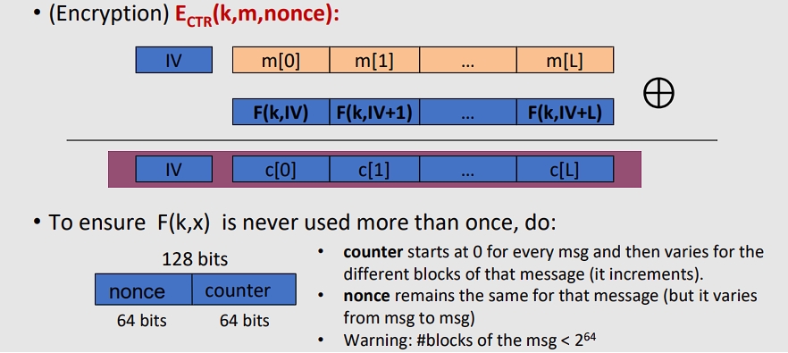

# Modes of operation (using block ciphers)

## 1 ⋅ Introduzione

Andremo a parlare dei seguenti argomenti:
- One-Time Key
  - Semantic Security
  - Electronic Code Book (ECB)
  - Deterministic Counter Mode (DETCTR)
- Many-Time Key
  - Semantic Security for Many-Time Key
  - Semantic security under Chosen-Plaintext Attack (CPA)
  - Cipher Block Chaining (CBC)
    - Randomized
    - Nonce-based

## 2 ⋅ Ripasso veloce

### 2.1 ⋅ Block Ciphers

Viene dato un blocco di `n bits`, una chiave di `k bits` e si ottiene un CT block di `n bits`.

Block Ciphers:
- $E: \{0,1\}^n \times \{0,1\}^k \rightarrow \{0,1\}^n$
- $D: \{0,1\}^n \times \{0,1\}^k \rightarrow \{0,1\}^n$

Esempi tipici di Block Ciphers:
- DES
  - $n = 64$
  - $k = 56$
- 3DES
  - $n = 64$
  - $k = 168$
- AES
  - $n = 128$
  - $k = 128, 192, 256$

### 2.2 ⋅ PRPs e PRFs

- **Pseudo Random Functions (PRFs)**
  - Definite su $(K,X,Y)$ nel seguente modo: $F: K \times X \to Y$, tali che esiste un algoritmo "efficiente" per calcoalre $F(k,x)$ per ogni $k \in K$ e $x \in X$.
- **Pseudo Random Permutations (PRPs)**
  - Definite su $(K,X)$ nel seguente modo: $E: K \times X \to X$;
  - Tali che:
    - Esista un algoritmo "efficiente" e **deterministico** per calcolare $E(k,x)$ per ogni $k \in K$ e $x \in X$;
    - La funzione $E(k,\cdot)$ sia una permutazione per ogni $k \in K$. (Sia biunivoca / one-to-one)
    - Vi sia un algoritmo efficiente per l'inversione di $E(k,\cdot)$, ovvero per calcolare $D(k,y)$ per ogni $k \in K$ e $y \in X$.

### 2.3 ⋅ Utilizzo dei Block ciphers

Andremo a non considerare come funzionano internamente AES e 3DES, ma assumeremo che entrambi siano **PRP** sicure e capiremo come usarle

Adesso andremo a vedere come usare i block cipher per messaggi che consistono di **più blocchi**.

## 3 ⋅ One-Time Key

### 3.1 ⋅ Obbiettivo

Il nostro obbiettivo è creare una cifratura sicura da una PRP sicura (per esempio AES).

In questa parte ce ne occuperemo andando ad usare una **one-time key**.

L'avversario ha:
- **Adversary's power**: L'avversario vede solo un ciphertext (one-time key)
- **Adversary's goal**: Capire informazioni del PT a partire dal CT (sicurezza semantica)

### 3.2 ⋅ Primo modo: ECB

Il primo modo di fare questo tipo di operazione sarebbe quello di usare l'**Electronic Code Book (ECB)**.

Consiste nel prendere l'intero messaggio, separarlo in blocchi e poi andare ad usare la stessa chaive per tutti i blocchi.

Il problema è che se due blocchi sono uguali, allora il CT sarà uguale, pertanto si possono andare a capire certe informazioni. Questo lo si può vedere molto bene da un immagine criptata usando questo tipo di metodo:

Crittoanalisi di ECB:
- **Deterministico**
  - Se due blocchi sono uguali, allora il CT sarà uguale
    - Rivela dei pattern quando si hanno dei messaggi con ripetizioni
  - Questo è lo stesso problema che avevamo con il cifrario di Vigenère
- ECB è semanticamente sicuro? **NO**

Essenzialmente, da **non usare il pratica**.

EBC **non è semanticamente sicuro** per messaggi che contengono **più di un blocco** (known-plaintext attack).

(Nelle slide viene fatto un esempio usando la sicurezza semantica, ovvero avere un Avversario $A$ e un Challenger. L'avversario manda due possibili messaggi, e il challenger li cripta. Poi l'avversario deve andare a guessare quale dei due messaggi gli è tornato: se è in grado di farlo, allora il sistema non è semanticamente sicuro. Nell'esempio gli manda "Hello World" e "Hello Hello", e se il messaggio fosse formato da 2 blocchi, allora saprebbe che se il primo blocco è uguale al secondo allora è il messaggio 2, pertanto non è semanticamente sicuro").

### 3.3 ⋅ Secondo modo: Deterministic Counter Mode (DETCTR)

Sia data la **PRF**: $F: K \times \{0,1\}^{n} \to \{0,1\}^n$ (Ovvero per esempio $n = 128$ e per AES). Questa PRF verra usata per andare a criptare il counter, usando la chiave, e poi fare una XOR con il messaggio.

Allora abbiamo $E_{\text{DETCTR}}(k,m)$ che:
- Fa una XOR tra ogni singolo blocco del messaggio con $F(k,ctr)$ ottenendo il CT

Si tratta quindi di uno stream cipher costruito da PRF.

La parte di decription si definisce su $D_{\text{DETCTR}}(k,c)$ come:
- Fa una XOR tra ogni singolo blocco del messaggio con $F(k,ctr)$ ottenendo il PT

Non c'è bisogno di invertire la F quando si va a fare la decription.

#### 3.3.1 ⋅ Sicurezza semantica

**Teorema**: Per ogni $L>0$,

Se $F$ è una **PRF sicura** su $(K,X,X)$ allora **DETCTR** è semanticamente sicuro su $(K,X^L,X^L)$.

In particolare, per ogni avversario efficiente $A$ che sta **attaccando DETCTR** c'è un efficiente $B$ che sta **attaccando $F$** tale che:

$$
Adv_{\text{SS}}[A, DETCTR] = 2 \cdot Adv_{\text{PRF}}[B,F]
$$

In particolare $Adv_{\text{PRF}}[B,F]$ è trascurabile (in quanto F è una PRF sicura), pertanto anche $Adv_{\text{SS}}[A, DETCTR]$ è trascurabile.

## 4 ⋅ Many-Time Key

Ha diversi casi d'uso, per esempio:
- **File systems**
- **IPsec**

Si tratta in generale di utilizzare la stessa chiave per andare a fare l'encryption di più messaggi. 

### 4.1 ⋅ Semantic Security for Many-Time Key

Il fatto che noi usiamo **la stessa chaive più volte** $\implies$ l'avversario vede molte CT con la stessa chiave (ovvero usata per **più messaggi**)

L'avversario ha:
- **Adversary's power**: **$\text{Chosen-Plaintext Attack}$** (CPA)
  - L'avversario può ottenere l'encription di messaggi scelti da lui (modo conservativo di modelling rispetto alla realtà)
- **Adversary's goal**: rompere la sicurezza semantica

Come andiamo a controllare la sicurezza semantica di una Many-Time Key? (CPA security).

Lo definiamo nel seguente modo:

Quindi noi possiamo scegliere di mandargli un insieme di $q$ coppie di messaggi, $(m_{1,0},m_{1,1}), \ldots, (m_{q,0},m_{q,1})$. L'avversario poi li va a criptare e ce li manda indietro. Noi dobbiamo andare ad indovinare quale è il messaggio che ci è stato mandato.

Se però non viene fatto nulla per cambiare il messaggio da una volta ad un altra, allora nella prima coppia si può mandare $(m_0, m_0)$, quindi si sa quale è il messaggio $m_0$ cifrato, e poi se si manda $(m_0, m_1)$, allora si sa quale è il messaggio $m_1$ cifrato e quale è l'$m_0$ cifrato. Pertanto a qeusto punto non c'è più sicurezza semantica. L'esempio è il seguente:

Essenzialmente:
- Se la stessa chaive è usata per più volte $\implies$ *Dato lo stesso plaintext due volte*, **l'encryption deve produrre due diversi risultati**

Come andiamo a fare questo?

### 4.2 ⋅ Nonce-based Encryption

Possiamo andare ad usare un valore $n$ (nonce) che:
- Cambia per ogni singolo messaggio
- La coppia $(k,n)$ non è **mai usata per più di una volta**
- $n$ **non** deve essere un **segreto** e **non** deve essere **casuale**

Pertanto il nonce si può mandare il plaintext al nostro destinatario, insieme al ciphertext, senza creare ulteriori problemi di sicurezza.

L'esempio è:

Ci sono due metodi per generare i nonce:
- **Counter**
  - Usato quando l'encryptor mantiene uno stato da messaggio a messaggio
  - Per esempio potrebbe essere il packet counter
  - Se il decryptor mantiene lo stesso stato, allora si può anche non trasmettere il nonce con il CT
- **Random**
  - Un caso di uso è più dispositivi che vanno a criptare con la stessa chiave
  - Il nonce è generato casualmente, $n \leftarrow \mathcal{N}$, con $\mathcal{N}$ che è un insieme di valori possibili, il quale deve essere sufficientemente grande da garantire che lo stesso nonce non sia scelto due volte con un alta probabilità.

L'utilizzo del nonce è **semanticamente sicuro**.

Per verificare la sicurezza semantica del nonce si usa il seguente modo:

## 5 ⋅ Cipher Block Chaining (CBC)

Andiamo a creare una **PRP** $E: K \times \{0,1\}^n \to \{0,1\}^n$.

L'encryption viene fatta usando un **IV** casuale $\in \{0,1\}^n$, e viene fatta nel seguente modo:

Poi viene invertito nel usando un algoritmo di inversione di $E$, che è $D : K \times \{0,1\}^n \to \{0,1\}^n$.

La decryption avviene nel seguente modo:

### 5.1 ⋅ Sicurezza semantica

**Teorema**

> Per ogni $L>0$ (lunghezza del messaggio che stiamo cifrando)
>
> Se $E$ è una **PRP sicura** su $(K,X)$, allora **CBC* è **semanticamente sicura su CPA** su $(K,X^L, X^{L+1})$.**

In particolare per ogni avversario $A$ che fa *$q$-query* attaccando **CBC** c'è un avversario efficiente $B$, con *PRP*, che attacca $E$ tale che:

$$
Adv_{\text{CPA}}[A, CBC] \leq 2 \cdot Adv_{\text{PRP}}[B,E] + \frac{2 \cdot q^2 L^2}{|X|}
$$

**NOTA**

CBC è solo sicura finche **$q^2L^2 \ll |X|$ (il termine di errore dovrebbe essere trascurabile)

#### 5.1.1 ⋅ Esempio per capire meglio quest'ultima cosa

Riportiamo la formula che abbiamo ottenuto prima:

$$
Adv_{\text[CPA]}[A,CBC] \leq 2 \cdot Adv_{\text{PRP}}[B,E] + 2 \cdot q^2 L^2 / |X|
$$

Dove:
- $q:=\#$ messaggi criptati con la stessa chiave $k$, 
- $L:=$ lunghezza massima di un messaggio in blocchi

Supponiamo di volere $Adv_{\text{CPA}}[A,CBC] \leq 1/2^{32}$, questo vuol dire che $q^2 L^2 / |X| < 1/2^{32}$.

Abbiamo per esempio che:
- Con **AES**
  - $|X|=2^{128} \implies qL < 2^{48}$
  - Quindi dopo $2^{48}$ blocchi di AES, dobbiamo cambiare chiave
    - Questo equivale a circa $2^{48} \cdot 16 \text{ bytes} = 2^{51} \text{ bytes} = 2 \text{ PB}$
- Con **3DES**
  - $|X| = 2^{64} \implies qL < 2^{16}$
  - Quindi, dopo $2^{16}$ blocchi di DES, dobbiamo cambiare chiave
  - Questo equivale a circa 0.5 MB, quindi davvero poco.

### 5.2 ⋅ Randomized CBC

Da notare che se IV non è effettivamente casuale, allora CBC non è semanticamente sicura. **IV** non deve essere **predictable**.

L'esempio viene fatto in seguito:

Praticamente:
- Prima mandi un messaggio "vuoto" e vedi come viene criptato
- Poi mandi un secondo messaggio dove composto sia dall'IV precedente che da quello attuale in XOR
- Le due cose si annullano, quindi ti rimane solo il messaggio criptato prima
- Quindi sai esattamente quale è il messaggio
- Quindi puoi prenvedere se il messaggio è davvero quello o no

### 5.3 ⋅ Nonce-based CBC

Possiamo andarlo a creare usando un nonce piuttosto, quindi andare ad avere una chiave composta da $(k,n)$.

Ogni paio di $(k,n)$ non deve essere usato più di una volta.

L'encryption avviene nel seguente modo:

La decryption invece avviene nel seguente modo:

## 6 ⋅ Counter Mode (CTR)

### 6.1 ⋅ Randomized CTR

Viene creata una **PRF** $F: K \times \{0,1\}^{n} \to \{0,1\}^{n}$, che verrà usata per criptare   il messaggio.

Viene usato anche un **IV** casuale $\in \{0,1\}^n$, ovvero un **initialization vector**, il quale verrà utilizzato per creare un **nonce**.

L'encryption viene fatta nel seguente modo:

Questo processo può avvenire in modo parallelo, a differenza di CBC, quindi può essere più efficiente

**IV** viene scelto a caso **per ogni messaggio**.

La decryption avviene nel seguente modo:

Da notare che non è necessario andare ad invertire la $F$ per la decryption.

### 6.2 ⋅ Nonce-based CTR

Si prende una **PRF** $F: K \times \{0,1\}^{n} \to \{0,1\}^{n}$, e si va a creare un **nonce** $n$.

L'encryption avviene nel seguente modo:

