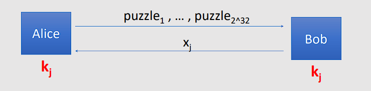

# Key Exchange

## 1 ⋅ Introduzione

Andremo a discutere i seguenti argomenti:
- **Trusted Third Parties**
- **Merkle Puzzles**
- Il **Diffie-Hellman Protocol**

## 2 ⋅ Trusted Third Parties

Il problema che questo sistema va a risolvere è il salvataggio di tante chiavi per ogni persona. Essenzialmente, se ci fosse una copertura a maglia completa, ognuno dovrebbe avere $O(n)$ chiavi, per un totale di $O(n^2)$ chiavi in circolazione memorizzate.

Una migliore soluzione è quella di utilizzare una TTP, in modo che ogni utente si debba ricordare solo **una** chiave, ovvero la propria chiave per poter comunicare con la TTP.

### 2.1 ⋅ Esempio di uso semplificato

Immaginiamo che Alice e Bob vogliano comunicare, ovvero vogliano stabilire una chiave segreta tra loro 2. Allora:
1. Alice farà la richiesta alla TTP, usando la chiave $K_{A}$, dicendo che vuole comunicare con Bob
2. La TTP crea un ticket che contiene il messaggio con "Alice,Bob" e la chiave $K_{AB}$
3. Manderà questo ticket cifrato ad Alice con la chiave $K_{A}$ e gli manderà la versione cifrata con la chiave $K_{B}$ sempre ad Alice.
4. Alice si occuperà di mandare questo secondo ticket a Bob, che potrà decifrarlo con la sua chiave $K_{B}$.

Tutto questo assumendo che possiamo andare a cifrare le cose in modo sicuro.

Da notare che **TTP** sarà necessario per ogni scambio di chiave, e che conoscerà tutte le chiavi di sessione che verranno create.

Ma possiamo andare a scambiare chiavi senza la necessità di una TTP?

La risposta è sì, è il punto di inizio della crittografia a chiave pubblica:
- **Merkle Puzzles** (1974)
- **Diffie-Hellman Protocol** (1976)
- **RSA** (1977)
- ...

## 3 ⋅ Merkle Puzzles

### 3.1 ⋅ Idea

**Obbiettivo**: Alice e Bob vogliono condividere una chiave, in modo che un eavesdropper non la possa conoscere.

Deve essere sicura solo contro **l'eavesdropper passivo** (quindi non ci preoccupiamo di tampering o message injection).

Si può fare usando un generico algoritmo simmetrico?

La risposta è sì, però **è molto inefficiente**.

### 3.2 ⋅ Implementazione

Si utilizzano dei **puzzle**, definiti come "problemi che si possono risolvere con un certo livello di impegno".

Per esempio:
- Sia $E(k,m)$ un cifratore simmetrico con $k\in\{0,1\}^{128}$
- $\text{Puzzle}:=E(P, "message")$ dove $P = 0^{96} || b_1...b_{32}$
- Per risolvere un puzzle, $P$ deve provare tutte e $2^{32}$ le possibilità di $b$.

Quello che succede è:
- **Alice**
  - Prepara $2^{32}$ puzzle
    - Per $i=0,...,2^{32}$, scegli una $P_i \in \{0,1\}^{32}$ casuale e $x_i, k_i\in \{0,1\}^{128}$ casuali, tali che $\forall i,j \ x_i \neq x_j$
    - Imposta $\text{puzzle}_i = E( 0^{96} || P_i, \text{"Puzzle \# "} || x_i || k_i)$
  - Manda i $puzzle_1,...,puzzle_{2^{32}}$ a Bob
- **Bob**
  - Scegli a caso un **puzzle_j** e lo risolve usando **brute-force**
  - Ottiene $(x_j,k_j)$ e usa $k_j$ come segreto condiviso
  - Invia $x_j$ ad Alice.
- **Alice**
  - Ricerca il puzzle con il numero $x_j$
  - Usa $k_j$ come segreto condiviso

Notiamo che se qua ci fosse una persona in mezzo che non è unicamente passiva allora si rompe molto facilmente: è debole a MITM attacks.

Il lavoro svolto è:
- Per Alice è di $O(2^{32})$, in quanto deve preparare $2^{32}$ puzzle
  - In generale $O(n)$
- Per Bob è di $O(2^{32})$, ovvero il lavoro di risolvere un puzzle
  - In generale $O(n)$
- Un eavesdropper ha $O(2^{64})$ come lavoro da svolgere, ovvero risolvere tutti i puzzle
  - In generale, è $O(n^2)$
  - Questo succede in quanto non sa quale è il puzzle scelto da Bob.

Non sappiamo se possiamo ottenere un gap computazionale maggiore tra le due operazioni (quella di Bob e quella dell'eavesdropper).

## 4 ⋅ Diffie-Hellman Protocol

### 4.1 ⋅ Idea

**Obbiettivo**: condividere la chiave tra Alice e Bob creando un gap esponenziale con l'eavesdropper.

(Da notare che anche qua vogliamo farlo stando attenti solo all'eavesdropping e non al tampering o al message injecting).

L'idea ad alto livello che vogliamo implementare è la seguente:
- Alice e Bob *non hanno condiviso alcuna informazione segreta a priori*
- Alice e Bob si scambiano dei messaggi
- Dopodiché, Alice e Bob sono d'accordo su una chiave segreta $k$
- $k$ è sconosciuta ad un ascoltatore (eavesdropper / Eve)

### 4.2 ⋅ Implementazione

L'idea implementativa è basata sul **Discrete Logarithm Problem**:
- Dati:
  - $g, p, g^k \ \text{mod} \ p$
- Trovare:
  - $k$

Il protocollo funziona nel seguente modo:
- Si fissa un numero primo molto grande $p$ (per esempio di 600 cifre)
- Si fissa un integer $g\in\{2,...,p-2\}$ 
- Alice sceglie $a\in\{1,...,p-2\}$ casualmente e manda $g^a \text{ mod } p$ a Bob
- Bob sceglie $b\in\{1,...,p-2\}$ casualmente e manda $g^b \text{ mod } p$ ad Alice.
- Alice e Bob computano $(g^b)^a \text{ mod } p = g^{ab} \text{ mod } p = (g^a)^b \text{ mod } p$
- Alice e Bob adesso condividono la chiave segreta $g^{ab} \text{ mod } p$

Un eavesdropper vede unicamente $p,g, g^b \text{ mod } p, g^a \text{ mod } p$. Può computare $g^{ab} \text{ mod } p$?

Lo può fare, però è un problema per cui la soluzione più ottimale è esponenziale:
- Sia il numero primo $p$ di lunghezza $n$ bit
  - Il miglior algoritmo (General number field sieve: GNFS) ha un costo computazionale esponenziale in $n$: $\text{exp}(\tilde{O}(\sqrt[3]{n}))$

Da notare che però questo protocollo non è sicuro contro **attaccanti attivi**: MiTM funziona in modo eccellente, se ci si interpone tra i due nodi comunicanti e si fa da *relayer* dei messaggi da parte a parte.