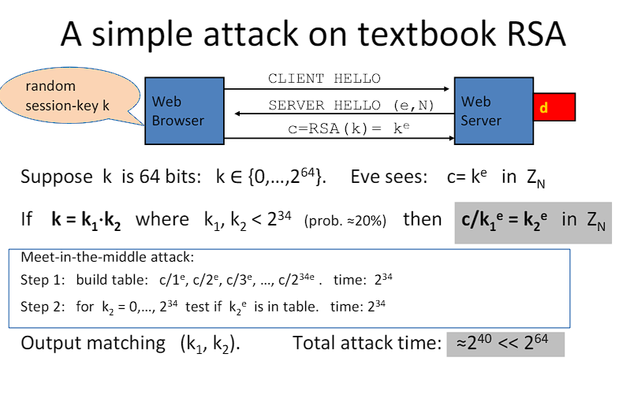

# RSA

## 1 ⋅ Riassunto del funzionamento di RSA base

RSA è un algoritmo di crittografia asimmetrica, ovvero che utilizza due chiavi diverse per cifrare e decifrare i messaggi. Queste due chiavi sono chiamate chiave pubblica e chiave privata. La chiave pubblica è utilizzata per cifrare i messaggi, mentre la chiave privata è utilizzata per decifrarli.

Il modo di funzionamento è il seguente:
1. Si generano due numeri primi molto grandi, $p$ e $q$
2. Si definisce $n=p \cdot q$. Questo numero sarà di `1024 bit` o `2048 bit` a seconda della sicurezza che si vuole ottenere (Pertanto $p\approx q \approx \sqrt{n}$)
3. Si calcola $\phi(n)=(p-1)(q-1)$
4. Si sceglie un numero $e$ tale che $1<e<\phi(n)$ e $mcd(e,\phi(n))=1$
5. Si calcola $d$ tale che $d \cdot e \equiv 1 \mod \phi(n)$
6. La chiave pubblica sarà $(n,e)$ e la chiave privata sarà $(n,d)$
7. Per cifrare un messaggio $m$ si calcola $c=m^e \mod n$
8. Per decifrare un messaggio cifrato $c$ si calcola $m=c^d \mod n$

## 1.1 ⋅ Esempio di cifratura e decifratura

Supponiamo di scegliere come numeri primi $p=11$ e $q=13$. Allora abbiamo $n=11 \cdot 13 = 143$ e $\phi(n)=(11-1)(13-1)=120$.

Scegliamo $e=7$ e calcoliamo $d$ tale che $7 \cdot d \equiv 1 \mod 120$. In questo caso $d=103$.

Pertanto le chiavi sono:
- Chiave pubblica: $(143,7)$
- Chiave privata: $(143,103)$

Supponiamo di voler cifrare il messaggio $m=9$. Allora $c=9^7 \mod 143 = 48$, mentre per decifrare il messaggio cifrato $c=48$ si calcola $m=48^{103} \mod 143 = 9$.

> Si noti come cifrare sia molto più veloce che decifrare, in quanto il calcolo di $m^e$ è molto più veloce del calcolo di $c^d$.

## 2 ⋅ Introduzione

L'idea alla base di RSA, e in generale della crittografia asimmetrica, è quella di andare ad usare:
- Un a **chiave pubblica** per cifrare i messaggi da mandare ad un destinatario, la quale può essere conosciuta da chiunque
- Una **chiave privata** per decifrare i messaggi cifrati, la quale deve essere mantenuta segreta dal destinatario

La crittografia e la decrittografia funziona nel seguente modo:
- $E(\text{priv-key}_{\text{Alice}}, m) = c$ (Crittografia)
- $D(\text{pub-key}_{\text{Alice}}, c) = m$ (Decrittografia)

E anche:
- $E(\text{pub-key}_{\text{Alice}}, m) = c$ (Crittografia)
- $D(\text{priv-key}_{\text{Alice}}, c) = m$ (Decrittografia)

(Quest'ultima parte è importante per la firma digitale)

**NOTA**: importante ricordare, per il futuro di questi appunti, che si assume che **la chiave pubblica deve essere *autentica***. Se così non fosse, un attaccante potrebbe sostituire la chiave pubblica con una sua, e quindi potrebbe decifrare i messaggi cifrati.

## 3 ⋅ Public Key Encryption

### 3.1 ⋅ Definizione

**Bob**: genera la coppia $(p_k, s_k)$ e consegna $p_k$ ad **Alice**. Quindi $p_k$ è la chiave pubblica, mentre $s_k$ è la chiave privata.

> **Definizione**: un sistema di crittografia pubblico è formato da un insieme di 3 algoritmi: $(G, E, D)$:
> - $G()$: algoritmo di generazione delle chiavi (genera la coppia $(p_k, s_k)$)
> - $E(p_k, m)$: algoritmo di cifratura, prende in input un messaggio e la chiave e ne ritorna il testo cifrato $c \in C$
> - $D(s_k, c)$: algoritmo di decifratura, prende in input il testo cifrato e la chiave privata e ritorna il messaggio originale $m \in M$ oppure $\bot$
>
> Vale la **consistenza**, ovvero:
>
> $$
> \forall (p_k, s_k) \text{ generate da G }:
> \\ \ \\
> \forall m \in M: D(s_k, E(p_k, m)) = m
> $$

### 3.2 ⋅ Sicurezza semantica

Per $b = 0,1$ definiamo gli esperimenti $\text{EXP}(0)$ e $\text{EXP}(1)$ come:

In particolare, diciamo che:

$$
\mathbb{E} = (G,E,D) 
\\ \ \\
\text{ è sicuro semanticamente se }
\\ \ \\
\forall \text{ A efficiente }
\\ \ \\
\text{Adv}_{SS}[A,\mathbb{E}] = |Pr[\text{EXP}(0) = 1] - Pr[\text{EXP}(1) = 1]| < \text{negl}(n)
$$

Ovvero che non si possono distinguere i due esperimenti con una probabilità non trascurabile.

Oltre a sicuro semanticamente si dice anche che è IND-CPA (Indistinguishability under Chosen-Plaintext Attack).

### 3.3 ⋅ Confronto con la crittografia simmetrica

Da notare che nella crittografia simmetrica avevamo due nozioni, ovvero quella di *one-time security* e quella di *many-time security*. Abbiamo mostrato in quel caso che la *one-time security* **non** implica la *many-time security*.

Qua invece, per la crittografia asimmetrica, la *one-time security* **implica** la *many-time security* (segue dal fatto che l'attaccante può cifrare messaggi arbitrari). 

Da notare che la crittografia asimettrica **deve** essere randomizzata, altrimenti non sarebbe sicura.

### 3.4 ⋅ Chosen-Ciphertext Attack

Da notare che nella crittografia simmetrica, abbiamo lavorato per avere protezione contro gli attacchi *chosen-plaintext* ma non contro gli attacchi *chosen-ciphertext*. Questo perché, in generale, un attaccante **non può andare a generare un ciphertext** se non ha la chiave.

D'altro canto, nella crittografia asimmetrica, un attaccante può generare un ciphertext, e quindi è importante proteggersi anche contro gli attacchi *chosen-ciphertext*.

L'attacco viene definito come segue:

> **Definizione**: $\mathbb{E} = (G,E,D)$ è sicuro contro gli attacchi *chosen-ciphertext* se $\forall$ algoritmo efficiente $A$:
>
> $$
> \text{Adv}_{CCA}[A,\mathbb{E}] = |Pr[\text{EXP}(0) = 1] - Pr[\text{EXP}(1) = 1]| < \text{negl}(n)
> $$

##### Descrizione dell'attacco

- Viene consegnata la chiave pubblica $p_k$ all'avversario, colui che deve indovinare il bit $b$
- **CCA phase 1**: l'avversario può ottenere il messaggio di qualsiasi ciphertext che vuole dal challenger, ovvero colui che ha la chiave privata
- **Challenge**: vengono mandati due messaggi, $m_0$ e $m_1$, e viene ritornato un testo cifrato all'avversario
- **CCA phase 2**: l'avversario può ottenere il messaggio di qualsiasi ciphertext che vuole dal challenger, tranne quello del messaggio cifrato che gli è stato tornato

Ha pertanto un accesso continuo, sia prima che dopo, ad un oracolo di decrittazione. Questo non è però abbastanza per rompere la sicurezza del sistema.

## 4 ⋅ Trapdoor Permutations

### 4.1 ⋅ Trapdoor functions (TDF)

> **Definizione**: una trapdoor function $X \to Y$ è una tupla di 3 algoritmi "efficienti" $(G,F,F^{-1})$ tali che:
> - $G()$: generazione delle chiavi, ritorna una chiave pubblica $p_k$ e una chiave privata $s_k$
> - $F(p_k, \cdot)$: algoritmo deterministico di cifratura che definisce la funzione $X\to Y$
> - $F^{-1}(s_k, \cdot)$: algoritmo di decifratura, che è efficiente solo se si conosce la chiave privata (il quale inverte $F$)
>
> Inoltre vale che:
>
> $$
> \forall (p_k, s_k) \text{ generate da G }:
> \\ \ \\
> \forall x \in X: F^{-1}(s_k, F(p_k, x)) = x
> $$

#### 4.1.1 ⋅ Sicurezza Semantica

$(G, F, F^{-1})$ è sicuro se $F(pk, \cdot)$ è "one-way", ovvero può essere valutata ma non può essere invertita senza la **secret key**. Si ha quindi il caso:

Ovvero: l'avversario non riesce a capire che messaggio è stato criptato da $F(p_k, \cdot)$ anche se ha la chiave privata e il testo cifrato.

## 5 ⋅ Hash Function

### 5.1 ⋅ Definizione

Una funzione di hashing ha:
- **Input**: di qualsiasi lunghezza
- **Output**: di una lunghezza fissata (genericamente molto più corta dell'input)

### 5.2 ⋅ One-Way Hash Algorithm

Un algoritmo one-way di hashing porta un documento in input in una versione condensata di output (per esempio di `256 bit`). Se noi denotiamo un algoritmo di hashing "one-way" come $H(\cdot)$, allora abbiamo:
- **Input**: $m$, una stringa binaria di qualsiasi lunghezza
- **Output**: $H(m)$, una stringa binaria di $L$ bit, chiamato l'hash di $m$ con $H$
- Il parametro $L$ è fissato dalla funzione di hashing $H$

Per esempio:
- **MD5**: $L=128$
- **SHA-1**: $L=160$

### 5.3 ⋅ Proprietà

Ci sono quattro proprietà che un buon algoritmo di hashing dovrebbe avere:
1. **Easy to evaluate**: l'algoritmo dovrebbe essere veloce
2. **Hard to reverse**: non ci deve essere un algoritmo per invertire una funzione di hashing, ovvero dato un valore $h$ non si deve poter trovare un valore $m$ tale che $H(m)=h$
3. **Hard to find collisions**: non ci deve essere un algoritmo efficiente per trovare due o più valori tali che $H(m_1)=H(m_2)$
4. **Small changes in input should produce large changes in output**: se si cambia anche solo un bit dell'input, l'output dovrebbe cambiare in modo significativo

## 6 ⋅ Public-key encryption from TDFs

- $(G, F, F^{-1})$: una TDF sicura $X \to Y$.
- $(E_s, D_s)$: un sistema di crittografia simmetrica sicuro definito su $(K, M, C)$.
- $H: X \to K$ una funzione di hashing.

Allora andiamo a costruire una crittografia asimmetrica sicura $(G, E, D)$:
- $G()$: generazione delle chiavi, funziona in modo identico a come funziona per la TDF
- $E(p_k, m)$: cifratura, funziona in modo tale che:
  - $x \overset{R}{\longleftarrow} X$
  - $y \longleftarrow F(p_k, x)$
  - $k \longleftarrow H(x)$
  - $c \longleftarrow E_s(k, m)$
  - Ritorna $(y, c)$
- $D(s_k, (y, c))$: decifratura, funziona in modo tale che:
  - $x \longleftarrow F^{-1}(s_k, y)$
  - $k \longleftarrow H(x)$
  - $m \longleftarrow D_s(k, c)$
  - Ritorna $m$

Essenzialmente si manda:
- **Header** con $F(p_k, x)$
- **Body** con $E_s(H(x), m)$

La spiegazione è:
- **Header**: si manda un valore $y$ che è il risultato di $F(p_k, x)$. Questo è il risultato della TDF, e quindi non si può risalire a $x$ senza la chiave privata. Serve a funzionare simile ad un *nonce* (concettualmente).
- La $x$ è casuale, quindi non si generano mai due volte lo stesso $k$ $\rightarrow$ questo è importante per la sicurezza, perché sennò sarebbe deterministico.
- **Body**: si manda il messaggio cifrato con la chiave $H(x)$, la quale è un hash di $x$. Questo serve a garantire che il messaggio non possa essere modificato.
- Tutti i dati sono riottenibili facendo un algoritmo, quindi si aggiunge un grado di complessità che rende il sistema sicuro.

Spiegazione ancora più semplice:
- Generiamo $x$ casualmente, questa viene usata per creare la chiave simmetrica per decriptare il messaggio $c$
- Si manda $x$ criptato con la chiave pubblica
- Verrà decriptato $x$, verrà fatto l'hash e si otterrà la chiave e poi si userà questa per decriptare il messaggio $c$ criptato con la chiave simmetrica.
- Questo ci permetti di usare la crittografia simmetrica, che è molto più veloce, ma con la sicurezza della crittografia asimmetrica, in quanto le chiavi simmetriche vengono mandate usando questa cosa.

### 6.1 ⋅ Security Theorem

Se $(G, F, F^{-1})$ è una TDF sicura e $(E_s, D_s)$ è un sistema di crittografia simmetrica sicuro, allora il sistema $(G, E, D)$ è sicuro contro gli attacchi *chosen-ciphertext*.

### 6.2 ⋅ Uso non corretto di TDF

**Mai** crittografare applicando $F$ direttamente al plaintext, si ricontrano i problemi che:
- Si tratta di un procedimento deterministico, quindi non può essere semanticamente sicuro!
- Molti tipi di attacchi esistono.

## 7 ⋅ RSA

### 7.1 ⋅ Ripassino breve

#### 7.1.1 ⋅ Trapdoor permutations

Ci sono 3 algoritmi: $(G, F, F^{-1})$ tali che:
- $G()$: generazione delle chiavi $p_k$ e $s_k$
- $F(p_k, x)$: cifratura
- $F^{-1}(s_k, y)$: decifratura

**Secure** trapdoor permutation:
- La funzione $F(p_k, \cdot)$ è una funzione "one-way" senza la trapdoor $s_k$

#### 7.1.2 ⋅ Aritmetica

Sia $N=p \cdot q$ con $p$ e $q$ primi e $p,q=\sqrt{N}$.

Sia $Z_N = \{0,1,2,...,N-1\}$ e sia $Z_N^* = \{\text{invertibili in } Z_N\}$.

Allora abbiamo:
- $x\in Z_N$ **invertibile** $\iff$ $gcd(x,N)=1$
- Numero di elementi in $Z_N^*$: $\phi(N) = (p-1)(q-1)$

Teorema di eulero:
- $\forall x \in Z_N^*: x^{\phi(N)} \equiv 1 \mod N$

### 7.2 ⋅ Definizione

- $G():$ 
  - Scegli due numeri primi $p$ e $q$ e calcola $N=p \cdot q$ e $\phi(N)=(p-1)(q-1)$.
  - Scegli degli interi $e$ e $d$ tali che $e \cdot d \equiv 1 \mod \phi(N)$.
  - La chiave pubblica è $p_k=(N, e)$ e la chiave privata è $s_k=(N, d)$.
- $F(p_k, m):$
  - $\mathbb{Z}_N^* \to \mathbb{Z}_N^*$
  - $RSA(x) = x^e \mod N$
- $F^{-1}(s_k, y):$
  - $y^d = RSA(x)^d = x^{ed} = x^{k\phi(N) + 1} = (x^{\phi(N)})^k \cdot x = 1^k \cdot x = x$
    - L'equivalenza di $x^{\phi(N)} \equiv 1 \mod N$ deriva dal teorema di Eulero dichiarato sopra.

### 7.3 ⋅ Assunzione di RSA

RSA fa un assunzione importante: che RSA sia una one-way permutation: per tutti gli algoritmi efficienti $A$:
- $Pr[A(N,e,y) = y^{1/e}] < \text{negl}$
  
Dove $p,q \overset{R}{\leftarrow}$ `n-bit primes`, $N \leftarrow pq$, $y \overset{R}{\leftarrow} \mathbb{Z}_N^*$.

### 7.4 ⋅ RSA Encryption Scheme (ISO std)

Siano dati $(E_s, D_s)$ un sistema di crittografia simmetrica sicuro e sia dato $H: \mathbb{Z}_N \to K$ dove $K$ è lo spazio delle chiavi di $E_s$. Allora RSA è definito come segue:
- $G()$: generazione dei parametri RSA $p_k=(N,e)$ e $s_k=(N,d)$
- $E(p_k, m)$:
  - Scegliere una $x$ in $\mathbb{Z}_N^*$ a caso
  - Calcolare $y = x^e \mod N$
  - Calcolare $k = H(x)$
  - Calcolare $c = E_s(k, m)$
  - Output $(y, c)$
- $D(s_k, (y, c))$:
  - Output di: $D_s(H(RSA^{-1}(y)), c) \to m$

### 7.5 ⋅ RSA Security

Da notare che RSA semplice non è sicuro: se noi cifriamo $c = m^e \mod N$ e poi decifriamo $m = c^d \mod N$, questo rende RSA vulnerabile a diversi tipi di attacchi. Pertanto da solo non è sufficiente!

Vediamo un semplice tipo di attacco per rompere RSA:

Praticamente si usa l'assunzione che la chiave di sessione $k$ che viene usata può essere, se non è un numero primo, fattorizzato in $k_1$ e $k_2$ tali che $k = k_1 \cdot k_2$.

Noi sappiamo anche $e$, quindi sappiamo che se $c = k^e = (k_1 \cdot k_2)^e = k_1^e \cdot k_2^e$, e quindi possiamo calcolare $k_1^e$ e $k_2^e$, facendo $c/k_1^e = k_2^e$. Pertanto riduciamo il numero di cose che dobbiamo testare dalla dimensione di $k$, che in questo caso è `64 bit`, alla dimensione di $k_1$, che è `32 bit`. Quindi la complessità computazionale passa da $2^{64}$ a $2^{32}$, e $2^{32} \ll 2^{64}$.

### 7.6 ⋅ RSA Security - 2

E' davvero così difficile andare ad invertire RSA senza conoscere la trapdoor a priori? Ovvero: RSA è davvero una one-way permutation (senza $d$)?

Un attaccante dovrebbe calcolare $x$ a partire da $c=x^{e} \mod N$.

Quanto è complicato andare a computare la $e$-esima radice di $c$ modulo $N$?
- Il miglior algoritmo ha due step:
  - **Step 1**: fattorizzare $N$ in $p$ e $q$ (Difficile)
  - **Step 2**: computare le radici $e$-esime di $c$ modulo $N$ (Facile)

C'è davvero bisogno di fattorizzare $N$ per computare le $e$-esime radici? No, ma non lo sappiamo per certo. Abbiamo tuttavia diversi indicatori che ci portano a pensare in questo modo.

### 7.7 ⋅ Come NON migliorare la performance di RSA

Un modo per poter andare a migliorare la velocità di decrittazione di RSA è quello di andare a scegliere $d$ molto piccolo. Questo rende l'esponenziazione molto più veloce, ma rende anche RSA molto più vulnerabile:
- Dimostrato che per $d < N^{0.292}$, RSA è vulnerabile ad attacchi di Wiener.
  - Non si sa il limite maggiore

### 7.8 ⋅ RSA in pratica

#### 7.8.1 ⋅ RSA con un basso esponente di encoding

Per velocizzare RSA si usa un $e$ molto piccolo, come valore minimo si ha $e=3$, ma è molto comune che venga usato $e=65537$ (visto che questo è $2^{16}+1$ e quindi è molto veloce da calcolare, in quanto ci basta fare 16 volte il quadrato: passiamo da $x$ a $x^2$ a $x^4$ a $x^8$ fino a $x^{65536}$, poi lo moltiplichiamo un ultima volta per $x$, per un totale di 16 moltiplicazioni).

(Da non usare $e=2$)

#### 7.8.2 ⋅ Note

RSA è quindi **asimettrico**: l'encoding è rapido, mentre il decoding è lento. 

Altri algoritmi che sono con chiave pubblica e privata, per esempio **ElGamal**, hanno encoding e decoding di velocità simile.

#### 7.8.3 ⋅ Dimensione delle chiavi

La dimensione delle chiavi è molto più grandi rispetto a quella usata per la crittografia simmetrica. Per esempio, per una sicurezza di `128 bit` si usano chiavi di `3072 bit`. La comparazione intera sarebbe:

| Symmetric | RSA |
|-----------|-----|
| 80        | 1024|
| 112       | 2048|
| 128       | 3072|
| 192       | 7680|
| 256 (AES) | 15360|

#### 7.8.4 ⋅ Alcuni tipi di attacchi che sono stati ideati

Ci sono diversi tipi di attacchi che sono stati identificati nel tempo:
- **Timing attack**
  - Kocher et al. 1998
  - Il tempo che viene impiegato per computare $c^d \mod N$ può indicare il valore di $d$
- **Power attack**
  - Kocher et al. 1999
  - Misurare la potenza consumata durante la computazione di $c^d \mod N$ può indicare il valore di $d$
- **Faults attack**
  - Boneh et al. 1997
  - Un errore di computazione durante la computazione di $c^d \mod N$ può indicare il valore di $d$
  - Una difesa potrebbe essere controllare l'output, ma questo implica un overhead di circa il `10%` di velocità.

Un esempio di **fault attack** sarebbe quello dove viene usato *CRT* (Chinese Remainder Theorem). Questo teorema indica che computare $c^d \mod N$ è equivalente a computare $c^d \mod p$ e $c^d \mod q$ e poi combinare i risultati. Se un attaccante riesce a far fallire una delle due computazioni, allora può andare a ricostruire $d$.

Bisogna inoltre stare attenti alla **generazione delle chiavi**. Se si generano chiavi con lo stesso $p$ o $q$, fattorizzare diventa molto più facile. In un esperimento fatto, si è riuscito a fattorizzare il 0.4% delle chiavi pubbliche di HTTPS.

## 8 ⋅ Digital Signature

Il concetto è quello di utilizzare la chiave privata per andare a criptare il messaggio, il quale può essere decriptato con quella pubblica (quindi chiunque può decriptare il messaggio). Questo è il concetto di **firma digitale**.

Il modo pratico di farlo è, al posto di criptare l'intero messaggio, si va a criptare un **hash** del messaggio. Questo perché l'hash è molto più piccolo del messaggio, ma è comunque univoco per quel messaggio. Pertanto salva lo spazio che richiede la firma per l'immaganizzazione.

Quindi quello che succede è:
- Alice calcola $H(m)$
- Alice calcola $c = H(m)^d \mod N$
- Alice manda $(m, c)$ a Bob
- Bob calcola $H(m)$
- Bob calcola $H(m)^e \mod N$ e confronta con $c$
- Se sono uguali, allora il messaggio è autentico

Bisogna ovviamente avere un modo per ottenere le chiavi pubbliche in modo sicuro (devono essere autentiche). Si devono trovare in un certo posto pubblico e noto a tutti, una specie di catalogo telefonico.

Da notare che, affinché qualcuno possa verificare questa l'autenticità di una firma, non deve avere esso stesso una chiave, ne pubblica ne privata, gli basta la chiave della persona che ha firmato il messaggio.

## 9 ⋅ ElGamal

**Generazione delle chiavi** (per Bob):
- Si sceglie un numero primo $p$
- Si sceglie un numero $g \in \{1,...,p-1\}$ tale che $g$ sia un generatore di $\mathbb{Z}_p^*$
  - Ovvero che per ogni intero $a$ coprimo a $p$, c'è un intero $k$ tale che $g^k = a \mod p$
- Si sceglie un esponente casuale $a\in\{0,...,p-2\}$
- Si calcola $A = g^a \mod p$
- La **chiave pubblica** (pubblicata a tutti) è: $(p, g, A)$
- La **chiave privata** (tenuta segreta) è: $a$

**Crittografia**:
- Si scelga un messaggio $m$ tale che $0 \leq m < n$ da mandare a Bob
- Si trova la chiave pubblica di Bob, ovvero $(p, g, A)$
- Si sceglie un esponente casuale $b\in\{0,...,p-2\}$
- Si calcola $B = g^b \mod p$
- Si calcola $c = A^b \cdot m \mod p$
- Il messaggio cifrato è $(B, c)$
- Si manda $(B, c)$ a Bob

**Decrittazione**:
- Riceve il messaggio cifrato $(B, c)$ da Alice
- Calcola $x = p-1-a$
- Calcola $m = B^x \cdot c \mod p$

### 9.1 ⋅ Caratteristiche

ElGamal è:
- **Randomizzato**
- **Non molto efficiente**: il ciphertext è lungo il doppio rispetto al plaintext. Questo si chiama "message expansion" ed è uno svantaggio di questo sistema.
- **Sicurezza**: dipende dalla sicurezza che deriva dal computare i logaritmi discreti.
  - Questa si può rompere con l'algoritmo di Shor, ma questo è un algoritmo quantistico e quindi non è ancora stato implementato.

## 10 ⋅ Rabin

**Generazione delle chiavi** (per Bob):
- Generazione di due numeri primi distinti $p$ e $q$ tali che:
  - $p \equiv q \equiv 3 \mod 4$
    - Altre opzioni sarebbero disponibili, però questo rende la decrittazione più efficiente
  - $n = p \cdot q$
  - La chiave pubblica è $n$
  - La chiave privata è $(p, q)$

**Crittografia**:
- Alice ha un messaggio $m$ tale che $0 \leq m < n$ da mandare a Bob
- Ottiene la chiave pubblica di Bob, ovvero $n$
- Calcola il ciphertext $c = m^2 \mod n$
- Manda $c$ a Bob

**Decrittazione**:
- Bob riceve il messaggio cifrato $c$ da Alice
- Usa la sua chiave privata per calcolare $m$ nel seguente modo:
  - Computa $m_p = c^{(p+1)/4} \mod p$
  - Computa $m_q = c^{(q+1)/4} \mod q$
  - Trova $y_p$ e $y_q$ tali che $y_p \cdot p + y_q \cdot q = 1$ (algoritmo di Euclide)
  - Computa $r = (y_p \cdot p \cdot m_q + y_q \cdot q \cdot m_p) \mod n$
  - Computa $s = (y_p \cdot p \cdot m_q - y_q \cdot q \cdot m_p) \mod n$
  - I possibili messaggi sono $r$, $-r$, $s$, $-s$

### 10.1 ⋅ Caratteristiche

Efficienza:
- Rabin è più efficiente di RSA nell'encryption

Sicurezza:
- Rabin è stato dimostrato essere equivalente al problema di fattorizzazione, pertanto ha un vantaggio di sicurezza rispetto ad RSA.
  - Recuperare il plaintext $m$ da $c$ e fattorizzare $n$ è equivalente.
  - Non è una dimostrazione nota per RSA per ora, quindi potrebbe essere più sicuro.

