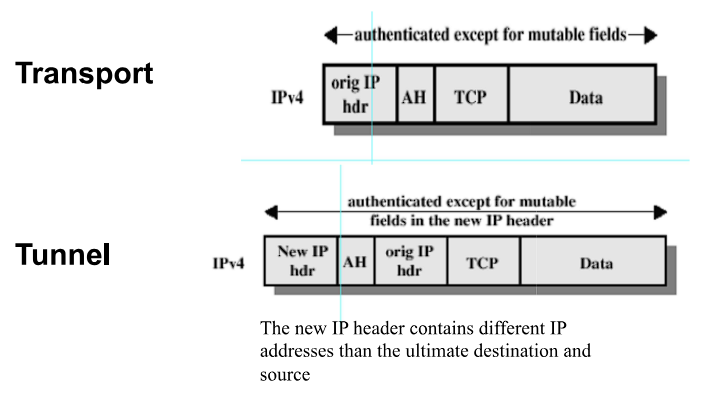
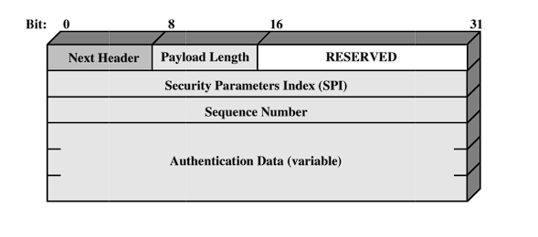
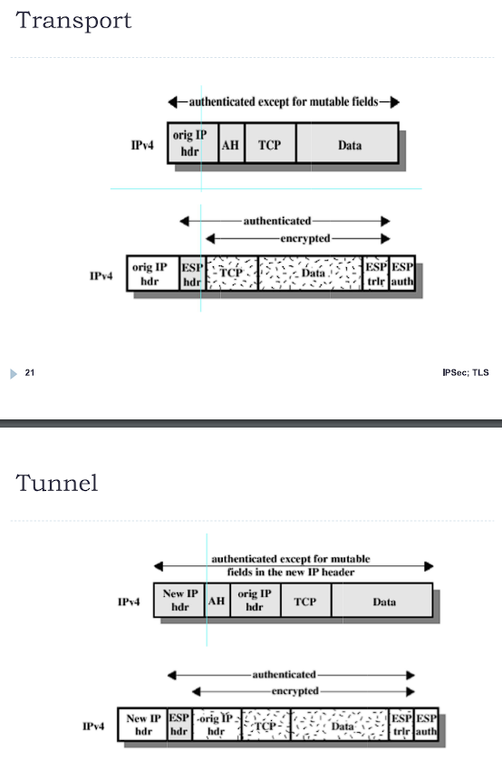
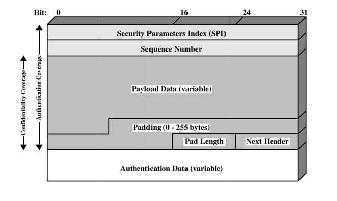
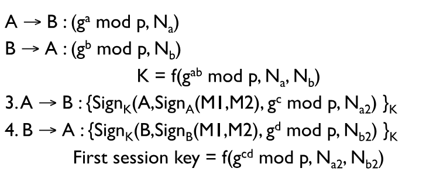
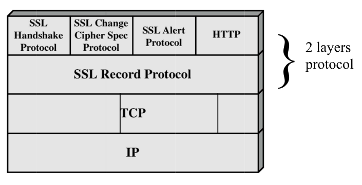

# Netowrk security - secondo pacco

## 1 ⋅ Introduzione

Questo pacco di slide si può trovare [qua](https://virtuale.unibo.it/pluginfile.php/2036482/mod_resource/content/1/Network_security_IPsec_TLS.pdf).

Questa lezione si concentra su IPsec, TLS e VPN.

## 2 ⋅ IPsec

**IPsec** si basa sul principio che le applicazioni non devono preoccuparsi della sicurezza, ma solo del trasporto dei dati.

La **sicurezza** dovrebbe esistere a livello di rete, non a livello di applicazione, pertanto si occupa di implementarlo **a livello rete**.

Si tratta di un protocollo estremamente flessibile, che può essere usato per diversi scopi, come ad esempio e offre quantità diverse di granularità.

Ciò che offre è:
- Access control
  - Permette di decidere chi può accedere a cosa
- Integrity
  - Garantisce che i dati non siano stati modificati
- Data origin authentication
  - Garantisce che i dati siano stati inviati da chi dice di averli inviati
- Rejection of replayed packets
  - Garantisce che i dati non siano stati inviati più volte
- Confidentiality
  - Garantisce che i dati non siano stati letti da terzi

Creato da **IETF**. Viene documentato in RFCs e IETF drafts.

### 2.1 ⋅ IPsec architecture

I meccanismi alla base sono i seguenti:
- Si basa su **security associations**
- Il deployment può essere fatto in uno di due modi:
  - **Transport mode**
    - Prende il protocollo di livello più alto e gli prepende un header IPsec.
  - **Tunnel mode**
    - Prende il pacchetto IP e lo mette dentro un altro pacchetto IPsec.
- La sicurezza può essere fatta in uno di due modi:
  - **AH**: Authentication Header
    - Garantisce l'integrità e l'authenticità dei dati
  - **ESP**: Encapsulating Security Payload
    - Garantisce la confidenzialità dei dati (e può garantire anche integrità e autenticità)

#### 2.1.1 ⋅ Security associations

Si tratta di una "relazione" tra il mittente e il destinatario.

Essenzialmente una SA si identifica con 3 parametri:
- **SPI**: Security Parameter Index
- **IP Destination address**
  - IP del destinatario (dell'SA), può essere un host, un firewall o un router
- **Security Protocol Identifier**
  - AH o ESP

In particolare:
- **SPI + IP Destination address** identificano univocamente una particolare *SA*
- *SA* sono unidirezionali, ovvero se si vuole fare una comunicazione bidirezionale, bisogna creare due *SA*.
  - Unidirezionale indica che il mittente "da" la sua SPI ad un destinatario.

Altri parametri di una SA sono:
- **Sequence number counter**
  - Usato per generare una sequenza di numeri nell'header
- **Sequence counter overflow**:
  - Usato per evitare attacchi di replay
- **Anti-replay window**
  - Usato per evitare attacchi di replay
- **AH information**
  - Formato da: *auth. keys*, *key lifetime*
- **ESP information**
  - Formato da: *enc. keys*, *auth. keys*, *key lifetime*, *iv*
- **Lifetime**
  - Durata della SA
- **Protocol Mode**
  - Tunnel o transport

#### 2.1.2 ⋅ Modalità

In linea generale:
- **Transport mode** si usa per connettere due host, la rete ne è inconsapevole
- **Tunnel mode** si usa per connettere due reti, gli host ne sono inconsapevoli

##### ESP in Transport mode

Cifra e, se si vuole, autentica il payload del pacchetto IP, ma non l'header.

##### ESP in Tunnel mode

Cifra e, se si vuole, autentica l'intero pacchetto IP, incluso quindi l'header del pacchetto IP.

##### AH in Transport mode

Autentica il payload del pacchetto IP e alcune parti dell'header.

##### AH in Tunnel mode

Autentica l'intero pacchetto IP, incluse alcune parti dell'header esterno.

#### 2.1.3 ⋅ AH

**AH** si occupa di:
- Proteggere integrità
  - Usando HMAC basato su MD5 o SHA1
- Dare data origin authentication
- Proteggere contro replay

Aiuta per prevenire gli atticchi di tipo replay, in quanto fa uso del *sequence number*.

Quando la SA si crea, si inizializza il *sequence number* a 0 e poi si ha una *window* di dimensione minima 32, preferita 64, all'interno della quale si accettano i pacchetti. La finestra si sposta in avanti man mano che vengono ricevuti pacchetti non ricevuti in precedenza.

Il pacchetto AH in particolare ha questo aspetto in base al suo uso:

Con in generale questo header:

#### 2.1.4 ⋅ ESP

**ESP** si occupa di:
- Proteggere la confidenzialità
  - Usando DES, 3DES, AES, ecc.
- Proteggere l'integrità
  - Usando HMAC basato su MD5 o SHA1
  - Lo fa per il payload ma non per l'IP header
- Dare data origin authentication
- Proteggere contro replay

Il pacchetto ESP in particolare ha questo aspetto in base al suo uso:

Con in generale questo header:

### 2.2 ⋅ IPsec key management

L'obbiettivo è quello di andare a impostare una SA tra due host che comunicano.

Ci sono due modi per farlo:
- **Manuale**
  - L'amministratore di sistema configura le chiavi per i singoli host
- **Automatico**
  - Ci sono diversi protocolli che si occupano di questa procedura di creazione di chiavi "on-demand":
    - **Oakley Key Determination Protocol**, basato su **Diffie-Hellman**, autentica, previene i replay e negozia le chiavi
    - **Internet Security Association and Key Management Protocol (ISAKMP)**, si occupa di negoziare le chiavi, autenticare i peer e stabilire e distruggere le SA
    - **IKE**, resincronizza due host di IPsec SA: sceglie le chiavi crittografiche, reimposta i sequence number a 0, autentica gli endpoint

### 2.3 ⋅ IKEv2

L'idea generale di **IKEv2** è il seguente procedimento:
- Alice manda $g^A \mod \ p \ , \ \text{nonce}_A$ a Bob
- Bob manda $g^B \mod \ p \ , \ \text{nonce}_B$ ad Alice
- Alice manda $\{\text{"Alice", prova che sono Alice}\}g^{AB} \mod \ p$ a Bob 
- Bob manda $\{\text{"Bob", prova che sono Bob}\}g^{AB} \mod \ p$ ad Alice

La specifica **RFC 4306** in particolare lo descrive nel seguente modo:

Alcuni contender di IKE sono:
- **Photuris**
  - Signed Diffie-Hellman, stateless cookies, optional hiding endpoint identities
- **SKIP**
  - Diffie-Hellman public keys, quindi se conosci la chiave pubblica $g^B$, automaticamente sai il shared secret $g^{AB}$. Ogni messaggio inizia con un nonce $s$ criptato con $g^{AB}$
- **ISAKMP**
  - Un "framework", non un protocollo. Prevede degli encoding complessi. Flessibile ma al contempo "constraining".
    - **Phase 1**
      - Autenticazione, negoziazione delle chiavi
    - **Phase 2**
      - Negoziazione delle SA

Altri dettagli di IKE sono:
- Una sessione di IKE gira nello spazio utente, quindi su UDP
- UDP è "best effort", quindi non si ha reliability o ordine
- Lo standard specifica:
  - Ritrasmissioni
  - Timeout
  - Concurrent exchanges
  - Sincronizzazione
  - Protezione dei messaggi che sono relativi alla chiave che viene stabilita
  - Uso di certificati digitali

### 2.4 ⋅ IPsec in action

Perché in realtà IPsec non viene molto utilizzato?

Ci sono diversi motivi:
- **Complessità**
  - ISAKMP, IKEv2, IPsec, ...
    - Sono tanti protocolli
  - Ci sono più di 34 RFCs
- **NAT Traversal**
  - IPsec non è NAT-friendly, in quanto si hanno difficolta a far instradare IPsec ESP con NAT
- La sicurezza a livello di applicazione è molto più facile da impostare e distribuire
  - Non c'è bisogno di supporto da parte dell'OS

## 3 ⋅ VPN

Una **VPN** è un **virtual private network** che si basa su una rete pubblica, come ad esempio Internet.

Serve a garantire un insieme di caratteristiche per rendere la comunicazione sicura:
- Protezione dei dati, quali confidenzialità, integrità e autenticità
- Replay protection
- Access control

Il modo più facile per impostare una VPN è con l'uso di *IPsec*.

### 3.1 ⋅ VPN types

Possiamo distinguere 3 diversi tipi di VPN:
- **Gateway-to-gateway**
  - Protegge la comunicazione tra due network
  - Per esempio tra due sedi di un'azienda
- **Host-to-gateway**
  - Protegge la comunicazione tra un host e un network
  - Per esempio un dipendente che lavora da casa
- **Host-to-host**
  - Protegge la comunicazione tra due host
  - Per esempio un utente che deve amministrare un sistema che richiede una connessione sicura

### 3.2 ⋅ Consigli di NIST per una VPN IPsec

Il **NIST** ha rilasciato delle linee guida per la creazione di una VPN IPsec:
- Se una qualsiasi delle informazioni che devono attraversare una VPN non dovrebbe venire vista da utenti che non usano la VPN, allora **la VPN dovrebbe dare confidenzialità**
- Una VPN deve usare degli algoritmi di encryption **approvati dalla FIPS**. Per esempio AES-CBC con una chiave da 128-bit è molto raccomandata, 3DES è accettabile ma DES non deve essere usato.
- Una VPN deve **sempre dare integrity protection**, e dovrebbe farlo usando un algoritmo per l'integrità **approvato da FIPS**, come HMAC-SHA-1. HMAC-MD5 non è raccomandato.
- Una VPN dovrebbe sempre dare **protezione contro replay attacks**.
- Per **IKEv1** le SA IKE dovrebbero avere un lifetime non più lungo di 24 ore, mentre per le IPsec SA dovrebbero avere un lifetime non più lungo di 8 ore.
- Per **IKEv2** le SA IKE dovrebbero avere un lifetime non più lungo di 24 ore, dopo il quale si vanno a sostituire le chiavi, mentre le SA figlie dovrebbero avere le chiavi sostituite ogni 8 ore.
- **DH group** indicano il grado di sicurezza, quindi DH group 1 è il meno sicuro, mentre DH group 5 è il più sicuro.
  - DH group 1 è raccomandato solo per compatibilità con vecchi sistemi, mentre DH group 5 è raccomandato per nuove implementazioni. Da notare che più alto è il DH group, più lento è il processo di negoziazione delle chiavi.

## 4 ⋅ TLS

**TLS**, ovvero **Transport Layer Security**, è un protocollo che si occupa di dare un canale di comunicazione sicuro per applicazioni che girano sopra TCP (In quanto richiede un protocollo di trasporto affidabile).

Il TLS definisce le caratteristiche del canale e come esse vengono negoziate: il key establishment, la cifratura, l'autenticazione e altro.

Può essere usato da altri protocolli, come per esempio HTTPS, SMTPS, IMAPS, ecc.

Ci sono molte implementazioni disponibili.

### 4.1 ⋅ TLS vs IPsec

Gli obbiettivi sono simili, ma ci sono alcune differenze importanti:
- IPsec è più flessibile e non lega tra di loro autenticazione e cifratura, che invece in TLS sono legate
- Hanno una granularità diversa:
  - IPsec opera tra host
  - TLS opera tra processi (applicazioni)
- Si ha quindi un tradeoff tra performance e granularità

### 4.2 ⋅ Obbiettivi di TLS

I principali obbiettivi di TLS sono:
- **Confidenzialità**
  - Data dalla cifratura
- **Integrità**
  - Data attraverso la computazione del MAC che viene mandato insieme al messaggio
- **Key exchange**
  - Che si basa sulla crittografia a chiave pubblica

Ci sono diverse versioni e gli algoritmi che vengono usati cambiano da versione a versione, in particolare per TLS 1.2 si usa SHA-256, quando invece prima si usava MD5-SHA1.

### 4.3 ⋅ TLS architettura

Il pacchetto ha la seguente struttura:

