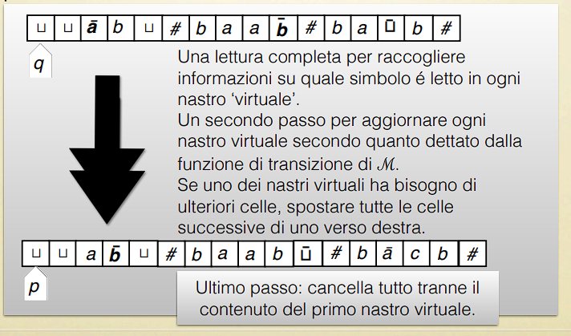

# Tesi di Church-Turing

Risorsa disponibile [qui](https://virtuale.unibo.it/pluginfile.php/1762949/mod_resource/content/4/lezione3.pdf)

## Pre

Praticamente:

$$
\text{Calcolabile } \Leftrightarrow \text{ Calcolabile da una macchina di Turing}
$$

Dove per macchina di Turing si può intendere:
- TM non-deterministiche
- Macchine a registri
- Linguaggi di programmazione

## La tesi di Church-Turing

> Se la soluzione di un dato problema può essere calcolato attraverso una procedura algoritmica, allora può essere calcolata da una macchina di Turing.

### Riflessioni sulla tesi di Church-Turing

Si tratta di una congettura: non ne abbiamo una dimostrazione. Tuttavia, abbiamo tante ragioni per ritenerla vera.

Le macchine di Turing calcolano la stessa classe di funzioni di:
- Macchine di Turing "migliorate" (non-deterministiche, probabilistiche, a più nastri, etc.)
- Macchine a registri
- Linguaggi di programmazione di alto livello come Python, Java, C, etc.
- (Codice macchina di) computer classici
- Computer quantistici

La tesi di Church-Turing non afferma nulla riguardo l'**efficienza** o la **semplicità** della computazione.

In effetti, le macchine di Turing sono severamente limitate in certi aspetti, che le rendono inutilizzabili per fini "pratici":
- Le macchine di Turing sono intrinsecamente più lente di altri modelli di calcolo perché l'accesso ai dati è **sequenziale**
- Sono estremamente **difficili da progettare*

Tuttavia le TM mantengono una grande importanza teorica e concettuale:
1. Perché forniscono una fondazione matematica chiara per **definire in modo rigoroso** cos'è un algoritmo (incluso co'è un algoritmo non-deterministico / probabilistico / quantistico / ...)
2. Perché (se la tesi di C-T è vera) sono capaci di simulare qualsiasi altra macchina di calcolo. Perciò possiamo utilizzarle per **dimostrare enunciati matematici sulle possibilità e i limiti di ciò che è calcolabile**.

---

# Prove della tesi di Church-Turing

## Definizione della macchina di Turing è robusta

Gli scienziaati misurano la robustezza di un concetto matematico (tipicamente, una definizione) come la sua capacità di rimanere invariato rispetto ai cambiamenti.

La robustezza è sintomo della bontà di una certa definizione.

## Variazioni della macchina di Turing

Ci sono diverse alternative proposte alla macchina di Turing, che all'apparenza danno più espressività. Qua andremo a dimostrare che i vari modelli in realtà sono equivalenti.

Queste varianti sono per esempio:
- Nastri addizionali
- Testine addizionali
- Nastri infiniti su entrambi i lati
- Non-determinismo
- Scelta probabilistica
- Scelta quantistica

### Macchine di Turing con nastri addizionali

La computazione comuncia con l'input sul primo nastro, e tutti gli altri nastri vuoti.

In ciascun passo di computazione, ogni testina è nello stesso stato, ma può essere in una posizione diversa, leggere un simbolo differente, e compiere un'azione diversa.

Se si raggiunge uno stato finale, l'output è letto dal primo nastro.

Formalmente, questo modello è definito come una tupla $\langle \Sigma, Q, q_0, H, \delta \rangle$, proprio come le TM classiche.

L'unica differenza è la definizione di $\delta$, che ora è una funzione:

$$
\delta : (Q \setminus H) \times \Sigma^k \rightarrow Q \times \{ \Sigma \times \{\leftarrow, \rightarrow\} \} ^k
$$

Dove $k$ è il numero di nastri.

#### Teorema e dimostrazione

**Enunciato**: Macchine di Turing con $k$ nastri sono equivalenti alle macchine di Turing con un solo nastro.

**Idea dimostrazione**: Una direzione dell'equivalenza è ovvia (ovvero una TM è una TM con più nastri con 1 solo nastro). 

Per la direzione opposta: sia $\mathcal{M}$ una TM con nastri adizionali. Costruiamo una TM $\mathcal{M}'$ con un solo nastro che sia equivalente: cioè, per ogni input $x$:

$$
\mathcal{M} \text{ non termina su } x \Leftrightarrow \mathcal{M}' \text{ non termina su } x
\\ \ \\
\mathcal{M} \text{ termina su } x \text{ con output } y \Leftrightarrow \mathcal{M}' \text{ termina su } x \text{ con output } y
$$

Se $\mathcal{M}$ è basata su alfabeto $\Sigma$, allora $\mathcal{M}'$ sarà basata su alfabeto: 

$$
\Sigma \ \uplus \ \{\bar{a} \mid a \in \Sigma \} \ \uplus \ \{ \# \}
$$

In seguito un immagine che rappresenta come configurare $\mathcal{M}'$ per simulare $\mathcal{M}$:

In un singolo passo di computazione, $\mathcal{M}$ raggiunge una nuova configurazione su ciascun nastro:

Questo passo è simulato da **molteplici** passi di computazione sul nastro di $\mathcal{M}'$:

#### Nota su questa e le prossime dimostrazioni

Questa dimostrazione non è particolarmente dettagliata. Per essere completamente rigorosi, dovremmo dare la definizione completa di $\mathcal{M}'$, e dimostrare che è equivalente a $\mathcal{M}$.

Tuttavia, dati i vincoli a cui siamo soggetti, ci "accontentiamo" di uno sketch che sia sufficientemente convincente da credere che, se avessimo ulteriore tempo e spazio a disposizione, potremmo dare la dimostrazione completa.

Questa situazione è tipica con le macchine di Turing, che sono formalismi di "basso" livello. Per la tesi di Church-Turing, se possiamo descriverlo con un algoritmo, allora esiste una TM che lo calcola (ma negli esercizi dobbiamo essere abbastanza convincenti!)

### Macchine di Turing non-deterministiche

Stessa definizione di una TM classica, ma le transizioni sono descritte da una **relazione** anziché una funzione.

$$
\begin{align*}
\text{DET }& \delta : Q \times \Sigma \rightarrow Q \times \Sigma \times \{ \leftarrow, \rightarrow \} \\
\text{NON-DET }& \delta : Q \times \Sigma \times Q \times \Sigma \times \{ \leftarrow, \rightarrow \}
\end{align*}
$$

Perciò la configurazione attraversate nel corso di una computazione non formano una **sequenza**, bensì un **albero**.

> Concettualmente: ramificazione = scelta non-deterministica

Un input è accettato se esiste un ramo accettante nell'albero.

#### Esempio

Diamo uno sketch della TM $\mathcal{M}$ non deterministica che decide il linguaggio dei numeri non-primi. Lavora su due nastri.

Il nastro 1 è di sola lettura e contiene il numero $n$ in input. In maniera non deterministica scegli $m$ tale che $1<m<n$ e scrivilo sul nastro 2. Se $n \text{ mod } m = 0$ fermati e accetta, in caso contrario ferma e rigetta.

Perciò $n$ è accettato se e solo se esiste un numero tra 2 e $n-1$ che divide $n$.

#### Teorema e dimostrazione

**Enunciato**: Macchine di Turing non-deterministiche sono equivalenti alle macchine di Turing deterministiche.

**Idea dimostrazione**: Una direzione dell'equivalenza è ovvia (ovvero una TM è una TM non deterministica con 1 solo nastro).

Per la direzione opposta: sia $\mathcal{M}$ una TM non deterministica. Costruiamo una TM $\mathcal{M}'$ deterministica che sia equivalente.

L'idea è quella di esplorare su $\mathcal{M}'$ sull'input $x$ tutto l'albero di computazione di $\mathcal{M}$, in modo *breadth-first* in quanto se fosse *depth-first* potremmo non terminare, sullo stesso input $x$ e accetta se almeno un ramo di computazione arriva ad uno stato finale.

Per fare ciò $\mathcal{M}'$ usa tre nastri:

## Ricapitolando

La definizione di macchina di Turing è ben lontana dall'essere arbitraria.

Anche se proviamo a 'migliorarla' in vari modi (più nastri, non-determinismo, etc.), il **potere espressivo del modello di calcolo rimane lo stesso**.

Nella pratica, possiamo trarre vantaggi da queste variazioni per costruire più agilmente macchine di Turing che svolgano un determinato compito.

# Proprietà di chiusura dei linguaggi

Ora che abbiamo pià libertà nel design delle nostre macchine di Turing, possiamo facilmente dimostrare alcune **proprietà di chiusura** delle classi di linguaggi decidibili / riconoscibili da una macchina di Turing.

## Cosa vuol dire "proprietà di chiusura"?

Nota per ricordare: i linguaggi sono insiemi.

Perciò, possiamo ragionare su operazioni come l'unione, l'intersezione e il complemento di linguaggi (sullo stesso alfabeto $\Sigma$).

Il **complemento** $L^-$ di un linguaggio $L$ su $\Sigma$ è $\Sigma^* \setminus L$.

Dal momento che i linguaggi sono insiemi di **stringhe**, abbiamo anche un'operazione di **concatenazione** tra linguaggi.

$$
L_1 L_2 = \{ xy \mid x \in L_1, y \in L_2 \}
$$

Prendiamo un insieme $X$ di linguaggi.

Dimostrare che $X$ è **chiuso rispetto all'unione** significa dimostrare che:

$$
L_1 \in X \text{ e } L_2 \in X \text{ implica } L_1 \cup L_2 \in X
$$

Dimostrare che X è **chiuso rispetto al complemento** significa dimostrare che:

$$
L \in X \text{ implica } L^- \in X
$$

E così via.

**Ripasso su decidibilità e riconoscibilità**:
- Un linguaggio è **decidibile** se esiste una TM che lo accetta e si ferma su ogni input (con stato Y se accetta e stato N se rigetta)
- Un linguaggio è **riconoscibile** se esiste una TM che si ferma = riconosce, oppure non si ferma quando non riconosce

## Proprietà di chiusura dei linguaggi decidibili

### Complemento

Idea della dimostrazione: inverti lo stato di accettazione e rigetto, ovvero invertire i passaggi a Y con i passaggi a N e viceversa.

### Unione

Sia $\mathcal{M}_1$ una TM che decide $L_1$ e $\mathcal{M}_2$ una TM che decide $L_2$. La TM che decide $L_1 \cup L_2$ ha due nastri, ed è definita come segue:

1. Copia l'input del primo nastro al secondo nastro
2. Simula $\mathcal{M}_1$ sul primo nastro
   1. Se $\mathcal{M}_1$ accetta, accetta
3. Se $\mathcal{M}_1$ rigetta, simula $\mathcal{M}_2$ sul secondo nastro
   1. Se $\mathcal{M}_2$ accetta, accetta
   2. Se $\mathcal{M}_2$ rigetta, rigetta

### Intersezione

Sia $\mathcal{M}_1$ una TM che decide $L_1$ e $\mathcal{M}_2$ una TM che decide $L_2$. La TM che decide $L_1 \cap L_2$ ha due nastri, ed è definita come segue:

1. Copia l'input del primo nastro al secondo nastro
2. Simula $\mathcal{M}_1$ sul primo nastro
   1. Se $\mathcal{M}_1$ accetta, simula $\mathcal{M}_2$ sul secondo nastro
      1. Se $\mathcal{M}_2$ accetta, accetta
      2. Se $\mathcal{M}_2$ rigetta, rigetta
   2. Se $\mathcal{M}_1$ rigetta, rigetta

### Concatenazione

Sia $\mathcal{M}_1$ una TM che decide $L_1$ e $\mathcal{M}_2$ una TM che decide $L_2$. La TM che decide $L_1 L_2$ ha due nastri, ed è definita come segue:

1. Scegliamo in maniera non deterministica $y$ e $z$ tali che $x = yz$. Scrivi $y$ sul nastro 1 e $z$ sul nastro 2
2. Simula $\mathcal{M}_1$ su $y$ (nastro 2 è di sola lettura)
   1. Se $\mathcal{M}_1$ rigetta, rigetta
3. Se $\mathcal{M}_1$ accetta, simula $\mathcal{M}_2$ su $z$
   1. Se $\mathcal{M}_2$ accetta, accetta
   2. Se $\mathcal{M}_2$ rigetta, rigetta

In modo deterministico significa: se c'è almeno una decomposizione $x=yz$ tale che $y \in L_1$ e $z \in L_2$, allora accetta.

## Proprietà di chiusura dei linguaggi riconoscibili

Sono chiusi per:
- **Unione**
- **Intersezione**
- **Concatenazione**

Le dimostrazioni sono identiche a quelle per i linguaggi decidibili, ma al posto di TM che finiscono, finiamo in cicli per rigettare e terminiamo per accettare.

### Complemento

In questo caso possiamo dimostrare che i linguaggi riconoscibili **non sono chiusi rispetto al complemento**. Vedremo la dimostrazione più avanti, dal momento che segue dall'esistenza di un linguaggio riconoscibile che non è decidibile.

## Perché ci è comodo sapere queste proprietà?

Possiamo fare leva sulle proprietà di chiusura per semplificare le dimostrazioni che un certo linguaggio è decidibile (o riconoscibile).

Per esempio al fine di dimostrare che il linguaggio:

$$
L = \{ x \in \{0,1\}^* \mid x \text{ ha lunghezza dispari e più 1 che 0} \}
$$

è decidibile, basta dimostrare che:
- $L_1 = \{ x \in \{0,1\}^* \mid x \text{ ha lunghezza dispari} \}$ è decidibile
- $L_2 = \{ x \in \{0,1\}^* \mid x \text{ ha più 1 che 0} \}$ è decidibile

sono decidibili, perché $L = L_1 \cap L_2$.