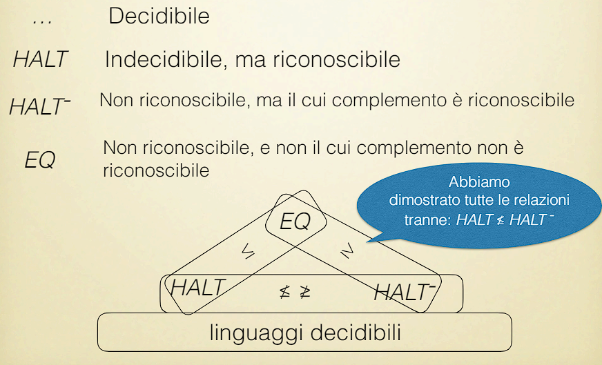

# Mapping reduction

Si possono trovare le risorse di questa lezione [qui](https://virtuale.unibo.it/pluginfile.php/2013700/mod_resource/content/3/Lezione7.pdf)

## 1 ⋅ Introduzione

La mapping-reduction cosente di **ridurre** le istanze di un problema a quelle di un altro problema.

Tale tecnica ci rivela che, nel confrontare due problemi la **decidibilità/riconoscibilità non è essenziale nel processo di prova**. Eventualmente, può essere derivata come una conseguenza.

Schematicamente:
- $L'$ si riduce a $L$, quindi:
  - La decidibilità di $L'$ si riduce alla decidibilità di $L$
  - La riconoscibilità di $L$ si riduce alla riconoscibilità di $L'$

Rispetto ad un tentativo diretto di investigare la calcolabilità di $L$ o $L'$, questo approccio è maggiromente strutturato: per prima cosa, ci concentriamo su come sono relazionati i due problemi.

## 2 ⋅ Definizione

> **Definizione**: Siano $L$ e $L'$ linguaggi sull'alfabeto $\Sigma$, diciamo che $L'$ è ***mapping-riducibile*** a $L$, scritto $L' \leq L$, se esiste una TM che computa la funzione (totale) $f : \Sigma^* \to \Sigma^*$ tale che:
>
> $$
> x \in L' \iff f(x) \in L
> $$
>
> Sostanzialmente, $f$ converte il problema di appartenenza per $L'$ nel problema di appartenenza per $L$.
>
> Lettura intuitiva di $L' \leq L$: $L$ è difficile almeno quanto $L'$, o anche $L'$ è semplice uguale o più semplice di $L$.

### 2.1 ⋅ Teoremi e corollari

La *mapping-reducibility* non parla di decidibilità. E' però uno strumento efficace per mostrare che un linguaggio è (in)decidibile.

> **Teorema 1**: Se $L' \leq L$ e $L$ è decidibile, allora $L'$ è decidibile.

> **Corollario 1**: Se $L' \leq L$ e $L'$ è non-decidibile, allora $L$ è non-decidibile.

> **Corollario 2**: Se $L$ è decidibile e $L'$ non lo è, allora $L' \not\leq L$.

## 3 ⋅ Uso del mapping-reduction

### 3.1 ⋅ Problema della fermata sul nastro vuoto

Il problema della fermata su nastro vuoto (*ETH*) è definito dal linguaggio:

$$
\text{ETH} = \{ x \in \Sigma^* \mid x = \text{code}(\mathcal{M}) \text{ e } \mathcal{M} \text{ ferma su } \varepsilon\}
$$

Spiegazione più intuitiva del problema: dato un nastro inizialmente vuoto (ovvero contenente solo simboli di blank o spazi bianchi, spesso indicati come il simbolo $\#$ o $\sqcup$) la macchina di Turing $\mathcal{M}$ si fermerà mai? Notiamo che la risposta sì sarà quando si fermerà, e ciclerà quando non si fermerà, quindi non è decidibile.

**Teorema**: ETH è indecidibile.

**Piano della dimostrazione**: è sufficiente ridurre HALT a ETH, così che l'indecidibilità di HALT implichi quella di ETH, via Corollario 1.

#### 3.1.1 ⋅ Dimostrazione

Costruiamo una funzione computabile $f$ tale che:

$$
\langle y , x \rangle \in \text{HALT} \iff f(\langle y,x \rangle) \in \text{ETH}
$$

La definizione di $f$ è come segue. Su arogmento $\langle y,x \rangle$:
- Se $y \neq \text{code}(\mathcal{M})$ per ogni $\mathcal{M}$ allora $f(\langle y,x \rangle) = y \not\in \text{ETH}$
- Se $y = \text{code}(\mathcal{M})$, allora $f(\langle y,x \rangle) = \text{code} (\mathcal{M}_{\mathcal{M},X})$, dove $\mathcal{M}_{\mathcal{M},X}$ è una TM che:
  - $\mathcal{M}_{\mathcal{M},X}$ entra in loop su ogni stringa non vuota.
  - Su input $\varepsilon$, simula $\mathcal{M}$ su $x$ e si comporta come $\mathcal{M}$.

Quindi abbiamo la seguente sequenza di $\iff$:
- $\langle y,x \rangle \in \text{HALT}$
- $y = \text{code}(\mathcal{M})$ e $\mathcal{M}$ si ferma su $x$
- $\mathcal{M}_{\mathcal{M},X}$ si ferma su $\varepsilon$
- $f(\langle y,x \rangle) = \text{code}(\mathcal{M}_{\mathcal{M},X}) \text{ e } f(\langle y,x \rangle) \in \text{ETH}$

Quindi, siamo riusciti a portare tutte le instanze dell'HALTING problem a delle istanze del problema ETH, quindi se l'HALTING problem è almeno tanto complicato quanto ETH, quindi ETH non può essere decidibile, è almeno non decidibile.

### 3.2 ⋅ Full language problem

Il "full language" problem (*FL*) è definito dal linguaggio seguente:

$$
\text{FL} = \{ x \in \Sigma^* \mid x = \text{code}(\mathcal{M}) \text{ e } \mathcal{M} \text{ ferma su ogni input }\}
$$

**Teorema**: FL è indecidibile.

**Piano della dimostrazione**: riduciamo HALT a FL.

#### 3.2.1 ⋅ Dimostrazione

Costruiamo una funzione $f$ computabile tale che:

$$
\langle y,x \rangle \in \text{HALT} \iff f(\langle y,x \rangle) \in \text{FL}
$$

Definiamo $f$ come segue. Su argomento $\langle y,x \rangle$:
- Se $y \neq \text{code}(\mathcal{M})$ per ogni $\mathcal{M}$ allora $f(\langle y,x \rangle) = y \not\in \text{FL}$
- Se $y = \text{code}(\mathcal{M})$, allora $f(\langle y,x \rangle) = \text{code} (\mathcal{M}_{\mathcal{M},X})$, dove $\mathcal{M}_{\mathcal{M},X}$ è costruita come segue:
  - $\mathcal{M}_{\mathcal{M},X}$ cancella il suo input.
  - Scrive $x$ sul nastro e simula $\mathcal{M}$ su $x$

Quindi seguono le seguenti affermazioni che sono collegate da $\iff$:
- $\langle y,x \rangle \in \text{HALT}$
- $y = \text{code}(\mathcal{M})$ e $\mathcal{M}$ si ferma su $x$
- $\mathcal{M}_{\mathcal{M},X}$ si ferma su un input arbitrario
- $f(\langle y,x \rangle) = \text{code}(\mathcal{M}_{\mathcal{M},X}) \text{ e } f(\langle y,x \rangle) \in \text{FL}$

### 3.3 ⋅ Equivalence problem

L'**equivalence problem** (*EQ*) per le TM è definito dal seguente linguaggio:

$$
\text{EQ} = \{ \langle y,z \rangle \in \Sigma^* \times \Sigma^* \mid y = \text{code}(\mathcal{M}_1) \text{ e } z = \text{code}(\mathcal{M}_2) \text{ e } \mathcal{M}_1 \text{ e } \mathcal{M}_2 \text{ computano la stessa funzione parziale} \}
$$

**Teorema** EQ è indecidibile.

**Piano della dimostrazione**: riduciamo FL a EQ.

Da notare che qua avremmo potuto anche passare da HALT a EQ, ma la riduzione da FL a EQ è più semplice (e vogliamo mostrare la flessibilità della riduzione).

#### 3.3.1 ⋅ Dimostrazione

E' sufficiente costruire una funzione computabile $f$ tale che:

$$
z \in FL \iff f(z) \in EQ
$$

La definizione di $f$ è come segue. Su argomento $z$:
- Se $z \neq \text{code}(\mathcal{M})$ per ogni $\mathcal{M}$ allora $f(z) = \langle z,z \rangle \not\in \text{EQ}$
- Se $z = \text{code}(\mathcal{M})$, allora $f(z) = \langle \text{code}(\mathcal{M}_1),\text{code}(\mathcal{M}_2) \rangle$ dove $\mathcal{M}_1$ e $\mathcal{M}_2$ sono costruite come segue:
  - $\mathcal{M}_1$ esegue $\mathcal{M}$ sul suo input e restituisce 1 se $\mathcal{M}$ si ferma, e va in loop altrimenti.
  - $\mathcal{M}_2$ restituisce $1$ per ogni input.

Segue quindi la seguente sequenza di $\iff$:
- $z \in FL$
- $z = \text{code}(\mathcal{M})$ e $\mathcal{M}$ si ferma su ogni input
- $\mathcal{M}_1$ ferma su ogni input con output $1$
- $\mathcal{M}_1$ e $\mathcal{M}_2$ sono equivalenti
- $f(z) = \langle \text{code}(\mathcal{M}_1),\text{code}(\mathcal{M}_2) \rangle \text{ e } f(z) \in \text{EQ}$

## 4 ⋅ Riduzione e riconoscibilità

Ciò che è vero per riduzione e decidibilità vale anche per riduzione e riconoscibilità.

> **Teorema 1.b**: Se $L' \leq L$ e $L$ è riconoscibile, allora $L'$ è riconoscibile.

> **Corollario 1.b**: Se $L' \leq L$ e $L'$ non è riconoscibile, allora $L$ non è riconoscibile.

> **Corollario 2.b**: Se $L$ è riconoscibile e $L'$ non lo è, allora $L' \not\leq L$.

### 4.1 ⋅ Equivalence problem non è riconoscibile

Riscriviamo la definizione dell'equivalence problem:

$$
\text{EQ} = \{ \langle y,z \rangle \in \Sigma^* \times \Sigma^* \mid y = \text{code}(\mathcal{M}_1) \text{ e } z = \text{code}(\mathcal{M}_2) \text{ e } \mathcal{M}_1 \text{ e } \mathcal{M}_2 \text{ computano la stessa funzione parziale} \}
$$

Abbiamo dimostrato che EQ è indecidibile. Ora mostriamo che EQ non è riconoscibile.

**Teorema**: EQ non è riconoscibile.

**Piano della dimostrazione**: riduciamo $\text{HALT}^-$ (che sappiamo essere un problema non riconoscibile) a EQ.

#### 4.1.1 ⋅ Dimostrazione

Ricordiamo un attimo la definizione di $\text{HALT}^-$:

$$
\text{HALT}^- = \{ \langle y, x \rangle \in \Sigma^* \times \Sigma^* \mid y \neq \text{code}(\mathcal{M}) \text{ per ogni } \mathcal{M} \text{ oppure } y = \text{code}(\mathcal{M}) \text{ e } \mathcal{M} \text{ non si ferma su } x \}
$$

Per la riduzione, abbiamo la funzione $f$ tale che:

$$
\langle y,x \rangle \in \text{HALT}^- \iff f(\langle y,x \rangle) \in \text{EQ}
$$

E questa è equivalente a:

$$
\langle y,x \rangle \in \text{HALT} \iff f(\langle y,x \rangle) \in \text{EQ}^-
$$

Quindi andiamo a definire $f$ come segue:
- Se $y \neq \text{code}(\mathcal{M})$ per ogni $\mathcal{M}$ allora prendiamo $\mathcal{M}'$ qualsiasi e consideriamo $f (\langle y,x \rangle) = \langle \text{code}(\mathcal{M}'), \text{code}(\mathcal{M}') \rangle$
  - Allora $f (\langle y,x \rangle) \in \text{EQ}$
  - E quindi $f (\langle y,x \rangle) \not\in \text{EQ}^-$
- Altrimenti $y=\text{code}(\mathcal{M})$ e consideriamo $\mathcal{M}_{\mathcal{M},X}$ come prima, e quindi $f (\langle y,x \rangle) = \langle \text{code}(\mathcal{M}_{1}), \text{code}(\mathcal{M}_{2}) \rangle$, dove $\mathcal{M}_{1}$ e $\mathcal{M}_{2}$ sono costruite come segue:
  - $\mathcal{M}_{1}$ esegue $\mathcal{M}$ su $x$ e si ferma se $\mathcal{M}$ si ferma, altrimenti va in loop.
  - $\mathcal{M}_{2}$ va in loop su ogni input

Quindi abbiamo la seguente sequenza di $\iff$:
- $\langle y,x \rangle \in \text{HALT}$
- $y = \text{code}(\mathcal{M})$ e $\mathcal{M}$ si ferma su $x$
- $\mathcal{M}_{1}$ accetta una stringa
  - Il linguaggio delle stringhe accetta da $\mathcal{M}_{1}$ è o $\Sigma^*$ o $\emptyset$, in base al fatto che $\mathcal{M}$ si fermi su $x$
- $\mathcal{M}_{1}$ e $\mathcal{M}_{2}$ non sono equivalenti
- $f (\langle y,x \rangle) = \langle \text{code}(\mathcal{M}_{1}), \text{code}(\mathcal{M}_{2}) \rangle \text{ e } f (\langle y,x \rangle) \in \text{EQ}^-$

## 5 ⋅ Riduzione e decidibilità

Andiamo ad elencare una serie di teoremi e corollari:

> **Teorema 1**: Se $L' \leq L$ e $L$ è decidibile, allora $L'$ è decidibile.

> **Corollario 1**: Se $L' \leq L$ e $L'$ è indecidibile, allora $L$ è indecidibile.

> **Corollario 2**: Se $L$ è decidibile e $L'$ è indecidibile, allora $L' \not\leq L$.

Se $L'$ è decidibile, la riduzione a qualche $L$ è di scarsa utilità:

> **Teorema 2**: Se $L$ è un qualunque linguaggio non-triviale, ($L\neq \emptyset, L\neq \Sigma^*$), allora $L' \leq L$ per ogni $L'$ decidibile.

**Dimostrazione di quest'ultimo teorema**: Poiché L è non-triviale, possiamo prendere $x\in L$ e $y \not\in L$. Definiamo la funzione $f : \Sigma^* \to \Sigma^*$ come segue:

$$
f(z) = \begin{cases}
x & \text{se } z \in L' \\
y & \text{se } z \not\in L'
\end{cases}
$$

Poiché $L'$ è decidibile, $f$ può essere implementata tramite una TM che simula interiormente la TM per $L'$ e restituisce $x$ o $y$ coerentemente. Inoltre, per definizione di $f$:

$$
z \in L' \iff f(z) \in L
$$

### 5.1 ⋅ Proprietà riduzione come relazione

La riduzione è una **relazione* tra linguaggi:
- **Riflessiva**: $L \leq L$ per ogni $L$
- **Transitiva**: se $L' \leq L$ e $L \leq L''$ allora $L' \leq L''$
- **Non simmetrica**: se $L' \leq L$ non implica $L \leq L'$

Quindi la riduzione *non* è una relazione di equivalenza.

### 5.2 ⋅ Riduzione e complemento

> **Teorema**: $L_1 \leq L_2 \iff L_1^- \leq L_2^-$

> **Corollario**: $L_1^- \leq L_2 \iff L_1 \leq L_2^-$
>
> Usato implicitamente per dimostrare l'ultima prova con $L_1 = HALT$ e $L_2 = EQ$

Mettendo insieme questi risultati, abbiamo senza ulteriore lavoro prova che $EQ^-$ non è riconoscibile.

Infatti $HALT \leq FL \leq EQ$ e quindi $HALT^- \leq EQ^-$ torna per teorema.

La non riconoscciblità di $HALT^-$ non implica la non riconoscibilità di $EQ^-$.

Si può quindi costruire una gerarchia di questo tipo:

## 6 ⋅ Turing riducibilità

La *mapping-reducibility* è solo uno dei modi in cui definire il concetto di problema riducibile a un altro problema.

Un altro è la **Turing-riducibilità**.

Un **oracolo** per un linguaggio $L$ è uno strumento esterno ("black box") capace di rispondere alla domanda "$x \in L$?". per ogni stringa $x$.

Un linguaggio $L'$ è **Turing-riducibile** a $L$ se, dato un oracolo per $L$, possiamo decidere $L'$.

La **mapping-reducibility** implica la Turing-riducibilità, ma non il contrario.

**Esempio**: sappiamo che $HALT^- \not\leq HALT$, cioè $HALT^-$ non è mapping-reducibile a $HALT$.

Ma $HALT^-$ è Turing-riducibile a $HALT$. Infatti, se abbiamo un oracolo per la domanda "si ferma $\mathcal{M}$ su $x$?" possiamo decidere $HALT^-$.

Questo può essere usato per decidere se $\langle y,x \rangle \in HALT^-$.