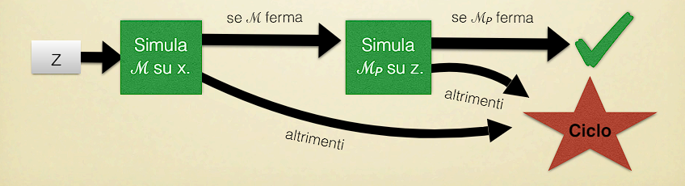
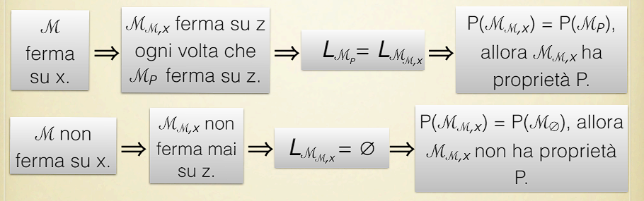

# Nozione di calcolabilità

## 1 ⋅ Introduzione

Le slide di questa lezione si possono trovare [qua](https://virtuale.unibo.it/pluginfile.php/1762955/mod_resource/content/6/lezione8.pdf)

In questa lezione ci sarà la seguente scaletta:
- Ci concentriamo su risultati generali che chiariscano la nozione di calcolabilità ad ampio raggio
- Dimostriamo che utti i problemi decidibili, in un certo senso, sono triviali (Teorema di Rice)
- Dimostriamo che ci sono molti più problemi non riconoscibili che riconoscibili (usando l'argomento diagonale di Cantor).

## 2 ⋅ Teorema di Rice

Abbiamo visto che non possiamo decidere se una TM:
- Ferma su un dato input
- Ferma su input vuoto (la stringa vuota)
- E' equivalente a un'altra TM

Allora, quali problemi riguardanti le TM sono decidibili?

Per esempio, possiamo decidere se una TM data:
- Ferma sempre in un certo numero di passi
- Ha meno di un certo numero di stati

Cos'altro?

### 2.1 ⋅ Ripasso dei linguaggi

I **linguaggi** sono sottoinsiemi di $\Sigma^*$. Senza perdita di generalità (modulo la corretta codifica di $\Sigma^*$ in $\{0,1\}^*$) possiamo assumere che $\Sigma = \{0,1\}$.

Il **linguaggio della TM $\mathcal{M}$** è definitio come:

$$
L_{\mathcal{M}} = \{x \in \{0,1\}^* \mid \mathcal{M} \text{ accetta } x\}
$$

Una **proprietà di linguaggi** $P$ è una funzione da un insieme di TM a $\{0,1\}$ (falso/vero) tale che $L_{\mathcal{M}} = L_{\mathcal{M}'}$ implica $P(\mathcal{M}) = P(\mathcal{M}')$.

- Questa scelta fa sì che $P$ dipenda unicamente dal linguaggio descritto dalla macchina e non da una proprietà della macchina stessa. Per esempio: "ferma in 42 step" non è una proprietà del linguaggio che genera la macchina, ma è una proprietà della macchina stessa.

Questa proprietà è **non-triviale** se esiste una TM $\mathcal{M}$ tale che $P(\mathcal{M}) = 1$ e una TM $\mathcal{M}'$ tale che $P(\mathcal{M}') = 0$.

Formalmente identificheremo le TM che soddisfano la proprietà $P$ con l'insieme $\{y \in \Sigma^* \mid y = \text{code}(\mathcal{M}) \text{ e } P(\mathcal{M}) = 1 \}$.

#### Esempio

Facciamo alcuni esempi di **proprietà non-triviali**:
- $\{ y \mid y = \text{code}(\mathcal{M}) \text{ e } L_{\mathcal{M}} \text{ è finito}\}$
- $\{ y \mid y = \text{code}(\mathcal{M}) \text{ e } L_{\mathcal{M}} \text{ è vuoto}\}$
- $\{ y \mid y = \text{code}(\mathcal{M}) \text{ e } L_{\mathcal{M}}=L\}$

Un esempio di proprietà **triviale** è invece
- $\{ y \mid y = \text{code}(\mathcal{M}) \text{ e } \mathcal{M} \text{ riconosce qualche linguaggio}\}$
  - Questa proprietà è triviale in quanto per definizione ogni TM riconosce un linguaggio.

### 2.2 ⋅ Teorema di Rice

> **Teorema**: Se $P$ è una **prorpeità di linguaggio non triviale**, allora il problema "$\mathcal{M}$ ha la proprietà $P$" è indecidibile.

**Strategia di dimostrazione**: per contraddizione. Dimostriamo che se "$\mathcal{M}$ ha la proprietà $P$" è decidibile, il problema della fermata sarebbe decidibile.

#### Dimostrazione

Consideriamo una proprietà $P$. Assumiamo $P(\mathcal{M}_\emptyset) = 0$ ($\mathcal{M}_\emptyset$ è una TM che riconosce il linguaggio vuoto).

Poiché $P$ è non-triviale, possiamo considerare una TM $\mathcal{M}_P$ tale che $P(\mathcal{M}_P) = 1$.

Fissiamo $\mathcal{M}$ e $x$ come parametri e costruiamo la seguente TM $\mathcal{M}_{\mathcal{M}, x}$:

Quindi seguono i seguenti $\iff$:

Conclusione: se potessimo decidere se $\mathcal{M}_{\mathcal{M},X}$ ha la proprietà $P$ potremmo decidere il problema della fermata.

Allora: $\{y \mid y = \text{code}(\mathcal{M}) \text{ e } P(\mathcal{M}) = 1  \}$ è indecidibile.

Da notare che abbiamo assunto che $P(\mathcal{M}_\emptyset) = 0$ e $P(\mathcal{M}_P) = 1$. 

Se invece fosse il contrario? Se $P(\mathcal{M}_\emptyset) = 1$ e $P(\mathcal{M}_P) = 0$?

In questo caso, ripetiamo lo stesso arogmento, ma per la proprietà $\neg P$ ("$\mathcal{M}$ non ha la proprietà $P$").

Osserva che questo funziona perché:
- Dato che $P$ è non triviale, anche $\neg P$ è non triviale.
- Dato che $P(\mathcal{M}_\emptyset) = 1$, allora $\neg P(\mathcal{M}_\emptyset) = 0$.

Concludiamo che $\{ y \mid y = \text{code}(\mathcal{M}) \text{ e } \neg P(\mathcal{M})=1  \}$ è indecidibile. Questo implica che anche $\{ y \mid y = \text{code}(\mathcal{M}) \text{ e } P(\mathcal{M})=0  \}$ è indecidibile.

### 2.3 ⋅ Proprietà decidibili

Attenzione a possibili fraintendimenti: il Teorema di Rice riguarda proprietà di **linguaggio**, non proprietà **algoritmiche**. Riguarda funzioni (specifiche) e non programmi (implementazioni).

Per esempio, non possiamo usare il teorema di Rice per derivare l'idecidibilità del problema della fermata (e simili), in quanto questi problemi riguardano proprietà algoritmiche, non di linguaggio.

In generale, ci sono **tre** tipi di proprietà riguardo le TM:
- **Proprietà di linguaggio**
  - Quelle non triviali sono indecidibili (teorema di Rice)
- **Proprietà strutturali**
  - Per esempio "$\mathcal{M}$ ha meno di 42 stati"
  - Queste sono tipicamente decidibili poiché si possono verificare staticamente sulla (codifica della) descrizione di $\mathcal{M}$
- **Proprietà algoritmiche**
  - Per esempio "la TM $\mathcal{M}$ ferma su input $x$"
  - Oppure per esempio "la TM $\mathcal{M}$ non si muove a sinistra su input $0101$"
  - Alcune sono decidibili, altre no, ma la classificazione non è ovvia

## 3 ⋅ Insiemi numerabili

Andiamo ora a definire cosa è numerabile e cosa no, quindi a "classificare" le TM, i linguaggi e così via.

Innanzitutto deifniamo un insieme $S$ che è **infinito numerabile**. Un insieme è detto invinito numerabile se c'è una funzione totale biettiva $f : N \to S$.

**Lemma**: se $S_1$ e $S_2$ sono infiniti numerabili, $S_1 \cup S_2$ è infinito numerabile.

Esempi di insiemi infiniti numerabili (che sono importanti a noi), sono:
- L'insieme $\Sigma^*$ di stringhe su un alfabeto finito $\Sigma$
  - Sulle slide c'è un esempio di come costruire una funzione biettiva tra $\Sigma^*$ e $N$
- Abbiamo visto che ogni TM può essere codificato come una stringa di un alfabeto finito
  - Quindi l'insieme delle TM è infinito numerabile  
- Anche l'insieme di tutti i linguaggi riconoscibili è infinito numerabile
  - Questo perché, per definizione, un linguaggio è riconoscible se c'è una TM che lo riconosce.
- L'insieme delle funzioni $\mathbb{N} \to \mathbb{N}$ computabili da una TM è infinito numerabile

### 3.1 ⋅ Insiemi non numerabili

Abbiamo invece il seguente teorema.

> **Teorema**: Sia $S_\Sigma$ l'insieme di tutti i linguaggi sull'alfabeto finito $\Sigma$.
>
> L'insieme $S_\Sigma$ **non** è numerabile.

Per fare la dimsotrazione di questo si usa la tecnica della diagonale di Cantor, ovvero andiamo a prendere una tabella dove per ogni riga abbiamo un linguaggio e per ogni colonna una stringa. Andiamo a costruire un linguaggio che non è in questa tabella prendendo la diagonale e cambiando ogni valore, creato così un linguaggio che non è in tabella ed è diverso da tutti gli altri di almeno 1 stringa.

**Quanti linguaggi non riconoscibili ci sono?** Ce ne sono più di quelli riconoscibili.

La nostra risposta deriva dal seguente risultato generale:

> **Teorema** Se $S$ è un insieme infinito non numerabile e $S'$ è un sottoinsieme infinito numerabile di $S$, allora $S \setminus S'$ non è infinito numerabile

La dimostrazione è molto facile quindi la trascriverò: assumiamo $S\setminus S'$ sia infinito numerabile. Allora, poiché i linguaggi infiniti numerabili sono chiusi per unione, $(S\setminus S') \cup S' = S$ è numerabile. Ma $S$ non è numerabile, quindi abbiamo una contraddizione.

> **Corollario**: L'insieme di linguaggi non riconoscibili non è infinito numerabile $-$ allora ci sono più linguaggi non riconoscibili che riconoscibili.