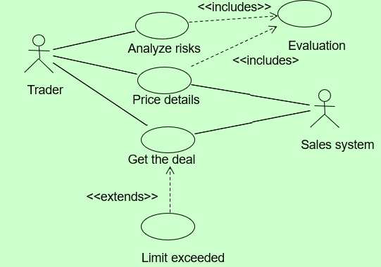
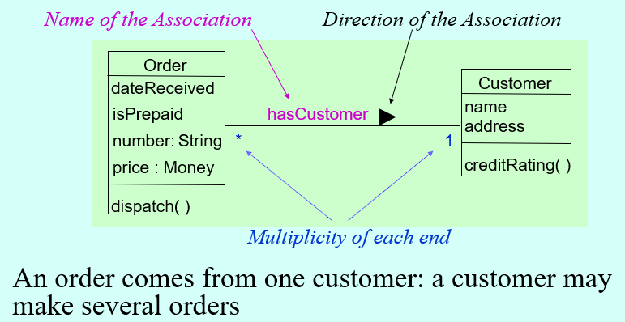

[//]: # (Stili di riferimento per il markdown)
<link rel="stylesheet" href="./res/style.css">

> # Introduzione

---

## Tipi di polimorfismo

Ci sono 4 tipi di polimorfismo:
- *Overloading*
  - Gestito dal compilatore
  - Metodi / funzioni con lo stesso nome ma con una diversa signature, ovvero un numero e/o un tipo diverso di parametri.
- *Funzioni virtuali*
  - Associazione tra nome del metodo e corpo del metodo viene fatto dinamicamente
  - Ci sono linguaggi che usano **reflection**, che permette di sapere dato un oggetto il tipo dell'oggetto, quindi permette all'oggeto di "riflettere" su se stesso, come Java, etc.
  - Ci sono altri linguaggi che non supportano reflection, come C++, che hanno una **vtable**, che guardano la propria vtable per capire come chiamare il metodo.
- *Generici*
  - Si tratta di un tipo parametrico, dove noi definiamo uno scheletro di comportamento che può essere istanziato, non su un oggetto, ma su un tipo di oggetti.
  - Sono risolti in Java durante l'esecuzione, come il più delle volte in altri linguaggi.
- In C++ non ci sono i generici, c'è un "apporssimazione" chiamata *template*
  - Sintassi simila ai generici, ma durante la compilazione vado a costruire il codice sorgente equivalente e dopodiché lo vado a compilare, con il risultato che ho un codice diverso più veloce. Più template ho istanziato, più codice ho generato.
- In C si può usare il preprocessore per fare qualcosa di simile ai template, ma è molto più limitato.

### Overriding

In C++ bisogna usare `virtual` per ottenere il polimorfismo a real time.

```cpp
class A {
  public:
    virtual void foo() { cout << "A::foo()" << endl; }
};

class B : public A {
  public:
    void foo() { cout << "B::foo()" << endl; }
};

int main() {
  A* a = new A();
  B* b = new B();
  A* c = new B();

  a->foo(); // A::foo()
  b->foo(); // B::foo()
  c->foo(); // B::foo()
}
```

Senza virtual ci sarebbe stato un *early binding* e quindi il metodo chiamato sarebbe stato quello della classe A.

---

> ## UML

L'UML ha almeno 9 diagrammi, di cui alcuni sono:
- Strutturali
  - Descrivono la struttura del sistema
  - Quello per le classi, per gli oggetti, per i componenti, per i deployment (ovvero come vanno consegnati ai clienti)
- Comportamentali
  - Descrivono il comportamento del sistema


#### Caso d'uso

Trovare i requisiti del sistema. Come li trovo? Mi faccio raccontare delle storie. Come le rappresento?

**Casi d'uso**, dove ho un attore che interagisce con il sistema e mostra un caso d'uso di esso.

Una descrizione degli *use case* include due parti:
- Un diagramma, dove abbiamo *attori* che rappresentano persone o altri sistemi che interagiscono con il sistema che stiamo descrivendo.
- Una descrizione testuale, che descrive il caso d'uso.
  - Deve essere una descrizione passo passo dell'interazione tra un attore e l'use case.
  - Devo cercare di scrivere poco, in modo chiaro e preciso.

Dobbiamo generare le azioni atomiche che vengono viste esternamente.

Per atomiche si intende il concetto di evitare di usare il caso d'uso "ordina pranzo completo" rispetto a "ordina antipasto", "ordina primo", etc.

Come sviluppare un *use case*:
- Quali sono i principali gesti e azioni che l'attore compie?
- Quale informazione del sistema ottiene, produce o modifica l'attore?
- L'attore dovrà informare il sistema di cambiamenti dell'ambiente esterno?
- Quali informazioni desidera l'attore dal sistema?
- L'attore desidera essere informato da cambiamenti insapettati del sistema?

Esempio:



L'attore effettua delle *use case*. Quindi quando faccio un *use case* devo capire quali sono gli attori del mio sistema. Da notare che esso non è necessariemnte un essere umano. L'attore deve partecipare al sistema, ovvero dobbiamo definire delle funzionalità atomiche dell'uso del sistema.

##### Stereotipi

Visto che abbiamo un numero limitato di frecce, UML usa gli **stereotipi**.

Gli stereotipi sono nomi dati a delle frecce, che hanno un significato particolare, per esempio nel nostro caso abbiamo lo stereotipo `<<include>>` e `<<extends>>`.

A volte si ha la doppia possiblità di usare o uno stereotipo o un simbolo particolare.

Use case viene usato per dare una valutazione all'utente finale. L'use case dipende, quindai da cosa vuole il cliente.

`<<includes>>` viene usato quando abbiamo delle funzionalità simili e che possono essere raggruppate, senza la necessità di fare *copy-paste*.

`<<extends>>` definisce un secondo use case che insieme al use case di riferimento da un nuovo valore al cliente finale. Nel caso d'esempio io posso o "get the deal" in cui concludo l'affare, oppure, use case diverso, sono nel procinto di chiudere l'affare, e nella conclusione dell'affare scopro che non ho i soldi, quindi non posso concludere l'affare. Come notiamo rientra nel concetto di "get the deal", ma è un caso particolare. Sono quindi cose che non hanno valore assestante, ma che guadagnano un senso utile quando combinati con altri use case, formati da più use case.

##### Attenzioni

L'use case NON è l'interfaccia utente: avere un attore che interagisce con un interfaccia la quale include determinati use-case è SBAGLIATO, perché questo è come si farebbe un diagramma normale.

Noi dobbiamo fare un diagramma use-case, quindi dobbiamo avere un approccio diverso.

#### Diagramma delle classi

Dove andiamo a descrivere gli oggetti come appaiono nel sistema.

#### Diagramma a stati

Ci va a definire lo stato in cui si trova il nostro sistema, e ci serve se abbiamo un sistema complesso e ne dobbiamo descrivere un comportamento.

Le macchine a stati risolvono problemi di complessità simile alle regular expression, ovvero che gestiscono cicli e poco altro.

Sepppure semplice, questo è molto comodo in quanto alcuni sistemi non hanno bisogno di particolare complessità.

#### Diagramma di attività

A differenza da un diagramma a stati è simile ad un flowchart, che permette qualunque tipo di complessità.

#### Diagramma di sequenza

Dove vado a descrivere le interazioni tra gli oggetti.

#### Diagramma di collaborazione

Struttura più semplificata, dove nascondo l'asse temporale e semplicemente faccio vedere le interazioni tra gli oggetti.

## Obbiettivi dell'OO

Ci sono due fasi:
- **OO Context Analysis**
  - Dove si capiscono i requisiti del sistema
- **OO Requirements Analysis**
  - Dove si capisce come soddisfare i requisiti del cliente
  - Vedere meglio "use case"


### OO Context Analysis

Cosa è l'analisi OO? Si tratta di un operazione in cui io vado a trovare quali sono gli elementi fondanti del mio sistema, cercando di determinare come questi oggetti possono essere organizzati in classi, come si rapportano gli uni agli altri e poi, se io posso trovare attributi all'interno di una classe, come posso descrivere lo stato della classe attraverso i metodi e poi cercare di descrivere un modello comportamentale e iterare (per capire se abbiamo fatto bene o male, in quanto dobbiamo "esplorare" la conoscenza che noi abbiamo, iterando e migliorando man mano).

Dobbiamo considerare che le relazioni tra i vari elementi sono di due tipi grandi:
- *Statiche*
  - Come le classi sono l'una la specializzazione dell'altra
  - Come le classi sono unite le une alle altre
- *Dinamiche*
  - Che devo andare a vedere a runtime, e che sono le interazioni tra gli oggetti.


## Diagramma a classi

E' quello che abbiamo fatto, in modo testuale, quando abbiamo sviluppato codice con Java o C++.

Il diagramma a classi mostra la struttura statica del sistema:
- *Tipi di oggetti*
- *Relazioni*
  - Dipendenze
  - Ereditarietà
    - L'ereditarietà è, nel 99% dei linguaggi, una ereditarietà addittiva, ovvero che aggiunge funzionalità.
    - Da notare che nell'ereditarietà, noi possiamo evitare che sia addittivo usando private oppure override
      - In particolare, quando si usa override, si ha "Accoppiamento", ovvero coupling, che è una cosa negativa.
      - Questo in quanto se io vado a modificare il padre, il figlio potrebbe non funzionare più.
      - In casi di comportamenti più desiderati si ha "Coesione", o cohesion, che è una cosa positiva.
  - Associazioni


### Livelli di astrazione

Ci sono 3 livelli di astrazione:
- *Concettuale* - **(OOA)**, Conceptual
  - Mostrano i concetti astratti indipendentemente dall'implementazione
  - Rappresenta il sistema, mi evidenzia le entità e le relazioni tra le entità e la loro complessità.
- *Specifiche* - **(OOD)**, Specification
  - Strttura del sistema
  - Interfacce del software (ovvero tipi diversi)
- *Implementazione* - **(OOP)**, Implementation
  - La parte dove si fa il codice
  - Vi sono i dettagli dell'implementazione
  - E' il livello più "usato"

### Classe

Una classe è definita da:
- *Nome*
- *Attributi*
- *Metodi*

Questo viene rappresentato in UML come:

```java
+------------------------+
|     Persona            |
+------------------------+
| nome: String           |
| cognome: String        |
+------------------------+
| +getNome(): String     |
| +getCognome(): String  |
+------------------------+
```

Differenza tra classe e tipo:
- *Classe*
  - Il modo di implementare un tipo
- *Tipo*
  - E' il protocollo di comprensione dell'oggetto
  - Definito dalle operazioni dell'oggetto
  - Le interfacce, in java per esempio, rappresentano dei tipi.
  - I tipi sono solo un protocollo, un insieme di metodi con determinati comportamenti

UML 1.3 ha lo stereotipo `<<type>>`.

#### Associazione

Si tratta della relazione tra diverse istanze di classi. All'interno dell'UML l'associazione si spiega o attraverso una linea semplice o una con un diamante.



In questo esempio vediamo che c'è la molteplicità, come negli schemi E/R. Per mostrarla si usa `[*]` per indicare "N", `[1..*]`, per indicare da 1 a "N", `[0..3]`, etc. C'è inoltre la direzione, ovvero quale a quale è associato e qual'è il nome diq uesta associazione.

Si può anche evitare di usare le associazioni, e si possono usare gli stereotipi, per esempio scrivendo `<<3x2>>`. Però come notiamo questa cosa è molto più complessa da leggere e potrebbe incasinare di tanto.

#### Aggregazione

Segna una relazione tra un entità che contiene più entità. Viene usato il diamante.

Il diamante annerito è la relazione di *composizione*, ovvero che se io distruggo l'oggetto padre distruggo anche l'oggetto figlio.

In particolare, evidenziamo una differenza tra Java e C++, dove nel primo mi creerebbe anche le istanze, mentre nel secondo no in quanto abbiamo un puntatore, e dovremmo gestire noi la memoria.

### Classi e diagrammi

Una classe può essere parte anche di diversi diagrammi.

I diagrammi devono illustrare degli aspetti specifici, devono quindi:
- Non avere troppe classi
- Non avere troppe relazioni
- Nascondere attributi e metodi non rilevanti

Per questo c'è bisogno di iterare sul procedimento della creazione dei diagrammi.

### Nomenclatura associazioni

Per dare nomi alle associazioni è necessario:
- Evitare di usare nomi senza signficiato
  - `associated_with`
  - `has`
  - `is_related_to`
  - Questi nomi sono ovvi
- Il nome è spesso una parte di una parte verbale
  - `has_part`
  - `is_contained_in`

### Ruolo

Il ruolo è un etichetta specifica associata ad una relazione. Se non posso trovare il ruolo, che non è necessario, è implicita dalla classe target.

Si aggiunge al nome dell'associazione.

Per esempio tra `Corso` e `Professore` abbiamo la relazione `insegna` con ruolo, del professore, `èInsegnanteDi` e del corso `èCorsoInsegnato`.

Il ruolo è obbligatorio quando ho associazioni di oggetti della stessa classe. Per esempio se ho una associazione tra `Persona` e `Persona` devo specificare il ruolo, per esempio uno è il padre e l'altro è il figlio, in modo che sia coerente con la moltiplicità.