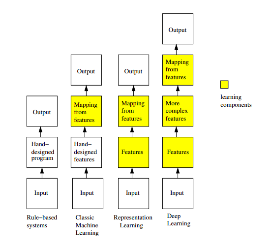

[//]: # (Stili di riferimento per il markdown)
<link rel="stylesheet" href="./res/style.css">

> # Introduzione

---

## Differenti tipo di learning

Vi sono 3 tipi di modi di imparare:
- **Supervised learning**
  - Apprendere una funzione, ovvero gli input e l'output
  - Per allenarlo ho bisogno sia di input sia di output: per ogni input devo avere associata l'etichetta (ovvero l'output).
    - Per ogni mail avere se è spam o no
    - Per ogni immagine avere il numero a cui corrisponde
  - Si chiama *supervised* in quanto il tranining set è stato creato in modo supervisionato da delle persone
- **Unsupervides learning**
  - Semplicemente degli input
  - Capire cosa appartiene a quale gruppo, cosa accomuna dei membri di un "cluster di dati"?
- **Reinforced learning**
  - La tematica è diversa dai primi due: ho un agente che interagisce con un ambiente esterno.
  - L'agente osserva l'ambiente (ovvero ottiene lo "stato" (dell'ambiente))
  - Usando questa osservazione si fa un azione
  - Questa azione si passa all'ambiente e l'ambiente cambia, quindi entra in un certo loop.
  - In riposta al cambiamento dell'ambiente, si fornisce anche una "ricompensa" che indica se qualcosa è andato bene o meno
  - L'agente si occupa, all'interno di questo loop, di migliorare il numero di reward che ottiene in futuro, ovvero considera il future cumulative reward e prendere azioni che ti portano ad averlo più alto possibile.

## Feature

Ogni informazione relativa ad un dato che descrive delle sue caratteristiche importanti si chiama *feature*.

*Feature* sono gli input di un processo di learning.

Il learning è quindi altamente sensibile alla scelta degli input.

La scelta degli input è difficile se fatta a mano: con il deep learning si fa sì che il programma si occupi della sintetizzazione delle feature.

Il *deep learning* lo fa usando dei **neural network**. Un NN è "deep" quando ha diversi **"hidden layer"**, e ognuno computa una nuova feature rispetto a quelli precedenti.

Con le reti neurali c'è il possibile problema di finire nell'ottimo locale piuttosto che nell'ottimo globale, senza possibilità di uscirne. In realtà questo problema non è poi molto importante nella pratica, ma solo nella teoria, in quanto puoi semplicemente riallenare i modelli e vedere se ti danno lo stesso risultato.

## Le varie aree di ricerca

Deep learning ⊂ Representation learning ⊂ Machine learning ⊂ Artificial Intelligence.

In particolare:
- Deep learning
  - Si tratta dell'uso di più layer all'interno di un neural network.
  - Può essere supervisionato, semi-supervisionato o non supervisionato.
- Representation learning
  - Si tratta dell'utilizzo di feature per rappresentare i dati.
- Machine learning
  - Si tratta di un sottoinsieme di AI che si occupa di far imparare ai computer a fare cose che non sono state programmate. (Scoprire da soli gli algoritmi che risolvono un problema)
- Artificial Intelligence
  - Tutto ciò che è relativo alla realizzazione di software che sono capaci di "comportamenti intelligenti".

## Componenti del learning

