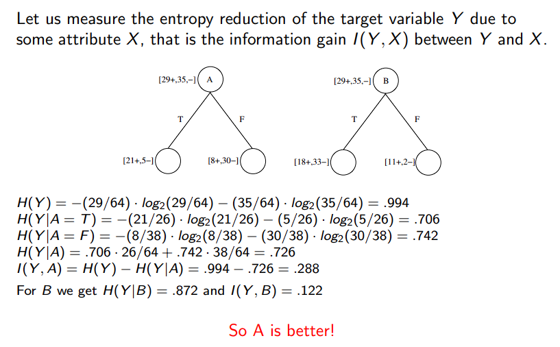

[//]: # (Stili di riferimento per il markdown)
<link rel="stylesheet" href="./res/style.css">

> # Alberi di decisione

---

## Approssimazione di una funzione

### Training set

Abbiamo un training set, ovvero un set di esempi (training sample), formato da:

$$\lang x^{(i)}, y^{(i)} \rang$$

Dove:
- $x^{(i)} \in X$ è un set di input
- $y^{(i)} \in Y$ è un set di output
- $i$ è l'indice del "training sample"

Problema: imparare il mapping da $X$ a $Y$.

Possiamo avere:
- $Y$ discreta
  - Si ha problemi di *classificazione*
  - (Predizione della classe)
- $Y$ continua
  - Si ha problemi di *regressione* 
  - (Predizione dei valori)

### Spazio ipotetico

Il primo passo è la decisione di uno spazio parametrico di modelli e dobbiamo attenerci a quello

Le tecniche di machine learning richiedono di scegliere uno spazio ipotetico di funzioni $H$, dove al suo interno si cerca la funzione che da la miglior approssimazione del training set.

Un modello è un modo per computare una funzione $h \in H$.

Le domande che ci dobbiamo porre: 
1. Ho un albero di decisione per ogni outcome che voglio predire? 
2. Se esiste, è unico?

### Esempio

Supponiamo di avere una funzione che cerca di risolvere la domanda "E' un bel giorno per giocare tennis?".

$F : Outlook \times Temperature \times Humidity \times Wind \rightarrow PlayTennis$

I nomi delle *feature* sono i possibili attributi che abbiamo, pertanto abbiamo "Outlook", "Temperature", "Humidity" e "Wind".

Facciamo un esempio di albero di decisione:

(Ignoriamo per ora la scelta delle feature)

Il funzionamento dell'albero è il seguente: dato un certo input, si segue l'albero per arrivare all'output.

Ogni nodo testa uno degli attributi (feature) di $X$.

Ogni arco corrisponde a uno dei possibili valori di screti di quell'attributo.

Ogni foglia predice la risposta $Y$. (O la probabilità $P(Y|X)$).

Prima di arrivare a capire come costruire l'albero usando un training set, andiamo a definire meglio la struttura dell'albero.

#### Struttura dell'albero di decisione

La configurazione del problema:
- Abbiamo un input set $X$
  - Ogni istanza $x \in X$ è un vettore di feature del tipo $x = \lang Humidity = high, Wind = weak, Outlook = rain, Temp = hot \rang$
- La funzione che dobbiamo scoprire è $f : X \rightarrow Y$
  - $Y$ è un insieme di valori discreti (booleani)
- Lo spazio ipotetico $H = \{h | h: X \rightarrow Y\}$
  - Senza restrizioni
  - Proviamo modellare ogni $h \in H$ con un albero di decisione
  - Ogni istanza $x$ definisce un cammino nell'albero di decisione che ci porta ad una foglia etichettata con la appropriata $y$.

#### Come si costruire un albero di decisione?

Partiamo dall'immaginare di dover fare un albero per la funzione $A \land B$.

#### Costruzione top-down

(Vedere slide 37)

La scritta $[25^{+},35^{-}]$ i indicano il *numero* di valori considerati positivi, e che quindi finiranno nel ramo true, e quelli che sono considerati negativi, che finiscono nel ramo meno.
Per ognuno di questi rami dobbiamo.

In queste slide dobbiamo definire il concetto di miglior attributo, lo vediamo subito sotto.

Nell'esempio precedente, il miglior attributo è $[11^{+}, 2^{-}]$ in quanto è quello che è più significativo, in quanto funziona molto meglio a decidere il prossimo passaggio.

#### Come facciamo a migliorare un albero

Ci sono diversi modi:
- Cercare di rendere l'albero piuttosto bilanciato
- Supponiamo di avere delle feature che spezzano proprio a metà il training set, ovvero che dividono in due parti uguali il training set. In questo caso, possiamo dire che la *feature è inutile*, in quanto non ci aiuta a distinguere i due casi.
  - Dobbiamo cercare **feature che ci diano il massimo guadagno di informazione**, ovvero che ci permettano di distinguere i due casi il più possibile.

#### Entropia

Definiamo *l'entropia*, che ci serve per determinare la quantità di informazioni che un dato ci da.

$$H(X) = - \sum_{i=i}^{n} P(X = i) \log_2 P(X = i)$$

Dove $n$ è il numero di possibili valori che può assumere $X$.

L'entropia misura la quantità di *impurità* dell'informazione. E' massima quando X è uniforme, ovvero quando ogni valore è equiprobabile, mentre è minima quando X è deterministica, ovvero quando un valore è sempre più probabile degli altri.

Per esempio, il grafico di $H(X)$ per $X$ binaria è il seguente:

Da notare che l'entropia diventa 0 attraverso l'uso del limite.

I valori assumibili dall'entropia sono tra 0 e $n*log_2(n)$.

#### Teoria dell'informazione (Shannon)

L'entropia è una misura della quantità di informazione prodotta da un evento.

Più un informazione è *rara* e più essa da informazione, ovvero più è rara e più è utile. Consideriamo quindi la *sorpresa* che ci da un evento.

> Per esempio: il sorgere del sole non mi da alcuna informazione, in quanto sorge sempre.

- Un evento con probabilità 1 non mi da alcuna informazione: $I(1) = 0$.
- Due eventi indipendenti con probabilità $p_{1}$ e $p_{2}$ con una probabilità congiunta $p_{1} * p_{2}$ mi danno una informazione che è la somma delle informazioni dei due eventi indipendenti: $I(p_{1} * p_{2}) = I(p_{1}) + I(p_{2})$.

E' quindi naturale definire l'informazione di un evento $X$ come:

$$I(X) = - \log (p)$$

#### Teoria della codifica (Shannon)

L'entropia può essere anche vista come il numero medio di bit che sono necessario per trasmettere i dati prodotti da una sorgente stocastica di informazione.

Supponiamo di avere n caratteri, di quanti bit ho bisogno per codificarli? 

$$\log_2(n)$$

Se n eventi hanno la stessa probabilità, allora abbiamo:

$$H(X) = -\sum_{i=1}^{n} P(X=i) \log_2 P(X = i)$$
$$= -\sum_{i=1}^{n} 1/n \log_2 1/n$$
$$= \log n$$

Se gli eventi non sono equiprobabili però possiamo fare di meglio.

Sia l'entropia di X:

$$H(X) = -\sum_{i=1}^{n} P(X=i) \log_2 P(X = i)$$

Sia la entropia condizionale di $X$ dato uno specifico $Y=v$

$$H(X|Y=v) = -\sum_{i=1}^{n} P(X=i|Y=v) \log_2 P(X = i|Y=v)$$

Sia l'entropia condizionale di X dato Y (media ponderata di tutti gli *m* possibili valori di Y)

$$H(X|Y) = \sum_{i=1}^{m} P(Y=v_i) H(X|Y=v_i)$$

Il guadagno di informazione tra $X$ e $Y$ è definito come:

$$I(X,Y) = H(X) - H(X|Y) = H(Y) - H(Y|X)$$

Esempio all'interno del quale si capisce quale è quello migliore:

