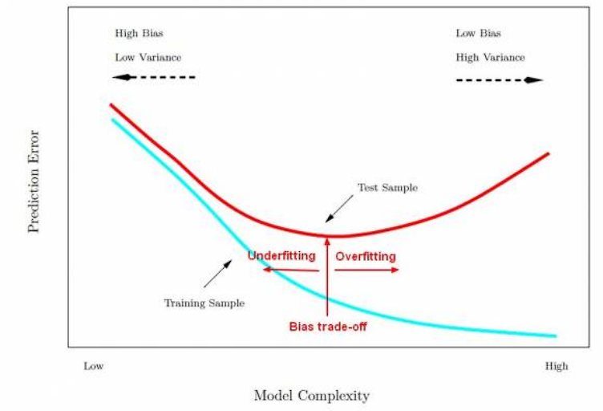

[//]: # (Stili di riferimento per il markdown)
<link rel="stylesheet" href="./res/style.css">

> # Overfitting

---

## Concetto

Consideriamo un errore di un ipotesi $h$ come la differenza tra la sua predizione e il valore reale.

- Sul training set, $error_{train}(h)$
- Sull'intero spazio di input, $error_{D}(h)$

Diciamo che $h$ *overfitta* il training set se esiste un'altra ipotesi $h'$ tale che:

$$
error_{train}(h) < error_{train}(h') \land error_{D}(h) > error_{D}(h')
$$

Quindi noi lo stiamo creando in modo che sia molto preciso sul training set, ma che non sia preciso sull'intero spazio di input, che è sbagliato in quanto è meno importante essere bravi per un sottoinsieme rispetto a tutto l'insieme.

Per complessità si intende la profondità. Più quindi la complessità del modello aumenta, e l'errore con il training sample diminuisce, più aumenterà l'errore con un altro sample di test.

Un *epoca* è un passaggio di training. Man mano passano le epoche durante l'allenamento. Più epoche passano sul training set e più l'errore su di esso diminuisce ma l'errore sul test set aumenta.

## Come evitare l'overfitting

In generale, più dati abbiamo e meglio è. Quindi se si può, per evitare l'overfitting dovremmo ottenere più dati possibili.

Per risolvere l'ovefitting abbiamo un problema principale: non conosciamo $D$.

Quello che facciamo è dividere i dati disponibili in due set *disgiunti*:
- **Training set**, da usare per scegliere $h$
- **Validation set**, da usare per stimare l'errore di $h$
  - I quali comunque vanno ad influenzare il modello scelto
- Per alcuni si usa anche il **test set**
  - Quest'ultimi non vanno ad influenzare il modello, vengono solo usati per stimare l'errore finale

#### Tecniche per evitare l'overfitting negli alberi di decisione

Abbiamo:
- *Early stopping*
  - Si ferma la costruzione dell'albero appena il miglioramento della classificazione non è più significativo (ovvero quando il guadagno di informazione è minore di una certa **threshold**, e/o quando non abbiamo dati sufficienti)
- *Post-pruning*
  - Si costruisce l'albero per intero e poi si semplifica (backward prune)

