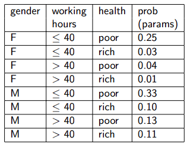

[//]: # (Stili di riferimento per il markdown)
<link rel="stylesheet" href="./res/style.css">

> # Approccio probabilistico

---

## Concetto

Siamo interessati ad approssimare le funzioni.

Al posto di computare:

$$ f : X \rightarrow Y $$

Potremmo voler computare la probabilità di $Y$ dato $X$:

$$ p : P(Y|X) $$

#### Ricapitoliamo un attimo concetti di probabilità

- **Eventi**
  - Variabili aleatorie discrete e continue
- **Assiomi della teoria della probabilità**
  - Una ragionevole teoria dell'incertezza
- **Eventi indipendenti**
- **Probabilità condizionale**
- **Teorema di Bayes**
- **Distribuzione di probabilità congiunta**
- **Previsioni**
- **Indipendenza, indipendenza condizionale**

I dettagli si possono leggere sulle slide di introduzione, in particolare da 65 a 80.

## Distribuzione di probabilità congiunta

Caso:
1. Si crea una table con tutte le possibili combinazioni di valori di variabili casuali (feature)
2. Si computa la probabilità per ognuna di queste combinazioni

Dati $n$ valori (booleani), dobbiamo computare $2^n-1$ parametri.

Per esempio noi abbiamo questa tabella:

In questo caso abbiamo 3 parametri, e difatti abbiamo un totale di 8 combinazioni.

### Cosa ci possiamo fare

Una volta che abbiamo la distribuzione congiunta possiamo calcolare in particolare la possiblità di ogni evento come la combinazione logica delle feature:

$$
P(E) = \sum_{row \in E} {P(row)}
$$

Per esempio, se nell'esempio vogliamo calcolare la probablità di $P(M,poor)$, andiamo a sommare la 5° e la 7° riga, ottenendo $P(M,poor) = 0.33 + 0.13 = 0.46$.

E' anche facile computare la probabilità di un evento dato un altro evento:

$$
P(E_{1} | E_{2}) = \frac{P(E_{1} \wedge E_{2})}{P(E_{2})} = \frac{\sum_{row \in E_{1} \wedge E_{2}} {P(row)}}{\sum_{row \in E_{2}} {P(row)}}
$$

Per esempio, se vogliamo calcolare $P(M|poor)$, essa è uguale a $\frac{P(M,poor)}{P(poor)}$. Sappiamo che $P(M, poor) = 0.46$, mentre $P(poor)$ è la somma di tutte le righe che hanno poor, quindi la 1°, la 3°, la 5° e la 7°. Il totale è $0.75$. Il risultato quindi è $\frac{0.46}{0.75} = 0.61$.

Fare un approccio di questo tipo risulta però impossibili da un punto di vista pratico per determinate situazioni, in quanto il numero di parametri da calcolare è troppo elevato.

Se pensiamo al numero di pixel e al numero di colori che possono assumere, il numero di parametri da calcolare è esagerato. Oltre a questo, non abbiamo abbastanza immagini (ovvero ogni immagine possibile) per riuscire a risolvere queste probabilità in modo esatto.

## Approccio naive (Naive Bayes)

L'approccio naive di bayes assume che:

$$
P(X_1,X_2,...,X_{n} | Y) = \prod_{i} {P(X_{i} | Y)}
$$

Dato $Y$, con $X_{i}$ e $X_{j}$ indipendenti, la probabilità congiunta è il prodotto delle probabilità condizionali.

Due eventi sono indipendenti se, dato un $Y$:

$$
P(X_{i} | X_{j}, Y) = P(X_{i} | Y)
$$

#### Esempio 1
Una scatola contiene due monete: una normale e una truccata, dove entrambe le facce hanno testa. Scegliamo una moneta a caso, la lanciamo due volte, e consideriamo i seguenti eventi:

- $A$ = "la prima faccia è testa"
- $B$ = "la seconda faccia è testa"
- $C$ = "la moneta è normale"

A e B non sono indipendenti, ma sono condizionalmente indipendenti dato C.

#### Esempio 2
Per delle persone, altezza e vocabolario non sono indipendenti, ma lo sono se è data l'età.

### Proprietà

$$
P(X_{1},X_{2}|Y) = P(X_{1}|Y)P(X_{2}|Y) = P(X_{2}|Y)P(X_{1}|Y)
$$

In generale

$$
P(X_{1},X_{2},...,X_{n}|Y) = \prod_{i}{P(X_{i} | Y)}
$$

Qaunti parametri per descrivere la distribuzione congiunta (nel caso booleano)?
- Senza la naive bayes: $2^n - 1$
- Con la naive bayes: $2n - 1$

## Procedimento

La prima cosa che dobbiamo fare è stimare i priors, ovvero osservare la tabella e capire la probabilità di ogni classe.

Nel caso del nostro esempio contiamo i yes e i no, ottenendo $\pi_{yes} = 0.64$ e $\pi_{no} = 0.36$.

Di solito si cerca di lavorare con dei dataset bilanciati, e in tal caso cercheremo di ottenere dei priors che sono del 50% in entrambi i casi. In questo caso c'è una certa preferenza per il $yes$.

Adesso dividiamo il dataset in due, prima consideriamo tutti quelli con yes e poi tutti quelli con no.

Nella tabella con $yes$ andiamo a stimare in modo individuale la probabilità per ogni feature. Quante volte l'outlook per esempio risulta essere sunny? Lo andiamo a contare all'interno della tabella, ottenendo $\theta_{sunny,yes} = 2/9$. Lo andiamo a ripetere per ognuna delle nostre feature, quindi per temperatura, umidità, etc.

> Data la risposta calcoliamo i valori delle feature 
> Relativo a come dovrebbe venire interpretata la formula di naive bayes

> Avere un approccio che è naive bayes si basa sul non andarli a conisderare come congiunti

Da notare che alcune delle cose che calcoliamo *possono avere probabilità 0*. E da notare che non possiamo fare il logaritmo su 0. Ci aggiungiamo 1 ovunque.

Supponiamo di avere una nuova istanza, formata da, per esempio:

- Outlook = sunny
- Temperature = cool
- Humidity = high
- Wind = strong

Dobbiamo calcolare:

$$
arg max _{y \in yes, no} p(y) \cdot p(sunny | y) \cdot p(cool | y) \cdot p(high|y) \cdot p(strong|y)
$$

Ovvero dobbiamo confrontare:

$$
\pi_{yes} \cdot \theta_{sunny,yes} \cdot \theta_{cool,yes} \cdot \theta_{high,yes} \cdot \theta_{strong,yes}
$$

e

$$
\pi_{no} \cdot \theta_{sunny,no} \cdot \theta_{cool,no} \cdot \theta_{high,no} \cdot \theta_{strong,no}
$$

Il primo è $9/14 \cdot 2/9 \cdot 3/9 \cdot 3/9 \cdot 3/9 = 0.0053$.

Il secondo è $5/14 \cdot 3/5 \cdot 1/5 \cdot 4/5 \cdot 3/5 = 0.0205$.

Quindi posso concludere che non è un buon giorno per giocare a tennis, concludendolo usando la mia esperienza passata.

Come lo andiamo a trasformare in una probabilità da questi valori?

Innanzitutto non mi aspetto che faccia uno la somma dei due valori ottenuti in quanto sto usando solo i numeratori delle due probaiblità. Quindi devo andare a normalizzarli, e come li normalizzo? devo andare a inclduere anche i denominatori, ovveor devo andare a dividere per la somma di tutti i valori.

