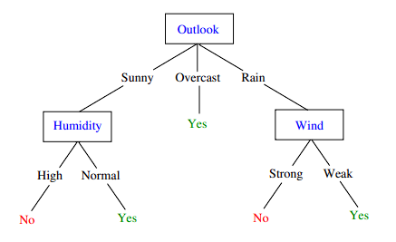
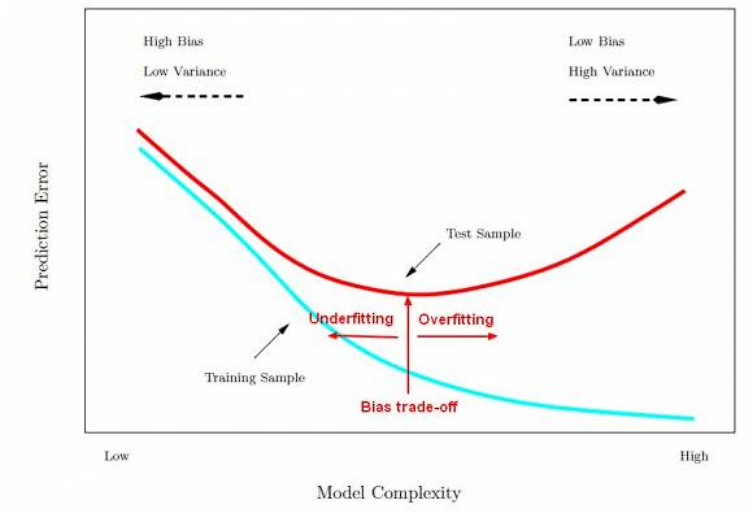

[//]: # (Stili di riferimento per il markdown)
<link rel="stylesheet" href="./res/style.css">

> # Alberi di decisione

---

## Approssimazione di una funzione

### Training set

Abbiamo un training set, ovvero un set di esempi (training sample), formato da:

$$\lang x^{(i)}, y^{(i)} \rang$$

Dove:
- $x^{(i)} \in X$ è un set di input
- $y^{(i)} \in Y$ è un set di output (**ground truth**)
- $i$ è l'indice del "training sample"

Problema: imparare il mapping da $X$ a $Y$.

Possiamo avere:
- $Y$ discreta
  - Si ha problemi di *classificazione*
  - (Predizione della classe)
- $Y$ continua
  - Si ha problemi di *regressione* 
  - (Predizione dei valori)

### Spazio delle ipotesi

Il primo passo è la decisione di uno spazio parametrico di modelli e dobbiamo attenerci a quello

Le tecniche di machine learning richiedono di scegliere uno spazio ipotetico di funzioni $H$, dove al suo interno si cerca la funzione che da la miglior approssimazione del training set.

Un modello è un modo per computare una funzione $h \in H$.

Le domande che ci dobbiamo porre: 
1. Ho un albero di decisione per ogni outcome che voglio predire?
   1. "Abbiamo un modello per ogni funzione $h$ nello spazio delle ipotesi?" 
2. Se esiste, è unico?
3. Se non esiste, abbiamo una preferenza?

### Esempio

Supponiamo di avere una funzione che cerca di risolvere la domanda "E' un bel giorno per giocare tennis?".

$F : Outlook \times Temperature \times Humidity \times Wind \rightarrow PlayTennis$

I nomi delle *feature* sono i possibili attributi che abbiamo, pertanto abbiamo "Outlook", "Temperature", "Humidity" e "Wind".

Facciamo un esempio di albero di decisione:

(Ignoriamo per ora la scelta delle feature)

Il funzionamento dell'albero è il seguente: dato un certo input, si segue l'albero per arrivare all'output.

Ogni nodo testa uno degli attributi (feature) di $X$.

Ogni arco corrisponde a uno dei possibili valori di screti di quell'attributo.

Ogni foglia predice la risposta $Y$. (O la probabilità $P(Y|X)$).

Prima di arrivare a capire come costruire l'albero usando un training set, andiamo a definire meglio la struttura dell'albero.

#### Struttura dell'albero di decisione

La configurazione del problema:
- Abbiamo un input set $X$
  - Ogni istanza $x \in X$ è un vettore di feature del tipo $x = \lang Humidity = high, Wind = weak, Outlook = rain, Temp = hot \rang$
- La funzione che dobbiamo scoprire è $f : X \rightarrow Y$
  - $Y$ è un insieme di valori discreti (booleani)
- Lo spazio ipotetico $H = \{h | h: X \rightarrow Y\}$
  - Senza restrizioni
  - Proviamo modellare ogni $h \in H$ con un albero di decisione
  - Ogni istanza $x$ definisce un cammino nell'albero di decisione che ci porta ad una foglia etichettata con la appropriata $y$.

#### Come si costruire un albero di decisione?

Partiamo dall'immaginare di dover fare un albero per la funzione $A \land B$.

#### Costruzione top-down

Il loop di costruzione dell'albero di decisione *top-down* induttivo è il seguente:
1. Assegnare al nodo corrente il "miglior attributo $X_i$
   1. Il miglior attributo è quello che massimizza il guadagno di informazione, ovvero quello che ci permette di distinguere meglio i due casi.
   2. Per esempio, se dovessimo capire se si può nuotare nel mare, il miglior attributo sarebbe "Presenza di squali", in quanto ci permette di distinguere meglio i due casi (si/no).
2. Creare un nodo figlio per ogni possibile valore di $X_i$ e propagare i dati verso i figli a seconda del loro valore
3. Per ogni nodo figlio, se tutti i dati del training set associati al nodo hanno una stessa etichetta $y$, marcare il nodo come foglia con etichetta $y$, altrimenti ripetere come dal primo punto.

La scritta $[25^{+},35^{-}]$ i indicano il *numero* di valori considerati positivi, e che quindi finiranno nel ramo true, e quelli che sono considerati negativi, che finiscono nel ramo meno.
Per ognuno di questi rami dobbiamo.

In queste slide dobbiamo definire il concetto di miglior attributo, lo vediamo subito sotto.

Nell'esempio precedente, il miglior attributo è $[11^{+}, 2^{-}]$ in quanto è quello che è più significativo, in quanto funziona molto meglio a decidere il prossimo passaggio.

#### Come facciamo a migliorare un albero

Ci sono diversi modi:
- Cercare di rendere l'albero piuttosto bilanciato
- Supponiamo di avere delle feature che spezzano proprio a metà il training set, ovvero che dividono in due parti uguali il training set. In questo caso, possiamo dire che la *feature è inutile*, in quanto non ci aiuta a distinguere i due casi.
  - Dobbiamo cercare **feature che ci diano il massimo guadagno di informazione**, ovvero che ci permettano di distinguere i due casi il più possibile.

#### Entropia

Definiamo *l'entropia*, che ci serve per determinare la quantità di informazioni che un dato ci da.

$$H(X) = - \sum_{i=i}^{n} P(X = i) \log_2 P(X = i)$$

Dove $n$ è il numero di possibili valori che può assumere $X$.

L'entropia misura la quantità di *impurità* dell'informazione. E' massima quando X è uniforme, ovvero quando ogni valore è equiprobabile, mentre è minima quando X è deterministica, ovvero quando un valore è sempre più probabile degli altri.

Per esempio, il grafico di $H(X)$ per $X$ binaria è il seguente:

Da notare che l'entropia diventa 0 attraverso l'uso del limite. (In quanto $\lim_{x \to 0} x \log_2 x = 0$)

I valori assumibili dall'entropia sono tra 0 e $log_2(n)$.

#### Teoria dell'informazione (Shannon)

L'entropia è una misura della quantità di informazione prodotta da un evento.

Più un informazione è *rara* e più essa da informazione, ovvero più è rara e più è utile. Consideriamo quindi la *sorpresa* che ci da un evento.

> Per esempio: il sorgere del sole non mi da alcuna informazione, in quanto sorge sempre.

- Un evento con probabilità 1 non mi da alcuna informazione: $I(1) = 0$.
- Due eventi indipendenti con probabilità $p_{1}$ e $p_{2}$ con una probabilità congiunta $p_{1} * p_{2}$ mi danno una informazione che è la somma delle informazioni dei due eventi indipendenti: $I(p_{1} * p_{2}) = I(p_{1}) + I(p_{2})$.

E' quindi naturale definire l'informazione di un evento $X$ come:

$$I(X) = - \log (p)$$

#### Teoria della codifica (Shannon)

Questa è una parte che boh non serve a nulla però l'hanno scritta. Essenzialmente ci dice che: più qualcosa ha entropia bassa, più è facile da codificare.

L'entropia può essere anche vista come il numero medio di bit che sono necessario per trasmettere i dati prodotti da una sorgente stocastica di informazione.

Supponiamo di avere n caratteri, di quanti bit ho bisogno per codificarli? 

$$\log_2(n)$$

Se n eventi hanno la stessa probabilità, allora abbiamo:

$$
H(X) = -\sum_{i=1}^{n} P(X=i) \log_2 P(X = i)
\\ \ \\
= -\sum_{i=1}^{n} 1/n \log_2 1/n
\\ \ \\
= \log n
$$

Se gli eventi non sono equiprobabili però possiamo fare di meglio.

Cosa vuol dire che si può fare di meglio? Vuol dire che possiamo usare meno bit per codificare i dati che appaiono spesso e più bit per codificare i dati che appaiono raramente.

In questo modo, mediamente inviamo meno bit, pertanto abbiamo una codifica migliore. (In quanto la codifica è più efficiente)

Cosa centra con AI? Niente. Penso.

#### Guadagno di informazione

Sia l'entropia di X:

$$
H(X) = -\sum_{i=1}^{n} P(X=i) \log_2 P(X = i)
$$

Sia la entropia condizionale di $X$ dato uno specifico $Y=v$

$$
H(X|Y=v) = -\sum_{i=1}^{n} P(X=i|Y=v) \log_2 P(X = i|Y=v)
$$

Sia l'entropia condizionale di X dato Y (media ponderata di tutti gli *m* possibili valori di Y)

$$H(X|Y) = \sum_{i=1}^{m} P(Y=v_i) H(X|Y=v_i)$$

Il guadagno di informazione tra $X$ e $Y$ è definito come:

$$I(X,Y) = H(X) - H(X|Y) = H(Y) - H(Y|X)$$

Esempio all'interno del quale si capisce quale è quello migliore:

> Modo per pensarci concettualmente: data la conoscenza attuale, quanto mi da di più la conoscenza di una certa feature?
>
> Sia l'entropia della mia variabile $H(Y)$ e sia l'entropia della mia variabile dato una certa feature $H(Y|X)$, il guadagno di informazione è la differenza tra le due.

### Il caso continuo

Quando gli attributi sono continui, prendiamo le decisioni in base a opportune *soglie* (thresholds):

Dato un nodo, nel quale c'è una condizione $X \leq \theta$, abbiamo due figli, uno per $X \leq \theta$ e uno per $X > \theta$ (uno per $true$ e uno per $false$).

- Confrontiamo le varie soglie in base al loro guadagno informativo
- Ma come scegliere le soglie candidate?
  - Sampling a intervalli discreti prefissati
  - Ordinare il train set rispetto a un dato attributo e scegliere come soglie i valori medi tra dati consecutivi.

### Esempio slide 48

Spiegazione Esempio slide 48

Abbiamo 4 feature in input, che sono $X_1, X_2, X_3, X_4$.

Da notare che il commento è sbagliato, in quanto se sono uguali è 0 e se sono diversi è 1.

## Overfitting

### Introduzione

Consideriamo un errore di un ipotesi $h$ come la differenza tra la sua predizione e il valore reale.

- Sul training set, $error_{train}(h)$
- Sull'intero spazio di input, $error_{D}(h)$

Diciamo che $h$ *overfitta* il training set se esiste un'altra ipotesi $h'$ tale che:

$$
error_{train}(h) < error_{train}(h') \land error_{D}(h) > error_{D}(h')
$$

Quindi noi lo stiamo creando in modo che sia molto preciso sul training set, ma che non sia preciso sull'intero spazio di input, che è sbagliato in quanto è meno importante essere bravi per un sottoinsieme rispetto a tutto l'insieme.

Per complessità si intende la profondità. Più quindi la complessità del modello aumenta, e l'errore con il training sample diminuisce, più aumenterà l'errore con un altro sample di test.

Un *epoca* è un passaggio di training. Man mano passano le epoche durante l'allenamento. Più epoche passano sul training set e più l'errore su di esso diminuisce ma l'errore sul test set aumenta.

### Come evitare l'overfitting

In generale, più dati abbiamo e meglio è. Quindi se si può, per evitare l'overfitting dovremmo ottenere più dati possibili.

Per risolvere l'ovefitting abbiamo un problema principale: non conosciamo $D$.

Quello che facciamo è dividere i dati disponibili in due set *disgiunti*:
- **Training set**, da usare per scegliere $h$
- **Validation set**, da usare per stimare l'errore di $h$
  - I quali comunque vanno ad influenzare il modello scelto
- Per alcuni si usa anche il **test set**
  - Quest'ultimi non vanno ad influenzare il modello, vengono solo usati per stimare l'errore finale

#### Tecniche per evitare l'overfitting negli alberi di decisione

Abbiamo:
- *Early stopping*
  - Si ferma la costruzione dell'albero appena il miglioramento della classificazione non è più significativo (ovvero quando il guadagno di informazione è minore di una certa **threshold**, e/o quando non abbiamo dati sufficienti)
- *Post-pruning*
  - Si costruisce l'albero per intero e poi si semplifica (backward prune)

Il *Post-pruning*, in passaggi algoritmici, ripete le seguenti operazioni fino a quando non migliora l'accuratezza della predizione:
1. Per ogni sottoalbero, valutare (sul *validation set*) l'impatto della sua rimozione sulla accuratezza della classificazione
2. Effettuare (in modo greedy) il pruning del sottoalbero che ottimizza l'accuracy

---

## Perché usare i decision tree?

Aspetti *positivi*:
- Sono semplici da capire: semplici regole logiche, gli alberi possono essere visualizzati
- Poco preprocessing: non serve normalizzare i dati, non serve gestire i missing values
- Basso costo per la classificazione: tempo logaritmico nella dimensione dell'albero
- Possono sia essere usati per feature discrete che continue

Aspetti *negativi*:
- Alto rischio di overfitting
- La scelta degli attributi è molto instabile
- Facile costruire alberi molto sbilanciati, specialmente se una classe è dominante.
  - Potrebbe quindi essere utile bilanciare il training set

## Foreste

Di solito gli alberi di decisione vengono usati come componenti in Foreste Casuali, operando come un *ensamble*.

Le tecniche *ensamble* sfruttano il principio secondo il quale un largo numero di modelli relativamente semplici, che operano in parallelo, sono migliori di un singolo modello complesso.

Come si garantisce la differenziazione degli albreri? Si possono usare:
- *Bagging*
  - Dando diversi, casualmente scelti, training set
- *Feature randomness*
  - Costruendo alberi da un sottoinsieme casuale delle feature

## Varianti: Gini's impurity

Gini's impurity (coefficiente di Gini) misura la probabilità che un generico elemento sia mal classificato in base alla classificazione corrente (è una possibile alternativa alla nozione di entropia).

Date $m$ categorie, sia $f_i$ la frazione dei dati con etichetta $i$.

Questa è pari alla probabilità che un qualche input appartenga alla categoria $i$. La probabilità che venga classificato in modo errato è dunque pari a $1 - f_i$, e il coefficiente di Gini è semplicemente la media pesata di queste quantità su tutte le possibili categorie, cioè:

$$
I_G(f) = \sum_{i=1}^{m} f_i (1 - f_i) = 1 - \sum_{i=1}^{m} f_i^2
$$

La metrica è applicata su ogni nodo figlio, e i valori sono sommati in modo pesato, in modo del tutto analogo a quanto avviene per l'entropia, al fine di ottenere una misura della qualità dell'attributo.