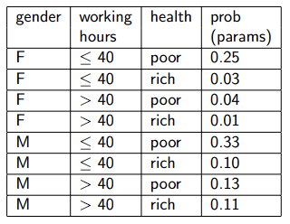
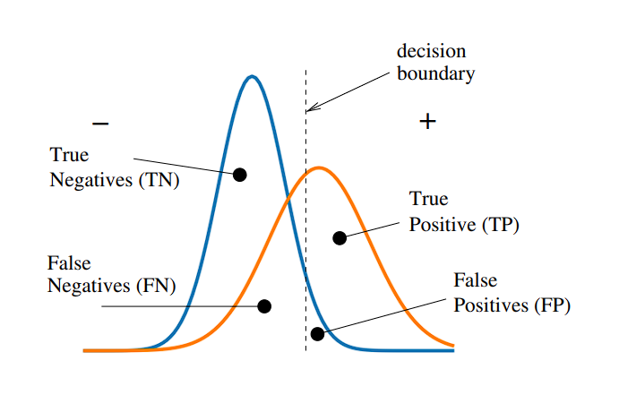

[//]: # (Stili di riferimento per il markdown)
<link rel="stylesheet" href="./res/style.css">

> # Approccio probabilistico

---

## Introduzione

### Idea principale

Siamo interessati ad approssiamre le funzioni. Pertanto, invece di calcolaare:

$$
f : X \rightarrow Y
$$

Possiamo calcolare:

$$
p : P(Y | X)
$$

## Ripasso di statistica

Vedere [qui](./new_04_ripassoprobabilit%C3%A0.md).

## Distribuzione di probabilità congiunta

Caso:
1. Si crea una table con tutte le possibili combinazioni di valori di variabili casuali (feature)
2. Si computa la probabilità per ognuna di queste combinazioni

Dati $n$ valori (booleani), dobbiamo computare $2^n-1$ parametri.

Per esempio noi abbiamo questa tabella:

In questo caso abbiamo 3 parametri, e difatti abbiamo un totale di 8 combinazioni.

### Cosa ci possiamo fare

Una volta che abbiamo la distribuzione congiunta possiamo calcolare in particolare la possiblità di ogni evento come la combinazione logica delle feature:

$$
P(E) = \sum_{row \in E} {P(row)}
$$

Per esempio, se nell'esempio vogliamo calcolare la probablità di $P(M,poor)$, andiamo a sommare la 5° e la 7° riga, ottenendo $P(M,poor) = 0.33 + 0.13 = 0.46$.

E' anche facile computare la probabilità di un evento dato un altro evento:

$$
P(E_{1} | E_{2}) = \frac{P(E_{1} \wedge E_{2})}{P(E_{2})} = \frac{\sum_{row \in E_{1} \wedge E_{2}} {P(row)}}{\sum_{row \in E_{2}} {P(row)}}
$$

Per esempio, se vogliamo calcolare $P(M|poor)$, essa è uguale a $\frac{P(M,poor)}{P(poor)}$. Sappiamo che $P(M, poor) = 0.46$, mentre $P(poor)$ è la somma di tutte le righe che hanno poor, quindi la 1°, la 3°, la 5° e la 7°. Il totale è $0.75$. Il risultato quindi è $\frac{0.46}{0.75} = 0.61$.

Fare un approccio di questo tipo risulta però impossibili da un punto di vista pratico per determinate situazioni, in quanto il numero di parametri da calcolare è troppo elevato.

Se pensiamo al numero di pixel e al numero di colori che possono assumere, il numero di parametri da calcolare è esagerato. Oltre a questo, non abbiamo abbastanza immagini (ovvero ogni immagine possibile) per riuscire a risolvere queste probabilità in modo esatto.

#### Per arrivare a questa conclusione, seguiamo i seguenti passaggi logici:

Noi quindi siamo passati dal calcolare:

$$
f : X \rightarrow Y
$$

a calcolare la probabilità condizionata, ovvero:

$$
p : P(Y | X)
$$

Quindi sappiamo, dato un X e una certa Y che vogliamo capire, qual è la probabilità che Y sia quella che vogliamo noi.

Costruiamo quindi un esempio, per esempio la tabella relativa a:

$$
P(Y=\text{wealth} | X_1 = \text{gender}, X_2 = \text{ore lavorate})
$$

Creiamo una tabella con dei dati:

| $X_1 = gender$ | $X_2 = ore lav.$ | $P(\text{rich} \mid X_1, X_2)$ | $P(\text{poor} \mid X_1, X_2)$ |
|---|---|---|---|
| $F$ | $\leq 40$ | $0.09$ | $0.91$ |
| $F$ | $\geq 40$ | $0.21$ | $0.79$ |
| $M$ | $\leq 40$ | $0.23$ | $0.77$ |
| $M$ | $\geq 40$ | $0.38$ | $0.62$ |

Per riempire la tabella dobbiamo stimare $4 = 2^2$ parametri.

Se avessimo $n$ paramtri (feature), $X = X_1 \times X_2 \times ... \times X_n$, dove ogni $X_i$ è booleana, dovremmo calcolare $2^n$ parametri.

Questi parametri sono *probabilities*: per ottenere valori statisticamente significativi dovremmo avere molti esempi per ogni configurazione.

Per esempio, se abbiamo 10 feature, e ogni feature può assumere 2 valori, abbiamo $2^{10} = 1024$ parametri da calcolare. Se abbiamo 1000 esempi, abbiamo in media 1 esempio per ogni configurazione, il che non è sufficiente.

## Approccio naive (Naive Bayes)

L'approccio naive di bayes assume che:

$$
P(X_1,X_2,...,X_{n} | Y) = \prod_{i} {P(X_{i} | Y)}
$$

Dato $Y$, con $X_{i}$ e $X_{j}$ indipendenti, la probabilità congiunta è il prodotto delle probabilità condizionali.

Due eventi sono indipendenti se, dato un $Y$:

$$
P(X_{i} | X_{j}, Y) = P(X_{i} | Y)
$$

#### Esempio 1
Una scatola contiene due monete: una normale e una truccata, dove entrambe le facce hanno testa. Scegliamo una moneta a caso, la lanciamo due volte, e consideriamo i seguenti eventi:

- $A$ = "la prima faccia è testa"
- $B$ = "la seconda faccia è testa"
- $C$ = "la moneta è normale"

A e B non sono indipendenti, ma sono condizionalmente indipendenti dato C.

#### Esempio 2
Per delle persone, altezza e vocabolario non sono indipendenti, ma lo sono se è data l'età.

### Proprietà

$$
P(X_{1},X_{2}|Y) = P(X_{1}|Y)P(X_{2}|Y) = P(X_{2}|Y)P(X_{1}|Y)
$$

In generale

$$
P(X_{1},X_{2},...,X_{n}|Y) = \prod_{i}{P(X_{i} | Y)}
$$

Qaunti parametri per descrivere la distribuzione congiunta (nel caso booleano)?
- Senza la naive bayes: $2^n - 1$
- Con la naive bayes: $2n - 1$

Quindi noi passiamo da:

$$
P(Y = y_i \mid X = x_j) = \frac{P(Y = y_i) P(X_1,...,X_n \mid Y=y_i)}{P(X_1,...,X_n)}
$$

A usare la formula:

$$
P(Y = y_i \mid X = x_j) = \frac{P(Y = y_i) \prod_{k=1}^{n} P(X_k \mid Y=y_i)}{P(X_1,...,X_n)}
$$

## Procedimento

La prima cosa che dobbiamo fare è stimare i priors, ovvero osservare la tabella e capire la probabilità di ogni classe.

Nel caso del nostro esempio contiamo i yes e i no, ottenendo $\pi_{yes} = 0.64$ e $\pi_{no} = 0.36$.

Di solito si cerca di lavorare con dei dataset bilanciati, e in tal caso cercheremo di ottenere dei priors che sono del 50% in entrambi i casi. In questo caso c'è una certa preferenza per il $yes$.

Adesso dividiamo il dataset in due, prima consideriamo tutti quelli con yes e poi tutti quelli con no.

Nella tabella con $yes$ andiamo a stimare in modo individuale la probabilità per ogni feature. Quante volte l'outlook per esempio risulta essere sunny? Lo andiamo a contare all'interno della tabella, ottenendo $\theta_{sunny,yes} = 2/9$. Lo andiamo a ripetere per ognuna delle nostre feature, quindi per temperatura, umidità, etc.

> Data la risposta calcoliamo i valori delle feature 
> Relativo a come dovrebbe venire interpretata la formula di naive bayes

> Avere un approccio che è naive bayes si basa sul non andarli a conisderare come congiunti

Da notare che alcune delle cose che calcoliamo *possono avere probabilità 0*. E da notare che non possiamo fare il logaritmo su 0. Ci aggiungiamo 1 ovunque.

Supponiamo di avere una nuova istanza, formata da, per esempio:

- Outlook = sunny
- Temperature = cool
- Humidity = high
- Wind = strong

Dobbiamo calcolare:

$$
arg \ max _{y \in yes, no} \ p(y) \cdot p(sunny | y) \cdot p(cool | y) \cdot p(high|y) \cdot p(strong|y)
$$

Ovvero dobbiamo confrontare:

$$
\pi_{yes} \cdot \theta_{sunny,yes} \cdot \theta_{cool,yes} \cdot \theta_{high,yes} \cdot \theta_{strong,yes}
$$

e

$$
\pi_{no} \cdot \theta_{sunny,no} \cdot \theta_{cool,no} \cdot \theta_{high,no} \cdot \theta_{strong,no}
$$

Il primo è $9/14 \cdot 2/9 \cdot 3/9 \cdot 3/9 \cdot 3/9 = 0.0053$.

Il secondo è $5/14 \cdot 3/5 \cdot 1/5 \cdot 4/5 \cdot 3/5 = 0.0205$.

Quindi posso concludere che non è un buon giorno per giocare a tennis, concludendolo usando la mia esperienza passata.

Come lo andiamo a trasformare in una probabilità da questi valori?

Innanzitutto non mi aspetto che faccia uno la somma dei due valori ottenuti in quanto sto usando solo i numeratori delle due probaiblità. Quindi devo andare a normalizzarli, e come li normalizzo? devo andare a inclduere anche i denominatori, ovveor devo andare a dividere per la somma di tutti i valori.

### Teniche generative del Naive Bayes

Osserviamo quindi la natura generativa del Naive Bayes.

Siamo interessati a calcolare:

$$
P(Y = y_i \mid X_1,...,X_n)
$$

Quindi calcolare quanto è la probabilità che sia un certo risultato dao un insieme di feature che vengono osservate (le X).

La regola di Bayes ci permette di *rovesciare il problema*, cercando di stimare la distribuzione dei dati, data la categoria:

$$
P(X_1,...,X_n \mid Y = y_i)
$$

Questo equivale quindi ad ottenere l'insieme di feature che sono più probabili dato un certo risultato.

Quindi, per esempio per il riconoscimento dei numeri, se usando un insieme di eventi ci riusciamo a costruire un modello, poi possiamo usare Bayes per ottenere "l'immagine" associata a quel numero, che quindi mostra il valore per ogni feature.

Classificando una nuova istanza chiediamoci a quale delle varie distribuzioni dei dati che abbiamo stimato è più probabile che appartenga.

#### Congiunta vs Naive Bayes

Saremmo interessati alle distribuzioni congiunte:

$$
P(X_1,...,X_n \mid Y = y_i)
$$

Ma abbiamo visto che questo, in generale, non è fattibile per questioni di complessità.

Quindi adottiamo un approccio naive, assumendo che le feature siano indipendenti tra loro (data la classe), riducendo il problema alla stima di:

$$
P(X_j \mid Y = y_i)
$$

per tutte le feature $X_j, j\in \{1,...,n\}$.

### Cautele con Naive Bayes

#### Zero-frequency problem

In alcuni casi, MLE per un certo $P(X_i, Y)$ può essere 0.

Per esempio, nell'esempio di prima: $P(play = no \mid outlook = overcast) = 0$

Ci dovremmo preoccupare?
- Si, perché se abbiamo un esempio con queste caratteristiche, non saremmo in grado di classificarlo in modo corretto necessariamente

Come possiamo evitare il problema?
- Aggiungendo dei dati

#### Indipendenza degli eventi

Naive Bayes assume che le feature siano indipendenti tra loro. Ma se così non fosse?

Se noi per esempio dovessimo classificare il seguente problema:

> Da un immagine casuale, con pixels a valori 0 o 1. Scegliamo due pixel $p_1$ e $p_2$. Vogliamo classificare l'immagine nella categoria $A$ se $p_1 == p_2$ e nella categoria $B$ altrimenti.

Notiamo che però, con Naive Bayes, noi andremmo a considerare i due pixel come indipendenti, mentre in realtà non lo sono.

Pertanto non riusciremmo a classificare correttamente questo problema. Dovremmo introdurre un approccio diverso, per esempio cambiando le features che vengono considerate: potremmo considerare se i due pixel sono uguali come 1 e se sono diversi come 0, e poi usare Naive Bayes su questo nuovo set di features.

## Maximum Likelihood Estimation (MLE)

### Introduzione

Introduciamo la *Maximum Likelihood Estimation* (MLE).

$$
\pi_{k} = P(Y=y_k) = \frac{\# \mathcal{D}\{Y = y_k\}}{\mid \mathcal{D} \mid}
$$

Ovvero:
- $\mathcal{D}$ è il dataset
- $\# \mathcal{D\{Y = y_k\}}$ è il numero di volte che $Y$ è $y_k$ nel dataset
- $\mid \mathcal{D} \mid$ è il numero di elementi nel dataset
- $\pi_{k}$ è la probabilità che $Y$ sia $y_k$

Abbiamo inoltre la seguente formula:

$$
\theta_{ijk} = P(X_i = x_{ij} \mid Y=y_k) = \frac{\# \mathcal{D}\{X_i = x_{ij}, Y = y_k\}}{\# \mathcal{D}\{Y = y_k\}}
$$

Ovvero:
- $\# \mathcal{D}\{X_i = x_{ij}, Y = y_k\}$ è il numero di volte che $X_i$ è $x_{ij}$ e $Y$ è $y_k$ nel dataset
- $\# \mathcal{D}\{Y = y_k\}$ è il numero di volte che $Y$ è $y_k$ nel dataset
- $\theta_{ijk}$ è la probabilità che $X_i$ sia $x_{ij}$ dato che $Y$ è $y_k$

La prima è il *MLE*, la seconda si chiama *conditional MLE*.

### Distribuzione di Bernoulli

La distribuzione di Bernoulli è una distribuzione di probabilità discreta con due possibili esiti, solitamente indicati con 0 e 1, dove 1 è l'esito di interesse (successo) e 0 è l'esito non di interesse (fallimento).

Questi esiti hanno probabilità $\theta$ e $1-\theta$ rispettivamente.

Sia $X^n$ il numero di 0 in una sequenza di $n$ esperimenti di Bernoulli indipendenti, allora $X^n$ ha una distribuzione binomiale con parametri $n$ e $\theta$:

$$
P(X^n = \alpha_0) = \binom{n}{\alpha_0} \theta^{\alpha_0} (1-\theta)^{\alpha_1}
$$

Dove $\alpha_0 = n - \alpha_1$ è il numero di 0 nella sequenza ($\alpha_0 + \alpha_1 = n$).

#### Esempio

Supponiamo di dover lanciare una moneta dieci volte, e che esca 6 volte "0" e 4 volte "1".

La moneta può:
- Essere truccata, pertanto la possiblità che esca "0" è di "0.7"
- Essere non truccata, pertanto la possiblità che esca "0" è di "0.5"

Pertanto andiamo ad eseguire i calcoli della distribuzione di Bernoulli:

$$
P(X^{10} = 6) = \binom{10}{6} 0.7^6 0.3^4 = 0.200 \quad \text{truccata}
\\ \ \\
P(X^{10} = 6) = \binom{10}{6} 0.5^6 0.5^4 = 0.205 \quad \text{non truccata}
$$

Quindi, $\theta$ è la probabilità che esca "0", e $1-\theta$ è la probabilità che esca "1".

In questo caso, $\theta = 0.5$ è leggermente più probabile.

Abbiamo quindi che il $\theta$ più probabile è:

$$
\hat \theta = arg \ max_{\theta} \ P(X^{10} = 6 \mid \theta)
\\ \ \\
= arg \ max_{\theta} \ \binom{10}{6} \theta^6 (1-\theta)^4
$$

In modo equivalente possiamo cercare $\theta$ in modo che massimizzi il logaritmo della espressione precedente:

$$
ln(\theta^{\alpha_0} \cdot (1 - \theta)^{\alpha_1}) = \alpha_0 \cdot ln(\theta) + \alpha_1 \cdot ln(1 - \theta)
\\ \ \\
\frac{d}{d\theta} \alpha_0 \cdot ln(\theta) + \alpha_1 \cdot ln(1 - \theta) = 0
\\ \ \\
\frac{\alpha_0}{\theta} - \frac{\alpha_1}{1 - \theta} = 0
\\ \ \\
\theta = \frac{\alpha_0}{\alpha_0 + \alpha_1}
\\ \ \\
\theta = \frac{\alpha_0}{n}
$$

Praticamente tutto questo ci dice che...
- Stiamo cercando il valore di $\theta$ che massimizza la probabilità di ottenere 6 "0" e 4 "1" in 10 lanci
- Per farlo prendiamo la funzione che lo calcola, e poi ci facciamo la derivata per ottenenre il valore di $\theta$ che massimizza la funzione
- Questo valore è $\frac{\alpha_0}{n}$, ovvero il numero di "0" diviso il numero totale di lanci
- Ovvero, incredibile ma vero, $0.6$

### Caso multivalore - distribuzione discreta

*Distribuzione discreta* (per esempio il lancio di un dado) con $k$ possibili esiti $x_1,...,x_k$ con probabilità $\theta_1,...,\theta_k$, dove $\theta_i \geq 0$ e $\sum_{i=1}^{k} \theta_i = 1$.

Le sequenze di $n$ lanci seguono una *distribuzione multinominale*:

$$
P(X^n = \alpha) = c_{\alpha_1} \prod_i \theta_i^{\alpha_i}
$$

Dove $c_{\alpha_1} = \frac{n!}{\alpha_1! \cdot ... \cdot \alpha_k!}$ è il numero di sequenze di $n$ lanci che hanno $\alpha_i$ esiti $x_i$.

Mentre $\alpha = (\alpha_1,...,\alpha_k)$ è un vettore di interi non negativi tali che $\sum_{i=1}^{k} \alpha_i = n$.

*MLE*:

$$
\hat \theta_i = \frac{\alpha_i}{n}
$$

## Classificazione di documenti (approccio bag of words)

### Introduzione dei concetti

Innanzitutto introduciamo come andiamo ad immaginarci il modello:
- Gli eventi elementari sono le parole che occorrono in posizione $i$ nel documento.
- Su ciascuna definiamo una variabile aleatoria $X_i$ che può assumere tanti possibili valori quante sono le parole del vocabolario.

$$
\theta_{i, word, l} = P(X_i = word \mid Y = l)
$$

Questa indica la probabilità che nel documento della categorial $l$ la parola $word$ appare in posizione $i$.

Assumiamo per semplicità che tutti gli eventi siano indipendenti (discutibile) e che abbiano una probabilità indipendente dalla loro posiizone (discutibile):

$$
\theta_{i, word, l} = \theta_{j,word, l} = \theta_{word, l}
$$

### Training e classificazione

Abbiamo le variabili aleatorie $X_i$, come descritta prima, e $Y$.

*Training*:
- Per ogni possibile valore $y_k$ di $Y$, stimiamo (probabilità a priori di appartenere alla categoria $y_k$)

$$
\pi_k = P(Y=y_k)
$$

- Per ogni possibile valore $x_ij$ dell'attributo $X_i$ stimiamo:

$$
\theta_{ijk} = P(X_i = x_{ij} \mid Y = y_k)
$$

*Classificazione*:
- Dato una $a^{new} = \langle a_1,..., a_n\rangle$ (sequenza di $n$ parole)

$$
Y^{new} = arg \ max_{y_k} \ \pi_k \prod_{i=1}^{n} \theta_{a_i, y_k}
$$

Dove $x_{ij} = a_i$.

Significato intuitivo ricolleganto a quanto fatto in precedenza:
- Noi in questo caso dobbiamo capire a quale categoria di documento un testo appartiene
- Per farlo, abbiamo un dataset di documenti già classificati, e quindi abbiamo già stimato le probabilità di ogni parola in ogni categoria
- Usando queste probabilità, innanzitutto stimiamo $\pi_k$, ovvero la probabilità che un documento appartenga alla categoria $y_k$
- Poi stimiamo $\theta_{ijk}$, ovvero la probabilità che la parola $x_{ij}$ (ovvero la parola $j$ in posizione $i$) appartenga alla categoria $y_k$
- A questo punto, troviamo la $y_k$ che massimizza la probabilità di appartenere a quella categoria, ovvero la $y_k$ che massimizza $\pi_k \prod_{i=1}^{n} \theta_{a_i, y_k}$ (proprio come facevamo per il lancio della moneta o l'outlook del meteo per capire se giocare a tennis)

#### Stima dei parametri

Usando MLE abbiamo:

- $\pi_k = P(Y=y_k)$
  - Frazione dei documenti nella categoria $y_k$
- $\theta_{ijk} = P(X_i = x_{ij} \mid Y = y_k)$
  - Frazione dei documenti nella categoria $y_k$ che contengono la parola $x_{ij}$ in posizione $i$

#### Log likelihood

Invece di:

$$
Y^{new} = arg \ max_{y_k} \ P(Y = y_k) \cdot \prod_{i=1}^{n} P(X_i = a_i \mid Y = y_k)
\\ \ \\
= arg \ max_{y_k} \ \pi_k \prod_{i=1}^{n} \theta_{a_i, y_k}
$$

Possiamo calcolare:

$$
Y^{new} = arg \ max_{y_k} \ log(P(Y=y_k) \cdot \prod_{i=1}^{n} P(X_i = a_i \mid Y = y_k))
\\ \ \\
= arg \ max_{y_k} \ log(\pi_k) + \sum_{i=1}^{n} log(\theta_{a_i, y_k})
$$

Inoltre, se $\theta_{ijk} = \theta_{i'jk}=\theta_{jk}$, allora:

$$
\sum_i log(\theta_{ijk}) = \sum_i n_j \cdot log(\theta_{jk})
$$

Dove $n_j$ è il numero di volte che la parola $j$ appare nel documento.

Da notare: questa assunzione vuole praticamente dire che la probabilità che una parola appaia in una certa posizione è indipendente dalla posizione stessa, pertanto la probabilità che una parola appaia in una certa posizione è uguale per ogni posizione.

Il *motivo per cui usiamo i logaritmi* è la semplificazione dei calcoli:
- Noi stiamo usando somme, non più moltiplicazioni, quindi i calcoli sono più semplici
- Evitiamo il problema dell'underflow che potrebbe capitare con le moltiplicazioni
- Ha un interpretazione più semplice: la somma dei logaritmi è il logaritmo del prodotto

### Prodotto scalare, correlazione, similitudine coseno

Consideriamo dei vettori della stessa dimensione del vocabolario.

*Training*:
- Per ogni categoria $y_k$ dei documenti, costruiamo un vettore "spettrale"
  
$$
s_k = \langle log(\theta_{jk})\rangle_{j\in words}
$$

- Con $\theta_{jk} =$ frequenza relativa della parola $j$ nei documenti della categoria $y_k$

*Classificazione*:
- Dato un nuovo documento, calcoliamo il vettore 

$$
d = \langle n_k \rangle _ {j \in words}
$$

- Classificihiamo quindi il documento in base alla categoria il cui spettro è maggiormente correlato a questo vettore:

$$
arg \ max_{y_k} \ s_k \cdot d = \sum_j s_{kj} \cdot d_j
$$

Da notare che $s_k \cdot d$ è detta **correlazione** tra i due vettori.

Cosa vuol dire da un punto di vista grafico?
- Noi abbiamo tanti vettori, uno per ognuno delle $y_k$ che abbiamo.
- Ogni vettore è una "direzione". Nello spazio 2d ce lo possiamo immaginare come una freccia, invece con $n$ dimensioni, una per parola del vocabolario, è una cosa freccia un po' più complessa
- Noi capiamo a quale di questi vettori si "allinea" meglio il nuovo documento che stiamo analizzando, facendo un prodotto. Il vettore che ha il prodotto più alto è quello che ci dice a quale categoria appartiene il documento
- Praticamente il prodotto scalare ci dice quanto due vettori sono allineati tra loro. Se sono allineati, il prodotto scalare è alto, altrimenti è basso.

In questo caso noi stiamo "ignorando" $\pi$, in reatlà è definito in modo implicito in quanto la frequenza sarà probabilmente più alta per una categoria che per un'altra se vi sono più documenti di quella categoria.

#### Prodotto scalare

La definizione geometrica è:

$$
a \cdot b = \mid a \mid\mid b \mid  cos(\theta)
$$

Dove $\theta$ è l'angolo tra i due vettori.

La definizione analitica è:

$$
a \cdot b = \sum_{i=1}^{n} a_i \cdot b_i
\\ \ \\
\text{Dati: } \quad  a=(a_1,...,a_n), \quad b=(b_1,...,b_n)
$$

La *similitudine del coseno* (cosine similarity) tra $a$ e $b$ è il prodotto scalare normalizzato rispetto alla lunghezza dei vettori:

$$
S_C (a,b)= \frac{a \cdot b}{\mid a \mid \mid b \mid} = \frac{\sum_{i=1}^{n} a_i \cdot b_i}{\sqrt{\sum_{i=1}^{n} a_i^2} \sqrt{\sum_{i=1}^{n} b_i^2}}
$$

## La natura lineare di Naive Bayes (caso booleano)

### Cosa vuol dire?

Siano $X_i$, $Y$ *booleani*.

La classificazione di $\vec x = \langle x_1,...,x_n \rangle$ è:

$$
\frac{P(Y=1\mid X_1 ... X_n)}{P(Y=0\mid X_1 ... X_n)} = \frac{P(Y=1) \prod_{i=1}^{n} P(X_i \mid Y=1)}{P(Y=0) \prod_{i=1}^{n} P(X_i \mid Y=0)} \geq 1
$$

Intuitivamenti, quello che stiamo iniziando a fare è dire:
- Vogliamo capire se un certo documento appartiene alla categoria $Y=1$ o $Y=0$
- Per farlo, calcoliamo la probabilità che sia $Y=1$ e la probabilità che sia $Y=0$
- Se la probabilità che sia $Y=1$ è maggiore, allora il documento appartiene alla categoria $Y=1$, altrimenti appartiene alla categoria $Y=0$
- In questa equazione, vuol dire quindi che se il risultato è maggiore di 1, allora appartiene alla categoria $Y=1$, in caso contrario appartiene alla categoria $Y=0$

Passiamo ai logaritmi, in modo da rendere questi calcoli, appunto, lineari (somme):

$$
log \frac{P(Y=1)}{P(Y=0)} + \sum_{i=1}^{n} log \frac{P(X_i \mid Y=1)}{P(X_i \mid Y=0)}  \geq 0
$$

Utilizzando quindi il fatto che per una variabile booleana abbiamo:

$$
f(x) = x \cdot f(1) + (1-x) \cdot f(0)
$$

Posto $\theta_{ik}=P(X_i=1 \mid y=k)$ (da cui $P(X_i=0 \mid y=k) = 1 - \theta_{ik}$), la disequazione precedente diventa:

$$
log \frac{P(Y=1)}{P(Y=0)} + \sum_{i=1}^{n} x_i \ log \frac{\theta_{i1}}{\theta_{i0}} + \sum_{i=1}^{n} (1-x_i) \ log \frac{1-\theta_{i1}}{1-\theta_{i0}} \geq 0
$$

Lineare, quindi, nelle feature $x_i$.

### Perché è importante?

Algoritmi di classificazione basati su una *combinazione lineare* delle features sono detti *linear classifier*, e Naive Bayes lo è, come abbiamo appena visto nel caso booleano.

In cosa consistono quindi:
- Ogni caratteristica del dato è valutata *indipendentemente dalle altre* e contribuisce al risultato in modo lineare, con un peso opportuno.
- Questo peso è un parametro del modello che deve essere stimato.

## Naive Bayes Gaussiano

### Introduzione - obbiettivo

Come dobbiamo fare quando le feature, $X_i$, sono continue?

Per esempio, $X_i$ potrebbe essere l'altezza, o l'età o la retribuzione annuale di un individuo, oppure l'intensità di un pixel in una immagine, o la coordinata spaziale di una particella e così via. Ci sono tantissimi casi.

Per utilizzare Naive Bayes dobbiamo calcolare $P(X_i \mid Y)$, ma quando $X_i$ è continua, le probabilità puntuali sono nulle, per cui si parla di *densità* delle distribuzioni.

Un approccio tradizionale consiste nel supporre che $P(X_i \mid Y)$ abbia una distribuzione *Gaussiana* (detta anche normale).

### Distribuzione Gaussiana

Densità di probabilità (con inegrale $=1$):

$$
p(x \mid \mu, \sigma) = \frac{1}{\sqrt{2\pi\sigma^2}} \cdot e^{-\frac{(x-\mu)^2}{2\sigma^2}}
$$

E abbiamo diversi valori importanti da notare, ovvero i seguenti:
- $E[X]=\mu$
  - Il valore medio della funzione
- $Var[X]=\sigma^2$
  - La varianza, più è alta più la funzione è "sparsa", mentre più è bassa più la funzione è "compatta"
  - "Varia molto o varia poco"
- $\sigma_X=\sigma$
  - Deviazione standard
  - "Quanto varia", è la stessa definizione intuitiva della varianza, solo che ha un nome specifico.

#### Esempio

Immaginiamo di dover classificare $m,f$ in base all'altezza.

Quindi, assumiamo che ci siano appunto due distribuzioni gaussiane per il risultato, ovvero una per gli $m$, una per le $f$.

Abbiamo quindi sulle $x$ del grafico il variare dell'altezza, mentre sulle $y$ la probabilità che abbiano una determinata altezza.

Possiamo quindi disegnare un "decision boundary", il quale si pone tra i due picchi essenzialmente, e il quale obbiettivo è minimizzare gli errori:
- Se qualcosa si trova a destra del decision boundary è classificato come $m$, altrimenti come $f$

Nell'esempio sotto $m$ è uguale a $true$ e $f$ è uguale a $false$.

Quindi abbiamo una *maggiorparte* dei casi, per come sono definite le probabilità, saranno valutati correttamente. Tuttavia abbiamo diversi casi che saranno falsi positivi e falsi negativi.

### Parametri

Considerando quello che è stato detto in precedenza, possiamo definire dei parametri importanti che ci aiutano a comprendere le caratteristiche del nostro modello:

- *Accuratezza*
  - Quante istanze sono classificate correttamente?
  - Numero di cose classificate correttamente diviso numero di cose totali

$$
    Accuratezza=\frac{TP+TN}{ALL}
$$

- *Precisione*
  - Quanto è precisa la classificazione?
  - (Sui positivi o sui negativi, dipende da come la si fa)

$$
    Precisione_{positivi}=\frac{TP}{TP+FP}
    \\ \ \\
    Precisione_{negativi}=\frac{TN}{TN+FN}
$$

- *Richiamo*
  - Quale percentuale dei positivi è "recuperata"?
  - Ovvero, quanti dei positivi sono davvero classificati come positivi
  - Si fa come per la precisione se si vuole vedere il richiamo dei negativi

$$
    Richiamo = \frac{TP}{TP+FN}
$$

- *Media armonica tra precisione e richiamo*
  - Quanto è buona la classificazione?
  - Usando questo dato capiamo, in modo più generale, quanto è buona la classificazione del nostro modello

$$
    F_1 = \frac{2 \cdot Precisione \cdot Richiamo}{Precisione + Richiamo}
$$

### Parametri descrittivi del modello

Assumiamo che per ogni valore $y_k$ di $Y$ la variabile aleatoria $P(X_i \mid Y=y_k)$ abbia una distribuzione Gaussiana

$$
N(x \mid \mu _ {ik}, \sigma _ {ik}) = \frac{1}{\sqrt{2\pi\sigma_{ik}^2}} \cdot e^{-\frac{(x-\mu_{ik})^2}{2\sigma_{ik}^2}}
$$

*Apprendimento*:
- Stimare i valori dei parametri $\mu_{ik}$ e $\sigma_{ik}$ per ogni $i$ e $k$.
- Stimare $\mu_k = P(Y=y_k)$

*Classificazione*:
- Dato un nuovo esempio $\vec x = \langle x_1,...,x_n \rangle$, lo classifichiamo nel seguente modo:

$$
Y^{new} = arg \ max_{y_k} \ P(Y=y_k) \cdot \prod_i P(X_i = a_i \mid Y = y_k)
\\ \ \\
= arg \ max_k \ \pi_k \cdot \prod_i N(a_i \mid \mu_{ik}, \sigma_{ik})
$$

Capiamo ora i valori di $\mu$ e $\sigma^2$, usando il *Maximum Likelihood Estimation*:
- $\mu_{ik}=$ valore medio di $X_i$ per i dati con etichetta $y_k$
- $\sigma^2_{ik}=$ varianza di $X_i$ per le istanze con etichetta $Y=y_k$

Quindi le formule sono le seguenti:

$$
\mu_{ik} = \frac{\sum_j X_i^j \delta (Y^j = y_k)}{\sum_j \delta (Y^j = y_k)}
\\ \ \\
\text{Dove j varia sulle istanze del training set e } \delta \text{ è:}
\\ \ \\
\delta (Y^j = y_k) = \begin{cases}
1 & \text{se } Y^j = y_k \\
0 & \text{altrimenti}
\end{cases}
$$

E per la varianza:

$$
\sigma^2_{ik} = \frac{\sum_j (X_i^j - \mu_{ik})^2 \delta (Y^j = y_k)}{\sum_j \delta (Y^j = y_k)}
$$