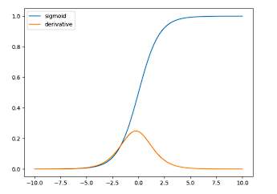
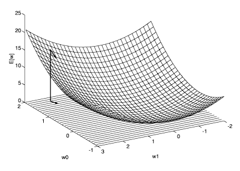

[//]: # "Stili di riferimento per il markdown"

<link rel="stylesheet" href="./res/style.css">

> # Fine della parte 1

## Regressione logistica

Idea:
- Naive Bayes ci permette di calcolare $P(Y\mid X)$ dopo aver appreso $P(X\mid Y)$ e $P(Y)$
- Perché non cercare di apprendere direttamente $P(Y\mid X)$

### Che forma adottare per P(Y|X)

Che forma abbiamo nel caso di Naive Bayes?
Se:
- $Y$ variabiel aleatoria booleana
- $X_i$ variabili aleatorie continue
- $X_i$ indipendenti l'una dall'altra data $Y$
- $P(X_i \mid Y=k)$ hanno distribuzioni Gaussiane $N(\mu_{ik}, \sigma_{i})$
  - Attenzione, non $\sigma_{ik}$, perché sono indipendenti
- $Y$ ha una distribuzione di Bernoulli $P(Y=k) = \pi_k$

Allora:

$$
P(Y=1 \mid X = \langle x_1, ... , x_n \rangle ) = \frac{1}{1+ exp(w_0 + \sum_i w_i x_i)}
$$

Dove:

$$
w_0 = ln \frac{1 - \pi}{\pi}
\\ \ \\
w_i x_i = \frac{\mu_{i0} - \mu_{i1}}{\sigma_i^2} x_i + \frac{\mu_{i1}^2 - \mu_{i0}^2}{2 \sigma_i^2}
$$

E significano:
- $w_0$ è il *bias*
- $w_i$ sono i *pesi*

#### Dimostrazione della formula

[...]

Non lo scrivo, ma essenzialmente va a fare diversi passaggi algebrici epr ridursi alla formula dove può trasformarla in questo modo, mettendoci $w_0$ e $w_i$ a casissimo.

#### Conclusione

Per classificare $X=\langle x_1,...,x_n \rangle$ è sufficiente vedere se:

$$
w_0 + \sum_i w_i x_i > 0
$$

### Quindi

La regressione logistica **assume** che:

$$
P(Y=1 \mid X=\langle x_1, ..., x_n \rangle) = \frac{1}{1 + exp(- w_0 - \sum_i w_i x_i)}
$$

E cerca direttamente di stimare i parametri $w_i$.

La funzione:

$$
\sigma(x)=\frac{1}{1+exp(-x)}
$$

Si chiama *funzione logistica* o *sigmoide*.

Assume la seguente rappresentazione grafica:

### Training per regressione logistica (caso binario)

Sappiamo che

$$
P(y=1 \mid x,w) = \sigma(w_0 + \sum_i w_i x_i)
$$

Dati i sample (indipendenti) $\langle x^l, y^l\rangle$, la loro probabilità è:

$$
\prod_l P(y^l \mid x^l, w) = \prod_l P(y^l = 1 \mid x^l, w)^{y^l} \cdot P(y^l = 0 \mid x_i ^l w_i)^{1-y^l}
$$

Questo vuol dire che:
- Se $y^l = 1$, allora $P(y^l = 1 \mid x^l, w)^{y^l} = P(y^l = 1 \mid x^l, w)$
- Quello che noi stiamo facendo è praticamente è calcolare la probabilità di $y^l$ dato $x^l$ e $w$, e moltiplicarla per $y^l$ se $y^l = 1$, e per $1-y^l$ se $y^l = 0$

Vogliamo trovare i valori dei parametri $w$ che *massimizzano* questa probabilità (MLE)

Analogamente, possiamo passare ai logaritmi e massimizzare:

$$
\sum_l log \ P(y^l \mid x^l, w) =
\\ \ \\
= \sum_l (y^l \cdot log \ P(Y=1 \mid x^l, w) + (1-y^l) \cdot log \ P(Y=0 \mid x^l, w))
$$

Lo abbiamo letteralmente passato dentro un logaritmi, adesso abbiamo log davanti a ogni cosa e abbiamo che gli esponenti sono diventati membri della moltiplicazione.

Diventa quindi lineare.

#### Problema e il gradiente

Sfortunatamente non esiste una soluzione analitica per il precedente problema di ottimizzazione:
- Non abbiamo come trovare le $w$ semplicemente dall'equazione

Quindi utilizziamo dei metodi **iterativi** di ottimizzazione, come la *tecnica del gradiente*:

$$
\nabla_w [E] = \left[ \frac{\partial E} {\partial w_1},..., \frac{\partial E}{\partial w_n} \right]
$$

Training:

$$
\Delta w_i = \mu \cdot \frac{\partial E}{\partial w_i}
\\ \ \\
w_i = w_i + \Delta w_i
$$

La funzione del gradiente, graficamente, ce la possiamo immaginare così: (questo è il caso dove ci sono solo $w_1$ e $w_0$, ovvero solo due parametri)

### Approccio iterativo

L'obbiettivo consiste nel minimizzare una qualche funzione di errore $\Theta(w)$ misurata sul training set. Aggiustando opportunamente i parametri del modello.

Possiamo raggiungere un minimo per $\Theta (w)$ compiendo *iterativamente* dei *piccoli passi* nella direzione opposta al gradiente (*discesa del gradiente*)

Si tratta di una **tecnica generale**, tuttavia non garantisce di raggiungere minimi globali.

#### Online vs Batch learning

Su quanti punti misuriamo l'errore?

- *Full batch*:
  - Si calcola l'errore e il suo gradiente sull'intero training.
  - Il gradiente punta nella direzione di massima ascesa, perpendicolare alle linee di livello.
- *Online*
  - Si calcola l'errore e il suo gradiente su una istanza del training set alla volta
  - Veloce ma impreciso: il gradiente induce un cammino a zig-zag attorno alla direzione corretta
- *Mini-batch*
  - Calcolo errore e suo gradiente su un sottoinsieme dei dati: un buon compromesso.

#### Gradiente per regressione logistica

Abbiamo i seguenti dati:
- Probabilità che una istanza $l$ abbia etichetta $Y=1$

$$
P(Y=1 \mid x^l, w) = \sigma(w_0 + \sum_i w_i x_i^l) = \alpha^l
$$

- Log-likelihood $l(w)$

$$
\sum_l log P(Y=y^l \mid x^l , w) = \sum_l y^l log(\alpha^l)+(1-y^l)log(1-\alpha^l)
$$

- Gradiente

$$
\frac{\partial l(w)}{\partial w_i} = \sum_l (y^l - \alpha^l) x_i^l
$$

Poi c'è la dimostrazione, dove essenzialmente si arriva a definire la derivata parziale in termini di $\alpha^l$ e si arriva a dimostrare che è proprio quella.

E quindi si arriva alla conclusione di eseguire le seguenti *operazioni di update* finché non si raggiunge l'approssimazione desiderata (ad esempio fino a quando l'accuratezza sul set di validazione è soddisfacente o non sembra aumentare)

$$
w_i 