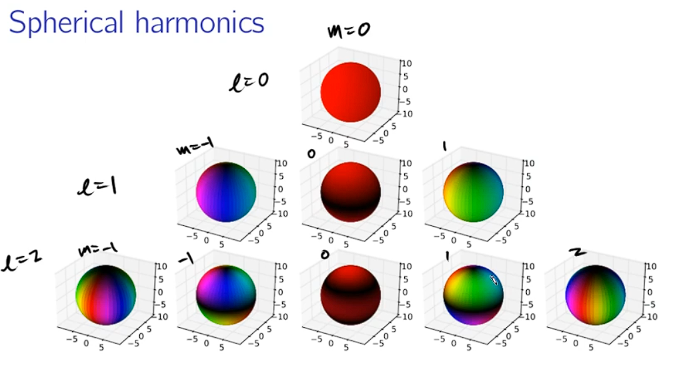
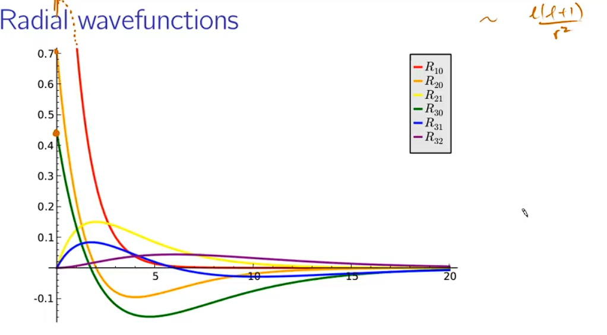
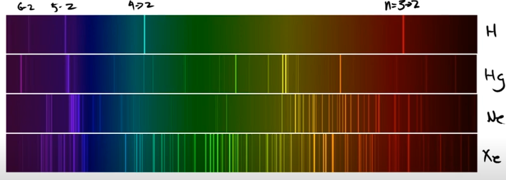

# 12. Statistics

## 12.1. Osservazione di Q

Iniziamo a definire come avviene l'osservazione (la misura) di una quantità fisica Q (determinata da un operatore $\hat{Q}$).

**Nel caso discreto**:
- Abbiamo $\hat{Q} \ket{\psi} = q \ket{\psi}$
- Abbiamo quindi un insieme di autovettori $\{\ket{\psi_n}\}$ che hanno un insieme di autovalori $\{q_n\}$.
- Abbiamo uno stato qualsiasi che può essere rappresentato come combinazione lineare degli autovettori: $\ket{f} = \sum_n c_n \ket{\psi_n}$.
- Possiamo ottenere le varie costanti $c_n$ tramite il prodotto scalare: $c_n = \braket{\psi_n | f}$ (questo deriva da Fourier's trick).

Cosa succede quando misuramo? Misurando otteniamo uno dei valori $q_n \in \{q_i\}$ con probabilità $|c_n|^2$.

**Nel caso continuo**:
- Abbiamo $\ket{\psi(q)}$ che è uno stato che dipende da $q$
- Abbiamo quindi che uno stato si può espreimere come: $\ket{f} = \int dq f(q) \ket{\psi(q)}$
- Possiamo calcolare $f(q)$ tramite il prodotto scalare: $f(q) = \braket{\psi(q) | f}$

Cosa succede quando misuriamo? Misurando otteniamo un valore $q_0 < q < q_0 + dq$ (quindi un valore $q$ compreso in un intervallo tra $q_0$ e $q_0+dq$) con probabilità $|f(q)|^2 dq$.

## 12.2. Normalizzazione

Dobbiamo avere che:

$$
\braket{f | f} = 1
$$

Nel caso discreto quindi abbiamo:

$$
\ket{f} = \sum_n c_n \ket{\psi_n}
$$

Quindi andiamo a fare dei calcoli per capire cosa ci implica la normalizzazione:

$$
\braket{f | f} = \sum_{n} a_n^* \bra{\psi_n} \sum_{m} a_m \ket{\psi_m} = \sum_{n} a_n^* a_n = 1
$$

(Abbiamo fatto collassare le due sommatorie in una sola sommatoria perchè gli stati sono ortogonali tra di loro).

Nel caso continuo abbiamo:

$$
\ket{f} = \int dq f(q) \ket{\psi(q)}
\\ \ \\
\braket{f | f} = \int dq f^*(q) f(q) = 1
\\ \ \\
\int |f(q)|^2 dq = 1
$$

## 12.3. Expectation value (valore medio)

Per calcolare invece il valore medio, immaginiamo di un expectation value $\braket{Q}$ di un operatore $\hat{Q}$, facciamo:

$$
\braket{Q} = \braket{f | \hat{Q} f}
\\ \ \\
= (\sum_n c_n^* \bra{\psi_n}) (\sum_m c_m \hat{Q} \ket{\psi_m})
\\ \ \\
= (\sum_n c_n^* \bra{\psi_n}) (\sum_m c_m q \ket{\psi_m})
\\ \ \\
= \sum_n \sum_m c_n^* c_m q \braket{\psi_n | \psi_m}
\\ \ \\
= \sum_n |c_n|^2 q_n
$$

Notiamo che questa è una "media pesata" dei valori $q_n$ con i pesi $|c_n|^2$.

Nel caso continuo abbiamo:

$$
\braket{Q} = (\int dq f^*(q) \bra{\psi(q)}) (\int dq' f(q') \hat{Q} \ket{\psi(q')})
\\ \ \\
= \int dq dq' f^*(q) f(q') q \braket{\psi(q) | \psi(q')}
\\ \ \\
= \int dq dq' f^*(q) f(q') q \delta(q - q')
\\ \ \\
= \int dq f^*(q) f(q) q
\\ \ \\
= \int dq |f(q)|^2 q
$$

## 12.4. Example: p for QHO ground state

Consideriamo lo stato fondamentale di un oscillatore armonico quantistico. Questo stato è dato da:

$$
\hat{p} \ket{\psi} = p \ket{\psi}
$$

Quindi ho gli **eigenstates** che sono: $\frac{e^{i \frac{px}{\hbar}}}{\sqrt{2 \pi \hbar}}$ e gli eigenvalues che sono $p$.

Come possiamo determinare, per esempio, la distribuzione di probabilità delle misure di momentum per lo stato fondamentale?

Otterremo lo stato $p_0<p<p_0+dp$ con probabilità $|f(p)|^2 dp$.

All'interno del linguaggio di algebra lineare con il quale lavoriamo, la nostra $f(p)$ sarà:

$$
f(p) = \braket{\psi(p) | \psi_0}
\\ \ \\
= \int_{-\infty}^{\infty} dx \frac{e^{-i \frac{px}{\hbar}}}{\sqrt{2 \pi \hbar}}  \left( \frac{m\omega}{\pi\hbar}^{1/4} \right) e^{-\frac{m\omega x^2}{2\hbar}}
$$

Quello che ottieni è una gaussian che dipende da $p$.

## 12.5. Esempi e understanding check

Immaginiamo di avere il problema di una particella in una scatola, $\hat{H} = E \ket{\psi} \mapsto \{\ket{\psi_n}\}, \{E_n\}$, e supponiamo che il nostro stato sia:

$$
\ket{\psi} = \frac{3}{5} \ket{\psi_1} + \frac{4i}{5} \ket{\psi_2}
$$

1. Se si misura l'energia, qual'è la probabilità di ottenere $E_1$, $E_2$ ed $E_3$?
   1. $P(E_1) = \left| \frac{3}{5} \right|^2$
   2. $P(E_2) = \left| \frac{4}{5} \right|^2$
   3. $P(E_3) = 0$
2. Cosa è $\braket{\psi|\psi}$? Ha senso?
   1. $\braket{\psi|\psi} = \left| \frac{3}{5} \right|^2 + \left| \frac{4}{5} \right|^2 = 1$
   2. Ha senso perchè è normalizzato.
3. Supponiamo io abbia un osservabile $Q$ (i.e. $\hat{Q}$) con eigenstuff tali che $\hat{Q} \ket{g_7} = q_7 \ket{g_7}$. Supponiamo io osservi $Q$. Qual'è un espressione per determinare la probabilità di ottenere $q_7$?
   1. $P(q_7) = \left| \braket{g_7 | f} \right|^2$, dove $f$ è lo stato del sistema prima della misurazione.

## 12.5 Unceirtainty principle generalization

Andiamo a percorrere tutti i singoli passaggi che vengono fatti in questa dimostrazione. Scegliamo di considerare due osservabili $Q$ e $R$ e andiamo a calcolare la varianza di $Q$ e $R$.

$$
\sigma_Q^2 = \braket{ (Q - \braket{Q})^2 }
\\ \ \\
= \braket{\psi | (\hat{Q} - M_Q)^2 \psi}
\\ \ \\
= \braket{\psi | (\hat{Q} - M_Q) (\hat{Q} - M_Q) \psi }
\\ \ \\
= \braket{(\hat{Q} - M_Q) \psi |  (\hat{Q} - M_Q) \psi }
\\ \ \\
= \braket{ f | f } \quad , \quad f = (\hat{Q} - M_Q) \psi
$$

Adesso definiamo R nello stesso modo e otteniamo:

$$
\sigma_R^2 = \braket{ g | g } \quad , \quad g = (\hat{R} - M_R) \psi
$$

Da notare che $M_Q$ e $M_R$ sono i valori medi di $Q$ e $R$, che sono numeri reali e che scriviamo così per semplicità.

Quindi noi vogliamo calcolare:

$$
\sigma_Q^2 \sigma_R^2 = \braket{ f | f } \braket{ g | g }
$$

Andiamo ad applicare 2 semplificazione: la diseguaglianza di Schwarz e la diseguaglianza secondo la quale il magnitudo di un numero immaginario sarà sempre maggiore o uguale al magnitudo della parte immaginaria. Quindi abbiamo:

$$
\braket{f | f} \braket{g | g} \geq \left| \braket{f | g} \right|^2
\\ \ \\
|z|^2 \geq |\Im(z)|^2
\\ \ \\
\implies
\\ \ \\
|\braket{ f | g}|^2 \equiv z^2
\\ \ \\
\implies
\\ \ \\
\braket{f | g} \geq \left(\frac{1}{2i} (\braket{f | g} - \braket{g | f}) \right)^2
$$

Quindi adesso andiamo a lavorare su:

$$
\sigma_Q^2 \sigma_R^2 \geq \left(\frac{1}{2i} (\braket{f | g} - \braket{g | f}) \right)^2
\\ \ \\
\braket{f | g} = \braket{(\hat{Q} - M_Q) \psi | (\hat{R} - M_R) \psi}
\\ \ \\
= \braket{\psi | (\hat{Q} - M_Q) (\hat{R} - M_R) \psi}
\\ \ \\
= \braket{\psi | \hat{Q} \hat{R} \psi} - M_Q M_R
$$

E facciamo la stessa cosa per $\braket{g | f}$:

$$
\braket{g | f} = \braket{(\hat{R} - M_R) \psi | (\hat{Q} - M_Q) \psi}
\\ \ \\
= \braket{\psi | (\hat{R} - M_R) (\hat{Q} - M_Q) \psi}
\\ \ \\
= \braket{\psi | \hat{R} \hat{Q} \psi} - M_Q M_R
$$

Quindi riscriviamo la nostra cosa e abbiamo:

$$
\sigma_Q^2 \sigma_R^2 \geq \left(\frac{1}{2i} (\braket{\psi | \hat{Q} \hat{R} \psi} - M_Q M_R - \braket{\psi | \hat{R} \hat{Q} \psi} + M_Q M_R) \right)^2
\\ \ \\
= \left(\frac{1}{2i} (\braket{\psi | \hat{Q} \hat{R} \psi} - \braket{\psi | \hat{R} \hat{Q} \psi}) \right)^2
\\ \ \\
= \left(\frac{1}{2i} \braket{\psi | [\hat{Q}, \hat{R}] \psi} \right)^2
\\ \ \\
= \left(\frac{1}{2i} \braket{ [\hat{Q}, \hat{R}] } \right)^2
$$

Questa è la diseguaglianza di Heisenberg generalizzata (**generalized unceirtainty principle**).

### 12.5.1. Esempio con x e p

Quindi se noi abbiamo il commutatore di $x$ e $p$ che è:

$$
[\hat{x}, \hat{p}] = i \hbar
$$

Quindi abbiamo:

$$
\sigma_x^2 \sigma_p^2 \geq \left(\frac{1}{2i} \braket{ [\hat{x}, \hat{p}] } \right)^2
\\ \ \\
= \left(\frac{1}{2i} i \hbar \right)^2
\\ \ \\
= \frac{\hbar^2}{4}
$$

E questo spesso si scrive senza il quadrato, quindi:

$$
\sigma_x \sigma_p \geq \frac{\hbar}{2}
$$

### 12.5.2. Minimum position-momentum uncertainty

Andiamo a trovare quelle condizioni dove la nostra diseguaglianza si trasforma in un uguaglianza. Quindi abbiamo:

$$
\sigma_x^2 \sigma_p^2 = \left(\frac{1}{2i} \braket{ [\hat{x}, \hat{p}] } \right)^2
$$

Le due assunzioni che avevamo fatto sono che vale la Schwarz inequality e che il magnitudo di un numero immaginario è maggiore o uguale alla parte immaginaria. Quindi dobbiamo considerare il caso dove abbiamo l'uguaglianza nella Schwarz inequality e dove la parte immaginaria è uguale al magnitudo, quindi il numero è puramente immaginario. Otteniamo quindi:

$$
\braket{f | g} = \left(\frac{1}{2i} (\braket{f | g} - \braket{g | f}) \right)^2
\\ \ \\
\ket{g} = c \ket{f}
\\ \ \\
\Re(\braket{f | g}) = \Re(c \braket{f | f}) = c \braket{f | f}
\implies c = ia
$$

Quindi adesso potremmo andare a vedere la prima equazione:

$$
\ket{g} = ia \ket{f}
\\ \ \\
(\hat{p} - \braket{p}) \ket{\psi} = ia (\hat{x} - \braket{x}) \ket{\psi}
\\ \ \\
\left( -i \hbar \frac{\partial}{\partial x} - \braket{p} \right) \psi(x) = ia \left( x - \braket{x} \right) \psi(x)
\\ \ \\
\frac{\partial \psi}{\partial x} = -\frac{a}{\hbar} x \psi + \frac{a}{\hbar} \braket{x} \psi + \frac{i}{\hbar} \braket{p} \psi 
$$

Andiamo ad "indovinare" che $\psi = e^{f(x)}$ per una qualche funzione $f(x)$ (questa è una tecinca comune per andare a risolvere differential equations dove abbiamo che una funzione derivata ci ritorna las tessa funzione) e otteniamo:

$$
\psi(x) = e^{-\frac{a}{2\hbar} (x - \braket{x})^2} e^{i \frac{\braket{p}}{\hbar} x} e^{a \frac{\braket{x}^2}{2\hbar}}
$$

Notiamo che il primo termine è una gaussiana centrata in $\braket{x}$ e il secondo termine è un piano d'onda con momento $\braket{p}$, mentre il terzo è una costante.

Notiamo che siamo quindi riusciti ad arrivare al minimo dell'incertezza tra posizione e momento, che coincide con una funzione d'onda che è gaussiana (come quella di un ground state di un oscillatore armonico).

## 12.6. Time energy uncertainty

Abbiamo in precedenza trovato il principio di incertezza tra posizione e momento. Tuttavia, la nostra formula, ovvero $\sigma_q^2 \sigma_p^2 \geq (\frac{1}{2i} \braket{[\hat{q}, \hat{p}]} )^2$ non funziona per energia e tempo. 

Questo succede perché il tempo non è tanto un operatore, bensì è un parametro che compare all'interno delle nostre equazioni. Quindi ora vogliamo capire come possiamo descrivere questo tipo di incertezza.

Iniziamo andando a capire come possiamo descrivere l'evoluzione temporale di una certa quantità $Q$, con il corrispondente osservabile $\hat{Q}$. Quindi abbiamo:

$$
\frac{d}{dt} \braket{Q} = \frac{d}{dt} \braket{\psi | \hat{Q} \psi}
\\ \ \\
= \braket{\frac{d\psi}{dt} | \hat{Q} \psi} + \braket{\psi | \frac{d\hat{Q}}{dt} \psi} + \braket{\psi | \hat{Q} \frac{d\psi}{dt}}
$$

Non andremo ad analizzare bene cosa succede per bene, però intanto possiamo avere un intuizione a partire dalla TDSE:

$$
\text{TDSE: } i \hbar \ket{\frac{d\psi}{dt}} = \hat{H} \ket{\psi}
\\ \ \\
\implies 
\\ \ \\
= - \frac{1}{i \hbar} \braket{ \hat{H} \psi | \hat{Q}  \psi} + \braket{\frac{\partial \hat{Q}}{\partial t}} + \frac{1}{i \hbar} \braket{\psi | \hat{Q} \hat{H} \psi}
\\ \ \\
= - \frac{1}{i \hbar} \braket{  \psi | \hat{H} \hat{Q}  \psi} + \braket{\frac{\partial \hat{Q}}{\partial t}} + \frac{1}{i \hbar} \braket{\psi | \hat{Q} \hat{H} \psi}
\\ \ \\
= \braket{\frac{\partial \hat{Q}}{\partial t}} + \frac{i}{\hbar} \braket{[\hat{H}, \hat{Q}]}
$$

Questo quindi è un risultato generale che ci dice che l'evoluzione temporale di un osservabile è data da una certa quantità (che dipende dal tempo) più il commutatore tra l'Hamiltoniana e l'osservabile.

Ci dice inoltre che se $[\hat{H}, \hat{Q}] = 0$, allora l'expectation value dell'osservabile non dipende dal tempo, essenzialmente l'evoluzione temporale del sistema come data dalla TDSE ignora l'expectation value dell'osservabile considerato.

Consideriamo ora il caso dove la derivata parziale dell'osservabile rispetto al tempo è nulla. In questo caso abbiamo:

$$
\frac{\partial \hat{Q}}{\partial t} = 0 \implies
\frac{d}{dt} \braket{Q} = \frac{i}{\hbar} \braket{[\hat{H}, \hat{Q}]}
$$

Quindi se ora andiamo a vedere incertezza precedentemente definita, tra $H$ e $Q$, abbiamo:

$$
\sigma_H^2 \sigma_Q^2 \geq \left( \frac{1}{2i} \braket{[\hat{H}, \hat{Q}]} \right)^2 =
\\ \ \\
= \left( \frac{1}{2i} \frac{\hbar}{i} \frac{d}{dt}\braket{Q} \right)^2
\\ \ \\
= \left( \frac{\hbar}{2} \right)^2 \left( \frac{d}{dt} \braket{Q} \right)^2
$$

Quindi abbiamo che:

$$
\sigma_H \sigma_Q \geq \frac{\hbar}{2} \left| \frac{d}{dt} \braket{Q} \right|
$$

Quello che questo ci dice è che l'incertezza tra energia e un osservabile $Q$ è legata alla variazione temporale dell'expectation value di $Q$, quindi quanto in fretta cambia.

Andiamo quindi a creare delle definizioni per $\Delta E$ e $\Delta t$:

$$
\Delta E = \sigma_H
\\ \ \\
\Delta t = \frac{\sigma_Q}{\left| \frac{d}{dt} \braket{Q} \right|}
\\ \ \\
\sigma_Q = \Delta t \left| \frac{d}{dt} \braket{Q} \right|
$$

Quest'ultima cosa ci dice che $\sigma_Q$ è la variazione temporale di $Q$ moltiplicata per il tempo che ci mette a variare.

Tornando all'equazione di prima:

$$
\sigma_H \sigma_Q \geq \frac{\hbar}{2} \left| \frac{d}{dt} \braket{Q} \right|
\\ \ \\
\implies
\\ \ \\
\Delta E \Delta t \geq \frac{\hbar}{2}
$$

Da ricordare che noi abbiamo considerato una certa $Q$. Non diciamo "$\Delta t$" del sistema, ma lo indendiamo come la "$\Delta t$" del momentum, o della posizione o di una qualsiasi quantità, ma non assestante. Da notare che però il risultato sarà:
- Se il sistema si evolve velocemente  rispetto all'orsservabile del quale siamo interessati (se il valore $\frac{d}{dt} \braket{Q}$ è grande), allora l'incertenzza nel tempo sarà piccolo ($\Delta t$ sarà piccolo), e quindi l'incertezza in energia sarà grande ($\Delta E$ sarà grande).
- Se il sistema si evolve lentamente rispetto all'orsservabile del quale siamo interessati (se il valore $\frac{d}{dt} \braket{Q}$ è piccolo), allora l'incertezza nel tempo sarà grande ($\Delta t$ sarà grande), e quindi l'incertezza in energia sarà piccola ($\Delta E$ sarà piccola).

Da notare che la nostra $\hat{Q}$ è un **qualsiasi osservabile**. Quindi se quello che noi abbiamo qua ci dice che l'evoluzione di un osservabile è lenta, allora l'energia è bassa, noi lo possiamo girare e dire che **se la $\Delta E$ è piccola, allora l'evoluzione di tutti gli osservabili è lenta**.

Come avevamo visto prima, se uno stationary state per esempio è un caso dove lo stato non si evolve nel tempo, quindi la $\Delta E$ è 0, e quindi la $\Delta t$ è infinita.

# 13. Dirac notation

Andiamo ad esprimere ancora una volta (meglio di prima) i formalismi matematici e le nostre definizioni utilizzando la notazione di Dirac.

Partiamo con il collegare tra loro le 3 notazioni che abbiamo visto:
- Avere un onda $\psi(x)$
- Avere $\phi(p)$, ovvero la trasformata di Fourier di $\psi(x)$ (dove le singole $\phi(p)$ rappresentano i coefficienti di Fourier)
- Avere $\{c_n\}$ e $\{\ket{\psi_n}\}$, ovvero la rappresentazione di $\psi(x)$ in termini di autovettori e di coefficienti.

Possiamo scrivere:

$$
\psi(x) = \int_{-\infty}^{\infty} dp \ \phi(p) \frac{1}{\sqrt{2\pi\hbar}} e^{i \frac{px}{\hbar}}
\\ \ \\
\psi(x) = \sum_n c_n \psi_n(x)
\\ \ \\
\psi(x) = \int_{-\infty}^{\infty} \delta(x - \xi) \psi(\xi) d\xi
\\ \ \\
\psi(x) = \braket{x | \psi}
$$

Dove quest'ultima rappresentazione è la rappresentazione di Dirac, dove $\ket{\psi}$ è lo stato del sistema e $\braket{x | \psi}$ è la rappresentazione di $\psi$ in termini di $x$.

Per invece $\phi$ abbiamo:

$$
\phi(p) = \int_{-\infty}^{\infty} dx \ \psi(x) \frac{1}{\sqrt{2\pi\hbar}} e^{-i \frac{px}{\hbar}}
\\ \ \\
\phi(p) = \braket{p | \psi}
$$

E infine per i coefficienti e gli autovettori abbiamo:

$$
\psi(x) = \sum_n c_n \psi_n(x)
\\ \ \\
c_n = \braket{\psi_n | \psi}
$$

## 13.1. Operatori in Dirac notation

Capiamo ora come rappresentare degli operatori, ovvero che sono del tipo:

$$
\hat{Q} \ket{\alpha} = \ket{\beta}
$$

In particolare ci può interessare un cambio di base, o come passare da un vettore all'altro.

$$
\ket{\alpha} = \sum_n a_n \ket{\psi_n}
\\ \ \\
\ket{\beta} = \sum_n b_n \ket{\psi_n}
\\ \ \\
a_n = \braket{\psi_n | \alpha}
$$

Quindi abbiamo:

$$
\hat{Q} \ket{\alpha} = \sum_n b_n \ket{\psi_n}
\\ \ \\
\implies
\\ \ \\
\bra{\psi_m} \hat{Q} \ket{\alpha} = \sum_n b_n \braket{\psi_m | \psi_n}
\\ \ \\
\implies
\\ \ \\
\braket{\psi_m | \hat{Q} | \alpha} = \sum_n b_n \delta_{mn}
\\ \ \\
b_n = \braket{\psi_n | \hat{Q} | \alpha}
\\ \ \\
b_m = \sum_n a_n \braket{\psi_m | \hat{Q} | \psi_n}
$$

Abbiamo quindi una moltiplicazione tra un vettore e un numero, $Q_{mn} = \braket{\psi_m | \hat{Q} | \psi_n}$, che è un numero che dipende dagli autovettori. Questo numero è, intuitivamente, l'elemento di matrice dell'operatore $\hat{Q}$ tra gli autovettori $\ket{\psi_m}$ e $\ket{\psi_n}$, che è un numero che ci dice come l'operatore $\hat{Q}$ agisce tra gli autovettori.

## 13.2. Bra ket e dualità

Abbiamo il nostro $\ket{\psi}$, che è uno stato del sistema, e abbiamo il nostro $\bra{\psi}$, che è il duale. Si tratta di qualcosa che viene utilizzato nei contesti dove lo moltiplichiamo al nostro $\ket{\psi}$ per ottenere un numero (tendenzialmente dentro a integrali, tipo $\braket{\psi | \psi}$).

Quindi il $\braket{a | b}$ rappresenta una moltiplicazione tra: un vettore riga (il duale (complesso coniugato)) e un vettore colonna, che ci danno un numero.

## 13.3. Completeness e ortonormalità

Andiamo a definire il **projector operator** come:

$$
\hat{p}_n \equiv \ket{\psi_n} \bra{\psi_n}
$$

Questo ci dà:

$$
\hat{p}_n \ket{\beta} = \ket{\psi_n} \braket{\psi_n | \beta}
\\ \ \\
= \ket{\psi_n} b_n  = b_n \ket{\psi_n}
$$

Ora ripercorriamo alcune definizioni, secondo le quali gli stati della base formata da $\{\ket{\psi_n}\}$ sono ortonormali, ovvero:

$$
\braket{\psi_m | \psi_n} = \delta_{mn}
$$

E quindi abbiamo che la somma di tutte le proiezioni è l'identità:

$$
\sum_n \hat{p}_n = \sum_n \ket{\psi_n} \bra{\psi_n} = \hat{1}
$$

Inoltre abbiamo che la somma di tutte le proiezioni di uno stato è lo stato:

$$
\sum_n \hat{p}_n \ket{\beta} = \sum_n b_n \ket{\psi_n} = \ket{\beta}
$$

Questo ci va a definire appunto il nostro concetto di "completezza".

## 13.4. Esempi e understanding check

Immaginiamo di avere un sistema a due stati possibili, quindi abbiamo:

$$
\{ \ket{1}, \ket{2} \}
$$

Abbiamo quindi che:

$$
\braket{1 | 2} = \braket{2 | 1} = 0
\\ \ \\
\braket{1 | 1} = \braket{2 | 2} = 1
$$

Possiamo definire i nostri vettori come:

$$
\ket{1} = \sum_{i = 1}^{2} \ket{i} a_i = a_1 \ket{1} + a_2 \ket{2}
$$

Ma abbiamo che la definizione di $a_i$ è $a_i = \braket{i | 1}$, quindi abbiamo:

$$
i = 1 \to 1 \quad, \quad i = 2 \to 0
\\ \ \\
\ket{1} = 1 \ket{1} + 0 \ket{2}
$$

Possiamo prendere questi coefficienti ed andarli a scrivere come un vettore colonna:

$$
\ket{1} = \begin{pmatrix} 1 \\ 0 \end{pmatrix}
$$

Possiamo anche scrivere il nostro $\ket{2}$ come:

$$
\ket{2} = \sum_{i = 1}^{2} \ket{i} b_i = b_1 \ket{1} + b_2 \ket{2} = 0 \ket{1} + 1 \ket{2} = \begin{pmatrix} 0 \\ 1 \end{pmatrix}
$$

Notiamo che quindi uno stato generico si può scrivere come:

$$
\ket{\psi} = \sum_{i = 1}^{2} \ket{i} c_i = c_1 \ket{1} + c_2 \ket{2} = \begin{pmatrix} c_1 \\ c_2 \end{pmatrix}
$$

Vediamo inoltre che un $\hat{H}$ applicato a questo sistema è una matrice che avrà come valori:

$$
\hat{H} = \begin{pmatrix} \braket{1 | \hat{H} | 1} & \braket{1 | \hat{H} | 2} \\ \braket{2 | \hat{H} | 1} & \braket{2 | \hat{H} | 2} \end{pmatrix}
$$

E che in generale un qualsiasi operatore $\hat{Q}$ si può scrivere come:

$$
\hat{Q} = \begin{pmatrix} \braket{1 | \hat{Q} | 1} & \braket{1 | \hat{Q} | 2} \\ \braket{2 | \hat{Q} | 1} & \braket{2 | \hat{Q} | 2} \end{pmatrix} = \begin{pmatrix} q_{11} & q_{12} \\ q_{21} & q_{22} \end{pmatrix}
$$

# 14. Schrodinger equation in 3d

Andiamo a vedere ora la notazione matematica e come affrontare cosa abbiamo precedentemente visto per 1 dimensione ma ora per 3 dimensioni, ovvero qualcosa di effettivamente reale.

Andiamo a fare un confronto tra 1 e 3 dimensioni:
- **Con 1 dimensione** abbiamo:
  - $\psi(x,t)$
  - $\psi(x) e^{-iEt/\hbar}$
  - $\hat{x}, \hat{p}$
  - $\braket{\psi, \psi} = 1$
  - $\int_{-\infty}^{\infty} dx \ \psi^* \psi = 1$
- **Con 3 dimenisoni** abbiamo:
  - $\psi(x,y,z, t)$
  - $\psi(x,y,z) e^{-iEt/\hbar}$
  - $(\hat{x}, \hat{y}, \hat{z}), (\hat{p}_x, \hat{p}_y, \hat{p}_z) = -i\hbar \vec{\nabla} = -i\hbar \left( \frac{\partial}{\partial x}, \frac{\partial}{\partial y}, \frac{\partial}{\partial z} \right)$
    - $\hat{p}_x = -i\hbar \frac{\partial}{\partial x}$
  - $\braket{\psi, \psi} = 1$
  - $\int_{-\infty}^{\infty} dx \int_{-\infty}^{\infty} dy \int_{-\infty}^{\infty} dz \ \psi^* \psi = 1$

Andiamo ora a vedere come si comporta l'equazione di Schrodinger in 3 dimensioni (in particolare vediamo come si ottiene il Laplaciano):

$$
i \hbar \frac{\partial \psi} = \hat{H} \psi
\\ \ \\
i\hbar \frac{\partial \psi} {\partial t} =  \frac{\hat{p}^2} {2m} \psi + V(x,y,z) \psi
\\ \ \\
= \frac{1}{2m} \hat{p} \hat{p} \psi + V \psi
\\ \ \\
= -\frac{1}{2m} \left( -\hbar^2 \left(\frac{\partial}{\partial x}, \frac{\partial}{\partial y}, \frac{\partial}{\partial z}\right) \cdot \left(\frac{\partial}{\partial x}, \frac{\partial}{\partial y}, \frac{\partial}{\partial z}\right) \right) \psi + V \psi
\\ \ \\
= -\frac{\hbar^2}{2m} \left( \frac{\partial^2 \psi}{\partial x^2} + \frac{\partial^2 \psi}{\partial y^2} + \frac{\partial^2 \psi}{\partial z^2} \right) + V \psi
$$

Dove abbiamo che:

$$
\nabla^2 = \frac{\partial^2}{\partial x^2} + \frac{\partial^2}{\partial y^2} + \frac{\partial^2}{\partial z^2}
$$

Si chiama **Laplacian** o anche **del squared**

Quindi la nostra equazione finale per la Schrodinger equation in 3 dimensioni è:

$$
i\hbar \frac{\partial \psi} {\partial t} = -\frac{\hbar^2}{2m} \nabla^2 \psi + V \psi
$$

Andiamo a fare la separazione delle variabili per la TISE:

$$
\psi(x,y,z,t) = R(x,y,z) T(t)
\\ \ \\
i\hbar \frac{\partial}{\partial t} (R(x,y,z) T(t)) = -\frac{\hbar^2}{2m} \nabla^2 (R(x,y,z) T(t)) + V(x,y,z) R(x,y,z) T(t)
\\ \ \\
i\hbar \frac{\partial}{\partial t} (R T) = -\frac{\hbar^2}{2m} \nabla^2 (R T) + V R T
\\ \ \\
R i \hbar \frac{\partial T}{\partial t} = -\frac{\hbar^2}{2m} T \nabla^2 R + V R T
\\ \ \\
\text{Dividiamo per } RT
\\ \ \\
\frac{i\hbar}{T} \frac{\partial T}{\partial t} = -\frac{\hbar^2}{2m} \frac{1}{R} \nabla^2 R + V
\\ \ \\
\text{Abbiamo cose che dipendono da cose diverse, quindi sono costanti, quindi: }
\\ \ \\
E = -\frac{\hbar^2}{2m} \frac{1}{R} \nabla^2 R + V
\\ \ \\
E = \frac{i \hbar}{T} \frac{\partial T}{\partial t}
$$

Quindi le nostre due cose sono molto simili a 1 dimensione, almeno per il tempo:

$$
i \hbar \frac{\partial T}{\partial t} = E T
\\ \ \\
T(t) = e^{-iEt/\hbar}
$$

In generale quindi abbiamo che:

$$
\hat{H} \psi = E \psi
$$

## 14.1. Esempi e understanding check

Proviamo a calcolare $[\hat{x}, \hat{p}_y]$:

Essenzialmente, visto che uno è nelle $y$ e uno è nelle $x$, abbiamo che commutano, quindi il commutatore è 0.

Pertanto noi possiamo misurare sia $x$ che $p_y$ simultaneamente, con quanta precisione possiamo volere.

Inoltre potremmo anche misurare $p_x$ e $p_y$ simultaneamente, ma non $x$ e $p_x$.

# 15. TISE to spherical harmonics

## 15.1 TISE with cartesian and spherical coordinate

Andiamo ad esprimere $\nabla^2 \psi$ in coordinate cartesiane, che è (come visto in precedenza):

$$
\nabla^2 \psi = \frac{\partial^2 \psi}{\partial x^2} + \frac{\partial^2 \psi}{\partial y^2} + \frac{\partial^2 \psi}{\partial z^2}
$$

Andiamo ora a vedere come si esprime in coordinate sferiche. Abbiamo che:

$$
\nabla^2 \psi = \frac{1}{r^2} \frac{\partial}{\partial r} \left(r^2 \frac{\partial\psi}{\partial r} \right) + \frac{1}{r^2 \sin(\theta)} \frac{\partial}{\partial \theta} \left( \sin(\theta) \frac{\partial \psi}{\partial \theta} \right) + \frac{1}{r^2 \sin^2(\theta)} \frac{\partial^2 \psi}{\partial \phi^2}
$$

Dove abbiamo:
- $r$ è la distanza dall'origine
- $\theta$ è l'angolo tra l'asse $z$ e il vettore posizione
  - Si chiama anche **polar angle**
- $\phi$ è l'angolo tra l'asse $x$ e il vettore posizione
  - Si chiama anche **azimuthal angle**

## 15.2 Separation of variables

### 15.2.1. Separazione delle variabili per la TISE con coordinate cartesiane

Abbiamo:

$$
-\frac{\hbar^2}{2m} \left( \frac{\partial^2 \psi}{\partial x^2} + \frac{\partial^2 \psi}{\partial y^2} \frac{\partial^2 \psi}{\partial z^2}  \right) + V(x,y,z) \psi = E \psi
$$

Quindi andiamo a riscrivere $\psi(x,y,z) = X(x) Y(y) Z(z)$ e otteniamo:

$$
-\frac{\hbar^2}{2m} \left( \frac{1}{X} \frac{\partial^2 X}{\partial x^2} + \frac{1}{Y} \frac{\partial^2 Y}{\partial y^2} + \frac{1}{Z} \frac{\partial^2 Z}{\partial z^2}  \right) + V(x,y,z) = E
$$

(Tutto questo facendolo assumendo che $V$ sia speciale e non dipenda da cose come per esempio una derivata su $x$, quindi che noi possiamo fare $VXYZ / XYZ = V$).

Quello che notiamo quindi è che $\frac{1}{X} \partial_{xx} X, \frac{1}{Y} \partial_{yy} Y, \frac{1}{Z} \partial_{zz} Z$ sono costanti.

Essenzialmente quello che poi andremmo a fare per una soluzione sarebbe andare a trovare la nostra $X(x)$, $Y(y)$ e $Z(z)$, e poi le andiamo a ricombinare per ottenere la nostra $\psi(x,y,z)$.

#### 15.2.1.1 Esempio

Facciamo un esempio di una particella in un infinite square well in 3 dimensioni.

La nostra scatola ha 3 lati di lunghezza $L_x, L_y, L_z$.

Il potenziale, dentro la scatola, è 0, mentre fuori è infinito.

Fuori diciamo che la nostra $\psi(x,y,z) = 0$.

Dentro invece dobbiamo risolvere la nostra EQ di Schrodinger:

$$
- \frac{\hbar^2}{2m} \nabla^2 \psi = E \psi
$$

Assumiamo che la soluzione si possa scrivere con la separazione di variabili.

Quindi abbiamo:

$$
\psi(x,y,z) = X(x) Y(y) Z(z)
\\ \ \\
- \frac{\hbar^2}{2m} \left( \frac{1}{X} \frac{\partial^2 X}{\partial x^2} + \frac{1}{Y} \frac{\partial^2 Y}{\partial y^2} + \frac{1}{Z} \frac{\partial^2 Z}{\partial z^2}  \right) = E
$$

Quindi abbiamo 3 diverse ODE che sono:

$$
- \frac{\hbar^2}{2m} \frac{1}{X} \frac{\partial^2 X}{\partial x^2} = E_x
\\ \ \\
- \frac{\hbar^2}{2m} \frac{1}{Y} \frac{\partial^2 Y}{\partial y^2} = E_y
\\ \ \\
- \frac{\hbar^2}{2m} \frac{1}{Z} \frac{\partial^2 Z}{\partial z^2} = E_z
$$

A questo punto andiamo a descrivere quelle che sono le nostre boundary condition:

$$
X(0) = X(L_x) = 0
\\ \ \\
Y(0) = Y(L_y) = 0
\\ \ \\
Z(0) = Z(L_z) = 0
$$

Per ognuna delle equazioni le soluzioni sono sinusoidali:

$$
X(x) = A_x \sin(k_x x) \quad, \quad k_x = \frac{n_x \pi}{L_x}, \text{con } n_x = 1, 2, 3, \dots
\\ \ \\
Y(y) = A_y \sin(k_y y) \quad, \quad k_y = \frac{n_y \pi}{L_y}, \text{con } n_y = 1, 2, 3, \dots
\\ \ \\
Z(z) = A_z \sin(k_z z) \quad, \quad k_z = \frac{n_z \pi}{L_z}, \text{con } n_z = 1, 2, 3, \dots
$$

Andiamo a calcolare le costanti di normalizzazione per le singole funzioni:

$$
\int_0^{L_x} |X(x)|^2 dx = 1
\implies A_x^2 \int_0^{L_x} \sin^2(k_x x) dx = 1
\\ \ \\
\implies A_x^2 \frac{L_x}{2} = 1
\implies A_x = \sqrt{\frac{2}{L_x}}
$$

E così si risolvono anche le altre 2.

Quindi possiamo riscrivere la nostra funzione d'onda come:

$$
\psi(x,y,z) = \sqrt{\frac{8}{L_x L_y L_z}} \sin(k_x x) \sin(k_y y) \sin(k_z z)
$$

Mentre gli energy level per la particle in a box sono dati da:

$$
E = E_x + E_y + E_z = \frac{\hbar^2}{2m} \left( \frac{n_x^2 \pi^2}{L_x^2} + \frac{n_y^2 \pi^2}{L_y^2} + \frac{n_z^2 \pi^2}{L_z^2} \right)
$$

## 15.3. Separation in spherical coordinates

Iniziamo con il separare la nostra EQ di Schrodinger espressa in coordinate sferiche in 2 parti:

$$
\psi(r, \theta, \phi) = R(r) Y(\theta, \phi)
$$

Quindi (da notare che la nostra $V$ dipenderà solo da $r$, in quanto noi andiamo a cercare di imitare quello che succede per l'atomo di idrogeno, quindi poi non ci interess anadre a definire questo per tanti altri casi, per ora ci concentriamo su questo):

$$
- \frac{\hbar^2}{2m} \nabla^2 \psi + V \psi= E \psi
\\ \ \\
- \frac{\hbar}{2m} \left( \frac{Y}{r^2} \partial_r (r^2 \partial_r R) + \frac{R}{r^2 \sin(\theta)} \partial_{\theta} (\sin(\theta) \partial_{\theta} Y) + \frac{R}{r^2 \sin^2(\theta)} \partial_{\phi \phi} Y \right) + V(r) R Y = E R Y
\\ \ \\
\text{Dividiamo tutto per } \frac{-\hbar^2}{2m} R Y
\\ \ \\
\left[\frac{1}{Rr^2} \partial_r (r^2 \partial_r R) - \frac{2mr^2}{\hbar^2} (V(r) - E) \right] + \frac{1}{Y} \left[ \frac{1}{\sin(\theta)} \partial_{\theta} (\sin(\theta) \partial_{\theta} Y) + \frac{1}{\sin^2(\theta)} \partial_{\phi \phi} Y \right] = 0
\\ \ \\
l ( l+1 ) - l(l + 1) = 0
$$

Andiamo ad esprimerlo in termini di $l$ perché poi ci è comodo per farci i calcoli (anche se poi scrivere $l$ è complicatuccio).

Andiamo quindi ad esplorare meglio la seconda parte, chiamata anche **angular equation**:

$$
\frac{1}{Y} \left[ \frac{1}{\sin(\theta)} \partial_{\theta} (\sin(\theta) \partial_{\theta} Y) + \frac{1}{\sin^2(\theta)} \partial_{\phi \phi} Y \right] = - l ( l+1 )
$$

Andiamo quindi a rieseguire una separazione delle variabili, ovvero:

$$
Y(\theta, \phi) = \Theta(\theta) \Phi(\phi)
$$

Iniziamo quindi moltiplicando la funzione di prima per $x sin^2 \theta Y(\theta, \phi)$:

$$
\sin \theta  \ \partial_\theta (\ sin \theta \ \partial_\theta Y) + \partial_{\phi \phi} Y = -l (l+1) sin^2 \theta Y
$$

Ora applichiamo la separazione delle variabili:

$$
\sin \theta \ \partial_\theta (\sin \theta \ \partial_\theta \Theta) \Phi + \Theta \partial_{\phi \phi} \Phi = -l(l+1) \sin^2 \theta \Theta \Phi
\\ \ \\
\left[\frac{1}{\Theta} \sin \theta \ \partial_\theta (\sin \theta \ \partial_\theta \Theta) + l(l+1) \sin^2 \theta \right] + \frac{1}{\Phi} \partial_{\phi \phi} \Phi = 0
$$

Abbiamo quindi una cosa a sinistra che dipende da $\theta$ e una cosa a destra che dipende da $\phi$. Quindi possiamo dire che entrambe le cose sono costanti, quindi in tipo di costanti che vogliamo usare (vista la seconda derivata pariziale) è qualcosa del tipo $m^2$. La prima parte è $m^2$ e la seconda è $-m^2$.

L'equazione di $\phi$ quindi è:

$$
\frac{1}{\Phi} \frac{\partial^2 \Phi}{\partial \phi^2} = -m^2
\\ \ \\
\Phi(\phi) = e^{im\phi}
$$

Da notare che per $\Phi$ abbiamo che $m$ è un numero intero, in quanto $\Phi$ deve essere periodica (quindi $e^{i2\pi} = 1$), questo perché $\phi$ è un angolo (quindi $\Phi(2\pi) = \Phi(0)$).

Ora vediamo la parte di $\Theta$:

$$
\frac{1}{\Theta} \sin \theta \ \partial_\theta (\sin \theta \ \partial_\theta \Theta) + l(l+1) \sin^2 \theta = m^2 
$$

Andiamo a moltiplicare tutto per $\Theta$ e ottendo:

$$
\sin \theta \ \partial_\theta (\sin \theta \ \partial_\theta \Theta) + l(l+1) \sin^2 \theta \Theta = m^2 \Theta
\\ \ \\
\sin \theta \ \partial_\theta (\sin \theta \ \partial_\theta \Theta) + [ l(l+1) \sin^2 \theta - m^2] \Theta = 0
$$

Qua trovare una soluzione diventa piuttosto complciato, quindi andiamo a trascrivere direttamente una soluzione che ci viene data dalla matematica.

Essenzialmente usiamo dei polinomi di Legendre, che sono delle soluzioni a questa equazione. Scriviamo dapprima la soluzione, poi andiamo a capire meglio questi polinomi:

$$
\Theta(\theta) = A P_m^l(\cos \theta)
$$

I singoli polinomi sono definiti come:

$$
P_m^l(x) = (1-x^2)^{|m|/2} \frac{d^|m|}{dx^|m|} P_l(x)
\\ \ \\
P_l(x) = \frac{1}{2^l l!} \frac{d^l}{dx^l} (x^2 - 1)^l
$$

Notiamo che:
- Se $|m| > l$, allora $P_m^l(x) = 0$
  - Questo perché noi andremmo a derivare più volte di quanto è grande il nostro polinomio ($l$ ci dice il grado del polinomio)
- $l = 0 \implies m =0$
- $l = 1 \implies m = \plusmn 1, 0$
- $l = 2 \implies m = \plusmn 2, \plusmn 1, 0$
- $\vdots$

Scriviamo per esempio i primi 7 polinomi di Legendre:

$$
P_0 = 1
\\ \ \\
P_1 = x
\\ \ \\
P_2 = \frac{1}{2} (3x^2 - 1)
\\ \ \\
P_3 = \frac{1}{2} (5x^3 - 3x)
\\ \ \\
P_4 = \frac{1}{8} (35x^4 - 30x^2 + 3)
\\ \ \\
P_5 = \frac{1}{8} (63x^5 - 70x^3 + 15x)
\\ \ \\
P_6 = \frac{1}{16} (231x^6 - 315x^4 + 105x^2 - 5)
$$

Facciamo un esempio di calcolo per $l = 2, m = 1$:

$$
P_2^1(x) = (1-x^2)^{1/2} \frac{d}{dx} P_2(x)
\\ \ \\
= (1-x^2)^{1/2} \frac{d}{dx} \left( \frac{1}{2^2 2!} \frac{d^2}{dx^2} ((x^2-1)^2) \right)
\\ \ \\
= (1-x^2)^{1/2} \frac{d}{dx} \left( \frac{1}{8} \frac{d^2}{dx^2} (x^4 - 2x^2 + 1) \right)
\\ \ \\
= (1-x^2)^{1/2} \frac{d}{dx} \left( \frac{1}{8} (12x^2 - 2) \right)
\\ \ \\
= (1-x^2)^{1/2} \frac{1}{8} 24x
$$

Quindi abbiamo:

$$
P_2^1(x) = 3 (1- cos^2(\theta))^{1/2} \cos(\theta)
\\ \ \\
= 3 \sin \theta \cos \theta
$$

Quindi possiamo riscrivere l'intera Y come:

$$
Y(\theta, \phi) = A P_l^m(\cos \theta) e^{im\phi}
\\ \ \\
= A e^{im\phi} 3 \sin \theta \cos \theta
$$

Quindi:
- Per ogni $\theta$, $\phi$ abbiamo infinite soluzioni che fanno uso di $l$ e $m$
  - $l$ deve essere un numero intero positivo
  - $m$ deve essere un numero intero

Quello che otteniamo sono quindi chiamate **spherical harmonics**.

Quindi riusciamo ad esprimere tutto come:

$$
Y_{l}{m} (\theta, \phi) = \epsilon \sqrt{\frac{2l+1}{4\pi} \frac{(l-m)!}{(l+m)!}} P_l^m(\cos \theta) e^{im\phi}
$$

Da notare che $\epsilon$ è una costante di normalizzazione, che vale:

$$
\epsilon = (-1)^m \text{ se } m \geq 0
\\ \ \\
\epsilon = 1 \text{ se } m < 0
$$

Si può anche dimostrare che queste equazioni sono ortonormali, ovvero abbiamo che:

$$
\int_0^{2\pi} d \phi \int_{0}^{\pi} d \theta \sin \theta Y_{l'}^{m'} Y_l^m = \delta_{l'l} \delta_{m'm}
$$

Con $l = 0, 1, 2, \dots$ e $m = -l,...,0,...,l$.

Riscrivendo quindi l'espressione di una spherical harmonic:

$$
Y_{n}^{m} (\theta, \phi) = N e^{im\phi} P_l^m(\cos \theta)
$$

Abbiamo:
- N che è una costante di normalizzazione
- $P_l^m$ che è un polinomio di Legendre
  - Questo ci da come risultato un numero reale, che ci indica quindi il "magnitudo"
  - Questo corrisponderebbe alla parte radiale di un atomo di idrogeno
- $e^{im\phi}$ che ci da la parte angolare
  - Questo ci da la parte angolare di un atomo di idrogeno
  - Si tratta della fase

Possiamo quindi graficare queste informazioni (e visto che siamo in coordinate polari e usiamo due angoli, rappresentiamo tutto sulla superficie di un cerchio in questo caso dove la quantità di nero è inversa al magnitudo e il colore è la fase):

Notiamo che la phase dependance e la angular dependance dipendono da $m$ e $l$.

Abbiamo un altro modo per visualizzare questo tipo di informazioni, in particolare ci andiamo a concentrare sulla parte reale della nostra spherical harmonic:

Praticamente qua abbiamo il plot, così come prima (ma senza fase perché non abbiamo la parte immaginaria, solo con i valori reali (positivi = rosso, negativi = blu)).

Sotto quello che è come prima (dove al posto del nero c'è il bianco come 0), abbiamo un secondo tipo di plot che appunto mostra effettivamente il raggio di questi valori.

Ora, questo tipo di cosa è difficile da fare quando si tratta sia di cose che sono reali che immaginarie, in quanto mostrare la fase è difficile, quindi si tende a mostrare solo la parte reale (che è anche quella che interessa per esempio in chimica).

## 15.4. TISE and radial behaviour

Quindi riscrivendo le formule avevamo visto che potevamo scrivere la nostra EQ di S. come:

$$
- \frac{\hbar^2}{2m} \left [ \frac{1}{r^2} \frac{\partial }{\partial r} \left( r^2 \frac{\partial \psi }{\partial r} \right) + \frac{1}{r^2 \sin(\theta)} \frac{\partial }{\partial \theta} \left( \sin(\theta) \frac{\partial \psi }{\partial \theta} \right) + \frac{1}{r^2 \sin^2(\theta)} \frac{\partial^2 \psi }{\partial \phi^2} \right] + V(r) \psi = E \psi
$$

E questa è l'espressione in coordinate sferiche. Poi abbiamo separato $\psi$ in $R(r) Y(\theta, \phi)$, ottenendo:

$$
\frac{1}{Y} \left[ \frac{1}{\sin(\theta)} \partial_{\theta} (\sin(\theta) \partial_{\theta} Y) + \frac{1}{\sin^2(\theta)} \partial_{\phi \phi} Y \right] = - l ( l+1 )
$$

E questa ci ha dato il risultato:

$$
Y(\theta, \phi) = \Theta(\theta) \Phi(\phi) = Y_{l}^{m} (\theta, \phi) = N e^{im\phi} P_l^m(\cos \theta)
$$

Ora vediamo invece la seconda parte dell'equazione, la parte radiale, che era:

$$
\frac{\partial}{\partial r} \left( r^2 \frac{\partial R}{\partial r} \right) - \frac{2mr^2}{\hbar^2} (V(r) - E) R = l(l+1) R
$$

Per trovare delle risposte faremo tante assunzioni e leap of faith concettualmente, ovvero non è tutto scontato in quanto è derivato da trial and error.

Possiamo semplificare la nostra equazione andandola a riscrivere in termini di una nuova equazione, ovvero: $u = R(r) r$, che quindi sostituiremo a $R(r) = u / r$.

Quindi vediamo cosa succede alle varie parti di questa funzione:

$$
\frac{\partial R}{\partial r} = \frac{\partial u}{\partial r} \frac{1}{r} - \frac{u}{r^2} = \frac{1}{r} \frac{\partial u}{\partial r} - \frac{u}{r^2}
$$

Quindi possiamo andare a semplificare la prima parte della nostra equazione:

$$
\frac{\partial}{\partial r} \left( r^2 \frac{\partial R}{\partial r} \right) = \frac{\partial}{\partial r} \left( r^2 \left( \frac{1}{r} \frac{\partial u}{\partial r} - \frac{u}{r^2} \right) \right)
\\ \ \\
= \frac{\partial}{\partial r} \left( r \frac{\partial u}{\partial r} - u \right)
\\ \ \\
= \frac{\partial}{\partial r} \left( r \frac{\partial u}{\partial r} \right) - \frac{\partial u}{\partial r}
\\ \ \\
= r \frac{\partial^2 u}{\partial r^2} + \frac{\partial u}{\partial r} - \frac{\partial u}{\partial r}
\\ \ \\
= r \frac{\partial^2 u}{\partial r^2}
$$

E quindi riscriviamo la nostra equazione come:

$$
\frac{\partial}{\partial r} \left( r^2 \frac{\partial R}{\partial r} \right) - \frac{2mr^2}{\hbar^2} (V(r) - E) R = l(l+1) R
\\ \ \\
r \frac{\partial^2 u}{\partial r^2} - \frac{2mr^2}{\hbar^2} (V(r) - E) \frac{u}{r} = l(l+1) \frac{u}{r}
$$

Infine possiamo semplificare scrivendo:

$$
-\frac{\hbar^2}{2m} \frac{\partial^2 u}{\partial r^2} + \left( V(r) - \frac{\hbar^2}{2m}\frac{l(l+1)}{r^2} \right) u = E u
$$

Notiamo che questa quindi è simile alla nostra equazione a 1 dimensione di Schrodinger, ma con un potenziale che dipende da $l$ e $m$:
- Essenzialmente, tra parentesi tonde abbiamo il nostro **potenziale effettivo** ($V_{eff}$)
- Questo è formato dal potenziale e da quello che viene chiamato **centrifugal term**, che è appunto il termine che dipende da $l$ e $m$

# 16. Infinite spherical well

Immaginiamo ora di considerare il caso, come avevamo fatto in 1d, ma per 3d, di una buca di potenziale (stavolta a forma sferica), dove abbiamo:

$$
V(r) = \begin{cases} 0 & \text{se } r \leq a \\ \infty & \text{se } r > a \end{cases}
$$

Quindi si distinguiono i 3 casi:

1. $r < a$
2. $r = a$
3. $r > a$

Quindi cosa succede **dentro**, **al boundary** e **fuori** dalla buca.

Vediamo **dentro**:

$$
-\frac{\hbar^2}{2m} \frac{\partial^2 u}{\partial r^2} + \frac{\hbar^2}{2m} \frac{l (l+1)}{r^2} u = E \ u
\\ \ \\
k^2 = \frac{2mE}{\hbar^2}
\\ \ \\
\frac{\partial^2 u}{\partial r^2} = [\frac{l(l+1)}{r^2} - k^2] u
$$

Al **boundary** abbiamo:

$$
\psi(r = a) = 0
\\ \ \\
\implies u(a) = 0
$$

Mentre fuori abbiamo che $V \to \infty$ quindi:

$$
\psi = 0
\\ \ \\
\implies u = 0
$$

Andiamo quindi a vedere cosa succede quando $l = 0$, e calcoliamo un po tutto, partendo appunto dalla nuova espressione:

$$
\frac{\partial ^2 u }{\partial r^2} = -k^2 u
$$

E quindi abbiamo, intuitivamente, che:

$$
u(r) = A \sin(kr) + B \cos(kr)
\\ \ \\
R(r) = \frac{u(r)}{r} = \frac{A \sin(kr) + B \cos(kr)}{r}
$$

Notiamo che questo termine **blows up to infinity** se $r \to 0$, quindi dobbiamo necessariamente avere che $B = 0$.

Quindi la nostra cosa è:

$$
\psi(r, \theta, \phi) = A \frac{\sin(kr)}{r} Y_{0}^{0} (\theta, \phi)
$$

Dove però abbiamo che $Y_{0}^{0} (\theta, \phi) = \frac{1}{\sqrt{4\pi}}$ (comunque, è una costante).

Quindi nelle nostre boundary condition abbiamo:

$$
\psi(r = a) = 0
\\ \ \\
\implies A \frac{\sin(ka)}{a} = 0
\\ \ \\
\implies ka = n \pi \quad, \quad n \in \mathbb{Z}
$$

Quindi abbiamo che le nostre energie sono:

$$
E = \frac{\hbar^2 k^2}{2m} = \frac{\hbar^2}{2m} \left( \frac{n \pi}{a} \right)^2 = \frac{n^2 \pi^2 \hbar^2}{2m a^2}
$$

Che come notiamo sono praticamente le stesse che avevamo precedentemente ottenuto per la buca di potenziale in 1d.

Tutto questo vale per $l = 0$, da ricordare.

## 16.1. Caso con l maggiore di 0

Nel caso in cui $l \geq 0$, abbiamo l'espressione che è:

$$
\frac{\partial^2 u}{\partial r^2} = \left( \frac{l(l+1)}{r^2} - k^2 \right) u
$$

Ora questo non ha soluzioni molto belle, si usano due cose:
- Spherical **Bessel functions** ($j_l$)
- Spherical **Neumann functions** ($n_l$)

Quello che otteniamo è:

$$
u(r) = A r j_l(kr) + B r n_l(kr)
$$

Dove le funzioni sono:

$$
j_l(x) = (-x)^l \frac{1}{x^l} \frac{d^l}{dx^l} \left( \frac{\sin x}{x} \right)
\\ \ \\
n_l(x) = -(-x)^l \frac{1}{x^l} \frac{d^l}{dx^l} \left( \frac{\cos x}{x} \right)
$$

Notiamo che per $n_l(x)$ esso va a $\infty$ per $x \to 0$, quindi dobbiamo avere che $B = 0$.

Quindi plottando queste diverse funzioni su un grafico otteniamo, per diversi $l$:

Le boundary condition ora sono:

$$
u(a) = 0 \implies j_l(ka) = 0 \implies ka = \beta_{nl}
\\ \ \\
E = \frac{\hbar^2 k^2}{2m} = \frac{\hbar^2 \beta_{nl}^2}{2m a^2}
$$

Dove la $\beta$ è la $n-th$ zero della funzione di Bessel (quindi $j_l(\beta_{nl}) = 0$).

Quindi:

$$
\psi_{nlm} (r, \theta, \phi) = A \frac{j_l(\beta_{nl} r)}{r} Y_{l}^{m} (\theta, \phi)
$$

Dato per esempio $n=3$, i valori ammessi di $l$ sono $l = 0, 1, 2$, ovvero $0 \leq l \leq n-1$.

# 17. Hydrogen atom

Quindi noi abbiamo:

$$
-\frac{\hbar^2}{2m} \nabla^2 \psi - V(r){r} \psi = E \psi
$$

Che abbiamo rielaborato con la separazione di variabili, in:

$$
-\frac{\hbar^2} {2m} \frac{\partial ^2 u}{\partial r^2} + \left( V(r) - \frac{\hbar^2}{2m} \frac{l(l+1)}{r^2} \right) u = E u
$$

L'energia potenziale che guarderemo ora è:

$$
V(r) = - \frac{e^2}{4\pi \epsilon_0} \frac{1}{r}
$$

Che vuol dire:
- $e$ è la carica dell'elettrone
- $\epsilon_0$ è la costante dielettrica del vuoto
- $r$ è la distanza dall'origine
- Questo è il potenziale di Coulomb
- Quindi più ci allontaniamo dall'origine, più il potenziale diventa "piccolo", mentre più ci avviciamo all'origine, più il potenziale diventa "grande", ovvero più l'elettrone è "attirato" dal nucleo (cresce in modo negativo, nel senso che è come se fosse una buca di potenziale)

Questa equazione di Schrodinger descrive quindi il comportamenteo di un elettrone in un campo di forza centrale generato dal nucleo.

Prendiamo quindi l'equazione e:
- Dividiamo tutto per $E$
- Usiamo una variabile $k^2 = -\frac{2mE}{\hbar^2}$

Quindi otteniamo:

$$
\frac{1}{k^2} \frac{\partial^2 u}{\partial r^2} = \left( 1 - \frac{m}{\hbar^2} \frac{e^2}{2\pi \epsilon_0 k} \frac{1}{kr} + \frac{l(l+1)}{(kr)^2} \right) u
$$

Definiamo quindi $\rho = kr$ e scriviamo $\omega$ che diventa la nuova $u$ e fa sì che: $\omega(\rho) = \omega(kr) = u(r)$.

Andiamo a fare quindi le nostre derivate ed otteniamo che:

$$
\frac{\partial^2 u}{\partial p} = \left[ 1 - \frac{\rho_0}{\rho} + \frac{l(l+1)}{\rho^2} \right] u \quad, \quad \rho_0 = \frac{me^2}{2\pi \epsilon_0 \hbar^2 k}
$$

Vediamo quindi il comportamento asintotico di questa funzione, quindi otteniamo:

$$
\rho \to 0 \implies \frac{\partial^2 u}{\partial \rho^2} = u
\\ \ \\
u = A e^{-\rho} + B e^{\rho}
\\ \ \\
\text{Ma } u \text{ deve essere limitata, quindi } B = 0 \text{ in quanto } e^{\rho} \text{ va a } \infty
$$

E poi abbiamo:

$$
\rho \to 0 \implies \frac{\partial^2 u}{\partial \rho^2} = \frac{l(l+1)}{\rho^2} u
\\ \ \\
u = C \rho^{l+1} + D \rho^{-l}
\\ \ \\
\text{Ma } u \text{ deve essere limitata, quindi } D = 0 \text{ in quanto } \rho^{-l} \text{ va a } \infty
$$

Quindi se combiniamo queste due soluzioni abbiamo:

$$
u(\rho) = v(A) \rho^{l+1} e^{-\rho}
$$

Quindi andiamo a fare la derivata due volte di $u$ e otteniamo, dopo le varie semplificazioni:

$$
\frac{\partial^2 u}{\partial \rho^2} = \left[1 - \frac{\rho_0}{\rho} + \frac{l(l+1)}{\rho^2} \right] u
\\ \ \\ \downarrow \\ \ \\
\rho \frac{\partial^2 v}{\partial \rho^2} + 2(l+1-\rho) \frac{\partial v}{\partial \rho} + (\rho_0 - 2(l+1)) v = 0
$$

Andiamo a trovare una soluzione a questo usando una power series, quindi a calcoli fatti abbiamo:

$$
j(j+1)c_{j+1} + 2(l+1-j)c_j + (\rho_0 - 2(l+1))c_{j-1} = 0
\\ \ \\
\implies
\\ \ \\
c_{j+1} = \frac{2(j+l+1-\rho_0)}{(j+1)(j+2l+2)} c_j
$$

Dove noi quindi rappresentiamo la nostra funzione radiale come:

$$
v(\rho) = \sum_{j=0}^{\infty} c_j \rho^{j}
\\ \ \\
\frac{\partial v}{\partial \rho} = \sum_{j=0}^{\infty} j c_j \rho^{j-1} = \sum_{j=0}^{\infty} (j+1) c_{j+1} \rho^{j}
\\ \ \\
\frac{\partial^2 v}{\partial \rho^2} = \sum_{j=0}^{\infty} j(j+1) c_j \rho^{j-2} = \sum_{j=0}^{\infty} (j+1)(j+2) c_{j+1} \rho^{j}
$$

Ora: dobbiamo stare attenti ai coefficienti: se abbiamo un $j \gg 1$, allora abbiamo che questa cosa si traduce in una funzione esponenziale che quindi **blows up**, in particolare abbiamo:

$$
c_{j+1} \approx \frac{2}{j+1}c_j 
\\ \ \\
c_{j+2} \approx \frac{2}{j+2} c_{j+1} \approx \frac{2}{j+2} \frac{2}{j+1} c_j
\\ \ \\
\implies c_j \approx \frac{2^j}{j!} c_0
\\ \ \\
v(\rho) = c_0 \sum_{j=0}^{\infty} \frac{2^j}{j!} \rho^j = c_0 e^{2\rho}
\\ \ \\
u(\rho) = c_0 \rho^{l+1} e^{-\rho} e^{2\rho} = c_0 \rho^{l+1} e^{\rho}
$$

Quindi abbiamo un $c_{j_{\text{max}}+1} = 0$, in modo che questo sia vero allora nell'uguaglianza vista prima per determinare tutte le $c_j$, ho che il numeratore è 0 ad un certo punto:

$$
2(j_{max} + l + 1) - \rho_0 = 0
$$

Quello che abbiamo tra parentesi è il nostro $n_{max}$, quindi $\rho_0 = 2n$.

Quindi abbiamo che:

$$
\rho_{0} = \frac{me^2}{2\pi \epsilon_0 \hbar^2 k}
\\ \ \\
k^2 = -\frac{2mE}{\hbar^2}
\\ \ \\
\implies
\\ \ \\
E = - \frac{m}{2\hbar^2} \left( \frac{e^2}{r\pi\epsilon_0}\right)^2 \frac{1}{n^2}
$$

Quindi finalmente siamo riusciti a determinare, date tutte le costanti con le quali lavoriamo, l'unico parametro effettivamente interessante, ovvero le possibili energie.

Da notare che le nostre $v$ sono gli associati di Laguerre, quindi abbiamo:

$$
v(\rho) = L_{n-l-1}^{2l+1} (2\rho)
$$

Dove $L_{q-p}^{p}(x)$ è:

$$
L_{q-p}^{p}(x) = (-1)^p \frac{d^p}{dx^p} L_q(x)
$$

Con quest'ultimo che è il polinomio di Laguerre.

Usando tutto ciò possiamo calcolare le **radial wavefunctions** $R_{nl}(r)$, che sono:

$$
R_{nl}(r) = N_{nl} r^{l} e^{-\rho} L_{n-l-1}^{2l+1} (2\rho)
$$

Calcolandone un paio:

$$
R_{10}(r) = 2 a^{-3/2} e^{-r/a}
\\ \ \\
R_{20}(r) = \frac{1}{\sqrt{2}} a^{-3/2} (1 - \frac{r}{2a}) e^{-r/2a}
\\ \ \\
R_{21}(r) = \frac{1}{\sqrt{24}} a^{-3/2} \frac{r}{a} e^{-r/2a}
\\ \ \\
R_{30}(r) = \frac{2}{\sqrt{27}} a^{-3/2} (1 - \frac{2r}{3a} + \frac{2r^2}{37a^2}) e^{-r/3a}
\\ \ \\
R_{31}(r) = \frac{8}{27\sqrt{6}} a^{-3/2} \frac{r}{a} (1 - \frac{r}{6a}) e^{-r/3a}
\\ \ \\
R_{32}(r) = \frac{4}{81\sqrt{30}} a^{-3/2} \left( \frac{r}{a} \right)^2 e^{-r/3a}
$$

Queste equazioni:
- Ci danno la distribuzione di probabilità di trovare un elettrone in un certo stato a una certa distanza dal nucleo di un atomo di idrogeno, considerando cioè solo la dipendenza radiale.
- Questo quindi si combina a quello che precedenetemente avevamo calcolato come l'armonica sferica, quindi dandoci la distribuzione di probabilità in tutto lo spazio.

I risultati da un punto di vista grafico hanno questo aspetto (da notare che sono tutti finiti, anche $R_{10}$ che semplicemente qua non poteva venire rappresentato, ma arriva a circa 3):

## 17.1. Hydrogen atom summary

Tutto questo quindi culmina nel combinarli con le armoniche sferiche, quindi ottenendo la distribuzione di probabilità in tutto lo spazio:

$$
\psi_{nlm} (r, \theta, \phi) = N_{nl} R_{nl}(r) Y_{l}^{m} (\theta, \phi)
$$

Dove quindi abbiamo:

$$
R_{nl}(r) = \frac{1}{r} \left( \frac{r}{an} \right)^{l+1} e^{-r/na} v\left(\frac{r}{na}\right)
\\ \ \\
Y_{l}^{m} (\theta, \phi) = \epsilon \sqrt{\frac{2l+1}{4\pi} \frac{(l-m)!}{(l+m)!}} P_l^m(\cos \theta) e^{im\phi}
$$

Quindi la funzione finale normalizzata dell'atomo di idrogeno è:

$$
\psi_{nlm}(r, \theta, \phi) = \sqrt{\left( \frac{2}{na} \right) \frac{(n-1-l)!}{2n[(n+1)!]^3}} e^{-\frac{r}{na}} \left( \frac{2r}{na} \right)^l L_{n-l-1}^{2l+1} \left( \frac{2r}{na} \right) Y_{l}^{m} (\theta, \phi)
$$

All'interno della chimica quell che viene fatto è prendere una combinazione delle spherical harmonics che otteniamo per ridursi al caso "reale". Per esempio per $n=2,l =1, m=\plusmn1$ andiamo a considerare o la loro somma o la loro differenza per capire solo e unicamente 1 delle due parti che sarà quella "reale".

## 17.2. Hydrogen atom spectrum

Ripetiamo un attimo le formule che abbiamo:

$$
\psi_{nlm}(r,\theta, \phi) =\dots
\\ \ \\
k^2 = -\frac{2mE}{\hbar^2} = \frac{1}{a^2 n^2}
\\ \ \\
a = \frac{4\pi \epsilon_0 \hbar^2}{me^2} = 0.529 \times 10^{-10} m \text{ (Bohr radius)}
\\ \ \\
E_n = -\frac{m}{2\hbar^2} \left( \frac{e^2}{4\pi \epsilon_0} \right)^2 \frac{1}{n^2} = -\frac{13.6}{n^2} \text{ eV}
$$

Da notare che queste energie non rimarranno costanti nel tempo per sempre: a volte possono "emettere un fotone" o "assorbire un fotone" e quindi cambiare stato, passando quindi da un $n=3$ a un $n=2$ per esempio.

Da notare che noi stiamo quindi usando fotone come "quantità" ed essa è quantizzata appunto (1 singolo fotone alla volta).

$$
\Delta E = E_f - E_i = h \nu = - \frac{13.6}{n_f^2} + \frac{13.6}{n_i^2}
$$

Le transizioni avvengono e possiamo vedere il seguente grafico:

Vediamo che quindi ci sono dei nomi per scendere da uno qualsiasi degli stati ad uno stato in particolare.

Calcolare la wavelength è piuttosto facile:

$$
\lambda = \frac{c}{\nu} = \frac{h}{\Delta E} = \frac{h}{E_f - E_i}
$$

Da un punto di vista grafico queste transizioni si possono per esempio vedere qua:

## 17.3. Calcolare tutto questo per elio

Calcoliamo l'energia del ground state dell'elio:

$$
E_n = -\frac{Z^2 \cdot 13.6 \text{ eV}}{n^2}
\\ \ \\
E_1 = -\frac{2^2 \cdot 13.6 \text{ eV}}{1^2} = -54.4 \text{ eV}
$$

Nella transizione da $n=3$ a $n=2$ per l'elio abbiamo:

$$
E_2 = -\frac{2^2 \cdot 13.6 \text{ eV}}{2^2} = -13.6 \text{ eV}
\\ \ \\
E_3 = -\frac{2^2 \cdot 13.6 \text{ eV}}{3^2} = -6.04 \text{ eV}
\\ \ \\
\Delta E = E_f - E_i = -13.6 + 6.04 = -7.56 \text{ eV}
$$

L'energia del fotone avrà una certa lunghezza d'onda che è:

$$
\lambda = \frac{hc}{\Delta E}
\\ \ \\
= \frac{1240 \text{ eV nm}}{7.56 \text{ eV}} = 164 \text{ nm}
$$

La lunghezza d'onda maggiore nella Lyman series, ovvero della serie che si ha quando si arriva a $n=1$, è quella data dalla transizione da $n=2$ a $n=1$.

