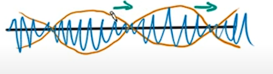

# Appunti di istituzioni di fisca teoria

## Indice
1
- [Appunti di istituzioni di fisca teoria](#appunti-di-istituzioni-di-fisca-teoria)
  - [Indice](#indice)
- [1. Introduction](#1-introduction)
  - [1.1 Parte generica (numeri complessi, quando usare la MQ, etc.)](#11-parte-generica-numeri-complessi-quando-usare-la-mq-etc)
    - [1.1.1 Quando usare la MQ?](#111-quando-usare-la-mq)
    - [1.1.2 Key concepts in quantum mechanics](#112-key-concepts-in-quantum-mechanics)
    - [1.1.3 L'equazione di Schrodinger](#113-lequazione-di-schrodinger)
  - [1.2 Probabilità](#12-probabilità)
    - [1.2.1 Distribuzioni di probabilità e le loro proprietà](#121-distribuzioni-di-probabilità-e-le-loro-proprietà)
      - [1.2.1.1 Probabilità discreta](#1211-probabilità-discreta)
      - [1.2.1.2 Probabilità continua](#1212-probabilità-continua)
    - [1.2.2 Proprietà](#122-proprietà)
    - [1.2.3 Tipi di distribuzioni](#123-tipi-di-distribuzioni)
    - [1.2.4 Varianza](#124-varianza)
  - [1.3 Normalizzazione della funzione d'onda](#13-normalizzazione-della-funzione-donda)
    - [1.3.1 Evoluzione nel tempo della funzione d'onda](#131-evoluzione-nel-tempo-della-funzione-donda)
    - [1.3.2 Esempio](#132-esempio)
  - [1.4 Operatori](#14-operatori)
    - [1.4.1 Misura di "movimento" di una particella](#141-misura-di-movimento-di-una-particella)
    - [1.4.2 Altri operatori](#142-altri-operatori)
    - [1.4.3 Esempio](#143-esempio)
  - [1.5 Principio di indeterminazione di Heisenberg](#15-principio-di-indeterminazione-di-heisenberg)
  - [1.6 Key concepts of QM, revisited](#16-key-concepts-of-qm-revisited)
- [2. Equazione di Schrodinger](#2-equazione-di-schrodinger)
  - [2.1 Separazione di variabili](#21-separazione-di-variabili)
    - [2.1.1 ODE e PDE](#211-ode-e-pde)
    - [2.1.2 Separazione di variabili](#212-separazione-di-variabili)
    - [2.1.3 Wave equation](#213-wave-equation)
  - [2.1.4 Heat equation](#214-heat-equation)
  - [2.2 Schrodinger equation](#22-schrodinger-equation)
      - [2.2.3 Risoluzione delle equazioni](#223-risoluzione-delle-equazioni)
      - [2.2.4 Soluzione generale](#224-soluzione-generale)
  - [2.3 Stationary solutions to the Schrödinger equation](#23-stationary-solutions-to-the-schrödinger-equation)
    - [2.3.1 Operatore](#231-operatore)
    - [2.3.2 Stationary states and energy](#232-stationary-states-and-energy)
      - [2.3.3 Deviazione standard](#233-deviazione-standard)
    - [2.3.4 Riassumendo](#234-riassumendo)
  - [2.4 Superpositions of stationary states](#24-superpositions-of-stationary-states)
    - [2.4.1 Linearità dell'equazione di Schrödinger](#241-linearità-dellequazione-di-schrödinger)
    - [2.4.2 Soluzione generica dell'equazione di Schrödinger](#242-soluzione-generica-dellequazione-di-schrödinger)
      - [2.4.2.1 Esempio](#2421-esempio)
    - [2.4.3 Densità di provabilità](#243-densità-di-provabilità)
  - [2.5 Problemi classici in MQ](#25-problemi-classici-in-mq)
  - [2.6 Energia potenziale](#26-energia-potenziale)
    - [2.6.1 Alcuni casi diversi di potenziali che andremo a vedere](#261-alcuni-casi-diversi-di-potenziali-che-andremo-a-vedere)
  - [2.7 Derivate e come si comporta la funzione d'onda](#27-derivate-e-come-si-comporta-la-funzione-donda)
- [3. Infinite square well](#3-infinite-square-well)
  - [3.1 Introduzione](#31-introduzione)
  - [3.2 Boundary conditions](#32-boundary-conditions)
  - [3.3 Normalizzazione](#33-normalizzazione)
  - [3.4 Alcune domande per controllare se si ha capito](#34-alcune-domande-per-controllare-se-si-ha-capito)
  - [3.5 Ortogonalità e completezza](#35-ortogonalità-e-completezza)
    - [3.5.1 Ortogonalità](#351-ortogonalità)
    - [3.5.2 Fourier's trick](#352-fouriers-trick)
  - [3.6 Esempio](#36-esempio)
    - [3.6.1 General procedure](#361-general-procedure)
    - [3.6.2 Esempio](#362-esempio)
- [4. Oscillatore armonico](#4-oscillatore-armonico)
  - [4.1 TISE solution by ladder operations](#41-tise-solution-by-ladder-operations)
    - [4.1.1 Ladder operators](#411-ladder-operators)
    - [4.1.2 Commutatore](#412-commutatore)
    - [4.1.3 Ritorniamo ai ladder operators](#413-ritorniamo-ai-ladder-operators)
    - [4.1.4 Energies](#414-energies)
  - [4.2 Sommario ladder operators](#42-sommario-ladder-operators)
    - [4.2.1 Esempio](#421-esempio)
  - [4.3 Harmonic oscillator TISE solutions by power series](#43-harmonic-oscillator-tise-solutions-by-power-series)
    - [4.3.1 Harmonic oscillator TISE](#431-harmonic-oscillator-tise)
    - [4.3.2 Soluzioni asintotiche](#432-soluzioni-asintotiche)
    - [4.3.3 Rimozione della soluzione asintotica](#433-rimozione-della-soluzione-asintotica)
    - [4.3.4 Solution by power series](#434-solution-by-power-series)
    - [4.3.5 Solutions as Hermite polynomials](#435-solutions-as-hermite-polynomials)
- [5. Particella libera](#5-particella-libera)
  - [5.1 Free particle TISE](#51-free-particle-tise)
  - [5.2 Boundary conditions? Quantization?](#52-boundary-conditions-quantization)
  - [5.3 Normalizzazione?](#53-normalizzazione)
  - [5.4 Wave packets](#54-wave-packets)
    - [5.3.1 Check of understanding](#531-check-of-understanding)
  - [5.5 Wave packets continuation](#55-wave-packets-continuation)
    - [5.5.1 Cosa è un wave packet](#551-cosa-è-un-wave-packet)
    - [5.5.2 Fourier transform and the wavefunction](#552-fourier-transform-and-the-wavefunction)
      - [Esempio proposto](#esempio-proposto)
  - [5.6 Wave speed](#56-wave-speed)
    - [5.6.1 Wave packet velocity](#561-wave-packet-velocity)
  - [5.7 Free particle wave packet example](#57-free-particle-wave-packet-example)
- [6. Dirac delta function](#6-dirac-delta-function)
  - [6.1 Delta function integral](#61-delta-function-integral)
    - [6.1.1 Esempio 1](#611-esempio-1)
    - [6.1.1 Esempio 2](#611-esempio-2)
  - [6.2 Delta function derivates](#62-delta-function-derivates)
  - [6.3 Delta function ricollegato alle trasformate di Fourier](#63-delta-function-ricollegato-alle-trasformate-di-fourier)
- [7. Boundary conditions, bound states, scattering states and tunneling](#7-boundary-conditions-bound-states-scattering-states-and-tunneling)
  - [7.1 Bound states](#71-bound-states)
  - [7.2 Boundary conditions in the time indipendent Schrödinger equation](#72-boundary-conditions-in-the-time-indipendent-schrödinger-equation)
- [8. Delta function potential TISE](#8-delta-function-potential-tise)
  - [8.1 Bounded solution](#81-bounded-solution)
  - [8.2 Scattering states](#82-scattering-states)
    - [8.2.1 Cosa succede se abbiamo una barriera al posto di una buca?](#821-cosa-succede-se-abbiamo-una-barriera-al-posto-di-una-buca)
- [9. Finite square well](#9-finite-square-well)
  - [9.1 Bounded state solution](#91-bounded-state-solution)
    - [9.1.1 Even solutions](#911-even-solutions)
    - [9.1.2 Odd solutions](#912-odd-solutions)
    - [9.1.3 Esempio numerico](#913-esempio-numerico)
  - [9.2 Scattering states](#92-scattering-states)
- [10. Linear algebra](#10-linear-algebra)
  - [10.1 Notazione](#101-notazione)
  - [10.2 Schwarz inequality](#102-schwarz-inequality)
  - [10.3 Linear transformations](#103-linear-transformations)
  - [10.4 Eigenvalues and eigenvectors](#104-eigenvalues-and-eigenvectors)
    - [10.4.1 Diagonalizzazione](#1041-diagonalizzazione)
    - [10.5 Hermitian transformations](#105-hermitian-transformations)
- [11. Mathematical formalism of quantum mechanics](#11-mathematical-formalism-of-quantum-mechanics)
  - [11.1 Linear algebra in Hilbert space](#111-linear-algebra-in-hilbert-space)
  - [11.2 Observables](#112-observables)
  - [11.3 States with no uncertainty](#113-states-with-no-uncertainty)
  - [11.4 Hermitian operators and eigenvalue problems](#114-hermitian-operators-and-eigenvalue-problems)
    - [11.4.1 Eigenvalues of hermitian operators are *real*](#1141-eigenvalues-of-hermitian-operators-are-real)
    - [11.4.2 Eigenstates of hermitian operators are orthogonal](#1142-eigenstates-of-hermitian-operators-are-orthogonal)
    - [11.4.3 Completeness of eigenstates](#1143-completeness-of-eigenstates)
    - [11.4.4 Continuous spectrum](#1144-continuous-spectrum)
    - [11.4.5 Il position operator](#1145-il-position-operator)
- [12. Statistics](#12-statistics)
  - [12.1. Osservazione di Q](#121-osservazione-di-q)
  - [12.2. Normalizzazione](#122-normalizzazione)
  - [12.3. Expectation value (valore medio)](#123-expectation-value-valore-medio)
  - [12.4. Example: p for QHO ground state](#124-example-p-for-qho-ground-state)
  - [12.5. Esempi e understanding check](#125-esempi-e-understanding-check)
  - [12.5 Unceirtainty principle generalization](#125-unceirtainty-principle-generalization)
    - [12.5.1. Esempio con x e p](#1251-esempio-con-x-e-p)
    - [12.5.2. Minimum position-momentum uncertainty](#1252-minimum-position-momentum-uncertainty)
  - [12.6. Time energy uncertainty](#126-time-energy-uncertainty)
- [13. Dirac notation](#13-dirac-notation)
  - [13.1. Operatori in Dirac notation](#131-operatori-in-dirac-notation)
  - [13.2. Bra ket e dualità](#132-bra-ket-e-dualità)
  - [13.3. Completeness e ortonormalità](#133-completeness-e-ortonormalità)
  - [13.4. Esempi e understanding check](#134-esempi-e-understanding-check)
- [14. Schrodinger equation in 3d](#14-schrodinger-equation-in-3d)
  - [14.1. Esempi e understanding check](#141-esempi-e-understanding-check)
- [15. TISE to spherical harmonics](#15-tise-to-spherical-harmonics)
  - [15.1 TISE with cartesian and spherical coordinate](#151-tise-with-cartesian-and-spherical-coordinate)
  - [15.2 Separation of variables](#152-separation-of-variables)
    - [15.2.1. Separazione delle variabili per la TISE con coordinate cartesiane](#1521-separazione-delle-variabili-per-la-tise-con-coordinate-cartesiane)
      - [15.2.1.1 Esempio](#15211-esempio)
  - [15.3. Separation in spherical coordinates](#153-separation-in-spherical-coordinates)
  - [15.4. TISE and radial behaviour](#154-tise-and-radial-behaviour)
- [16. Infinite spherical well](#16-infinite-spherical-well)
  - [16.1. Caso con l maggiore di 0](#161-caso-con-l-maggiore-di-0)
- [17. Hydrogen atom](#17-hydrogen-atom)
  - [17.1. Hydrogen atom summary](#171-hydrogen-atom-summary)
  - [17.2. Hydrogen atom spectrum](#172-hydrogen-atom-spectrum)
  - [17.3. Calcolare tutto questo per elio](#173-calcolare-tutto-questo-per-elio)
- [18. Angular momentum](#18-angular-momentum)
  - [18.1. Angular momenutm operator algebra](#181-angular-momenutm-operator-algebra)
    - [18.2. Check your understanding](#182-check-your-understanding)
  - [18.2 Angular momentum eigenfunctions](#182-angular-momentum-eigenfunctions)
    - [18.2.1. L in coordinate sferiche](#1821-l-in-coordinate-sferiche)
    - [18.2.2. Example: rigid rotator](#1822-example-rigid-rotator)
- [19. Spin](#19-spin)
- [20. Spin 1/2](#20-spin-12)
  - [20.1. Sequential measurements](#201-sequential-measurements)
  - [20.2. Spin 1/2 in magnetic field](#202-spin-12-in-magnetic-field)
    - [20.2.1. Time evolution](#2021-time-evolution)
    - [20.2.2. Larmor precession](#2022-larmor-precession)
- [21. Angular momentum addition](#21-angular-momentum-addition)
  - [21.1. Triplet and singlet](#211-triplet-and-singlet)
  - [21.2. Aribtrary spin](#212-aribtrary-spin)
  - [21.3. Clebsch-Gordan coefficients](#213-clebsch-gordan-coefficients)
- [22. Formulario finale della morte](#22-formulario-finale-della-morte)
  - [22.1. Quantum mechanics](#221-quantum-mechanics)
    - [22.1.1. Schrödinger equation](#2211-schrödinger-equation)
    - [22.1.2. Hamiltonian](#2212-hamiltonian)
    - [22.1.3. Commutators](#2213-commutators)
    - [22.1.4. Uncertainty principle](#2214-uncertainty-principle)
    - [22.1.5. Time evolution](#2215-time-evolution)
    - [22.1.6. Expectation value](#2216-expectation-value)
    - [22.1.7. Ehrenfest theorem](#2217-ehrenfest-theorem)
    - [22.1.8. Stationary states](#2218-stationary-states)
    - [22.1.9. Time-independent perturbation theory](#2219-time-independent-perturbation-theory)
    - [22.1.10. Time-dependent perturbation theory](#22110-time-dependent-perturbation-theory)
    - [22.1.11. Doppia derivata di una funzione](#22111-doppia-derivata-di-una-funzione)
    - [22.1.12. Formule generali della fisica](#22112-formule-generali-della-fisica)
  - [22.2. Quantum mechanics problems](#222-quantum-mechanics-problems)
    - [22.2.1. Infinite square well](#2221-infinite-square-well)
      - [22.2.1.1 Problemi tipici](#22211-problemi-tipici)
    - [22.2.2. Harmonic oscillator](#2222-harmonic-oscillator)
      - [22.2.2.1 Problemi tipici](#22221-problemi-tipici)
    - [22.2.3 Delta barrier and delta wall](#2223-delta-barrier-and-delta-wall)
      - [22.2.3.1 Problemi tipici](#22231-problemi-tipici)
    - [22.2.4. Particella libera](#2224-particella-libera)
    - [22.2.5. Pozzo finito (finite square well)](#2225-pozzo-finito-finite-square-well)

# 1. Introduction

## 1.1 Parte generica (numeri complessi, quando usare la MQ, etc.)

### 1.1.1 Quando usare la MQ?

In particoalre si applica a situazioni dove le cose che si analizza sono dell'ordine di grandezza di $\hbar$, ovvero $\hbar \approx 10^{-34} \, \text{Js} (1.054 \times 10^{-34} \ kg \ m^2/s)$.

Per esempio quando:
- Il momento angolare $L \sim \hbar$.
- Quando l'incertezza $\Delta x \Delta p \sim \hbar$.
- Quando l'incertezza $\Delta E \Delta t \sim \hbar$.
- Quando l'azione $S = \int L \, dt \sim \hbar$.
  - Questo è un concetto che poi non rivedremo tanto

Alcuni esempi che sono fatti sono:
- Un elettrone in un atomo di idrogeno
  - Che ha $\Delta p \Delta x \sim \hbar$.
- Un granello di polvere in aria
  - Che è di tanti ordini di grandezza più grande di $\hbar$.
  - Quindi in questo caso non si può usare.

### 1.1.2 Key concepts in quantum mechanics

La **funzione d'onda**, una funzione che dipende dalla *posizione* e dal *tempo*. Si tratta di una funzione complessa, e la sua interpretazione è che il modulo quadro di questa funzione d'onda è la probabilità di trovare una particella in una certa posizione.

Gli **operatori** agiscono su $\psi$, di solito si scrivono con $\hat x$ per esempio. Gli operatori si scrivono, quando operano su $\psi$, come $\hat x = x \psi$.

### 1.1.3 L'equazione di Schrodinger

L'EQ di S. è:

$$
i \hbar \frac{\partial \psi}{\partial t} = \hat H \psi
\\ \ \\
= (\hat{KE} + \hat{V}) \psi
\\ \ \\
= - \frac{\hbar^2}{2m} \frac{\partial^2 \psi}{\partial x^2} + V(x) \psi
$$

Dove $\hat{KE}$ è l'operatore dell'energia cinetica, $\hat{V}$ è l'operatore dell'energia potenziale, e $\hat H$ è l'operatore dell'energia totale (**Hamiltonian, "energy operator"**)

## 1.2 Probabilità

Immaginiamo di misurare una palla in un punto nello spazio. Queste misure non saranno mai completamente identiche anche nel mondo classico, sia per imprecisione nella misura che nell'impostare di nuovo lo stato classico del quale eseguiamo misure.

Quello che otteniamo, quindi, è una **distribuzione di probabilità** che ci mostra dove è più probabile, appunto, trovare la palla.

Questo concetto è intimamente collegato alla MQ e alla funzione d'onda.

La funzione d'onda, $\psi(x)$, è una funzione complessa che ci dice dove è più probabile trovare una particella. Il modulo quadro di questa funzione d'onda, $|\psi(x)|^2 = P(x)$, è la probabilità di trovare la particella in una certa posizione.

La probabilità di trovare una particella in un determinato posto (non ci interessa il posto x specifico, in quanto la probabilità è sicuramente pressoché 0: immagina di cercare una persona nata esattamente in un momento x, è sicuramente 0, ma se "allarghi" la ricerca, la probabilità diventa realistica e utile) è data da:

$$
p(\text{trovare la particella tra } a \text{ e } b) = \int_{a}{b}|\psi(x)|^2 dx
$$

### 1.2.1 Distribuzioni di probabilità e le loro proprietà

Ci sono due probabilità principali:
- **Probabilità discreta**
- **Probabilità continua**

#### 1.2.1.1 Probabilità discreta 

Immaginiamo di avere i dati $[0,0,1,1,1,2,2,3,4,5]$, ovvero 2 persone hanno risposto 0, 3 persone hanno risposto 1, 2 persone hanno risposto 2, 1 persona ha risposto 3, 1 persona ha risposto 4, e 1 persona ha risposto 5.

Quindi a partire da questo possiamo calcoalre la probabilità di 1 per esempio, ovvero $P(1) = \frac{2}{10}$.

La probabilità totale è 1, ovvero $\sum_{i} P(i) = 1$.

#### 1.2.1.2 Probabilità continua

Immaginiamo ora di chiedere ad un numero di persone quanto tempo sono rimaste in attesa in una chiamata. Le risposte potrebbero essere del tipo: $[0.072, 0.117, 0.232, 0.549, 0.799, 1.099, 1.740, 1.836, 1.888, 2.161]$. Assumono quindi un insieme di valori continui, che non possono essere trattati come i valori discreti.

Pertanto a questo punto noi possiamo: assumere siano discreti OPPURE cercare una distribuzione di probabilità che li riesca a rappresentare.

Questa funzione è $\rho(x)$, chiamata la **densità di probabilità**. Questa funzione è tale che:

$$
\int_{-\infty}^{\infty} \rho(x) dx = 1
$$

Da notare che data questa distribuzione abbiamo che $P(x=1)=0$, per esempio. Quindi il modo di effettivamente calcolare le probabilità è:

$$
P(a \leq x \leq b) = \int_{a}^{b} \rho(x) dx
$$

### 1.2.2 Proprietà

**Moda**, ovvero l'elemento più probabile:
- Per una distribuzione discreta è l'elemento con la probabilità più alta
  - Nell'esempio di prima è 1
- Per una distribuzione continua è il punto in cui la densità di probabilità è massima
  - Però qual'è la probabilità di ottenere proprio un certo valore? $0$. Ricordiamo che ogni punto singolo ha probabilità 0.

**Mediana**, ovvero il valore che divide la distribuzione in due parti uguali:
- Per una distribuzione discreta è il valore che divide la distribuzione in due parti uguali
- Per una distribuzione continua è il valore tale che la probabilità di ottenere un valore minore è uguale alla probabilità di ottenere un valore maggiore
  - Quindi la mediana è il valore tale che $\int_{-\infty}^{x_{\text{med}}} \rho(x) dx = \int_{x_{\text{med}}}^{\infty} \rho(x) dx$
  - O anche, deve fare 0.5: $\int_{-\infty}^{x_{\text{med}}} \rho(x) dx = 0.5$

**Media**, ovvero il valore medio:
- Per una distribuzione discreta è la somma dei valori moltiplicati per la probabilità di ottenere quel valore
  - Ovvero si scrive come $M = \sum_{i} P(x = x_i) x_i$
- Per una distribuzione continua è l'integrale dei valori moltiplicati per la densità di probabilità
  - Ovvero si scrive come $M = \int_{-\infty}^{\infty} \rho(x) x \ dx$

**Valore atteso** (expected value) di una funzione $f(x)$:
- Per una distribuzione discreta è la media con una funzione applicata ai valori 
  - Si scrive come $\braket{f} = \sum_{i} P(x = x_i) f(x_i)$
- Per una distribuzione continua è l'integrale con una funzione applicata ai valori
  - Si scrive come $\braket{f} = \int_{-\infty}^{\infty} \rho(x) f(x) \ dx$

### 1.2.3 Tipi di distribuzioni

Possiamo avere diversi tipi di distribuzioni:
- Alcune **simmetriche** (come la gaussiana)
  - Che possono essere più "strette" o più larghe"
- Altre che possono essere asimmetriche, come la distribuzione esponenziale
- Altre che sono simmetriche ma non hanno un solo picco, per esempio la **bimodal**.

### 1.2.4 Varianza

La varianza è un modo di misurare la "*broadness*" della distribuzione.

Immaginiamo di voler trovare come valore atteso quello di $\Delta x = x - \braket{x}$.

Se noi facciamo:
- $\braket{\Delta x} = 0$
  - Quindi non ci è utile (a sinistra sono negativi, a destra sono positivi e si cancellano poi a vicenda)
- $\braket{|\Delta x|}$
  - Questo è ragionevole, però diventa "doloroso" andare a fare tutti i calcoli visto che abbiamo dei valori assoluti quindi usiamo un altro modo ancora

Il modo per misurare la varianza è:

$$
\sigma^2 = \braket{(\Delta x)^2} = \braket{x^2} - \braket{x}^2
$$

## 1.3 Normalizzazione della funzione d'onda

Abbiamo detto che nelle distribuzioni di probabilità la somma delle probabilità è 1. Questo è vero anche per la funzione d'onda, ovvero:

$$
\int_{-\infty}^{\infty} |\psi(x)|^2 dx = 1
$$

Possiamo notare che per esempio alcune funzioni non sono normalizzabili, come ad esempio $\psi(x) = x^3$. Notiamo che questa qua non è normalizzabile, in quanto:

$$
\int_{-\infty}^{\infty} |x^3|^2 dx = \int_{-\infty}^{\infty} x^6 dx = \infty
$$

In particolare noi andiamo a mettere una richiesta: **$\psi$ deve essere quadrato sommabile**, ovvero:

$$
\int_{-\infty}^{\infty} |\psi(x)|^2 dx \text{ is finite}
$$

Inoltre mettiamo una proprietà che ne consegue ed è più "facile", ovvero che:

$$
\psi \to 0 \text{ as } |x| \to \infty
$$

Riscriviamo un attimo l'equazione di Schrodinger:

$$
i \hbar \frac{\partial \psi}{\partial t} = - \frac{\hbar^2}{2m} \frac{\partial^2 \psi}{\partial x^2} + V(x) \psi
$$

Notiamo che quindi, se $\psi$ risolve l'equazione di Schrodinger, allora anche $A \psi$ risolve l'equazione di Schrodinger, con $A$ una *costante complessa*, in quanto noi la potremmo dividere da entrambi i lati.

Da notare che con il fatto che $A$ è una costante, potremmo pensare di incorrere in problemi nell'evoluzione temporale *E INVECE* non ci sono sti problemi: nell'evoluzione temporale, la normalizzazione viene mantenuta.

### 1.3.1 Evoluzione nel tempo della funzione d'onda

$$
\frac{d}{dt} \int_{-\infty}^{\infty} |\psi(x,t)|^2 dx =?=  \int_{-\infty}^{\infty} \frac{\partial}{\partial t} |\psi(x,t)|^2 dx
\\ \ \\
= \int_{-\infty}^{\infty} \frac{\partial}{\partial t} \psi^* \psi dx
\\ \ \\
= \int_{-\infty}^{\infty} \left( \frac{\partial \psi^*}{\partial t} \psi + \psi^* \frac{\partial \psi}{\partial t} \right) dx
$$

A questo punto possiamo usare l'equazione di Schrodinger:

$$
= \int_{-\infty}^{\infty} \left( \frac{i \hbar}{2m} \frac{\partial^2 \psi^*}{\partial x^2} \psi + \frac{i \hbar}{2m} \psi^* \frac{\partial^2 \psi}{\partial x^2} \right) dx
\\ \ \\
= \frac{i \hbar}{2m} \int_{-\infty}^{\infty} \left( \frac{\partial^2 \psi^*}{\partial x^2} \psi - \psi^* \frac{\partial^2 \psi}{\partial x^2} \right) dx
\\ \ \\
= \frac{i \hbar}{2m} \left[\psi^* \frac{\partial\psi}{\partial x} - \frac{\partial \psi^*}{\partial x} \psi \right] _{-\infty}^{\infty}
$$

Ma abbiamo che se $\psi$ è normalizzabile, allora $\psi \to 0$ per $|x| \to \infty$, quindi il termine si annulla (si può dimostrare che $\psi$ tende a 0 più veloce di quanto $\frac{\partial \psi}{\partial x}$ possa tendere a infinito).

Quindi il risultato è:

$$
\frac{d}{dt} \int_{-\infty}^{\infty} |\psi(x,t)|^2 dx = 0
\\ \ \\
\implies \int_{-\infty}^{\infty} |\psi(x,t)|^2 dx = \text{const}
$$

Pertanto, l'evoluzione temporale della funzione d'onda mantiene la normalizzazione.

### 1.3.2 Esempio

Consideriamo la funzione:

$$
\psi (x) = \begin{cases} 0 & \text{se } |x| > 1 \\ A e^{i x} (1-x^2) & \text{altrimenti} \end{cases}
$$

Quindi:

$$
\int_{-\infty}^{\infty} |\psi(x)|^2 dx
\\ \ \\
= \int_{-1}^{1} A \ e^{i x} (1-x^2) A \ e^{-i x} (1-x^2) dx
\\ \ \\
= A^2 \int_{-1}^{1} (1-x^2)^2 dx
\\ \ \\
= A^2 \int_{-1}^{1} (1-2x^2 + x^4) dx
\\ \ \\
= A^2 \left[ x - \frac{2}{3} x^3 + \frac{1}{5} x^5 \right]_{-1}^{1}
\\ \ \\
= A^2 \left[ 1 - \frac{2}{3} + \frac{1}{5} - (-1 + \frac{2}{3} - \frac{1}{5}) \right]
\\ \ \\
= A^2 \left[ 1 - \frac{2}{3} + \frac{1}{5} + 1 - \frac{2}{3} + \frac{1}{5} \right]
\\ \ \\
= A^2 \left[ 2 - \frac{4}{3} + \frac{2}{5} \right]
\\ \ \\
= A^2 \left[ \frac{30 - 20 + 6}{15} \right]
\\ \ \\
= A^2 \left[ \frac{16}{15} \right]
$$

Quindi:

$$
\int_{-\infty}^{\infty} |\psi(x)|^2 dx = 1
\\ \ \\
\implies A = \sqrt{\frac{15}{16}}
$$

## 1.4 Operatori

### 1.4.1 Misura di "movimento" di una particella

Noi abbiamo in precendeza definito la posizione di una particella come una probabilità rispetto alla sua funzione d'onda.

Se noi immaginiamo di voler capire come la particella si muove, non ci basta misurarla in momenti diversi, dobbiamo preparare un **ensamble** di sistemi preparati in modo identico e che misuriamo una volta per ogni sistema, ma in generale tante volte e in tanti momenti diversi. Questo ci andrà a permettere di rappresentare l'evoluzione temporale della particella a livello odi funzione d'onda (quindi con una distribuzione di probabilità).

Possiamo andare a prevedere questa evoluzione? Andiamo a condsiderare $\frac{d}{dt} \braket{x}$:

$$
\frac{d}{dt} \braket{x} = \frac{d}{dt} \int_{-\infty}^{\infty} x |\psi(x,t)|^2 dx
\\ \ \\
= \int_{-\infty}^{\infty} x \frac{\partial}{\partial t} |\psi(x,t)|^2 dx
\\ \ \\
= \frac{i\hbar}{2m} \int_{-\infty}^{\infty} x \left( \frac{\partial \psi^*}{\partial t} \psi + \psi^* \frac{\partial \psi}{\partial t} \right) dx
$$

A questo punto facciamo l'integrazione per parti, andando a considerare:

$$
u = x \quad \quad dv = \frac{\partial}{\partial x} (\psi^* \frac{\partial \psi}{\partial t} - \psi \frac{\partial \psi^*}{\partial t}) dx
\\ \ \\
du = dx \quad \quad v = \psi^* \frac{\partial \psi}{\partial t} - \psi \frac{\partial \psi^*}{\partial t}
$$

E quindi otteniamo:

$$
\int_{-\infty}^{\infty} x \frac{\partial}{\partial t} |\psi(x,t)|^2 dx = \frac{i\hbar}{2m} \left[ x \left( \psi^* \frac{\partial \psi}{\partial t} - \psi \frac{\partial \psi^*}{\partial t} \right) \right]_{-\infty}^{\infty} - \frac{i\hbar}{2m} \int_{-\infty}^{\infty} \left( \psi^* \frac{\partial \psi}{\partial t} - \psi \frac{\partial \psi^*}{\partial t} \right) dx
\\ \ \\
= \frac{i\hbar}{2m} \int_{-\infty}^{\infty} \left( \psi^* \frac{\partial \psi}{\partial t} - \psi \frac{\partial \psi^*}{\partial t} \right) dx
\\ \ \\
\text{separiamo}
\\ \ \\
= \frac{i\hbar}{2m} \int_{-\infty}^{\infty} \psi^* \frac{\partial \psi}{\partial t} dx + \frac{i\hbar}{2m} \int_{-\infty}^{\infty} \psi \frac{\partial \psi^*}{\partial t} dx
$$

Anche qua facciamo integrare per parti:

$$
u = \psi \quad \quad dv = \frac{\partial \psi^*}{\partial t} dx
\\ \ \\
du = \frac{\partial \psi}{\partial x} \quad \quad v = \psi^*
$$

E notiamo che la parte che viene fuori è 0, mentre quella da integrare è identica all'altro elemento, quindi otteniamo:

$$
= \frac{i\hbar}{m} \int_{-\infty}^{\infty} \psi^* \frac{\partial \psi}{\partial t} dx = \braket{\hat{v}}
$$

Quello che ci dà è la una distribuzione di probabilità della velocità in un senso quantistico.

### 1.4.2 Altri operatori

Vediamo come sono quindi accomunati un po tutti gli operatori dal modo di trascriverli.

$$
\braket{v} = - \frac{i\hbar}{m} \int_{-\infty}^{\infty} \psi^* \frac{\partial \psi}{\partial x} dx
\\ \ \\
\braket{p} = - i \hbar \int_{-\infty}^{\infty} \psi^* \frac{\partial \psi}{\partial x} dx
\\ \ \\
\braket{x} = \int_{-\infty}^{\infty} \psi^* (x) \psi dx
$$

Quindi in generale sono del tipo:

$$
\hat{y} = y [...]
$$

Quindi abbiamo:

$$
\hat{x} = x \cdot [...]
\\ \ \\
\hat{v} = - \frac{i\hbar}{m} \frac{\partial}{\partial x} [...]
\\ \ \\
\hat{p} = - i \hbar \frac{\partial}{\partial x} [...]
\\ \ \\
\hat{T} = - \frac{\hbar^2}{2m} \frac{\partial^2}{\partial x^2} [...]
$$

Gli operatori scritti sono:
- La posizione
- La velocità
- Il momentum
- Il momento squadrato

Questo quindi ci permette di esprimere il valore previsto per qualsiasi quantità fisica. Ci basta trovare gli operatori di quella quantità e poi fare il prodotto scalare con la funzione d'onda.

### 1.4.3 Esempio

Trovare $\braket{\hat{p}}$ della funzione d'onda:

$$
\psi(x) = \begin{cases} 0 & \text{se } |x| > 1 \\ A(1-x^2) & \text{altrimenti} \end{cases}
$$

Quindi ciò che calcoliamo è:

$$
\braket{\hat{p}} = \int_{-\infty}^{+\infty} \psi^* \left( - i \hbar \frac{\partial}{\partial x} \right) \psi \ dx
\\ \ \\
= \int_{-1}^{1} A^2 (1-x^2) \left( - i \hbar \frac{\partial}{\partial x} \right) (1-x^2) \ dx
\\ \ \\
= - i \hbar A^2 \int_{-1}^{1} (1-x^2) \frac{\partial}{\partial x} (1-x^2) \ dx
\\ \ \\
= i \hbar A^2 \int_{-1}^{1} (1-x^2) 2x \ dx
\\ \ \\
= 2 i \hbar A^2 \int_{-1}^{1} x - x^3 \ dx
\\ \ \\
= 0
$$

In quanto la funzione da integrare è dispari, quindi l'integrale è 0.

## 1.5 Principio di indeterminazione di Heisenberg

Questo è un principio molto importante che è built in nella MQ.

Una prima intuitiva dimostrazione della scomodità di misusare la posizione e la wavelength di un onda:
- Se noi abbiamo immaginiamo un onda che si ripete tante volte ed ha tanti picchi, allora abbiamo appunto molti picchi che ci possono dare una risposta piuttosto accurata sulla lunghezza d'onda dell'onda
- Se invece abbiamo 1 unico picco, allora non ci è possibile dire molto sulla lunghezza d'onda dell'onda

D'altro canto:
- Se noi abbiamo tanti picchi, abbiamo difficoltà a determinare dove esattamente si trova l'onda
- Se invece abbiamo un solo picco, allora possiamo dire con molta precisione dove si trova l'onda

In particolare, da **fourier analysis**, ci esce l'equazione: $\Delta \lambda \Delta x \geq 1$.

Come è stato associato alla materia un onda? Dobbiamo parlare di **Debroglie**.

In particolare, c'erano già le seguenti equazioni:
- $E = mc^2$
- $E = h F$
- c = $\lambda F$

Quindi $\implies F = c/\lambda$.

Quindi:

$$
m c^2 = h \frac{c}{\lambda}
\\ \ \\
m c = \frac{h}{\lambda}
\\ \ \\
p = \frac{h}{\lambda}
$$

Mentre le equazioni precedenti avevano un utilizzo specifico, il primo per la relatività e il secondo per la quantizzazione dell'energia, la terza è applicabile alla materia.

Unendo quindi le due equazioni, otteniamo:

$$
p = \frac{h}{\lambda} \quad \quad \text{e} \quad \quad \Delta \lambda \Delta x \geq 1
\\ \ \\
\Delta p \Delta x \geq \hbar/2
$$

Andiamo anche un po ad analizzare semanticamente cosa possono significare queste cose:
- $\Delta p \sim$ lunghezza d'onda, la frequenza dell'onda nello spazio
- $\Delta x \sim$ posizione
- Qua stiamo parlando della *frequency* dell'onda nello spazio

Mentre per l'energia abbiamo:
- $\Delta E \sim$ tempo, la frequenza dell'onda nel tempo
- $\Delta t \sim$ tempo
- Qua stiamo parlando della *frequency* dell'onda nel tempo (quanto velocemente oscilla)

## 1.6 Key concepts of QM, revisited

Gli operatori chiave che abbiamo trattato per ora sono:
- Opetatori, vengono usati nell'equazione di Schrodinger e agiscono sulla funzione d'onda $\psi$.
- Gli operatori e la funzione d'onda collaborano per darci degli osservabili
- L'equazione di S. è una soluzione della funzione d'onda.

# 2. Equazione di Schrodinger

## 2.1 Separazione di variabili

### 2.1.1 ODE e PDE

Andiamo a definire **Ordinary Differential Equation (ODE)** e **Partial Differential Equation (PDE)**.

Un'ODE è un'equazione differenziale in cui le funzioni dipendono da una sola variabile indipendente.
- Per esempio $x(t)$, che dipende quindi solo dal tempo, $y(t)$ che dipende solo dal tempo, etc.

Una PDE è un'equazione differenziale in cui le funzioni dipendono da più di una variabile indipendente.
- Per esempio $\vec{E} (x,y,z)$, quindi dipende da 3 variabili indipendenti, $\psi(x,t)$, quindi dipende da 2 variabili indipendenti, etc.

### 2.1.2 Separazione di variabili

Si tratta essenzialmente di "indovinare".

Supponiamo di voler trovare una funzione (nel caso dell'elettromagnetismo è il potenziale $V(x,y,z)$) e supponiamo che si possa scrivere come:

$$
V(x,y,z) = X(x) Y(y) Z(z)
$$

Quindi riusciamo a separare le variabili in 3 funzioni diverse.

Questa soluzione funziona? In questo caso sì, ci sono tanti casi nei quali questa soluzione naive funziona, ma non in tutti.

### 2.1.3 Wave equation

Andiamo a trascrivere l'equazione d'onda:

$$
\frac{\partial^2 u(x,t)}{\partial t^2} = c^2 \frac{\partial^2 u(x,t)}{\partial x^2}
$$

Questa equazione è quella usata a mettere in relazione **l'accelerazione di un punto** con **la curvatura della funzione**. Essenzilamente stiamo correlando la seconda derivata temporale con la seconda derivata spaziale.

Questa funzione si può per esempio usare per calcolare come dovrebbe funzionare una stringa che vibra.

Andiamo ad analizzare come possiamo separare le variabili:

$$
u(x,t) = X(x) T(t)
$$

Quindi a questo punto possiamo riscrivere le funzioni come segue:

$$
\frac{\partial^2 (X(x)T(t))}{\partial t^2} = c^2 \frac{\partial^2 X(x)T(t)}{\partial x^2}
$$

Ma possiamo tirare fuori le cose che non dipendono dalla parte che viene integrata in quanto sono costanti:

$$
X(x) \frac{\partial^2 T(t)}{\partial t^2} = c^2 T(t) \frac{\partial^2 X(x)}{\partial x^2}
$$

Ora possiamo dividere per $X(x) T(t)$:

$$
\frac{1}{T(t)} \frac{\partial^2 T(t)}{\partial t^2} = c^2 \frac{1}{X(x)} \frac{\partial^2 X(x)}{\partial x^2}
$$

A questo punto vediamo che a sinistra abbia un equazione che dipende da $t$ mentre a destra una che dipende unicamente da $x$. Quindi se noi cambiamo la $x$, la $t$ non cambia ma l'equazione deve rimanere valida e viceversa vale anche per la $t$. Pertanto possiamo dire che entrambe le parti devono essere costanti:

$$
\frac{1}{T(t)} \frac{\partial^2 T(t)}{\partial t^2} = a
\\ \ \\
c^2 \frac{1}{X(x)} \frac{\partial^2 X(x)}{\partial x^2} = a
$$

A questo punto moltiplichiamo entrambi i lati per $T(t)$ e $X(x)$:

$$
\frac{\partial^2 T(t)}{\partial t^2} = a T(t)
\\ \ \\
\frac{\partial^2 X(x)}{\partial x^2} = a X(x)
$$

Quindi abbiamo due equazioni differenziali ordinarie, che possiamo risolvere. Da notare che l'unica funzione che derivata due volte ci da la stessa funzione è la funzione esponenziale. Quindi otteniamo:

$$
T(t) = A e^{\sqrt{a} t}
\\ \ \\
X(x) = B e^{\frac{\sqrt{a}}{c} x}
$$

E quindi possiamo scrivere:

$$
u(x,t) = A e^{\sqrt{a} t} B e^{\frac{\sqrt{a}}{c} x}
\\ \text{unendo le due costanti di normalizzazione abbiamo:} \\
u(x,t) = C e^{\sqrt{a} t} e^{\frac{\sqrt{a}}{c} x}
$$

A questo punto, con questa equazione, possiamo determinare $A$ e $a$ usando le boundary conditions.

## 2.1.4 Heat equation

Andiamo a calcolare la soluzione per l'equazione di come si diffonde il calore.

$$
\frac{\partial u(x,t)}{\partial t} = \alpha \frac{\partial^2 u(x,t)}{\partial x^2}
$$

Quindi rifacciamo lo stesso passaggio iniziale di separare $u$ in $X(x) T(t)$:

$$
u(x,t) = X(x)T(t)
$$

Sostituendo questa forma nell'equazione del calore otteniamo:

$$
X(x) \frac{\partial T(t)}{\partial t} = \alpha T(t) \frac{\partial^2 X(x)}{\partial x^2}
$$

A questo punto possiamo dividere per $X(x) T(t)$:

$$
\frac{1}{T(t)} \frac{\partial T(t)}{\partial t} = \alpha \frac{1}{X(x)} \frac{\partial^2 X(x)}{\partial x^2}
$$

Abbiamo quindi due parti che dipendono da $t$ e $x$ rispettivamente, quindi possiamo dire che entrambe devono essere costanti:

$$
\frac{1}{T(t)} \frac{\partial T(t)}{\partial t} = -\lambda
$$

$$
\alpha \frac{1}{X(x)} \frac{\partial^2 X(x)}{\partial x^2} = -\lambda
$$

Risolvendo queste equazioni otteniamo:

1. La soluzione per $T(t)$:

$$
T(t) = A e^{-\lambda t}
$$

2. La soluzione per $X(x)$:

L'equazione differenziale per $X(x)$ è un'equazione di tipo armonico:

$$
\frac{\partial^2 X(x)}{\partial x^2} + k^2 X(x) = 0
$$

dove $k^2 = \frac{\lambda}{\alpha}$. Le soluzioni di questa equazione sono combinazioni lineari di funzioni seno e coseno:

$$
X(x) = B \cos(kx) + C \sin(kx)
$$

Quindi, combinando le soluzioni, la soluzione generale per $u(x,t)$ è:

$$
u(x,t) = (B \cos(kx) + C \sin(kx)) e^{-\lambda t}
$$

Dove $k^2 = \frac{\lambda}{\alpha}$. I valori di $k$ e le costanti $B$ e $C$ vengono determinati dalle condizioni al contorno e dalle condizioni iniziali del problema specifico.

In sintesi, la soluzione corretta per l'equazione del calore con la separazione delle variabili è:

$$
u(x,t) = (B \cos(kx) + C \sin(kx)) e^{-\lambda t}
$$

## 2.2 Schrodinger equation

Supponiamo che la soluzione possa essere scritta come il prodotto di due funzioni, una dipendente solo da $x$ e l'altra solo da $t$:

$$
\psi(x,t) = \phi(x) T(t)
$$

Sostituendo questa forma nell'equazione di Schrödinger otteniamo:

$$
i \hbar \phi(x) \frac{\partial T(t)}{\partial t} = \left( -\frac{\hbar^2}{2m} \frac{\partial^2 \phi(x)}{\partial x^2} + V(x) \phi(x) \right) T(t)
$$

Dividiamo entrambi i lati per $\phi(x) T(t)$:

$$
i \hbar \frac{1}{T(t)} \frac{\partial T(t)}{\partial t} = \left( -\frac{\hbar^2}{2m} \frac{1}{\phi(x)} \frac{\partial^2 \phi(x)}{\partial x^2} + V(x) \right)
$$

Poiché il lato sinistro dell'equazione dipende solo da $t$ e il lato destro solo da $x$, ciascuno deve essere uguale a una costante che chiamiamo $E$:

$$
i \hbar \frac{1}{T(t)} \frac{\partial T(t)}{\partial t} = E
$$

$$
-\frac{\hbar^2}{2m} \frac{1}{\phi(x)} \frac{\partial^2 \phi(x)}{\partial x^2} + V(x) = E
$$

Ora abbiamo due equazioni differenziali ordinarie:

1. Per $T(t)$:

$$
\frac{1}{T(t)} \frac{\partial T(t)}{\partial t} = -\frac{iE}{\hbar}
$$

2. Per $\phi(x)$:

$$
-\frac{\hbar^2}{2m} \frac{\partial^2 \phi(x)}{\partial x^2} + V(x) \phi(x) = E \phi(x)
$$

#### 2.2.3 Risoluzione delle equazioni

1. La soluzione per $T(t)$:

$$
\frac{\partial T(t)}{\partial t} = -\frac{iE}{\hbar} T(t)
$$

Integrando otteniamo:

$$
T(t) = e^{-\frac{iE}{\hbar} t}
$$

2. La soluzione per $\phi(x)$:

L'equazione differenziale per $\phi(x)$ è l'equazione di Schrödinger indipendente dal tempo:

$$
-\frac{\hbar^2}{2m} \frac{\partial^2 \phi(x)}{\partial x^2} + V(x) \phi(x) = E \phi(x)
$$

Questa è un'equazione agli autovalori dove $E$ è l'autovalore associato all'energia della particella e $\phi(x)$ è la funzione d'onda stazionaria.

#### 2.2.4 Soluzione generale

La soluzione generale dell'equazione di Schrödinger dipendente dal tempo è:

$$
\psi(x,t) = \phi(x) e^{-\frac{iE}{\hbar} t}
$$

Dove $\phi(x)$ è una soluzione dell'equazione di Schrödinger indipendente dal tempo e $E$ è l'energia corrispondente a questa soluzione. Le funzioni $\phi(x)$ e i valori di $E$ vengono determinati dalle condizioni al contorno e dalle specifiche del potenziale $V(x)$.

In sintesi, la soluzione per l'equazione di Schrödinger dipendente dal tempo con la separazione delle variabili è:

$$
\psi(x,t) = \phi(x) e^{-\frac{iE}{\hbar} t}
$$

Dove $\phi(x)$ soddisfa l'equazione di Schrödinger indipendente dal tempo:

$$
-\frac{\hbar^2}{2m} \frac{\partial^2 \phi(x)}{\partial x^2} + V(x) \phi(x) = E \phi(x)
$$

---

Il professore le scrive come:

$$
i \hbar \frac{dT}{dt} = E T
\\ \ \\
- \frac{\hbar^2}{2m} \frac{d^2 X}{dx^2} + V(x) X = E X
$$

Dove $T$ è la parte temporale e $X$ è la parte spaziale (Al posto di $\phi$).

Da notare che possiamo risolvere l'equazione del tempo in modo molto semplice:

$$
\frac{dT}{dt} = - \frac{iE}{\hbar} T
\\ \ \\
\frac{1}{T} dT = - \frac{iE}{\hbar} dt
\\ \ \\
\int \frac{1}{T} dT = - \frac{iE}{\hbar} \int dt
\\ \ \\
\ln(T) = - \frac{iE}{\hbar} t + C
\\ \ \\
T = e^{- \frac{iE}{\hbar} t + C}
\\ \ \\
T = e^{- \frac{iE}{\hbar} t} e^C
\\ \ \\
T = e^{- \frac{iE}{\hbar} t} C
$$

(La C viene anche omessa a volte)

## 2.3 Stationary solutions to the Schrödinger equation

Ripetiamo un attimo l'equazione di Schrödinger:

$$
i\hbar \frac{\partial \psi}{\partial t} = -\frac{\hbar^2}{2m} \frac{\partial^2 \psi}{\partial x^2} + V(x) \psi
$$

Noi abbiamo riscritto la funzione d'onda separando le variabili nel seguente modo:

$$
\psi(x,t) = X(x) e^{-\frac{iE}{\hbar} t}
$$

Consideriamo quindi la densità di probabilità:

$$
\rho(x,t) = |\psi(x,t)|^2 = |X(x) e^{-\frac{iE}{\hbar}}|^2
\\ \ \\
= X^*(x) e^{\frac{iE}{\hbar} t} X(x) e^{-\frac{iE}{\hbar} t}
\\ \ \\
= |X(x)|^2
$$

Quindi non è dipendente dal tempo!

Quindi, da ricordare che la densità di probabilità di una particella in uno stato stazionario è indipendente dal tempo, ovvero intuitivamente la probabilità di trovare la particella in una certa posizione non cambia nel tempo (ciò che cambia sarà la fase, che quindi se vengono combinate più stati con fasi diverse si possono incorrere in fenomeni costruttivi o distruttivi).

Un'altra cosa che cambia nel tempo sono le evoluzioni di osservabili non posizionali: per esempio per il momento angolare, la fase temporale gioca un ruolo fondamentale.

### 2.3.1 Operatore

Immaginiamo ora di applicare un operatore generico $\hat{Q}$ alla funzione d'onda:

$$
\braket{Q} = \int \psi^* \hat{Q} \psi \ dx
\\ \ \\
= \int X^* e^{\frac{iE}{\hbar} t} \hat{Q} X e^{-\frac{iE}{\hbar} t} \ dx
$$

Possiamo fare il passaggio di cancellare il tempo (in quanto la maggiorparte degli operatori che usiamo non dipendono dal tempo, quindi la parte del tempo, per l'operatore, è una costante che possiamo tirare fuori, per esempio $\hat{x} = x$, $\hat{p} = -i\hbar \frac{\partial}{\partial x}$, etc):

$$
= e^{\frac{iE}{\hbar} t} e^{-\frac{iE}{\hbar} t} \int X^* \hat{Q} X \ dx
\\ \ \\
= \int X^* \hat{Q} X \ dx
$$

Quindi $\braket{Q}$ è **indipendente dal tempo**.

### 2.3.2 Stationary states and energy

Ricordiamo che la parte spaziale della **TISE** è:

$$
- \frac{\hbar^2}{2m} \frac{d^2 X}{dx^2} + V(x) X = E X
\\ \ \\
\hat{H} X = E X
$$

Supponiamo di voler calcolare il valore di aspettazione dell'energia:

$$
\braket{\hat{H}} = \int X^* e^{\frac{iE}{\hbar} t} \hat{H} X e^{-\frac{iE}{\hbar} t} \ dx
$$

Possiamo cancellare il tempo, in quanto l'Hamiltoiano non dipende dal tempo:

$$
= \int X^* \hat{H} X \ dx
\\ \ \\
= \int X^* E X \ dx
\\ \ \\
= E \int X^* X \ dx
\\ \ \\
= E
$$

In quanto $\int X^* X \ dx = 1$ (se lo abbiamo normalizzato, per il fatto che le probabilità devono sommare a 1).

#### 2.3.3 Deviazione standard

Vogliamo ora calcolare $\sigma_{\hat{H}}^2$:

$$
\sigma_{\hat{H}}^2 = \braket{\hat{H}^2} - \braket{\hat{H}}^2
$$

Il secondo termine è già stato calcolato, quindi ci manca il primo:

$$
\braket{\hat{H}^2} = \int X^* e^{\frac{iE}{\hbar} t} \hat{H}^2 X e^{-\frac{iE}{\hbar} t} \ dx
\\ \ \\
= \int X^* \hat{H}^2 X \ dx
\\ \ \\
= \int X^* \hat{H} (\hat{H} X) \ dx
\\ \ \\
= \int X^* \hat{H} (E X) \ dx
\\ \ \\
= E \int X^* \hat{H} X \ dx
\\ \ \\
= E^2
$$

Quindi abbiamo che la deviazione standard è:

$$
\sigma_{\hat{H}}^2 = E^2 - E^2 = 0
$$

Quindi non abbiamo **incertezza** sull'energia.

### 2.3.4 Riassumendo

Per degli stati stazionari abbiamo i seguenti fatti:
- $\rho(x)$ è indipendente dal tempo
- $\braket{Q}$ è indipendente dal tempo
- $\braket{\hat{H}} = E$
  - L'energia è esatta, non c'è incertezza

Notiamo però che:

$$
\Delta E \Delta t \geq \frac{\hbar}{2}
$$

Quindi $\Delta E$ è tendendo verso 0, pertanto $\Delta t$ tende verso l'infinito - negli stati stazionari.

Quindi la risposta a "quando" è "sempre", ovvero non possiamo dire nulla sul tempo. Questi stati sono costanti sempre, dall'inizio alla fine del tempo.

Notiamo che quindi non sono particolarmente realistici, però hanno proprietà matematiche molto carine che useremo per imparare.

## 2.4 Superpositions of stationary states

Per ora abbiamo visto gli stati stazionari, ovvero cose che sono così nel tempo e che non cambiano.

Ma a noi interessano anche le cose che cambiano nel tempo, quindi come andiamo ad analizzare o strutturare un problema in modo da avere anche questa parte?

Seppure la loro time dependance è triviale per gli stati stazionari, se noi sommiamo insieme più stati stazionari in una superposizione, la loro dipendenza temporale non è più banale. Da qui deriva la parte interessante dell'evoluzione temporale della MQ.

### 2.4.1 Linearità dell'equazione di Schrödinger

Questo è ciò che ci permette di andare a creare una superposizione di più stati stazionari.

Supponiamo di avere due soluzioni dell'equazione di Schrödinger, $A(x,t)$ e $B(x,t)$:

$$
i \hbar \frac{\partial A}{\partial t} = -\frac{\hbar^2}{2m} \frac{\partial^2 A}{\partial x^2} + V(x) A
\\ \ \\
i \hbar \frac{\partial B}{\partial t} = -\frac{\hbar^2}{2m} \frac{\partial^2 B}{\partial x^2} + V(x) B
$$

Ora supponiamo di voler verificare se anche $\psi(x,t) = A(x,t) + B(x,t)$ è una soluzione dell'equazione di Schrödinger:

$$
i \hbar \frac{\partial \psi}{\partial t} = i \hbar \frac{\partial (A + B)}{\partial t} = i \hbar \left( \frac{\partial A}{\partial t} + \frac{\partial B}{\partial t} \right)
\\ \ \\
= -\frac{\hbar^2}{2m} \frac{\partial^2 (A + B)}{\partial x^2} + V(x) (A + B)
\\ \ \\
= -\frac{\hbar^2}{2m} \left( \frac{\partial^2 A}{\partial x^2} + \frac{\partial^2 B}{\partial x^2} \right) + V(x) (A + B)
\\ \ \\
= -\frac{\hbar^2}{2m} \frac{\partial^2 A}{\partial x^2} + V(x) A -\frac{\hbar^2}{2m} \frac{\partial^2 B}{\partial x^2} + V(x) B
\\ \ \\
= i \hbar \frac{\partial A}{\partial t} + i \hbar \frac{\partial B}{\partial t}
\\ \ \\
= i \hbar \frac{\partial \psi}{\partial t}
$$

Quindi l'equazione di Schrödinger è lineare (assumendo che il potenziale sia lineare).

### 2.4.2 Soluzione generica dell'equazione di Schrödinger

Supponiamo di avere una soluzione dipendente dal tempo $\psi(x,t)$ dell'equazione di Schrödinger. Essa può essere scritta come:

$$
\psi(x,t) = \sum_n c_n \psi_n(x,t)
\\ \ \\
\text{dove} \quad \psi_n(x,t) = \phi_n(x) e^{-\frac{iE_n}{\hbar} t}
\\ \ \\
\text{quindi possiamo scrivere} \quad  \psi(x,t) = \sum_n c_n \phi_n(x) e^{-\frac{iE_n}{\hbar} t}
$$

Dove $\phi$ è $X$. Data $c_j$ una costante (che ci indica quanto di ciascun stato andare a mischiare dentro). Questa soluzione è generale! Ciò che vuol dire è che non si limita a dare soluzioni a stati stazionari, ma anche a stati non stazionari: tutte le possibili soluzioni possono essere scritte come combinazione lineare di stati stazionari. (NON SCONTATO)

#### 2.4.2.1 Esempio

Immaginiamo di avere i due stati:

$$
\hat{H} X_1 = E_1 X_1
\\ \ \\
\hat{H} X_2 = E_2 X_2
$$

Possiamo scrivere la soluzione generale come:

$$
\psi(x,t) = c_1 X_1 e^{-\frac{iE_1}{\hbar} t} + c_2 X_2 e^{-\frac{iE_2}{\hbar} t}
$$

Se $t=0$ da notare che:

$$
\psi(x,0) = c_1 X_1 + c_2 X_2
$$

Cerchiamo ora l'expected value dell'energia:

$$
\braket{\hat{H}} = \int \psi^* \hat{H} \psi \ dx
\\ \ \\
= \int (c_1 X_1^* e^{\frac{iE_1}{\hbar} t} + c_2 X_2^* e^{\frac{iE_2}{\hbar} t}) \hat{H} (c_1 X_1 e^{-\frac{iE_1}{\hbar} t} + c_2 X_2 e^{-\frac{iE_2}{\hbar} t}) \ dx
\\ \ \\
$$

So che l'Hamiltoniana non fa nulla alla parte temporale, e so anche cosa esso faccia a $X_1$ e $X_2$, quindi possiamo riscrivere:

$$
= \int (c_1 X_1^* e^{\frac{iE_1}{\hbar} t} + c_2 X_2^* e^{\frac{iE_2}{\hbar} t}) (c_1 E_1 X_1 e^{-\frac{iE_1}{\hbar} t} + c_2 E_2 X_2 e^{-\frac{iE_2}{\hbar} t}) \ dx
\\ \ \\
$$

Facendo ora la moltiplicazione termine per termine ottengo:

$$
= \int c_1^2X_1^*X_1E_1 + c_2^2X_2^*X_2E_2 + c_1c_2X_1^*X_2E_2e^{\frac{i(E_2-E_1)t}{\hbar}} + c_1c_2X_2^*X_1E_1e^{\frac{i(E_1-E_2)t}{\hbar}} \ dx
$$

I primi due termini, se normalizzati, risultano in $c_1 E_1 + c_2 E_2$, mentre i secondi due termini risultano in 0, in quanto $\int X_1^* X_2 \ dx = 0$ e $\int X_2^* X_1 \ dx = 0$.

Quindi l'expected value dell'energia è:

$$
\braket{\hat{H}} = c_1 E_1 + c_2 E_2
$$

### 2.4.3 Densità di provabilità

To explain why the probability density $\rho(x, t) = |\Psi(x, t)|^2$ exhibits non-trivial time dependence, let's analyze the given quantum system described by the initial wave function $\Psi(x, t=0) = c_1 \chi_1(x) + c_2 \chi_2(x)$, where $\chi_1$ and $\chi_2$ are eigenfunctions of the Hamiltonian operator $\hat{H}$ with distinct eigenvalues $E_1$ and $E_2$ respectively.

Time Evolution in Quantum Mechanics:
The time evolution of a wave function in quantum mechanics is governed by the Schrödinger equation. For a wave function initially expressed as a linear combination of eigenfunctions of the Hamiltonian, the solution to the time-dependent Schrödinger equation can be written as:

$$
\Psi(x, t) = c_1 \chi_1(x) e^{-iE_1 t/\hbar} + c_2 \chi_2(x) e^{-iE_2 t/\hbar}
$$
 
where $\hbar$ is the reduced Planck constant, and $e^{-iE t/\hbar}$ is the time evolution factor for an eigenstate with energy $E$.

Probability Density:
The probability density $\rho(x, t)$ is the modulus squared of the wave function:

$$
\rho(x, t) = |\Psi(x, t)|^2 = |c_1 \chi_1(x) e^{-iE_1 t/\hbar} + c_2 \chi_2(x) e^{-iE_2 t/\hbar}|^2
$$
 
Expanding this expression, we get:

$$
\rho(x, t) = |c_1 \chi_1(x)|^2 + |c_2 \chi_2(x)|^2 + c_1^* c_2 \chi_1^*(x) \chi_2(x) e^{i(E_1 - E_2)t/\hbar} + c_1 c_2^* \chi_1(x) \chi_2^*(x) e^{i(E_2 - E_1)t/\hbar}
$$
 
This expansion includes the last two terms, which are cross terms that incorporate complex exponentials with time-dependent phases.

(These do not cancel out like before since before we had them in an integral, here they aren't in an integral).

Time Dependence:
The key to understanding the non-trivial time dependence lies in the cross terms:

$$
c_1^* c_2 \chi_1^*(x) \chi_2(x) e^{i(E_1 - E_2)t/\hbar} + c_1 c_2^* \chi_1(x) \chi_2^*(x) e^{i(E_2 - E_1)t/\hbar}
$$
 
Because $E_1 \neq E_2$, the phase $(E_1 - E_2)t/\hbar$ changes continuously with time, causing the entire expression for $\rho(x, t)$ to oscillate. These oscillations represent the interference between the two states $\chi_1$ and $\chi_2$, a manifestation of the quantum mechanical superposition principle.

Conclusion:
The non-trivial time dependence in $\rho(x, t)$ arises from the interference terms that oscillate due to the differing energies $E_1$ and $E_2$ of the states involved. If $E_1$ were equal to $E_2$, these terms would reduce to constant contributions, and the time dependence would be trivial (merely exponential decay factors without oscillations).

## 2.5 Problemi classici in MQ

1. Si inizia con uno stato fisico
   1. Per esempio una particella in un punto, una particella in movimento, etc.
2. Si scrive la funzione del potenziale
   1. Per esempio un potenziale costante, un potenziale armonico, etc.
3. Si risolve la TISE per quel potenziale
   1. Si ottengono gli autovalori e le autofunzioni
4. Si determinano gli stati stazionari
   1. Si scrive la soluzione generale come combinazione lineare di stati stazionari
   2. Essenzialmente $X_1 e^{-iE_1 t/\hbar} + X_2 e^{-iE_2 t/\hbar}$ etc.
5. Si esprimono le condizioni come una somma di stati stazionari
   1. Per esempio $\psi(x,0) = c_1 X_1 + c_2 X_2$
6. Si aggiungono le dipendenze di tempo a tutti gli stati stazionari
7. Finito!

## 2.6 Energia potenziale

Riscriviamo come al solito l'equazione di Schrödinger:

$$
- \frac{\hbar^2}{2m} \frac{\partial^2 \psi(x)}{\partial x^2} + V(x) \psi(x) = E \psi(x)
$$

In un modo euristico possiamo analizzare che, prendendo la parte $V(x) \psi(x)$:
- Se $\psi(x)$ ha un valore molto alto in una regione dove l'energia potenziale $V(x)$ è molto alta, allora c'è una buona probabilità che la particella abbia un energia poteziale molto alta
- Se $\psi(x)$ ha un valore molto basso in una regione dove l'energia potenziale $V(x)$ è molto alta, allora c'è una buona probabilità che la particella abbia un energia poteziale molto bassa

Andiamo a riorganizzare l'equazione di Schrödinger in modo da avere la seconda derivata della funzione d'onda a sinistra:

$$
\frac{\partial^2 \psi(x)}{\partial x^2} = \frac{2m}{\hbar^2} (V(x) - E) \psi(x)
$$

Notiamo che quindi:
- Se il segno della derivata seconda è negativo, allora il valore $V(x) > E$, quindi c'è più energia "potenziale" che "totale", quindi l'energia cinetica è negativa per controbilanciare
- Se $E > V(x)$, allora il segno della seconda derivata è positivo

### 2.6.1 Alcuni casi diversi di potenziali che andremo a vedere

1. Particella dentro una scatola (hard)
   1. C'è un intervallo, diciamo tra $-a$ ed $a$, dove il potenziale è 0, mentre al di fuori è infinito (con uno scatto di un gradino)
   2. La particella **non può** uscire dalla scatola indipendentemente dall'energia che gli diamo
   3. **[Capitolo 2.2 del Griffiths]**
2. Oscillatore armonico
   1. La funzione del potenziale è $V(x) \propto x^2$, quindi più ci si allontana dall'originie più il potenziale aumenta in modo quadrato, come un oscillatore armonico classico
   2. **[Capitolo 2.3 del Griffiths]**
3. $\delta$-function
   1. Un potenziale che è 0 ovunque tranne che in un punto, dove è $-\infty$
   2. Quindi la particella può andare ovunque, non ha "dominio di esistenza"
   3. **[Capitolo 2.5 del Griffiths]**
4. Particella dentro una scatola (soft)
   1. In un area $-a$ e $a$, la particella ha 0 potenziale, mentre al di fuori ha un potenziale costante ma non infinito.
   2. **[Capitolo 2.6 del Griffiths]**
5. Nessun potenziale
   1. $V(x)$ è 0 ovunque (o costante) $\implies$ questo ha conseguenze interessanti per l'equazione di Schrödinger
   2. **[Capitolo 2.4 del Griffiths]**

## 2.7 Derivate e come si comporta la funzione d'onda

Riscriviamo la derivata seconda della nostra funzione d'onda (che otteniamo dall'EQ di S. girando un po' i termini):

$$
\frac{\partial^2 \psi(x)}{\partial x^2} = \frac{2m}{\hbar^2} (V(x) - E) \psi(x)
$$

Abbiamo che quindi:
- Se $V(x) > E$, allora la derivata seconda è negativa
  - Questo vuol dire che $\psi$ si muoverà "via" dall'asse delle X
  - Ovvero, se si trova sopra l'asse delle X andrà in sù, se si trova sotto l'asse delle X sarà curvato in giù
- Se $V(x) < E$, allora la derivata seconda è positiva
  - Questo vuol dire che $\psi$ si muoverà "verso" l'asse delle X
  - Ovvero, se si trova sopra l'asse delle X andrà in giù, se si trova sotto l'asse delle X sarà curvato in sù

Usare quesat intuizione ci da un certo feel per come una soluzione dovrebbe essere, ovvero possiamo andare a capire: quando cambia curvatura, in che modo è formata, etc.

(Dobbiamo però sempre andare ad impostare un energia. Se non lo facciamo, non possiamo dire nulla sulla funzione d'onda).

Rivedere [questo video](https://youtu.be/FQugbwN9F-E?si=WvU7clKchjC4Hty7&t=1000) per vedere come viene spiegato il concetto visivamente.

Da ricordare che **quando viene attraversato un boundary, la wave function è smooth**: quindi non deve "cambiare angolo bruscamente" quando passa da una parte all'altra del boundary del potenziale.

# 3. Infinite square well

## 3.1 Introduzione

Il problema è spiegato nel modo seguente: la funzione dell'energia potenziale è:

$$
V(x) = \begin{cases} 0 & \text{se } 0 \leq x \leq a \\ \infty & \text{altrimenti} \end{cases}
$$

Riscriviamo l'equazione di Schrödinger TISE:

$$
- \frac{\hbar^2}{2m} \frac{d^2 \psi(x)}{dx^2} + V(x) \psi(x) = E \psi(x)
$$

Questa equazione fuori dalla regione non va bene: $V(x)$ sarebbe infinita: l'unico modo nel quale ha senso è se $\psi(x) = 0$ al di fuori della regione.

Se invece siamo dentro:-
- $V(x) = 0$, quindi possiamo cancellare quella parte dell'equazione

Quindi l'equazione che vogliamo risolvere diventa:

$$
- \frac{\hbar^2}{2m} \frac{d^2 \psi(x)}{dx^2} = E \psi(x)
$$

Quindi possiamo rigirare un attimo queste equazioni:

$$
\frac{d^2 \psi(x)}{dx^2} = - \frac{2mE}{\hbar^2} \psi(x)
$$

In particolare, per comodità, si definisce $k = \sqrt{\frac{2mE}{\hbar^2}}$.

Quindi l'equazione diventa:

$$
\frac{d^2 \psi(x)}{dx^2} = -k^2 \psi(x)
$$

A questo punto si può risolvere nel seguente modo "consueto":

$$
\psi(x) = A \sin(kx) + B \cos(kx)
$$

Con $A$ e $B$ costanti.

## 3.2 Boundary conditions

Le boundary conditions sono ciò che ottieni considerando la situazione a mano e in particolare cosa succede ai bordi. 

Sappiamo un paio di cose rigaurdo alla funzione d'onda che possiamo usare:
- $\psi$ deve essere continua
  - Se questo non fosse il caso allora per esempio la funzione del momento ci potrebbe dare dei valori strani in punti di discontinuità, quindi per "assurdo" assumiamo questo non sia il caso

Le boundary conditions sono le seguenti:

1. $\psi(0) = 0$
2. $\psi(a) = 0$

La prima ci implica che $B = 0$. Con la seconda condizione abbiamo che:

$$
\psi(a) = A \sin(ka) = 0
\implies ka = \plusmn n\pi
$$

In particolare non ci interessa $\psi = 0$, perché poi non la possiamo usare (la funzione d'onda è 0 ovunque). Inoltre il segno lo possiamo lasciare fuori, in quanto possiamo sempre cambiare il segno di $A$.

Quindi abbiamo:

$$
ka = n\pi
$$

Inoltre, sostituendo per $k$ il valore vero abbiamo:

$$
\sqrt{\frac{2mE}{\hbar^2}} a = n\pi
$$

Quindi possiamo risolvere per $E$ (che è l'unica variabile per la quale ha senso risolvere):

$$
E = \frac{n^2 \pi^2 \hbar^2}{2ma^2}
$$

- Questo è un **set discreto di valori di energia** possibili!

Quindi abbiamo una serie di stati stazionari, con un set discreto di valori di energia possibili:

$$
\psi_n(x) = A \sin \left( \frac{n\pi x}{a} \right)
\\ \ \\
E_n = \frac{n^2 \pi^2 \hbar^2}{2ma^2}
$$

## 3.3 Normalizzazione

A questo punto abbiamo la condizione di normalizzazione ch eci aiuta a risolvere per $A$:

$$
\int_{-\infty}^{\infty} |\psi(x)|^2 \ dx = 1
\\ \ \\
\int_{0}^{a} |A \sin \left( \frac{n\pi x}{a} \right)|^2 \ dx = 1
\\ \ \\
\int_{0}^{a} A^2 \sin^2 \left( \frac{n\pi x}{a} \right) \ dx = 1
$$

Una cosa che ci viene detta durante questa lezione è che:
- L'integrale del seno in un intervallo del genere è $\frac{1}{2}$
- Questo lo si può calcolare meglio usando l'identità trigonometrica $\sin^2(x) = \frac{1 - \cos(2x)}{2}$

Ciò che abbiamo è:

$$
A^2 \frac{1}{2} a = 1
$$

Quindi:

$$
A = \sqrt{\frac{2}{a}}
$$

Quindi il risultato a questo punto è:

$$
\psi_n(x) = \sqrt{\frac{2}{a}} \sin \left( \frac{n\pi x}{a} \right)
$$

E le energie associate a queste soluzioni sono:

$$
E_n = \frac{n^2 \pi^2 \hbar^2}{2ma^2}
$$

Da notare che nel punto centrale, ovvero ad $x = \frac{a}{2}$, la funzione d'onda o è massima, o è 0, in base a se $n$ è dispari o pari.

## 3.4 Alcune domande per controllare se si ha capito

Spiegare cosa c'è di sbagliato con questi punti:
1. $\psi$ non può andare a 0, perché $V(x)$ infinita implica $\frac{\partial^2\psi}{\partial x^2}$ infinita, che vuol dire che $\psi$ curverebbe in su all'infinito nella regione al di fuori della scatola
2. $\psi$ in generale è compless, quindi dovremmo scrivere la soluzione in termini di $e^{ikx}$ non in termini di $sin(kx)$. Abbiamo tralasciato una parte importante della MQ!

Risposte:
1. Il valore di $V(x)$ non implica nulla direttamente per il valore della derivata seconda della funzione d'onda. Proprio per come è strutturato il problema la funzione d'onda deve essere 0 al di fuori della scatola, quindi non c'è nessun problema con la derivata seconda.
2. Noi possiamo esprimere $e^{ikx}$ come combinazione lineare di $sin(kx)$ e $cos(kx)$, cosa che facciamo (il motivo per cui il coseno è assente è perché si azzera per i calcoli che facciamo).

## 3.5 Ortogonalità e completezza

Ripasso degli stati stazionari:

Inoltre possiamo notare le seguenti cose:
- Le funzioni sono simmetriche se le guardiamo dal centro della scatola:
  - O sono pari o sono dispari, in particolare la funzione si annulla al centro della scatola oppure ha un massimo.
- Possiamo contare il numero di **nodi** nella scatola, ovvero il numero di volte che l'onda attraversa l'asse $x$.
  - Il numero di *nodi* è $n-1$, dove $n$ è lo stato stazionario.
- Gli stati stazionari sono **ortogonali tra di loro**
  - $\int \psi_n^* \psi_m \ dx = 0$ se $n \neq m$
- Gli stati stazionari sono **completi**
  - Ogni funzione può essere scritta come combinazione lineare di stati stazionari

### 3.5.1 Ortogonalità

Andiamo a definire meglio il concetto di ortogonalità per funzioni.

Ripartiamo scrivendo quello che è il concetto per i vettori:

$$
\vec{v} \cdot \vec{w} = 0
$$

Per le funzioni si può scrivere nel seguente modo:

$$
\int f^* g \ dx = 0 \iff f \perp g
$$

Da notare che:

$$
\vec{a} \cdot \vec{a} = |\vec{a}|^2 \quad (=1 \text{ se a è un unit vector})
$$

E anche che:

$$
\int f^* f \ dx = 1 \quad (=1 \text{ se f è normalizzato})
$$

Dimostriamo l'ortogonalità dei $sin$:

L'ultima espressione ci dice che quindi abbiamo che le funzioni d'onda sono:

$$
\int_{0}^{a} \psi_n^* (x) \psi_m(x) \ dx = \delta_{nm}
\\ \ \\
\delta_{nm} = \begin{cases} 1 & \text{se } n = m \\ 0 & \text{se } n \neq m \end{cases}
$$

### 3.5.2 Fourier's trick

Viene descritto nel libro con questo nome.

Supponiamo di avere $f(x) = \sum_{n=1}^{\infty} c_n \sin \left( \frac{n\pi x}{a} \right)$. Vogliamo trovare i coefficienti $c_n$.

Lo facciamo nel seguente modo:

Quindi noi potremmo andare a scrivere una funzione in termini dei sui stati stazionari.

Quindi abbiamo:

$$
f(x) = \sum_{n=1}^{\infty} c_n \sin \left( \frac{n\pi x}{a} \right)
\\ \ \\
c_n = \frac{2}{a} \int_0^a f(x) \sin \left( \frac{n\pi x}{a} \right) \ dx
$$

**Questo funziona per tutte le $f(x)$**, a patto che siano continue e square-integrable.

Quindi, se noi abbiamo una qualsiasi funzione che vogliamo scrivere in termini di stati stazionari, possiamo usare questa formula: con abbastanza $c_n$ possiamo approssimare qualsiasi funzione.

## 3.6 Esempio

### 3.6.1 General procedure

1. Risolvere la TISE, per ottenere la forma degli stati stazionari
2. Applicare le boundary conditions e ottenere le funzioni d'onda e le energie
3. Normalizzare le funzioni d'onda
4. Ottenere il set ortonormale $\psi_n(x)$ e aggiungergli la parte dipendente dal tempo, ottenere $\psi_n(x,t)$
5. Esprimere le condizioni iniziale come una somma di $\psi_n(x,t)$
6. Usa la risposta per determinare il comportamento del sistema

### 3.6.2 Esempio

Riscriviamo quindi ciò che avevamo precedentemente determinato per gli stati stazionari e l'energia e la formula dipeendente dal tempo:

$$
\psi_n(x) = \sqrt{\frac{2}{a}} \sin \left( \frac{n\pi x}{a} \right), \quad E_n = \frac{n^2 \pi^2 \hbar^2}{2ma^2}
\\ \ \\
\psi_n(x,t) = \sqrt{\frac{2}{a}} \sin \left( \frac{n\pi x}{a} \right) e^{-\frac{iE_n}{\hbar} t}
\\ \ \\
\text{che si scrive per intero come:}
\\ \ \\
\psi_n(x,t) = \sqrt{\frac{2}{a}} \sin \left( \frac{n\pi x}{a} \right) e^{-\frac{i n^2 \pi^2 \hbar t}{2ma^2}}
$$

Supponiamo di considerare la condizione iniziale seguente:

$$
\psi(x,0) = \begin{cases} \sqrt{\frac{3}{a}}(1-|{\frac{x-a/2}{a/2}}|) & \text{se } 0 \leq x \leq a \\ 0 & \text{altrimenti} \end{cases}
$$

Andiamo a riscrivere questa funzione togliendo il valore assoluto e quindi con 3 casi ora:

$$
\psi(x,0) = \begin{cases} \sqrt{\frac{3}{a}}(1-\frac{a/2 - x}{a/2}) & \text{se } 0 \leq x \leq a/2 \\ \sqrt{\frac{3}{a}}(1-\frac{x- a/2}{a/2}) & \text{se } a/2 \leq x \leq a \\ 0 & \text{altrimenti} \end{cases}
$$

A questo punto dobbiamo fare:

$$
\psi(x,0) = \sum_{n=1}^{\infty} c_n \sqrt{\frac{2}{a}} \sin \left( \frac{n\pi x}{a} \right)
$$

In particolare dobbiamo calcolare:

$$
c_n = \int_0^a \psi^*_n(x,0) \psi(x,0) \ dx
\\ \ \\
= \int_0^{a/2} \sqrt{\frac{2}{a}} \sin \left( \frac{n\pi x}{a} \right) \sqrt{\frac{3}{a}}(1-\frac{a/2 - x}{a/2}) \ dx + \int_{a/2}^{a} \sqrt{\frac{2}{a}} \sin \left( \frac{n\pi x}{a} \right) \sqrt{\frac{3}{a}}(1-\frac{x- a/2}{a/2}) \ dx
$$

E che dio ci aiuti, questa cosa richiede tempo.

Si possono usare dei software matematici per computare questi valori.

Possiamo calcolare $\braket{x^2}$, ovvero la deviazione standard della posizione. Lo possiamo fare troncando per esempio il numero di stati stazionari che prendiamo in considerazione, e vedendo come cambia il valore di $\braket{x^2}$.

Ciò che notiamo è che questa sarà una funzione sinoidale che oscilla in un punto sopra a 0. Pertanto possiamo affermare che l'onda che rappresenta la particella, nel tempo, oscilla aumentando e diminuendo "l'intensità del suo picco della posizione", quindi prima sarai quasi sicuro si trovi in un certo punto, poi di meno, e poi di nuovo piuttosto sicuro, etc.

Si può usare questo sito per fare delle prove: https://falstad.com/qm1drad/.

Nel sito:
- Si imposta una condizione iniziale, che deriva dalla combinazione di diverse onde stazionarie con diverse intensità.
- Viene mostrata l'evoluzione temporale del sistema.

# 4. Oscillatore armonico

Ci sono diversi modi per risolvere questo problema, nel nostro caso lo approcceremo con il metodo dell'operatore di abbassamento e di alzamento. (Ladder operators)

## 4.1 TISE solution by ladder operations

L'energia potenziale di un oscillatore armonico è:

$$
V(x) = \frac{1}{2} k x^2
$$

Ma è più comodo scriverlo in termini dell'**angular frequency**, ovvero $\omega = \sqrt{\frac{k}{m}}$:

$$
V(x) = \frac{1}{2} m \omega^2 x^2
$$

Questa sarà una parabola centrata in 0.

Noi abbiamo, in base a ciò che abbiamo definito prima, un idea della soluzione dell'equazione di Schrödinger, ovvero come è curvata. Nell'immagine sottostante abbiamo due esempi di come potrebbe essere la funzione d'onda dati due esempi di livelli di energia:

Possiamo notare l'energia rispetto all'energia potenziale, e quindi possiamo disegnare la curva che rappresenta la funzione d'onda.

Se L'energia totale del sistema è maggiore dell'energia potenziale, allora la funzione d'onda "curva" in basso, e vale anche il viceversa.

Notiamo che quindi ci sono diversi parametri che sembrano liberi e che derivano da "fine tuning":
- L'angolo con il quale la funzione d'onda intercetta l'origine, se passa sopra o sotto l'energia, etc.

Riscrivamo la TISE per l'oscillatore armonico:

$$
- \frac{\hbar^2}{2m} \frac{d^2 \psi(x)}{dx^2} + \frac{1}{2} m \omega^2 x^2 \psi(x) = E \psi(x)
$$

Da ricordare che l'operatore Hamiltoniano è:

$$
\hat{H} = - \frac{\hbar^2}{2m} \frac{d^2}{dx^2} + \frac{1}{2} m \omega^2 x^2
$$

Potremmo riscrivere l'operatore Hamiltoniano usando l'operatore di momentum e raccogliendo le cose:

$$
\hat{H} = \frac{1}{2m} \hat{p}^2 + \frac{1}{2} m \omega^2 x^2
\\ \ \\
\hat{H} = \frac{1}{2m} (\hat{p}^2 + (m\omega x)^2)
$$

Da ricordare che con i numeri, usando numeri complessi, vale la formula:

$$
(a^2 + b^2) = (ia + b) (ia - b)
$$

Questa cosa ci "suggerisce" (in quanto poi da un punto di vista pratico gli operatori non si comportano esattamente come dei numeri), di avere:

$$
\plusmn i \hat{p} + m \omega \hat{x}
$$

### 4.1.1 Ladder operators

I ladder operator li definiamo nel seguente modo:

$$
\hat{a}_\plusmn = \frac{1}{\sqrt{2 \hbar m \omega}} (\mp i \hat{p} + m \omega \hat{x})
$$

Controlliamo che se abbiamo qualcosa che se davvero si fattorizza nel modo che abbiamo "suggerito" prima allora diventa l'Hamiltoniano:

$$
\hat{H} \overset{?}{=} \hat{a}_- \hat{a}_+
$$

Proviamo a fare quindi il calcolo:

$$
\frac{1}{2\hbar m \omega} (i \hat{p} + m\omega \hat{x}) (i \hat{p} - m\omega \hat{x})
\\ \ \\
= \frac{1}{2\hbar m \omega} (i \hat{p} i \hat{p} - i \hat{p} m\omega \hat{x} + m\omega \hat{x} i \hat{p} - m\omega \hat{x} m\omega \hat{x})
\\ \ \\
= \frac{1}{2\hbar m \omega} (\hat{p}^2 + m^2 \omega^2 \hat{x}^2 - i m \omega (\hat{x}\hat{p} - \hat{p}\hat{x}))
$$

Ora, notiamo che la parte di sinistra è quasi l'Hamiltoniana, con un paio di cose in più. D'altro canto, la parte a destra è un commutatore, quindi possiamo riscrivere la cosa come:

$$
\frac{1}{2\hbar m \omega} (\hat{p}^2 + m^2 \omega^2 \hat{x}^2 - i m \omega [\hat{x}, \hat{p}])
\\ \ \\
= \frac{1}{\hbar \omega} \hat{H} - \frac{i}{2\hbar} [\hat{x}, \hat{p}]
$$

### 4.1.2 Commutatore

Discutiamo ora un attimo dei commutatori. Il commutatore è definito come:

$$
[\hat{A}, \hat{B}] = \hat{A}\hat{B} - \hat{B}\hat{A}
$$

Ora analizziamo il commutatore di prima:

$$
[\hat{x}, \hat{p}] = \hat{x}\hat{p} - \hat{p}\hat{x}
$$

Ora prendiamo una funzione d'onda generica e scriviamo il commutatore applicato a questa funzione:

$$
[\hat{x}, \hat{p}] \psi(x) = \hat{x}\hat{p} \psi(x) - \hat{p}\hat{x} \psi(x)
\\ \ \\
= x (-i \hbar \frac{\partial \psi}{\partial x}) - (-i \hbar \frac{\partial}{\partial x} (x \psi))
\\ \ \\
= -i \hbar ( x \frac{\partial \psi}{\partial x} - x \frac{\partial \psi}{\partial x} - \psi) \quad \text{con regola del prodotto}
\\ \ \\
= -i \hbar \psi
$$

Quindi abbiamo:

$$
[\hat{x}, \hat{p}] = -i \hbar
$$

### 4.1.3 Ritorniamo ai ladder operators

Quindi noi abbiamo:

$$
= \frac{1}{\hbar \omega} \hat{H} - \frac{i}{2\hbar} [\hat{x}, \hat{p}]
\\ \ \\
= \frac{1}{\hbar \omega} \hat{H} - \frac{i}{2\hbar} (-i \hbar)
\\ \ \\
= \frac{1}{\hbar \omega} \hat{H} + \frac{1}{2}
$$

Notiamo che se poi invertiamo invece l'ordine dei ladder operators otteniamo:

$$
\hat{a}_+ \hat{a}_- = \frac{1}{\hbar \omega} \hat{H} - \frac{1}{2}
\\ \ \\
\hat{a}_- \hat{a}_+ = \frac{1}{\hbar \omega} \hat{H} + \frac{1}{2}
$$

Quindi noi possiamo riscrivere la nostra Hamiltoniana come:

$$
\hat{H} = \hbar \omega \left( \hat{a}_- \hat{a}_+ - \frac{1}{2} \right)
\\ \ \\
\hat{H} = \hbar \omega \left( \hat{a}_+ \hat{a}_- + \frac{1}{2} \right)
$$

### 4.1.4 Energies

Quindi noi possiamo scrivere la nostra EQ in genrale come:

$$
\hat{H} \psi(x) = E \psi(x)
$$

Se noi ci mettiamo dentro i ladder operators, otteniamo:

$$
\hbar \omega \left( \hat{a}_+ \hat{a}_- + \frac{1}{2} \right) \psi(x) = E \psi(x)
$$

**Parte intelligente**: facciamo applicare $\hat{a}_+$ a $\psi(x)$, quindi:

$$
\hat{H} (\hat{a}_+ \psi(x))
$$

Quindi ora eseguiamo dei calcoli e vediamo cosa otteniamo:

$$
\hbar \omega \left( \hat{a}_+ \hat{a}_- + \frac{1}{2} \right) \hat{a}_+ \psi(x) =
\\ \ \\
= \hbar \omega \left( \hat{a}_+ \hat{a}_- \hat{a}_+ + \frac{1}{2} \hat{a}_+ \right) \psi(x)
$$

Visto che ho due $\hat{a}_+$ a sinistra, posso raccoglierli a sinistra, quindi ottengo:

$$
\hbar \omega  \hat{a}_+ \left( \hat{a}_+ \hat{a}_- + \frac{1}{2} \right) \psi(x)
\\ \ \\
\hbar \omega  \hat{a}_+ \left( \hat{a}_+ \hat{a}_- - \frac{1}{2} + 1 \right) \psi(x)
\\ \ \\
\hat{a}_+ (\hat{H} + \hbar \omega) \psi(x)
$$

Quindi adesso che ho una Hamiltoniana, posso scrivere:

$$
\hat{a}_+ (E + \hbar \omega) \psi(x) = (E + \hbar \omega) \hat{a}_+ \psi(x)
$$

(Posso muoverlo in quanto adesso è una costante).

Quindi possiamo riscrivere tutto come, partendo dall'inizio:

$$
\hat{H}(\hat{a}_+ \psi) = (E + \hbar \omega) (\hat{a}_+ \psi)
$$

Quindi:
- **Se $\psi$ è una soluzione per l'equazione di Schrödinger, allora $\hat{a}_+ \psi$ è una soluzione per l'equazione di Schrödinger con un'energia maggiore di $\hbar \omega$ rispetto a $\psi$**

Abbiamo le seguenti conseguenze
- *Se $\psi$ è una soluzione, allora $\hat{a}_+ \psi$ è una soluzione*
  - Con un aumento di energia di $\hbar \omega$
- *Se $\psi$ è una soluzione, allora $\hat{a}_- \psi$ è una soluzione*
  - Con un decremento di energia di $\hbar \omega$

Possiamo scrivere un processo del tipo:

$$
... \overset{\hat{a}_+}\leftarrow \psi_{n-2} \overset{\hat{a}_-}\leftarrow \psi_{n-1} \overset{\hat{a}_-}\leftarrow \psi_n \overset{\hat{a}_+}\rightarrow \psi_{n+1} \overset{\hat{a}_+}\rightarrow \psi_{n+2} \overset{\hat{a}_+}\rightarrow ...
$$

Da notare che però da questo processo non possiamo avere energia bassa a piacere, ma c'è un lowerbound al quale possiamo arrivare: se il livello di energia è troppo basso, per esempio è sempre inferiore al'energia potenziale, allora la funzione d'onda curverebbe **sempre** in alto, quindi vorrebbe dire che va ad infinito ai bordi, quindi vuol dire che non è square-integrable (non è più valida).

Quindi impostiamo la seguente condizione:

$$
\hat{a}_- \psi_0 = 0
$$

E questo lo possiamo risolvere! Sappiamo cosa è $\hat{a}_-$, quindi possiamo risolvere per $\psi_0$. La soluzione prende la seguente forma:

$$
\frac{1}{\sqrt{2m\omega \hbar}} \left( \hbar \frac{\partial}{\partial x} + m \omega x \right) \psi_0 = 0
\\ \ \\
\implies
\\ \ \\
\frac{\partial \psi_0}{\partial x} = - \frac{m \omega}{\hbar} x \psi_0
\\ \ \\
\implies
\\ \ \\
\int \frac{d\psi_0}{\psi_0} = - \frac{m \omega}{\hbar} \int x \ dx
\\ \ \\
\ln(\psi_0) = - \frac{m \omega}{2\hbar} x^2 + C
\\ \ \\
\psi_0 = A e^{-\frac{m \omega}{2\hbar} x^2}
$$

Dove la $A$ è una costante di normalizzazione. Il professore ci da il valore di:

$$
A= \left( \frac{m \omega}{\pi \hbar} \right)^{1/4}
$$

Quindi:

$$
\psi_0 = \left( \frac{m \omega}{\pi \hbar} \right)^{1/4} e^{-\frac{m \omega}{2\hbar} x^2}
$$

## 4.2 Sommario ladder operators

- $\hat{a}_+$ e $\hat{a}_-$ sono ladder operators

$$
\hat{a}_+ = \frac{1}{\sqrt{2m\omega \hbar}} (-i \hbar \frac{\partial}{\partial x} + m \omega x)
\\ \ \\
\hat{a}_- = \frac{1}{\sqrt{2m\omega \hbar}} (i \hbar \frac{\partial}{\partial x} + m \omega x)
\\ \ \\
\hat{H} = \hbar \omega \left( \hat{a}_+ \hat{a}_- + \frac{1}{2} \right) = \hbar \omega \left( \hat{a}_- \hat{a}_+ - \frac{1}{2} \right)
$$

E poi abbiamo le seguenti cose (con delle costanti di normalizzazione che non abbiamo derivato nelle spiegazioni ma che nel libro ci sono):

$$
\hat{a}_+ \psi_n = \sqrt{n+1} \psi_{n+1}
\\ \ \\
\hat{a}_- \psi_n = \sqrt{n} \psi_{n-1}
$$

Il position operator per il quantum harmonic oscillator è:

$$
\hat{x} = \sqrt{\frac{\hbar}{2m\omega}} (\hat{a}_+ + \hat{a}_-)
$$

Che, nel linguaggio di costruttori e distruttori (che si introdurrà più avanti), si scrive come:

$$
\hat{x} = \sqrt{\frac{\hbar}{2m\omega}} (\hat{a}^\dagger + \hat{a})
$$

L'onda $\psi_0$ è:

$$
\psi_0 = \left( \frac{m \omega}{\pi \hbar} \right)^{1/4} e^{-\frac{m \omega}{2\hbar} x^2}
\\ \ \\
\hat{a}_- \psi_0 = 0
$$

E abbiamo i seguenti valori per l'energia e per le funzioni d'onda:

$$
\psi_n = \frac{1}{\sqrt{n!}} (\hat{a}_+)^n \psi_0
\\ \ \\
E_n = \hbar \omega \left( n + \frac{1}{2} \right)
$$

### 4.2.1 Esempio

Calcoliamo $\psi_1$:

$$
\psi_1 = \frac{\hat{a}_+ \psi_0}{\sqrt{0+1}}
\\ \ \\
= \frac{1}{\sqrt{1}} \frac{1}{\sqrt{2m\omega \hbar}} (-i \hbar \frac{\partial}{\partial x} + m \omega x) \left( \frac{m \omega}{\pi \hbar} \right)^{1/4} e^{-\frac{m \omega}{2\hbar} x^2}
\\ \ \\
= \frac{1}{\sqrt{2m\omega \hbar}} \left( -i \hbar \frac{\partial}{\partial x} + m \omega x \right) \left( \frac{m \omega}{\pi \hbar} \right)^{1/4} e^{-\frac{m \omega}{2\hbar} x^2}
\\ \ \\
= \frac{1}{\sqrt{2m\omega \hbar}} \left( \frac{m \omega}{\pi \hbar} \right)^{1/4}\left( -i \hbar \left( -\frac{m \omega}{\hbar} x \right) + m \omega x \right) e^{-\frac{m \omega}{2\hbar} x^2}
\\ \ \\
= \frac{1}{\sqrt{2m\omega \hbar}} \left( \frac{m \omega}{\pi \hbar} \right)^{1/4}\left( i m \omega x + m \omega x \right) e^{-\frac{m \omega}{2\hbar} x^2}
\\ \ \\
= \frac{1}{\sqrt{2m\omega \hbar}} \left( \frac{m \omega}{\pi \hbar} \right)^{1/4} 2 m \omega x e^{-\frac{m \omega}{2\hbar} x^2}
\\ \ \\
= \left( \frac{m \omega}{\pi \hbar} \right)^{1/4} \sqrt{\frac{2m \omega}{\hbar}} x e^{-\frac{m \omega}{2\hbar} x^2} = \psi_1
$$

Da qui quindi possiamo trovare tutti i possibili stati stazionari dell'oscillatore armonico.

## 4.3 Harmonic oscillator TISE solutions by power series

Abbiamo in precedenza trovato i risultati usando i ladder operators, usando un po di "intelligenza", ora invece andiamo ad usare un metodo più "bruto".

Power series, ovvero scrivere la funzione d'onda come una serie di potenze, è un modo usato per risolvere anche altre equazioni differenziali, ed è un metodo molto utile.

### 4.3.1 Harmonic oscillator TISE

Riscriviamo un attimo la funzione di Schrödinger per l'oscillatore armonico:

$$
- \frac{\hbar^2}{2m} \frac{\partial^2 \psi}{\partial x^2} + \frac{1}{2} m \omega^2 x^2 \psi = E \psi
$$

Noi vogliamo applicare un cambio di variabili (il modo nel quale lo troviamo è andando a tentativi) che in questo caso è:

$$
x = \sqrt{\frac{\hbar}{m \omega}} \xi
$$

Quindi: andiamo a calcolare come va a cambiare la funzione di Schrödinger usando questo cambio di variabili.

$$
-\frac{\hbar^2}{2m} \frac{\partial^2 \psi(x)}{\partial x^2} + \frac{1}{2} m \omega^2 x^2 \psi(x) = E \psi(x)
\\ \ \\
-\frac{\hbar^2}{2m} \frac{\partial^2 \psi \left(\sqrt{\frac{\hbar}{m \omega}} \xi\right)}{\partial x^2} + \frac{1}{2} m \omega^2 \frac{\hbar}{m \omega} \xi^2 \psi \left(\sqrt{\frac{\hbar}{m \omega}} \xi\right) = E \psi \left(\sqrt{\frac{\hbar}{m \omega}} \xi\right)
$$

A questo punto si può notare che si potrebbero andare a cambiare determinate cose all'interno della funzione, ma lo lasceremo per più tardi. Ora come ora ci interessa andare a modificare la seconda derivata di $\psi$ rispetto a $x$. Quando noi facciamo questo tipo di operazioni, dobbiamo andare ad applicare la **regola della catena**.

Quindi ciò che succede è, unicamente per la prima parte:

$$
\frac{\partial^2 \psi \left(\sqrt{\frac{\hbar}{m \omega}} \xi\right)}{\partial x^2} = \frac{\partial}{\partial x} \left( \frac{\partial \psi \left(\sqrt{\frac{\hbar}{m \omega}} \xi\right)}{\partial x} \right)
\\ \ \\
= \frac{\partial}{\partial x} \left( \frac{\partial \psi \left(\sqrt{\frac{\hbar}{m \omega}} \xi\right)}{\partial \xi} \frac{\partial \xi}{\partial x} \right)
\\ \ \\
= \frac{\partial}{\partial x} \left( \frac{\partial \psi \left(\sqrt{\frac{\hbar}{m \omega}} \xi\right)}{\partial \xi} \sqrt{\frac{m \omega}{\hbar}} \right)
\\ \ \\
= \frac{\partial}{\partial x} \left( \sqrt{\frac{m \omega}{\hbar}} \frac{\partial \psi \left(\sqrt{\frac{\hbar}{m \omega}} \xi\right)}{\partial \xi} \right)
$$

A questo punto dobbiamo andare a rieseguire l'operazione (tirando fuori la costante ottenuta un'altra volta):

$$
= \sqrt{\frac{m \omega}{\hbar}} \frac{\partial}{\partial x} \left( \frac{\partial \psi \left(\sqrt{\frac{\hbar}{m \omega}} \xi\right)}{\partial \xi} \right)
\\ \ \\
= \sqrt{\frac{m \omega}{\hbar}} \frac{\partial}{\partial \xi} \left( \frac{\partial \psi \left(\sqrt{\frac{\hbar}{m \omega}} \xi\right)}{\partial \xi} \right) \frac{\partial \xi}{\partial x}
\\ \ \\
= \sqrt{\frac{m \omega}{\hbar}} \frac{\partial^2 \psi \left(\sqrt{\frac{\hbar}{m \omega}} \xi\right)}{\partial \xi^2} \frac{\partial \xi}{\partial x}
\\ \ \\
= \sqrt{\frac{m \omega}{\hbar}} \frac{\partial^2 \psi \left(\sqrt{\frac{\hbar}{m \omega}} \xi\right)}{\partial \xi^2} \sqrt{\frac{m \omega}{\hbar}}
\\ \ \\
= \frac{m \omega}{\hbar} \frac{\partial^2 \psi \left(\sqrt{\frac{\hbar}{m \omega}} \xi\right)}{\partial \xi^2}
$$

Adesso andiamo a riscrivere l'intera equazione:

$$
- \frac{\hbar^2}{2m} \frac{m\omega}{\hbar} \frac{\partial^2 \psi}{\partial \xi} + \frac{1}{2} m \omega^2 \frac{\hbar}{m \omega} \xi^2 \psi = E \psi
\\ \ \\
- \frac{\hbar \omega}{2} \frac{\partial^2 \psi}{\partial \xi^2} + \frac{\hbar \omega}{2} \xi^2 \psi = E \psi
\\ \ \\
- \frac{\partial^2 \psi}{\partial \xi^2} + \xi^2 \psi = \frac{2E}{\hbar \omega} \psi
\\ \ \\
\frac{\partial^2 \psi}{\partial \xi^2} = (\xi^2 - \frac{2E}{\hbar \omega}) \psi
$$

E questa cosa si scrive con $K=\frac{2E}{\hbar \omega}$:

$$
\frac{\partial^2 \psi}{\partial \xi^2} = (\xi^2 - K) \psi
$$

### 4.3.2 Soluzioni asintotiche

Andiamo a vedere le soluzioni asintotiche, ovvero per valori di $\xi \gg 1$. In questo caso abbiamo:

$$
\frac{\partial^2 \psi}{\partial \xi^2} = \xi^2 \psi
$$

In quanto la $K$ diventa trascurabile, ooncettualmente.

Quindi otteniamo che la funzione d'onda è circa uguale a:

$$
\psi \approx A e^{-\xi^2/2} + B e^{\xi^2/2}
$$

Anche qua noi lo stiamo scrivendo con un approssimazione, in quanto se eseguiamo la derivata otteniamo:

$$
\frac{\partial^2}{\partial \xi^2} e^{-\xi^2/2} = (\xi^2 - 2) e^{-\xi^2/2}
$$

Ma in quanto abbiamo precedentemente impostato $\xi \gg 1$, allora possiamo trascurare il termine $-2$, quindi riotteniamo la nostra soluzione iniziale.

Tuttavia, a partire da questa soluzione asintotica, possiamo notare che dobbiamo rispettare una condizione affinché la funzione d'onda sia **square integrable**, che ci viene richiesto dalla parte matematica della funzione d'onda.

Quindi, *se vogliamo che la nostra funzione d'onda sia normalizzabile*, dobbiamo avere $B=0$. Quindi abbiamo che:

$$
\psi \approx A e^{-\xi^2/2}
$$

Questo va a 0 per grandi valori di $\xi$, quindi si comporta bene. Tuttavia, cose che vanno a 0 per grandi valori sono difficili da rappresentare con i le serie di potenze, in quanto sono polinomi.

Quindi ciò che vogliamo fare è rimuovere la soluzione asintotica.

### 4.3.3 Rimozione della soluzione asintotica

Quello che vogliamo fare è andare a ottenre una soluzione alla nostra equazione precedente, ovvero:

$$
\frac{\partial^2 \psi}{\partial \xi^2} = (\xi^2 - K) \psi
$$

Dove inseriamo:

$$
\psi(\xi) = h(\xi) e^{-\xi^2/2}
$$

Dove $h(\xi)$ è una funzione che vogliamo determinare, fatta in modo da cercare di andare a rimuovere questo behaviour asintotico nella power series.

Andiamo quindi ad eseguire calcoli calcoli calcoli, ovvero andiamo ad ottenre la seconda derivata di $\psi$:

$$
\frac{\partial \psi}{\partial \xi} = \frac{\partial h}{\partial \xi} e^{-\xi^2/2} - \xi h e^{-\xi^2/2}
\\ \ \\
\frac{\partial^2 \psi}{\partial \xi^2} = \frac{\partial^2 h}{\partial \xi^2} e^{-\xi^2/2} - 2 \xi \frac{\partial h}{\partial \xi} e^{-\xi^2/2} - h e^{-\xi^2/2} + \xi^2 h e^{-\xi^2/2}
$$

A questo punto: possiamo raccogliere $e^{-\xi^2/2}$ 

$$
\frac{\partial^2 \psi}{\partial \xi^2} = e^{-\xi^2/2} \left( \frac{\partial^2 h}{\partial \xi^2} - 2 \xi \frac{\partial h}{\partial \xi} - h + \xi^2 h \right)
$$

Notiamo quindi che abbiamo il termine $e^{-\xi^2/2}$ sia a destra che sinistra, in quanto:

$$
\frac{\partial^2 \psi}{\partial \xi^2} = (\xi^2 - K) \psi
\\ \ \\
\frac{\partial^2 h}{\partial \xi^2} - 2 \xi \frac{\partial h}{\partial \xi} - h + \xi^2 h = (\xi^2 - K) h
$$

Adesso abbiamo la stessa $\xi^2$ sia a destra che sinistra, quindi possiamo semplificare e andiamo ad ottenre:

$$
\frac{\partial^2 h}{\partial \xi^2} - 2 \xi \frac{\partial h}{\partial \xi} + (K-1) h = 0
$$

### 4.3.4 Solution by power series

Adesso andiamo a risolvere la funzione usando una somma di potenze per $\xi$:

$$
h(\xi) = \sum_{j=0}^{\infty} a_j \xi^j
$$

E ora andiamo a calcolare anche la prima ela seconda derivata di questa funzione:

$$
\frac{\partial h}{\partial \xi} = \sum_{j=0}^{\infty} j a_j \xi^{j-1}
\\ \ \\
\frac{\partial^2 h}{\partial \xi^2} = \sum_{j=0}^{\infty}  j (j-1) a_j \xi^{j-2}
$$

Quindi adesso andiamo a sostituire dentro l'equazione che avevamo scritto prima questa $h$:

$$
\sum_{j=0}^{\infty}  j (j-1) a_j \xi^{j-2} - 2 \xi \sum_{j=0}^{\infty} j a_j \xi^{j-1} + (K-1) \sum_{j=0}^{\infty} a_j \xi^j = 0
$$

Quindi otteniamo:

$$
\sum_{j=0}^{\infty}  [(j+2)(j+1)a_{j+2} - 2j a_j + (K+1) a_j] \xi^j = 0
$$

Ora, l'unico modo in questo è uguale a 0, è se tutti i termini a sinistra sono uguali a 0. Quindi dobbiamo trovare le soluzioni di:

$$
(j+2)(j+1)a_{j+2} - 2j a_j + (K+1) a_j = 0
$$

Quindi una soluzione di $a_{j+2}$ è:

$$
a_{j+2} = \frac{2j - (K+1)}{(j+2)(j+1)} a_j
$$

Abbiamo che quindi possiamo calcolare tutte le cose a partire da $a_0$ e $a_1$, ovvero possiamo determinare:
- Con $a_0$: $a_2, a_4, a_6, ...$
- Con $a_1$: $a_3, a_5, a_7, ...$

Abbiamo solo due variabili di cui dobbiamo tener conto (un po come posizione e velocità per trovare la soluzione in fisica classica con le leggi di newton).

Se la power series non termina, allora dobbiamo considerare che: abbiamo che la nostra funzione $h$ è $\approx e^{\xi^2}$, quindi in realtà la nostra funzione d'onda prima definita, ovvero:

$$
\psi(\xi) = h(\xi) e^{-\xi^2/2}
\\ \ \\
= e^{\xi^2} e^{-\xi^2/2}
\\ \ \\
= e^{\xi^2/2}
$$

Quindi in realtà vediamo che non troviamo un risultato soddisfacente: la power series pertanto **deve terminare**, ovvero esiste una potenza di $n$ oltre la quale non va (in base al problema).

Noi abbiamo quindi:

$$
a_{n+2} = 0 = \frac{2n - (K+1)}{(n+2)(n+1)} a_n
$$

Ed abbiamo quindi la condizione sul numeratore, ovvero che:

$$
K = 2n + 1
$$

A partire da questo, abbiamo che dobbiamo avere o $a_0$ o $a_1$ uguali a 0, in quanto se entrambi non fossero diversi da 0, allora la serie divergerebbe.

Quindi questo ci toglie abbastanza gradi di libertà.

Andiamo quindi a capire come avviene la quantizzazione:

Abbiamo $K = 2n + 1$; quindi $K = \frac{2E}{\hbar \omega}$ (come originariamente definito), e quindi abbiamo che $E = \left( n + \frac{1}{2} \right) \hbar \omega$.

Quindi andiamo a scrivere alcune soluzioni di queste cose che abbiamo trovato, dove:
- $h_0$ ci dice "la power series che termina ad $a_0$"
- $a_0$ e $a_1$ saranno i nostri valori iniziali
- $n$ sarà il valore più alto di $n$ che possiamo avere

Quindi per esempio:

$$
a_0 \neq 0, n=0, a_1 = 0
\\
h_0 = a_0 \quad, \quad \psi_0(\xi) = a_0 e^{-\xi^2/2}
\\ \ \\
a_0 = 0, n=1, a_1 \neq 0
\\
h_1 = a_1 \xi \quad, \quad \psi_1(\xi) = a_1 \xi e^{-\xi^2/2}
\\ \ \\
a_0 \neq 0, n=2, a_1 = 0
\\
h_2 = a_0 (1 - 2\xi^2) \quad, \quad \psi_2(\xi) = a_0 (1 - 2\xi^2) e^{-\xi^2/2}
$$

### 4.3.5 Solutions as Hermite polynomials

Abbiamo una serie di polinomi particolari, che hanno attorno a loro sviluppata abbastanza matematica, che possiamo usare per ottenre essenzialmente gli stessi concetti, e sono gli **Hermite polynomials**.

Essi sono:

$$
\begin{align*}
H_0(\xi) &= 1 \\
H_1(\xi) &= 2\xi \\
H_2(\xi) &= 4\xi^2 - 2 \\
H_3(\xi) &= 8\xi^3 - 12\xi \\
H_4(\xi) &= 16\xi^4 - 48\xi^2 + 12 \\
H_5(\xi) &= 32\xi^5 - 160\xi^3 + 120\xi \\
\vdots
\end{align*}
$$

Possiamo usare questi polinomi all'interno della nostra formula ed ottenere:

$$
x = \sqrt{\frac{\hbar}{m \omega}} \xi
\\ \ \\
\psi_n(x) = \left( \frac{m \omega}{\pi \hbar} \right)^{1/4} \frac{1}{\sqrt{2^n n!}} H_n \left( \sqrt{\frac{m \omega}{\hbar}} x \right) e^{-\frac{m \omega}{2\hbar} x^2}
$$

E possiamo ottenere le energie:

$$
E_n = \hbar \omega \left( n + \frac{1}{2} \right)
$$

# 5. Particella libera

Il problema della particella libera considera uno spazio dove non c'è un potenziale, pertanto l'intero spazio è "vuoto".

## 5.1 Free particle TISE

Andiamo a scrivere l'equazione di Schrödinger:

$$
- \frac{\hbar^2}{2m} \frac{\partial^2 \psi}{\partial x^2} + V(x) \psi = E \psi
$$

Tuttavia l'energia potenziale è 0 ovunque, quindi possiamo scrivere:

$$
- \frac{\hbar^2}{2m} \frac{\partial^2 \psi}{\partial x^2} = E \psi
$$

Abbiamo però delle costanti a destra e costanti a sinistra, quindi possiamo scrivere:

$$
\frac{\partial^2 \psi}{\partial x^2} = - \frac{2mE}{\hbar^2} \psi
$$

Scriviamo ora al posto delle costanti una costante al quadrato $k$:

$$
k^2 = \frac{2mE}{\hbar^2} \quad, \quad k = \frac{\sqrt{2mE}}{\hbar}
\\ \ \\
\frac{\partial^2 \psi}{\partial x^2} = - k^2 \psi
$$

La soluzione generale a questo problema è quindi:

$$
\psi = A e^{-ikx} + B e^{ikx}
$$

Scrivendola ora in funzione del tempo, otteniamo:

$$
\psi(x,t) = A e^{-ikx} e^{-i\frac{Et}{\hbar}} + B e^{ikx} e^{-i\frac{Et}{\hbar}}
$$

Questo lo possiamo riscrivere (usando la definizione precedente di $k$) come:

$$
\psi(x,t) = A e^{-ikx} e^{\frac{\hbar k^2}{2m}} + B e^{ikx} e^{\frac{\hbar k^2}{2m}}
\\ \ \\
= A e^{ik (x-\frac{\hbar k}{2m}t)} + B e^{-ik (x+\frac{\hbar k}{2m}t)}
$$

Quindi queste sono le nostre soluzioni alla particella libera.

Sono **traveling waves**. Possiamo pensare ad essere come traveling waves pensando al fatto che sono complex numbers. Se noi pensiamo ad $e^{ikx}$, possiamo immaginare che con il variare di $x$, la particella ruota nel piano complesso. Se invece noi pensiamo a $e^{ik(x-\frac{\hbar k}{2m}t)}$, possiamo pensare al fatto che ruota nel piano complesso con il variare del tempo (ma nella direzione opposta).

All'interno di questa immagine possiamo vedere meglio cosa succede:
- La particella viene rappresentata nell'asse dello spazio come ruotando nel piano complesso.
- Quello che il tempo fa è "spostare" tutto in una certa direzione (frecce sopra)
- Quindi noi possiamo prendere un punto e vedere in che direzione si muove. In questo caso possiamo notare che se prendiamo il punto arancione, esso, con l'aumentare del tempo, si sposterà nella direzione $x+$.
- Ciò che viene descritto è la parte della prima parte della formula dell'onda (quella con normalizzazione A, sottolineata in arancione): per la seconda parte della formula, l'onda della particella si muoverà in senso opposto.

Alcune cose che possiamo considerare sono: con l'aumentare dell'energia, gli stati stazionari della particella libera sono:
- **Velocità**: la velocità della particella libera è proporzionale alla radice dell'energia, quindi all'aumentare dell'energia, la velocità aumenta.
  - **Aumenta**
- **Lunghezza d'onda**: la lunghezza d'onda è inversamente proporzionale al momento (dalla relazione di de Broglie $\lambda = \frac{h}{p}$). All'aumentare dell'energia aumenta il momentum, quindi all'aumentare dell'energia, la lunghezza d'onda diminuisce.
  - **Diminuisce**
- **Frequenza**: la frequenza è proporzionale all'energia (dall'equazione $E = hf$), quindi all'aumentare dell'energia, la frequenza aumenta.
  - **Aumenta**

## 5.2 Boundary conditions? Quantization?

Questo è il punto nel quale inizia ad essere un po' più difficile lavorare con la particella libera.

Visto che $V(x)=0$ ovunque, allora **non ci sono boundaries**.

Questo vuol dire che noi possiamo avere **qualsiasi $k$**, ovvero possiamo avere qualsiasi energia $E$. Quindi **non c'è la quantization**! (Questo è un problema. Non è necessariamente "alla base", ma diventa un problema in quanto è diverso da cosa abbiamo risolto fin'ora, sia per la infinite power well che per l'harmonic oscillator).

## 5.3 Normalizzazione?

Un altro problema nel quale incorriamo è quando cerchiamo di normalizzare la funzione d'onda. Ciò che dovevamo fare era trovare una soluzione tale che:

$$
\int_{-\infty}^{+\infty} \psi^*(x,t) \psi(x,t) dx = 1
$$

Andiamo a provare a calcolarlo usando la formula che abbiamo trovato (consideriamo solo il termine con $A$):

$$
\int_{-\infty}^{+\infty} A^* e^{ik(x-\frac{\hbar k}{2m}t)} A e^{-ik(x-\frac{\hbar k}{2m}t)} dx
\\ \ \\
= |A|^2 \int_{-\infty}^{+\infty} e^{ik(x-\frac{\hbar k}{2m}t)} e^{-ik(x-\frac{\hbar k}{2m}t)} dx
\\ \ \\
= |A|^2 \int_{-\infty}^{+\infty} e^{ik(x-\frac{\hbar k}{2m}t) - ik(x-\frac{\hbar k}{2m}t)} dx
\\ \ \\
= |A|^2 \int_{-\infty}^{+\infty} e^{0} dx
\\ \ \\
= |A|^2 \int_{-\infty}^{+\infty} dx
\\ \ \\
= |A|^2 \left[ x \right]_{-\infty}^{+\infty}
$$

Il problema è che quindi ottiamo $A^* A \cdot \infty$ (e non possiamo impostare $A = \frac{1}{\infty}$), quindi non possiamo normalizzare la funzione d'onda.

## 5.4 Wave packets

Come andiamo quindi a risolvere questa serie di problemi? Una soluzione è quella di usare **wave packets**.

Possiamo comunque scrivere $\psi(x,t=0)$ come la superposizione di un insieme di traveling waves.

Essenzialmente avremo $\psi$ che sarà un onda, formata da parte immaginaria e parte reale, che sarà non zero in un certo range di $x$ (*over a limited domain*). Questa onda normalizzabile dovrà venire ottenuto dalla somma di onde non normalizzabili (da traveling waves).

### 5.3.1 Check of understanding

Dato lo stato stazionario:

$$
\psi(x,t) = Ae^{ik\left(x-\frac{\hbar k}{2m}t\right)}
$$

Rispondere alle seguenti domande:
- L'onda si muove a destra o a sinistra?
  - Per determinare la direzione del movimento, andiamo ad analizzare il termine $-\frac{\hbar k}{2m}t$. Il numero $k$ determina la direzione: se $k$ è positivo, allora l'onda si muove a destra, se è negativo, si muove a sinistra.
  - Ciò che noi dobbiamo vedere: data questa cosa costante, ovvero $=0$, allora se io cambio $t$, $x$ come deve cambiare per mantenere lo stesso valore? in quanto $t$ aumenta, la funzione diminuisce, quindi $x$ deve aumentare. Quindi l'onda si muove a destra.
- Dato lo stato che si estende su tutto lo spazio e include una quantità infinita di wavelength, cosa possiamo dire sull'incertezza della posizione ($\Delta x$) e del momentum ($\Delta p$)?
  - Se l'onda si estende su tutto lo spazio, allora $\Delta x = \infty$.
  - Il momentum è ben definito, in quanto è dato da $p=\hbar k$. In quanto $k$ è definito e non c'è spread (in quanto $k=\frac{\sqrt{2mE}}{\hbar}$, e la nostra energia è ben definita, così come la massa), allora $\Delta p = 0$.
  - Quindi questo ci va a soddisfare il principio di indeterminazione di Heisenberg, in quanto $\Delta x \Delta p \geq \frac{\hbar}{2}$. Anche se in realtà la loro moltiplicazione è indefinita, possiamo interpretarla come rispettante del principio.
- Guardando la forma della definizione di $k= \frac{\sqrt{2mE}}{\hbar}$, derivare la formula per il momentum $p$ in termini di $k$:
  - Iniziamo definendo la formula del momentum, come essere $E=\frac{p^2}{2m}$.
  - Risolviamo per ottenere $p$, quindi $p=\sqrt{2mE}$.
  - Ora possiamo scrivere $k=\frac{p}{\hbar}$, quindi $p=\hbar k$.
  - Questo si allinea con l'ipotesi di Dee Broglie sul momentum proporzionale al numero d'onda e alla costante di Planck.

## 5.5 Wave packets continuation

Quello che vogliamo fare è quindi andare a sommare un insieme di onde che vanno da $-\infty$ a $+\infty$, sia nel dominio temporale che spaziale, per cercare di ottenere qualcosa di normalizzabile. Questo è il concetto di **wave packets**.

### 5.5.1 Cosa è un wave packet

Ciò che ci interessa è che sia $0$ per valori grandi di $x$ (ovvero che tende a $0$ per $x \to \pm \infty$) e che invece sia non zero in un certo range di $x$.

Come andiamo a costruire qualcosa del genere?

Andiamo a ripetere come abbiamo definito la sommatoria per le onde stazionarie per la particella in una scatola / infinite square well:

$$
\psi(x,t) = \sum_{n=1}^{\infty} c_n \psi_n(x) e^{-iE_n t / \hbar}
\\ \ \\
= \sum_{n=1}^{\infty} c_n \sqrt{\frac{2}{a}} \sin \left( \frac{n \pi x}{a} \right) e^{-iE_n t / \hbar}
\\ \ \\
= \sum_{n=1}^{\infty} c_n \sqrt{\frac{2}{a}} \sin \left( \frac{n \pi x}{a} \right) e^{-i \frac{n^2 \pi^2 \hbar t}{2ma^2}}
$$

Questo non funzionerà per la nostra particella libera per una serie di motivi:
- Innzitutto, abbiamo qua una somma discreta, ovvero abbiamo $\psi_n$ diverse con ognuno una propria energia $E_n$. In questo caso però non abbiamo stati quantizzati, ma soluzioni continue. Quindi questi stati stazionari devono avere la sembianza delle nostre travelling waves, ovvero: $e^{ik(x- \frac{\hbar k}{2m} t)}$ (il nostro parametro sarà $k$, che questa volta non è necessario sia un intero)
- Il secondo motivo è la parte a sinistra, ovvero $c_n$, che ora dovrà anch'esso diventare continuo in qualche modo, ovvero dovrà essere una funzione (che scriveremo come $\phi(k)$).
- Infine, non possiamo usare la sommatoria, ma dobbiamo usare un integrale

Quindi, in generale la nostra nuova idea deve essere qualcosa del tipo:

$$
\int_{-\infty}^{+\infty} \phi(k) e^{ik \left(x - \frac{\hbar k}{2m} t\right)} dk
$$

Il problema principale di questa espressione è $\phi(k)$, ovvero come possiamo definire questa funzione?

Come abbiamo fatto a trovare l'analogo di questo (ovvero $c_n$)? Abbiamo usato "Fourier's trick", ovvero abbiamo moltiplicato per $\psi_m^*(x)$ e integrato su tutto lo spazio. (Abbiamo "fatto collassare la sommatoria in un integrale", ma ora non è chiaro cosa vuol dire "far collassare l'integrale")

Rivediamo ora un attimo cosa abbiamo fatto per trovare $c_n$:

$$
\psi(x,t=0) = \sum_{n=1}^{\infty} c_n \sqrt{\frac{2}{a}} \sin \left( \frac{n \pi x}{a} \right)
\\ \ \\
\int_{-\infty}^{+\infty} \psi_m^*(x) \psi(x,t=0) dx = \int_{-\infty}^{+\infty} \psi_m^*(x) \sum_{n=1}^{\infty} c_n \sqrt{\frac{2}{a}} \sin \left( \frac{n \pi x}{a} \right) dx
\\ \ \\
\int_{-\infty}^{+\infty} \sqrt{\frac{2}{a}} \sin \left( \frac{n \pi x}{a} \right) \psi(x,0) dx = \sum_{n=1}^{\infty} c_n \frac{2}{a} \int_{-\infty}^{+\infty} \sin \left( \frac{n \pi x}{a} \right) \sin \left( \frac{m \pi x}{a} \right) dx
\\ \ \\
c_m = \int_{0}^{a} \sqrt{\frac{2}{a}} \sin \left( \frac{m \pi x}{a} \right) \psi(x,0) dx
$$

Andiamo ad eseguire un procedimento analogo per trovare $\phi(k)$:

$$
\psi(x,0) = \int_{-\infty}^{+\infty} \phi(k) e^{ikx} dk
\\ \ \\
\int_{-\infty}^{+\infty} e^{-ik'x} \psi(x,0) dx = \int_{-\infty}^{+\infty} \left( \int_{-\infty}^{+\infty} \phi(k) e^{ikx} dk \right) e^{-ik'x} dx
\\ \ \\
= \int_{-\infty}^{+\infty} \phi(k) \left( \int_{-\infty}^{+\infty} e^{ikx} e^{-ikx} dx \right) dk
\\ \ \\
= \int_{-\infty}^{+\infty} \phi(k) \delta(k-k') dk
\\ \ \\
= \phi(k')
$$

L'ultima cosa che abbiamo fatto è usare la definizione di delta di Dirac, ovvero:

$$
\int_{-\infty}^{+\infty} f(x) \delta(x-x') dx = f(x')
$$

Questo succede in quanto la delta di Dirac è una funzione che è nulla ovunque tranne che in $x=x'$, dove è infinita, e inoltre $\int_{-\infty}^{+\infty} \delta(x-x') dx = 1$. Quindi viene valutata in un unico punto dove è infinito moltiplicato con il valore della funzione, che facendo la media su tutto lo spazio, ci dà il valore della funzione in quel punto. (Intuitivamente)

Quindi abbiamo:

$$
\phi(k) = \int_{-\infty}^{+\infty} e^{-ikx} \psi(x,0) dx
$$

Questo quindi determina $\phi(k)$

### 5.5.2 Fourier transform and the wavefunction

Essenzialmente la Fourier transform è la seguente:

$$
f(x) = \frac{1}{\sqrt{2\pi}} \int_{-\infty}^{+\infty} F(k) e^{ikx} dk
\\ \ \\
F(k) = \frac{1}{\sqrt{2\pi}} \int_{-\infty}^{+\infty} f(x) e^{-ikx} dx
$$

Ora, possiamo usare questa conoscenza, data una funzione d'onda $\psi$ oppure la funzione $\phi$, per determinare una o l'altra, visto che abbiamo:

$$
\psi(x,t)= \int_{-\infty}^{+\infty} \phi(k) e^{ik \left(x - \frac{\hbar k}{2m} t\right)} dk
\\ \ \\
\phi(k) = \int_{-\infty}^{+\infty} e^{-ikx} \psi(x,0) dx
$$

#### Esempio proposto

Supponiamo di avere la funzione d'onda seguente:

$$
\psi(x,0) = \begin{cases} 
\frac{1}{\sqrt{2a}} & \text{se } -a \leq x \leq a \\
0 & \text{altrimenti}
\end{cases}
$$

Dobbiamo trovare $\phi(k)$.

Andiamo a calcolare $\phi(k)$:

$$
\phi(k) = \int_{-\infty}^{+\infty} e^{-ikx} \psi(x,0) dx
\\ \ \\
= \int_{-a}^{+a} e^{-ikx} \frac{1}{\sqrt{2a}} dx
\\ \ \\
= \frac{1}{\sqrt{2a}} \int_{-a}^{+a} e^{-ikx} dx
\\ \ \\
= \frac{1}{\sqrt{2a}} \left[ \frac{e^{-ikx}}{-ik} \right]_{-a}^{+a}
\\ \ \\
= \frac{1}{\sqrt{2a}} \left[ \frac{e^{-ika}}{-ik} - \frac{e^{ika}}{-ik} \right]
\\ \ \\
= \frac{1}{\sqrt{2a}} \left[ \frac{e^{-ika} - e^{ika}}{-ik} \right]
\\ \ \\
= \frac{1}{\sqrt{2a}} \left[ \frac{2i \sin(ka)}{-ik} \right]
$$

Ora possiamo semplificare ulteriormente:

$$
\phi(k) = \frac{1}{\sqrt{2a}} \left[ \frac{2i \sin(ka)}{-ik} \right]
\\ \ \\
= \frac{1}{\sqrt{2a}} \left[ \frac{2 \sin(ka)}{-k} \right]
$$

Quindi abbiamo ottenuto la nostra $\phi(k)$.

(Procedimento potrebbe avere dei problemi, non sono sicurissimo dei passaggi, però l'idea generale dovrebbe essere questa).

## 5.6 Wave speed

Andiamo ora a calcolare la velocità delle nostre onde.

Consideriamo quindi un onda del tipo:

$$
\psi(x,t) = e^{i(kx - \frac{\hbar k^2}{2m} t)}
$$

Ora, noi vogliamo sapere come si muove un determinato punto della nostra onda. Quindi dobbiamo fissare che la parte all'esponente sia uguale ad una costante, e vedere come cambia la $x$ al variare di $t$.

Impostiamo per esempio l'esponente uguale a $0$:

$$
kx - \frac{\hbar k^2}{2m} t = 0
$$

Quindi abbiamo che:

$$
x = \frac{\hbar k}{2m} t
$$

Pertanto notiamo che: $t\uparrow \implies x\uparrow\implies$ l'onda si muove a destra.

Quanto in fretta? Notiamo che abbiamo $x = \frac{\hbar k}{2m} t$, quindi $x = vt$, quindi $v = \frac{\hbar k}{2m}$.

Riportando la definizione di $k$, arriviamo a scrivere:

$$
v = \frac{\hbar k}{2m} = \frac{\hbar}{2m} \frac{\sqrt{2mE}}{\hbar} = \frac{1}{2} \sqrt{\frac{2E}{m}} = \frac{1}{2} v_{\text{classical}}
$$

(Dove la velocità classica deriva dall'equazione: $E = \frac{1}{2} m v^2$, ovvero $v= \sqrt{\frac{2E}{m}}$). Notiamo quindi che c'è una discrepanza! Questo vuol dire che la velocità delle nostre onde è diversa da quella classica? Non proprio. Ricordiamo che l'espressione dalla quale siamo partiti non può rappresentare un onda, in quanto non è normalizzabile. Pertanto ci interessa calcolare un wave packet, quindi qualcosa che deriva da una somma di onde, non l'onda singola.

### 5.6.1 Wave packet velocity

Andiamo quindi a fare questa cosa per un wave packet.

Supponiamo di avere il "wave packet" (non propriamente wave packet in quanto comunque non è normalizzabile da quel che ho capito, ma almeno ci aiuta a dimostrare questa cosa):

$$
\psi(x,t) = e^{i(kx - \frac{\hbar k^2}{2m} t)} + e^{i(k'x - \frac{\hbar k'^2}{2m} t)}
$$

Andiamo a definire due cose:

$$
\alpha \equiv \frac{k+k'}{2}x - \frac{\hbar (k^2+k'^2)}{4m} t
\\ \ \\
\Delta \equiv \frac{k-k'}{2}x - \frac{\hbar (k^2-k'^2)}{4m} t
$$

Adesso che abbiamo questi due (che essenzilamente derivano dalla somma e dalla differenza dei due esponenti) possiamo andarea a riscrivere l'espressione dell'onda come:

$$
\psi(x,t) = e^{i(\alpha + \Delta)} + e^{i(\alpha - \Delta)}
\\ \ \\
= e^{i\alpha} e^{i\Delta} + e^{i\alpha} e^{-i\Delta}
\\ \ \\
= e^{i\alpha} (e^{i\Delta} + e^{-i\Delta})
$$

Ora, possiamo andare a scrivere $e^{i\Delta} + e^{-i\Delta}$ come:

$$
e^{i\Delta} + e^{-i\Delta} = 2 \cos(\Delta)
$$

Pertanto la nostra equazione è:

$$
\psi(x,t) = 2 e^{i\alpha} \cos(\Delta)
$$

Andiamo ad impostare la nostra $\Delta = 0$, un po come abbiamo fatto prima impostando la cosa all'esponente a $0$, o comunque ad una costante, senza soffermarci troppo su quale costante sia. Questo corrisponde a fissarci a guardare 1 punto della funzione d'onda, essenzialmente. Otteniamo:

$$
\Delta = 0
\\ \ \\
\frac{k-k'}{2}x - \frac{\hbar (k^2-k'^2)}{4m} t = 0
\\ \ \\
\frac{k-k'}{2}x = \frac{\hbar (k^2-k'^2)}{4m} t
\\ \ \\
\frac{x}{2} = \frac{\hbar (k+k')}{4m} t \quad, \quad k+k' = 2\bar{k}
\\ \ \\
x = \frac{\hbar }{m} \bar{k} \ t
$$

Se noi adesso andiamo a sostituire la $\bar{k}$ (che ricordo essere "la k media" dei due valori) con la definizione di $\bar{k}$, ovvero $\bar{k} = \frac{\sqrt{2mE}}{\hbar}$, otteniamo:

$$
x = \frac{\hbar }{m} \frac{\sqrt{2mE}}{\hbar} \ t
\\ \ \\
x = \sqrt{\frac{2E}{m}} \ t
$$

Che è proprio la velocità classica! Quindi la velocità delle nostre onde (wave packets) è effettivamente la stessa della velocità classica, solo delle singole onde non lo è.

Da notare che è simile a quella classica in quanto non abbiamo una sola energia, ma ne abbiamo 2. Essenzialmente la nostra velocità è "spalmata" in due energie diverse, e più le energie sono diverse e più lo spread della velocità sarà diverso. Quindi ciò che succederà è che anche se è un wave packet, non sarà un wave packet a lungo in quanto si propagherà a diverse velocità (alcune parti si muoveranno più in fretta delle altre).

Da notare graficamente come viene rappresentato $\psi(x,t) = 2 e^{i\alpha} \cos(\Delta)$:
- Abbiamo due cose che vengono moltiplicate tra di loro:
  - Abbiamo che se $k$ e $k'$ sono simili, allora $\Delta$ si andrà ad evolvere m\olto lentamente, quindi avremo un coseno che varia molto lentamente. Sarà un "envelope" con il quale si moltiplicherà la prima cosa che sale e scende lentamente.
  - D'altro canto, $\alpha$ sarà grande.
  - Quindi il risultato finale sarà un onda che ha amplitudo modificato da un coseno, che varia molto lentamente, con all'interno una frequenza molto alta. Questo è graficamente rappresentato come segue:

(Le frecce ci danno la direzione di movimento se $k > 0$)

Il wave packet si muove nel seguente modo:

Notiamo che essenzialmente il wavepacket si muove seguendo le linee nere, mentre le "feature" del wave packet si muovono seguendo le linee grigie, quindi più lentamente.

Questa è una proprietà di molte onde, non tutte, per esempio quelle del suono non lo anno, però se si guarda quello che succede all'acqua quando si lancia un sasso, quelle onde hanno i ripples che si muovono più in fretta del wave packet stesso.

Essenzialmente le due parti sono:
- Group velocity, che è la velocità con la quale si muove il wave packet
- Phase velocity, che è la velocità con la quale si muove la singola onda

## 5.7 Free particle wave packet example

Le condizioni iniziali sono le seguenti:

$$
\psi(x,0) = \sqrt{\frac{3}{2a}} 
\begin{cases}
\frac{a+x}{a} & \text{se } -a \leq x \leq 0 \\
\frac{a-x}{a} & \text{se } 0 \leq x \leq a \\
0 & \text{altrimenti}
\end{cases}
$$

Andiamo ad esprimere questa funzione come una somma di onde stazionarie:

$$
\phi(k) = \frac{1}{\sqrt{2\pi}} \int_{-\infty}^{+\infty} e^{-ikx} \psi(x,0) dx
\\ \ \\
= \frac{1}{\sqrt{2\pi}} \int_{-a}^{0} e^{-ikx} \sqrt{\frac{3}{2a}} \frac{a+x}{a} dx + \frac{1}{\sqrt{2\pi}} \int_{0}^{a} e^{-ikx} \sqrt{\frac{3}{2a}} \frac{a-x}{a} dx
\\ \ \\
= \frac{1}{\sqrt{2\pi}} \sqrt{\frac{3}{2a}} \left[ \int_{-a}^{0} e^{-ikx} \frac{a+x}{a} dx + \int_{0}^{a} e^{-ikx} \frac{a-x}{a} dx \right]
$$

Saltiamo i passaggi algebrici: comunque tutto si condensa ad integrare o $e^{-ikx}$ oppure $xe^{-ikx}$, quindi si può fare per parti. Alla fine si ottiene:

$$
\phi(k) \sim \frac{sin^2(x)}{x^2}
$$

Non andiamo a scandire per bene tutte le cose, ci basta sapere che questa è l'idea.

Quello che otteniamo graficamente sarà quindi:

Ora che sappiamo $\phi(k)$, possiamo andare a scrivere la nostra $\psi(x,t)$:

$$
\psi(x,t) = \frac{1}{2\pi} \int_{-\infty}^{+\infty} \phi(k) e^{i(kx - \frac{\hbar k^2}{2m} t)} dk
$$

Andiamo a scrivere la $\psi(x,t)$:

$$
\psi(x,t) = \frac{1}{2\pi} \int_{-\infty}^{+\infty} \frac{sin^2(x)}{x^2} e^{i(kx - \frac{\hbar k^2}{2m} t)} dk
$$

Il professore non va a risolvere questo integrale, ma lo va a mostrare da un punto di vista grafico. Ci viene mostrato quindi sia la funzione d'onda che la densità di probabilità e come essi si evolvono nel tempo a [questo link](https://youtu.be/k8sDC2juOdY?si=KJo_zm57NuCWW1-q&t=400).

Essenzialmente la probabilità si allarga nel tempo tempo e la funzione d'onda si "dilaga" nel tempo.

Alcune domande:
- Cosa ci dice il fatto che $\phi(k) = \phi(-k)$?
  - In quanto il momento è related a $k$ da $p = \hbar k$, abbiamo che una simmetria da $k$ a $-k$ ci suggerisce che la particella non ha una direzione preferita di movimento, bensì coincide con una "standing wave", in quanto non predilige il movimento ne a sinistra ne a destra.
- Con l'aumento del tempo, la funzione d'onda si "spalma" nello spazio. La rappresentazione del momento di $\phi(k)$ si spalma anch'essa con il passare del tempo?
  - No, in quanto con l'aumento dell'incertezza della posizione, l'incertezza del momento diminuisce. Quindi il momento non si spalma, ma diventa sempre più definito.

# 6. Dirac delta function

Innanzitutto andiamo a definire la delta di Dirac come il limite che tende a $\sigma \to 0$ di:

$$
\delta(x) = \lim_{\sigma \to 0} \frac{1}{\sqrt{2\pi} \sigma} e^{-\frac{x^2}{2\sigma^2}}
$$

Ovvero di una gaussiana con $\sigma$ che tende a $0$, ovvero, da un punto di vista grafico, abbiamo che la gaussiana si "stringe" sempre più, e la sua area rimane sempre unitaria.

Il risultato finale sarà un "picco" infinitamente alto e infinitamente stretto, con un'area unitaria. Pertanto abbiamo questa ""definizione"":

$$
\delta(x) = \begin{cases}
\infty & \text{se } x = 0 \\
0 & \text{se } x \neq 0
\end{cases}
$$

Non è matematicamente molto corretta, però è una buona rappresentazione intuitiva.

## 6.1 Delta function integral

La **prima proprietà** che abbiamo è che:

$$
\int_{-\infty}^{+\infty} \delta(x) dx = 1
$$

**Seconda proprietà**: se noi valutiamo un integrale da meno infinito a più infinito della delta di Dirac moltiplicata ad una funzione, otteniamo:

$$
\int_{-\infty}^{+\infty} \delta(x) f(x) dx = f(0)
$$

- Deriva dal fatto che la delta di Dirac è nulla ovunque tranne che in $x=0$, quindi l'integrale sarà uguale a $f(0)$, in quanto diventa l'unico valore che ci interessa, in un certo senso, cioè ci focalizziamo su quel valore ecco.

**Terza proprietà**:

$$
\int_{-\infty}^{+\infty} \delta(x-a) f(x) dx = f(a)
$$

**Quarta proprietà**: valutare la delta di Dirac usando una funzione:

$$
\delta(f(x)) = \sum_i \frac{1}{|f'(x_i)|} \delta(x-x_i) \quad, \quad \text{dove } f(x_i) = 0, \forall i
$$

Ovvero:
- Praticamente ci possiamo immaginare che la funzione $f(x)$ attraversi l'asse delle $x$ nei punti $x_i$, e in questi punti la delta di Dirac sarà quindi nulla, pertanto dobbiamo valutare la funzione in questi punti.
- Ogni punto però avrà una diversa pendenza con la quale arriva a $0$, quindi dobbiamo usare questa informazione in quanto se la pendenza è molto ripida, allora la delta di Dirac sarà molto alta, e viceversa: la pendenza della funzione dentro la delta di Dirac influenza "quanta delta di Dirac" ci sarà in quel punto.
- Questo è dato da un ragionamento con gli infinitesimi, che si può vedere meglio [qui](https://youtu.be/1pr1kLCHymc?si=_d7vxwHIu4kYnjVw&t=841).

Questo si traduce nella seguente formula:

$$
\int_{-\infty}^{+\infty} \delta(g(x)) f(x) dx = \sum_i \frac{1}{|g'(x_i)|} f(x_i) \quad, \quad \text{dove } g(x_i) = 0, \forall i
$$

### 6.1.1 Esempio 1

Andiamo quindi a fare un esempio:

$$
\delta(ax- bx^2) = \delta (ax(1-\frac{b}{a}x))
$$

Le due soluzioni sono $x_1=0$ e $x_2=\frac{a}{b}$.

Le due derivate saranno quindi:

$$
g'(x_1) = a \quad, \quad g'(x_2) = a - 2bx = a - 2\frac{a}{b}b = -a
$$

Quindi il nostro risultato sarà:

$$
\delta(ax- bx^2) = \frac{\delta(x)}{|a|} + \frac{\delta(x-\frac{a}{b})}{|-a|}
$$

### 6.1.1 Esempio 2

Facciamo un altro esempio andando a calcolare un integrale:

$$
\int_{-\infty}^{+\infty} \delta(x^3 - x) e^{-x} dx
$$

Abbiamo che $g(x) = x^3 - x$, quindi dobbiamo trovare i punti in cui $g(x) = 0$:

$$
g(x) = x(x^2 - 1) = x(x+1)(x-1)
$$

Quindi: $x_1=0$, $x_2=-1$, $x_3=1$.

La derivata sarà:

$$
g'(x) = 3x^2 - 1
$$

Quindi possiamo scrivere $\delta$ come:

$$
\delta(x^3 - x) = \frac{\delta(x)}{|g'(x_1)|} + \frac{\delta(x+1)}{|g'(x_2)|} + \frac{\delta(x-1)}{|g'(x_3)|}
\\ \ \\
= \frac{\delta(x)}{1} + \frac{\delta(x+1)}{2} + \frac{\delta(x-1)}{2}
$$

Quindi abbiamo l'integrale che sarà:

$$
\int_{-\infty}^{+\infty} \delta(x^3 - x) e^{-x} dx = e^0 + \frac{e^{-1}}{2} + \frac{e^{1}}{2} = \frac{e^{-1} + e^{1} + 2}{2}
$$

## 6.2 Delta function derivates

La delta di Dirac ha delle proprietà interessanti anche con le derivate:

$$
\int_{-\infty}^{+\infty} \frac{d \delta(x)}{dx} f(x) dx = -f'(0)
$$

Questo deriva dalla derivazione per parti seguente:

$$
\int_{-\infty}^{+\infty} \frac{d \delta(x)}{dx} f(x) dx = \left[ \delta(x) f(x) \right]_{-\infty}^{+\infty} - \int_{-\infty}^{+\infty} \delta(x) f'(x) dx
$$

Dove il primo membro è 0 ($\delta$ è 0 per ogni punto diverso da 0, noi lì lo stiamo valutando a infinito) e il secondo membro è $-f'(0)$.

## 6.3 Delta function ricollegato alle trasformate di Fourier

Avevamo le due formule che ci erano state date prima che sono:

$$
F(k) = \frac{1}{\sqrt{2\pi}} \int_{-\infty}^{+\infty} f(x) e^{-ikx} dx
\\ \ \\
f(x) = \frac{1}{\sqrt{2\pi}} \int_{-\infty}^{+\infty} F(k) e^{ikx} dk
$$

Andiamo ad impostare come $f(x) = \delta(x-x_0)$ e vediamo se riusciamo a riottenere la formula della delta di Dirac:

$$
f(x) = \delta(x-x_0)
\\ \ \\
\frac{1}{\sqrt{2\pi}} \int_{-\infty}^{+\infty} \delta(x-x_0) e^{ikx} dx
\\ \ \\
= \frac{1}{\sqrt{2\pi}} e^{ikx_0}
$$

A questo punto andiamo ad inserire il nostro risultato dentro la seconda formula:

$$
\delta(x-x_0) = \frac{1}{\sqrt{2\pi}} \int_{-\infty}^{+\infty} \frac{1}{\sqrt{2\pi}} e^{ikx_0} e^{ikx} dk
\\ \ \\
= \frac{1}{2\pi} \int_{-\infty}^{+\infty} e^{ik(x-x_0)} dk
$$

Essenzialmente ora notiamo che noi stiamo valutando questa funzione che:
- Quando $x_0 = x$, abbiamo che la funzione è 1, quindi noi integriamo una funzione da $-\infty$ a $+\infty$ che vale una costante, che quindi sarà $\infty$.
- Invece quando $x_0 \neq x$ sarà una sinusoide che va su e giù all'infinito. Dare un valore a questa funzione ci può sembrare complesso, e difatti lo è, però notiamo che se assume proprio valore 0 ritorniamo a definire la nostra delta di Dirac.

Quindi otteniamo:

$$
\delta(x-x_0) = \begin{cases}
\infty & \text{se } x = x_0 \\
0 & \text{se } x \neq x_0
\end{cases}
$$

Proprio come precedentemente definita.

# 7. Boundary conditions, bound states, scattering states and tunneling

## 7.1 Bound states

Andiamo a vedere da questa immagine come si comporterebbe qualcosa nel mondo classico: se si trova da una parte o dall'altra del potenziale, in base alla sua quantità di energia iniziale, potrà o meno superare il potenziale.

Nel caso a sinistra avrà più potenziali stati dove si può trovare (tipo delle conche), nel caso di sinistra, se l'energia iniziale è troppo bassa, non riuscirà ad attraversare il dosso.

In generale comunque, l'energia totale non può essere più bassa dell'energia potenziale.

In base all'energia totale per un corpo che segue la meccanica quantistica, possiamo avere fenomeni chiamati di "tunneling" dove si va ad attraversare una barriera che in base alla meccanica classica non si potrebbe attraversare.

Questo comportamento lo possiamo intuire graficamente (come si vede nei grafici), usando le intuizioni che abbiamo su come la curvatura della funzione d'onda è in base all'energia vs il potenziale.

Una cosa che tuttavia ci rimane impossibile è avere un sistema che ha un'energia minore dell'energia potenziale. Questa legge è comunque rispettata dalla MQ.

Andiamo quindi a definire due possibili stati:
- **Bound states**: sono sistemi che sono confinati da energia potenziale, e che sono quantizzati e normalizzabili.
- **Scattering states**: sono stati che non sono confinati da energia potenziale, e che non sono quantizzati (hanno uno "spettro continuo") e non sono normalizzabili. Si estendono all'infinito. All'interno di scattering states possiamo avere anche stati bounded, o che comunque si trovano in dei confini, come visto nell'immagine sopra.

## 7.2 Boundary conditions in the time indipendent Schrödinger equation

Essenzialmente in questa lezione andiamo a vedere meglio come possono essere definite le funzioni d'onda e come si possono definire le condizioni al contorno.

Per le funzioni d'onda:
- Non possiamo avere discontinuità nella funzione d'onda
  - La derivata seconda darebbe problemi e ci uscirebbe un potenziale infinito
  - Questo corrisponde ad avere un salto nella funzione d'onda (dove in uno spazio infinitamente piccolo si passa da un valore ad un altro, tipo una scaletta)
- Non possiamo avere discontinuità nella prima derivata della funzione d'onda
  - A meno che il potenziale non tenda ad infinito
  - Questo corrisponde a non poter avere una cosa a forma di piramide come funzione d'onda (sempre a meno che il potenziale non tenda ad infinito)

Cosa possiamo dire invece se abbiamo due regioni di spazio tali che:
- **Regione 1**:
  - Soluzione a $\psi_1(x)$
  - $\psi_1(x)$ è continua
  - $\psi_1'(x)$ è continua
- **Regione 2**:
  - Soluzione a $\psi_2(x)$
  - $\psi_2(x)$ è continua
  - $\psi_2'(x)$ è continua

Cosa deve succedere al bordo?
- $\psi_1(x) = \psi_2(x)$
- $\psi_1'(x) = \psi_2'(x)$
  - A meno che il potenziale non sia infinito al bordo

Quindi $\psi$ e $\frac{d \psi}{d x}$ devono essere continue al boundary.

In questo esempio invece vediamo che il potenziale può invece avere step, e le soluzioni assumono prima dello step, dove l'energia è più alta del potenziale, una forma di onda ($B \sin (x+\phi)$, dove B è un coefficiente di normalizzazione e $\phi$ è una fase), mentre dopo lo step, dove l'energia è minore del potenziale, assumono una forma esponenziale ($A e^{-x}$. Queste due funzioni avranno quindi alcuni gradi di libertà per essere "matchate" da una parte all'altra nel boundary.

# 8. Delta function potential TISE

Il problema in questione ha una funzione del potenziale che è:

$$
V(x) = -\alpha \delta(x)
$$

Dove $\alpha$ è una costante che ci dice quanto è forte il potenziale.

Abbiamo essenzialmente due possibili casi, dato questo potenziale:
- O la particella ha energia inferiore a 0 ($E < 0$) e quindi è confinata (si tratta di una soluzione ad un problema bounded, che quindi sarà quantizzato e normalizzabile)
- O la particella ha energia superiore a 0 ($E > 0$) e quindi è libera (si tratta di una soluzione ad un problema scattering, che quindi non sarà quantizzato e non sarà normalizzabile)

Da notare inoltre:
- Se $\alpha > 0$, allora il potenziale è attrattivo (ovvero c'è un "infinite well potential" al centro)
- Se $\alpha < 0$, allora il potenziale è repulsivo (ovvero c'è un "infinite barrier potential" al centro)
- si tratta quindi di un dip o di un peak di potenziale infinito e con width "0".

## 8.1 Bounded solution

La nostra EQ di Schrödinger sarà:

$$
-\frac{\hbar^2}{2m} \frac{d^2 \psi}{dx^2} - \alpha \delta(x) \psi = E \psi
$$

In tutti i punti diversi da $x=0$, quindi con $V(x)=0$, abbiamo la seguente formula:

$$
\partial_x^2 \psi = k^2 \psi \quad, \quad k = \frac{\sqrt{-2mE}}{\hbar} \quad \text{quindi E < 0 per avere } k \in \mathbb{R}
\\ \ \\
\psi(x) = A e^{-kx} + B e^{kx}
$$

Quindi abbiamo che:

$$
x < 0 \implies A = 0 \implies \psi_1(x)= B e^{kx}
\\ \ \\
x > 0 \implies B = 0 \implies \psi_2(x) = A e^{-kx}
$$

Ora abbiamo due regioni diverse, per capire come si comporta al boundary andiamo a fare dei calcoli per rendere la funzione d'onda continua:

$$
\psi_1(0) = \psi_2(0)
\\ \ \\
B e^{kx} |_{x=0} = A e^{-kx} |_{x=0}
\\ \ \\
B = A
$$

La seconda boundary condition è vedere se la derivata è continua. Tuttavia, in quanto abbiamo potenziale inifito,non è da controllare veramente, può anche non essere continua.

Capiamo tuttavia cosa succede alla derivata nel boundary.

Quello che faremo sarà prendere la funzione di Schrödinger e integrare da $-\epsilon$ a $+\epsilon$ e vedere cosa succede al limite per $\epsilon \to 0$.

$$
\int_{-\epsilon}^{+\epsilon} \left( -\frac{\hbar^2}{2m} \frac{d^2 \psi}{dx^2} - \alpha \delta(x) \psi \right) dx = \int_{-\epsilon}^{+\epsilon} E \psi dx = \int_{-\epsilon}^{+\epsilon} E \psi dx
\\ \ \\
- \frac{\hbar^2}{2m} \left[ \frac{d \psi}{dx} \right]_{-\epsilon}^{+\epsilon} - \alpha \psi(0) = E \int_{-\epsilon}^{+\epsilon} \psi dx
$$

I passaggi sono piuttosto intuitivi:
- La delta di Dirac ci permette di "estrarre" il valore della funzione in 0
- L'integrale con $\epsilon$ che tende a 0 è 0.

Quindi il risultato finale sarà il seguente:

$$
- \frac{\hbar^2}{2m} \left[ \frac{d \psi}{dx} \right]_{-\epsilon}^{+\epsilon} - \alpha \psi(0) = 0
\\ \ \\
\frac{d\psi}{dx}|^{\epsilon}_{\epsilon} = - \frac{2m \alpha}{\hbar^2} \psi(0)
$$

Quindi abbiamo:

$$
\frac{d\psi_1}{dx} = Bk \psi_1 \quad, \quad \frac{d\psi_2}{dx} = -Ak \psi_2
$$

Da notare che però $B = A$, quindi possiamo anche scriverli con la stessa cosa. Quindi andiamo a valutare la derivata al boundary:

$$
-Bk -Bk = - \frac{2m \alpha}{\hbar^2} B
\\ \ \\
-2k = - \frac{2m \alpha}{\hbar^2}
$$

Ora, risolvendo per l'energia, abbiamo:

$$
E = - \frac{ma^2}{2\hbar^2}
$$

Che sarà quindi un energia quantizzata.

Adesso possiamo riscrivere la funzione d'onda come:

$$
\psi(x) = B \begin{cases}
e^{\frac{ma}{\hbar^2} x} & \text{se } x < 0 \\
e^{-\frac{ma}{\hbar^2} x} & \text{se } x > 0
\end{cases}
$$

Quindi le soluzioni saranno le seguenti:

Alcune domande per capire meglio:
- Perché c'è solo 1 bound state?
  - Deriva dalla matematica
  - Esiste 1 solo stato: il ground state
  - La quantità di stati dipende dalla quantità di spazio disponibile (?)
- Posso esprimere le condizioni iniziali come la superposition di bound state solutions?
  - No
  - Visto che c'è un unico bound state, non possiamo esprimere le condizioni iniziali come superposition di bound state solutions, in quanto non ce ne sono più di 1.

## 8.2 Scattering states

Abbiamo adesso un energia che è maggiore di 0, ovvero $E > 0$.

Andiamo quindi a riscrivere l'equazione di Schrödinger:

$$
-\frac{\hbar^2}{2m} \frac{d^2 \psi}{dx^2} - \alpha \delta(x) \psi = E \psi
$$

Ricontrolliamo di nuovo per il potenziale 0, quindi lontano da $x=0$:

$$
\partial_x^2 \psi = - k^2 \psi \quad, \quad k = \frac{\sqrt{2mE}}{\hbar} \quad \text{quindi E > 0 per avere } k \in \mathbb{R}
$$

Queste saranno due onde (sinusoidali).

E quinidi le due funzioni d'onda nei due lati del boundary saranno:

$$
\psi_1(x) = A e^{ikx} + B e^{-ikx} \quad x < 0
\\ \ \\
\psi_2(x) = F e^{ikx} + G e^{-ikx} \quad x > 0
$$

Ci viene quindi data la prima boundary condition che è:

$$
\psi_1(0) = \psi_2(0)
\\ \ \\
A + B = F + G
$$

Adesso andiamo a calcolare anche la seconda boundary condition:

$$
\frac{d\psi_1}{dx} = ikA e^{ikx} - ikB e^{-ikx} \quad x < 0
\\ \ \\
\frac{d\psi_2}{dx} = ikF e^{ikx} - ikG e^{-ikx} \quad x > 0
$$

Adesso riutilizziamo il metodo dell'ultima volta, dove andiamo ad integrare l'equazione di Schrödinger da $-\epsilon$ a $+\epsilon$ e vediamo cosa succede al limite per $\epsilon \to 0$.

$$
\int_{-\epsilon}^{+\epsilon} \left( -\frac{\hbar^2}{2m} \frac{d^2 \psi}{dx^2} - \alpha \delta(x) \psi \right) dx = \int_{-\epsilon}^{+\epsilon} E \psi dx = \int_{-\epsilon}^{+\epsilon} E \psi dx
\\ \ \\
- \frac{\hbar^2}{2m} \left[ \frac{d \psi}{dx} \right]_{-\epsilon}^{+\epsilon} - \alpha \psi(0) = E \int_{-\epsilon}^{+\epsilon} \psi dx
\\ \ \\
\frac{d\psi}{dx}|^{\epsilon}_{\epsilon} = - \frac{2m \alpha}{\hbar^2} \psi(0)
$$

Adesso andiamo a valutare le due derivate a $x=0$:

$$
\frac{d\psi_1}{dx} |_0= ik (A-B)
\\ \ \\
\frac{d\psi_2}{dx} |_0 = ik (F-G)
$$

Scriviamo di nuovo l'equazione (valutando anche la parte a destra, quindi $\psi(0)$. Dobbiamo scegliere una delle due $\psi$, no sceglieremo la $\psi_1$):

$$
ik (A-B) - ik (F-G) = - \frac{2m \alpha}{\hbar^2} (A+B)
$$

Definiamo $\beta = \frac{ma}{\hbar^2 K}$, e quindi possiamo scrivere:

$$
F - G = A (1 + 2i\beta) - B( 1- 2i\beta)
$$

Quindi adesso abbiamo le seguenti 2 equazioni e 4 cose che non conosciamo:

$$
\psi_1(x) = A e^{ikx} + B e^{-ikx} \quad x < 0
\\ \ \\
\psi_2(x) = F e^{ikx} + G e^{-ikx} \quad x > 0
\\ \ \\
A + B = F + G
\\ \ \\
F - G = A (1 + 2i\beta) - B( 1- 2i\beta)
$$

Possiamo andare ad interpretare meglio cosa vogliono dire le varie cose:
- $A$ ci indica un onda di amplitudo $A$ che va verso il boundary, mentre $B$ ci indica un onda che va via dal boundary
- Al contempo, $F$ ci indica un onda che si allontana dal boundary, mentre $G$ ci indica un onda che va verso il boundary

Quello che possiamo fare è andare ad impostare alcune condizioni iniziali, in modo da non dover risolvere tutto il sistema di equazioni.

Per esempio, **siano le nostre condizioni iniziali** lo "scattering da sinistra", allora le onde che vanno verso il boundary da destra, ovvero quelle modulate da $G$, non ci sono. Abbiamo quindi $G=0$, mentre $A$ è un valore impostato da noi (in base al nostro esperimento). Ciò che rimane sarà $F$ e $B$ che rappresentano le onde che vengono trasmesse e quelle riflesse, rispettivamente, dal boundary. Quindi adesso possiamo calcolare $B$ ed $F$ in termini di $A$:

$$
B = \frac{i\beta}{1+i\beta} A
\\ \ \\
F = \frac{1}{1-i\beta} A
$$

Adesso possiamo calcolare il coefficiente di riflessione, usando $B$, e quello di trasmissione, usando $F$:

$$
R \equiv \frac{|B|^2}{|A|^2} = \frac{\beta^2}{1+\beta^2}
\\ \ \\
T \equiv \frac{|F|^2}{|A|^2} = \frac{1}{1+\beta^2}
$$

Da notare che quindi la somma di questi due è 1:

$$
R + T = 1
$$

Espandendo $\beta$ e $k$, abbiamo:

$$
\beta \equiv \frac{ma}{\hbar^2 k} \quad, \quad k = \frac{\sqrt{2mE}}{\hbar}
$$

Otteniamo:

$$
R = \frac{1}{1+ \frac{2\hbar^2 E}{ma^2}}
\\ \ \\
T = \frac{1}{1+ \frac{ma^2}{2\hbar^2 E}}
$$

### 8.2.1 Cosa succede se abbiamo una barriera al posto di una buca?

Allora notiamo che visto che abbiamo:

$$
R = \frac{1}{1+ \frac{2\hbar^2 E}{ma^2}}
\\ \ \\
T = \frac{1}{1+ \frac{ma^2}{2\hbar^2 E}}
$$

E in questo si usa per entrambe $a^2$, allora il segno di $a$, che determina se è una buca o una barriera, non modifica i valori di $R$ e $T$.

Quindi:
- **Classicamente**
  - $a > 0$ (c'è una buca): $T=1$, $R=0$
  - $a < 0$ (c'è una barriera): $T=0$, $R=1$
  - Quindi si trasmette sempre se c'è una buca, non riflette mai e viceversa se c'è una barriera
- **Quantisticamente**
  - Il comportamento della particella rimane identico, sia che sia una buca che una barriera
  - Questo è il fenomeno del tunneling

In questo caso:
- Si può rappresentare come somma di più onde, in quanto è un fenomeno quantistico
  - A differenza della bound solution dove c'è 1 sola bound state, qua abbiamo più soluzioni che possono essere sommate
- Non è possibile avere un bound state nel caso di una delta barrier

# 9. Finite square well

Si tratta di un problema simile all'infinite square well, ma con un potenziale che è finito e non infinito ai bordi.

Il problema è impostato come segue:
- In una regione, da $-a$ a $a$, il potenziale è $-V_0$
- Nelle regioni $x < -a$ e $x > a$, il potenziale è 0

## 9.1 Bounded state solution

Vediamo innanzitutto qual'è la soluzione per uno stato la cui energia non supera quella del potenziale in tutti i punti, ma solo in una regione.

Abbiamo quindi 3 regioni: una sinistra, una al centro e una a destra, rispetto alla regione dove c'è il potenziale.

Vediamo quindi ogni regione in parte, ripartendo dall'EQ di Schrödinger.

**Regione dove $x < -a$**:
- $E < V$ - per come è impostato il problema
- $\partial_{xx} \psi = k^2 \psi$
  - Dove $k$ è $\frac{\sqrt{-2mE}}{\hbar}$
  - Abbiamo che $E < 0$, quindi $k$ sarà un valore reale e positivo.
  - La derivata parziale di $\psi$ deve essere positiva, come visto in precedenza.
- Abbiamo già visto funzioni così, la soluzione sarà $\psi(x) = A e^{-kx} + B e^{kx}$
- Dobbiamo normalizzare questa funzione (in quanto è una bound state solution), quindi $A = 0$, in quanto sennò andrebbe ad infinito per grandi valori di $x$.
- Il risultato sarà quindi:
  - $\psi_1(x) = B e^{kx}$

**Regione dove $-a < x < a$**:
- $E > V$
- $V(x) = -V_{0}$ in questa regione di spazio
- $\partial_{xx} \psi = -l^2 \psi$
  - $l^2 = (E + V_0) \frac{2m}{\hbar^2}$
  - La derivata parziale di $\psi$ deve essere positiva, come visto in precedenza.
- Anche qua sappiamo risolvere ed abbiamo:
  - $\psi_2(x) = C \sin(lx) + D \cos(lx)$

**Regione dove $x > a$**:
- $E < V$
- $\partial_{xx} \psi = k^2 \psi$
- $\psi_3(x) = F e^{-kx} + G e^{kx}$
  - Ma abbiamo che, affinché la funzione sia normalizzabile, $G = 0$
- Il risultato sarà quindi:
  - $\psi_3(x) = F e^{-kx}$

A questo punto abbiamo 5 unknowns:
- $A, C, D, F, k$

### 9.1.1 Even solutions

A questo punto consideriamo le soluzioni pari, ovvero quelle che sono simmetriche rispetto all'origine.

Quindi, data la nostra funzione d'onda, sappiamo che il coefficiente $C$ sarà 0, in quanto se non lo fosse non sarebbe simmetrica.

Inoltre abbiamo un'altra condizione, ovvero se la soluzione è pari, allora dobbiamo avere che $\psi_1$ e $\psi_3$ sono uguali, in quanto simmetriche, quindi $B = F$.

Adesso che abbiamo deciso questo, possiamo iniziare ad usare le nostre 2 boundary conditions: $\psi$ e $\frac{d \psi}{dx}$ sono continue.

Quindi, per $\psi$ continua, abbiamo:

$$
Fe^{-ka} = D\cos(la)
$$

Per la seconda boundary condition, abbiamo:

$$
-kFe^{-ka} = -lD \sin(la)
\\ \ \\
-k = -l \tan (la)
$$

E ricordiamo che $k = \sqrt{\frac{2mE}{\hbar^2}}$ e $l = \sqrt{\frac{2m(E+V_0)}{\hbar^2}}$.

Andiamo quindi a scrivere una serie di equazioni che ci aiuteranno successivamente con i calcoli:

$$
k^2 = -\frac{2mE}{\hbar^2}
\\ \ \\
l^2 = \frac{2m}{\hbar^2} (E + V_0)
\\ \ \\
\frac{k}{l} = \tan(la)
\\ \ \\
z \equiv la
\\ \ \\
z^2 = \frac{2ma^2}{\hbar^2} (E + V_0)
\\ \ \\
\frac{k}{l} = \sqrt{\frac{-2mE / \hbar^2} {z^2 / a^2}} = \sqrt{\frac{z_0^2}{z^2}-1} \quad,\quad z_0^2 = \frac{2ma^2V_0}{\hbar^2}
$$

E quindi otteniamo:

$$
\tan (z) = \sqrt{\frac{z_0^2}{z^2}-1}
$$

### 9.1.2 Odd solutions

Essenzialmente possiamo ripercorrere gli stessi passaggi che abbiamo eseguito prima per ottenere le soluzioni dispari.

Il risultato finale sarà:

$$
k = -l \cot (la)
$$

### 9.1.3 Esempio numerico

Tristemente queste sono funzioni trascendentali per le quali non è possibile trovare soluzioni matematiche particolarmente decenti. Tuttavia si possono mostrare da un punto di vista grafico e si possono analizzare.

Essenzialmente cosa fa il professore è plottare $tan$ e $-cot$ e $\sqrt{\frac{z_0^2}{z^2}-1}$ e vedere dove si intersecano. Quando si intersecano, abbiamo una soluzione.

Notiamo che all'aumentare di $z_0$, ovvero del potenziale, abbiamo più soluzioni (all'inizio ne abbiamo 1, man mano inizia a combaciare con la infinite well potential).

Quindi andiamo ad analizzare i casi limite:
- Se noi mettiamo $z_0$ molto grande
  - Otteniamo $z = \frac{\pi}{2}$
  - Quindi abbiamo $E_n + V_0 = \frac{n^2 \pi^2 \hbar^2}{4 \cdot 2m a^2}$
  - Vediamo che l'equazione è molto simile a quella di ina infinite square well di larghezza $2a$. L'unica cosa che cambia è il fattore di 4.
- Nel caso invece di una **shallow, narrow well**, otteniamo 1 unico, even, bounded state.

## 9.2 Scattering states

L'energia sarà più grande del potenziale in tutti i punti.

Essenzialmente anche qui abbiamo 3 regioni diverse che andiamo ad analizzare una ad una:

**Regione dove $x < -a$**:
- $E > V$
- $\partial_{xx} \psi = -k^2 \psi$
  - $k^2 = \frac{2mE}{\hbar^2}$
- $\psi_1(x) = A e^{ikx} + B e^{-ikx}$

**Regione dove $-a < x < a$**:
- $E > V$
- $\partial_{xx} \psi = -l^2 \psi$
  - $l^2 = \frac{2m}{\hbar^2} (E + V_0)$
- $\psi_2(x) = C \sin(lx) + D \cos(lx)$

**Regione dove $x > a$**:
- $E > V$
- $\partial_{xx} \psi = -k^2 \psi$
- $\psi_3(x) = F e^{ikx} + G e^{-ikx}$

Impostiamo come prima un caso dove non ci interessa una totalità di possibili casi, ma solo quelli dove la particella arriva da sinistra (quindi possiamo impostare $G = 0$).

A questo punto andiamo a creare le equazioni nei boundary:

$$
\text{per } -a
\\ \ \\
A e^{-ika} + B e^{ika} = - C \sin(la) + D \cos(la)
\\ \ \\
ik[A e^{-ika} - B e^{ika}] = l [C \cos(la) + D \sin(la)]
\\ \ \\
\text{per } a
\\ \ \\
C \sin(la) + D \cos(la) = F e^{ika}
\\ \ \\
l [C \cos(la) - D \sin(la)] = ik F e^{ika}
$$

Queste sono le condizioni per $\psi$ e $\frac{d\psi}{dx}$.

A questo punto usiamo le ultime 2 equazioni per eliminare $C,D$. Quindi ci rimangono le equazioni con $A,B,F$. Ciò che si ottiene è:

$$
F = \frac{e^{2ika}A}{\cos(2la) - i \frac{k^2 + l^2}{2kl} sin(2la)}
$$

Quindi possiamo calcolare $T$, ovvero il coefficiente di trasmissione:

$$
T = \frac{|F|^2}{|A|^2}
\\ \ \\
T = \frac{1}{1 + \frac{V_0^2}{4E(E+V_0)} \sin^2(\frac{2a}{\hbar} \sqrt{2mE})}
$$

Possiamo graficare questa $T$ in funzione di $E$ e vedere come si comporta. Ciò che succede è che abbiamo anche riflessione, e non solo trasmissione, in alcuni casi. Abbiamo alcuni casi dove la trasmissione è al $100%$, mentre altri dove il coefficiente non lo è. Questo è diverso dal caso classico ed avviene in picchi che diminuiscono di intensità e aumentano la wavelength nel tempo. Per vederlo graficamente, andare [qui](https://youtu.be/Ex-gF7FQm5o?si=MC5lgm88JwDZ02FA&t=970)

# 10. Linear algebra

## 10.1 Notazione

Andiamo ad utilizzare $\ket{a}$ e $\bra{a}$ per indicare rispettivamente un vettore e il suo trasposto coniugato.

Per questi vettori valgono le seguenti proprietà:
- **Addizione, commutatività**
  - $\ket{a} + \ket{b} = \ket{b} + \ket{a} = \ket{c}$
- **Zero**
  - $\ket{a} + \ket{0} = \ket{a}$
- **Moltiplicazione per scalari**
  - $\alpha \ket{a} = \ket{a} \alpha$
- **Distributiva**
  - $\alpha (\ket{a} + \ket{b}) = \alpha \ket{a} + \alpha \ket{b}$
- **Associativa**
  - $\alpha (\beta \ket{a}) = (\alpha \beta) \ket{a}$
- **Identità**
  - $1 \ket{a} = \ket{a}$

Poi ci viene data la definizione di **linearmente indipendenti**, cosa è una **base**, cosa vuol dire **span** e cosa è la dimensione di uno **spazio vettoriale**.

Poi ci viene definito l'innter product e le sue proprietà:
- L'inner product è definito come:
  - $\braket{a|b}$
- Se invertiamo i termini cambia nel seguente modo:
  - $\braket{a|b} = \braket{b|a}^*$
- $\braket{a|a} \geq 0$
- $\braket{a|a} = 0 \iff \ket{a} = 0$
- $\braket{a|b} = 0 \iff \ket{a} \perp \ket{b}$
  - Si dice che sono "ortogonali"
- $\braket{x_i|x_j} = \delta_{ij}$
  - Allora la base $\ket{x_i}$ è detta "ortonormale"

La **normalizzazione** funziona come segue:
- $||\alpha || = \sqrt{\braket{\alpha | \alpha}}$
  - Ci indica la "lunghezza" del vettore
- $\braket{\alpha | \alpha} = 1$
  - Si dice che il vettore sia normalizzato

**Le componenti**:
- Consideriamo di avere la base $\{\ket{x}, \ket{y}, \ket{z} \}$
  - Allora possiamo scrivere $\ket{a} = a_x \ket{x} + a_y \ket{y} + a_z \ket{z}$
  - E per esempio possiamo definire un altro vettore $\ket{b} = b_x \ket{x} + b_y \ket{y} + b_z \ket{z}$
- Il loro inner product sarà:
  - $\braket{a|b} = a_x^* b_x + a_y^* b_y + a_z^* b_z$
- L'inner product di $\ket{a}$ con se stesso è:
  - $\braket{a|a} = |a_x|^2 + |a_y|^2 + |a_z|^2$
- Per estrarre le singole componenti possiamo fare $a_x = \braket{x|a}$

Possiamo definire tutto ciò più rigorosamente usando delle sommatorie:
- Data la base $\{\ket{x_i}\}$, possiamo scrivere $\ket{a} = \sum_i a_i \ket{x_i}$
- L'inner product sarà $\braket{a|b} = \sum_i a_i^* b_i$
- L'inner product di $\ket{a}$ con se stesso sarà $\braket{a|a} = \sum_i |a_i|^2$

## 10.2 Schwarz inequality

Questa ci dice che:

$$
|\braket{a | b}|^2 <\leq \braket{a|a} \braket{b|b}
$$

## 10.3 Linear transformations

Una trasformazione lineare, che indicheremo con $\hat{T}$, è una funzione che deve appunto essere lineare, ovvero:

$$
\hat{T}(\alpha \ket{a} + \beta \ket{b}) = \alpha \hat{T}(\ket{a}) + \beta \hat{T}(\ket{b})
$$

Immaginiamo di avere una base $\{\ket{x_i}\}$ e una trasformazione lineare $\hat{T}$, possiamo scrivere:

$$
\hat{T} \ket{x_1} = T_{11} \ket{x_1} + T_{12} \ket{x_2} + T_{13} \ket{x_3} + ...
\\ \ \\
\hat{T} \ket{x_2} = T_{21} \ket{x_1} + T_{22} \ket{x_2} + T_{23} \ket{x_3} + ...
\\ \ \\
\vdots
$$

Se noi abbiamo che $\ket{a} = a_1 \ket{x_1} + a_2 \ket{x_2} + a_3 \ket{x_3} + ...$, allora possiamo scrivere:

$$
\ket{a} = \sum_{j = 1}^{n} a_j \ket{x_j}
$$

E quindi la nostra trasformazione lineare sarà:

$$
\hat{T} \ket{a} = \sum_{i=1}^{n} \sum_{j=1}^{n} T_{ij} a_j \ket{x_i}
$$

Usando usa base, possiamo esprimere $\hat{T}$ come una matrice, ovvero:

$$
\hat{T} \to T_{ij} \to \begin{bmatrix}
T_{11} & T_{12} & T_{13} & \dots \\
T_{21} & T_{22} & T_{23} & \dots \\
T_{31} & T_{32} & T_{33} & \dots \\
\vdots & \vdots & \vdots & \ddots
\end{bmatrix}
$$

Se vogliamo "tirare fuori" un valore da questa matrice, possiamo fare:

$$
T_{ij} = \braket{x_i | \hat{T} | x_j}
$$

Dove $\ket{x_i}$ e $\ket{x_j}$ due elemnti della base che ci danno l'indice.

Quindi noi possiamo scrivere $\ket{a}$ come un vettore colonna e pertanto avere:

$$
\hat{T} \ket{a} = \begin{bmatrix}
T_{11} & T_{12} & T_{13} & \dots \\
T_{21} & T_{22} & T_{23} & \dots \\
T_{31} & T_{32} & T_{33} & \dots \\
\vdots & \vdots & \vdots & \ddots
\end{bmatrix} \begin{bmatrix}
a_1 \\
a_2 \\
a_3 \\
\vdots
\end{bmatrix}
$$

Si possono combinare delle trasformazioni lineari tra di loro, ottenendo:

$$
(\hat{A} + \hat{B}) \ket{a} = \hat{A} \ket{a} + \hat{B} \ket{a}
\\ \ \\
(\hat{A} \hat{B}) \ket{a} = \hat{A} (\hat{B} \ket{a})
$$

E questo lo possiamo tradurre nelle operazioni sulle matrici:

$$
(\hat{A} + \hat{B})_{ij} = A_{ij} + B_{ij}
\\ \ \\
(\hat{A} \hat{B})_{ij} = \sum_k A_{ik} B_{kj}
$$

Hanno diverse proprietà:
- **Trasposta**
  - $\tilde{A} := \tilde{A}_{ij} = A_{ji}$
- **Simmetrica**
  - $\tilde{A} = A$
- **Antisimettrica**
  - $\tilde{A} = -A$
- **Complesso conugato**
  - $A^* := A_{ij}^*$
- **Hermitian conjugate (adjoint)**
  - $A^\dagger \equiv \tilde{A}^*$
  - ***Hermitian*** se $A = A^\dagger$
  - ***Unitary*** se $A^\dagger = A^{-1}$

Abbiamo inoltre una definizione più intuitiva dell'inner product:

$$
\braket{a|b} = \alpha^\dagger \beta
$$

Il primo è un vettore riga, l'altro è un vettore colonna che moltiplicati insieme ci danno un unico elemento, che possiamo trattare come scalare.

Altre proprietà delle matrici sono:
- **Commutatore**
  - $[A,B] = AB - BA$
- **Trasposta di $AB$**
  - $\tilde{(AB)} = \tilde{B} \tilde{A}$
- **Dagger**
  - $(AB)^\dagger = B^\dagger A^\dagger$

Abbiamo anche la trasformazione dell'identità che è:

$$
\mathbb{1} \ket{a} = \ket{a}
\\ \ \\
\mathbb{1}_{ij} = \delta_{ij}
$$

Infine abbiamo il cambio di basi, dove possiamo prendere una qualsiasi trasformazione lineare $\hat{A}$ e definirla in più basi, ci basta avere qualcosa che ci porta da una base all'altra.

## 10.4 Eigenvalues and eigenvectors

Essenzialmente gli **eigenvectors** sono quelli che non cambiano direzione dopo l'applicazione della trasformazione lineare e gli **eigenvalues** sono i valori che vengono moltiplicati per questi vettori. Questo si scrive come:$

$$
\hat{T} \ket{a} = \lambda \ket{a}
$$

Con $\lambda$ che è l'eigenvalue e $\ket{a}$ che è l'eigenvector.

Per trovare gli **eigenvalues** dobbiamo trovare le soluzioni di:

$$
\det(T - \lambda \mathbb{I}) = 0
$$

Per trovare invece gli **eigenvalues**, dobbiamo risolvere:

$$
(T - \lambda \mathbb{I}) \ket{a} = 0
$$

E ottenere $\ket{a}$, e lo facciamo per ogni $\lambda$.

### 10.4.1 Diagonalizzazione

Diagonalizzare vuol dire modificare la base di una trasformazione lineare in modo da avere tutti gli **eigenvalues** sulla diagonale.

Come si fa? Data la trasformazione lineare $\hat{T}$, la quale ha, nella base $\{\ket{x_i}\}$, gli eigenvalues $\lambda_i$ e gli eigenvectors $\ket{v_i}$, possiamo scrivere:

$$
T^{\text{diag}} = S^{-1} A S
\\ \ \\
S = \begin{bmatrix}
\ket{v_1} & \ket{v_2} & \ket{v_3} & \dots
\end{bmatrix}
$$

### 10.5 Hermitian transformations

Dato l'Hermitian di una trasformazione lineare, possiamo scrivere:

$$
A^\dagger = \tilde{A}^*
\\ \ \\
\implies 
\\ \ \\
\braket{a | \hat{A} b} = \braket{\hat{A}^\dagger a | b}
$$

Che scrivendo vettori normali sarebbe:

$$
a^\dagger A b = (A^\dagger a)^\dagger b
$$

Un operatore è considerato Hermitiano se $A = A^\dagger$, o anche se non cambia se noi applichiamo $A$ a sinistra o a destra, ovvero:

$$
\braket{a | \hat{A} b} = \braket{\hat{A} a | b}
$$

Le trasformazioni **hermitian** hanno belle proprietà:
- **Gli eigenvalues sono reali**
- **Gli eigenvectors sono ortogonali**
- **Gli eigenventors spannano lo spazio** 

# 11. Mathematical formalism of quantum mechanics

Abbiamo visto che possiamo andare ad esprimere le funzioni d'onda in tanti diversi modi e non solo, hanno anche associate ad esse diverse operazioni e cose che si possono fare. Questo ci va a suggerire che c'è qualcosa più profondo che sta alla base di tutto ciò, che andremo ad esplorare in questa sezione dove ci concentriamo sul rendere più formalmente corretto il tutto.

## 11.1 Linear algebra in Hilbert space

Innanzitutto:
- **Hilbert space** è uno spazio vettoriale di dimensione *infinita*. Ha molte caratteristiche condivise con gli spazi vettoriali con i quali siamo familiari quindi andiamo a tradurre tutti questi concetti:

Abbiamo dei **vettori**: $\ket{a}$, che possiamo immagine esprimano uno stato, ovvero una $\psi(x)$. Spesso la rappresentazione vettoriale è molto più utile per la MQ, difatti riusciremo a trarre conclusioni importanti anche senza fare mai riferimento alla funzione d'onda concreta.

Abbiamo **l'inner product**: $\braket{\beta | \alpha}$ che corrisponde all'integrale della funzione d'onda coniugata, ovvero $\int_{-\infty}^{+\infty} \psi_\beta^*(x) \psi_\alpha(x) dx$. Questo ci permette di calcolare la probabilità di transizione tra due stati.

Abbiamo inoltre il concetto di **normalizzazione**, secondo il quale $\braket{\alpha | \alpha} = 1$ indica che $\ket{\alpha}$ è normalizzato. Questo corrisponde a $\int_{-\infty}^{+\infty} |\psi_\alpha(x)|^2 dx = 1$.

Poi vi è il concetto di **ortogonalità**:
- Per gli spazi vettoriali finiti è piuttosto facile da immaginare: ci basta pensare che i vettori sono tra loro perpendicolari
- Nello **spazio di Hilbert** possiamo semplicemente dire che due vettori sono ortogonali se il loro inner product è 0, ovvero $\braket{\alpha | \beta} = 0$
- Tradotto in quello che abbiamo fatto fin'ora, con gli integrali, possiamo scrivere che $\int_{-\infty}^{+\infty} \psi_\alpha^*(x) \psi_\beta(x) dx = 0$
- Quest'ultima cosa la possiamo immaginare nel seguente modo: dato un set di possibili funzioni d'onda, ovvero $\{\ket{\psi_n}\}$, allora diciamo che è una base ortonormale se $\braket{\psi_n | \psi_m} = \delta_{nm}$ (Da notare che questo ci da sia ortogonalità che la sicurezza che tutti gli elementi sono normalizzati)

Infine abbiamo la **complezza** di una base, ovvero immaginiamo di avere una base $\{\ket{\psi_n}\}$, allora se noi possiamo scrivere qualsiasi vettore $\ket{\psi} = \sum_n c_n \ket{\psi_n}$, allora diciamo che la base è completa (dove possiamo notare che i singoli coefficienti sono: $c_n = \braket{\psi_n | \psi}$, ovvero la proiezione di $\psi$ sull'elemento $\psi_n$ (concettualmente)).

## 11.2 Observables

Essi saranno dei valori reali che hanno un determinato expectation value, che per ora abbiamo visto espressi come $\braket{Q}$. L'osservabile sarà un operatore, che quindi scriveremo come $\hat{Q}$.

Consideriamo quindi $\braket{Q}$:
- Questo si può scrivere, per il linguaggio che abbiamo studiato prima, come $\int_{-\infty}^{+\infty} \psi^*(x) Q \psi(x) dx$
- Con il nuovo linguaggio, possiamo scrivere $\braket{Q} = \braket{\psi | \hat{Q} | \psi}$ o anche $\braket{Q} = \braket{\psi | \hat{Q} \psi}$
  - Da notare che scrivere $\hat{Q} \ket{\psi}$, stiamo dicendo che $\hat{Q}$ agisce su $\ket{\psi}$ e ci dà un nuovo vettore
- Se noi andiamo a prendere il suo complex conjugate otteniamo: $\braket{Q}^* = \braket{\psi | \hat{Q} \psi}^* = \braket{\hat{Q} \psi | \psi}$
- Notiamo che: **il valore di aspettazione è reale**, quindi lui e il suo complesso coniugato sono la **stessa cosa**. Quindi deve valere l'equazione: $\braket{\hat{Q} \psi | \psi} = \braket{\psi | \hat{Q} \psi}$, questo vuol dire che $\hat{Q}$ è un **operatore hermitiano**.
  - Viene poi dimostrato che $\hat{p}$ è un operatore hermitiano:

$$
\braket{f | \hat{p} g} \overset{?}{=} \braket{\hat{p} f | g}
\\ \ \\
\int_{-\infty}^{\infty} f^* (x) \left( -i \hbar \frac{d}{dx} \right) g(x) dx \overset{?}{=} \int_{-\infty}^{\infty} \left( -i \hbar \frac{d}{dx} f(x) \right)^* g(x) dx
\\ \ \\
-i \hbar \left( f^*(x) g(x) |_{-\infty}^{\infty} - \int_{-\infty}^{\infty} \frac{df(x)}{dx} g(x) \ dx \right) \overset{?}{=} -i \hbar \int_{-\infty}^{\infty} \frac{df(x)}{dx} g(x) dx
\\ \ \\
\text{Ma visto che } f^*(x) g(x) |_{-\infty}^{\infty} = 0 \text{ (sono square integrable), allora abbiamo che } \braket{f | \hat{p} g} = \braket{\hat{p} f | g}
$$

## 11.3 States with no uncertainty

Si chiamano anche **determinate states**. Per esempio possiamo immaginare $\hat{Q}$, che quindi ci dà l'osservabile $Q$ e vogliamo capire se questo ci dà un valore ben definito o meno.

Alcune cose, come la posizione o il momentum, tendenzialmente non saranno defined states. 

Andiamo quindi a vedere la deviazione standard di un osservabile, che è definita come:

$$
\sigma_Q^2 = \braket{(\hat{Q}-\braket{Q})^2} \quad (= \braket{\hat{Q}^2} - \braket{Q}^2)
\\ \ \\
= \braket{\psi | (\hat{Q} - \braket{Q})^2 | \psi}
\\ \ \\
= \braket{(\hat{Q} - \braket{Q}) \psi | (\hat{Q} - \braket{Q}) | \psi} = 0
\\ \ \\
\text{E vogliamo che sia 0, che quindi sia un determinate state}
\\ 
\text{Abbiamo che } \psi=0 \text{, ma questo risultato è triviale, oppure che:}
\\ \ \\
(\hat{Q} - \braket{Q}) \ket{\psi} = 0
\\ \ \\
\hat{Q} \ket{\psi} = \braket{Q} \ket{\psi}
$$

Quest'ultimo è un **eigenvalue problem**, in quanto come notiamo stiamo descrivendo un vettore che non cambia direzione dopo l'applicazione di $\hat{Q}$, ma solo la moltiplica per un valore.

Notiamo anche che per esempio l'energia di un sistema legato è un determinate state, in quanto è un osservabile che ha un valore ben definito (notiamo il parallelismo di $\hat{H}\ket{\psi} = E\ket{\psi}$ con $\hat{Q}\ket{\psi} = \braket{Q}\ket{\psi}$).

## 11.4 Hermitian operators and eigenvalue problems

Ricordiamo cosa è un **Hermitian operator**: un operatore $\hat{Q}$ è Hermitian $\iff$ $\braket{f | \hat{Q} g} = \braket{\hat{Q} f | g}$, $\forall \ket{f}, \ket{g}$.

Uno stato generico invece di un **eigeinvalue problem** è:

$$
\hat{Q} \ket{\psi} = q \ket{\psi}
$$

Quindi applicare l'operatore $\hat{Q}$ lo modifica di un fattore $q$.

Per esempio la TISE è un eigenvalue problem, in quanto possiamo scrivere:

$$
\hat{H} \ket{\psi} = E \ket{\psi}
$$

Quello che cerchiamo di ottenere saranno quindi:
- Degli **eigeinstates** $\ket{\psi}$
  - Ce ne saranno tanti
- Degli **eigenvalues** $q$
  - Ce ne sarà uno per ogni stato (di solito), quindi ce ne saranno tanti anche di questi

Abbiamo due tipi di classi di soluzioni:
- **Discrete**
  - Dove abbiamo un numero discreto di soluzioni che possiamo scrivere come lista
  - $\{\ket{\psi_n}\}$ e $\{q_n\}$
  - Per esempio: **particle in a box**, la TISE ci da un numero discreto di soluzioni
- **Continuous**
  - Abbiamo un tipo di soluzioni che sono del tipo $\hat{p}\ket{\psi} = p \ket{\psi}$, dove $p$ è un numero continuo
  - Le nostre soluzioni sono del tipo: $\psi_k(x) = \frac{1}{\sqrt{2\pi}} e^{i(kx - \frac{\hbar k^2}{2m}t)}$, dove $k$ è un numero continuo
  - Quindi questo valore può essere qualsiasi cosa, quindi abbiamo un numero continuo di soluzioni
- Le matematiche che usiamo per l'uno e l'altro saranno diversi

### 11.4.1 Eigenvalues of hermitian operators are *real*

Dimostriamo che gli eigenvalues di un operatore hermitiano sono reali:

$$
\hat{Q} \ket{\psi} = q \ket{\psi} \quad \overset{*}{\to} \quad \bra{\hat{Q}\psi} = q^* \bra{\psi}
\\ \ \\
\text{Abbiamo questa cosa: } \braket{\psi | \hat{Q} \psi} = \braket{\hat{Q} \psi | \psi}
\\ \ \\
\text{Ma possiamo scrivere questa cosa come: } \braket{\psi | \hat{Q} \psi} = \braket{\psi | q \psi} = q \braket{\psi | \psi}
\\ \ \\
\text{E possiamo scrivere questa cosa come: } \braket{\hat{Q} \psi | \psi} = \braket{q \psi | \psi} = q^* \braket{\psi | \psi}
\\ \ \\
\text{Quindi abbiamo che: } q \braket{\psi | \psi} = q^* \braket{\psi | \psi}
\\ \ \\
\text{Ma visto che } \braket{\psi | \psi} \neq 0 \text{, allora abbiamo che } q = q^*
$$

### 11.4.2 Eigenstates of hermitian operators are orthogonal

Andiamo a dimostrare questa cosa:

$$
\hat{Q} \ket{\psi_n} = q_n \ket{\psi_n} \quad \text{e} \quad \hat{Q} \ket{\psi_m} = q_m \ket{\psi_m}
\\ \ \\
\braket{\psi_n | \hat{Q} \psi_m} = \braket{\hat{Q} \psi_n | \psi_m}
\\ \ \\
\braket{\psi_n | q_m \psi_m} = \braket{q_n \psi_n | \psi_m}
\\ \ \\
q_m \braket{\psi_n | \psi_m} = q_n \braket{\psi_n | \psi_m}
\\ \ \\
\braket{f | g} = 0 \quad \vee \quad q_m = q_n
$$

In particolare però diciamo che se $q_m = q_n$, allora $\ket{\psi_n}$ e $\ket{\psi_m}$ sono **degenerate states**, quindi possiamo seguire la **procedura di Gram-Schmidt** per trovare una base ortonormale: si tratta di prendere i due vettori $\ket{\psi_n}$ e $\ket{\psi_m}$ e sottrarre la loro proiezione l'uno sull'altro, ottenendo così due vettori ortogonali tra di loro (che sono la superposizione dei due vettori originali).

### 11.4.3 Completeness of eigenstates

Dato:

$$
\hat{Q} \ket{\psi_n} = q_n \ket{\psi_n} \quad, \quad \{\ket{\psi_n}\}, \{q_n\}
$$

La completezza vuol dire che i nostri vettori "spannano" l'intero spazio, quindi: **qualsiasi** $\ket{f}$ può essere scritto come una combinazione lineare di questi vettori:

$$
\ket{f} = \sum_n c_n \ket{\psi_n}
$$

Si può applicare fourier's trick per ottenere il valore di $c_n$:

$$
c_n = \braket{\psi_n | f}
$$

Da notare che la completezza non viene tendenzialmente provata in quanto la matematica alla base è più complessa. Tuttavia viene spesso "presa per scontata".

### 11.4.4 Continuous spectrum

Ritorniamo indietro e scriviamo l'espressione e il tipo di soluzioni che otteniamo e i loro eigenvalues:

$$
\hat{p} \ket{\psi} = p \ket{\psi} \quad, \quad e^{i(kx - \frac{\hbar k^2}{2m}t)} , \hbar k
$$

Il primo problema è che questo **non è normalizzabile**. Questo vuol dire che $\braket{\psi | \psi} = ?$, quindi non possiamo usare la stessa matematica che abbiamo usato prima.

Cosa vuol dire quindi l'ortogonalità in questo caso? Abbiamo che:

$$
\braket{\psi_{p_1} | \psi_{p_2}} = \int_{-\infty}^{+\infty} \psi_{p_1}^*(x) \psi_{p_2}(x) dx =
\\ \ \\
= \int_{-\infty}^{+\infty} e^{-i(k_1x - \frac{\hbar k_1^2}{2m}t)} e^{i(k_2x - \frac{\hbar k_2^2}{2m}t)} dx
\\ \ \\
= \int_{-\infty}^{+\infty} e^{i(k_2 - k_1)x} dx
\\ \ \\
\text{Se } k_1 = k_2 \text{, allora abbiamo che } \braket{\psi_{p_1} | \psi_{p_2}} = \infty
\\ \ \\
\text{Se } k_1 \neq k_2 \text{, allora abbiamo che } \braket{\psi_{p_1} | \psi_{p_2}} = \int_{-\infty}^{+\infty} e^{i(k_2 - k_1)x} dx \text{ che è una funzione che oscilla} = 0
$$

Da notare che l'ultima equazione è molto un po' per aria: stiamo dicendo: è una funzione che oscilla, sopra e sotto lo 0, quindi sicuramente non va ad infinito come funzione. Diciamo "che è 0", però non è proprio rigorosissima come cosa matematica.

Sappiamo che però formano una **base completa**, in quanto noi abbiamo in precedenza potuto scrivere un onda come:

$$
\psi(x) = \int_{-\infty}^{\infty} dk \phi(k) e^{ikx}
$$

Quindi data una definizione suitable di $\phi(k)$, allora possiamo scrivere qualsiasi funzione come combinazione di queste funzioni. Questo prima l'avevamo calcolato come:

$$
\psi(x) = \int_{-\infty}^{\infty} dk \left( \int_{-\infty}^{\infty} d \xi \psi(\xi) e^{-ik\xi} \right) e^{ikx}
\\ \ \\
= \int_{-\infty}^{\infty} d\xi  \left( \int_{-\infty}^{\infty} dk e^{ik(x-\xi)} \right) \psi(\xi) = \psi(x)
$$

Cosa ci da il valore in un punto quando la moltiplichiamo per la funzione? La Delta di Dirac, ovvero, possiamo scrivere:

$$
\delta(x - \xi) = \int_{-\infty}^{\infty} dk e^{ik(x-\xi)}
$$

Questa espressione vediamo che coincide abbastanza bene con cosa avevamo dedotto prima, ovvero che:

$$
\text{Se } k_1 = k_2 \text{, allora abbiamo che } \braket{\psi_{p_1} | \psi_{p_2}} = \infty
\\ \ \\
\text{Se } k_1 \neq k_2 \text{, allora abbiamo che } \braket{\psi_{p_1} | \psi_{p_2}} = \int_{-\infty}^{+\infty} e^{i(k_2 - k_1)x} dx = 0
$$

Quindi riscriviamo:

$$
\psi(x) = \int_{-\infty}^{\infty} d\xi \delta(x - \xi) \psi(\xi) = \psi(x)
$$

### 11.4.5 Il position operator

$\hat{x}$ è:
- **Hermitian**
- Lo spettro di $\hat{x}$ è **continuo**
  - La posizione della particella può assumere un qualsiasi valore reale
- Le **eigenfunctions** di $\hat{x}$ sono le delta di dirac, quindi abbiamo:
  - $\hat{x} \ket{x} = x \ket{x}$
  - $\hat{x} \delta(x - x_0) = x_0 \delta(x - x_0)$
- E' completo

# 12. Statistics

## 12.1. Osservazione di Q

Iniziamo a definire come avviene l'osservazione (la misura) di una quantità fisica Q (determinata da un operatore $\hat{Q}$).

**Nel caso discreto**:
- Abbiamo $\hat{Q} \ket{\psi} = q \ket{\psi}$
- Abbiamo quindi un insieme di autovettori $\{\ket{\psi_n}\}$ che hanno un insieme di autovalori $\{q_n\}$.
- Abbiamo uno stato qualsiasi che può essere rappresentato come combinazione lineare degli autovettori: $\ket{f} = \sum_n c_n \ket{\psi_n}$.
- Possiamo ottenere le varie costanti $c_n$ tramite il prodotto scalare: $c_n = \braket{\psi_n | f}$ (questo deriva da Fourier's trick).

Cosa succede quando misuramo? Misurando otteniamo uno dei valori $q_n \in \{q_i\}$ con probabilità $|c_n|^2$.

**Nel caso continuo**:
- Abbiamo $\ket{\psi(q)}$ che è uno stato che dipende da $q$
- Abbiamo quindi che uno stato si può espreimere come: $\ket{f} = \int dq f(q) \ket{\psi(q)}$
- Possiamo calcolare $f(q)$ tramite il prodotto scalare: $f(q) = \braket{\psi(q) | f}$

Cosa succede quando misuriamo? Misurando otteniamo un valore $q_0 < q < q_0 + dq$ (quindi un valore $q$ compreso in un intervallo tra $q_0$ e $q_0+dq$) con probabilità $|f(q)|^2 dq$.

## 12.2. Normalizzazione

Dobbiamo avere che:

$$
\braket{f | f} = 1
$$

Nel caso discreto quindi abbiamo:

$$
\ket{f} = \sum_n c_n \ket{\psi_n}
$$

Quindi andiamo a fare dei calcoli per capire cosa ci implica la normalizzazione:

$$
\braket{f | f} = \sum_{n} a_n^* \bra{\psi_n} \sum_{m} a_m \ket{\psi_m} = \sum_{n} a_n^* a_n = 1
$$

(Abbiamo fatto collassare le due sommatorie in una sola sommatoria perchè gli stati sono ortogonali tra di loro).

Nel caso continuo abbiamo:

$$
\ket{f} = \int dq f(q) \ket{\psi(q)}
\\ \ \\
\braket{f | f} = \int dq f^*(q) f(q) = 1
\\ \ \\
\int |f(q)|^2 dq = 1
$$

## 12.3. Expectation value (valore medio)

Per calcolare invece il valore medio, immaginiamo di un expectation value $\braket{Q}$ di un operatore $\hat{Q}$, facciamo:

$$
\braket{Q} = \braket{f | \hat{Q} f}
\\ \ \\
= (\sum_n c_n^* \bra{\psi_n}) (\sum_m c_m \hat{Q} \ket{\psi_m})
\\ \ \\
= (\sum_n c_n^* \bra{\psi_n}) (\sum_m c_m q \ket{\psi_m})
\\ \ \\
= \sum_n \sum_m c_n^* c_m q \braket{\psi_n | \psi_m}
\\ \ \\
= \sum_n |c_n|^2 q_n
$$

Notiamo che questa è una "media pesata" dei valori $q_n$ con i pesi $|c_n|^2$.

Nel caso continuo abbiamo:

$$
\braket{Q} = (\int dq f^*(q) \bra{\psi(q)}) (\int dq' f(q') \hat{Q} \ket{\psi(q')})
\\ \ \\
= \int dq dq' f^*(q) f(q') q \braket{\psi(q) | \psi(q')}
\\ \ \\
= \int dq dq' f^*(q) f(q') q \delta(q - q')
\\ \ \\
= \int dq f^*(q) f(q) q
\\ \ \\
= \int dq |f(q)|^2 q
$$

## 12.4. Example: p for QHO ground state

Consideriamo lo stato fondamentale di un oscillatore armonico quantistico. Questo stato è dato da:

$$
\hat{p} \ket{\psi} = p \ket{\psi}
$$

Quindi ho gli **eigenstates** che sono: $\frac{e^{i \frac{px}{\hbar}}}{\sqrt{2 \pi \hbar}}$ e gli eigenvalues che sono $p$.

Come possiamo determinare, per esempio, la distribuzione di probabilità delle misure di momentum per lo stato fondamentale?

Otterremo lo stato $p_0<p<p_0+dp$ con probabilità $|f(p)|^2 dp$.

All'interno del linguaggio di algebra lineare con il quale lavoriamo, la nostra $f(p)$ sarà:

$$
f(p) = \braket{\psi(p) | \psi_0}
\\ \ \\
= \int_{-\infty}^{\infty} dx \frac{e^{-i \frac{px}{\hbar}}}{\sqrt{2 \pi \hbar}}  \left( \frac{m\omega}{\pi\hbar}^{1/4} \right) e^{-\frac{m\omega x^2}{2\hbar}}
$$

Quello che ottieni è una gaussian che dipende da $p$.

## 12.5. Esempi e understanding check

Immaginiamo di avere il problema di una particella in una scatola, $\hat{H} = E \ket{\psi} \mapsto \{\ket{\psi_n}\}, \{E_n\}$, e supponiamo che il nostro stato sia:

$$
\ket{\psi} = \frac{3}{5} \ket{\psi_1} + \frac{4i}{5} \ket{\psi_2}
$$

1. Se si misura l'energia, qual'è la probabilità di ottenere $E_1$, $E_2$ ed $E_3$?
   1. $P(E_1) = \left| \frac{3}{5} \right|^2$
   2. $P(E_2) = \left| \frac{4}{5} \right|^2$
   3. $P(E_3) = 0$
2. Cosa è $\braket{\psi|\psi}$? Ha senso?
   1. $\braket{\psi|\psi} = \left| \frac{3}{5} \right|^2 + \left| \frac{4}{5} \right|^2 = 1$
   2. Ha senso perchè è normalizzato.
3. Supponiamo io abbia un osservabile $Q$ (i.e. $\hat{Q}$) con eigenstuff tali che $\hat{Q} \ket{g_7} = q_7 \ket{g_7}$. Supponiamo io osservi $Q$. Qual'è un espressione per determinare la probabilità di ottenere $q_7$?
   1. $P(q_7) = \left| \braket{g_7 | f} \right|^2$, dove $f$ è lo stato del sistema prima della misurazione.

## 12.5 Unceirtainty principle generalization

Andiamo a percorrere tutti i singoli passaggi che vengono fatti in questa dimostrazione. Scegliamo di considerare due osservabili $Q$ e $R$ e andiamo a calcolare la varianza di $Q$ e $R$.

$$
\sigma_Q^2 = \braket{ (Q - \braket{Q})^2 }
\\ \ \\
= \braket{\psi | (\hat{Q} - M_Q)^2 \psi}
\\ \ \\
= \braket{\psi | (\hat{Q} - M_Q) (\hat{Q} - M_Q) \psi }
\\ \ \\
= \braket{(\hat{Q} - M_Q) \psi |  (\hat{Q} - M_Q) \psi }
\\ \ \\
= \braket{ f | f } \quad , \quad f = (\hat{Q} - M_Q) \psi
$$

Adesso definiamo R nello stesso modo e otteniamo:

$$
\sigma_R^2 = \braket{ g | g } \quad , \quad g = (\hat{R} - M_R) \psi
$$

Da notare che $M_Q$ e $M_R$ sono i valori medi di $Q$ e $R$, che sono numeri reali e che scriviamo così per semplicità.

Quindi noi vogliamo calcolare:

$$
\sigma_Q^2 \sigma_R^2 = \braket{ f | f } \braket{ g | g }
$$

Andiamo ad applicare 2 semplificazione: la diseguaglianza di Schwarz e la diseguaglianza secondo la quale il magnitudo di un numero immaginario sarà sempre maggiore o uguale al magnitudo della parte immaginaria. Quindi abbiamo:

$$
\braket{f | f} \braket{g | g} \geq \left| \braket{f | g} \right|^2
\\ \ \\
|z|^2 \geq |\Im(z)|^2
\\ \ \\
\implies
\\ \ \\
|\braket{ f | g}|^2 \equiv z^2
\\ \ \\
\implies
\\ \ \\
\braket{f | g} \geq \left(\frac{1}{2i} (\braket{f | g} - \braket{g | f}) \right)^2
$$

Quindi adesso andiamo a lavorare su:

$$
\sigma_Q^2 \sigma_R^2 \geq \left(\frac{1}{2i} (\braket{f | g} - \braket{g | f}) \right)^2
\\ \ \\
\braket{f | g} = \braket{(\hat{Q} - M_Q) \psi | (\hat{R} - M_R) \psi}
\\ \ \\
= \braket{\psi | (\hat{Q} - M_Q) (\hat{R} - M_R) \psi}
\\ \ \\
= \braket{\psi | \hat{Q} \hat{R} \psi} - M_Q M_R
$$

E facciamo la stessa cosa per $\braket{g | f}$:

$$
\braket{g | f} = \braket{(\hat{R} - M_R) \psi | (\hat{Q} - M_Q) \psi}
\\ \ \\
= \braket{\psi | (\hat{R} - M_R) (\hat{Q} - M_Q) \psi}
\\ \ \\
= \braket{\psi | \hat{R} \hat{Q} \psi} - M_Q M_R
$$

Quindi riscriviamo la nostra cosa e abbiamo:

$$
\sigma_Q^2 \sigma_R^2 \geq \left(\frac{1}{2i} (\braket{\psi | \hat{Q} \hat{R} \psi} - M_Q M_R - \braket{\psi | \hat{R} \hat{Q} \psi} + M_Q M_R) \right)^2
\\ \ \\
= \left(\frac{1}{2i} (\braket{\psi | \hat{Q} \hat{R} \psi} - \braket{\psi | \hat{R} \hat{Q} \psi}) \right)^2
\\ \ \\
= \left(\frac{1}{2i} \braket{\psi | [\hat{Q}, \hat{R}] \psi} \right)^2
\\ \ \\
= \left(\frac{1}{2i} \braket{ [\hat{Q}, \hat{R}] } \right)^2
$$

Questa è la diseguaglianza di Heisenberg generalizzata (**generalized unceirtainty principle**).

### 12.5.1. Esempio con x e p

Quindi se noi abbiamo il commutatore di $x$ e $p$ che è:

$$
[\hat{x}, \hat{p}] = i \hbar
$$

Quindi abbiamo:

$$
\sigma_x^2 \sigma_p^2 \geq \left(\frac{1}{2i} \braket{ [\hat{x}, \hat{p}] } \right)^2
\\ \ \\
= \left(\frac{1}{2i} i \hbar \right)^2
\\ \ \\
= \frac{\hbar^2}{4}
$$

E questo spesso si scrive senza il quadrato, quindi:

$$
\sigma_x \sigma_p \geq \frac{\hbar}{2}
$$

### 12.5.2. Minimum position-momentum uncertainty

Andiamo a trovare quelle condizioni dove la nostra diseguaglianza si trasforma in un uguaglianza. Quindi abbiamo:

$$
\sigma_x^2 \sigma_p^2 = \left(\frac{1}{2i} \braket{ [\hat{x}, \hat{p}] } \right)^2
$$

Le due assunzioni che avevamo fatto sono che vale la Schwarz inequality e che il magnitudo di un numero immaginario è maggiore o uguale alla parte immaginaria. Quindi dobbiamo considerare il caso dove abbiamo l'uguaglianza nella Schwarz inequality e dove la parte immaginaria è uguale al magnitudo, quindi il numero è puramente immaginario. Otteniamo quindi:

$$
\braket{f | g} = \left(\frac{1}{2i} (\braket{f | g} - \braket{g | f}) \right)^2
\\ \ \\
\ket{g} = c \ket{f}
\\ \ \\
\Re(\braket{f | g}) = \Re(c \braket{f | f}) = c \braket{f | f}
\implies c = ia
$$

Quindi adesso potremmo andare a vedere la prima equazione:

$$
\ket{g} = ia \ket{f}
\\ \ \\
(\hat{p} - \braket{p}) \ket{\psi} = ia (\hat{x} - \braket{x}) \ket{\psi}
\\ \ \\
\left( -i \hbar \frac{\partial}{\partial x} - \braket{p} \right) \psi(x) = ia \left( x - \braket{x} \right) \psi(x)
\\ \ \\
\frac{\partial \psi}{\partial x} = -\frac{a}{\hbar} x \psi + \frac{a}{\hbar} \braket{x} \psi + \frac{i}{\hbar} \braket{p} \psi 
$$

Andiamo ad "indovinare" che $\psi = e^{f(x)}$ per una qualche funzione $f(x)$ (questa è una tecinca comune per andare a risolvere differential equations dove abbiamo che una funzione derivata ci ritorna las tessa funzione) e otteniamo:

$$
\psi(x) = e^{-\frac{a}{2\hbar} (x - \braket{x})^2} e^{i \frac{\braket{p}}{\hbar} x} e^{a \frac{\braket{x}^2}{2\hbar}}
$$

Notiamo che il primo termine è una gaussiana centrata in $\braket{x}$ e il secondo termine è un piano d'onda con momento $\braket{p}$, mentre il terzo è una costante.

Notiamo che siamo quindi riusciti ad arrivare al minimo dell'incertezza tra posizione e momento, che coincide con una funzione d'onda che è gaussiana (come quella di un ground state di un oscillatore armonico).

## 12.6. Time energy uncertainty

Abbiamo in precedenza trovato il principio di incertezza tra posizione e momento. Tuttavia, la nostra formula, ovvero $\sigma_q^2 \sigma_p^2 \geq (\frac{1}{2i} \braket{[\hat{q}, \hat{p}]} )^2$ non funziona per energia e tempo. 

Questo succede perché il tempo non è tanto un operatore, bensì è un parametro che compare all'interno delle nostre equazioni. Quindi ora vogliamo capire come possiamo descrivere questo tipo di incertezza.

Iniziamo andando a capire come possiamo descrivere l'evoluzione temporale di una certa quantità $Q$, con il corrispondente osservabile $\hat{Q}$. Quindi abbiamo:

$$
\frac{d}{dt} \braket{Q} = \frac{d}{dt} \braket{\psi | \hat{Q} \psi}
\\ \ \\
= \braket{\frac{d\psi}{dt} | \hat{Q} \psi} + \braket{\psi | \frac{d\hat{Q}}{dt} \psi} + \braket{\psi | \hat{Q} \frac{d\psi}{dt}}
$$

Non andremo ad analizzare bene cosa succede per bene, però intanto possiamo avere un intuizione a partire dalla TDSE:

$$
\text{TDSE: } i \hbar \ket{\frac{d\psi}{dt}} = \hat{H} \ket{\psi}
\\ \ \\
\implies 
\\ \ \\
= - \frac{1}{i \hbar} \braket{ \hat{H} \psi | \hat{Q}  \psi} + \braket{\frac{\partial \hat{Q}}{\partial t}} + \frac{1}{i \hbar} \braket{\psi | \hat{Q} \hat{H} \psi}
\\ \ \\
= - \frac{1}{i \hbar} \braket{  \psi | \hat{H} \hat{Q}  \psi} + \braket{\frac{\partial \hat{Q}}{\partial t}} + \frac{1}{i \hbar} \braket{\psi | \hat{Q} \hat{H} \psi}
\\ \ \\
= \braket{\frac{\partial \hat{Q}}{\partial t}} + \frac{i}{\hbar} \braket{[\hat{H}, \hat{Q}]}
$$

Questo quindi è un risultato generale che ci dice che l'evoluzione temporale di un osservabile è data da una certa quantità (che dipende dal tempo) più il commutatore tra l'Hamiltoniana e l'osservabile.

Ci dice inoltre che se $[\hat{H}, \hat{Q}] = 0$, allora l'expectation value dell'osservabile non dipende dal tempo, essenzialmente l'evoluzione temporale del sistema come data dalla TDSE ignora l'expectation value dell'osservabile considerato.

Consideriamo ora il caso dove la derivata parziale dell'osservabile rispetto al tempo è nulla. In questo caso abbiamo:

$$
\frac{\partial \hat{Q}}{\partial t} = 0 \implies
\frac{d}{dt} \braket{Q} = \frac{i}{\hbar} \braket{[\hat{H}, \hat{Q}]}
$$

Quindi se ora andiamo a vedere incertezza precedentemente definita, tra $H$ e $Q$, abbiamo:

$$
\sigma_H^2 \sigma_Q^2 \geq \left( \frac{1}{2i} \braket{[\hat{H}, \hat{Q}]} \right)^2 =
\\ \ \\
= \left( \frac{1}{2i} \frac{\hbar}{i} \frac{d}{dt}\braket{Q} \right)^2
\\ \ \\
= \left( \frac{\hbar}{2} \right)^2 \left( \frac{d}{dt} \braket{Q} \right)^2
$$

Quindi abbiamo che:

$$
\sigma_H \sigma_Q \geq \frac{\hbar}{2} \left| \frac{d}{dt} \braket{Q} \right|
$$

Quello che questo ci dice è che l'incertezza tra energia e un osservabile $Q$ è legata alla variazione temporale dell'expectation value di $Q$, quindi quanto in fretta cambia.

Andiamo quindi a creare delle definizioni per $\Delta E$ e $\Delta t$:

$$
\Delta E = \sigma_H
\\ \ \\
\Delta t = \frac{\sigma_Q}{\left| \frac{d}{dt} \braket{Q} \right|}
\\ \ \\
\sigma_Q = \Delta t \left| \frac{d}{dt} \braket{Q} \right|
$$

Quest'ultima cosa ci dice che $\sigma_Q$ è la variazione temporale di $Q$ moltiplicata per il tempo che ci mette a variare.

Tornando all'equazione di prima:

$$
\sigma_H \sigma_Q \geq \frac{\hbar}{2} \left| \frac{d}{dt} \braket{Q} \right|
\\ \ \\
\implies
\\ \ \\
\Delta E \Delta t \geq \frac{\hbar}{2}
$$

Da ricordare che noi abbiamo considerato una certa $Q$. Non diciamo "$\Delta t$" del sistema, ma lo indendiamo come la "$\Delta t$" del momentum, o della posizione o di una qualsiasi quantità, ma non assestante. Da notare che però il risultato sarà:
- Se il sistema si evolve velocemente  rispetto all'orsservabile del quale siamo interessati (se il valore $\frac{d}{dt} \braket{Q}$ è grande), allora l'incertenzza nel tempo sarà piccolo ($\Delta t$ sarà piccolo), e quindi l'incertezza in energia sarà grande ($\Delta E$ sarà grande).
- Se il sistema si evolve lentamente rispetto all'orsservabile del quale siamo interessati (se il valore $\frac{d}{dt} \braket{Q}$ è piccolo), allora l'incertezza nel tempo sarà grande ($\Delta t$ sarà grande), e quindi l'incertezza in energia sarà piccola ($\Delta E$ sarà piccola).

Da notare che la nostra $\hat{Q}$ è un **qualsiasi osservabile**. Quindi se quello che noi abbiamo qua ci dice che l'evoluzione di un osservabile è lenta, allora l'energia è bassa, noi lo possiamo girare e dire che **se la $\Delta E$ è piccola, allora l'evoluzione di tutti gli osservabili è lenta**.

Come avevamo visto prima, se uno stationary state per esempio è un caso dove lo stato non si evolve nel tempo, quindi la $\Delta E$ è 0, e quindi la $\Delta t$ è infinita.

# 13. Dirac notation

Andiamo ad esprimere ancora una volta (meglio di prima) i formalismi matematici e le nostre definizioni utilizzando la notazione di Dirac.

Partiamo con il collegare tra loro le 3 notazioni che abbiamo visto:
- Avere un onda $\psi(x)$
- Avere $\phi(p)$, ovvero la trasformata di Fourier di $\psi(x)$ (dove le singole $\phi(p)$ rappresentano i coefficienti di Fourier)
- Avere $\{c_n\}$ e $\{\ket{\psi_n}\}$, ovvero la rappresentazione di $\psi(x)$ in termini di autovettori e di coefficienti.

Possiamo scrivere:

$$
\psi(x) = \int_{-\infty}^{\infty} dp \ \phi(p) \frac{1}{\sqrt{2\pi\hbar}} e^{i \frac{px}{\hbar}}
\\ \ \\
\psi(x) = \sum_n c_n \psi_n(x)
\\ \ \\
\psi(x) = \int_{-\infty}^{\infty} \delta(x - \xi) \psi(\xi) d\xi
\\ \ \\
\psi(x) = \braket{x | \psi}
$$

Dove quest'ultima rappresentazione è la rappresentazione di Dirac, dove $\ket{\psi}$ è lo stato del sistema e $\braket{x | \psi}$ è la rappresentazione di $\psi$ in termini di $x$.

Per invece $\phi$ abbiamo:

$$
\phi(p) = \int_{-\infty}^{\infty} dx \ \psi(x) \frac{1}{\sqrt{2\pi\hbar}} e^{-i \frac{px}{\hbar}}
\\ \ \\
\phi(p) = \braket{p | \psi}
$$

E infine per i coefficienti e gli autovettori abbiamo:

$$
\psi(x) = \sum_n c_n \psi_n(x)
\\ \ \\
c_n = \braket{\psi_n | \psi}
$$

## 13.1. Operatori in Dirac notation

Capiamo ora come rappresentare degli operatori, ovvero che sono del tipo:

$$
\hat{Q} \ket{\alpha} = \ket{\beta}
$$

In particolare ci può interessare un cambio di base, o come passare da un vettore all'altro.

$$
\ket{\alpha} = \sum_n a_n \ket{\psi_n}
\\ \ \\
\ket{\beta} = \sum_n b_n \ket{\psi_n}
\\ \ \\
a_n = \braket{\psi_n | \alpha}
$$

Quindi abbiamo:

$$
\hat{Q} \ket{\alpha} = \sum_n b_n \ket{\psi_n}
\\ \ \\
\implies
\\ \ \\
\bra{\psi_m} \hat{Q} \ket{\alpha} = \sum_n b_n \braket{\psi_m | \psi_n}
\\ \ \\
\implies
\\ \ \\
\braket{\psi_m | \hat{Q} | \alpha} = \sum_n b_n \delta_{mn}
\\ \ \\
b_n = \braket{\psi_n | \hat{Q} | \alpha}
\\ \ \\
b_m = \sum_n a_n \braket{\psi_m | \hat{Q} | \psi_n}
$$

Abbiamo quindi una moltiplicazione tra un vettore e un numero, $Q_{mn} = \braket{\psi_m | \hat{Q} | \psi_n}$, che è un numero che dipende dagli autovettori. Questo numero è, intuitivamente, l'elemento di matrice dell'operatore $\hat{Q}$ tra gli autovettori $\ket{\psi_m}$ e $\ket{\psi_n}$, che è un numero che ci dice come l'operatore $\hat{Q}$ agisce tra gli autovettori.

## 13.2. Bra ket e dualità

Abbiamo il nostro $\ket{\psi}$, che è uno stato del sistema, e abbiamo il nostro $\bra{\psi}$, che è il duale. Si tratta di qualcosa che viene utilizzato nei contesti dove lo moltiplichiamo al nostro $\ket{\psi}$ per ottenere un numero (tendenzialmente dentro a integrali, tipo $\braket{\psi | \psi}$).

Quindi il $\braket{a | b}$ rappresenta una moltiplicazione tra: un vettore riga (il duale (complesso coniugato)) e un vettore colonna, che ci danno un numero.

## 13.3. Completeness e ortonormalità

Andiamo a definire il **projector operator** come:

$$
\hat{p}_n \equiv \ket{\psi_n} \bra{\psi_n}
$$

Questo ci dà:

$$
\hat{p}_n \ket{\beta} = \ket{\psi_n} \braket{\psi_n | \beta}
\\ \ \\
= \ket{\psi_n} b_n  = b_n \ket{\psi_n}
$$

Ora ripercorriamo alcune definizioni, secondo le quali gli stati della base formata da $\{\ket{\psi_n}\}$ sono ortonormali, ovvero:

$$
\braket{\psi_m | \psi_n} = \delta_{mn}
$$

E quindi abbiamo che la somma di tutte le proiezioni è l'identità:

$$
\sum_n \hat{p}_n = \sum_n \ket{\psi_n} \bra{\psi_n} = \hat{1}
$$

Inoltre abbiamo che la somma di tutte le proiezioni di uno stato è lo stato:

$$
\sum_n \hat{p}_n \ket{\beta} = \sum_n b_n \ket{\psi_n} = \ket{\beta}
$$

Questo ci va a definire appunto il nostro concetto di "completezza".

## 13.4. Esempi e understanding check

Immaginiamo di avere un sistema a due stati possibili, quindi abbiamo:

$$
\{ \ket{1}, \ket{2} \}
$$

Abbiamo quindi che:

$$
\braket{1 | 2} = \braket{2 | 1} = 0
\\ \ \\
\braket{1 | 1} = \braket{2 | 2} = 1
$$

Possiamo definire i nostri vettori come:

$$
\ket{1} = \sum_{i = 1}^{2} \ket{i} a_i = a_1 \ket{1} + a_2 \ket{2}
$$

Ma abbiamo che la definizione di $a_i$ è $a_i = \braket{i | 1}$, quindi abbiamo:

$$
i = 1 \to 1 \quad, \quad i = 2 \to 0
\\ \ \\
\ket{1} = 1 \ket{1} + 0 \ket{2}
$$

Possiamo prendere questi coefficienti ed andarli a scrivere come un vettore colonna:

$$
\ket{1} = \begin{pmatrix} 1 \\ 0 \end{pmatrix}
$$

Possiamo anche scrivere il nostro $\ket{2}$ come:

$$
\ket{2} = \sum_{i = 1}^{2} \ket{i} b_i = b_1 \ket{1} + b_2 \ket{2} = 0 \ket{1} + 1 \ket{2} = \begin{pmatrix} 0 \\ 1 \end{pmatrix}
$$

Notiamo che quindi uno stato generico si può scrivere come:

$$
\ket{\psi} = \sum_{i = 1}^{2} \ket{i} c_i = c_1 \ket{1} + c_2 \ket{2} = \begin{pmatrix} c_1 \\ c_2 \end{pmatrix}
$$

Vediamo inoltre che un $\hat{H}$ applicato a questo sistema è una matrice che avrà come valori:

$$
\hat{H} = \begin{pmatrix} \braket{1 | \hat{H} | 1} & \braket{1 | \hat{H} | 2} \\ \braket{2 | \hat{H} | 1} & \braket{2 | \hat{H} | 2} \end{pmatrix}
$$

E che in generale un qualsiasi operatore $\hat{Q}$ si può scrivere come:

$$
\hat{Q} = \begin{pmatrix} \braket{1 | \hat{Q} | 1} & \braket{1 | \hat{Q} | 2} \\ \braket{2 | \hat{Q} | 1} & \braket{2 | \hat{Q} | 2} \end{pmatrix} = \begin{pmatrix} q_{11} & q_{12} \\ q_{21} & q_{22} \end{pmatrix}
$$

# 14. Schrodinger equation in 3d

Andiamo a vedere ora la notazione matematica e come affrontare cosa abbiamo precedentemente visto per 1 dimensione ma ora per 3 dimensioni, ovvero qualcosa di effettivamente reale.

Andiamo a fare un confronto tra 1 e 3 dimensioni:
- **Con 1 dimensione** abbiamo:
  - $\psi(x,t)$
  - $\psi(x) e^{-iEt/\hbar}$
  - $\hat{x}, \hat{p}$
  - $\braket{\psi, \psi} = 1$
  - $\int_{-\infty}^{\infty} dx \ \psi^* \psi = 1$
- **Con 3 dimenisoni** abbiamo:
  - $\psi(x,y,z, t)$
  - $\psi(x,y,z) e^{-iEt/\hbar}$
  - $(\hat{x}, \hat{y}, \hat{z}), (\hat{p}_x, \hat{p}_y, \hat{p}_z) = -i\hbar \vec{\nabla} = -i\hbar \left( \frac{\partial}{\partial x}, \frac{\partial}{\partial y}, \frac{\partial}{\partial z} \right)$
    - $\hat{p}_x = -i\hbar \frac{\partial}{\partial x}$
  - $\braket{\psi, \psi} = 1$
  - $\int_{-\infty}^{\infty} dx \int_{-\infty}^{\infty} dy \int_{-\infty}^{\infty} dz \ \psi^* \psi = 1$

Andiamo ora a vedere come si comporta l'equazione di Schrodinger in 3 dimensioni (in particolare vediamo come si ottiene il Laplaciano):

$$
i \hbar \frac{\partial \psi} = \hat{H} \psi
\\ \ \\
i\hbar \frac{\partial \psi} {\partial t} =  \frac{\hat{p}^2} {2m} \psi + V(x,y,z) \psi
\\ \ \\
= \frac{1}{2m} \hat{p} \hat{p} \psi + V \psi
\\ \ \\
= -\frac{1}{2m} \left( -\hbar^2 \left(\frac{\partial}{\partial x}, \frac{\partial}{\partial y}, \frac{\partial}{\partial z}\right) \cdot \left(\frac{\partial}{\partial x}, \frac{\partial}{\partial y}, \frac{\partial}{\partial z}\right) \right) \psi + V \psi
\\ \ \\
= -\frac{\hbar^2}{2m} \left( \frac{\partial^2 \psi}{\partial x^2} + \frac{\partial^2 \psi}{\partial y^2} + \frac{\partial^2 \psi}{\partial z^2} \right) + V \psi
$$

Dove abbiamo che:

$$
\nabla^2 = \frac{\partial^2}{\partial x^2} + \frac{\partial^2}{\partial y^2} + \frac{\partial^2}{\partial z^2}
$$

Si chiama **Laplacian** o anche **del squared**

Quindi la nostra equazione finale per la Schrodinger equation in 3 dimensioni è:

$$
i\hbar \frac{\partial \psi} {\partial t} = -\frac{\hbar^2}{2m} \nabla^2 \psi + V \psi
$$

Andiamo a fare la separazione delle variabili per la TISE:

$$
\psi(x,y,z,t) = R(x,y,z) T(t)
\\ \ \\
i\hbar \frac{\partial}{\partial t} (R(x,y,z) T(t)) = -\frac{\hbar^2}{2m} \nabla^2 (R(x,y,z) T(t)) + V(x,y,z) R(x,y,z) T(t)
\\ \ \\
i\hbar \frac{\partial}{\partial t} (R T) = -\frac{\hbar^2}{2m} \nabla^2 (R T) + V R T
\\ \ \\
R i \hbar \frac{\partial T}{\partial t} = -\frac{\hbar^2}{2m} T \nabla^2 R + V R T
\\ \ \\
\text{Dividiamo per } RT
\\ \ \\
\frac{i\hbar}{T} \frac{\partial T}{\partial t} = -\frac{\hbar^2}{2m} \frac{1}{R} \nabla^2 R + V
\\ \ \\
\text{Abbiamo cose che dipendono da cose diverse, quindi sono costanti, quindi: }
\\ \ \\
E = -\frac{\hbar^2}{2m} \frac{1}{R} \nabla^2 R + V
\\ \ \\
E = \frac{i \hbar}{T} \frac{\partial T}{\partial t}
$$

Quindi le nostre due cose sono molto simili a 1 dimensione, almeno per il tempo:

$$
i \hbar \frac{\partial T}{\partial t} = E T
\\ \ \\
T(t) = e^{-iEt/\hbar}
$$

In generale quindi abbiamo che:

$$
\hat{H} \psi = E \psi
$$

## 14.1. Esempi e understanding check

Proviamo a calcolare $[\hat{x}, \hat{p}_y]$:

Essenzialmente, visto che uno è nelle $y$ e uno è nelle $x$, abbiamo che commutano, quindi il commutatore è 0.

Pertanto noi possiamo misurare sia $x$ che $p_y$ simultaneamente, con quanta precisione possiamo volere.

Inoltre potremmo anche misurare $p_x$ e $p_y$ simultaneamente, ma non $x$ e $p_x$.

# 15. TISE to spherical harmonics

## 15.1 TISE with cartesian and spherical coordinate

Andiamo ad esprimere $\nabla^2 \psi$ in coordinate cartesiane, che è (come visto in precedenza):

$$
\nabla^2 \psi = \frac{\partial^2 \psi}{\partial x^2} + \frac{\partial^2 \psi}{\partial y^2} + \frac{\partial^2 \psi}{\partial z^2}
$$

Andiamo ora a vedere come si esprime in coordinate sferiche. Abbiamo che:

$$
\nabla^2 \psi = \frac{1}{r^2} \frac{\partial}{\partial r} \left(r^2 \frac{\partial\psi}{\partial r} \right) + \frac{1}{r^2 \sin(\theta)} \frac{\partial}{\partial \theta} \left( \sin(\theta) \frac{\partial \psi}{\partial \theta} \right) + \frac{1}{r^2 \sin^2(\theta)} \frac{\partial^2 \psi}{\partial \phi^2}
$$

Dove abbiamo:
- $r$ è la distanza dall'origine
- $\theta$ è l'angolo tra l'asse $z$ e il vettore posizione
  - Si chiama anche **polar angle**
- $\phi$ è l'angolo tra l'asse $x$ e il vettore posizione
  - Si chiama anche **azimuthal angle**

## 15.2 Separation of variables

### 15.2.1. Separazione delle variabili per la TISE con coordinate cartesiane

Abbiamo:

$$
-\frac{\hbar^2}{2m} \left( \frac{\partial^2 \psi}{\partial x^2} + \frac{\partial^2 \psi}{\partial y^2} \frac{\partial^2 \psi}{\partial z^2}  \right) + V(x,y,z) \psi = E \psi
$$

Quindi andiamo a riscrivere $\psi(x,y,z) = X(x) Y(y) Z(z)$ e otteniamo:

$$
-\frac{\hbar^2}{2m} \left( \frac{1}{X} \frac{\partial^2 X}{\partial x^2} + \frac{1}{Y} \frac{\partial^2 Y}{\partial y^2} + \frac{1}{Z} \frac{\partial^2 Z}{\partial z^2}  \right) + V(x,y,z) = E
$$

(Tutto questo facendolo assumendo che $V$ sia speciale e non dipenda da cose come per esempio una derivata su $x$, quindi che noi possiamo fare $VXYZ / XYZ = V$).

Quello che notiamo quindi è che $\frac{1}{X} \partial_{xx} X, \frac{1}{Y} \partial_{yy} Y, \frac{1}{Z} \partial_{zz} Z$ sono costanti.

Essenzialmente quello che poi andremmo a fare per una soluzione sarebbe andare a trovare la nostra $X(x)$, $Y(y)$ e $Z(z)$, e poi le andiamo a ricombinare per ottenere la nostra $\psi(x,y,z)$.

#### 15.2.1.1 Esempio

Facciamo un esempio di una particella in un infinite square well in 3 dimensioni.

La nostra scatola ha 3 lati di lunghezza $L_x, L_y, L_z$.

Il potenziale, dentro la scatola, è 0, mentre fuori è infinito.

Fuori diciamo che la nostra $\psi(x,y,z) = 0$.

Dentro invece dobbiamo risolvere la nostra EQ di Schrodinger:

$$
- \frac{\hbar^2}{2m} \nabla^2 \psi = E \psi
$$

Assumiamo che la soluzione si possa scrivere con la separazione di variabili.

Quindi abbiamo:

$$
\psi(x,y,z) = X(x) Y(y) Z(z)
\\ \ \\
- \frac{\hbar^2}{2m} \left( \frac{1}{X} \frac{\partial^2 X}{\partial x^2} + \frac{1}{Y} \frac{\partial^2 Y}{\partial y^2} + \frac{1}{Z} \frac{\partial^2 Z}{\partial z^2}  \right) = E
$$

Quindi abbiamo 3 diverse ODE che sono:

$$
- \frac{\hbar^2}{2m} \frac{1}{X} \frac{\partial^2 X}{\partial x^2} = E_x
\\ \ \\
- \frac{\hbar^2}{2m} \frac{1}{Y} \frac{\partial^2 Y}{\partial y^2} = E_y
\\ \ \\
- \frac{\hbar^2}{2m} \frac{1}{Z} \frac{\partial^2 Z}{\partial z^2} = E_z
$$

A questo punto andiamo a descrivere quelle che sono le nostre boundary condition:

$$
X(0) = X(L_x) = 0
\\ \ \\
Y(0) = Y(L_y) = 0
\\ \ \\
Z(0) = Z(L_z) = 0
$$

Per ognuna delle equazioni le soluzioni sono sinusoidali:

$$
X(x) = A_x \sin(k_x x) \quad, \quad k_x = \frac{n_x \pi}{L_x}, \text{con } n_x = 1, 2, 3, \dots
\\ \ \\
Y(y) = A_y \sin(k_y y) \quad, \quad k_y = \frac{n_y \pi}{L_y}, \text{con } n_y = 1, 2, 3, \dots
\\ \ \\
Z(z) = A_z \sin(k_z z) \quad, \quad k_z = \frac{n_z \pi}{L_z}, \text{con } n_z = 1, 2, 3, \dots
$$

Andiamo a calcolare le costanti di normalizzazione per le singole funzioni:

$$
\int_0^{L_x} |X(x)|^2 dx = 1
\implies A_x^2 \int_0^{L_x} \sin^2(k_x x) dx = 1
\\ \ \\
\implies A_x^2 \frac{L_x}{2} = 1
\implies A_x = \sqrt{\frac{2}{L_x}}
$$

E così si risolvono anche le altre 2.

Quindi possiamo riscrivere la nostra funzione d'onda come:

$$
\psi(x,y,z) = \sqrt{\frac{8}{L_x L_y L_z}} \sin(k_x x) \sin(k_y y) \sin(k_z z)
$$

Mentre gli energy level per la particle in a box sono dati da:

$$
E = E_x + E_y + E_z = \frac{\hbar^2}{2m} \left( \frac{n_x^2 \pi^2}{L_x^2} + \frac{n_y^2 \pi^2}{L_y^2} + \frac{n_z^2 \pi^2}{L_z^2} \right)
$$

## 15.3. Separation in spherical coordinates

Iniziamo con il separare la nostra EQ di Schrodinger espressa in coordinate sferiche in 2 parti:

$$
\psi(r, \theta, \phi) = R(r) Y(\theta, \phi)
$$

Quindi (da notare che la nostra $V$ dipenderà solo da $r$, in quanto noi andiamo a cercare di imitare quello che succede per l'atomo di idrogeno, quindi poi non ci interess anadre a definire questo per tanti altri casi, per ora ci concentriamo su questo):

$$
- \frac{\hbar^2}{2m} \nabla^2 \psi + V \psi= E \psi
\\ \ \\
- \frac{\hbar}{2m} \left( \frac{Y}{r^2} \partial_r (r^2 \partial_r R) + \frac{R}{r^2 \sin(\theta)} \partial_{\theta} (\sin(\theta) \partial_{\theta} Y) + \frac{R}{r^2 \sin^2(\theta)} \partial_{\phi \phi} Y \right) + V(r) R Y = E R Y
\\ \ \\
\text{Dividiamo tutto per } \frac{-\hbar^2}{2m} R Y
\\ \ \\
\left[\frac{1}{Rr^2} \partial_r (r^2 \partial_r R) - \frac{2mr^2}{\hbar^2} (V(r) - E) \right] + \frac{1}{Y} \left[ \frac{1}{\sin(\theta)} \partial_{\theta} (\sin(\theta) \partial_{\theta} Y) + \frac{1}{\sin^2(\theta)} \partial_{\phi \phi} Y \right] = 0
\\ \ \\
l ( l+1 ) - l(l + 1) = 0
$$

Andiamo ad esprimerlo in termini di $l$ perché poi ci è comodo per farci i calcoli (anche se poi scrivere $l$ è complicatuccio).

Andiamo quindi ad esplorare meglio la seconda parte, chiamata anche **angular equation**:

$$
\frac{1}{Y} \left[ \frac{1}{\sin(\theta)} \partial_{\theta} (\sin(\theta) \partial_{\theta} Y) + \frac{1}{\sin^2(\theta)} \partial_{\phi \phi} Y \right] = - l ( l+1 )
$$

Andiamo quindi a rieseguire una separazione delle variabili, ovvero:

$$
Y(\theta, \phi) = \Theta(\theta) \Phi(\phi)
$$

Iniziamo quindi moltiplicando la funzione di prima per $x sin^2 \theta Y(\theta, \phi)$:

$$
\sin \theta  \ \partial_\theta (\ sin \theta \ \partial_\theta Y) + \partial_{\phi \phi} Y = -l (l+1) sin^2 \theta Y
$$

Ora applichiamo la separazione delle variabili:

$$
\sin \theta \ \partial_\theta (\sin \theta \ \partial_\theta \Theta) \Phi + \Theta \partial_{\phi \phi} \Phi = -l(l+1) \sin^2 \theta \Theta \Phi
\\ \ \\
\left[\frac{1}{\Theta} \sin \theta \ \partial_\theta (\sin \theta \ \partial_\theta \Theta) + l(l+1) \sin^2 \theta \right] + \frac{1}{\Phi} \partial_{\phi \phi} \Phi = 0
$$

Abbiamo quindi una cosa a sinistra che dipende da $\theta$ e una cosa a destra che dipende da $\phi$. Quindi possiamo dire che entrambe le cose sono costanti, quindi in tipo di costanti che vogliamo usare (vista la seconda derivata pariziale) è qualcosa del tipo $m^2$. La prima parte è $m^2$ e la seconda è $-m^2$.

L'equazione di $\phi$ quindi è:

$$
\frac{1}{\Phi} \frac{\partial^2 \Phi}{\partial \phi^2} = -m^2
\\ \ \\
\Phi(\phi) = e^{im\phi}
$$

Da notare che per $\Phi$ abbiamo che $m$ è un numero intero, in quanto $\Phi$ deve essere periodica (quindi $e^{i2\pi} = 1$), questo perché $\phi$ è un angolo (quindi $\Phi(2\pi) = \Phi(0)$).

Ora vediamo la parte di $\Theta$:

$$
\frac{1}{\Theta} \sin \theta \ \partial_\theta (\sin \theta \ \partial_\theta \Theta) + l(l+1) \sin^2 \theta = m^2 
$$

Andiamo a moltiplicare tutto per $\Theta$ e ottendo:

$$
\sin \theta \ \partial_\theta (\sin \theta \ \partial_\theta \Theta) + l(l+1) \sin^2 \theta \Theta = m^2 \Theta
\\ \ \\
\sin \theta \ \partial_\theta (\sin \theta \ \partial_\theta \Theta) + [ l(l+1) \sin^2 \theta - m^2] \Theta = 0
$$

Qua trovare una soluzione diventa piuttosto complciato, quindi andiamo a trascrivere direttamente una soluzione che ci viene data dalla matematica.

Essenzialmente usiamo dei polinomi di Legendre, che sono delle soluzioni a questa equazione. Scriviamo dapprima la soluzione, poi andiamo a capire meglio questi polinomi:

$$
\Theta(\theta) = A P_m^l(\cos \theta)
$$

I singoli polinomi sono definiti come:

$$
P_m^l(x) = (1-x^2)^{|m|/2} \frac{d^|m|}{dx^|m|} P_l(x)
\\ \ \\
P_l(x) = \frac{1}{2^l l!} \frac{d^l}{dx^l} (x^2 - 1)^l
$$

Notiamo che:
- Se $|m| > l$, allora $P_m^l(x) = 0$
  - Questo perché noi andremmo a derivare più volte di quanto è grande il nostro polinomio ($l$ ci dice il grado del polinomio)
- $l = 0 \implies m =0$
- $l = 1 \implies m = \plusmn 1, 0$
- $l = 2 \implies m = \plusmn 2, \plusmn 1, 0$
- $\vdots$

Scriviamo per esempio i primi 7 polinomi di Legendre:

$$
P_0 = 1
\\ \ \\
P_1 = x
\\ \ \\
P_2 = \frac{1}{2} (3x^2 - 1)
\\ \ \\
P_3 = \frac{1}{2} (5x^3 - 3x)
\\ \ \\
P_4 = \frac{1}{8} (35x^4 - 30x^2 + 3)
\\ \ \\
P_5 = \frac{1}{8} (63x^5 - 70x^3 + 15x)
\\ \ \\
P_6 = \frac{1}{16} (231x^6 - 315x^4 + 105x^2 - 5)
$$

Facciamo un esempio di calcolo per $l = 2, m = 1$:

$$
P_2^1(x) = (1-x^2)^{1/2} \frac{d}{dx} P_2(x)
\\ \ \\
= (1-x^2)^{1/2} \frac{d}{dx} \left( \frac{1}{2^2 2!} \frac{d^2}{dx^2} ((x^2-1)^2) \right)
\\ \ \\
= (1-x^2)^{1/2} \frac{d}{dx} \left( \frac{1}{8} \frac{d^2}{dx^2} (x^4 - 2x^2 + 1) \right)
\\ \ \\
= (1-x^2)^{1/2} \frac{d}{dx} \left( \frac{1}{8} (12x^2 - 2) \right)
\\ \ \\
= (1-x^2)^{1/2} \frac{1}{8} 24x
$$

Quindi abbiamo:

$$
P_2^1(x) = 3 (1- cos^2(\theta))^{1/2} \cos(\theta)
\\ \ \\
= 3 \sin \theta \cos \theta
$$

Quindi possiamo riscrivere l'intera Y come:

$$
Y(\theta, \phi) = A P_l^m(\cos \theta) e^{im\phi}
\\ \ \\
= A e^{im\phi} 3 \sin \theta \cos \theta
$$

Quindi:
- Per ogni $\theta$, $\phi$ abbiamo infinite soluzioni che fanno uso di $l$ e $m$
  - $l$ deve essere un numero intero positivo
  - $m$ deve essere un numero intero

Quello che otteniamo sono quindi chiamate **spherical harmonics**.

Quindi riusciamo ad esprimere tutto come:

$$
Y_{l}{m} (\theta, \phi) = \epsilon \sqrt{\frac{2l+1}{4\pi} \frac{(l-m)!}{(l+m)!}} P_l^m(\cos \theta) e^{im\phi}
$$

Da notare che $\epsilon$ è una costante di normalizzazione, che vale:

$$
\epsilon = (-1)^m \text{ se } m \geq 0
\\ \ \\
\epsilon = 1 \text{ se } m < 0
$$

Si può anche dimostrare che queste equazioni sono ortonormali, ovvero abbiamo che:

$$
\int_0^{2\pi} d \phi \int_{0}^{\pi} d \theta \sin \theta Y_{l'}^{m'} Y_l^m = \delta_{l'l} \delta_{m'm}
$$

Con $l = 0, 1, 2, \dots$ e $m = -l,...,0,...,l$.

Riscrivendo quindi l'espressione di una spherical harmonic:

$$
Y_{n}^{m} (\theta, \phi) = N e^{im\phi} P_l^m(\cos \theta)
$$

Abbiamo:
- N che è una costante di normalizzazione
- $P_l^m$ che è un polinomio di Legendre
  - Questo ci da come risultato un numero reale, che ci indica quindi il "magnitudo"
  - Questo corrisponderebbe alla parte radiale di un atomo di idrogeno
- $e^{im\phi}$ che ci da la parte angolare
  - Questo ci da la parte angolare di un atomo di idrogeno
  - Si tratta della fase

Possiamo quindi graficare queste informazioni (e visto che siamo in coordinate polari e usiamo due angoli, rappresentiamo tutto sulla superficie di un cerchio in questo caso dove la quantità di nero è inversa al magnitudo e il colore è la fase):

Notiamo che la phase dependance e la angular dependance dipendono da $m$ e $l$.

Abbiamo un altro modo per visualizzare questo tipo di informazioni, in particolare ci andiamo a concentrare sulla parte reale della nostra spherical harmonic:

Praticamente qua abbiamo il plot, così come prima (ma senza fase perché non abbiamo la parte immaginaria, solo con i valori reali (positivi = rosso, negativi = blu)).

Sotto quello che è come prima (dove al posto del nero c'è il bianco come 0), abbiamo un secondo tipo di plot che appunto mostra effettivamente il raggio di questi valori.

Ora, questo tipo di cosa è difficile da fare quando si tratta sia di cose che sono reali che immaginarie, in quanto mostrare la fase è difficile, quindi si tende a mostrare solo la parte reale (che è anche quella che interessa per esempio in chimica).

## 15.4. TISE and radial behaviour

Quindi riscrivendo le formule avevamo visto che potevamo scrivere la nostra EQ di S. come:

$$
- \frac{\hbar^2}{2m} \left [ \frac{1}{r^2} \frac{\partial }{\partial r} \left( r^2 \frac{\partial \psi }{\partial r} \right) + \frac{1}{r^2 \sin(\theta)} \frac{\partial }{\partial \theta} \left( \sin(\theta) \frac{\partial \psi }{\partial \theta} \right) + \frac{1}{r^2 \sin^2(\theta)} \frac{\partial^2 \psi }{\partial \phi^2} \right] + V(r) \psi = E \psi
$$

E questa è l'espressione in coordinate sferiche. Poi abbiamo separato $\psi$ in $R(r) Y(\theta, \phi)$, ottenendo:

$$
\frac{1}{Y} \left[ \frac{1}{\sin(\theta)} \partial_{\theta} (\sin(\theta) \partial_{\theta} Y) + \frac{1}{\sin^2(\theta)} \partial_{\phi \phi} Y \right] = - l ( l+1 )
$$

E questa ci ha dato il risultato:

$$
Y(\theta, \phi) = \Theta(\theta) \Phi(\phi) = Y_{l}^{m} (\theta, \phi) = N e^{im\phi} P_l^m(\cos \theta)
$$

Ora vediamo invece la seconda parte dell'equazione, la parte radiale, che era:

$$
\frac{\partial}{\partial r} \left( r^2 \frac{\partial R}{\partial r} \right) - \frac{2mr^2}{\hbar^2} (V(r) - E) R = l(l+1) R
$$

Per trovare delle risposte faremo tante assunzioni e leap of faith concettualmente, ovvero non è tutto scontato in quanto è derivato da trial and error.

Possiamo semplificare la nostra equazione andandola a riscrivere in termini di una nuova equazione, ovvero: $u = R(r) r$, che quindi sostituiremo a $R(r) = u / r$.

Quindi vediamo cosa succede alle varie parti di questa funzione:

$$
\frac{\partial R}{\partial r} = \frac{\partial u}{\partial r} \frac{1}{r} - \frac{u}{r^2} = \frac{1}{r} \frac{\partial u}{\partial r} - \frac{u}{r^2}
$$

Quindi possiamo andare a semplificare la prima parte della nostra equazione:

$$
\frac{\partial}{\partial r} \left( r^2 \frac{\partial R}{\partial r} \right) = \frac{\partial}{\partial r} \left( r^2 \left( \frac{1}{r} \frac{\partial u}{\partial r} - \frac{u}{r^2} \right) \right)
\\ \ \\
= \frac{\partial}{\partial r} \left( r \frac{\partial u}{\partial r} - u \right)
\\ \ \\
= \frac{\partial}{\partial r} \left( r \frac{\partial u}{\partial r} \right) - \frac{\partial u}{\partial r}
\\ \ \\
= r \frac{\partial^2 u}{\partial r^2} + \frac{\partial u}{\partial r} - \frac{\partial u}{\partial r}
\\ \ \\
= r \frac{\partial^2 u}{\partial r^2}
$$

E quindi riscriviamo la nostra equazione come:

$$
\frac{\partial}{\partial r} \left( r^2 \frac{\partial R}{\partial r} \right) - \frac{2mr^2}{\hbar^2} (V(r) - E) R = l(l+1) R
\\ \ \\
r \frac{\partial^2 u}{\partial r^2} - \frac{2mr^2}{\hbar^2} (V(r) - E) \frac{u}{r} = l(l+1) \frac{u}{r}
$$

Infine possiamo semplificare scrivendo:

$$
-\frac{\hbar^2}{2m} \frac{\partial^2 u}{\partial r^2} + \left( V(r) - \frac{\hbar^2}{2m}\frac{l(l+1)}{r^2} \right) u = E u
$$

Notiamo che questa quindi è simile alla nostra equazione a 1 dimensione di Schrodinger, ma con un potenziale che dipende da $l$ e $m$:
- Essenzialmente, tra parentesi tonde abbiamo il nostro **potenziale effettivo** ($V_{eff}$)
- Questo è formato dal potenziale e da quello che viene chiamato **centrifugal term**, che è appunto il termine che dipende da $l$ e $m$

# 16. Infinite spherical well

Immaginiamo ora di considerare il caso, come avevamo fatto in 1d, ma per 3d, di una buca di potenziale (stavolta a forma sferica), dove abbiamo:

$$
V(r) = \begin{cases} 0 & \text{se } r \leq a \\ \infty & \text{se } r > a \end{cases}
$$

Quindi si distinguiono i 3 casi:

1. $r < a$
2. $r = a$
3. $r > a$

Quindi cosa succede **dentro**, **al boundary** e **fuori** dalla buca.

Vediamo **dentro**:

$$
-\frac{\hbar^2}{2m} \frac{\partial^2 u}{\partial r^2} + \frac{\hbar^2}{2m} \frac{l (l+1)}{r^2} u = E \ u
\\ \ \\
k^2 = \frac{2mE}{\hbar^2}
\\ \ \\
\frac{\partial^2 u}{\partial r^2} = [\frac{l(l+1)}{r^2} - k^2] u
$$

Al **boundary** abbiamo:

$$
\psi(r = a) = 0
\\ \ \\
\implies u(a) = 0
$$

Mentre fuori abbiamo che $V \to \infty$ quindi:

$$
\psi = 0
\\ \ \\
\implies u = 0
$$

Andiamo quindi a vedere cosa succede quando $l = 0$, e calcoliamo un po tutto, partendo appunto dalla nuova espressione:

$$
\frac{\partial ^2 u }{\partial r^2} = -k^2 u
$$

E quindi abbiamo, intuitivamente, che:

$$
u(r) = A \sin(kr) + B \cos(kr)
\\ \ \\
R(r) = \frac{u(r)}{r} = \frac{A \sin(kr) + B \cos(kr)}{r}
$$

Notiamo che questo termine **blows up to infinity** se $r \to 0$, quindi dobbiamo necessariamente avere che $B = 0$.

Quindi la nostra cosa è:

$$
\psi(r, \theta, \phi) = A \frac{\sin(kr)}{r} Y_{0}^{0} (\theta, \phi)
$$

Dove però abbiamo che $Y_{0}^{0} (\theta, \phi) = \frac{1}{\sqrt{4\pi}}$ (comunque, è una costante).

Quindi nelle nostre boundary condition abbiamo:

$$
\psi(r = a) = 0
\\ \ \\
\implies A \frac{\sin(ka)}{a} = 0
\\ \ \\
\implies ka = n \pi \quad, \quad n \in \mathbb{Z}
$$

Quindi abbiamo che le nostre energie sono:

$$
E = \frac{\hbar^2 k^2}{2m} = \frac{\hbar^2}{2m} \left( \frac{n \pi}{a} \right)^2 = \frac{n^2 \pi^2 \hbar^2}{2m a^2}
$$

Che come notiamo sono praticamente le stesse che avevamo precedentemente ottenuto per la buca di potenziale in 1d.

Tutto questo vale per $l = 0$, da ricordare.

## 16.1. Caso con l maggiore di 0

Nel caso in cui $l \geq 0$, abbiamo l'espressione che è:

$$
\frac{\partial^2 u}{\partial r^2} = \left( \frac{l(l+1)}{r^2} - k^2 \right) u
$$

Ora questo non ha soluzioni molto belle, si usano due cose:
- Spherical **Bessel functions** ($j_l$)
- Spherical **Neumann functions** ($n_l$)

Quello che otteniamo è:

$$
u(r) = A r j_l(kr) + B r n_l(kr)
$$

Dove le funzioni sono:

$$
j_l(x) = (-x)^l \frac{1}{x^l} \frac{d^l}{dx^l} \left( \frac{\sin x}{x} \right)
\\ \ \\
n_l(x) = -(-x)^l \frac{1}{x^l} \frac{d^l}{dx^l} \left( \frac{\cos x}{x} \right)
$$

Notiamo che per $n_l(x)$ esso va a $\infty$ per $x \to 0$, quindi dobbiamo avere che $B = 0$.

Quindi plottando queste diverse funzioni su un grafico otteniamo, per diversi $l$:

Le boundary condition ora sono:

$$
u(a) = 0 \implies j_l(ka) = 0 \implies ka = \beta_{nl}
\\ \ \\
E = \frac{\hbar^2 k^2}{2m} = \frac{\hbar^2 \beta_{nl}^2}{2m a^2}
$$

Dove la $\beta$ è la $n-th$ zero della funzione di Bessel (quindi $j_l(\beta_{nl}) = 0$).

Quindi:

$$
\psi_{nlm} (r, \theta, \phi) = A \frac{j_l(\beta_{nl} r)}{r} Y_{l}^{m} (\theta, \phi)
$$

Dato per esempio $n=3$, i valori ammessi di $l$ sono $l = 0, 1, 2$, ovvero $0 \leq l \leq n-1$.

# 17. Hydrogen atom

Quindi noi abbiamo:

$$
-\frac{\hbar^2}{2m} \nabla^2 \psi - V(r){r} \psi = E \psi
$$

Che abbiamo rielaborato con la separazione di variabili, in:

$$
-\frac{\hbar^2} {2m} \frac{\partial ^2 u}{\partial r^2} + \left( V(r) - \frac{\hbar^2}{2m} \frac{l(l+1)}{r^2} \right) u = E u
$$

L'energia potenziale che guarderemo ora è:

$$
V(r) = - \frac{e^2}{4\pi \epsilon_0} \frac{1}{r}
$$

Che vuol dire:
- $e$ è la carica dell'elettrone
- $\epsilon_0$ è la costante dielettrica del vuoto
- $r$ è la distanza dall'origine
- Questo è il potenziale di Coulomb
- Quindi più ci allontaniamo dall'origine, più il potenziale diventa "piccolo", mentre più ci avviciamo all'origine, più il potenziale diventa "grande", ovvero più l'elettrone è "attirato" dal nucleo (cresce in modo negativo, nel senso che è come se fosse una buca di potenziale)

Questa equazione di Schrodinger descrive quindi il comportamenteo di un elettrone in un campo di forza centrale generato dal nucleo.

Prendiamo quindi l'equazione e:
- Dividiamo tutto per $E$
- Usiamo una variabile $k^2 = -\frac{2mE}{\hbar^2}$

Quindi otteniamo:

$$
\frac{1}{k^2} \frac{\partial^2 u}{\partial r^2} = \left( 1 - \frac{m}{\hbar^2} \frac{e^2}{2\pi \epsilon_0 k} \frac{1}{kr} + \frac{l(l+1)}{(kr)^2} \right) u
$$

Definiamo quindi $\rho = kr$ e scriviamo $\omega$ che diventa la nuova $u$ e fa sì che: $\omega(\rho) = \omega(kr) = u(r)$.

Andiamo a fare quindi le nostre derivate ed otteniamo che:

$$
\frac{\partial^2 u}{\partial p} = \left[ 1 - \frac{\rho_0}{\rho} + \frac{l(l+1)}{\rho^2} \right] u \quad, \quad \rho_0 = \frac{me^2}{2\pi \epsilon_0 \hbar^2 k}
$$

Vediamo quindi il comportamento asintotico di questa funzione, quindi otteniamo:

$$
\rho \to 0 \implies \frac{\partial^2 u}{\partial \rho^2} = u
\\ \ \\
u = A e^{-\rho} + B e^{\rho}
\\ \ \\
\text{Ma } u \text{ deve essere limitata, quindi } B = 0 \text{ in quanto } e^{\rho} \text{ va a } \infty
$$

E poi abbiamo:

$$
\rho \to 0 \implies \frac{\partial^2 u}{\partial \rho^2} = \frac{l(l+1)}{\rho^2} u
\\ \ \\
u = C \rho^{l+1} + D \rho^{-l}
\\ \ \\
\text{Ma } u \text{ deve essere limitata, quindi } D = 0 \text{ in quanto } \rho^{-l} \text{ va a } \infty
$$

Quindi se combiniamo queste due soluzioni abbiamo:

$$
u(\rho) = v(A) \rho^{l+1} e^{-\rho}
$$

Quindi andiamo a fare la derivata due volte di $u$ e otteniamo, dopo le varie semplificazioni:

$$
\frac{\partial^2 u}{\partial \rho^2} = \left[1 - \frac{\rho_0}{\rho} + \frac{l(l+1)}{\rho^2} \right] u
\\ \ \\ \downarrow \\ \ \\
\rho \frac{\partial^2 v}{\partial \rho^2} + 2(l+1-\rho) \frac{\partial v}{\partial \rho} + (\rho_0 - 2(l+1)) v = 0
$$

Andiamo a trovare una soluzione a questo usando una power series, quindi a calcoli fatti abbiamo:

$$
j(j+1)c_{j+1} + 2(l+1-j)c_j + (\rho_0 - 2(l+1))c_{j-1} = 0
\\ \ \\
\implies
\\ \ \\
c_{j+1} = \frac{2(j+l+1-\rho_0)}{(j+1)(j+2l+2)} c_j
$$

Dove noi quindi rappresentiamo la nostra funzione radiale come:

$$
v(\rho) = \sum_{j=0}^{\infty} c_j \rho^{j}
\\ \ \\
\frac{\partial v}{\partial \rho} = \sum_{j=0}^{\infty} j c_j \rho^{j-1} = \sum_{j=0}^{\infty} (j+1) c_{j+1} \rho^{j}
\\ \ \\
\frac{\partial^2 v}{\partial \rho^2} = \sum_{j=0}^{\infty} j(j+1) c_j \rho^{j-2} = \sum_{j=0}^{\infty} (j+1)(j+2) c_{j+1} \rho^{j}
$$

Ora: dobbiamo stare attenti ai coefficienti: se abbiamo un $j \gg 1$, allora abbiamo che questa cosa si traduce in una funzione esponenziale che quindi **blows up**, in particolare abbiamo:

$$
c_{j+1} \approx \frac{2}{j+1}c_j 
\\ \ \\
c_{j+2} \approx \frac{2}{j+2} c_{j+1} \approx \frac{2}{j+2} \frac{2}{j+1} c_j
\\ \ \\
\implies c_j \approx \frac{2^j}{j!} c_0
\\ \ \\
v(\rho) = c_0 \sum_{j=0}^{\infty} \frac{2^j}{j!} \rho^j = c_0 e^{2\rho}
\\ \ \\
u(\rho) = c_0 \rho^{l+1} e^{-\rho} e^{2\rho} = c_0 \rho^{l+1} e^{\rho}
$$

Quindi abbiamo un $c_{j_{\text{max}}+1} = 0$, in modo che questo sia vero allora nell'uguaglianza vista prima per determinare tutte le $c_j$, ho che il numeratore è 0 ad un certo punto:

$$
2(j_{max} + l + 1) - \rho_0 = 0
$$

Quello che abbiamo tra parentesi è il nostro $n_{max}$, quindi $\rho_0 = 2n$.

Quindi abbiamo che:

$$
\rho_{0} = \frac{me^2}{2\pi \epsilon_0 \hbar^2 k}
\\ \ \\
k^2 = -\frac{2mE}{\hbar^2}
\\ \ \\
\implies
\\ \ \\
E = - \frac{m}{2\hbar^2} \left( \frac{e^2}{r\pi\epsilon_0}\right)^2 \frac{1}{n^2}
$$

Quindi finalmente siamo riusciti a determinare, date tutte le costanti con le quali lavoriamo, l'unico parametro effettivamente interessante, ovvero le possibili energie.

Da notare che le nostre $v$ sono gli associati di Laguerre, quindi abbiamo:

$$
v(\rho) = L_{n-l-1}^{2l+1} (2\rho)
$$

Dove $L_{q-p}^{p}(x)$ è:

$$
L_{q-p}^{p}(x) = (-1)^p \frac{d^p}{dx^p} L_q(x)
$$

Con quest'ultimo che è il polinomio di Laguerre.

Usando tutto ciò possiamo calcolare le **radial wavefunctions** $R_{nl}(r)$, che sono:

$$
R_{nl}(r) = N_{nl} r^{l} e^{-\rho} L_{n-l-1}^{2l+1} (2\rho)
$$

Calcolandone un paio:

$$
R_{10}(r) = 2 a^{-3/2} e^{-r/a}
\\ \ \\
R_{20}(r) = \frac{1}{\sqrt{2}} a^{-3/2} (1 - \frac{r}{2a}) e^{-r/2a}
\\ \ \\
R_{21}(r) = \frac{1}{\sqrt{24}} a^{-3/2} \frac{r}{a} e^{-r/2a}
\\ \ \\
R_{30}(r) = \frac{2}{\sqrt{27}} a^{-3/2} (1 - \frac{2r}{3a} + \frac{2r^2}{37a^2}) e^{-r/3a}
\\ \ \\
R_{31}(r) = \frac{8}{27\sqrt{6}} a^{-3/2} \frac{r}{a} (1 - \frac{r}{6a}) e^{-r/3a}
\\ \ \\
R_{32}(r) = \frac{4}{81\sqrt{30}} a^{-3/2} \left( \frac{r}{a} \right)^2 e^{-r/3a}
$$

Queste equazioni:
- Ci danno la distribuzione di probabilità di trovare un elettrone in un certo stato a una certa distanza dal nucleo di un atomo di idrogeno, considerando cioè solo la dipendenza radiale.
- Questo quindi si combina a quello che precedenetemente avevamo calcolato come l'armonica sferica, quindi dandoci la distribuzione di probabilità in tutto lo spazio.

I risultati da un punto di vista grafico hanno questo aspetto (da notare che sono tutti finiti, anche $R_{10}$ che semplicemente qua non poteva venire rappresentato, ma arriva a circa 3):

## 17.1. Hydrogen atom summary

Tutto questo quindi culmina nel combinarli con le armoniche sferiche, quindi ottenendo la distribuzione di probabilità in tutto lo spazio:

$$
\psi_{nlm} (r, \theta, \phi) = N_{nl} R_{nl}(r) Y_{l}^{m} (\theta, \phi)
$$

Dove quindi abbiamo:

$$
R_{nl}(r) = \frac{1}{r} \left( \frac{r}{an} \right)^{l+1} e^{-r/na} v\left(\frac{r}{na}\right)
\\ \ \\
Y_{l}^{m} (\theta, \phi) = \epsilon \sqrt{\frac{2l+1}{4\pi} \frac{(l-m)!}{(l+m)!}} P_l^m(\cos \theta) e^{im\phi}
$$

Quindi la funzione finale normalizzata dell'atomo di idrogeno è:

$$
\psi_{nlm}(r, \theta, \phi) = \sqrt{\left( \frac{2}{na} \right) \frac{(n-1-l)!}{2n[(n+1)!]^3}} e^{-\frac{r}{na}} \left( \frac{2r}{na} \right)^l L_{n-l-1}^{2l+1} \left( \frac{2r}{na} \right) Y_{l}^{m} (\theta, \phi)
$$

All'interno della chimica quell che viene fatto è prendere una combinazione delle spherical harmonics che otteniamo per ridursi al caso "reale". Per esempio per $n=2,l =1, m=\plusmn1$ andiamo a considerare o la loro somma o la loro differenza per capire solo e unicamente 1 delle due parti che sarà quella "reale".

## 17.2. Hydrogen atom spectrum

Ripetiamo un attimo le formule che abbiamo:

$$
\psi_{nlm}(r,\theta, \phi) =\dots
\\ \ \\
k^2 = -\frac{2mE}{\hbar^2} = \frac{1}{a^2 n^2}
\\ \ \\
a = \frac{4\pi \epsilon_0 \hbar^2}{me^2} = 0.529 \times 10^{-10} m \text{ (Bohr radius)}
\\ \ \\
E_n = -\frac{m}{2\hbar^2} \left( \frac{e^2}{4\pi \epsilon_0} \right)^2 \frac{1}{n^2} = -\frac{13.6}{n^2} \text{ eV}
$$

Da notare che queste energie non rimarranno costanti nel tempo per sempre: a volte possono "emettere un fotone" o "assorbire un fotone" e quindi cambiare stato, passando quindi da un $n=3$ a un $n=2$ per esempio.

Da notare che noi stiamo quindi usando fotone come "quantità" ed essa è quantizzata appunto (1 singolo fotone alla volta).

$$
\Delta E = E_f - E_i = h \nu = - \frac{13.6}{n_f^2} + \frac{13.6}{n_i^2}
$$

Le transizioni avvengono e possiamo vedere il seguente grafico:

Vediamo che quindi ci sono dei nomi per scendere da uno qualsiasi degli stati ad uno stato in particolare.

Calcolare la wavelength è piuttosto facile:

$$
\lambda = \frac{c}{\nu} = \frac{h}{\Delta E} = \frac{h}{E_f - E_i}
$$

Da un punto di vista grafico queste transizioni si possono per esempio vedere qua:

## 17.3. Calcolare tutto questo per elio

Calcoliamo l'energia del ground state dell'elio:

$$
E_n = -\frac{Z^2 \cdot 13.6 \text{ eV}}{n^2}
\\ \ \\
E_1 = -\frac{2^2 \cdot 13.6 \text{ eV}}{1^2} = -54.4 \text{ eV}
$$

Nella transizione da $n=3$ a $n=2$ per l'elio abbiamo:

$$
E_2 = -\frac{2^2 \cdot 13.6 \text{ eV}}{2^2} = -13.6 \text{ eV}
\\ \ \\
E_3 = -\frac{2^2 \cdot 13.6 \text{ eV}}{3^2} = -6.04 \text{ eV}
\\ \ \\
\Delta E = E_f - E_i = -13.6 + 6.04 = -7.56 \text{ eV}
$$

L'energia del fotone avrà una certa lunghezza d'onda che è:

$$
\lambda = \frac{hc}{\Delta E}
\\ \ \\
= \frac{1240 \text{ eV nm}}{7.56 \text{ eV}} = 164 \text{ nm}
$$

La lunghezza d'onda maggiore nella Lyman series, ovvero della serie che si ha quando si arriva a $n=1$, è quella data dalla transizione da $n=2$ a $n=1$.

# 18. Angular momentum

## 18.1. Angular momenutm operator algebra

Iniziamo definendo cosa è l'angular momentum nel mondo classico, dove quindi abbiamo:

$$
\vec{L} = \vec{r} \times \vec{p}
$$

Dove $\vec{r}$ è il vettore posizione e $\vec{p}$ è il vettore momento.

Per la direzione del vettore $\vec{L}$, possiamo usare la regola della mano destra, che ci dice che la direzione del vettore $\vec{L}$ è perpendicolare al piano formato da $\vec{r}$ e $\vec{p}$, e la direzione è data dalla regola della mano destra (ovvero, se l'indice è il vettore $\vec{r}$ e il medio è il vettore $\vec{p}$, il pollice sarà la direzione del vettore $\vec{L}$).

Definire un momentum operator in modo analogo, scrivendo $\hat{L}$:

$$
\hat{L} = \hat{r} \times \hat{p}
\\ \ \\
= (\hat{x}, \hat{y}, \hat{z}) \times (\hat{p}_x, \hat{p}_y, \hat{p}_z)
\\ \ \\
= (y p_z - z p_y, z p_x - x p_z, x p_y - y p_x)
$$

Dove abbiamo che:

$$
\hat{y} = y \cdot [...]
\\ \ \\
\hat{p}_y = -i \hbar \frac{\partial}{\partial y} [...]
$$

Possiamo quindi separare la nostra $\hat{L}$ in tre parti, una per ogni componente:

$$
\hat{L}_x = \hat{y} \hat{p}_z - \hat{z} \hat{p}_y
\\ \ \\
\hat{L}_y = \hat{z} \hat{p}_x - \hat{x} \hat{p}_z
\\ \ \\
\hat{L}_z = \hat{x} \hat{p}_y - \hat{y} \hat{p}_x
$$

E adesso possiamo nadre a vedere dei calcoli per vedere a cosa sono equivalenti. Vediamo il valore della commutazione tra due componenti di $\hat{L}$:

$$
[\hat{L}_x, \hat{L}_y] = [\hat{y} \hat{p}_z - \hat{z} \hat{p}_y, \hat{z} \hat{p}_x - \hat{x} \hat{p}_z]
\\ \ \\
= (y p_z - zp_y) (z p_x - xp_z) - (z p_x - x p_z) (y p_z - z p_y)
\\ \ \\
= yp_x (p_z z) - y x p_z p_z - z z p_yp_x + x p_y (z p_z) - yp_x (zp_z) + z z p_y p_z + xy p_z p_z - x p_z (y p_y) - x p_y (p_z z)
\\ \ \\
= y p_x [p_z,z] + x p_y [z,p_z]
\\ \ \\
= y p_x (-i \hbar) + x p_y (i \hbar)
\\ \ \\
= i \hbar (x p_y - y p_x)
\\ \ \\
= i \hbar \hat{L}_z
$$

Quindi abbiamo le 3 equazioni che sono:

$$
[\hat{L}_x, \hat{L}_y] = i \hbar \hat{L}_z
\\ \ \\
[\hat{L}_y, \hat{L}_z] = i \hbar \hat{L}_x
\\ \ \\
[\hat{L}_z, \hat{L}_x] = i \hbar \hat{L}_y
$$

Notiamo che sono "cicliche" in un certo senso, ovvero passiamo da $x \to y \to z \to x$.

Andiamo ora a vedere se le componenti sono compatibili tra loro, ovvero se posso misurarne più di una in contemporanea con massima precisione.

Abbiamo l'eqauzione:

$$
\sigma_{L_x}^2 \sigma_{L_y}^2 \geq \left( \frac{1}{2i} \braket{[L_x, L_y]} \right)^2
\\ \ \\
= \left( \frac{1}{2i} \braket{i \hbar L_z} \right)^2
\\ \ \\
= \frac{\hbar^2}{4} \braket{L_z}^2
$$

Quindi abbiamo che tra di loro non sono compatibili, ovvero non posso misurarne più di una in contemporanea con massima precisione.

Ora consideriamo invece la relazione tra $L^2$ e $L_z$, dove abbiamo:

$$
L^2 = L_x^2 + L_y^2 + L_z^2
$$

E questo valore ci indica "quanto" è grande il momento angolare totale, mentre $L_z$ ci dice "quanto" è grande il momento angolare lungo l'asse $z$:

$$
[L^2, L_z] = ... = 0
$$

Quindi possiamo sapere con precisione il momento angolare totale e il momento angolare lungo l'asse $z$.

Ora andiamo a descrivere dei **ladder operators**, che sono operatori che ci permettono di "salire" o "scendere" di un certo valore di momento angolare. Questi operatori sono definiti come:

$$
L_{\pm} = L_x \pm i L_y
$$

Vediamo se questi commutano con $L_z$ e con $L^2$:

$$
[L_z, L_{\pm}] = [L_z, L_x \pm i L_y]
\\ \ \\
= [L_z, L_x] \pm i [L_z, L_y]
\\ \ \\
= i \hbar L_y \pm i(-i \hbar L_x)
\\ \ \\
= \pm \hbar (L_x \pm i L_y)
\\ \ \\
= \pm \hbar L_{\pm}
\\ \ \\ \ \\
[L^2, L_{\pm}] = [L^2, L_x \pm i L_y]
\\ \ \\
= [L^2, L_x] \pm i [L^2, L_y]
\\ \ \\
= 0
$$

Andiamo ora a vedere **come si comportano i ladder operator**. Supponiamo di avere una soluzione con autovettori di $L^2$ e $L_z$, ovvero, che sono:

$$
L^2 f = \lambda f
\\ \ \\
L_z f = \mu f
$$

Cosa succede se invece consideriamo $L_{\pm} f$? Vediamo:

$$
L^2 (L_{\pm} f) = L_{\pm} L^2 f  \text{ (perché $L^2$ commuta con $L_{\pm}$)} 
\\ \ \\
= L_{\pm} \lambda f = \lambda (L_{\pm} f)
\\ \ \\ \ \\
L_z (L_{\pm} f) = (L_z L_{\pm} - L_{\pm} L_z + L_{\pm} L_z) f
\\ \ \\
= [L_z, L_{\pm}] f + L_{\pm} L_z f
\\ \ \\
= \pm \hbar L_{\pm} f + \mu L_{\pm} f
\\ \ \\
= (\mu \pm \hbar) L_{\pm} f = (\pm \hbar \mu) L_{\pm} f
$$

Quindi notiamo che:
- $L_{\pm}$ fa aumentare / diminuire l'autovalore di $L_z$
- $L_{\pm}$ non cambia l'autovalore di $L^2$, quindi non cambia l'autovalore del momento angolare totale

Pertanto potrà solo lavorare in un certo intervallo di limiti, dove può aumentare $L_z$ ma fino a quando non supera il momento angolare totale, e al contempo lo può diminuire ma senza, di nuovo, scendere sotto il momento angolare totale.

Ci deve quindi essere un **top** state:

$$
L_+ f_t = 0
$$

Ovvero se aumento al nostro top, allora ottengo 0. Inoltre ci deve essere un **bottom**:

$$
L_- f_b = 0
$$

Adesso andiamo a cercare di riscrivere $L^2$ usando $L_{\pm} L_{\mp}$:

$$
L_{\pm} L_{\mp} = (L_x \pm i L_y) (L_x \mp i L_y) 
\\ \ \\
= L_x^2 + L_y^2 \mp i (L_x L_y - L_y L_x)
\\ \ \\
= L^2 - L_z^2 \mp i(i\hbar L_z)
\\ \ \\
= L^2 - L_z^2 \pm \hbar L_z
\\ \ \\ \ \\
L^2 = L_{\pm} L_{\mp} + L_z^2 \mp \hbar L_z
$$

Possiamo quindi calcolare il nostro valore **top**:

$$
\text{Abbiamo: } L_z f_t = \hbar l f_t \quad , \quad L^2 f_t = \lambda f_t \quad, \quad L_+ f_t = 0
\\ \ \\
\implies
\\ \ \\
L^2 f_t = (L_-L_+ + L_z^2 + \hbar L_z) f_t
\\ \ \\
= L_-L_+ f_t + L_z^2 f_t + \hbar L_z f_t
\\ \ \\
= L_- 0 + \hbar^2 l^2 f_t + \hbar^2 l f_t
\\ \ \\
= \hbar^2 l (l+1) f_t
\\ \ \\
\lambda = \hbar^2 l (l+1) 
$$

A questo punto possiamo calcolare tutto questo ma al contrario, ovvero per $f_b$:

$$
\text{Abbiamo: } L_z f_b = \hbar \bar{l} f_b \quad , \quad L^2 f_b = \lambda f_b \quad, \quad L_- f_b = 0
\\ \ \\
\implies
\\ \ \\
L^2 f_b = (L_+L_- + L_z^2 - \hbar L_z) f_b
\\ \ \\
= L_+L_- f_b + L_z^2 f_b - \hbar L_z f_b
\\ \ \\
= L_+ 0 + \hbar^2 \bar{l}^2 f_b - \hbar^2 \bar{l} f_b
\\ \ \\
= \hbar^2 \bar{l} (\bar{l} - 1) f_b
\\ \ \\
\lambda = \hbar^2 \bar{l} (\bar{l} - 1)
$$

Quindi scrivendo l'uguaglianza tra i due $\lambda$:

$$
\hbar^2 l (l+1) = \hbar^2 \bar{l} (\bar{l} - 1)
\\ \ \\
\implies l = -\bar{l}
$$

Quindi abbiamo:
- Il bottom ha $-l$, in particolare ha come autovalori:
  - Per $L_z$ ha $-\hbar l$
  - Per $L^2$ ha $\hbar^2 l (l+1)$
- Il top ha $l$, in particolare ha come autovalori:
  - Per $L_z$ ha $\hbar l$
  - Per $L^2$ ha $\hbar^2 l (l+1)$

Tra $-l$ ed $l$ ci sono $N$ step, quindi $l = -l + N$, dove $N$ è quindi un valore intero.

Pertanto i valori possibili di $l$ sono:

$$
l = 0, 1/2, 1, 3/2, 2, ...
$$

Da notare che $L_z f = m \hbar f$, dove $m$ è un valore intero che va da $-l$ a $l$ quindi.

Vediamo quindi una differenza tra cosa abbiamo calcolato in precedenza, dove abbiamo ottenuto $l$ che sono solo numeri interi, e cosa abbiamo ottenuto ora, dove abbiamo ottenuto $l$ che sono numeri interi o semi-interi:
- Praticamente le $l$ calcolate prima sono le $l$ che possiamo ottenere con $l = 0, 1, 2, ...$
  - Si tratta dell'orbital angular momentum
  - Indica a che livello sono gli orbitali
  - Usano le spherical harmonics, che usano le funzioni di Legendre
- Le $l$ calcolate ora sono le $l$ che possiamo ottenere con $l = 0, 1/2, 1, 3/2, ...$
  - Si tratta dello spin angular momentum
  - Indica a che livello sono gli spin
  - Lo spin totale non cambia mai, quindi è sempre $1/2$ o $1$ o $3/2$, anche se noi ci applichiamo dei ladder operator, come abbiamo visto prima
  - Lo spin nelle singole misurazioni ci va a cambiare il risultato (ma solo entro certi limiti, in quanto non possiamo superare lo spin totale)

### 18.2. Check your understanding

- Quanti stati ci sono con $L^2 f = 2\hbar^2 f$?
  - Abbiamo che $L^2 f = \hbar^2 l (l+1)$, quindi $l = 1$
  - I possibili stati con $l = 1$ sono $m = -1, 0, 1$, quindi abbiamo 3 stati
- Quanti stati ci sono con $L^2 f = \frac{15\hbar^2}{4} f$?
  - Abbiamo che $L^2 f = \hbar^2 l (l+1)$, quindi $l = 3/2$
  - I possibili stati con $l = 3/2$ sono $m = -3/2, -1/2, 1/2, 3/2$, quindi abbiamo 4 stati
- Se $L_z f = 0$, quali sono i possibili risultati di $L^2 f$?
  - $L_z f = 0$, dall'equazione $L_z f = \hbar m f$, abbiamo che $m = 0$. Quindi i possibili valori di $l$ sono $l = 0, 1, 2, ...$
  - Quindi i possibili valori di $L^2 f$ sono $\hbar^2 l (l+1)$, quindi i possibili valori sono $\hbar^2 \cdot 0 \cdot 1, \hbar^2 \cdot 1 \cdot 2, \hbar^2 \cdot 2 \cdot 3, ...$
- Se $L_z f = \frac{3\hbar}{2}$, quali sono i possibili risultati di $L^2 f$?
  - Implica che il valore $m = 3/2$, quindi i possibili valori di $l$ sono $l = 3/2, 5/2, ...$ (ovvero $l \geq m$ e $l$ può solo essere un numero semi-intero)

## 18.2 Angular momentum eigenfunctions

Andiamo a riscrivere le formule che abbiamo precedentemente calcolato, ovvero:

$$
\hat{L}_x = \hat{y} \hat{p}_z - \hat{z} \hat{p}_y
\\ \ \\
\hat{L}_y = \hat{z} \hat{p}_x - \hat{x} \hat{p}_z
\\ \ \\
\hat{L}_z = \hat{x} \hat{p}_y - \hat{y} \hat{p}_x
\\ \ \\
\hat{L}^2 = \hat{L}_x^2 + \hat{L}_y^2 + \hat{L}_z^2
$$

Inoltre abbiamo le seguenti cose:

$$
L^2 f = \hbar^2 l (l+1) f
\\ \ \\
L_z f = \hbar m f
\\ \ \\
\text{Con } l = 0, \frac{1}{2}, 1, \frac{3}{2}, 2, ... \quad \text{e} \quad m = -l, -l+1, ..., l
$$

Inoltre i commutatori sono:

$$
[\hat{L}_x, \hat{L}_y] = i \hbar \hat{L}_z
\\ \ \\
[\hat{L}_y, \hat{L}_z] = i \hbar \hat{L}_x
\\ \ \\
[\hat{L}_z, \hat{L}_x] = i \hbar \hat{L}_y
$$

Infine abbiamo i ladder operators che sono:

$$
\hat{L}_{\pm} = \hat{L}_x \pm i \hat{L}_y
$$

### 18.2.1. L in coordinate sferiche

Andiamo ora ad esprimere $L$ in coordinate sferiche

$$
L = r \times p
\\ \ \\
p = -i \hbar \nabla
\\ \ \\
\nabla = \hat{r} \frac{\partial }{\partial r} + \hat{\theta} \frac{1}{r} \frac{\partial }{\partial \theta} + \hat{\phi} \frac{1}{r \sin(\theta)} \frac{\partial }{\partial \phi}
\\ \ \\
L = - i \hbar \left[ r (\hat{r} \times \hat{r}) \frac{\partial }{\partial r} + (\hat{r} \times \hat{\theta}) \frac{1}{r} \frac{\partial }{\partial \theta} + (\hat{r} \times \hat{\phi}) \frac{1}{r \sin(\theta)} \frac{\partial }{\partial \phi} \right]
$$

Quindi abbiamo le singole componenti che sono, se andiamo a risolvere:

$$
L_x = -i \hbar \left( -\sin \phi \frac{\partial}{\partial \theta} - \cos \phi \cot \theta \frac{\partial}{\partial \phi} \right)
\\ \ \\
L_y = -i \hbar \left( \cos \phi \frac{\partial}{\partial \theta} - \sin \phi \cot \theta \frac{\partial}{\partial \phi} \right)
\\ \ \\
L_z = -i \hbar \frac{\partial}{\partial \phi}
$$

Da notare che fissiamo:

$$
L = r \hat{r}
\\ \ \\
\text{ e abbiamo che } \hat{r} \times \hat{r} = 0 \quad, \quad \hat{r} \times \hat{\theta} = \hat{\phi} \quad, \quad \hat{r} \times \hat{\phi} = -\hat{\theta}
\\ \ \\
\hat{\phi} = - \sin \phi \hat{i} + \cos \theta \hat{j}
$$

Quindi noi possiamo andare a scrivere due partial differential equations che possiamo risolvere, che daranno determinate informazioni:

$$
L^2 f = \hbar^2 l (l+1) f
\\ \ \\
\implies - \hbar^2 \left[ \frac{1}{\sin \theta} \frac{\partial}{\partial \theta} \left( \sin \theta \frac{\partial f}{\partial \theta} \right) + \frac{1}{\sin^2 \theta} \frac{\partial^2 f}{\partial \phi^2} \right] = \hbar^2 l (l+1) f
\\ \ \\ \ \\
L_z f = \hbar m f
\\ \ \\ 
\implies -i \hbar \frac{\partial f}{\partial \phi} = \hbar m f
$$

Quando noi parliamo di:
- Orbital momentum, o altre cose di questo tipo **non possiamo avere** half integer $l$, in quanto non ha senso nel contesto delle spherical harmonics
- Quelle derivano dall'analisi della wavefunction
- Quelle che stiamo trattando noi sono **spin angular momentum** e derivano dall'algebra che abbiamo usato. Tuttavia hanno impatto reale (che capiremo)

### 18.2.2. Example: rigid rotator

Supponiamo di avere 2 masse $m$ che sono ad una distanza $a$ l'una dall'altra, tenute insieme da qualcosa e che girano.

Abbiamo la nostra Hamiltoniana:

$$
H = \frac{L^2}{2I}
\\ \ \\
I = 2m \left( \frac{a}{2} \right)^2 = \frac{ma^2}{2}
$$

Quindi abbiamo:

$$
H \psi = E \psi
\\ \downarrow
\\
\frac{L^2}{2I} \psi = E \psi
\\ \downarrow
\\
L^2 \psi = 2I E \psi
\\ \downarrow
\\
\hbar^2 l (l+1) \psi = ma^2 E \psi
$$

Quindi questo ci dice i livelli di energia dall'uguaglianza:

$$
ma^2 E = \hbar^2 l (l+1)
\\ \ \\
E = \frac{\hbar^2 l (l+1)}{ma^2}
$$

# 19. Spin

Cos'è lo spin? Concettualmente lo spin è **una proprietà della particella**, semplicemente è così.

Abbiamo essenzialmente, per le $l$:
- Valori $0,1,2,...$ quindi i valori interi
  - Questi ci raprpesetano l'orbitale **L**
  - Si usano per una particella in movimento che può venire rappresentata con una $\psi(r,\theta,\phi)$
  - Si possono anche usare per lo **spin**
- Valori $0,1/2,1,3/2,...$ quindi i valori semi-interi
  - Questi ci rappresentano lo **spin**

Lo spin ce lo potremmo in un certo senso immaginare come l'elettrone che gira su se stesso, tuttavia è una particella puntiforme quindi definire il fatto che giri su se stessa non ha molto senso.

Notiamo che però la particella ha anche un dipolo magnetico, quindi non si può neanche dire che la particella sia puntiforme davvero, perché altrimenti non avrebbe un dipolo magnetico.

Esistono quindi due categorie di cose:
- **Fermions**
  - Hanno spin semi-intero ($s = 1/2, 3/2, ...$)
  - Sono: elettroni, neutrino, quarks (protoni e neutroni sono fatti di quarks)
- **Bosons**
  - Hanno spin intero ($s = 0, 1, 2, ...$)
  - Sono: fotoni, gluoni, bosoni W e Z, Higgs ( $\alpha$ particles e $^12C$ nuclei hanno anch'essi un overall spin che gli viene associato ed esso è intero)

**Spin come operatore in algebra è molto simile a $L$**. Abbiamo che:

$$
S^2 \ket{ s \ m } = \hbar^2 s (s+1) \ket{ s \ m }
\\ \ \\
S_z \ket{ s \ m } = \hbar m \ket{ s \ m }
\\ \ \\
[ S_x, S_y ] = i \hbar S_z
\\ \ \\
[ S_y, S_z ] = i \hbar S_x
\\ \ \\
[ S_z, S_x ] = i \hbar S_y
$$

Da notare che quindi qua si usano, per indicare gli stati, $s$ e $m$ e non $l$ e $m$. 

# 20. Spin 1/2

In questo sistema a due stati abbiamo:

$$
s = \frac{1}{2}
\\ \ \\
\text{Allowed } m = -\frac{1}{2}, \frac{1}{2}
$$

Questo quindi ci da **due stati** possibili:

$$
\chi_+ \quad \text{ or } \quad \ket{s \ m} = \ket{\frac{1}{2} \ \frac{1}{2}} \quad \text{ or } \quad \ket{\uparrow}
\\ \ \\
\chi_- \quad \text{ or } \quad \ket{s \ m} = \ket{\frac{1}{2} \ -\frac{1}{2}} \quad \text{ or } \quad \ket{\downarrow}
$$

Possiamo quindi scrivere i vettori, nella base $\{\ket{\uparrow}, \ket{\downarrow}\}$ come:

$$
\chi_+ \quad \ket{\uparrow} \quad \to \quad \begin{pmatrix} 1 \\ 0 \end{pmatrix}
\\ \ \\
\chi_- \quad \ket{\downarrow} \quad \to \quad \begin{pmatrix} 0 \\ 1 \end{pmatrix}
$$

Andiamo a vedere più cose di $S^2$, che è il corrispettivo di $L^2$, e applichiamolo a questi due stati:

$$
S^2 \ket{\uparrow} = \hbar^2 s(s+1) \ket{\uparrow} = \frac{3}{4} \hbar^2 \ket{\uparrow}
\\ \ \\
S^2 \ket{\downarrow} = \hbar^2 s(s+1) \ket{\downarrow} = \frac{3}{4} \hbar^2 \ket{\downarrow}
$$

Quindi abbiamo che sono autofunzioni, quindi ne possiamo calcolare gli autovettori:

$$
\begin{pmatrix} a & b \\ c & d \end{pmatrix} \begin{pmatrix} 1 \\ 0 \end{pmatrix} = \frac{3}{4} \hbar^2 \begin{pmatrix} 1 \\ 0 \end{pmatrix}
\\ \ \\
\begin{pmatrix} a & b \\ c & d \end{pmatrix} \begin{pmatrix} 0 \\ 1 \end{pmatrix} = \frac{3}{4} \hbar^2 \begin{pmatrix} 0 \\ 1 \end{pmatrix}
$$

Questo ci da:

$$
a = \frac{3}{4} \hbar^2
\\ \ \\
d = \frac{3}{4} \hbar^2
\\ \ \\
b = c = 0
$$

Quindi:

$$
S^2 = \frac{3}{4} \hbar^2 \begin{pmatrix} 1 & 0 \\ 0 & 1 \end{pmatrix}
$$

Possiamo ora andare a calcolare per esempio $S_z$, che sarà:

$$
S_z \ket{\uparrow} = {\hbar}{2} \ket{\uparrow}
\\ \ \\
S_z \ket{\downarrow} = -{\hbar}{2} \ket{\downarrow}
$$

Quindi di nuovo calcoliamo le cose e otteniamo:

$$
S_z = \frac{\hbar}{2} \begin{pmatrix} 1 & 0 \\ 0 & -1 \end{pmatrix}
$$

Otteniamo anche $S_x$ e $S_y$:

$$
S_x = \frac{\hbar}{2} \begin{pmatrix} 0 & 1 \\ 1 & 0 \end{pmatrix}
\\ \ \\
S_y = \frac{\hbar}{2} \begin{pmatrix} 0 & -i \\ i & 0 \end{pmatrix}
$$

Questi li potevamo anche ottenere da $S_+$ e $S_-$, che sono:

$$
S_+ = S_x + i S_y
\\ \ \\
S_- = S_x - i S_y
\\ \ \\
S_x = \frac{1}{2} (S_+ + S_-)
\\ \ \\
S_y = \frac{1}{2i} (S_+ - S_-)
$$

Quindi possiamo andare a definire i nostri **pauli spin matrices**:

$$
\sigma_x = \begin{pmatrix} 0 & 1 \\ 1 & 0 \end{pmatrix}
\\ \ \\
\sigma_y = \begin{pmatrix} 0 & -i \\ i & 0 \end{pmatrix}
\\ \ \\
\sigma_z = \begin{pmatrix} 1 & 0 \\ 0 & -1 \end{pmatrix}
\\ \ \\
S = \frac{\hbar}{2} \sigma
$$

Gli eigenstates ed eigenvalues sono:
- Per $z$:
  - $\ket{\uparrow}$ con eigenvalue $\frac{\hbar}{2}$
  - $\ket{\downarrow}$ con eigenvalue $-\frac{\hbar}{2}$
- Per $x$:
  - $\frac{1}{\sqrt{2}} \begin{pmatrix} 1 \\ 1 \end{pmatrix}$ con eigenvalue $\frac{\hbar}{2}$
  - $\frac{1}{\sqrt{2}} \begin{pmatrix} 1 \\ -1 \end{pmatrix}$ con eigenvalue $-\frac{\hbar}{2}$
- Per $y$:
  - $\frac{1}{\sqrt{2}} \begin{pmatrix} 1 \\ i \end{pmatrix}$ con eigenvalue $\frac{\hbar}{2}$
  - $\frac{1}{\sqrt{2}} \begin{pmatrix} 1 \\ -i \end{pmatrix}$ con eigenvalue $-\frac{\hbar}{2}$

## 20.1. Sequential measurements

Immaginiamo di avere un sistema che è in uno stato $\ket{\psi}$, e che noi facciamo una misurazione di $S_z$. Possiamo ottenere o $\frac{\hbar}{2}$ o $-\frac{\hbar}{2}$.

Una volta che abbiamo ottenuto, supponiamo $\frac{\hbar}{2}$. Ora la nostra funzione d'onda è collassata, quindi possiamo scrivere che è proprio $\ket{\uparrow}$ possiamo fare una misurazione di $S_x$. In questo caso possiamo ottenere $\frac{\hbar}{2}$ o $-\frac{\hbar}{2}$. Tuttavia, durante la misurazione, dobbiamo andare ad esprimere il nostro stato in termini degli autovettori di $S_x$, quindi dobbiamo scrivere:

$$
\ket{\uparrow} = \frac{1}{\sqrt{2}} \begin{pmatrix} \frac{1}{\sqrt{2}} \\ \frac{1}{\sqrt{2}} \end{pmatrix} + \frac{1}{\sqrt{2}} \begin{pmatrix} \frac{1}{\sqrt{2}} \\ -\frac{1}{\sqrt{2}} \end{pmatrix}
$$

Da notare che queste cose devono essere propriamente normalizzate, come sempre.

## 20.2. Spin 1/2 in magnetic field

Andiamo quindi a ridescrivere le nostre misurazioni di spin e le matrici di pauli ed i loro autovalori e autovettori, per ognuna:

$$
\sigma_x = \begin{pmatrix} 0 & 1 \\ 1 & 0 \end{pmatrix} \quad, \quad S_x = \frac{\hbar}{2} \sigma_x \quad , \quad \text{Eigenvalues: } \frac{\hbar}{2}, -\frac{\hbar}{2} \quad , \quad \text{Eigenvectors: } \begin{pmatrix} 1 \\ 1 \end{pmatrix} \quad, \quad \begin{pmatrix} 1 \\ -1 \end{pmatrix}
\\ \ \\
\sigma_y = \begin{pmatrix} 0 & -i \\ i & 0 \end{pmatrix} \quad, \quad S_y = \frac{\hbar}{2} \sigma_y \quad , \quad \text{Eigenvalues: } \frac{\hbar}{2}, -\frac{\hbar}{2} \quad , \quad \text{Eigenvectors: } \begin{pmatrix} 1 \\ i \end{pmatrix} \quad, \quad \begin{pmatrix} 1 \\ -i \end{pmatrix}
\\ \ \\
\sigma_z = \begin{pmatrix} 1 & 0 \\ 0 & -1 \end{pmatrix} \quad, \quad S_z = \frac{\hbar}{2} \sigma_z \quad , \quad \text{Eigenvalues: } \frac{\hbar}{2}, -\frac{\hbar}{2} \quad , \quad \text{Eigenvectors: } \begin{pmatrix} 1 \\ 0 \end{pmatrix} \quad, \quad \begin{pmatrix} 0 \\ 1 \end{pmatrix}
$$

Praticamente abbiamo che particelle con spin angular momentum hanno un dipolo magnetico che è proporzionale al loro spin. Questo significa che se mettiamo una particella con spin in un campo magnetico, essa tenderà a "reagire".

Andiamo quindi a scrivere il **magnetic dipole moment**:
- Immaginiamo di avere qualcosa di massa $m$ che, ad un raggio $r$ sta girando ad un rate $\omega$
- Abbiamo $L = m r^2 \omega$
- Abbiamo $\mu = \pi r^2 I$
  - Con $I$ che è $I = \frac{\omega}{2\pi} q$
  - Quindi vale: $\mu \pi r^2 \frac{\omega}{2\pi} q$

A questo punto possiamo scrivere:

$$
\mu = mr^2 \omega \frac{q}{2m} = \frac{q}{2m} S
$$

Questo a volte si scrive anche come:

$$
\mu = g \left( \frac{q\hbar}{2m} \right) \frac{S}{\hbar}
$$

Dove $g$ è il **gyromagnetic ratio**, che è una costante che dipende dalla particella e si misura sperimentalmente, mentre ciò che c'è tra parentesi è il **Bohr magneton**.

Immaginiamo quindi la particella in un $B$-field. Abbiamo l'energia magnetica che è:

$$
-\vec{\mu} \cdot \vec{B}
$$

Tuttavia è da notare che in meccanica quantistica non abbiamo le forze, ma solo i potenziali, quindi dobbiamo scrivere l'Hamiltoniana come:

$$
\hat{H} = - \gamma B_0 \hat{S}_z
$$

Quindi per risolverla:

$$
H \ket{\psi} = E \ket{\psi}
\\ \ \\
-\gamma B_0 S_z \ket{\psi} = E \ket{\psi}
\\ \ \ \\
S_z \ket{\psi} = - \frac{E}{\gamma B_0} \ket{\psi}
$$

E poi abbiamo:

$$
S_z \ket{\uparrow} = \frac{\hbar}{2} \ket{\uparrow}
\\ \ \\
E_{\uparrow} = - \frac{\hbar}{2} \gamma B_0
\\ \ \\
S_z \ket{\downarrow} = -\frac{\hbar}{2} \ket{\downarrow}
\\ \ \\
E_{\downarrow} = \frac{\hbar}{2} \gamma B_0
$$

Gli stati stazionari saranno quindi il nostro spin up e il nostro spin down.

Se abbiamo un magnetic field che punta in su allora il dot product tra il magnetic field e il magnetic dipole moment sarà positivo, quindi l'energia sarà minore per lo spin up e maggiore per lo spin down (data dal segno).

### 20.2.1. Time evolution

Nel tempo la funzione si evolve nel seguente modo:

$$
\ket{\psi} = a \ket{\uparrow} + b \ket{\downarrow}
\\ \ \\
\ket{\psi(t)} = a e^{-i \frac{E_{\uparrow} t}{\hbar}} \ket{\uparrow} + b e^{-i \frac{E_{\downarrow} t}{\hbar}} \ket{\downarrow}
\\ \ \\
= \begin{pmatrix} a e^{-i \frac{\gamma B_0 t}{2}} \\ b e^{i \frac{\gamma B_0 t}{2}} \end{pmatrix}
\\ \ \\
a = \cos (\alpha / 2) \quad , \quad b = \sin (\alpha / 2)
\\ \ \\
\ket{\psi(t)} = \begin{pmatrix} \cos (\alpha / 2) e^{-i \frac{\gamma B_0 t}{2}} \\ \sin (\alpha / 2) e^{i \frac{\gamma B_0 t}{2}} \end{pmatrix}
$$

### 20.2.2. Larmor precession

Se noi misuriamo $S_x$ di una particella che si evolve nel tempo, otteniamo:

$$
\braket{S_x} = \braket{\psi(t) | S_x | \psi(t)} 
\\ \ \\
= \begin{pmatrix} \cos (\alpha / 2) e^{i \frac{\gamma B_0 t}{2}} & \sin (\alpha / 2) e^{-i \frac{\gamma B_0 t}{2}} \end{pmatrix} \frac{\hbar}{2} \begin{pmatrix} 0 & 1 \\ 1 & 0 \end{pmatrix} \begin{pmatrix} \cos (\alpha / 2) e^{-i \frac{\gamma B_0 t}{2}} \\ \sin (\alpha / 2) e^{i \frac{\gamma B_0 t}{2}} \end{pmatrix}
\\ \ \\
= \frac{\hbar}{2} sin(\alpha) \cos(\gamma B_0 t)
$$

E poi abbiamo anche gli altri valori di aspettazione:

$$
\braket{S_y} = \frac{\hbar}{2} \sin(\alpha) \sin(\gamma B_0 t)
\\ \ \\
\braket{S_z} = \frac{\hbar}{2} \cos(\alpha)
$$

Ritorniamo ad immaginare una particella in un **B**-field di nuovo. Abbiamo una forza magnetica che è:

$$
\vec{F} = \vec{\nabla} (\vec{\mu} \cdot \vec{B})
$$

Quindi possiamo calcolare $E_{\pm}$:

$$
E_{\pm} = \mp \gamma (B_0 + \alpha Z) \frac{\hbar}{2}
$$

Dove l'$\alpha$ è il gradiente di $B$.

L'evoluzione nel tempo quindi si trasforma da $e^{-i \frac{E_{\pm} t}{\hbar}}$ a:

$$
e^{-i \frac{\gamma (B_0 + \alpha Z) t}{2}}
\\ \ \\
= e^{\pm i \frac{\gamma t B_0}{2}} e^{\pm i \frac{\gamma t \alpha Z}{2}}
$$

Quindi la particella si può muovere in 1 di due modi, dati dal segno.

# 21. Angular momentum addition

Andiamo a vedere come possiamo sommare due o più momenti angolari tra di loro.

Immaginiamo innanzitutto un sistema con due spin 1/2.

Spin $1/2$ systems sappiamo come behavano: o sono $\ket{\uparrow}$ o $\ket{\downarrow}$.

Quando abbiamo due elementi in un sistema, possiamo avere 4 possibili combinazioni:

$$
\ket{\uparrow \uparrow}, \ket{\uparrow \downarrow}, \ket{\downarrow \uparrow}, \ket{\downarrow \downarrow}
$$

Qual'è il total angular momentum di queste particelle?

$$
S_z = S_z^{(1)} + S_z^{(2)}
$$

Dove i due operatori con il numeretto indicano la misurazione del momento angolare per la particella 1 e 2, rispettivamente. Diciamo anche che uno non ha effetto sull'altro (quindi li consideriamo indipendenti).

Facendo le misure otterremmo:

$$
S_z \ket{\uparrow \uparrow} = \frac{\hbar}{2} + \frac{\hbar}{2} = \hbar \quad (=1)
\\ \ \\
S_z \ket{\uparrow \downarrow} = \frac{\hbar}{2} - \frac{\hbar}{2} = 0
\\ \ \\
S_z \ket{\downarrow \uparrow} = 0
\\ \ \\
S_z \ket{\downarrow \downarrow} = -\hbar \quad (=-1)
$$

Notiamo che è reminescente della struttura dell'angul momentum per la misura di una singola particella, tuttavia notiamo di avere 2 volte il valore 0, quindi qualcosa non sta funzionando molto bene.

Il modo di lavorarci è quello di usare un lowering operator, che è:

$$
S_- = S_-^{(1)} + S_-^{(2)}
$$

Vediamo cosa succede se applichiamo questo lowering operator:

$$
S_- \ket{\uparrow \uparrow} =  (S_-^{(1)} + S_-^{(2)}) \ket{\uparrow \uparrow}
\\ \ \\
= S_-^{(1)} \ket{\uparrow} \ket{\uparrow} + \ket{\uparrow} S_-^{(2)} \ket{\uparrow}
\\ \ \\
= \frac{1}{\sqrt{2}} (\ket{\downarrow \uparrow} + \ket{\uparrow \downarrow})
$$

Da notare $\frac{1}{\sqrt{2}}$ che è il fattore di normalizzazione.

Se noi adesso lo applichiamo di nuovo a questo stato otteniamo:

$$
\frac{1}{\sqrt{2}} (S_-^{(1)} + S_-^{(2)}) (\ket{\downarrow \uparrow} + \ket{\uparrow \downarrow}) = \ket{\downarrow \downarrow}
$$

Perchè applichiamo la distributiva.

Quindi adesso abbiamo le nostre $S_z$:

$$
\ket{\uparrow \uparrow} \quad \text{con } S_z = 1
\\ \ \\
\frac{1}{\sqrt{2}} (\ket{\downarrow \uparrow} + \ket{\uparrow \downarrow}) \quad \text{con } S_z = 0
\\ \ \\
\ket{\downarrow \downarrow} \quad \text{con } S_z = -1
$$

Questo sembra tanto di ritornare a qualcosa del tipo:

$$
\ket{l \ m}
$$

Dove le nostre $l$ sono $1, 0, -1$, come facevamo con l'angul momentum.

Se noi invece abbiamo lo stato $\frac{1}{\sqrt{2}} (\ket{\downarrow \uparrow} - \ket{\uparrow \downarrow})$, abbiamo che sia applicando il raising operator che il lowering operator otteniamo 0, quindi abbiamo $S_z = 0$, quindi è come avere $\ket{0 \ 0}$ (uno stato con $l = 0$ e $m = 0$).

## 21.1. Triplet and singlet

Abbiamo quindi due tipi di stati:
- **Triplet**
  - Dove $S = 1$
  - Dove $m = 1, 0, -1$
  - Dove $S_z = 1, 0, -1$
  - Sono:
    - $\ket{\uparrow \uparrow} = \ket{1 \ 1}$
    - $\frac{1}{\sqrt{2}} (\ket{\downarrow \uparrow} + \ket{\uparrow \downarrow}) = \ket{1 \ 0}$
    - $\ket{\downarrow \downarrow} = \ket{1 \ -1}$
- **Singlet**
  - Dove $S = 0$
  - Dove $m = 0$
  - Dove $S_z = 0$
  - È:
    - $\frac{1}{\sqrt{2}} (\ket{\downarrow \uparrow} - \ket{\uparrow \downarrow}) = \ket{0 \ 0}$

## 21.2. Aribtrary spin

Abbiamo definito come si comportano i sistemi con spin 1/2 (abbiamo o dei triplet o dei singlet), ma come possiamo generalizzare il tutto?

Supponiamo di avere $s_1$ e $s_2$ come spin, quindi è come avere un $ket$ del tipo:

$$
\ket{s_1 \ m_1 \ s_2 \ m_2 }
$$

Posso fare una varietà di stati con questi due spin, che possono essere del tipo:

$$
\ket{ (s_1 + s_2) \ m }
\\ \ \\
\ket{ (s_1 + s_2 - 1) \ m }
\\ \ \\
\ket{ (s_1 + s_2 - 2) \ m }
\\ \ \\
\vdots
$$

Supponiamo di avere il caso di due spin che sono $\frac{3}{2}$ e $1$, quindi hanno 4 stati e 3 stati rispettivamente. Quello che noi ci possiamo fare è:
- $l$ che è $\frac{5}{2}$, che ha 6 stati ($m$ da $-5/2$ a $5/2$)
- $l$ che è $\frac{3}{2}$, che ha 4 stati ($m$ da $-3/2$ a $3/2$)
- $l$ che è $\frac{1}{2}$, che ha 2 stati ($m$ da $-1/2$ a $1/2$)

Per un totale di 12 stati (che notiamo essere $4\cdot3$).

## 21.3. Clebsch-Gordan coefficients

Praticamente c'è una tabella che funziona in un determinato modo e che possiamo leggere per capire come si comportano i vari stati.

Ci viene presentato come si comporta in particolare nel caso di due spin 1/2, dove la tabella è:

Ci vengono fatti due esempi.

Supponiamo di voler ottenere quello che succede con $s_1 = 1/2$ e $s_2 = 1/2$, quindi $\ket{ \uparrow \uparrow}$.

Nella tabella dovremmo guardare in alto a sinistra, dove vediamo appunto la riga a sinsitra che ha i nostri due valori, e vediamo che a destra usa $1$ e $1$, con valore di normalizzazione $1$, quindi abbiamo: $\ket{1 \ 1} = \ket{\uparrow \uparrow}$.

Nel secondo esempio invece supponiamo di voler determinare $\ket{1 \ 0}$, quindi $\frac{1}{\sqrt{2}} (\ket{\downarrow \uparrow} + \ket{\uparrow \downarrow})$.

Questi valori derivano vedendo la colonna sotto $1 \ 0$ in colonna, dove vediamo che c'è $1/2$ per $\ket{\uparrow \downarrow}$ e $1/2$ per $\ket{\downarrow \uparrow}$, quindi abbiamo $\frac{1}{\sqrt{2}}$ come fattore di normalizzazione per entrambi e li dobbiamo sommare insieme.

# 22. Formulario finale della morte

## 22.1. Quantum mechanics

### 22.1.1. Schrödinger equation

$$
i \hbar \frac{\partial \psi}{\partial t} = \hat{H} \psi
$$

### 22.1.2. Hamiltonian

$$
\hat{H} = - \frac{\hbar^2}{2m} \nabla^2 + V
$$

### 22.1.3. Commutators

$$
[ \hat{A}, \hat{B} ] = \hat{A} \hat{B} - \hat{B} \hat{A}
$$

### 22.1.4. Uncertainty principle

$$
\sigma_A \sigma_B \geq \frac{1}{2} | \braket{[A,B]} |
$$

### 22.1.5. Time evolution

$$
\ket{\psi(t)} = e^{-i \hat{H} t / \hbar} \ket{\psi(0)}
$$

Oppure con le energie:

$$
\ket{\psi(t)} = \sum_n c_n e^{-i E_n t / \hbar} \ket{\psi_n}
$$

### 22.1.6. Expectation value

$$
\braket{A} = \braket{\psi | \hat{A} | \psi}
$$

E questo si scrive come:

$$
\braket{A} = \int \psi^* \hat{A} \psi d\tau
\\ \ \\
\braket{A} = \sum_i c_i^* A_{ij} c_j
$$

### 22.1.7. Ehrenfest theorem

Questo teorema ci dice che:

> Se $\hat{A}$ è un operatore che non dipende dal tempo, allora:
>
> $$
> \frac{d}{dt} \braket{A} = \frac{1}{i \hbar} \braket{[A,H]}
> $$
>
> Ovvero che la derivata temporale del valore di aspettazione di un operatore è uguale al valore di aspettazione del commutatore tra l'operatore e l'Hamiltoniana.

### 22.1.8. Stationary states

$$
\hat{H} \ket{\psi} = E \ket{\psi}
\\ \ \\
\braket{\psi | \psi} = 1
\\ \ \\
\braket{\psi | \hat{A} | \psi} = \braket{A}
$$

### 22.1.9. Time-independent perturbation theory

$$
\hat{H} = \hat{H}_0 + \lambda \hat{V}
$$

### 22.1.10. Time-dependent perturbation theory

$$
\hat{H} = \hat{H}_0 + \lambda \hat{V} e^{i \omega t}
$$

### 22.1.11. Doppia derivata di una funzione

$$
\frac{d^2 f}{dx^2} = n^2 f
\\ \ \\
\implies f(x) = A \sin(nx) + B \cos(nx)
$$

Oppure se abbiamo una funzione del tipo $e^{i k x}$, abbiamo che:

$$
\frac{d^2 f}{dx^2} = -k^2 f
\\ \ \\
\implies f(x) = A e^{i k x} + B e^{-i k x}
$$

### 22.1.12. Formule generali della fisica

Energia in termini di lunghezza d'onda $E = \frac{h c}{\lambda}$.

Costante di Planck $h = 6.626 \times 10^{-34} J s$.

$\lambda = \frac{h}{mv}$.

## 22.2. Quantum mechanics problems

### 22.2.1. Infinite square well

Data una particella in $1d$ che è in un segmento di lunghezza $a$ con potenziale nullo dove all'infuori abbiamo un potenziale infinito, abbiamo che:

$$
\psi_n(x) = \sqrt{\frac{2}{a}} \sin \left( \frac{n \pi x}{a} \right)
$$

- Queste sono le **autofunzioni associate al libello energetico $n$**
- Queste autofunzioni rappresentano stati stazionari e ortonormali

Quindi l'onda totale è:

$$
\psi(x,t) = \sum_n c_n \psi_n(x) e^{-i E_n t / \hbar}
$$

Dove le $c_n$ sono:

$$
c_n = \braket{\psi_n | \psi} = \int_{-\infty}^{+\infty} \psi_n^* \psi dx = \int_{0}^{a} \psi_n^* \psi dx = 1
$$

Questo diventa:

$$
c_n = \int_{0}^{a} \psi(x,0) \sqrt{\frac{2}{a}} \sin \left( \frac{n \pi x}{a} \right) dx
$$

E che:

$$
E_n = \frac{n^2 \pi^2 \hbar^2}{2ma^2}
$$

Dove:
- $n$ è il numero quantico principale che indica il livello energetico
- $a$ è la lunghezza del segmento
- $m$ è la massa della particella

L'energia dello stato fondamentale è $E_1 = \frac{\pi^2 \hbar^2}{2ma^2}$.

Altre informazioni utili sono:
- $\braket{x} = \frac{a}{2}$
- $\braket{p} = 0$
- $\sigma_x = \sqrt{\frac{a^2}{12}}$
- $\sigma_p = \frac{\hbar}{a \sqrt{12}}$
- $\braket{p^2} = \frac{\hbar^2 \pi^2}{a^2}$
- $\braket{x^2} = \frac{a^2}{12}$
- $\sigma_p \sigma_x = \frac{\hbar}{2 \sqrt{3}}$
- $\sigma_E = \frac{\hbar \pi}{2a}$

Le autofunzione $\psi_n(x)$ sono ortongonali e nomalizzate dalla condizione:

$$
\int_{0}^{a} \psi_n^* \psi_m dx = \delta_{nm}
$$

#### 22.2.1.1 Problemi tipici

- **Transizione tra livelli energetici**
- **Condizioni iniziali non canoniche**
  - Quindi $\psi$ non è normalizzata / non è decopomposta
  - Bisogna ottenere la costante di normalizzazione e decomporre la funzione d'onda, ottenendo i vari $c_n$

**Normalizzazione della funzione d'onda iniziale:**

$$
\int_{0}^{a} |\psi(x,0)|^2 dx = 1
$$

**Calcolo dei coefficienti**:

$$
c_n = \int_{0}^{a} \psi(x,0) \sqrt{\frac{2}{a}} \sin \left( \frac{n \pi x}{a} \right) dx = \sqrt{\frac{2}{a}} \int_{0}^{a} \sin \left( \frac{n \pi x}{a} \right) Ax(a-x) dx
$$

**Calcolo del valore medio dell'energia**:

$$
\braket{E} = \sum_n |c_n|^2 E_n
$$

**Evoluzione temporale**:
- Separi la funzione nelle autofunzioni
- Ci metti la parte temporale e calcoli le varie $E_n$ corrispettive dei vari stati

**Calcolo incertezza**:

$$
\sigma_x = \sqrt{\braket{x^2} - \braket{x}^2}
$$

**Probabilità di trovare la particella in un certo intervallo**:

$$
P(0 < x < \frac{a}{4}) = \int_{0}^{\frac{a}{4}} |\psi(x,t)|^2 dx
$$

### 22.2.2. Harmonic oscillator

Il problema dell'oscillatore armonico è dato da una particella di massa $m$ soggetta ad un potenziale di tipo parabolico:

$$
V(x) = \frac{1}{2} m \omega^2 x^2
$$

Dove $\omega$ è la frequenza angolare dell'oscillatore (che è legata alla costante elastica $k$ tramite $k = m \omega^2$).

Le soluzioni dell'equazione di schrodinger ci danno le funzioni d'onda stazionarie:

$$
\psi_n(x) = \left( \frac{m \omega}{\pi \hbar} \right)^{1/4} \frac{1}{\sqrt{2^n n!}} H_n \left( \sqrt{\frac{m \omega}{\hbar}} x \right) e^{-\frac{m \omega x^2}{2 \hbar}}
$$

Dove $H_n$ sono i polinomi di Hermite.

Le energie quantizzate sono:

$$
E_n = \left( n + \frac{1}{2} \right) \hbar \omega, \quad n = 0, 1, 2, ...
$$

Dove l'energia del livello fondamentale è $E_0 = \frac{1}{2} \hbar \omega$.

Valori di aspettazione e incertezze:
- $\braket{x} = 0$
- $\braket{p} = 0$
- $\braket{x^2} = \frac{\hbar}{2m \omega} (2n +1)$
- $\braket{p^2} = \frac{\hbar m \omega}{2} (2n +1)$
- $\sigma_x = \sqrt{\frac{\hbar}{2m \omega} (2n +1)}$
- $\sigma_p = \sqrt{\frac{\hbar m \omega}{2} (2n +1)}$
- $\sigma_x \sigma_p = \frac{\hbar}{2} (2n +1)$

#### 22.2.2.1 Problemi tipici

Determinazione della funzione d'onda dei primi due stati dell'oscillatore armonico:

$$
\psi_0(x) = \left( \frac{m \omega}{\pi \hbar} \right)^{1/4} e^{-\frac{m \omega x^2}{2 \hbar}}
\\ \ \\
\psi_1(x) = \left( \frac{m \omega}{\pi \hbar} \right)^{1/4} \sqrt{2} \sqrt{\frac{m \omega}{\hbar}} x e^{-\frac{m \omega x^2}{2 \hbar}}
$$

### 22.2.3 Delta barrier and delta wall

Le due funzioni del potenziale sono $V(x) = \alpha \delta(x)$ e $V(x) = -\alpha \delta(x)$, entrambe con $\alpha > 0$

L'equazione di schrodinger è:

$$
- \frac{\hbar^2}{2m} \frac{d^2 \psi}{dx^2} + \alpha \delta(x) \psi = E \psi
$$

Le condizioni di contorno sono:
- La funzione d'onda deve essere continua
- La derivata prima subisce un salto in $x=0$, ma visto la presenza del potenziale delta non è detto che la funzione sia continua

Abbiamo la condizione:

$$
\psi'(0^+) - \psi'(0^-) = \frac{2m \alpha}{\hbar^2} \psi(0)
$$

Soluzioni per la funzione d'onda sono:

$$
\psi(x) = \begin{cases} A e^{kx} + Be^{-ikx} & x < 0 \\ C e^{ikx} + D e^{-ikx} & x > 0 \end{cases}
$$

Con $k = \sqrt{\frac{2mE}{\hbar^2}}$.

Possiamo quindi trovare i coefficienti di riflessione $R$ e trasmissione $T$:

$$
R = \left| \frac{B}{A} \right|^2 = \left| \frac{-\frac{im\alpha}{\hbar^2k}}{1 + \frac{im\alpha}{\hbar^2k}} \right|^2
\\ \ \\
T = \left| \frac{C}{A} \right|^2 = \left| \frac{1}{1 + \frac{im\alpha}{\hbar^2k}} \right|^2
$$

Spesso considereremo $D = 0$, ovvero che non cose che vengono dall'altra parte.

Nel caso del pozzo di delta, c'è la possibilità di uno stato legato singolo con energia negativa, dove abbiamo:

$$
E = - \frac{m \alpha^2}{2 \hbar^2}
$$

$$
\psi(x,t) = \begin{cases} A e^{kx} & x < 0 \\ B e^{-kx} & x > 0 \end{cases}
$$

#### 22.2.3.1 Problemi tipici

Calcolo della riflessività e trasmittività per la delta barrier:
- Scrivere la funzione d'onda per $x>0$ e $x<0$
- Applicare le condizioni di continuità e il salto della derivata per determinare i coefficienti $A,B,C,D$
- Calcolare $R$ e $T$ usando le formule per i coefficienti di riflessione e trasmissione

### 22.2.4. Particella libera

La particella libera è una particella che non è soggetta a nessun potenziale, quindi $V(x) = 0$.

Le soluzioni dell'equazione di Schrödinger sono:

$$
\psi_k(x) = A e^{ikx} + B e^{-ikx}
$$

Con $k = \frac{\sqrt{2mE}}{\hbar}$.

Lo spettro delle energie è continuo ed abbiamo:

$$
E = \frac{\hbar^2 k^2}{2m}
$$

Dove $k = \frac{2 \pi}{\lambda}$.

Una descrizione più realistica sono i pacchetti d'onda, che sono somme di onde piane:

$$
\psi(x,t) = \int_{-\infty}^{\infty} A(k)e^{i(kx-\omega t)} dk
$$

Dove $\omega = \frac{\hbar k^2}{2m}$ e $A(k)$ è una funzione peso che determina la distribuzione del momento.

Funzione d'onda nello spazio dei momenti:

$$
\phi(p) = \delta(p - p_0)
$$

Funzione d'onda nello spazio delle coordinate (onda piana):

$$
\psi(x,t) = \frac{1}{\sqrt{2\pi\hbar}} e^{i(p_0 x - E_0 t) / \hbar}
$$

Dove $E_0 = \frac{p_0^2}{2m}$.

### 22.2.5. Pozzo finito (finite square well)

Il pozzo finito considera una particella di massa $m$ che si muove in un potenziale finito lungo una direzione $x$. Il potenziale è definito come:

$$
V(x) = \begin{cases} -V_0 & -a < x < a \\ 0 & \text{altrimenti} \end{cases}
$$

L'equazione di Schrodinger dipende dal tempo per una particella in un potenziale finito è:

$$
- \frac{\hbar^2}{2m} \frac{d^2 \psi}{dx^2} + V(x) \psi = E \psi(x)
$$

Abbiamo quindi 3 regioni:

$$
x < -a \implies \frac{d^2\psi(x)}{dx^2} = \frac{2mE}{\hbar^2} \psi(x)
\\ \ \\
-a < x < a \implies \frac{d^2\psi(x)}{dx^2} = \frac{2m(E + V_0)}{\hbar^2} \psi(x)
\\ \ \\
x > a \implies \frac{d^2\psi(x)}{dx^2} = \frac{2mE}{\hbar^2} \psi(x)
$$

Soluzioni per i **bounded states** sono:

$$
k = \sqrt{\frac{2mE}{\hbar^2}} \text{ per } x < -a \text{ e } x > a
\\ \ \\
k' = \sqrt{\frac{2m(E + V_0)}{\hbar^2}} \text{ per } -a < x < a
$$

Quindi le nostre 3 funzioni d'onda sono:

$$
\psi(x) = \begin{cases}
Ae^{kx} \\
Bcos(kx) + Csin(kx) \\
De^{-kx}
\end{cases}
$$

Le condizioni di contorno saranno quindi la continuità della funzione d'onda e della sua derivata nei punti $\pm a$

Le condizioni di continuità generano un set di equazioni trascendenti che devono essere risolte numericamente per trovare le energie degli stati legati:

$$
\text{Per stati dispari: } \tan(ka) = \frac{k'}{k}
\\ \ \\
\text{Per stati pari: } \tan(ka) = - \frac{k}{k'}
$$

**Stati scattering** ci danno invece:

$$
\psi(x) = \begin{cases}
Ae^{ikx} + Be^{-ikx} \\
C cos(k'x) + D sin(k'x) \\
Fe^{ikx}
\end{cases}
$$

Qua abbiamo i coefficienti di riflessione e trasmissione che sono:

$$
R= \left| \frac{B}{A} \right|^2
\\ \ \\
T = \left| \frac{F}{A} \right|^2
$$