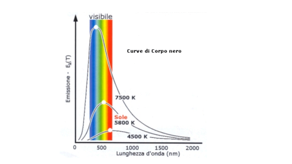

> # 1 ⋅ Le basi storiche della Meccanica quantistica 

#### NOTA SU COSE SCRITTE

- La scritta $1.05(3)$ vuol dire che il valore è compreso tra $1.02$ e $1.08$.

---

Alla fine del *XIX* secolo la Fisica aveva ottenuto traguardi impensabili in diversi campi, e pertanto si pensava che le leggi fossero tutte scoperte e mancasse solo capire le loro "applicazioni" ai vari fenomeni. Per dirla con Lord Kelvin:

> *Per me la fisica costituisce un sistema perfettamente armonioso ed essenzialmente completo. All'orizzonte scorso solmanete due piccole nubi oscure: il risultato negativo dell'esperienza di Michelson e Morley e l'insufficienza della legge di Reiliegh e Jeans se applicata alle frequenze dell'ultravioletto.*

Proprio queste due *nubi* le responsabili delle nuove scoperte: la prima diede uno spunto ad Einstein per la **relatività** e le seconde furono usate da Max Plank per porre le basi alla **rivoluzione quantistica**.

## 1.1 ⋅ La scoperta dell'elettrone

Per studiare i gas rarefatti, Geissler aveva inventato nel 1854 un dispositivo simile a quello nella figura seguente:

Il dispositivo è composto dai seguenti **elementi** (e sto scrivendo un po' di più in quanto mi è servito capire meglio come sono fatti i circuiti, la logica dietro a come funzionano e come si misurano le cose):
- Un tubo di vetro, contenente un gas rarefatto, con due **elettrodi** alle estremità
  - L'elettrodo *positivo* si chiama **anodo** e quello *negativo* si chiama **catodo**
  - Un elettrodo è un *conduttore elettrico* che si occupa di fare contatto con una parte **non metallica** del circuito
- Un **generatore** di alta tensione, che crea una *differenza di potenziale* tra i due elettrodi
  - Il generatore può essere per esempio una batteria, che usa reazioni chimiche per creare questa differenza di potenziale, o altri tipi di generatori
  - Essenzialmente va a "scaricare" da un lato delle cose e dall'altro altre. Queste due tra di loro hanno una certa differenza di potenziale, derivata dal fatto che uno dei lati è più carico di elettroni e l'altra meno, pertanto uno sarà più negativo e l'altro più positivo.
  - Questo fa sì che gli elettroni vogliano andare dall'elettrodo più negativo a quello più positivo, e per farlo devono attraversare il gas rarefatto.
  - Attraversano il circuito passando per materiali conduttivi, come il rame, che permettono agli elettroni di passare pressoché indisturbati, in quanto riescono a muoversi tra gli atomi del materiale.
  - Si possono anche aggiungere resistenze, che si occupano di rallentare il passaggio degli elettroni, e quindi di dissipare energia sotto forma di calore. Questo serve ad evitare per esempio di bruciare un componente, in quanto se passa troppa corrente, si può bruciare.
  - Un esempio di resistenza potrebbe del metallo, il quale riscaldandosi inizia a brillare, come ad esempio la resistenza di una lampadina.
  - La differenza di potenziale si misura in $Volt$, e si indica con $\Delta V$ oppure $V$. Un $Volt$ è la differenza di potenziale che si ha tra due punti quando si compie un lavoro di 1 $Joule$ per spostare 1 $Coulomb$ di carica da un punto all'altro. Si può calcolare come $V = \frac{J}{C}$, dove $J$ è il Joule e $C$ è il Columb. 1 $Volt$ coincide con $1 \frac{J}{C}$.
  - La corrente si misura in $Ampere$, e si indica con $A$. Un $Ampere$ è la quantità di carica che passa in un secondo, e si può calcolare come $A = \frac{C}{s}$, dove $C$ è la carica misurata in $Coulomb$ e $s$ è il secondo. 1 $Ampere$ coindice con $6.241509 \cdot 10^{18}$ elettroni al secondo.
  - La resistenza si misura in $Ohm$, e si indica con $\Omega$. Un $Ohm$ è la resistenza che si oppone al passaggio di 1 $Ampere$ con una differenza di potenziale di 1 $Volt$. Si può calcolare come $R = \frac{V}{A}$.

Quando si applica una forte tensione agli elettrodi, dalla superficie del catodo esce una radiazione che si propaga in linea retta verso l'anodo. Questa radiazione fu nominata **raggi catodici**.

Con alcune modifiche, Crookes creò un tubo che porta il suo nome e che fu di fondamentale importanza per lo studio di tali raggi. Col tubo di Crookes dimostrò:
1. Che i raggi catodici si propagano in linea retta
   1. Provato mettendo un ostacolo e vedendo come si proiettano i raggi
2. Che posseggono enercia cinetica e quantità di moto
   1. Mostrando che un piccolo mulino posto all'interno del tubo ruota quando i raggi lo colpiscono
3. Che sono deviati da un campo magnetico
   1. In quanto si possono deviare usando un magnete

Si tratta dunque di un fascio di particelle, cariche elettricamente e Perrin dimostrò che la loro carica era negativa. 

Thomson nel 1897 dimostrò che la carica era sempre la stessa, indipendentemente dal gas contenuto nel tubo. Inoltre andò a misurare il rapporto tra la carica e la massa che era di:

$$
\frac{q}{m}=1.76 \cdot 10^{11} \ \frac{C}{Kg}
$$

Usando la camera di Wilson, ne misurò il peso. Usando questo dato calcolò la loro carica, $-e$. I dati trovati furono quindi (in passaggi successivi, ma coerenti con quelli di Thomson):

$$
e = 1.602189(5) \cdot 10^{-19} \ C
\\ \quad \\
m_{e} = 9.10953(5) \cdot 10^{-31} \ Kg
$$

Definito inoltre l'elettronvolt, $eV$, come l'energia acquisita da una carica $e$ posta in una differenza di potenziale di 1 $Volt$:

$$
1 \ eV = 1.602189(5) \cdot 10^{-19} J
$$

L'energia a riposo di un elettrone risulta essere ($1 \ MeV=10^6 \ eV$):

$$
m_{e}c^2 = 0.511003(1) \ MeV
$$

## 1.2 ⋅ Modelli atomici di Thomson e di Rutherford

L'elettrone ha una massa di 1840 volte più piccola di quella di un atomo di idrogeno e 1839 volte quella di uno ione $H^{+}$ (detto anche *protone*) che ha massa:

$$
m_{p} = 1.67265 (1) \cdot 10^{-27} \ Kg \quad , \quad m_{p}c^2 = 938.280(3) \ MeV
$$

### 1.2.1 ⋅ Modello atomico di Thomson

Thompson propose un modello atomico in cui "palle", dalle dimensioni di circa $10^{-8} \ cm = 1 \ \mathring{A} \ (\mathring{A}rmstrong)$ di carica positiva pari al numero atomico $Z$ e massa pari al peso atomico $A$, sono immerse in una nuvola di elettroni ("come grani in di pepe in un batuffolo di cotone").

Quindi per esempio $^4_2He$ è una palla di carica $+2e$ con due elettroni incastonati, risultando in una carica nulla, dal peso di circa $4m_{p}$. (Quindi se pensavano che il protone avesse metà della sua reale massa, in quanto non si conosceva ancora l'esistenza del neutrone).

#### Dove fallì questo modello

All'interno di un esperimento del 1912 a Cambridge, Ruthenford bombardò un sottile foglio di oro con particelle $\alpha$ (cioè nuclei atomici di elio ionizzato $^4_2He^{++}$ ottenuti da sostanze radioattive, la nomenclatura coincide con il dire che si ha un atomo di Elio che ha massa atomica 4, numero atomico 2, ma ha perso 2 elettroni ed è pertanto di carica $+2e$) e notò che anziché attraversare gli atomi e procedere diritte come ci si sarebbe aspettati dal modello di Thomson essi venivano deviati in tutte le direzioni.

Si prevedeva che le particelle $\alpha$ passassero indisturbate in quanto si supponeva che la carica positiva e negativa dell'atomo d'oro era uniformemente distribuita nella nube, e pertanto come "media" essa si doveva annullare, essenzialmente.

### 1.2.2 ⋅ Modello atomico di Rutherford

Dall'esperimento del 1912, si concluse che gli atomi non avevano la struttura piena proposta da Thomson, ma erano costituiti da un nucleo centrale delle dimensioni dell'ordine di $10^{-13} \ cm=1 \ fm \ (1 \ \text{fermi})$ circondate da elettroni che gli ruotavano attorno come in un piccolo sistema planetario, governati dalle leggi dell'elettrostatica coulombiana.

In nucleo poteva essere ancora spiegato in termini di protoni ed elettroni, ma anche questa volta si consideravano i protoni come aventi massa doppia rispetto alla loro massa reale. Questa visione entrerà di nuovo in crisi con la scoperta del neutrone.

#### Dove falliva questo modello

L'atomo di Rutherford, seppur un gran passo avanti, aveva comunque grossi problemi:
- Secondo le leggi di Maxwell una carica elettrica accellerata (l'elettrone che ruota attorno al nucleo a causa dell'accellerazione centripeta) deve emettere radiazione e perciò a poco a poco perdere la sua energia cinetica finendo con lo spiraleggiare verso il nucleo
  - Con pochi calcoli si capisce che il tempe perché ciò succeda è $10^{-8} \ secondi$
  - Visto che la materia esiste, c'era un problema tra quello che prediceva la teoria e quello che veniva mostrato dalla pratica
- Dimostrare queste caratteristiche era impossibile all'interno dell'ambito della meccanica e dell'elettromagnetismo classici.

## 1.3 ⋅ La radiazione di corpo nero

Sia il **corpo nero** un concetto teorico e idealizzato della fisica il quale:
- Assorbe ogni tipo di radiazione
  - Luce, calore o in generale ogni tipo di radiazione elettromagnetica
- Emette radiazione elettromagnetica dalle sue pareti
  - In particolare emette radiazione dovuta alla temperatura del corpo

Immaginiamo di avere questo corpo nero all'interno di una scatola di una certa temperatura, aspettiamo fino a quando si va a generare l'equilibrio termico e poi si apra un piccolo foro dal quale fuoriesce un fascio di **radiazione** che assumiamo sia un campione rappresentativo di quella che è in equilibrio termico dentro la scatola.

La *curva di un corpo nero* assume la forma seguente (fa riferimento al punto 2 qua sotto):

Allora le **osservazioni sperimentali** permettono di formulare diverse osservazioni:
1. **Legge di Stefan-Boltzmann**
   1. Per un corpo ideale, la potenza totale emessa per unità di superficie è proporzionale alla quarta potenza della temperatura assoluta:
      $$
      M = \sigma T^4
      $$
      Dove $\sigma$ è la costante di Stefan-Boltzmann, che vale:
      $$
      \sigma = 5.67051(19) \cdot 10^{-8} \ \frac{W}{m^2 K^4}
      $$
      Questa legge è stata verificata sperimentalmente per temperature comprese tra $1000 \ K$ e $3000 \ K$.
   2. Per il caso generale, la forma che prende la legge è:
      $$
      M = \epsilon \sigma T^4
      $$
      Dove $\epsilon$ è l'emissività del corpo, che è un numero compreso tra 0 e 1, e che dipende dal materiale del corpo.
2. **Distribuzione di intensità in funzione della lunghezza d'onda**
   1. Fissata una temperatura, la distribuzione dell'intensità della di radiazione assume un andamento come quello nella figura sopra. Incrementando la temperatura, la forma della distribuzione rimane simile, ma le curve si innalzano e i massimi si spostano verso lunghezze d'onda minori
   2. Si può notare come il picco verte tendenzialmente attorno allo spettro visibile
3. **Legge dello spostamento di Wien**
   1. I massimi della distribuzione $I(\lambda)$ di energia in funzione della lunghezza d'onda $\lambda$ seguono una ben precisa legge di proporzionalità inversa con la termperatura:
      $$
      \lambda_{max} = \frac{2.898 \cdot 10^{-3} \ [m\cdot K]}{T \ [K]}
      $$
      Dove $\lambda_{max}$ è la lunghezza d'onda corrispondente al massimo della distribuzione.

I tentativi per giustifacere teoreticamente le leggi di Stefan-Boltzmann e di Wien e la forma di $I(\lambda)$ furono svariati.

Tra essi spicca quello di Rayleigh e Jeans che, basandosi sui principi della fisica newtoniana e dell'elettromagnetismo classico proposero una legge per l'intensità di luce $I(\lambda)$ in funzione della lunghezza d'onda $\lambda$:

$$
I(\lambda) = \frac{8 \pi k T}{\lambda^4}
$$

Questo viene scritto nelle slide usando $\propto$ quindi lo ripropongo anche qua visto che è un simbolo che non ho mai visto e mi sembra molto interessante (il suo significato è che è *proporzionale*):

$$
I(\lambda) \propto \frac{T}{\lambda^4}
$$

che è in accordo con l'esperimento a grandi $\lambda$, ma errata a piccoli $\lambda$. Sebbene il risultato sia incorretto, seguiamo il ragionamento di Rayleigh e Jeans, perché il loro approccio è sostanzialmente corretto, mancando però di una ipotesi fondamentale che non è compatibile con le leggi dell'elettromagnetismo.

Lo spiegherò seguendo questo [video](https://www.youtube.com/watch?v=rCfPQLVzus4), il quale contiene una buona spiegazione intuitiva dei vari passaggi usati per capire il problema.

Innanzitutto immaginiamo di avere un onda che si propaga in 1d, quindi che va per esempio da destra a sinitra. Se immaginiamo un'onda che viene nella direzione opposta, che è perfettamente simetrica, allora queste onde si andranno a **sommare insieme**:
- Descriviamo un onda come $y_R(x,t) = A \sin (kx - \omega t)$
  - $y_R(x,t)$ rappresenta lo spostamente dell'onda in un punto $x$ e in un istante $t$.
  - $A$ è l'ambiezza dell'onda, ovvero quanto è "alta": è il suo massimo spostamento dall'equilibrio.
  - $sin$ è la funzione del seno, una funzione matematica periodica che descrive bene il comportamento ciclico delle onde.
  - $k$ è il numero d'onda, che è proporzionale alla frequenza dell'onda e inversamente proporzionale alla lunghezza d'onda. Si può calcolare come $k = \frac{2 \pi}{\lambda}$, dove $\lambda$ è la lunghezza d'onda.
    - Ci dice quante onde "ci stanno" in una certa lunghezza. Se $k$ è alto, allora ci stanno molte onde in una certa lunghezza, e quindi la lunghezza d'onda è piccola.
  - $x$ è la posizione nello spazio lungo la direzione di propagazione dell'onda
  - $\omega$ è la velocità angolare, che descrive quanto velocemente l'onda oscilla nel tempo. Si può calcolare come $\omega = 2 \pi f$, dove $f$ è la frequenza dell'onda, ovvero $f = \frac{c}{\lambda}$
  - $t$ è il tempo

> Possiamo immaginare di avere un onda che ha:
> - $A = 1 \ \text{metro}$ (l'onda si alza e si abbassa di 1 metro)
> - $f = 2 \ \text{Hz}$  (Due cicli al secondo)
> - $\lambda = 3 \ \text{metri}$ (Ogni onda è lunga 3 metri)
> 
> Allora, usando le relazioni, otteniamo: $\omega = 2\pi f = 4 \pi$, $k = \frac{2 \pi}{\lambda} = \frac{2 \pi}{3}$.
>
> Sostituiamo questi valori dentro l'equazione dell'onda e otteniamo:
>
> $$
> y_R(x,t) = \sin \left( \frac{2 \pi}{3} x - 4 \pi t \right)
> $$
>
> Questo significa che a $t=0$ (l'inizio dell'osservazione), l'onda ha un valore di $y_R(x,0) = \sin \left( \frac{2 \pi}{3} x \right)$. Man mano che il tempo passa, la fase dell'onda cambia, facendo muove l'onda attraverso lo spazio.

Ora, se noi supponiamo di avere 2 onde, che vanno l'una contro l'altra. Questo vorrà dire che una va avanti con il passare del tempo mentre l'altra andrà indietro e pertanto dove prima abbiamo usato $-$ ora dobbiamo usare $+$ nella formula, quindi abbiamo:

$$
y(x,t) = y_R(x,t) + y_L(x,t) =
\\ \ \\
= A \sin (kx - \omega t) + A \sin (kx + \omega t)
$$

Che è l'onda risultante da queste due che si muovono. Possiamo usare le formule della somma del seno e del coseno per ottenere:

$$
y(x,t) = 2A \sin (kx) \cos (\omega t)
$$

E se lo plottiamo, notiamo che il risultato sarà un'onda stazionaria, ovvero un'onda che non si muove, ma che ha dei picchi che oscillano su e giù.

Ora, dobbiamo capire, in che casi si verificano questi picchi? Ovvero, **quali sono le frequenze che generano le onde stazionarie?**

Sia dato una linea di lunghezza $L$, le onde devono essere necessariamente:

- $y(0,t) = y(L,t) = 0$
  - In quanto se non fosse così, allora l'onda non sarebbe stazionaria, ma si muoverebbe

E quindi le possibili lunghezze d'onda sono date dalla formula:

$$
\lambda_n = \frac{2L}{n} \quad , \quad n\in \mathbb{N}
$$

Quindi, per esempio, in un cubo di lato $L = 40$, abbiamo le onde di frequenza: $80,40,26.\overline{6},20,...  \ Hz$ che formeranno onde stazionarie.

#### Capiamo cosa è un black body meglio descrivendo come esso deve essere interpretato:

Immaginiamo di avere il black body, il quale negli esperimenti prendeva la forma di un Jeans Cube era un cubo di metallo con un piccolo foro:
- Se della radiazione entra dal buco, essa rimbalzerà sui suoi muri fino a quando viene assorbita. Questo in quanto il foto è molto piccolo, pertanto dal punto dal nostro punto di vista il foro è un black body, il quale assorbe
- Possiamo però anche considerare il caso inverso, nel quale le mura del cubo sono riscaldate fino a una certa temperatura. Visto che una piccola parte delle radiaizoni fuoriuscirà dal buco, allora il buco diventa una sorgente di radiazione
- Quindi il foro è sia un perfetto assorbitore che un perfetto emettitore di radiazione, pertanto simula il comportamento di un black body

#### Quali erano le leggi della fisica conosciute e usate al tempo per la loro dimostrazione?

##### Elettromagnetismo

In particolare le formule della radiazione elettromagnetica, la quale diceva che la luce consisteva di una onda elettromagnetica che viaggiava alla velocità della luce nel vuoto.

##### Leggi statistiche della termodinamica

Questo ci diceva che la temperatura di un oggetto è la media delle energie cinetiche delle sue particelle.

#### Quali erano gli obbiettivi?

L'obbiettivo era quello di trovare $\rho (f)$, ovvero la densità di energia, che è l'energia per unità di volume, in funzione della frequenza $f$. Questa cambia in base alla temperatura $T$.

Volevamo trovarla in uno stretto intervallo, ovvero $f + df$. 

A partire da questo, la radiazione spettrale è facile da calcolare, in quanto è proporzionale, e la proporzione è data da:

$$
R(f) = \frac{c}{4\pi} \rho (f)
$$

#### Quali erano gli step?

1. Contare il numero di onde che possono "stare" nel cubo
2. Calcolare l'energia media di queste onde
3. Calcolare la densità di energià $\rho(f)$ nel range di frequenze tra $f$ e $f+df$