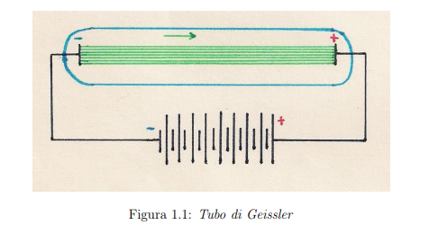

# $1 \cdot$ Le basi storiche della Meccanica quantistica 

Alla fine del *XIX* secolo la Fisica aveva ottenuto traguardi impensabili in diversi campi, e pertanto si pensava che le leggi fossero tutte scoperte e mancasse solo capire le loro "applicazioni" ai vari fenomeni. Per dirla con Lord Kelvin:

> *Per me la fisica costituisce un sistema perfettamente armonioso ed essenzialmente completo. All'orizzonte scorso solmanete due piccole nubi oscure: il risultato negativo dell'esperienza di Michelson e Morley e l'insufficienza della legge di Reiliegh e Jeans se applicata alle frequenze dell'ultravioletto.*

Proprio queste due *nubi* le responsabili delle nuove scoperte: la prima diede uno spunto ad Einstein per la **relatività** e le seconde furono usate da Max Plank per porre le basi alla **rivoluzione quantistica**.

## $1.1 \cdot$ La scoperta dell'elettrone

Per studiare i gas rarefatti, Geissler aveva inventato nel 1854 un dispositivo simile a quello nella figura seguente:

Il dispositivo è composto dai seguenti **elementi** (e sto scrivendo un po' di più in quanto mi è servito capire meglio come sono fatti i circuiti, la logica dietro a come funzionano e come si misurano le cose):
- Un tubo di vetro, contenente un gas rarefatto, con due **elettrodi** alle estremità
  - L'elettrodo *positivo* si chiama **anodo** e quello *negativo* si chiama **catodo**
  - Un elettrodo è un *conduttore elettrico* che si occupa di fare contatto con una parte **non metallica** del circuito
- Un **generatore** di alta tensione, che crea una *differenza di potenziale* tra i due elettrodi
  - Il generatore può essere per esempio una batteria, che usa reazioni chimiche per creare questa differenza di potenziale, o altri tipi di generatori
  - Essenzialmente va a "scaricare" da un lato delle cose e dall'altro altre. Queste due tra di loro hanno una certa differenza di potenziale, derivata dal fatto che uno dei lati è più carico di elettroni e l'altra meno, pertanto uno sarà più negativo e l'altro più positivo.
  - Questo fa sì che gli elettroni vogliano andare dall'elettrodo più negativo a quello più positivo, e per farlo devono attraversare il gas rarefatto.
  - Attraversano il circuito passando per materiali conduttivi, come il rame, che permettono agli elettroni di passare pressoché indisturbati, in quanto riescono a muoversi tra gli atomi del materiale.
  - Si possono anche aggiungere resistenze, che si occupano di rallentare il passaggio degli elettroni, e quindi di dissipare energia sotto forma di calore. Questo serve ad evitare per esempio di bruciare un componente, in quanto se passa troppa corrente, si può bruciare.
  - Un esempio di resistenza potrebbe del metallo, il quale riscaldandosi inizia a brillare, come ad esempio la resistenza di una lampadina.
  - La differenza di potenziale si misura in $Volt$, e si indica con $\Delta V$ oppure $V$. Un $Volt$ è la differenza di potenziale che si ha tra due punti quando si compie un lavoro di 1 $Joule$ per spostare 1 $Coulomb$ di carica da un punto all'altro. Si può calcolare come $V = \frac{J}{C}$, dove $J$ è il Joule e $C$ è il Columb. 1 $Volt$ coincide con $1 \frac{J}{C}$.
  - La corrente si misura in $Ampere$, e si indica con $A$. Un $Ampere$ è la quantità di carica che passa in un secondo, e si può calcolare come $A = \frac{C}{s}$, dove $C$ è la carica misurata in $Coulomb$ e $s$ è il secondo. 1 $Ampere$ coindice con $6.241509 \cdot 10^{18}$ elettroni al secondo.
  - La resistenza si misura in $Ohm$, e si indica con $\Omega$. Un $Ohm$ è la resistenza che si oppone al passaggio di 1 $Ampere$ con una differenza di potenziale di 1 $Volt$. Si può calcolare come $R = \frac{V}{A}$.

Quando si applica una forte tensione agli elettrodi, dalla superficie del catodo esce una radiazione che si propaga in linea retta verso l'anodo. Questa radiazione fu nominata **raggi catodici**.

Con alcune modifiche, Crookes creò un tubo che porta il suo nome e che fu di fondamentale importanza per lo studio di tali raggi. Col tubo di Crookes dimostrò:
1. Che i raggi catodici si propagano in linea retta
   1. Provato mettendo un ostacolo e vedendo come si proiettano i raggi
2. Che posseggono enercia cinetica e quantità di moto
   1. Mostrando che un piccolo mulino posto all'interno del tubo ruota quando i raggi lo colpiscono
3. Che sono deviati da un campo magnetico
   1. In quanto si possono deviare usando un magnete

Si tratta dunque di un fascio di particelle, cariche elettricamente e Perrin dimostrò che la loro carica era negativa. 

Thomson nel 1897 dimostrò che la carica era sempre la stessa, indipendentemente dal gas contenuto nel tubo. Inoltre andò a misurare il rapporto tra la carica e la massa che era di:

$$
\frac{q}{m}=1.76 \cdot 10^{11} \ \frac{C}{Kg}
$$

Usando la camera di Wilson, ne misurò il peso. Usando questo dato calcolò la loro carica, $-e$. I dati trovati furono quindi (in passaggi successivi, ma coerenti con quelli di Thomson):

$$
e = 1.602189(5) \cdot 10^{-19} \ C
\\ \quad \\
m_{e} = 9.10953(5) \cdot 10^{-31} \ Kg
$$

Definito inoltre l'elettronvolt, $eV$, come l'energia acquisita da una carica $e$ posta in una differenza di potenziale di 1 $Volt$:

$$
1 \ eV = 1.602189(5) \cdot 10^{-19} J
$$

L'energia a riposo di un elettrone risulta essere ($1 \ MeV=10^6 \ eV$):

$$
m_{e}c^2 = 0.511003(1) \ MeV
$$

## $1.2 \cdot$ Modelli atomici di Thomson e di Rutherford