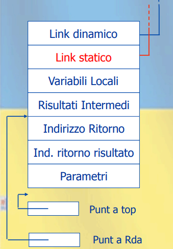
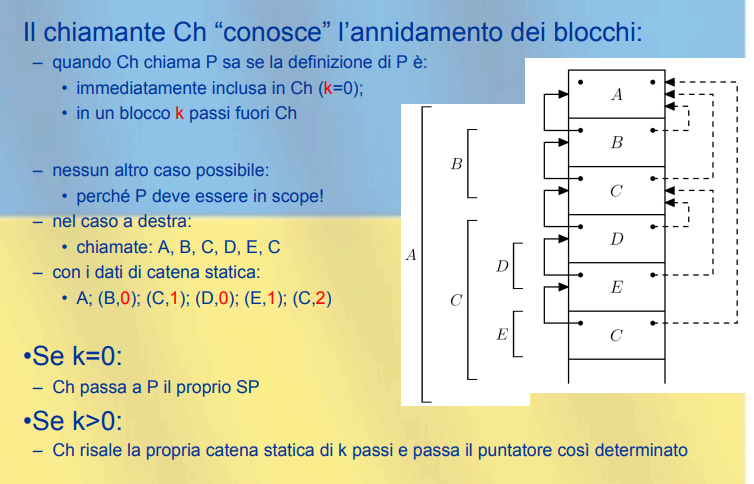

[//]: # (Date: 2023-03-07 13:00)
[//]: # (Stili di riferimento per il markdown)
<link rel="stylesheet" href="./res/style.css">

> # Gestione della memoria

---

> ## Introduzione

<br/>

La vita di un oggetto corrisponde in in generale con tre meccanismi di allocazione in memoria:

- **Statica**: Memoria allocata a tempo di compilazione (es. variabili globali)

- **Dinamica**: Memoria allocata a tempo di esecuzione:
  - *Pila* (Stack): Oggetti allocati con politica LIFO
  - *Heap*: Oggetti allocati e deallocati in qualsiasi momento (puntatori)

---
> ## Statica

Un oggetto ha un indirizzo assoluto che è mantenuto per tutta l'esecuzione del programma.

Solitamente sono allocati staticamente:
- Variabili globali
- Variabili locali sottoprogrammi (senza ricorsione)
- Tabelle usate dal supporto a run-time (per type cheking, garbage collection, etc.)

Spesso usate zone prottete di memoria.

### Ricorsione non permessa

Per esempio, in FORTRAN, non è possibile definire una funzione ricorsiva con una subroutine di questo tipo:

```fortran
SUBROUTINE ERROR(N)
    IF (N.LE.1) RETURN
    CALL ERROR(N-1)
    PRINT N
    END
...
CALL ERROR(10)
```

Se supponessimo che fosse legale, quello che succederebbe è che la chiamata ricorsiva a `ERROR` cambierebbe l'indirizzo di ritorno, quindi non avremmo come ritornare il valore di `N` alla chiamata precedente.


> ## Dinamica

### Pila

Con ricorsione l'allocazione statica non è sufficiente. Questo perchè a run time possono esistere più istanze della stessa variabile locale di una procedura.

Ogni istanza di un sottoprogramma a run-time ha una porzione di memoria detta *record di attivazione* (o *frame*) contenente le iformazioni relative alla specifica istanza (tra cui anche l'indirizzo di ritorno).

La *pila* (LIFO) è la struttura dati naturale per gestire i record di attivazione perché le chiamate di procedura anche ricorsiva ed i blocchi sono annidati uno dentro l'altro.

Anche in un linguaggio senza ricorsione può essere utile usare la pila per memorizzare le variabili locali per risparmiare memoria.

#### Recordi di attivazione per blocchi anonimi

Il record di attivazione (**RdA**) è formato da:

- Puntatore di Catena Dinamica
- Variabili locali
- Risultati intermedi

#### Allocazione dinamica con pila

La gestione della pila è compiuta mediante:
- **Sequenza di chiamata** (il codice eseguito dal chiamate immediatamente prima della chiamata)
- **prologo** (codice eseguito all'inizio del blocco)
- **epilogo** (codice eseguito alla fine del blocco)
- **sequenza di ritorno** (il codice eseguito dal chiamante immediatamente dopo la chiamata)

Indirizzo di un RdA non è noto a compile-time.

Il puntatore RdA (o SP) punta al RdA del blocco attivo in questo momento.

Le info del contenuto in un RdA sono accessibili per offset rispetto allo SP, sommando l'offset dell'informazione con SP.

L'offset determinabile staticamente dal compilatore, mentre la somma viene eseguita con unica istruzione macchina *load* o *store*.

#### Recordi di attivazione per blocchi in-line

```c
[    Link dinamico    ]  // <-+
[   Variabili locali  ]  //   |
[ Risultati intermedi ]  //   |
                         //   |
                         //   |
[    Link dinamico    ]  // --+  <-
[   Variabili locali  ]  //        |
[ Risultati Intermedi ]  //...e così via
```

Operazioni:
- **Link dinamico** (o *control* link)
  - Puntatore al precedente record sullo stack
- **Ingresso nel blocco**: *Push*
  - Link dinamico del nuovo RdA := SP
  - SP aggiorna a nuovo RdA
- **Uscita dal blocco**: *Pop*
  - Elimina RdA puntatore da SP
  - SP := Link dinamico del RdA tolto dallo stack

*NOTA: SP := Stack Pointer*

Esempio:
```c
{
    int x = 0;
    int y = x+1;
    {
        int z = (x+y) * (x-y);
    }
}

// Push record con spazio per x,y
// Set dei valori x e y
//     Push record blocco interno
//     Set dei valori z
//     Pop record blocco interno
// Pop record blocco esterno
```

**In realtà** molte di queste cose vengono ottimizzate dal compilatore, sopratutto per i blocchi anonimi. 

#### Record di attivazione per procedure

Formato nel seguente modo:

```c
[  * Catena dinamica  ]
[   * Catena Statica  ]
[   Indirizzo di rit. ]
[ Indirizzo risultato ] // Dove mettere il risultato di questa procedura
[      Parametri      ]
[   Variabili locali  ]
[ Risultati intermedi ] // Tipo chiamare fact(n-1) in una funzione
```


Perchè avere sia un puntatore al top della pila e un puntatore al RdA precedente? Perchè *non tutti gli RdA hanno la stessa dimensione*

Quindi, vi sono:
- **Puntatore al top della cima**: questo punta alla fine dell'ultimo RdA allocato
- **Puntatore a RdA**: questo punta alla posizione per cui l'offset dei locali è sempre determinabile dal compilatore (eccetto per i locali di dimensione variabile) - non ce ne preoccuperemo più dopo questa definizione iniziale


#### Esempio

```c
int fact(int n) {
    if (n <= 1) return 1;
    return n * fact(n-1);
}

// Simulazione dei blocchi con fact(2)

-> fact(2)             //
[ Link dinamico      ] //
[ fact(n-1) |        ] // <-+
[ * nel Main         ] //   |
[ * risultato        ] //   |
[ n         |  2     ] //   |
                       //   |
-> fact(2)             //   |
[ Link dinamico      ] //   |
[ fact(n-1) |        ] //   |
[ * a nel fact       ] // --+
[ * risultato        ] //
[ n         |  1     ] //


// E poi si risolve in


-> fact(2)             //
[ Link dinamico      ] //
[ fact(n-1) |  1     ] // <-+
[ * nel Main         ] //   |
[ * risultato        ] //   |
[ n         |  2     ] //   |
                       //   |
-> fact(2)             //   |
[ Link dinamico      ] //   |
[ fact(n-1) |  1     ] //   |
[ * a nel fact       ] // --+
[ * risultato        ] //
[ n         |  1     ] //
```


### Gestione della pila

#### Ingresso nel blocco

Sequenza di chiamata e prologo si dividono i seguenti compiti:
- Modifica del contenitore programma
- Allocazione RdA sulla pila (modificare puntatore a top)
- Modifica del puntatore al RdA
- Passaggio de parametri
- Salvataggio dei registri
- Eventuali inizializzazioni
- Trasferimento del controllo

#### Uscita dal blocco

Seuqenza di ritorno ed epilogo si dividono i seguenti compiti:
- Restituzione dei valori dal chiamato al chiamante, oppure il valore calcolato dalla funzione
- Ripristino dei registri
  - In particolare deve essere ripristinato il vecchio valore del puntatore al RdA
- Eventuale finalizzazione
- Deallocaizone dello spazio sulla pila
- Rispristino del valore del contatore programma (PC - program counter)

---

> ## Heap

### Blocchi di memoria fissa

Heap è suddiviso in blocchi di dimensione fissa, di solito piuttosto limitata, cioè qualche parola.

In origine, tutti i blocchi sono collegati nella lista libera e si ha un unico grande blocco.

Operazioni sull'heap sono:
- *Allocazione* di uno o più blocchi contigui.
  - Si determina un blocco libero della dimensione opportuna
- *Deallocazione* che restituisce alla lista libera lo spazio

Ci sono dei **problemi**:
- *Efficienza*
- *Spreco di memoria*:
  - Frammentazione interna
    - Lo spazio richiesto è X
    - Viene allocato un blocco di dimensione Y > X
    - Lo spazio Y - X è sprecato
  - Frammentazione esterna
    - Ci sarebbe lo spazio necessario ma è inusabile perché suddiviso in "pezzi" troppo piccoli

#### Gestione della lista libera

Inizialmente come abbiamo detto c'è un solo blocco, della dimensione dell'heap.

Ad ogni richiesta di allocazione cerco un blocco di dimensione opportuna usando uno di due metodi:
- **First fit**: cerco il primo blocco libero di dimensione sufficiente
- **Best fit**: cerca il blocco libero di dimensione minima ma maggiore o uguale a quella richiesta
- *Quale scegliere?*
  - **First fit**: semplice, veloce, ma spesso non ottimale
  - **Best fit**: più lento, ma migliore

Se il blocco scelto è molto più grande di quello che serve, viene diviso in due e la parte inutilizzata è aggiunta alla LL.

Quando un blocco è de-allocato, viene restituito alla LL (se un blocco adiacente è libero, i due blocchi sono "fusi" in un unico blocco)

*Con un unica LL* l'allocazione è lineare nel numero di blocchi, per questo si usano più LL.

#### Liste libere multiple

Per blocchi di dimensione diversa.

La riparazione dei blocchi fra le varie liste può essere di due tipi:
- *Statica*
- *dinamica*
  - **Buddy system**
    - K liste, la lista K ha blocchi di dimensione $2^k$
      - Se richiesta allocazione per blocco di dimensione $2^k$ e tale dimensione non è disponibile, blocco di dimensione $2^{k+1}$ viene diviso in due e uno dei due blocchi viene messo nella lista $k$
      - Se un blocco di $2^k$ è deallocato è riunito alla sua altra metà (*buddy*) disponibile
  - **Fibonacci system**
    - Simile, ma si usano numeri di Fibonacci invece di potenze di 2 (crescono più lentamente)

---

> ## Implementazione delle regole di scope
> ### Scope Statico

---

### Catena statica

```C
{
  int x = 10;
  void foo () { x++; }
  void fie () { 
    int x = 0;
    foo();
  }
  fie();
  foo();
}
```

Il codice di `foo` deve accedere sempre alla stessa variabile `x` (la prima).

Tale `x` è memorizzato in un certo RdA (in questo caso quella del main)

In cima alla pila abbiamo il RdA di `foo` (perché `foo` è in esecuzione)

Abbiamo quindi due casi, in questo caso:
- Quello in cui `foo` viene chiamato da `fie` (in questo caso devo fare un salto in piu nella catena statica per arrivare al main)
- Quando `foo` viene chiamato dal main (in questo caso non devo fare nessun salto in piu nella catena statica)

*Record di attivazione per scoping statico*: 



- **Link dinamico**:
  - puntatore all'RdA precedente sulla pila (RdA del chiamante)
- **Link statico**:
  - Puntatore all'RdA del blocco che contiene immediatamente il testo del blocco in esecuzione


*Osserva*:
- Link dinamico dipende dalla sequenza di esecuzione del programma
- Link statico dipende dall'annidamento statico (nel testo) delle dichiarazioni delle procedure

*Esempio di catena statica*:



Come possiamo vedere, a sinistra abbiamo i link dinamici mentre a destra abbiamo i link statici.

Il link del chiamato statico è determinato dal chiamante. Il chiamante ha infatti a disposizione l'informazione sull'annidamento statico dei blocchi (determinato dal compilatore).

Il numero di fianco allo scope, per esempio (C;2), indica che si aggiunge C e la sua catena statica viene impostata facendo 2 passaggi a partire dal chiamante (ovvero dalla E vado a fare due passaggi di catena statica in alto, arrivando quindi ad A).

*Ripartizione dei compiti della catena statica:*
- *Compilatore*
  - Associa l'informazione *k* ad ogni chiamata
  - Associa ad ogni nome un indice *h*:
    - h $=$ 0 : nome locale
    - h $\neq$ 0 : nome non locale definito h blocchi sopra
- *Sequenza chiamata/prologo*
  - Risale la catena statica di k passi
  - Inizializza il puntatore di catena statica
- *Costi*:
  - Per ogni chiamata
    - k passi di catena statica
  - Ad ogni accesso ad una variabile non locale
    - h passi di catena statica in più rispetto all'accesso ad un locale

---

### Display

Possiamo andare a ridurre il costo "h" ad una costante usando la tecnica del *display*:
- La catena statica viene rappresentata mediante un array:
  - i-esimo elemento dell'array è un puntatore all'RdA del sottoprogramma di livello di annidamento i, attivo per ultimo
- Dunque:
  - **Display[*1*]** = RdA di una proc P di top level
  - **Display[*2*]** = RdA di una proc Q dichiarata in P
  - ...
  - **Display[*i*]** = RdA della proc attiva in questo momento (dichiarata dentro quella che si trova in **Display[i-1]**)

Se il sottoprogramma corrente è annidato a livello i, un oggetto che è in uno scope esterno di h livelli può essere trovare guardando il puntatore a RdA nel *display* alla posizione **j = i - h**

*Esempio*:


Se abbiamo il processo corrente annidato a livello i, lo scope esterno di livello h si ottiene facendo **Display[*i - h*]**.

Con Display in memoria un oggetto è trovato con due accessi, uno per il display e uno per l'oggetto.

*Ripartizione dei compiti del Display:*

E' il chaiamato a maneggiare il display
- Quando il chiamante chiama P a livello di annidamento *j*, P salva il valore di **Display[*j*]** nel proprio RdA e vi mette una copia nel proprio (nuovo) puntatore a RdA.

Funziona. Ragioniamo con i soliti **due casi**:
  - P dichiarata immediatamente in Ch (*k = 0*)
    - Ch e P condividono Display fino al livello corrente, che è j-1. Mettendo il nuovo puntatore a RdA in Display[j] il livello corrente viene esteso di 1.
    - Il salvataggio potrebbe essere inutile, ma il chiamato non ha modo di saperlo: Ch potrebbe essere chaiamto da Q, a sua volta a livello > j.
  - P dichiarato in un blocco *k* passi fuori Ch
    - Ch e P condividono Display fino a livello j-1. Display[j] deve essere modificato dopo il salvataggio.

---

### Cosa si sceglie?

Di solito è raro che ci siano annidamento più profondi di 3 livello, quindi la lunghezza massima della catena statica è considerabile essere 3.

Attraverso delle tecniche di ottimizzazione si possono migliorare gli accessi alle catene usate più frequentemente, tenendo nei registri i puntatori.

Il display è più costoso da mantenere della catena statica nella sequenza di chaiamata.

**Conclusione**: il display è *poco usato* nelle implementazioni moderne.

---

> ## Implementazione delle regole di scope
> ### Scope dinamico

---

Con lo scope dinamico, l'associazione nomi-oggetti denotabili dipende:
- Dal flusso del controllo a run-time
- Dall'ordine con cui i sottoprogrammi sono chiamati

La regola generale è semplice: 
- L'associazione corrente per un nome è quella determinata per ultima nell'esecuzione (non ancora distrutta)

Il primo modo che può venire in mente per gestirla è semplicemente risalire la pila alla ricerca dell'ultimo RdA che contiene il nome. Questo però è molto costoso. Vediamo altre due impelmentazioni:

### A-List

L'implementazione più semplice è l'*A-List* (Access list): abbiamo una lista apposita che manipoliamo come una pila, dove aggiungiamo ogni volta che viene chiamato un sottoprogramma e rimuoviamo ogni volta che viene ritornato.

*Costi:*
- Occupazione di memoria:
  - Nomi presenti esplicitamente
- Costo di gestione
  - Ingresso/uscita da blocco, quindi inserzione rimozione di blocchi sulla pila
- Tempo di accesso
  - Sempre lineare nella profondità dalla A-list

### CRT

L'implementazione più usata è la *CRT* (Current Record Table): abbiamo una tabella che contiene tutti i nomi distinti del programma. Se i nomi sono noti staticmente, si pu ò accedere all'elemento della tabella costante, altrimenti con un hash (quasi costante).

Ad ognuno dei nomi è associata una lista delle associazioni di quel nome:
- La più recente è la prima
- Le altre (disattivate) seguono

*Costi*:
- Occupazione di memoria (meno delle A-list)
  - Se noti staticamente, nomi non necessari
  - In ogni caso, nome memorizzato solo una volta
- Costo di gestione
  - Ingresso/uscita da blocco, manipolazione di tutte le liste dei nomi presenti nel blocco
- Tempo di accesso
  - Costante (due accessi indiretti)