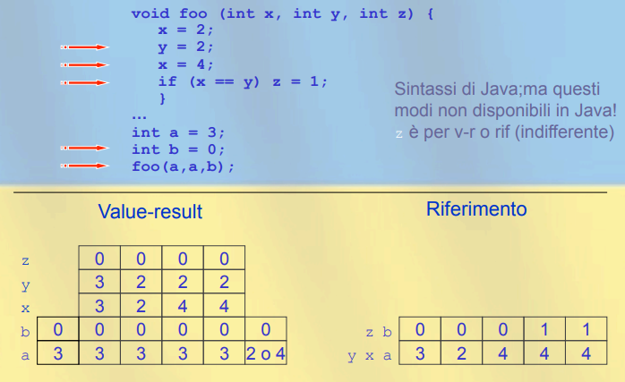
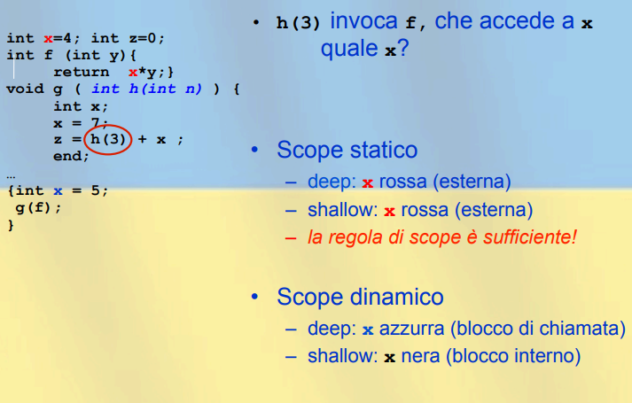
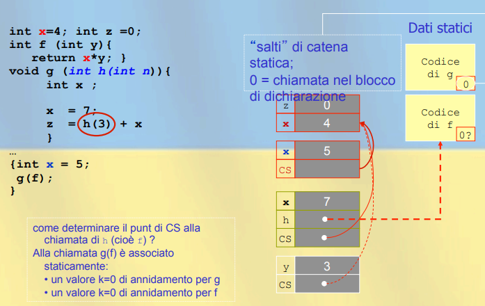
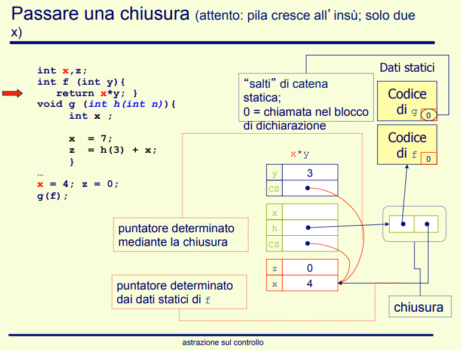
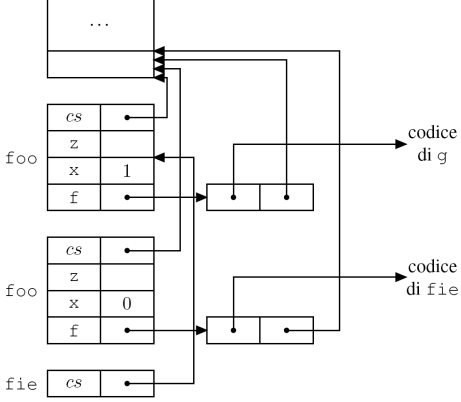
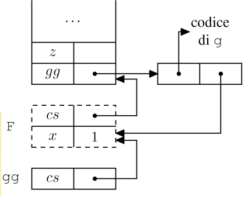

[//]: # (Date: 2023-03-29 19:00)
[//]: # (Stili di riferimento per il markdown)
<link rel="stylesheet" href="./res/style.css">

> ## Sottoprogrammi ed eccezzioni
> # Astrazioni sul controllo

---

> ## Astrazione

###  Di cosa si tratta

L'obbiettivo è identificare le proprietà importanti di cosa si vuole descriverere e "nascondere" le altre.

Cosa è importante dipende ovviamente dallo scopo del progetto.

Più il linguaggio è *ad alto livello* più esso ha astrazione, ovvero usiamo per esempio il while piuttosto che il goto, oppure le classi, oppure tipi di dati strutturati, etc.

### Tipi di astrazione

#### Astrazione del controllo

Fornisce astrazione funzionale al progetto, ovvero:
- Ogni componente fornisce servizi al suo ambiente
- La sua astrazione descrive il comportamento esterno
- Nasconde i dettagli interni necessari a produrlo

Essenzialmente noi quindi definiamo un sottoprogramma (funzione, blocco, etc.) P, ovvero ne descriviamo come si usa.

Poi, quando si usa, P comunica usando i parametri e l'ambiente globale (anche se quest'ultimo può distruggere l'astrazione).

Ha una interazione limitata al comportamento esterno.

#### Astrazioni sui dati

Partiamo da questa definizione:
- *Tipo di dato* = **valori e operazioni**

Esempio:
- `integer` = `[-maxint...maxint]` e `+,-,*,/,%`
  - Le operazioni sono il solo modo di manipolare un integer
  - Per esempio potrebbero non essere possibili shift su valori integer

Quindi, astrarre i dati significa che la *rappresentazione* dei *dati* e delle *operazioni* è **inaccessibili** all'utente, perchè è protetta da una capsula che la "isola".

Questo tipo di astrazione non è possibile nei linguaggi più vecchi, in quanto sono relativamente low level e si può comunque interagire con la memoria.

#### Parametri formali e attuali

Definiamo la terminologia dei tipi di parametri:
- `int f (int n) {...}`
  - `n` è un **parametro formale**
  - Quindi sono quelli che appaiono nella *definizione*/*dichiarazione* del sottoprogramma
- `f(5)`
  - `5` è un **parametro attuale**
  - Quindi sono quelli che appaiono nella *chiamata*/*uso* del sottoprogramma

---

> ## Comunicazione tra funzione e chiamante

---

### Tipologie

Abbiamo *3 tipi di flusso di informazione* tra chiamante e chiamato (che chiameremo rispettivamente main e proc) relativo ai parametri, e sono:
- $main \rightarrow proc$
  - Per esempio chiamare un funzione void che stampa il parametro messo in input
- $main \leftarrow main$
  - Per esempio chiamare una funzione che modifica il valore del parametro passato senza eseguirci operazioni usandolo
- $main \leftrightarrow proc$
  - Per esempio si passa una funzione per riferimento, si usa per fare calcoli su di essa e poi si ritorna, modificandola così anche nel main.

### Passaggi di parametri

#### Passaggio per valore

Descrizione:
- Il valore dell'attuale è assegnato al formale, che si comporta come una variabile locale.
- Pragmatica $main \rightarrow proc$
- Attuale qualsiasi, modifiche al formale non passano all'attuale.

*Essenzialmente* si passa un valore come parametro attuale che viene copiato all'interno di quello locale, rendendo quindi il parametro attuale inaccessibile da parte del chiamato.

```C
void f(int n) {
  n = 5;
}

...

int y = 3;
f(y);
// Qui y vale ancora 3
```

Metodo di funzionamento:
1. Il formale `n` è una variabile locale (sulla pila)
2. Alla chiamata, l'attuale `y` viene valutato ed il valore è assegnato al formale `n`
3. Nessun legame tra `n` e `y`
4. Al ritorno da `f`, `n` viene distrutto (tolto dalla pila)
5. Non è possibile trasmettere informazioni da `f` a `main` tramite parametro
6. Costo per dati grandi, in quanto si tratta di un'operazione di **copia**

Per linguaggi come C è l'unico modo.

#### Passaggio per riferimento

Descrizione:
- Viene passato un riferimento (indirizzo) all'attuale; i riferimenti al formale sono riferimenti all'attuale (*aliasing*)
- Pragmatica $main \leftrightarrow proc$
- Attuale variabile, modifiche al formale passano all'attuale.

*Essenzialmente* si passa il riferimento alla variabile, e tutte le modifiche che avvengono dentro la funzione vengono riflesse all'esterno di essa.

```C
void f(reference int n) {
  n = 5;
}

...

int y = 3;
f(y);
// Qui y vale 5
```

Metodo di funzionamento:
1. Viene passato un riferimento (indirizzo; puntatore)
2. Il formale `n` è un *alias* di `y`
3. L'attuale deve essere un L-value ("una variabile", se fosse tipo il numero 5, allora modificarlo mi potrebbe far incorrere in errori)
4. Al ritorno da `f`, viene distrutto il legame che c'è tra `n` e l'indirizzo di `y`
5. Trasmissione bidirezionale tra chiamante e chiamato
6. Efficiente nel passaggio, ma indirezione nel corpo

Viene usato da Pascal (var), oppure simulato in C passando un puntatore, oppure in Java per i tipi "classe".

#### Passaggio per costante

Ovvero si passa un valore e viene garantita la pragmatica $main \rightarrow proc$ a spese dell'efficienza. (Dati grandi sono copiati anche quando non sono modificati).

Equivale allo scrivere `const` davanti al tipo del parametro formale, o anche altri modi per alcuni linguaggi. Per esempio in Java si usa `final`.

Il **controllo** avviene da parte del compilatore, che controlla che non ci siano assegnazioni o passaggi per riferimento ad altre procedure.

L'*implementazione* è anch'essa a discrezione del compilatore, che idealmente usa il passaggio per valore per piccoli parametri e quello per riferimento per grandi parametri.

#### Passaggio per risultato

Descrizione:
- Il risultato è passato usando la parola chiave `result`
- Vi è una pragmatica $main \leftarrow proc$

```C
void foo(result int n) {
  n = 8;
}

...

int y = 3;
foo(y);
// Qui y vale 8
```

Metodo di funzionamento:
1. Il formale `n` è una variabile locale (sulla pila)
2. Al ritorno da `f`, il valore di `n` viene assegnato all'attuale `y`
3. Nessun legame tra `n` e `y`
4. Al ritorno da `f`, `n` viene distrutto (tolto dalla pila)
5. Non è possibile trasmettere informazioni dal chiamate a `foo` tramite parametro
6. Costoso per grandi dati, in quanto vi è una copia

Esiste in Algol-W e Ada, però è relativamente poco usato.

#### Passaggio per valore/risultato

Descrizione:
- Mischia insieme il passaggio per valore e il passaggio per risultato
- Vi è una pragmatica $main \leftrightarrow proc$

```C
void foo(value-result int n) {
  n = 8;
}

...

int y = 3;
foo(y);
// Qui y vale 8
```

Metodo di funzionamento:
1. Il formale `n` è a tutti gli effetti una variabile locale (sulla pila)
2. Alla chiamata, il valore dell'attuale è assegnato al formale
3. Al ritorno, il valore del formale è assegnato all'attuale
4. Nessun legame tra `n` e `y`
5. Al ritorno di `foo`, `n` viene distrutto (tolto dalla pila)
6. Costoso per dati grandi, in quanto vi è una copia

**Differente** dall'usare il passaggio per riferimento:



#### Passaggio per nome

Descrizione:
- Si vede una chiamata come *macro espansione*
  - La semantica di una chiamata consiste nell'esecuzione del corpo come se fosse testualmente presente
  - I parametri sono gestiti nello stesso modo: la semantica consiste nell'esecuzione del corpo dopo che i parametri attuali sono sintatticamente sostituiti al posto dei formali
  - Semanticamente corretta
- Regole di copia:
  - Una *chiamata* alla produra P è la stessa cosa che eseguire il *corpo* di P dopo aver *sostituito* i parametri attuali al posto dei formali.

*ESEMPI:*

```C
int y;
void foo (name int x) {
  x = x+1;
}
...
y = 1;

foo(y);

// Ovvero si espande foo e diventa

[ y = y+1; ]
```

In questo caso funziona come il passaggio pe riferimento.

```C
int y;
void foo (name int x) {
  int y;
  x = x+1; y = 0;
}
...
y = 1;
fie(y);

// Ovvero si espande foo e diventa

[ int y; y = y+1; y = 0; ]
```

Noitamo che il questo c'è un *conflitto* (e "cattura") di variabili! *Però le due variabili sono diverse*! E serve che lo rimangano in modo che la semantica rimanga corretta, in quato si tratta di **scope statico**.

*Come si aggiunsta?* Viene passata una coppia `<exp, amb>`:
- `exp` è l'espressione che rappresenta il valore attuale (testo, non valutato)
- `amb` è l'ambiente di valutazione (scope statico)

*Ogni volta* che il formale è usato, viene valutato l'espressione `exp` nell'ambiente `amb`.

Diventa quindi *costoso* fare questo tipo di passaggi in quanto si passa sia la valutazione che l'ambiente.

*Differenze tra value-result e nome*:


*Implementazione*:
- Come si implementa `<exp,env>`?
  - Un puntatore al testo di `exp`
  - un puntatore di catena statica (sullo stack) al record di attivazione del blocco di chiamata
  - Cioè una **chiusura** (Perchè chiude un'espressione elimina le sue variabili libere legandole nell'ambiente del chiamante)

Le chiusure servono a passare funzioni come argomenti ad altre procedure: parametro per nome vuol dire che si ha una funzione nascosta senza argomenti che valuta il parametro nell'ambiente del chiamante.

> #### RIASSUNTO

<table>
  <thead>
    <tr>
      <th></th>
      <th>Implementazione</th>
      <th>Operazioni</th>
      <th>Attuale modificato?</th>
      <th>Alias?</th>
    </tr>
  </thead>
  <tbody>
    <tr>
      <td>Riferimento</td>
      <td>Riferimento</td>
      <td>RW</td>
      <td>Si</td>
      <td>Si</td>
    </tr>
    <tr>
      <td>Valore</td>
      <td>Valore</td>
      <td>RW</td>
      <td>No</td>
      <td>No</td>
    </tr>
    <tr>
      <td>Costante (RO)</td>
      <td>Valore o riferimento</td>
      <td>RO</td>
      <td>No</td>
      <td>Possibile</td>
    </tr>
    <tr>
      <td>Valore/risultato</td>
      <td>Valore</td>
      <td>RW</td>
      <td>Si</td>
      <td>No</td>
    </tr>
    <tr>
      <td>Nome</td>
      <td>Chiusura</td>
      <td>RW</td>
      <td>Si</td>
      <td>Si</td>
    </tr>
  </tbody>
</table>

---
### Funzioni di ordine superiore

Alcuni linguaggi permettono di:
- Passare funzioni come argomenti di procedure
- Restituire funzioni come risultato di procedure

L'ambiente della funzione si gestisce:
- Nel caso più semplice con:
  - Funzioni come argomento
  - Occorre un puntatore al record di attivazione all'interno della pila: passa una chiusura!
- Nel caso più complesso con:
  - Funzioni restituita da una chiamata di procedura
  - Occorre mantenere il record di attivazione della funzione restituita: disciplina a pila non funziona!

### Funzione come parametro di procedure

Il passaggio per nome è un caso particolare:
- Si passa una funzione senza argomenti, il corpo è l'espressione che rappresenta il valore attuale.

*ESEMPIO:*

```C
int x=4; int z=0;
int f (int y) { return x * y; }
void g ( int h (int n) ) {
  int x;
  x = 7;
  z = h(3) + x;
  return;
}
...
{
  int x = 5;
  g(f);
}
```

Abbiamo 3 dichiarazioni di `x`, quindi quando `f` sarà chiamata (tramite `h`) quale `x` (non locale) sarà usata?
- Scope *statico*: si usa la `x` dichiarata nel blocco esterno
- Scope *dinamico*: ha senso sia la `x` dichiarata nel blocco esterno che quella dichiarata nel blocco interno

### I "funarg problems" downward

*Downward funarg problem*: quando una procedura viene passata come parametro, si crea un riferimento tra un nome (parametro formale: `h`) e una procedura (parametro attuale: `f`).

**Problema**: quale ambiente non locale si applica al momento dell'esecuzione di `f` (in quanto chiamato via `h`)?
- Ambiente al momento della creazione del legame $h\rightarrow f$
  - **Deep binding**
  - *Sempre usato con scope statico*
- Ambiente al momento della chiamata di `f` via `h`
  - **Shallow binding**
  - *Può avere senso con scope dinamico*

*ESEMPIO (Scope dinamico)*:



*ESEMPIO (Scope statico)*:



#### Chiusure

Passare dinamicamente sia il legame con il codice della funzione, che il suo ambiente non locale, cioè una chiusura `<code, env>`.

Alla chiamata di una procedura passata per parametro:
- Alloca (come sempre) il record di attivazione
- Prende il puntatore di catena statica della chiusura

*ESEMPIO:*



Per *riassumere*:
- Chiusure per mantenere puntatore all'ambiente statico del corpo di una funzione
- Alla chiamata, il puntatore di catena statica determinato mediante la chiusura
- Tutti i puntatori di catena statica puntano sempre indietro nella pila
  - Record di attivazione possono essere "saltati" per accedere a variabili non locali
  - De-allocazione dei record di attivazione secondo stretta politica a pila (LIFO)

#### Scope dinamico: implementazione

**Shallow binding**:
- Non necessità di alcuna attenzione
  - Per accedere a x, risali la pila
  - Uso delle strutture dati solite (A-List, CRT)

**Deep binding**:
- Usa necessariamente qualche forma di chiusura per "congelare" uno scope da riattivare più tardi

#### Scope statico: implementazione

Usa sempre il **deep binding**, che viene implementato con le **chiusure**.

Bisogna stare attenti però in alcuni casi, quando vi possono essere dinamicamente più instanze di un blocco che dichiara il nome non-locale.
- Questo accade per esempio in presenza di ricorsione.

*ESEMPIO (Deep e shallow biding con scope statico):*

```C
{
  void foo (int f(), int x) {
    int fie () {
      return x;
    }
    int z;
    if (x==0) z=f();
    else foo(fie,0);
  }
  int g() {
    return 1;
  }
  foo(g,1);
}
```

Con:
- Deep binding si ha 1
- Shallow binding (non usato!) si ha 0

Funzionamento della stack con deep binding:



Con lo scope dinamico, semplicemente risali la pila.

### I "funarg problems" upward

*Upward funarg problem*: alcuni linguaggi (esempio i funzionali) permettono di restituire una funzione.

Se la funzione ha variabili locali queste devono sopravvivere indipendentemente dalla struttura a pila: hanno vita indefinitamente lunga.

*ESEMPIO semplice:*

```C
{
  int x = 1;
  void->int F () {
    int g () {
      return x + 1;
    }
    return g;
  }
}
void->int gg = F();
int z = gg();
```

La procedura `F` restituisce una chiusura.
Moidifca la macchina astratta per gestire una "chiamata a chiusura" come in gg();

*ESEMPIO complesso:*

```C
{
  void->int F () {
    int x = 1;
    int g() {
      return x + 1;
    }
    return g;
  }
  void->int gg = F();
  int z = gg();
}
```

La procedura `F` restituisce una chiusura. Ma dove sta l'associazione per `x` dopo che `F` è terminata?

Quello che succede sulla pila è:



Si usano le chiusure, ma:
- I record di attivazione persistono indefinitavamente
  - Pertanto si perde la proprietà della pila (LIFO)
- Come implementare la pila in questo caso?
  - Non deallocare esplicitamente
  - Record di attivazione sull'heap
  - La catena statica e dinamica collegano i record
  - Invoca il garbage collector quando necessario

---

> ## Eccezioni

### Introduzione

L'obbiettivo è *terminare parte di una computazione*:
- Saltar fuori di un costrutto
- Passando dati attraverso il salto
- Ritornando il controllo al più recente punto di gestione
- Record di attivazione non più necessari sono deallocati
  - Altre risorse, incluso spazio sullo heap, possono essere liberate.
- **Spesso** sono usate per condizioni inusuali o eccezionali, ma non necessario.

Due *costrutti*:
- Dichiarazione del gestore dell'eccezione
  - Posizione e codice di trattamento
- Comando/espressioen per solelvare eccezione 

*ESEMPIO:*
  
```Java
class EmptyExcp extends Throwable {
  int x=0;
};

int average(int[] V) throws EmptyExcp() {
  if (length(V)==0) throw new EmptyExcp();
  else {int s=0; for (int i=0; i<length(V)M i++) s=s+V[i];}
  return s/length(V);
}
...
try {
  ...
  average(W);
  ...
} catch (EmptyExcp e) {
  write('Array vuoto');
}
```

Se l'eccezione non è gestita nella routine corrente:
- La routine termina, l'eccezione è ri-sollevata al punto di chiamata
- Se l'eccezione non è gestita dal chiamante, l'eccezione è propagata lungo la catena *dinamica*
- Fino a quando si incontra un gestore o si raggiunge il top-level, che fornisce un gestore default

Vengono tolti i rispettivi frame dello stack:
- Per ogni frame che viene tolto, ripristina lo stato dei registri

Ogni routine ha un gestore "nascosto" che ripristina lo stato e propaga le eccezioni lungo la pila.

#### Implementare le eccezioni

In modo **semplice**:
- All'inizio di un blocco protetto (`try`)
  - Metti su una pila (può essere quella di sistema) il gestore
- Quando un'eccezione è sollevata:
  - Togli il primo gestore sulla pila e guarda se è quello giusto
  - In caso contrario, solleva di nuovo l'eccezione e ripeti

Inefficiente nel caso (più frequente) quando non si verifica un eccezione:
- Ogni *try e routine* devono mettere e togliere roba dalla pila.

In modo **migliore**:
- Il compilatore genera una tabella dove, per ogni blocco protetto e per ogni routine, c'è una coppia: `<block_addr, handler_addr>`
- La tabella è ordinata sul primo elemento (staticamente)
- Al sollevamento di un'eccezione:
  - Ricerca binaria nella tabella del ProgCounter sul primo elemento
  - Trasferimento del controllo all'indirizzo corrispondente del gestore
- Se il gestore risolleva l'eccezione, ripeti
- **Attenzione**: se il gestore è quello nascosto di una routine la prossima ricerca nella tabella deve avvenire non con il PC, ma con l'indirizzo di ritorno della routine.