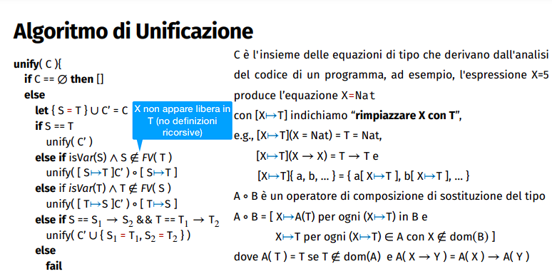
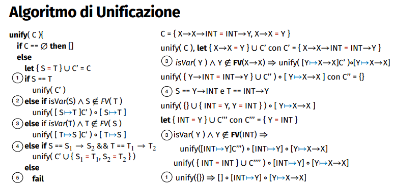
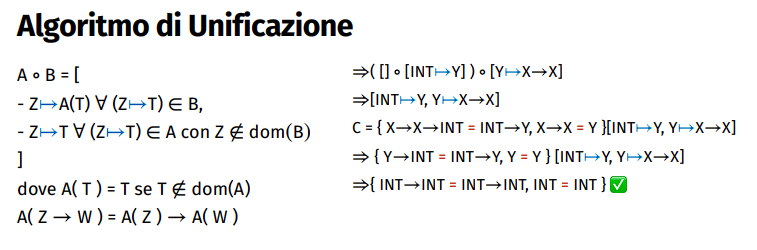

[//]: # (Date: 2023-04-30 19:00)
[//]: # (Stili di riferimento per il markdown)
<link rel="stylesheet" href="./res/style.css">

> # Tipi base e l'algebra dei tipi

---

> ## Sistemi di tipi

###  Da cosa nasce il concetto di tipo

Ogni linguaggio ha un *sistema di tipi*, cioè le informazioni e le regole che governano i tipi e i loro valori, chiamati *abitanti* (inhabitants) del tipo.

Più precisamente, un sistema di tipi comprende:
- Un insieme di **tipi di base**
- Meccanismi per **definire nuovi tipi**
- Meccanismi di **computazione** sui tipi, che includono:
  - *Regole di equivalenza*, che specificano quando due tipi corrispondono allo stesso tipo
  - *Regole di compatibilità*, che specificano quando un tipo può essere usato al posto di un altro
  - *Regole o tecniche di inferenza*, che specificano com eassegnare un tipo a un'espressione, a partire dalle informazioni sui suoi compoenenti
- La definizione sul controllo dei vincoli di tipo statico o dinamico.

### Extensional vs Intensional types

I sistemi di tipi possono essere *extensional* o *intensional*.

I tipi *extensional* sono definiti in base ai valori che possono assumere, mentre i tipi *intensional* sono definiti mediante predicati che definiscono la loro appartenenza ad alcuni domini di valori possibli.

Si usano per motivi diversi:
- *Intensionali* quando si dispone di un insieme definito di proprietà che identificano solo gli abitanti (valori validi) del tipo che stiamo definendo, con il vantaggio di risparmiare memoria se l'insieme degli abitanti è grande e di rendere possibile la definizione, nel caso di insiemi infiniti.
- *Estensionali* quando è più efficiente, per spazio o computazione, specificare gli abitanti del tipo o non abbiamo un insieme chiaro di regole che li definiscono.

Un tipo di dato estensionale sono, per esempio, gli **enum**, mentre un tipo intensionale è il tipo **int** o **float**.

---

> ## Tipi di dato

---

### Tipi base

Sono tutti i tipi che definiscono i valori denotabili dal linguaggio.

Diversi linguaggi hanno diversi tipi con diverse caratteristiche, anche se possono rappresentare gli stessi dati. In particolaare, se pensiamo ad `int` esso corrisponde tra `C` e `Java`, ma in `Rust` la definizione equivalente sarebbe `i32`.

Poiché hanno sintassi diverse, vi sono anche diversi modi per dichiarare i tipi di base:
- Java : `nomeTipo nomeVariabile`
- Rust : `let nomeVariabile : nomeTipo`

---

> ### 1. Tipo Unit (vs Void)

Il più elementare tipo è quello che contiene un solo elemento, l'insieme è un singoletto.

L'unico abitante di *Unit* (ovvero l'unico valore che esso può assumere) è *l'unità singoletto*, rappresentato anche con `()`.

Viene usato per indicare che una funzione non restituisce nulla, o che una variabile non ha un valore. Ogni input di una funzione genera come output un unico elemento, se esso è Unit, ovvero l'unità singoletto.

In Java e C hanno un concetto simile con `void`, ma presenta alcune differenze. Per esempio, nono possiamo ottenere ne passare un void: rappresenta proprio l'assenza di un valore.

In Java vi è una soluzione, ovvero il tipo di dato `Void`, di cui il riferimento nullo è l'unico abitante.

---

> ### 2. Tipo Boolean

Indicano valori logici e di solito comprendono:
- Valori: 
  - I due valori di verità, ovvero `true` e `false`
- Operazioni: 
  - Le principali operazioni logiche, come `and`, `or`, `not`, `xor`, etc.

I valori sono denotabili, esprimibili e memorizzabili.

Seppure basta 1 bit per rappresentarli, *spesso non è così*: in Java, ad esempio, sono rappresentati con 2 byte, in Rust con 1 byte.

---

> ### 3. Tipo Carattere

*Characters* o *chars* sono tutti i caratteri di un determinato insieme di simboli e di solito includono:
- Valori: 
  - Un insieme di codici di caratteri, per esempio ASCII o UNICODE
- Operazioni: 
  - Le principali operazioni di confronto, dipendono dal linguaggio, come `==`, `!=`, `<`, `>`, `<=`, `>=`, etc.

I valori sono denotabili, esprimibili e memorizzabili.

Sono rappresentati con un numero diverso di byte in base all'insieme che rappresentano.

---

> ### 4. Tipo Intero

Di solito includono:
- Valori: 
  - Un insieme di numeri interi, di solito limitati a un certo intervallo fissato al momento della definizione del linguaggio. 
  - Vanno da $[-2^{b-1},2^{b-1}-1]$ con $b$ numero di bit oppure da $[0,2^b-1]$ se sono unsigned. 
  - Alcuni linguaggi hanno un supporto per lunghezza arbitraria.
- Operazioni: 
  - Uguaglianza (`==`),  confronti (`!=`, `<`, `>`, `<=`, `>=`), aritmetiche (`+`, `-`, `*`, `/`, `%`), e altre in alcuni linguaggi.


I valori sono denotabili, esprimibili e memorizzabili.

---

> ### 5. Tipo reale

I reali denotano intervalli di numeri reali e di solito includono:
- Valori : 
  - Un sottoinsieme dei reali, fissato al momento della definizione del linguaggio.
  - Vengono memorizzati in *virgola fissa* o in *virgola mobile*.
    - In quelli a virgola fissa riservano un numero di bit specifici per gli interi e un numero di bit specifici per la parte decimale. Se ci sono *n* byte, con *f* su *n* bit per i decimali, abbiamo un intervallo di $[-2^{n-1}/2^f,2^{n-1}/2^f]$ e i numeri hanno una distanza costante di $2^{-f}$.
    - In virgola mobile usano un numero di bit per il segno, per il numero (*mantissa*) e per *l'esponente*. Lo standard IEEE 754 definisce due formati, con `base = 2`, ovvero in binario, con precisione *singola* (8 byte) o *doppia* (16 byte).
- Operazioni:
  - Uguaglianza (`==`),  confronti (`!=`, `<`, `>`, `<=`, `>=`), aritmetiche (`+`, `-`, `*`, `/`, `%`) (e altre in alcuni linguaggi).

I valori sono denotabili, esprimibili e memorizzabili.

---

> ### 6. Tipo "Enumeration"

Un tipo enumerazione consiste in un *insieme finito di costanti*, ciscuna caratterizzata da un nome. C, Rush e Java forniscono la stessa sintassi, per esempio:

```C
enum RogueOne { Jyn, Cassin, Chirrut, K2S0, Bodhi, Baze };
```

Questo introduce un nuovo tipo di dato, chiamato `RogueOne`, e 6 nuovi valori, chiamati `Jyn`, `Cassin`, `Chirrut`, `K2S0`, `Bodhi` e `Baze`.

Le *operazioni* sono confronti, meccanismi per ottenere i valori e passare da un valore all'altro.

Sono vantaggiosi in quanto *aiutano la leggibilità* e permettono di *evitare errori*.

Non tutti i linguaggi trattano gli **enum in modo sicuro**, per esempio C equipara gli interi ai valori dell'enum, e questo può portare a problemi (per verificare la correttezza).

---

> ### 7. Tipi Array

Un tipo **array** denota un insieme di elementi di un certo tipo, ciascuno indicizzato da almeno una *chiave identificativa* di un certo tipo (Se ci sono 2 o più chiavi si parla di array multidimensionali).

Di solito le chiavi assumono valori interi, non negativi, in un intervallo $[0,n]$ per $n+1$ elementi.

Ci sono anche *array associativi*, che permettono all'utente di fissare sia il tipo delle chiavi che quello degli elementi.

Vediamo come vengono trascritti in C, Rust e Java:

```C
int a[10];
a[0] = y;
int a[3] = {0,0,0};
int x[10][10];
```

```Rust
let a : [i32; 10];
a[0] = y;
let a : [i32; 3] = [0,0,0];
let x : [[i32;10];10];
```

```Java
int[] a;
int[] a = {0,0,0};
int[] a = new int[3];
int[][] x = new int[10][10];
```

Come possiamo vedere, in questi linguaggi anche il concetto di **array multidimensionale** è **accomunato** a quello di **array**. In alcuni linguaggi, tipo Pascal, non è così.

In C la dichiarazione corrisponde con l'allocazione (statica) dell'array, che possiamo usare subito.

In Java non creiamo l'array quando dichiariamo la variabile, ma è un nome di riferimento al quale assegnamo un nuovo array (nell'heap).

In Rust, la dichiarazione introduce sono l'annotazione del nome x, che viene in seguito associato con l'array. Questa volta viene anche dichiarato il tipo per verificare il vincolo di dimensione.

---

Le operazioni sono:
- La *selezione* di un elemento tramite il suo indice
- *L'assegnazione* (`=`), i *confronti* (`==`, `!=`, `<`, `>`, `<=`, `>=`), le *operazioni aritmetiche*.

I **linguaggi safe** verificano che *ogni accesso a un elemento dell'array avvenga davvero entro i suoi limiti*.

Tranne alcuni rari casi, questo controllo deve avvenire in fase di esecuzioni. Java e Rust garantiscono questa invariante a runtime sollevando un'eccezione in caso di errore, ma C non lo fa.

Seppur aggiunge un po' di lentezza fare il controllo, è utile per evitare attacchi di *buffer-overflow*.

---

Vi sono due modi per salvare gli array multidimensionali in memoria:
- *Row-major order*: i valori sono salvati per riga, ovvero prima tutti i valori della prima riga, poi tutti i valori della seconda riga, etc. E' leggermente più comune.
- *Column-major order*: i valori sono salvati per colonna, ovvero prima tutti i valori della prima colonna, poi tutti i valori della seconda colonna, etc.

In generale, il principio di località del caricamento in funzione dei cache-miss *favorisce gli algoritmi che esplorano gli array per riche con ordine di riga e viceversa per l'ordine di colonna*.

---

Un linguaggio deve decidere **se e quando fissare la forma degli array**.

- *In fase di compilazione*, anche detto **in forma statica**: noi sappiamo la sua dimensione a priori e possiamo memorizzarlo nello stack frame del blocco che porta la sua definizione. Accedere a questo array è simile ad accedere a varaibili di tipo scalare (salvo alcuni calcoli necessari, ovvero l'offset).
- *Quando si elabora la richiesta*, conosciamo la sua forma (fissa) solo quando il controllo raggiunge la dichiarazione dell'array (per esempio se dipende da una variabile). 
  - Possiamo allocarlo nello stack, ma poiché non conosciamo la sua dimensione a priori, non è sicuro farlo in modo corretto: una stima errata darebbe problemi.
  - Lo allochiamo *nell'heap*, usando un puntatore con diversi dati, chiamato **dope vector**, un descrittore che contiene: la locazione in memoria, il tipo di elementi, il rango, la lunghezza, etc.
- *Per array dinamici* si usa sempre il **dope vector**, con alcuni dati in più per tenere traccia del suo stato.

---

> ### 8. Tipi Insieme

Un tipo di insieme denota una struttura di dati *senza ordine* con *valori unici dello stesso tipo*.

Le operazioni sono il **test di inclusione**, e poi le operazioni di manipolazioni di insiemi, ovvero: **unione**, **intersezione**, **differenza**, **completamento**.

Un modo veloce è usare un array di bit di lunghezza pari alla cardinalità del tipo di base, dove 1 rappresenta l'appartenenza dell'elemento all'insieme e 0 il contrario. Ma questo non va bene per grandi tipi di base, quindi spesso si usano altre alternative, come le tabelle hash.

---

> ### 9. Tipo riferimento

Un riferimento dà accesso indiretto a un altro valore (ad esempio, eventualmente assegnato a una variabile), cioè *fa riferimento* a un dato.

L'implementazione più comune è con i **puntatori**, ovvero l'uso dell'indirizzo fisico di memoria del dato a cui si fa riferimento.

I puntatori sono solo un'istanza dei riferimenti, che possono essere, ad esempio, *indici di array*, a strutture di dati come alberi e liste, ad altri riferimenti, etc.

I riferimenti *chiedono al programmatore di pensare in termini dinamici* anziché statici.

Senza la dovuta diligenza o controlli delicati, i riferimenti possono diventare:
- **Wild**: quando, non inizializzati, il loro accesso può causare un comportamento inaspettato
- **Dangling**: quando il dato referenziato è stato deallocato e l'accesso può portare a un comportamento inaspettato, sopratutto quando dati compatibili all'operazione in esse sovrascrivono il dato deallocato.

I linguaggi con un *modello di variabili di riferimento* raramente forniscono tipi di riferimento, poiché ogni variabili è sempre un riferimento (Java).

Alcuni linguaggi specificano *dove ci si può riferire*: Pascal richiede che i puntatori facciano riferimento a valori allocati **sull'heap**, mentre C ammette anche puntatori che fanno riferimento **allo stack** o **all'area globale**.

---

Spesso i linguaggi definiscono un puntatore *canonico*, un abitante del tipo riferimento che "invalida" un puntatore a runtime, ovvero **null**.

I linguaggi con riferimenti forniscono un *operatore di riferimento alle variabili*, ovvero un modo per riferirsi alla posizione in memoria occupata da essa. Ad esempio, in C è `&`. Questa è una referenziazione.

Si hanno anche *operazioni di dereferenziazione*, che permettono di accedere al valore referenziato. Ad esempio, in C è `*`. Questo non modifica il valore della variabili, ma modifica il valore della variabile referenziata.

I linguaggi poi offrono la *deallocazione implicita* e quella *esplicita*. La prima deve venire gestita da un garbage collector (oppure viene impedita interamente, come in Rust), sennò si incorre in **memory leak**. La seconda consiste nel liberare la memoria allocata per un dato quando non è più necessario, specificandolo, ad esempio in C con `free()` (Bisogna poi nullificare questo riferimento, per evitare comportamenti inaspettati).

**Rust** gestisce i puntatori in modo sicuro, ovvero mette in atto controlli statici che consento al compilatore di liberare automaticamente la memoria inutilizzata e di prevenire riferimenti nulli, puntatori dangligl, double-free e invalidazioni di puntatori. 

---

> ### Richiami matematici

Assumiamo l'assioma dell'insieme potenza, cioè:

$$\mathscr{P} (S) = \{T : T \subset S \}$$

Chiamiamo l'insieme $\mathscr{P} (S)$ l'insieme potenza di $S$, che contiene tutti i sottoinsiemi generati da qualsiasi combinazione (anche vuota) di elementi di $S$.

**Paia ordinate** e **prodotto cartesiano** sono altre due cose che dobbiamo considerare:

Sia $a \in A$ e $b \in B$, $A \cap B = \emptyset$ e sia $(a,b) \overset{\Delta}{=} 
\{\{a\},\{a,b\}\}$. Allora:

- $\{a\} \subseteq A, \{b\} \subseteq B$
- $\{a\} \in \mathscr{P} (A), \{b\} \in \mathscr{P} (B)$
- $\{a,b\} \subseteq A \cup B \wedge \{a,b\} \in \mathscr{P} (A \cup B)$
- $(a,b) \subset \mathscr{P} (A \cup B)$
- $(a,b) \in \mathscr{P} (\mathscr{P} (A \cup B))$

Sia $A \times B = \{(a,b) : a \in A \wedge b \in B\}$ chiamato il **prodotto cartesiano** di $A$ e $B$.

$$(a,b) \in A \times B \subset \mathscr{P} (\mathscr{P} (A \cup B))$$

---

> ### 11. Tipi prodotto

Array, set e puntatori sono esempi di tipi compositi che "prendono come parametro" un tipo. Quando si combinano due o più tipi di base in una struttura fissa, si parla di **tipi prodotto**.

Il nome deriva dalla nozione di "prodotto diretto" della matematica, che è una generalizzazione del prodotto cartesiano $A \times B \overset{\Delta}{=} \{(a,b) : a \in A \wedge b \in B\}$.

I tipi di prodtto più comuni sono **coppie (pair)**, **tuple**, **record** e **varianti**.

Per convenzione, il prodotto vuoto è **l'unità**.


### 11.1. Coppie e Tuple

La forma più semplice è la **coppia**:
- Dati due tipi $A$ e $B$, la coppia di $A$ e $B$ è il tipo $A \times B$.
- Denota l'insieme delle coppie (le possibili combinazioni) dei valori in $A$ e $B$.

La generalizzazione di questo sono le **tuple**:
- Definiscono il prodotto di un numero arbitrario e finito di tipi $A_1, A_2, ..., A_n$ come $A_1 \times A_2 \times ... \times A_n = \prod_{i=1}^{n}{A_i}$.

C e Java non supportano direttamente copie e tuple (anche se si possono implementare con i record), mentre Rust si, con la sintassi `let x : (i32, ..., i32);`. (O anche altri tipi, in questo caso ho solo scritto un tupla di n interi). Per riferirsi al primo elemento si fa `x.0`, al secondo `x.1`, etc. in quanto le tuple sono tipi basati sull'ordine dei componenti.


### 11.2. Record

I record interpretano i tipi prodotto sostituendo la definizione posizionale dei componenti con la loro identificazione mediante *edichette* (distinte).

Vengono implementanti in modo diverso, per esempio come strutture o classi. Gli elementi di un record sono chiamati *campi*.

Vediamo come essi vengono scritti in C, Java e Rust:

```C
C

struct Person {
    char name[5];
    int age;
};
----------------
struct Person p = {
    .name = { 'E', 'v', 'a' },
    .age = 25
};
char * name = p.name;
int age = p.age;
```

```Java
Java

record Person (
    char[] name,
    int age
){};
----------------
Person p = new Person(
    new char[] { 'E', 'v', 'a' },
    25
);
char[] name = p.name;
int age = p.age;
```

```Rust
Rust

struct Person {
    name: [char; 5],
    age: i32
}
----------------
let p = Person {
    name: ['E', 'v', 'a', '', ''],
    age: 25
};
let name = p.name;
let age = p.age;
```

Nei record, l'ordine dei campi può essere significativo e venire seguito nella loro rappresentazione in **memoria**, ad esempio memorizzando i campi in posizioni contigue, anche se l'allineamnto bit-a-bit può comportare degli spazi vuoti tra i campi.


### 11.3. Pattern Matching

Se da una parte i tipi prodotto producono nuovi tipi di dati strutturati, abbiamo bisogno di costrutti che rendono semplice destrutturarli. Uno di questi è il **pattern matching**.

Il pattern matching controlla e individua elementi specifici rispetto a un certo schema, ad esempio in rust:

```Rust
let x : i32 = 2;
let isEven = match x%2 {
    0 => true,
    _ => false
}
```

Le implementazioni safe di pattern matching garantiscono una corrispondenza esaustiva, che aiuta a escludere errori comuni come i casi mancanti, i casi impossibili e i casi ridondanti.

Un altro esempio è:

```Rust
struct Person { name : [char; 3], age: i32 }
struct PersonR { name : [char; 3], age [char; 4] }
let eva = Person { name: ['E', 'v', 'a'], age: 25 };
let Person{ name, age } = eva; // Implicit pattern-matching
let evaR = PersonR {
    name,
    age : match age {
        1..=10 => ['K', 'i', 'd', ''],
        11..=20 => ['T', 'e', 'e', 'n'],
        _ => ['O', 'l', 'd', '']
    }
}
```

### 11.4. Tipi Ricorsivi

I tipi ricorsivi (come concetto) sono utili per definire strutture di dati, come liste e alberi, che possoniamo modificare dinamicamente. I tipi prodotto sono un modo per esprimere i tipi *ricorsivi*. Nell'esempio seguente, in Java, si noti l'uso di null per "chiudere" la struttura:

```Java
record IntList(int n, IntList cons){}
IntList l = new IntList(1, new IntList(2, new IntList(3, null)));
```

---

> ### 12. Tipi Somma

Si tratta di unioni di tipi. Una variabile assume uno dei valori di un tipo somma, ma non più di uno alla volta. Si dice che *una variabile può contenenre un'unione disgiunta di tipi*. Questi tipi sono anche chiamati **unioni etichettate**, **tagged unions**, **tipi unione**, **tipi scelta**, **tipi variante** e **coprodotti**.

$int = \{-13,0,1,26,...\}$ e $char = \{Y,1,Z,0,H,...\}$ sono due tipi.
Creiamo degli insiemi etichettati, ovvero $int' = \{(-13,i), (0,i), (1,i), (26,i),...\}$ e $char' = \{(Y,c), (1,c), (Z,c),...\}$.

L'unione disgiunta di questi due insiemi è $int' \cup char' = \{(-13,i), (0,i), (1,i), (26,i),..., (Y,c), (1,c), (Z,c),...\}$. Vuol dire che dichiarare x come tipo $int' \cup char'$ significa che x può essere un intero o un carattere.

L'unione degli insiemi etichettati ci dice che, anche se ci possono essere elementi coincidenti negli insiemi, sappiamo sempre a quale insieme appartengono (Per esempio se abbiamo $(0,c)$ e $(0,i)$).

Alcuni linguaggi li lasciano definire attraverso un operatore dedicato, come per esempio in pascal si può scrivere:

```Pascal
type IntOrChar = integer | char;
```

In Rust e Java si estende il concetto di *enumerazioni*:

```Rust
enum Address {
    PhysicalAddress { long: i32, lat: i32 },
    VirtualAddress { email: [char; 20] }
}
let a = Address::PhysicalAddress { long: 15, lat: 25 };
match a {
    Address::PhysicalAddress { long, lat } => // Eseguire operazioni come se fosse una physical address
    Address::VirtualAddress { email } => // Eseguire operazioni come se fosse una virtual address
}
```


In Java sono state aggiunte le *sealed classes*, che definiscono le uniche strutture di dati che possono apparire come uno dei possibili tipi presenti in un dato tipo di somma:

```Java
sealed class Address permits Address.PhysicalAddress, Address.VirtualAddress {
    static class PhysicalAddress extends Address {
        int long; int lat;
        PhysicalAddress(int long, int lat) { this.long = long; this.lat = lat; }
    }
    static class VirtualAddress extends Address {
        char[] email;
        VirtualAddress(char[] email) { this.email = email; }
    }
}

Address a = new Address.PhysicalAddress(15, 25);
switch (a) {
    case Address.PhysicalAddress p -> // Eseguire operazioni come se fosse una physical address
    case Address.VirtualAddress v -> // Eseguire operazioni come se fosse una virtual address
    default -> // altro
}
```

Infine, in C vengono usate le *union*.

```C
union Data {
    int i;
    char c;
};

union Data data;
data.i = 10;
data.c = 'A';
// data.i = 65
```

Da notare che non c'è un controllo di tipo, quindi se si assegna un valore di un tipo diverso da quello attuale, si sovrascrive il valore precedente. La memoria viene allocata in base alla struttura più grande, nell'esempio precedente la dimensione dell'int.


### 12.1. Tipi Somma - Tipi Ricorsivi

I tipi somma possono anche essere un'alternativa ai tipi prodotto per i tipi ricorsivi, *omettendo quindi il null* e usando un tipo per capire quando qualcosa arriva al termine. Facciamo un esempio con Java:

```Java
sealed class IntList permits 
IntList.Cons, IntList.End {
    static class Cons extends IntList {
        int n; IntList cons;
        Cons(int n, IntList cons) {...}
    }
    static class End extends IntList {
        End(){}
    }
}

IntList l = new IntList.Cons(
    1,
    new IntList.Cons(
        2,
        new IntList.End()
    )
);
```

> ### Richiami matematici

#### Relazioni

Data una sequenza di insiemi $S_1,...,S_n$, chimiamo l'insieme $\mathbb{R} \subseteq S_1 \times ... \times S_n$ una *relazione* sul prodotto cartesiano $S_1 \times ... \times S_n$ quando $\mathbb{R}$ relaziona gli elementi $s_1 \in S_1,...,s_n \in S_n$, cioè quando, per qualche $s_1,...,s_n,(s_1,...,s_n) \in \mathbb{R}$.

Quando $\mathbb{R} \subseteq S \times T$ diciamo che $\mathbb{R}$ è una *relazione binaria* (spesso usato per indicare il caso speciale $\mathbb{R}\subseteq S \times S$).

Dato $s \in S$ e $t \in T$ se $(s,t) \in \mathbb{R}$ scriviamo solitamente $s \hspace{2pt} \mathbb{R} \hspace{2pt} t$.

Per convenzione, dato $\mathbb{R} \subseteq S\times T$, chiamiamo gli elementi di $S$ in $\mathbb{R}$ il *dominio* di $\mathbb{R}$ $(dom(\mathbb{R})\subseteq S)$ e gli elementi di $T$ in $\mathbb{R}$ *immagine* di $\mathbb{R}$ ($img(\mathbb{R})\subseteq T)$.

---

Questa è una definizione molto matematicosa delle relazioni, dove la $\mathbb{R}$ rappresenta per esempio il simbolo $+$. Questo poi si può evolvere per andare ad indicare le funzioni, che vedremo presto come estendono questo significato.

#### Funzioni

Ogni sottoinsieme del prodotto cartesiano di due set X e Y definisce una relazione binaria $\mathbb{R} \subseteq X \times Y$ tra questi due set.

Una relazione binaria è *univalente* se:

$$\forall x \in X, \forall y,z \in Y, \hspace{10pt} ((x,y) \in \mathbb{R} \wedge (x,z) \in \mathbb{R}) => y = z$$

Una relazione binaria è *totale* se:

$$\forall x \in X, \exists y \in Y, \hspace{10pt} (x,y) \in \mathbb{R}$$

Una **funzione parziale** è una relazione binaria *univalente*, una **funzione** è una relazione binaria che è *univalente* e *totale*.

#### Set exponentiation

Il set di tutte le funzioni dal set $X$ al set $Y$ è comunemente denotato come:

$$Y^X$$

Questa notazione è la stessa del prodotto cartesiano di una famiglia di copie di $Y$ indexate da $X$:

$$Y^X = \prod_{x \in X} Y$$

Ad esempio, se $S = \{1,2,3\}$ e $T = \{f,t\}$, il numero di possibili $g : S \mapsto T$ è $2^3$.

Sono proprio: $((f,f,f),(t,f,f),(t,t,f),(t,f,t),...,(t,t,t))$.

Sono l'insieme di tutti i valori mappabili da $S$ a $T$, ovvero le possibili funzioni che mappano $S$ a $T$. Per la prima funzione abbiamo $f(1) = f(2) = f(3) = f$, per la seconda $f(1) = t, f(2) = f(3) = f$, etc.

#### Insieme potenza come funzione

Data la definizione appena vista, abbiamo un modo alternativo di scrivere $\mathscr{P}(S)$, ovvero:

$$\mathscr{P}(S) = 2^S$$

Dove $2^S$ è l'insieme di tutte le funzioni da $S$ a $2 = \{0,1\}$.

L'insieme di funzioni risultanti sono quindi: $\{f_1, f_2, ..., f_n\}$, dove $f_i : S \mapsto 2$. Se il valore preso è 1, allora l'elemento appartiene all'insieme, altrimenti no.

Per esempio: $f_0 = \{(1,0),(2,0),(3,0)\}=\emptyset$, $f_1 = \{(1,1),(2,0),(3,0)\}=\{1\}$, $f_2 = \{(1,0),(2,1),(3,0)\}=\{2\}$, $f_3 = \{(1,1),(2,1),(3,0)\}=\{1,2\}$, etc.

---

> ### Tipi funzione

I linguaggi ad alto livello supportano spesso la definizine di funzioni (o procedure).

Solo alcuni, però, denotano il tipo di funzioni (cioè danno loro un nome nel linguaggio).

Ad esempio, se `f` è una funzione definita come `R f(P p){...}`, allora possiamo indicare il suo tipo come `P -> R`, dove `P` è il tipo di parametro unario accettato da `f` e `R` è il tipo del valore restituito da `f`. La rappresentazione della teoria insiemistica di `P->R` è $R^P$.

Se invece abbiamo una funzione di forma: `R f(P1 p1, ..., Pn pn){...}` ha tipo `P1->...->Pn->R`, che è la rappresentazione di $R^{P_1^{...^{P_n}}}$.

I valori di un tipo di funzione sono denotabili in tutti i linguaggi, ma solo alcuni (quelli "funzionali") li rendono esprimibili (o memorizzabili).

La principale operazione su un tipo funzione è *l'applicazione*, cioè l'invocazione di una funzione su alcuni argomenti (parametri reali).


---

> ## Algebra dei tipi

---

I tipi Prodotto, Somma e Funzione richiamano l'esistenza di un'algebra, ovvero una disciplina che definisce le regole per la manipolazione dei simboli (di tipo) dei tipi, definiti quindi *"tipi (di dati) algebrici"*.

I sistemi di tipi possono utilizzare le proprietà di questa algebra per esprimere e verificare le proprietà dei programmi.


---

> ### Equivalenza di tipo

Una domanda importante è capire *quando due tipi sono uguali*. Questo è importante in quanto la risposta non ha un'unica interpretazione, poiché dipende dal contesto dove si verifica l'uguaglianza.

Per esempio: 
- Sia S definito come un *sottoinsieme* di numeri interi e f una funzione che può sommare due numeri interi qualsiasi.
- Dal suo punto di vista, *f può considerare gli abitanti di S come equivalenti agli interi*, in quanto sa che può lavorare su un sottoinsieme dei valori che accetta.
- D'altro canto, se f accettasse solo valori di S, non potremmo assumere con sicurezza i parametri interi come uguali a S, poiché potrebbe considerare qualche *invariante* di S, invalidata dagli interi. (per esempio solo valori positivi)

#### Preordini ed equivalenze

Dato un insieme $S$, chiamiamo l'insieme $\mathbb{R}$ una relazione binaria su $S$ quando $\mathbb{R} \subseteq S \times S$.

Dati due elementi $s_1,s_2 \in S$, se $(s_1,s_2) \in \mathbb{R}$ scriviamo $s_1 \hspace{2pt} \mathbb{R} \hspace{2pt} s_2$.

Le relazioni binarie hanno diverse proprietà:
- **Riflessività** : $\forall s \in S, s \hspace{2pt} \mathbb{R} \hspace{2pt} s$
- **Simmetria** : $\forall s_1,s_2 \in S, s_1 \hspace{2pt} \mathbb{R} \hspace{2pt} s_2 => s_2 \hspace{2pt} \mathbb{R} \hspace{2pt} s_1$
- **Anti-simmetria** : $\forall s_1,s_2 \in S, s_1 \hspace{2pt} \mathbb{R} \hspace{2pt} s_2 \wedge s_2 \hspace{2pt} \mathbb{R} \hspace{2pt} s_1 => s_1 = s_2$
- **Transitività** : $\forall s_1,s_2,s_3 \in S, s_1 \hspace{2pt} \mathbb{R} \hspace{2pt} s_2 \wedge s_2 \hspace{2pt} \mathbb{R} \hspace{2pt} s_3 => s_1 \hspace{2pt} \mathbb{R} \hspace{2pt} s_3$

Si ha:
- **Preordine** se c'è
  - Riflessività
  - Transitività
- **Equivalenza** se c'è
  - Riflessività
  - Simmetria
  - Transitività
- **Ordine parziale** se c'è
  - Riflessività
  - Anti-simmetria
  - Transitività

#### Equivalenza di tipo nominale

*L'equivalenza di tipo nominale* (NTE) è la più semplice, e si basa sul nome del tipo. Due tipi sono uguali se hanno lo stesso nome.

Sia $name(T)=n$ una funzione che dato un tipo $T$ tirotna il suo nome associato $n$, allora:

$$T_1 \hspace{1pt} NTE \hspace{3pt} T_2 \iff name(T_1) = name(T_2)$$

Quindi, sebbene i tipi $Dollaro=int$ e $Euro=int$ siano funzionalmente indistinguibili, in un sistema nominale non solo equivalenti.

E' semplice e cerca di essere aderente alle intenzioni del programmatore: ad esempio, se venissero usati i tipi per distringuere tra loro $Dollari$ ed $Euro$, ci potrebbero essere alcune invarianti (ad esempio, i tagli delle monete) non catturati a livello dei tipi su cui il programmatore fa affidamento nel corpo delle funzioni.

#### Duck typing

Si tratta di un metodo di programmazione nel quale **il tipo di un oggetto è meno importante della presenza di certi metodi e attributi in esso**. Essenzialmente il tipo non è proprio una cosa che viene presa in considerazione, mentre attributi e metodi sì. 

Il nome deriva dal detto "se sembra un'anatra, nuota come un'anatra e gracchia come un'anatra, allora è un'anatra".

#### Equivalenza di tipo strutturale

*L'equivalenza di tipo strutturale* (STE) e può essere eseguita anche staticamente.

Non sappiamo esattamente in anticipo che percorsi operativi prenderanno i valori nel programma, quindi dobbiamo eseguire *controlli più conservativi* di quelli "operativi" visti per il duck typing, ovvero semplicemente dire "errore: questa cosa non c'è".

Verificheremo l'equivalenza dei tipi confrontando tutte le loro operazioni, strutture e sottoelementi. Naturalmente, questo rende la definizione più complessa, ad esempio:

$$(T_{a1},...,T_{an}) \hspace{1pt} STE \hspace{3pt} (T_{b1},...,T_{bn}) \iff \forall i \in [1,n], T_{ai} \hspace{1pt} STE \hspace{3pt} T_{bi}$$

$$struct \hspace{2pt} T_a\{f_1:T_{a1},...,f_n:T_{an}\} \hspace{2pt} STE \hspace{2pt} struct\hspace{2pt} T_b\{f_1:T_{b1},...,f_n:T_{bn}\} \iff \forall i \in [1,n], T_{ai} \hspace{1pt} STE \hspace{3pt} T_{bi}$$

### Sistema nominale vs Strutturale

Il tipaggio nominale presenta diversi vantaggi:
- Collegamento diretto per il runtime, ad esempio, alla *stampa*, al *marshalling* (ovvero al modo di salvataggio dei dati in memoria, simile alla serializzazione come concetto) e alla verifica della *coercizione* (ovvero la conversione implicita di un tipo di dato in un altro).
- Una *denotazione intuitiva dei tipi ricorsivi*, la cui definizione fa riferimento al tipo stesso, come le liste e gli alberi. Questo perché con la STE si potrebbe dichiarare un tipo ricorsivo senza mettere il tipo stesso come descrizione.
  - $IntList := Unit + (Int \times IntList)$ (Nominale)
  - $IntList := Unit + (Int \times ListInt) \hspace{2pt} e \hspace{2pt} ListInt := IntList$ (Strutturale ha senso)
- Il controllo della *sottotipaggio* è un *controllo diretto*, quasi banale, delle relazioni nominali di sottotipo dichiarate tra i tipi nominati.

Questi vanatggi hanno decretato il successo dei sistemi di tipi nominali, che sono la maggioranza dei linguaggi di programmazione. Java e Rust sono nominali e anche C lo è, però sì può arginare questa limitazione usando le typedef, con alias coincidenti.

---

### Compatibilità di tipo

A volte non usiamo solo l'uguaglianza di tipo, ma anche la **compatibilità di tipo**, che è una *relazione più debole*.

Per esempio, nel duck typing notiamo che va bene usare un tipo con campi x,y e z in una funzione che accetta un tipo con campi x e y, poiché non usa z.

Formalmente, poiché l'equivalenza è un *preordine simmetrico*, questa sussume la compatibilità, che è un *preordine*, ma non viceversa (non tutti i tipi compatibili sono equivalenti).

Alcune interpretazioni comuni della compatibilità (oltre all'equivalenza) sono, siano $S$ e $T$ due tipi:
- I valori di $S$ sono un **sottoinsieme** dei valori di $T$, ad esempio intervalli.
- I valori di $S$ sono un **sottoinsieme di valori canonicamente corrispondenti** di $T$.
  - Questo è tipico di tipi come, ad esempio, i tipi `float` e `int`, dove ogni `int n` ha un `float` canonicamente corrispondente `n.0`.
- I valori di $S$ sono un **sottoinsieme di valori arbitrari corrispondenti** di T.
  - In questo caso abbandoniamo il requisito di canonicità del punto precedente e assumiamo la presenza di una qualche trasformazione arbitraria che converta qualsiasi valore di $S$ in un valore di $T$.
  - Per esempio, passare a `float` ad `int` trovando il valore.
- Le **operazioni** sui valori di $T$ sono possibili anche sui valori di $S$. Questo è l'esempio mostrato per il duck typing e il principio alla base di una *nozione di sottotipaggio* (Lo vediamo meglio dopo).

---

> ### Coercezione e Casting di Tipo

Essenzialmente, la *coercezione* è una conversione implicita di un tipo di dato in un altro, mentre il *casting* è una conversione esplicita.

Queste due conversioni di tipo *canoniche o arbitrarie* quando vi sono modifiche alla rappresentazione in memoria, mentre sono *sintattiche* quando rimangono uguali in memoria (Per esempio con gli intervalli).

Per il type casting, C e Java adottano una sintassi minimalista `S s = ( S ) t`, mentre Rust ne fornisce una più verbosa `let s : S = t as S`.

---

> ### Inferenza di Tipo

Per eseguire i controlli sui tipi, il type checker deve determinare il tipo delle espressioni presenti nel programma, come per esempio l'uguale, usando le informazioni sui tipi che il programmatore ha inserito nel programma.

Concretamente, il type checker determina il tipo delle espressioni visitando l'albero di parsing del programma, partendo dalle sue foglie (variabili e costanti di cui si conosce il tipo), scendendo fino alla radice e *calcolando il tipo delle espressioni dalle informazioni accumulate lungo il suo percorso*. (Ad esempio, il sistema potrebbe stabili che `+` è un operatore binario che accetta due interi e restituisce un intero, quindi se trova `1+2` sa che il tipo è `int`).

Sapendo che il type checker può *inferire* alcune informazioni da una quantità ridotta di annotazioni di tipo, i linguaggi possono risparmiare al programmatore il compito di annotare tutte le espressioni. **L'inferenza di tipo** è il processo di attribuzione di tipi alle espressioni, senza annotazioni esplicite dei tipi.

---

L'algoritmo di inferenza non è in grado, spesso, di *capire subito il tipo di un espressione*. In questi casi, il type checker può *ritardare* la verifica del tipo di un'espressione, *posticipandola* fino a quando non ha abbastanza informazioni per determinare il tipo.

Essenzialmente noi riduciamo e riduciamo, arrichendo di vincoli, la gamma di possibili tipi che le cose siano. Per esempio, se incontriamo `+` sappiamo che possiamo assumere che quelli collegati al `+` siano numeri. La procedura che esegue questo controllo sui vincoli è una strategia di risoluzione della programmazione logica nota come **algoritmo di unificazione**.

C non lo fornisce un supporto rilevante per l'inferenza di tipo, mentre Java e Rust lo fanno in modo semplice. I linguaggi della famiglia ML, basati sul sistema di tipi Hindley-Milner [1,2], forniscono un supporto più completo per l'inferenza di tipo.

---

### Algoritmo di Unificazione





