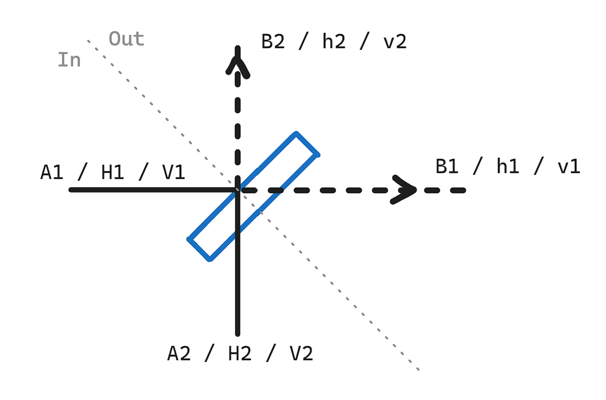
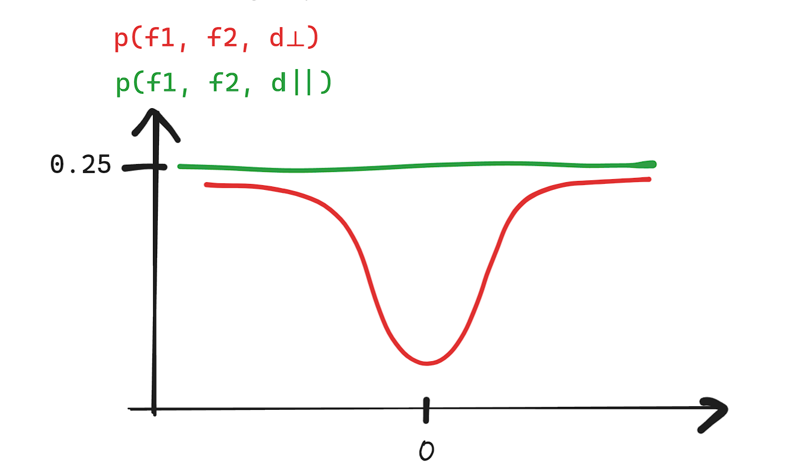
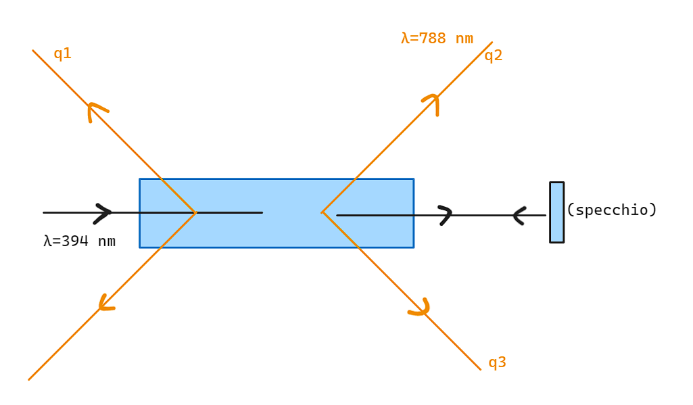
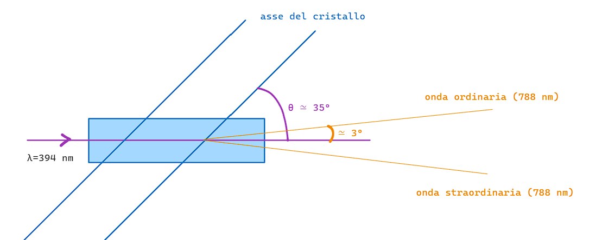
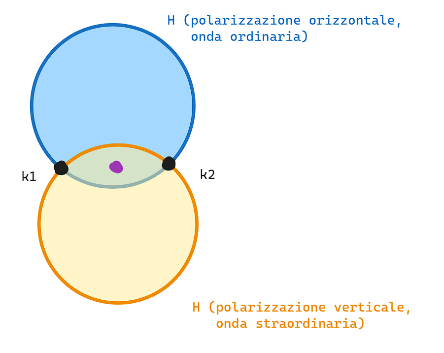
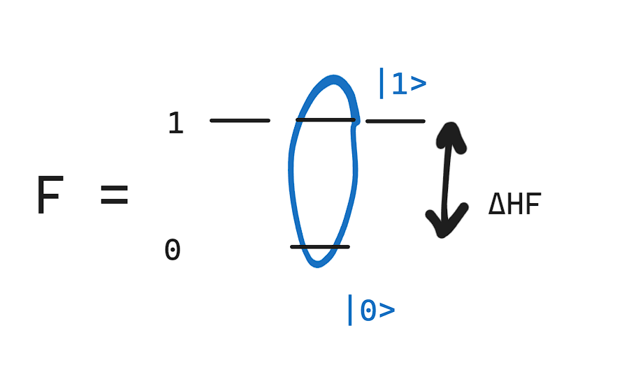

# Modulo 2

## Cosa si farà

Andiamo a capire come e dove possiamo andare a fare test di laboratorio. In particolare, andremo a vedere come possiamo fare test di laboratorio per la realizzazione di un computer quantistico.

Questa parte non segue un libro di testo, in quanto si parla di esperimenti. Quindi ci saranno gli appunti caricati su Virtuale della lezione.

Questi esperimenti sono di ottica o di fisica atomica. Spesso ci saranno riferimenti a questi concetti, ma non è necessario conoscerli per capire il corso.

L'argomento sarà, per le prime lezioni, il **teletrasporto quantistico**.

## 1. Teletrasporto quantistico

Cosa si intende?

> Per **teletrasporto quantistico** si intende il trasferimento dello stato quantistico di un *qubit*.

Non si intende una trasmissione di materia, ma solo di informazione, tra due qubit separati fisicamente, ma il cui stato di uno va ad influenzare l'altro.

### 1.1. Quali saranno i qubit utilizzati

Useremo dei Qubit che sono **fotoni**: prendiamo un campo elettrico $\vec{E}$. Lo rappresentiamo nella rappresentazione compessa, ovvero:

$$
\vec{E} = \vec{E}_0 \vec{\epsilon} e^{i(\vec{k}z - \omega t)} + c.c. \quad \text{con } c.c. \text{ che sta per complesso coniugato } \vec{\epsilon} + k \hat{z}
\\ \ \\
= \vec{E}_0 [\hat{x} cos \theta e^{i (kz - \omega t)} + \hat{y} sin \theta e^{i (kz - \omega t + \phi)}] + c.c.
\\ \ \\
= \vec{E}_0 e^{i (kz - \omega t)} [\hat{x} cos \theta + \hat{y} sin \theta e^{i\phi}] + c.c.
\\ \ \\
\epsilon \text{ vettore in spazio tridimensionale con } base={\hat{x}, \hat{y}}
$$

Quindi qualsiasi campo elettrico può essere rappresentato come una combinazione lineare di due campi elettrici, uno in fase e uno in controfase.

Il nostro versore di polarizzazione sarà:

$$
\vec{\epsilon} = \hat{x} cos \theta + \hat{y} sin \theta e^{i\phi}
$$

Possiamo associare ai due versori i due vettori nello spazio di Hilbert che rappresentano i due stati di polarizzazione di un fotone:

$$
\ket{0} = \hat{x} \quad \text{e} \quad \ket{1} = \hat{y}
$$

Quindi possiamo andare a riscrivere lo stato di polarizzazione nel seguente modo:

$$
\vec{\epsilon} = cos \theta \ket{0} + sin \theta e^{i\phi} \ket{1}
$$

Potevamo anche scrivere $\theta/2$ in quanto un incremento di $\theta + \pi$ porta ad un cambio di segno, ovvero $\ket{\vec{\epsilon}} = -\ket{\vec{\epsilon}}$.

Quello che ci facciamo in meccanica quantistica con un campo elettrico sarà quello di farci degli operatori.

Noi parleremo genericamente di fotoni, ma i fotoni sono un quanto di eccitazione del campo elettromagnetico, che in meccanica quantistica è analogo ad un oscillatore armonico.

Un fotone quindi vive in uno spazio di Hilbert a due dimensioni, e da ora in poi lo chiameremo **qubit** e lo useremo. L'unica base che useremo sarà quella di polarizzazione (quella con $\ket{0}$ e $\ket{1}$).

Usiamo i fotoni nello spazio di Hilber per due motivi:
- Le sovrapposizioni sono molto "resistenti" nel tempo, in quanto interagiscono poco e si muovo velocemente. Quindi la loro coerenza della loro combinazione lineare è ottima.
- Sono quindi ottimi qubit per trasmettere informazioni, ma sono difficili da manipolare, quindi non sono ottimi per andare ad eseguire delle computazioni.

### 1.2. Come si fa una misura di polarizzazione

Una misura di polarizzazione si fa con un polarizzatore:

> Un **polarizzatore** è elemento ottico (per esempio un cubetto di vetro, un vetrino, uno specchietto, etc.) che assorbe fotoni con una certa polarizzazione $\hat{x}$ e trasmette i fotoni con polarizzazione $\hat{y}$. Chiamo questo quindi un polarizzatore $\pi_y$.

Se noi abbiamo $\ket{\vec{\epsilon}} = cos \theta \ket{0} + sin \theta e^{i\phi} \ket{1}$, allora dopo il polarizzatore, abbiamo:

$$
\pi_y \ket{\vec{\epsilon}} = \ket{1} \bra{1} \ket{\vec{\epsilon}} = sin \theta e^{i\phi} \ket{1}
$$

La probabilità che un fotone attraversi un polarizzatore $\hat{y}$ è dato dalla regola di Born:

$$
P(\hat{y}) = |\bra{\vec{\epsilon}} \pi_y \ket{\vec{\epsilon}}|^2
$$

I polarizzatori sono quelli che si usano per fare misure proiettive dello stato di polarizzazione dei fotoni.

Il polarizzatore fa passare il protone, poi dobbiamo usare qualcosa per misurare se è passato o meno:
- Abbiamo un polarizzatore ed un **rivelatore**
- Per noi il rilevatore è super basico: fa "click" quando arriva il fotone. Un rivelatore è qualcosa che trasforma un fotone assorbito in una corrente elettrica.

> Le misure di polarizzazione sono quindi misure proiettive in cui abbiamo un polarizzatore e un rivelatore.

Per ora andiamo a supporre che il rivelatore sia perfetto e non ci siano problemi (più avanti andremo a vedere le disuaguaanze di Bell).

## 2. Esperimento del teletrasporto di Vienna (1997)

L'esperimento del teletrasporto consiste nel trasferire lo stato di un Qubit (che è un fotone) da Alice a Bob.

> Ci sono Alice e Bob che sono "distanti" (nell'esperimento che analizziamo sono vicini, ma oggi sono stati portati anche a centinaia di km) e Alice vuole trasferire istantaneamente lo stato di un qubit a Bob.

Attenzione: **non si viola il no-cloning theorem**: per trasferire lo stato di un qubit da Alice a Bob, Alice deve distruggere il suo qubit.

L'esperimento è stato fatto per la prima volta nel 1997 a Vienna, da Zeilinger e colleghi. Vinsero il premio Nobel nel 2022 per questo esperimento. Più o meno negli stessi mesi in cui è stato pubblicato questo esperimento, è stato pubblicato anche l'esperimento da parte di De Martini, che è molto più complicato da capire.

Questo articolo dell'esperimento sarà presente nell referenze.

### 2.1. Protocollo di Bennett

Anche questo un articolo che si può trovare nelle referenze. Si tratta di un articolo proposto da Bennet et al., PRL 70, 1985 (1993).

Cosa prevede?

> Ci sono A(lice) e B(ob).
>
> Alice ha un qubit:
> $$
> \ket{q_1} = \alpha \ket{0}_1 + \beta \ket{1}_1, \quad \text{fotone iniziale di Alice}
> $$
>
> Bob deve trovarsi questo stato alla fine del protocollo, ed è lo stato che Alice cerca di trasmettere a Bob.
>
> Alla fine del protocollo, si ha:
> $$
> \ket{q_3} = \alpha \ket{0}_3 + \beta \ket{1}_3, \quad \text{fotone finale di Bob}
> $$
>
> Il protocollo di Bennet prevede:
> 1. Creazione di una **coppia di fotoni entangled**, in un particoalre stato di Bell:
> $$ \ket{\Phi^-}_{23} = \frac{1}{\sqrt{2}} [\ket{1}_{2} \ket{0}_3 - \ket{0}_{2} \ket{1}_3] \\ \ \\ \text{di cui Alice prende il fotone } \ket{q}_2 \text{ e Bob prende il fotone } \ket{q}_3 $$
> 2. A questo punto, Alice ha due fotoni: il fotone $\ket{q}_1$ che è quello che vuole trasmettere e il fotone $\ket{q}_2$ che è quello entangled con il fotone di Bob.
> 3. Alice esegue una "misura di Bell" sui fotoni $\ket{q}_1$ e $\ket{q}_2$. Una misura di Bell è una misura i cui proiettori sono gli stati di Bell:
> $$ \{ \ket{\phi^-}_{12} \bra{\psi^-}, \ket{\psi^-}_{12} \bra{\psi^-}, \ket{\phi^+}_{12} \bra{\phi^+}, \ket{\psi^+}_{12} \bra{\psi^+} \} $$
> In particolare 
> $$\ket{\phi^+}_{12} = \frac{1}{\sqrt{2}} [\ket{0}_1 \ket{0}_2 + \ket{1}_1 \ket{1}_2] \\ \ket{\psi^+}_{12} = \frac{1}{\sqrt{2}} [\ket{0}_1 \ket{1}_2 + \ket{1}_1 \ket{0}_2] \\ \ket{\phi^-}_{12} = \frac{1}{\sqrt{2}} [\ket{0}_1 \ket{0}_2 - \ket{1}_1 \ket{1}_2] \\ \ket{\psi^-}_{12} = \frac{1}{\sqrt{2}} [\ket{0}_1 \ket{1}_2 - \ket{1}_1 \ket{0}_2] $$
> 
> Nel protocollo di Bennet dovrebbe fare una misura di Bell, ovvero proiettare su questi stati: pertanto gli esiti sono 4 possibili, ma nell'esperimento non c'è tutta questa risoluzione, ma è in grado di proiettare unicamente su uno degli stati di Bell, ovvero $\ket{\Phi^-}_{12}$.
>
> 4. Alice comunica a Bob l'esito della misura di Bell, in base al quale Bob esegue un operazione unitaria $\ket{q}_3$. Dopo aver eseguito questa operazione unitaria, lo stato di Bob sarà esattamente quello che Alice voleva trasmettere, ovvero $\ket{q}_1$. Nel caso l'esito è uguale a $\ket{\Phi^-}_{12}$, Bob non deve fare nulla (L'operazione unitaria è l'identità). Nel caso l'esito è $\ket{\Phi^+}_{12}$, Bob deve fare una porta $X$ (porta di Pauli $X$). Nel caso l'esito è $\ket{\Psi^-}_{12}$, Bob deve fare una porta $Z$ (porta di Pauli $Z$). Nel caso l'esito è $\ket{\Psi^+}_{12}$, Bob deve fare una porta $X$ e poi una porta $Z$.
>
> Quindi Alice ha:
> - Un qubit iniziale $\ket{q}_1$
> - Una coppia di fotoni entangled $\ket{\Phi^-}_{23}$
> - In totale ha 3 qubit:
>   - $$\ket{\varphi}_{123} = \ket{q}_1 \otimes \ket{\Phi^-}_{23}$$
>   - $$= 1/\sqrt{2} [\alpha \ket{1} \ket{1} \ket{0} - \alpha \ket{1} \ket{0} \ket{1} + \beta \ket{0} \ket{1} \ket{0} - \beta \ket{0} \ket{0} \ket{1}]$$
>   - $$= \frac{1}{2} \alpha[ \ket{\psi^+} + \ket{\psi^-} ]_{12} - \frac{1}{2} \alpha [ \ket{\phi^+} - \ket{\phi^-} ]_{12} + \frac{1}{2} \beta [ \ket{\psi^+} - \ket{\psi^-} ]_{12} - \frac{1}{2} \beta [ \ket{\phi^+} + \ket{\phi^-} ]_{12}$$
>   - A questo punto devo raccogliere tutti gli stati, a me interessa quello di $\ket{\phi^-}_{12}$, quindi faccio:
>   - $$\frac{1}{2} \ket{\phi^-}_{12}( - \alpha \ket{1}_3 - \beta \ket{0}_3 ) + \frac{1}{2} \ket{\phi^+}_{!2} ...$$
>
> Quindi Bob sarà sempre in grado di ricostruire lo stato di Alice, anche se non sa nulla di $\alpha$ e $\beta$.

### 2.2. Parte sperimentale

Ci interessano 2 cose: come generare la coppia di fotoni entangled e come si esegue la misura di Bell.

#### 2.2.1. Misura di Bell

Come si esegue? Usando un **"beam-splitter"**, ovvero uno specchio parzialmente riflettente, ovvero uno specchio che a volte viene attraversato e a volte viene riflettuto, ma nulla viene assorbito.

Nelle slide viene fatto un disegno: si tratta di un rettangolo a 45° (partendo da orizzontale con ancora di rotazione a sinistra e in senso antiorario), con fotoni che arrivano da sinistra e o passano indisturbati o vengono riflessi in alto.

In particolare:
- Sia $A_1$ l'ambiezza del campo elettrico incidente sul beam-splitter
- Sia $B_1$ l'ampiezza del campo elettrico trasmesso
- Sia $B_2$ l'ampiezza del campo elettrico riflesso

In genere in ottica queste ampiezze sono proporzionale alle ampiezze moltiplicati per un coefficiente, ovvero:

$$
B_1 = t A_1, \quad B_2 = r A_1
\\ \ \\
\text{Con t e r coefficienti di trasmissione e riflessione}
$$

In assenza di assorbimento, si conserva l'energia, ovvero:

$$
|A_1|^2 = |B_1|^2 + |B_2|^2
\\ \ \\
\text{Con } |t|^2 + |r|^2 = 1
$$

Fintanto che qualcuno ha stati con tanti fotoni, essi sono descritti ragionevolmente da queste descrizioni classiche. Tuttavia queste descrizioni classiche non vanno bene, e dobbiamo usare degli operatori, quando abbiamo pochi fotoni (nell'ordine di 0 o 1 fotoni): gli effetti quantistici diventano importanti.

Quando passo da una descrizione classica ad una descrizione quantistica, passo agli operatori:

$$
A_1 \rightarrow \hat{a}_1 \text{ operatore di distruzione di un foto nel modo "1", in ingresso}
\\ \ \\
B_1 \rightarrow \hat{b}_1 \text{ operatore di distruzione di un foto nel modo "1", in uscita}
\\ \ \\
B_2 \rightarrow \hat{b}_2 \text{ operatore di distruzione di un foto nel modo "2", in uscita}
$$

Da notare:
- Per *modo* di un fotone si intende la direzione del fotone.
- "Operatore di distruzione di un fotone nel modo 1" vuol dire che si tratta di un fotone che viene distrutto nel modo incidente.
- "in ingresso" e "in uscita" sono arbitrari, nel nostro caso abbiamo tracciato una linea tratteggiata che ci dice che il fotone è in ingresso. (Si tratta di una linea posizionata in modo perpendicolare al beam-splitter)
- $\hat{b}_1^\dagger$ è un operatore di creazione, come anche $\hat{b}_2^\dagger$.

Adesso vogliamo scrivere delle analogie al caso classico, ovvero, per esempio: $\hat{b}_1 = t \hat{a}_1$. Ma questa cosa non si può fare: questi operatori di creazione e distruzione non commutano con il loro Hermitiano coniugato, ovvero:

$$
[\hat{a}_1, \hat{a}_1^\dagger] = 1
$$

Notiamo che quindi non fanno 0, ovvero non commutano. Questa cosa non vale neanche per $\hat{b}_1$ e $\hat{b}_1^\dagger$ e neanche per $\hat{b}_2$ e $\hat{b}_2^\dagger$.

Tra l'altro, piccola nota, $\hat{a}_1^\dagger$ è l'operatore di creazione di un fotone nel modo "1".

Ci sono certe regole di commutazione che quindi devono essere soddisfatte su questi operatori, e questo ci dice che non possiamo andare a traslare le regole classiche in regole quantistiche, in quanto sono incomplete.

Da notare che però invece $[a_1, b_1] = 0 = [a_1, b_2] = [a_1, b_1^\dagger]=[a_1, b_2^\dagger]$

Se:
- $\hat{b}_1 = t \hat{a}_1 + r \hat{a}_2$, allora $[\hat{b}_1, \hat{b}_1^\dagger] = [t \hat{a}_1, t^* \hat{a}_1^\dagger] = |t|^2$
- Ma abbiamo che $|t|^2$ è 1, e possiamo anche calcolare che andremmo ad avere $|r|^2 = 1$, quindi la loro somma farebbe 2, che non va bene.

Ma quindi perché? Perché ci sono due parti di entrata: c'è anche $A_2$, che viene dal basso. Nella parte classica si può ignorare, assumendo sia 0, ma nella parte quantistica no, non è possibile pensare che non ci sia nulla: il campo magnetico può essere sollecitato casualmente. Nelle note, dopo questa rivelazione, c'è un completamento a posteriori fatto con il colore rosso che va a correggere la nostra assunzione iniziale.

Quindi ora abbiamo che:
- $\hat{b}_1 = t \hat{a}_1 + r' \hat{a}_2$
- $\hat{b}_2 = r \hat{a}_1 + t' \hat{a}_2$

E pertanto abbiamo che:
- $[\hat{b}_1, \hat{b}_1^\dagger] = [t \hat{a}_1 + r' \hat{a}_2, t^* \hat{a}_1^\dagger + r'^* \hat{a}_2^\dagger] = |t|^2 + |r'|^2$
- $[\hat{b}_2, \hat{b}_2^\dagger] = [r \hat{a}_1 + t' \hat{a}_2, r^* \hat{a}_1^\dagger + t'^* \hat{a}_2^\dagger] = |r|^2 + |t'|^2$
- $[b_1, b_2^\dagger] = 0 = [b_1, b_2] = [b_1, b_1^\dagger] = [b_2, b_2^\dagger]$

La conservazione dell'energia ci dice che $|t|^2 + |r|^2 = 1$ e $|t'|^2 + |r'|^2 = 1$. 

Le regole di commutazione ci dicono anche che $|t|^2 + |r'|^2 = 1$ e $|r|^2 + |t'|^2 = 1$ e anche che $tr^* + r't'^* = 0 \rightarrow$ ovvero che: $|r| = |r'|$ e $|t| = |t'|$, con $t, t'$ che è sempre possibile siano reali. (da fidarsi su queste ultime cose.) L'ultima condizione è che $r^* +r'=0$.

Mettiamo insieme tutte queste condizioni e scriviamo che:

$$
\begin{equation}
\begin{cases}
\hat{b}_1 = cos \theta \hat{a}_1 + sin \theta e^{i\psi} \hat{a}_2
\\
\hat{b}_2 = -sin \theta e^{-i\psi} \hat{a}_1 + cos \theta \hat{a}_2
\end{cases}
\end{equation}
$$

Dove abbiamo che $t = cos \theta$ e $r = - sin \theta e^{-i\psi}$, e che $t' = cos \theta$ e $r' = sin \theta e^{i\psi}$.

Quello che ci dice che quando due fotoni arrivano su un beam-splitter, essi fanno interferenza ed escono tutti e due dalla stessa parte.

Questo è il caso di beam-splitter generico, vediamo invece cosa succede per un beam-splitter particolare, ovvero quello usato all'interno dell'esperimento.

#### 2.2.2. Beam-splitter 50/50

$$
cos \theta = sin \theta \quad , \quad \theta = \pi / 4
\\ \ \\
\hat{b}_1 = \frac{1}{\sqrt{2}} (\hat{a}_1 + e^{i\phi} \hat{a}_2) 
\\ \ \\ 
\hat{b}_2 = \frac{1}{\sqrt{2}} (-\hat{a}_1 e^{-i\phi} + \hat{a}_2)
$$

Ci sono effettivi modi di uscita e modi di entrata assoluti? No, è tutta una scelta. Quindi, andiamo a scrivere $\hat{a}_1$ e $\hat{a}_2$ come combinazione lineare di $\hat{b}_1$ e $\hat{b}_2$:

$$
\hat{a}_1 = \frac{1}{\sqrt{2}} (\hat{b}_1 - \hat{b}_2 e^{i\phi}) \quad , \quad \hat{a}_2 = \frac{1}{\sqrt{2}} (\hat{b}_1 e^{-i\phi} + \hat{b}_2)
$$

Supponiamo di avere un fotone per ciascun modo di ingresso.

Uno stato di un fotone si ottiene partendo dal vuoto, indicato con $\ket{0}$, e applicando l'operatore di creazione. Se uso quello del modo di ingresso 1, ottengo $\hat{a}_1^\dagger \ket{0} = \ket{1}_1$, e se uso quello del modo di ingresso 2, ottengo $\hat{a}_2^\dagger \ket{0} = \ket{1}_2$. 

Posso anche usare entrambi gli operatori di creazione, e il risultato sono due fotoni in ingresso, ovvero: $\hat{a}_1^\dagger \hat{a}_2^\dagger \ket{0} = \ket{\alpha}$. Questa cosa è uguale a:

$$
\ket{\alpha} = \hat{a}_1^\dagger \hat{a}_2^\dagger \ket{0} 
\\ \ \\ 
\ket{\alpha} = \frac{1}{\sqrt{2}} (\hat{b}_1^\dagger - \hat{b}_2^\dagger e^{i\phi}) \frac{1}{\sqrt{2}} (\hat{b}_1^\dagger e^{-i\phi} + \hat{b}_2^\dagger ) \ket{0}
\\ \ \\
\ket{\alpha} = \frac{1}{2} (\hat{b}_1^\dagger \hat{b}_1^\dagger + \hat{b}_1^\dagger \hat{b}_2^\dagger e^{-i\phi} - \hat{b}_2^\dagger \hat{b}_2^\dagger - \hat{b}_2^\dagger \hat{b}_1^\dagger e^{i\phi}) \ket{0}
\\ \ \\
\ket{\alpha} = \frac{1}{2} (e^{i\phi} \hat{b}_1^\dagger \hat{b}_2^\dagger - e^{-i\phi} \hat{b}_2^\dagger \hat{b}_1^\dagger) \ket{0}
$$

Tutto ciò vale per ogni polarizzazione.

Vediamo cosa succede quindi quando introduciamo nel beam-splitter questo grado di libertà, ovvero quello della polarizzazione.

#### 2.2.3. Introduciamo le polarizzazioni

Per distinguere gli stati di ingresso, tenendo conto anche delle polarizzazioni, avrò bisogno di più lettere, quindi:
- I modi di entrata li chiamerò $H_1, H_2$
- Quelli in uscita li chiamerò $h_1, h_2$

Supponiamo di avere lo stato:

$$
stato \ \ket{\alpha} = \hat{H}_1^\dagger \hat{H}_2^\dagger \ket{0}
\\ \ \\
\ket{\alpha}  = \frac{1}{2} (e^{i\phi} \hat{h}_1^\dagger \hat{h}_2^\dagger - e^{-i\phi} \hat{h}_2^\dagger \hat{h}_1^\dagger) \ket{0}
$$

Questo è avendo la polarizzazione orizzontale. Se invece avessi la polarizzazione verticale, avrei:

$$
stato \ \ket{\alpha} = \hat{V}_1^\dagger \hat{V}_2^\dagger \ket{0}
\\ \ \\
\ket{\alpha}  = \frac{1}{2} (e^{i\phi} \hat{v}_1^\dagger \hat{v}_2^\dagger - e^{-i\phi} \hat{v}_2^\dagger \hat{v}_1^\dagger) \ket{0}
$$

Adesso, gli stati di Bell $\phi$ sono:

$$
\ket{\psi^+}_{12} = \frac{1}{\sqrt{2}} (\ket{H_1 H_2} + \ket{V_1 V_2})
\\ \ \\
\ket{\psi^-}_{12} = \frac{1}{\sqrt{2}} (\ket{H_1 H_2} - \ket{V_1 V_2})
$$

Quindi gli stati di Bell sono costruiti da stati di polarizzazione. Avrò quindi, da come è indicato dalle equazioni, due fotoni da una porta o due fotoni dall'altra porta, mai un fotone da una porta e uno dall'altra porta.

> Per questi stati di Bell, avrò sempre 2 fotoni sulla stessa porta in uscita dal beam-splitter.

Adesso vediamo cosa succede agli altri 2 stati di Bell, ovvero $\ket{\phi^+}_{12}$ e $\ket{\phi^-}_{12}$.

Immaginiamo quindi di avere i seguenti stati:

$$
stato \ \ket{\alpha} = \hat{H}_1^\dagger \hat{V}_2^\dagger \ket{0}
\\ \ \\
\ket{\alpha}  = \frac{1}{2} (e^{i\phi} \hat{h}_1^\dagger \hat{v}_1^\dagger - e^{-i\phi} \hat{h}_2^\dagger \hat{v}_2^\dagger + \hat{v}_1^\dagger \hat{h}_2^\dagger + \hat{v}_2^\dagger \hat{h}_1^\dagger) \ket{0}
$$

E poi abbiamo:

$$
stato \ \ket{\alpha} = \hat{V}_1^\dagger \hat{H}_2^\dagger \ket{0}
\\ \ \\
\ket{\alpha}  = \frac{1}{2} (e^{i\phi} \hat{v}_1^\dagger \hat{h}_1^\dagger - e^{-i\phi} \hat{v}_2^\dagger \hat{h}_2^\dagger - \hat{h}_1^\dagger \hat{v}_2^\dagger + \hat{v}_1^\dagger \hat{h}_1^\dagger) \ket{0}
$$

Da notare che quindi quando faccio la somma tra questi (qua trascritto con $\propto$ perchè non tornano alcuni conti, dopo verrà aggiustato nelle note):

$$
\ket {\phi_{12}^+} \propto \frac{1}{2} (e^{i\phi} \hat{v}_1^\dagger \hat{h}_1^\dagger - e^{-i\phi} \hat{v}_2^\dagger \hat{h}_2^\dagger) \ket{0}
$$

In uscita dal beam-splitter ho quindi due fotoni sulla stessa porta. Abbiamo anche:

$$
\ket {\phi_{12}^-} \propto \frac{1}{2} (-\hat{h}_1^\dagger \hat{v}_2^\dagger + \hat{v}_1^\dagger \hat{h}_1^\dagger) \ket{0}
$$

Quindi in uscita dal beam-splitter, un fotone per porta.

Questo era quindi come A(lice) esegue le misure, sperimentalmente, sui fotoni entangled. Ora vedremo come i fotoni vengono entanglati e come Bob esegue le misure.

#### 2.2.4. Analisi dello stato di q₃

Quindi abbiamo detto che la prima cosa che si fa nella misura di Bell è: avere Alice che prende un beam splitter e manda nelle porte in ingresso i fotoni $\ket{q}_1$ e $\ket{q}_2$. 

Definiamo come $f_1$ la misura dell'output che corrisponde alla parte in alto del beam-splitter e come $f_2$ la misura dell'output che corrisponde alla parte dritta del beam-splitter.

L'esperimento del teletrasporto avverrà quando:
- Vi è una coincidenza nei due rivelatori, ovvero quando c'è un click sia in $f_1$ che in $f_2$

Nelle note viene definito un nuovo beam-splitter, che separa i fotoni in base alle loro polarizzazioni: dritti vanno quelli che hanno polarizzazione parallela, e si attiva $d_\parallel$, riflessi vengono mandati quei fotoni con polarizzazione perpendicolare, e si attiva $d_\perp$.

In questo secondo beam-splitter si manda $\ket{q_3}$.

Le osservabili nell'esperimento sono delle coincidenze triple:
- Devono fare "click" i due rivelatori della misura di Bell e fa click il rivelatore di perpendicolare
- Oppure devono fare "click" i due rivelatori della misura di Bell e fa click il rivelatore di parallelo

Avere coincidenze si scrive anche come:
- $(f_1, f_2, d_\parallel)$
- $(f_1, f_2, d_\perp)$

Se il teletrasporto ha successo, allora:
- C'è lo stesso numero di coincidenze in entrambi i casi:
  - $N(f_1, f_2, d_\parallel) = N(f_1, f_2)$
- Doverebbero invece essere nulle le coincidenze triple di perpendicolari:
  - $N(f_1, f_2, d_\perp) = 0$

##### Domanda fatta durante la pausa

Perché rileviamo soltanto $\phi^-$ e non le altre? 
- Perché gli altri stati non hanno un fotone su una porta e un fotone sull'altra porta, quindi dei 3 stati di Bell, dai calcoli che abbiamo fatto, soltanto 1 dei 4 stati di Bell, è l'unico che da un fotone in uscita su una porta e un fotone in uscita sull'altra porta, quindi quando entrambi i rilevatori fanno "click", sappiamo che abbiamo $\phi^-$.

##### Continuo della lezione

#### 2.2.5. Generazione fotoni

Nell'esperimento, i fotoni non sono onde piane, ma sono pacchetti d'onda, quindi che hanno una durata temporale finita. A partire dai pacchetti d'onda sono quindi delle onde che si muovono. La durata temporale è una misura in più e la misura di Bell funziona soltanto quando i due fotoni arrivano contemporaneamente sul beam-splitter.

Perché non usiamo le onde piane? Perché per generare i fotoni, in generale, vengono usate delle sorgenti impulsate. Se uno usasse delle onde piane e poi lo attenuo in modo che il numero di fotoni cali fino a quando ho in media 1 fotone, questo non è lo stato che ti serve per fare questo tipo di esperimenti.

Se due fotoni sono temporalmente distinguibili, la probabilità di avere la coincidenza $(f_1, f_2)$ è $\frac{1}{2}$, ovvero $p(f_1, f_2) = \frac{1}{2}$.

Se invece i due fotoni sono temporalmente indistinguibili, allora: $p(f_1, f_2) = p(\phi_{12}^-) = \frac{1}{4}$

Per renderli indistinguibili, allora aggiungiamo un ritardo $\Delta t$ al tempo di arrivo sul beam-splitter tra il fotone 1 e il fotone 2. Quindi nella misura di Bell, prendo il fotone 1 o il fotone 2 e lo faccio camminare un po' di più rispetto all'altro.

Vado a calcolare quindi la probabilità di avere la misura $p(f_1, f_2, d_\perp)$. Quando i due fotoni sono distinguibili, la probabilità di avere questa coincidenza è uguale a quella di avere $p(f_1, f_2) \cdot p(d_\perp) = \frac{1}{2} \cdot \frac{1}{2} = \frac{1}{4}$. Anche $p(f_1,f_2,d_\parallel) = \frac{1}{4}$.

Se invece sono distinguibili, allora ho che $p(f_1, f_2, d_\perp) = 0$, mentre $p(f_1, f_2, d_\parallel) = p(f_1,f_2) = \frac{1}{4}$.

#### 2.2.6 Generazione di coppie di fotoni entangled

Viene usata la **parametric down-conversion**.

Abbiamo un impulso che contiene tanti fotoni di lunghezza d'onda di $\lambda = 394 \ \text{nm}$, e ogni tanto questi fotoni vengono spaccati in due fotoni di lunghezza d'onda di $\lambda = 788 \ \text{nm}$, che saranno i nostri $\ket{q}_2$ e $\ket{q}_3$, ovvero i fotoni entangled.

Un dettaglio tecnico della parte sperimentale, è che quelli che non venivano convertiti attraversavano il cristallo, e poi veniva riflessi da uno specchio. Se questo nuovo fotone veniva spaccato in due, allora questo era il $\ket{q}_1$. Quindi Alice si prende $q_1, q_2$.

**Equazione d'onda**:

$$
\nabla^2\vec{E} - \frac{1}{c^2} \frac{\partial^2 \vec{E}}{\partial t^2} = \frac{1}{\epsilon_0 c^2} \frac{\partial^2 \vec{P}}{\partial t^2}
$$

Dove $\vec{P}$ è la polarizzazione del mezzo.

I messi lineari hanno equazione (con $\chi$ che rappresenta la suscettività):

$$
P_i = \epsilon_0 \chi \vec{E}
$$

Mentre i mezzi non lineari hanno equazione:

$$
P_i = \epsilon_0 \chi_{ijk}^{(2)} E_j E_k
$$

Dove $\chi_{ijk}$ è il tensore di suscettività. Grazie al questa non linearità avviene la parametric down-conversion. Il $(2)$ serve ad indicare che è la suscettività che moltiplica 2 componenti del campo elettrico ($E_j$ e $E_k$).

**Onde piane**, 3 onde:

$$
\vec{E}(\vec{r}, t) = \sum_{j=1}^{3} \vec{E}_j e^{i(\vec{k}_j \cdot \vec{r} - \omega_j t)} + c.c.
$$

Separando le componenti di Fourier nell'equazione d'onda, si ottengono queste equazioni:

$$
\begin{equation}
\begin{cases}
\frac{d}{dz} A_1 = i \frac{\omega_1}{n_1 c} \chi^{(2)} A_2^* A_3 e^{i (\Delta k z)}
\\
\frac{d}{dz} A_2 = i \frac{\omega_2}{n_2 c} \chi^{(2)} A_1^* A_3 e^{i (\Delta k z)}
\\
\frac{d}{dz} A_3 \approx 0 
\end{cases}
\end{equation}
$$

L'idea è che entro solo con l'ampiezza del fotone che corrisponde all'onda degli ultravioleti e poi, mano mano che mi muovo lungo il cristallo, crescono le altre due ampiezze.

$$
\Delta k = k_3 -k_2 -k_1
$$

Nell'ipotesi $\Delta k = 0$, allora:

$$
\begin{equation}
\begin{cases}
A_1(z) = A_1(0) \cosh(\gamma z)
\\
A_2(z) = A_2(0) \cosh(\gamma z)
\\
A_3(z) = A_3(0) \cosh(\gamma z)
\end{cases}
\end{equation}
$$

CLassicamente PDC non esiste per $A_1(0) = 0$. Questo è dato dall'ottica quantistica. 

Hamiltoniana 

[appunti da completare]

- Risonanza $\omega_3 = \omega_1 + \omega_2$
- $v \propto \int_0^L e^{i\Delta k z} dz$, dove $L$ è la lunghezza del cristallo
  - $= L e^{i\Delta \frac{L}{2}} sinc (\Delta k \frac{L}{2})$, dove $sinc(x) = \frac{\sin(x)}{x}$
  - Vogliamo anche questa condizione per cui $\Delta k = 0$, o comunque $\Delta k << L$ quindi $sinc(0) = 1$. Questa condizione si chiama **"phase matching"**.
  - Questa condizione tipicamnete non è facile da realizzare.
  - $\Delta k = k_3 - k_2 - k_1 = [n_3 \frac{\omega_3}{c} - n_2 \frac{\omega_2}{c} - n_1 \frac{\omega_1}{c}] = \frac{1}{c} [n_3 \omega_3 - n_2 \omega_2 - n_1 \omega_1]$, con $n_i$ indice di rifrazione.
  - Se noi abbiamo che $\omega_3 = \omega_1 + \omega_2$, allora abbiamo che:
    - $\Delta k = 0 \Leftrightarrow n_3 = \frac{n_2 + n_1}{2}$
  - Quindi noi vogliamo un cristallo che generi queste cose, ma trovare un cristallo con proprio queste condizioni è difficile da ottenere.
  - Gran parte della parametric down conversion è trovare un materiale che soddisfi questa equazione del *phase matching*, che in generale non accade.
- In generale, a causa della dispersione cromatica, NON accade.

Come si risolve? Bisogna ingegnarsi e trovare un modo per questa condizione di phase matching: si cerca di sfruttare il fenomeno della **birifrangenza** di alcuni cristalli (*cristalli birifrangenti*).

##### 2.2.6.1 Cristalli birifrangenti

L'indice di rifrazione dipende dalla polarizzazione del campo elettromagnetico (la luce). Si scrivono equazioni d'onda a partire dalle equazioni di Marxwell:

$$
\vec{\nabla} \times \vec{\nabla} \times \vec{E} = - \mu_0 \frac{\partial^2}{\partial t^2} \vec{D} \quad , \quad \vec{D} = \epsilon \vec{E}
$$

Dove $epsilon$ è un tensore, ovvero una matrice 3x3. Vengono scelti gli "assi principali" come assi cartesiani:

$$
\epsilon = \epsilon_0 \begin{bmatrix}
n_1^2 & 0 & 0
\\
0 & n_2^2 & 0
\\
0 & 0 & n_3^2
\end{bmatrix}

\\ \ \\

\vec{E} = \vec{E}_0 e^{i \vec{k} \vec{r} - i\omega t}
$$

Sostituendo:

$$
\begin{equation}
\begin{cases}
(k_x^2 -k^2) E_{0x} + k_x k_y E_{0y} + k_x k_z E_{0z} = - \mu_0 \omega^2 \epsilon_0 n_1^2 E_{0x}
\\ \ \\
k_xk_y E_{0x} + (k_y^2 -k^2) E_{0y} + k_y k_z E_{0z} = - \mu_0 \omega^2 \epsilon_0 n_2^2 E_{0y}
\\ \ \\
k_xk_z E_{0x} + k_y k_z E_{0y} + (k_z^2 -k^2) E_{0z} = - \mu_0 \omega^2 \epsilon_0 n_3^2 E_{0z}
\end{cases}
\end{equation}
$$

Stiamo considerando dei cristalli uniaxiali, ovvero cristalli in cui $n_1 = n_2 = n_o$, e c'è un asse speciale in cui l'indice di rifrazione è $n_3 = n_e$, dove "$e$" vuol dire "extraordinario" e "$o$" vuol dire "ordinario".

E quindi otteniamo (il determinante nullo implica la seguente equazione):

$$
\left[ \frac{\omega^2}{c^2} - \left( \frac{k_x^2 +k_y^2}{n_e^2} + \frac{k_z^2}{n_0^2} \right) \right] \left[ \frac{\omega^2}{c^2} - \frac{k^2}{n_0^2} \right] = 0
$$

La seconda parentesi, ovvero:

$$
\frac{\omega^2}{c^2} - \frac{k^2}{n_0^2} = 0
$$

Mi implica che:

$$
k^2 = n_0^2 \frac{\omega^2}{c^2}
$$

Ovvero onda ordinaria in ogni direzione, con indice di rifrazione $n_0$.

Per l'onda straordinaria, invece, abbiamo:

$$
\frac{\omega^2}{c^2} = \frac{k_x^2 +k_y^2}{n_e^2} + \frac{k_z^2}{n_0^2}
\\ \ \\
= \left( \frac{sin^2 \theta}{n_e^2} + \frac{cos^2\theta}{n_0^2} \right)k^2
$$

Dove:
- $k_z = k cos \theta$
- $k_x^2 + k_y^2 = k^2 sin^2 \theta$

In particolare poi abbiamo che:

$$
\left( \frac{sin^2 \theta}{n_e^2} + \frac{cos^2\theta}{n_0^2} \right) \rightarrow \frac{1}{n^2(\theta)}
$$

Questo serviva quindi a capire come veniva realizzata la condizione di phase matching nell'esperimento di Zeilinger: in questo esperimento si  usato un cristallo uniassiale, **BBO** (beta barium borate), che è un cristallo birifrangente.

Questa condizione di phase matching nello specifico succede:

E quindi abbiamo come "output" del cristallo birifrangente:

Sono stati generati dei fotoni con i seugenti stati (a 788 nm):

$$
\ket{k_1 H} \ket{k_2 V} + e^{i\phi} \ket{k_1 V} \ket{k_2 H}
\\ \ \\
\text{da completare usando le note}
$$

### 2.3. Teletrasporto con atomi (ioni)

Questo esperimento è stato pubblicato su *Science 323, 486 (2009)*.

#### 2.3.1. Introduzione

L'esperimento è stato fatto su Ioni di Ytterbium ($\text{Yb}^+$). Sono stati intrappolati a ~ $1 \ m$ di distanza, e sono stati raffreddati a $4 \ \text{K}$.

Ci sono due livelli, ovvero si ha:

$$
^2S_{1/2} \quad, \quad I=\frac{1}{2} \text{ (momento angolare del nucleo)}
\\ \ \\
F = J + I = {0,1}
$$

E abbiamo:

Per $\Delta_{HF}$ si intende la differenza di energia tra i due livelli. Questa differenza è di $12.6 \ \text{GHz}$. $HF$ vuol dire *Hyperfine*.

La base computazionale è data da:

$$
\ket{0} = \ket{F=0; f_z =0}
\\
\ket{1} = \ket{F=1; f_z =0}
$$

E abbiamo:

$$
\Delta_{HF} = h \cdot 12.6 \ \text{GHz}
\\ \ \\
\ket{\psi}_A = \alpha \ket{0} + \beta \ket{1}
\\ \ \\
\ket{\psi}_B = \frac{1}{\sqrt{2}} \ket{0} + \frac{1}{\sqrt{2}} \ket{1}
$$

Questa è la preparazione degli ioni di stato $A$ e $B$ (oscillazioni di Rabi).

In questo protocollo (che non segue pari pari quello di Bennett), usiamo dei Qubit ausiliari (2 qubit degli ioni e altri qubit ausiliari dati dai fotoni).

#### 2.3.1. I qubit ausiliari (fotoni)

Si usano dei fotoni per creare uno stato di Bell tra i due ioni, i quali sono lontani e non interagiscono direttamente gli uni con gli altri.

Come si fa? Si eccitano questi due atomi:
- Iniziamo con l'eccitazione dello ione A con impulso della luce molto breve:
  - $\Delta t \approx 1 \ ps$
  - $\Delta f \approx \frac{1}{\Delta t} \approx 10^{12} \ \text{Hz}$
- Per questo impulso, se la luce è risonante sul livello 0, allora è risonante anche sul livello 1, in quanto la differenza di energia tra i due livelli è di $12.6 \ \text{GHz}$, ovvero $12.6 \cdot 10^9 \ \text{Hz}$. Quindi l'impulso eccita entrambi gli stati. Se l'impulso fosse sufficientemente lungo, allora si potrebbe scegliere di eccitare soltanto uno dei due stati, ma non è questo il caso.

Lo stato di $\ket{\psi}_A$ è quindi:

$$
\ket{\psi}_A = \alpha \ket{0} + \beta \ket{1}
\\ \ \\
\Downarrow
\\ \ \\
\ket{\psi'}_A = \alpha \ket{F0=0; F'_z =0} + \beta \ket{F'=1; F'_z =0}
$$

Cosa significa? Che $\ket{1}$ va in $\ket{F=1; f_z =0}$, e $\ket{0}$ va in $\ket{F=0; f_z =0}$. Si può vedere sulle note. (Perché non manda 0 in 0 e 1 in 1? Perché non c'è accoppiamento di matrice)

Da notare che $\Delta_{HF'} < \Delta_{HF}$, ovvero la differenza di energia tra i due livelli è minore.

Quando si eccita, poi esso decade, in quanto è un livello eccitato. Il decadimento avviene in circa $t\approx 8 \ \text{ns}$.

Dopo il decadimento, viene emesso un fotone: se si passa $\ket{0}$ quindi prima si era in $\ket{F'=1; F'_z =0}$, allora si emette un fotone con più energia, in caso contrario da $\ket{F=0; F_z =0}$ quando si passa a $\ket{1}$ si emette un fotone con meno energia.

Quindi il risultato sarà:

$$
\ket{\psi'}_A = \alpha \ket{F=0; f_z =0} + \beta \ket{F=1; f_z =0}
\\ \ \\
\Downarrow
\\ \ \\
\ket{\psi''}_A = \alpha \ket{0}_A \ket{b}_A + \beta \ket{1} \ket{r}_A
$$

Da notare che con $r$ indichiamo il fotone rosso, e con $b$ indichiamo il fotone blu (per indicare la loro energia).

Facciamo la stessa eccitazione + decadimento per l'altro ione, e otteniamo:

$$
\ket{\psi}_B = \frac{1}{\sqrt{2}} \ket{0}_B \ket{b}_B + \frac{1}{\sqrt{2}} \ket{1}_B \ket{r}_B
$$

Questi due fotoni, che sono entanglati, vengono presi, mandati in due fibre ottiche che vengono mandate in un beam-splitter.

Lo stato complessivo sarà quindi:

$$
\ket{\psi''}_A \otimes \ket{\psi}_B =
\\ \ \\
= \frac{\alpha}{\sqrt{2}} \ket{0}_A \ket{b}_A \ket{0}_B \ket{b}ᵦ
\\ \ \\
+ \frac{\beta}{\sqrt{2}} \ket{1}_A \ket{r}_A \ket{0}_B \ket{b}_B
\\ \ \\
+ \frac{\alpha}{\sqrt{2}} \ket{0}_A \ket{b}_A \ket{1}_B \ket{r}_B
\\ \ \\
+ \frac{\beta}{\sqrt{2}} \ket{1}_A \ket{r}_A \ket{1}_B \ket{r}_B
$$

Riscriviamo quindi lo stato del fotone come:

$$
\ket{r}_A \ket{b}_B = \frac{\ket{\phi^-}_{AB} + \ket{\phi^+}_{AB}}{\sqrt{2}}
\\ \ \\
\ket{b}_A \ket{r}_B = \frac{\ket{\phi^+}_{AB} - \ket{\phi^-}_{AB}}{\sqrt{2}}
$$

Quindi la misura di Bell, 2 click, uno per porta del beam splitter. Avrò quindi una misura proiettiva su $\phi^-$ dei fotoni e quindi ci rimane lo stato dei due ioni, che saranno:

$$
- \frac{\beta}{\sqrt{2}} \ket{1}_A \ket{0}_B + \frac{\alpha}{\sqrt{2}} \ket{0}_A \ket{1}_B
$$

A questo punto il protocollo è quasi finito, in quanto ho creato gli stati di Bell. A questo punto, prima di fare la misura poriettiva, devo fare una rotazione su $A$:

$$
\frac{\alpha}{\sqrt{2}} \left(\frac{\ket{0}_A + \ket{1}_A}{\sqrt{2}}\right) \ket{1}_B - \frac{\beta}{\sqrt{2}} \left(\frac{\ket{0}_A - \ket{1}_A}{\sqrt{2}}\right) \ket{0}_B
\\ \ \\
\text{[da rivedere i segni sulle note]}
$$

La misura proiettiva viene fatta illuminando con luce risonante unicamente con $\ket{1}$, in modo che "la lampadina si accenda" soltanto se c'è un elettrone nello stato $\ket{1}$.

In particolare se proietto:
- $\ket{1}_A \rightarrow \ket{\psi'''}_B = \alpha \ket{0}_B - \beta \ket{1}_B$
- $\ket{0}_A \rightarrow \ket{\psi'''}_B = \alpha \ket{0}_B + \beta \ket{1}_B$

In base all'esito quindi devo fare un'operazione unitaria su $B$, che è proprio il procollo di Bennett.

Alla fine abbiamo proprio distrutto lo stato dello ione $A$, in quanto ne abbiamo eseguito una misura proiettiva.

##### Nota

La probabilità è estremamente bassa che tutto questo accada, nell'esperimento si riusciva a farlo 1 volta ogni 12 minuti. Quindi l'efficienza è terribile.