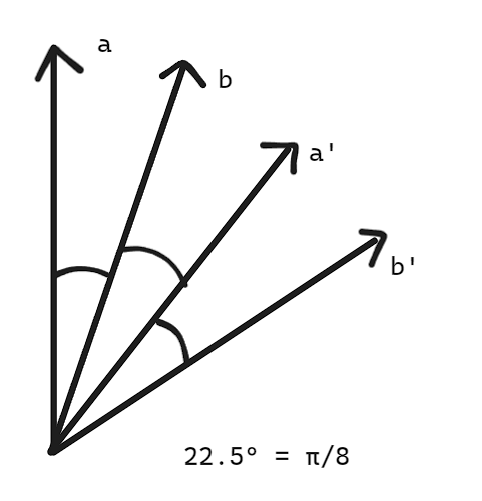

# Esperimenti sulla violazione dis. di Bell

## 1 ⋅ Esperimento di Aspect (1) - 1979 ?

Si continuano ad usare atomi di $^{40} C$. Questi atomi passavano per una cascata radiativa che facevano passare da:
- $4s^{2} \ ^1 S_0$ nello stato base
- $4p^2 \ ^1 S_1$ nello stato eccitato
- $4s4p \ ^1 P_1$ nello stato intermedio, emettendo un fotone a $551 \text{ nm}$
- e poi tornava a $4s^{2} \ ^1 S_0$, emettendo un fotone a $423 \text{ nm}$.

In questo caso quindi non si passa allo stato eccitato ancora sopra, ma si passa ad un altro stato per fare la cascata.

La frequenza dei due laser usati andava scelta e controllata con precisione di $\approx 4 \cdot 10^{-8}$ (che ora è piuttosto facile, ma allora non era proprio facile).

Venivano usati 2 laser, uno a $406 \text{ nm}$ e uno a $581 \text{ nm}$. Ciascuno dei laser ha una potenza piuttosto bassa, circa $40 \text{ mW}$ ciascuno. Ciononostante riusca ad avere un **rate di produzione** di coopie di circa $\approx 4 \cdot 10^7 \text{ s}^{-1}$, che era circa $\times 10^5$ rispetto a Freeman & Clauser.

Per il resto lo schema dell'esperimento è molto simile (vedere la figura del suo articolo).

Le coincidenze si controllavano per $\Delta t =19 \text{ ns}$, che è un po' più alto di quello di Freeman & Clauser ($8 \text{ ns}$), ma è comunque ragionevole.

Il "disc" è un discriminatore, il quale prende qualcosa sopra una certa soglia e lo fa passare come onda quadra. Questo è utile per fare coincidenze. Questa onda, ovvero questo click, viene poi mandato ad un controllore di coincidenze, il quale controlla se ci sono coincidenze.

Viene inoltre usato un delay (di davvero tanto tempo, ovvero circa $\Delta t = 100 \text{ ns}$) per mandare uno degli impusli ad un altro controllore di coincidenze, mentre l'altro impulso viene mandato tranquillamente. Se in questo nuovo controllore di coincidenze vedo una coincidenza, sono sicuro che essa non sia dovuto alla cascata radiativa (e da quel che ho capito, ci aiuta a misurare quello che è il rumore di fondo, che è molto importante).

Rate di coincidenze, dato dalla differenza dei 2 canali (ovvero rimuovendo il noise di sottofondo), chiamato $R(a,b)$ (Rate con angoli $a$ e $b$). Il rate è quindi:

$$
\frac{R(a,b)}{\underbrace{R_0}_{\text{rate senza polar.}}}=\frac{1}{4}(\epsilon_M + \epsilon_m)_1 (\epsilon_M + \epsilon_m)_2 + \frac{1}{4}(\epsilon_M - \epsilon_m)_1 (\epsilon_M - \epsilon_m)_2 F(\theta) cos^2 \phi
$$

Dove:
- $\epsilon_M$ è la trasmissione massima ($=0.97$)
- $\epsilon_m$ è la trasmissione minima ($=0.03$)
- $\phi = a-b$
- $\theta$ è un numero un po' più piccolo di 1 (idealemnte 0, ma non proprio)

Gli epsilon servono a tenere meglio in considerazione le limitazione degli strumenti usati. Tra parentesi sono i valori dell'effettivo esperimento.

La disuguaglianza scelta da Aspect (per verificare la disuguaglianza di Bell) è la seguente:

$$
S = [R(a,b) - R(a,b') + R(a',b) + R(a',b') - R_1(a) - R_2(b)] / R_0
\\ \ \\
-1 \leq S \leq 0
$$

Per massimizzare questa quantità, Aspect sceglie la direzione dell'angolo $a$, $b$, $a'$ e $b'$ nel seguente modo:

Tutti gli angoli tra di loro sono $22.5°$, ovvero $\pi/8$.

Si può anche scegliere come angolo $67.5°$.

Abbiamo che:

$$
S_{exp} = (0.126 \pm 0.014) \leq 0
$$ 

Da ricordare che per Clauser era di:

$$
S_{exp} = (0.153 \pm 0.014) \leq 0
$$

## 2 ⋅ Esperimento di Aspect (2) - (1981)

Adesso si usano dei polarizzatori diversi, e si vanno a misurare sia quelli che vengono respinti che quelli che vengono trasmessi.

> Differenza fondamentale: **uso di polarizzatori a 2 porte**

Si possono rilevare 4 tipi di coincidenze:
- $TT$, con due fotoni trasmessi ($\nu_1$ e $\nu_2$ trasmessi)
- $TR$, con un fotone trasmesso e uno riflessi ($\nu_1$ trasmesso e $\nu_2$ riflesso)
- $RT$, con un fotone riflesso e uno trasmesso ($\nu_1$ riflesso e $\nu_2$ trasmesso)
- $RR$, con due fotoni riflessi ($\nu_1$ e $\nu_2$ riflessi)

Dove per riflesso si intende non trasmesso.

[Si cerchi lo schema dell'esperimento].

Si cercano di misurare le coincidenze:

$$
E(a,b) = \frac{R_{TT}(a,b) + R_{RR}(a,b) - R_{TR}(a,b) - R_{RT}(a,b)}{R_{TT}(a,b) + R_{RR}(a,b) + R_{TR}(a,b) + R_{RT}(a,b)}
$$

Ma questa è proprio la correlazione tra i fotoni rilevati con i polarizzatori $(a,b)$ 

Quando viene trasmesso si misura $+1$, quando viene riflessa si misura $-1$.

Su questa quantità vale questa disuguaglianza:

$$
-2 \leq E(a,b) - E(a,b') + E(a',b) + E(a',b') \leq 2
$$

Dove chiamiamo la somma di $E$ dentro come $S'$ (per distinguerla dall'esperimento prima).

Al massimo, scegliendo gli angoli $a,b$ come fatto prima, questa equazione dovrebbe valere $S_{Max} = 2\sqrt{2}$.

Quello che Aspect misura sperimentalmente è $S_{exp} = 2.697 \pm 0.015$.

Notiamo che quindi il valore misurato è circa uguale a $46 \ \sigma$ dal valore atteso dalla meccanica classica, quindi è una violazione molto forte della disuguaglianza di Bell.

## 3 ⋅ Esperimento di Aspect (3) - (1982)

La prima delle scappatoglie di Aspect si occupa è quella secondo la quale l'emissione dei fotoni è correlata con la polarizzazione del fotone emesso, quindi essenzialmente il fotone è legato al polarizzatore così come impostato prima.

Pertanto quello che vuole fare è cambiare l'angolo dei polarizzatori mentre i fotoni sono in volo.

> Differenza principale: scelta angoli $a, a'$ e $b, b'$ dopo l'emissione dei fotoni

Ogni fotone fa 6 metri prima che venga scelta la loro polarizzazione, ovvero dalla sorgente, $\nu_1$ e $\nu_2$ fanno 6 metri prima di essere polarizzati in direzioni opposte. Questa quantità di spazio equivale a $40 \text{ ns}$, alla velocità della luce con la quale i fotoni viaggiano.

Per il fotone $\nu_1$ ci sono due polarizzatori con angoli $a$ e $a'$, mentre per il fotone $\nu_2$ ci sono due polarizzatori con angoli $b$ e $b'$. La scelta di $a, a', b, b'$ è fatta come sopra, quindi sono tutti spaziati di $22.5°$ ($a-b = b-a'=a'-b'=\pi/8 \Rightarrow a-b' = 3\pi /8$).

Quello che cambia è che la commutazione tra $a, a'$ viene eseguita velocemente mediante un dispositivo chiamato **"modulatore acusto-ottico"**. Questo dispositivo ora è comune, ma all'epoca è stato costruito proprio da lui per questo esperimento. Quello che fa è: avere un fascio di luce incidente su un contenitore di acqua (ora si usano cristalli). Questo contenitore di acqua avrà un'onda acustica che viene generata per mezzo di un trasduttore. Questa onda acustica modula l'indice di rifrazione dell'acqua, e quindi modula la luce che passa attraverso. Questo fa sì che la luce non venga trasmessa interamente, ma il 90% ne venga deflessa.

Essenzialemtne Aspect accendeva e spegneva questa onda acustica, quindi il fascio veniva a volte trasmesso e a volte riflessa. Questo permette di cambiare l'angolo di polarizzazione del fotone in volo. 

Ogni $20 \text{ ns}$ c'è un massimo dell'onda trasmessa seguito da un minimo, e, in parallelo, c'è un minimo dell'onda riflessa seguito da un massimo.

Nota: deflessione non cambia la polarizzazione / annulla l'entanglement.

In questo caso:

$$
S = \frac{R(a,b)}{R(\infty, \infty)} - \frac{R(a,b')}{R(\infty, \infty')} + \frac{R(a',b)}{R(\infty', \infty)} + \frac{R(a',b')}{R(\infty', \infty')} - \frac{R(a', \infty)}{R(\infty, \infty)} - \frac{R(\infty, b)}{R(\infty, \infty)}
$$

Dove $R(\infty, \infty)$ è il rate di coincidenze senza polarizzatori, e $R(a,b)$ è il rate di coincidenze con polarizzatori.

A questo punto si ha l'osservabile e si trova che:

$$
S_{exp} = 0.101 \pm 0.02
$$

Che viola la disuguaglianza $-1 \leq S \leq 0$ di $5 \ \sigma$. Notiamo che il valore molto minore in quanto l'efficienza è molto inferiore rispetto agli esperimenti precedenti.

## 4 ⋅ Altre scappatoie (loopholes)

Le seguenti loopholes venivano fatte notare:
1. Gli apparati A e B sono troppo vicini, così che la prima misura del primo fotone influenza la misura del secondo (locality of causality loophole). Questo è confutato dall'esperimento di Aspect.
2. Non tutti i fotoni sono entangled, per via della bassa efficienza bassa di rilevazione non tutti i fotoni vengono rivelati ed in particolare, per qualche ragione, vengono rivelati i fotoni entangled e basta (fair sampling, detection loophole)
   1. Essenzialmente visto che l'apparecchiatura non è ideale, ma le cose vengono misurate in 1 su mille, allora si potrebbe dire che non si stanno misurando tutti i fotoni, ma solo quelli entangled.
3. La scelta delle orientazioni dei polarizzatori non è davvero random (freedom of choice loophole, libero arbitrio). In un esperimento recente, 100k persone sono state coinvolte per generare una scelta casuale.

## 5 ⋅ Esperimento di Wu e Shak (1950)

Boh le va a descrivere.