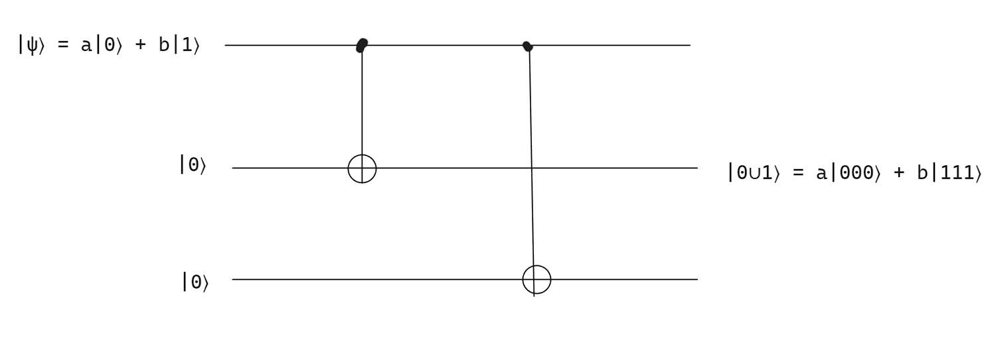

# Quantum operators

## 1 ⋅ Dephasing channel

System:
- Qubit $\ket{0}, \ket{1}$

Env:
- 3 livelli:
  - $\ket{0}_E$
  - $\ket{1}_E$
  - $\ket{2}_E$

Abbiamo:

$$
\mathcal{E}(\rho) = \sum_{k=0}^2 E_k \rho E_k^\dagger
$$

Con:

$$
E_k = \braket{R | \mathcal{U} | 0}
$$

E abbiamo che $\mathcal{U}$ fa le seguenti operazioni:

$$
\begin{align*}
  \ket{0} \otimes \ket{0}_E \mapsto^\mathcal{U} \sqrt{1-p} \ket{0} \otimes \ket{0}_E + \sqrt{p} \ket{0} \otimes \ket{1}_E 
  \\ \ \\
  \ket{1} \otimes \ket{0}_E \mapsto^\mathcal{U} \sqrt{1-p} \ket{1} \otimes \ket{0}_E + \sqrt{p} \ket{1} \otimes \ket{2}_E 
\end{align*}
$$

Vengono definite tipo 3 matrici che non sono riuscito a scrivere.

Riscriviamo quindi $\mathcal{E}(\rho)$:

$$
\begin{align*}
\mathcal{E}(\rho) &= \sum_{k=0}^{2} E_k \rho E_k^\dagger
\\ \ \\
&= \begin{pmatrix}
\rho_{00} & (1-p) \rho_{01} \\
(1-p) \rho_{10} & p \rho_{11}
\end{pmatrix}
\end{align*}
$$

Adesso calcoliamo $\Gamma$ scarring rate= probabilità di scattering per unitàà di tempo:

$$
\Delta t \quad \quad p = \Gamma\Delta t \quad \quad  t = n \Delta t
\\ \ \\
\mathcal{E}^n(\rho) = \begin{pmatrix}
\rho_{00} & (1-p)^n \rho_{01} \\
(1-p)^n \rho_{10} & p^n \rho_{11}
\end{pmatrix}
\\ \ \\ \ \\
\lim_{n \to \infty} (1-p)^n = \lim_{n \to \infty} (1 - \Gamma \frac{t}{n})^n = e^{-\Gamma t}
\\ \ \\
\text{quindi diventa così:}
\\ \ \\
\mathcal{E}(\rho) = \begin{pmatrix}
\rho_{00} & e^{-\Gamma t} \rho_{01} \\
e^{-\Gamma t} \rho_{10} & 1 - \rho_{00}
\end{pmatrix}
\to \text{ con t } \gg \frac{1}{\Gamma} \to
\begin{pmatrix}
\rho_{00} & 0 \\
0 & 1 - \rho_{00}
\end{pmatrix}
$$

## 2 ⋅ Amplitude-dampening channel

Facciamo anche questo canale. Descrive un atomo che può stare in un ground state oppure in uno stato eccitato. In particolare abbiamo le seguenti cose:

- **Sistema**
  - Qubit $\ket{0} = \ket{g}, \ket{1} = \ket{e}$
  - Questo è il nostro "atomo"
- **Env**
  - Si ha un fotone che viene emesso dall'atomo
  - Abbiamo le seguenti cose relative al fotone:
    - $\ket{0}_E$ = assenza fotone
    - $\ket{1}_E$ = presenza di 1 fotone

Inizialmente il nostro ambiente è sempre nello stato $\ket{0}$, quindi abbiamo le seguenti possibilità:

$$
\begin{align*}
  \ket{0} \otimes \ket{0}_E \mapsto^\mathcal{U} \ket{0} \otimes \ket{0}_E
  \\ \ \\
  \ket{1} \otimes \ket{0}_E \mapsto^\mathcal{U} \sqrt{1-p} \ket{1} \otimes \ket{0}_E + \sqrt{p} \ket{0} \otimes \ket{1}_E
\end{align*}
$$

Nel primo caso cosa può succedere? Nulla, quindi rimane in se stesso. Nel secondo caso invece può decadere e quindi cambiare. La possiblità che decarad e generi un fotone è $p$. Da notare che se viene generato il fotone, allora lo stato dell'atomo cambia, quindi decade, quindi è tutto logico.

Quindi andiamo a definire le nostre cose:

$$
\mathcal{E}(\rho) = \sum_{k = 0}^1 E_k \rho E_k^\dagger
$$

Definiamo quindi le singole $E$:

$$
\begin{align*}
  E_0 &= \braket{0 | \mathcal{U} | 0}_E = \begin{pmatrix}
    1 & 0 \\
    0 & \sqrt{1-p}
  \end{pmatrix}
  \\ \ \\
  E_1 &= \braket{1 | \mathcal{U} | 0}_E  = \begin{pmatrix}
    0 & \sqrt{p} \\
    0 & 0
  \end{pmatrix}
\end{align*}
$$

Adesso andiamo a definire quella con tutti, quindi abbiamo:

$$
\mathcal{E}(\rho) = \begin{pmatrix}
  \rho_{00} & \sqrt{1-p} \ \rho_{01} \\
  \sqrt{1-p} \ \rho_{10} & p \rho_{11}
\end{pmatrix}
$$

Adesso andiamo a calcolare $\Gamma$, ovvero il rate di decadimento dell'atomo, ovvero la **probabilità che avvenga decadimento per unità di tempo**. Quindi possiamo scrivere:

$$
p = \Gamma \Delta t \quad \quad t = n \Delta t \quad \quad p = \frac{\Gamma t}{n}
$$

Vediamo quindi cosa diventa la nostra $\mathcal{E}$ dopo $n$ passaggi:

$$
\mathcal{E}^n (\rho) = \begin{pmatrix}
  ... & sqrt{(1-p)^n} \rho_{01} \\
  sqrt{(1-p)^n} \rho_{10} & (1-p)^n \rho_{11}
\end{pmatrix}
$$

Per capire cosa succede a $\rho_{00}$ andiamo a fare questo insieme di passaggi diverse volte:

$$
\rho_{00} \xrightarrow{\mathcal{E}} \rho_{00} + p \rho{11} 
\\ \ \\
\to \rho_{00} + p \rho_{11} + p (1-p)\rho_{11} 
\\ \ \\
\to \rho_{00} + p \rho_{11} + p(1-p) \rho_{11} + p(1-p)^2 \rho_{11}
\\ \ \\
\to \dots
$$

Quindi otteniamo:

$$
\mathcal{E}^n (\rho) = \begin{pmatrix}
  \rho_{00} + p \rho_{11} \sum_{k=0}^{n-1} (1-p)^k & sqrt{(1-p)^n} \rho_{01} \\
  sqrt{(1-p)^n} \rho_{10} & (1-p)^n \rho_{11}
\end{pmatrix}
$$

Usiamo di nuovo, ottenendo degli esponenziali, come prima mandando $n \to \infty$:

$$
\xrightarrow{n \to \infty} \begin{pmatrix}
  \rho_{00} + \rho_{11} & e^{-\frac{\Gamma t}{2}} \rho_{01} \\
  e^{-\frac{\Gamma t}{2}} \rho_{10} & e^{-\frac{\Gamma t}{2}} \rho_{11}
\end{pmatrix}
$$

Dove la parte in alto a sinistra è data dalla seguente cosa:

$$
\lim_{n \to \infty} \sum_{k =0}^{n-1} (1-p)^k = \sum_{k = 0}^{\infty} (1-p)^k = \frac{1}{1- (1-p)} = \frac{1}{p}
$$

Infine facciamo altri passagg imandando il tempo in avanti:

$$
\xrightarrow{t \gg \frac{1}{\Gamma}} \begin{pmatrix}
  \rho_{00} + \rho_{11} & 0 \\
  0 & 0
\end{pmatrix}
= \begin{pmatrix}
  1 & 0 \\
  0 & 0
\end{pmatrix}
= \ket{0}\bra{0}
$$

In particolare questi valori hanno dei nomi:
- $T_1$ è il tempo di decadimento degli elementi diangolai
- $T_2$ è il tempo di decadimento degli elementi fuori diagonale

Questa è la convenzione che si usa per indicare i valori:
- $\rho_{01} e^{-{t}/{T_2}}$
- $\rho_{11} e^{-{t}/{T_1}}$

Quindi abbiamo:
- $T_1 = \frac{1}{\Gamma}$
- $T_2 = \frac{2}{\Gamma}$

Questo è l'ultimo degli esempi che possiamo fare utilizzando solo un qubit. Abbiamo finito di descrivere tutti quelli che sono comportamenti interessanti.

## 3 ⋅ Quantum error correction

La domanda che ci poniamo ora è:
- Abbiamo problemi che agiscono e degradano l'informazioni
- C'è modo di correggere questi errori?
  - **Quantum correction code**
  - Ci permette di accorgerci del fatto che c'è stato un errore
  - Ci permette di correggere l'errore

Prima di passare a definire come viene fatto per un computer quantistico, andiamo a vedere come è fatto per un computer classico.

### 3.1 ⋅ Binary symmetric noisy channel (classico)

Noi possiamo avere il nostro bit nello stato $0$ o $1$ e con probabilità $p$ abbiamo che:
- $0 \to 1$ con probabilità $p$
- $1 \to 0$ con probabilità $p$
- $0 \to 0$ con probabilità $1-p$
- $1 \to 1$ con probabilità $1-p$

Questo è quindi un canale noisy. Si chiama simmetrico in quanto va in tutte le direzioni con le stesse probabilità. Il modo di risolvere questo in un computer classico è utilizzando una **codifica didondante**. Per esempio:
- Codifichiamo il bit $0$ come $000$
- Codifichiamo il bit $1$ come $111$

Quello che succede in un intervallino piccolo di tempo, potrebbe andarsi a flippare uno di questi bit che abbiamo, quindi ciò che può succedere è che:
- Con probabilità $p$, $000$ diventa: $100$ OPPURE $010$ OPPURE $001$
  - Con un computer classico mi accorgo subito che c'è stato l'errore, in quanto uno dei vari bit è diverso dagli altri 2 che ho.
  - Quindi qua posso fare quello che si chiama il **majority vote**, ovvero scelgo la maggioranza per impostare il bit.
  - Le correzioni che avvengono sono quindi:
  - $100 \to 000$, etc.
- Lo posso fare anche per $111$, nello stesso identico modo.

La domanda è, funziona sempre questa cosa? No: se ne dovessero flippare 2, o 3 allora andremmo ad incorrere in problemi.

Quindi:

$$
\begin{align*}
p_{err} & = \# \text{doppio flip} + \# \text{triplo flip}
\\ \ \\
& = 3(1-p)p^2 + p^3
\\ \ \\
& = 3p^2 - 2p^3
\end{align*}
$$

Quindi adesso possiamo confrontare le due cose, ovvero cosa ci è più conveniente tra:
- $p$ come $p_{err}$ per il canale normale
- $3p^2 - 2p^3$ come $p_{err}$ per il canale con bit ridondanti 

Quindi andiamo a risolvere le disuguaglianze seguenti:

$$
3p^2 - 2p^3 \leq p
\\ \ \\
p_{\text{threshold}} = \frac{1}{2}
$$

Quindi $p$ deve essere minore di $1/2$ affinchè il canale con bit ridondanti sia migliore di quello normale. Il cacolo di questo threshold di possibilità è quaclosa di molto difficile.

Abbiamo 2 problemi quando andiamo a fare la quantum correction però:
- No cloning, quindi non possiamo fare una copia del nostro qubit
- Quando eseguo la misura, che oltretutto è probabilistica, distruggo lo stato del qubit

### 3.2 ⋅ Bit-flip code

Andiamo quindi a definrie il problema del bit-flip anche sui qubit:

$$
\begin{align*}
\ket{0} \xrightarrow{p} \ket{1}
\\
\ket{1} \xrightarrow{p} \ket{0}
\end{align*} \quad X \text{ accade } p, \mathbb{I} \text{ accade } 1-p 
$$

Quindi andiamo a descrivere un qubit usando un insieme di 3 qubit definendo quindi un qubit logico nel seguente modo:

$$
\ket{0} \mapsto \ket{000} = \ket{0_L}
\\
\ket{1} \mapsto \ket{111} = \ket{1_L}
$$

Quindi abbiamo che uno stato qualsiasi è definito in questo modo:

$$
\ket{\psi} = a \ket{0} + b \ket{1} \mapsto a \ket{000} + b \ket{111} = a \ket{0_L} + b \ket{1_L}
$$

La prima domanda è: **possiamo fare questa operazione senza violare il teorema di no cloning**? La risposta è sì, andiamo quindi a definire come si fa usando un circuito:

E quindi andiamo a descrivere uno stato nel seguente modo:

$$
\ket{\psi_0} = a \ket{000} + b\ket{111} \xrightarrow{p}
\begin{cases}
  \ket{\psi_1} = a \ket{100} + b \ket{011}
  \\
  \ket{\psi_2} = a \ket{010} + b \ket{101}
  \\ 
  \ket{\psi_3} = a \ket{001} + b \ket{110}
\end{cases}
$$

Quindi andiamo a definire i vari proiettori $\mathbb{P}$:

$$
\begin{align*}
\mathbb{P}_0 = \ket{000}\bra{000} + \ket{111}\bra{111}
\\
\mathbb{P}_1 = \ket{100}\bra{100} + \ket{011}\bra{011}
\\
\mathbb{P}_2 = \ket{010}\bra{010} + \ket{101}\bra{101}
\\
\mathbb{P}_3 = \ket{001}\bra{001} + \ket{110}\bra{110}
\end{align*}
$$

Quindi possiamo andare a vedere cosa i proiettori facciano:

$$
\mathbb{P}_0 \ket{\psi_0} = \ket{\psi_0} \quad \mathbb{P}_0 \ket{\psi_1} = \mathbb{P}_0 \ket{\psi_2} = \mathbb{P}_0 \ket{\psi_3} = 0
\\ \ \\
\text{ in generale: }
\\ \ \\
\begin{align*}
\mathbb{P}_j \ket{\psi_j} = \ket{\psi_j}\quad &, \quad j =0,1,2,3
\\
\mathbb{P}_j \ket{\psi_k} = 0 \quad & , \quad j \neq k 
\end{align*}
$$

La misura quindi mi distingue se lo stato misurato è $\ket{\psi_j}$ e la misura non lo distrugge. La misura avviene facendo:

$$
A = \sum_{j = 0}^3 \lambda_j \mathbb{P}_j \quad \text{ con } \quad \lambda_0 \neq \lambda_1 \neq \lambda_2 \neq \lambda_3
$$

Quindi noi possiamo applicare delle operazioni alle cose sopra in base a cosa scopriamo:

$$
\ket{\psi_0} = a \ket{000} + b\ket{111} \xrightarrow{p}
\begin{cases}
  \ket{\psi_1} = a \ket{100} + b \ket{011} \xrightarrow{X_1} \ket{\psi_0}
  \\
  \ket{\psi_2} = a \ket{010} + b \ket{101} \xrightarrow{X_2} \ket{\psi_0}
  \\ 
  \ket{\psi_3} = a \ket{001} + b \ket{110} \xrightarrow{X_3} \ket{\psi_0}
\end{cases}
$$

**Syndromes** sono i nomi che vengono dati alle operazioni che vengono fatte per capire quale è lo stato del qubit.

**Recovery** invece è quello che viene fatto per correggere (ovvero per esempio fare $X_1$).

Ogni algoritmo di correzione dell'errore si basa su queste 2 fasi, ovvero una fase di **syndrome** e una fase di **recovery**, la prima che capisce quale bit è quello errato e la seconda che lo va a recuprerare.

Andiamo quindi a scrivere la **threshold**, in questo caso è identica a quello del caso classico:

$$
p_{\text{err}} = 3p^2 - 2p^3 \leq p \implies p_{th} = \frac{1}{2}
$$

Ci sono dei set più efficienti di operatori per le syndromes, in particolare noi possiamo usare:

$$
Z_1 Z_2 = Z_1 \otimes Z_2 \otimes \mathbb{I}_3
\\ \ \\
Z_2 Z_3 = \mathbb{I}_1 \otimes Z_2 \otimes Z_3
$$

Da ricordare che $Z$ fa la seguente operazione:

$$
Z\ket{0} = \ket{0}
\\
Z\ket{1} = -\ket{1}
$$

Quindi se noi andiamo a misurare le varie cose con le gate otteniamo:

|  | $Z_1 Z_2$ | $Z_2 Z_3$ |
|---|-----------|-----------|
| $\ket{\psi_0}$ | +1         | +1         |
| $\ket{\psi_1}$ | -1         | +1         |
| $\ket{\psi_2}$ | -1         | -1         |
| $\ket{\psi_3}$ | +1         | -1         |

Quindi ci bastano queste 2 sindromi per ottenere i risultati che vogliamo.

Ci viene mostrato che si può anche usare:

$$
\ket{0} \mapsto \ket{+++}
\\
\ket{1} \mapsto \ket{---}
$$

Per vedere gli arrori in $Z$, $X$ e $Y$ si può fare usando 9 qubit, quindi 3 per ogni singola cosa. Questa è la base di come funziona l'algoritmo di Shor.

> Qualunque errore che si scrive come $R = \alpha\mathbb{I} + \alpha_x X + \alpha_y Y + \alpha_z Z$ (combinazione lineare) può essere corretto con un codice di correzione di errore.
>
> Per un singolo qubit viene quindi scritto con 9 qubit, quindi ci moltiplica quasi per 10 il numero di qubit che servono.

Ho bisogno di 2 cose:
- Alta fedeltà del gate in modo che ci siano poche possibilità di errore (sia quanto più vicino all'essere unitario possibile)
- Stare sotto al threshold