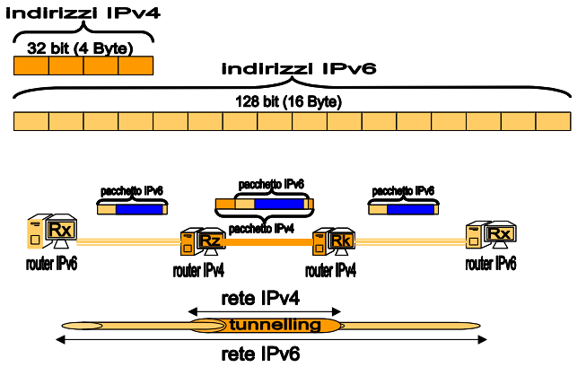

[//]: # (Date: 2023-04-30 19:00)
[//]: # (Stili di riferimento per il markdown)
<link rel="stylesheet" href="./res/style.css">

> # Introduzione 2

---

> ## Livello 3

---

### Reti di reti e Internetworking

Le reti locali sono connesse attraverso collegamenti organizzati in modo gerarchico, basati su calcolatori rappresentati della rete locale (*router*) a loro volta collegati da linee dati veloci o dorsali (*backbone*).

Praticamente:
- Se noi usassimo solo MAC e il livello 2 in generale, allora:
  - Ci sarebbe bisogno di avere in ogni dispositivo una tabella cole le corrispondenze tra MAC e che instradamento seguire.
  - Ma questo limiterebbe la dimensione della rete, perché la tabella dovrebbe essere molto grande.

Soluzione:
- Usiamo le reti di reti, ovvero le reti locali sono connesse tra loro da router, che si occupano di instradare i pacchetti.
  - Questo viene quindi fatto dal livello 3. I router si limitano a conoscere alcuni altri router, e non tutti i dispositivi della rete.

### IP

Livello rete (Network) per Internet:
- Protocollo Internet (**Internet Protocol, IP**)
  - Nuovo tipo di indirizzamento globale e gerarchico, ovvero gli *indirizzi ip*
    - Fornisce indirizzi alla rete locale e ai suoi nodi
  - Instradamento dei pacchetti dal mittente al destinatario finale (*forwarding*)
    - Servizio di comunicazione di tipo *connectionaless*
  - Nuovi dispositivi amministratori del livello tre, i *router*
    - Tabelle di instradamento che illustrano la topologia di rete (al livello 3)
    - Protocollo di aggiornamento delle tabelle di rete (*routing*)
  - *frammentazione* dei dati da spedire in pacchetti
  - *busta del pacchetto* di livello rete organizzata con gli indirizzi di mittente e destinatario

### IPv4

Protocollo IP definisce una nuova specie di indirizzi: gli indirizzi IP.
- Si usano gli indirizzi IPv4:  
  - Indirizzi a 32 bit, ovvero 4 byte
  - Ogni byte è rappresentato in decimale, e separato dagli altri da un punto
  - Esempio: `192.168.1.2`
  - Composto da due parti:
    - **Network number**
    - **Host number**
  - Sono divisi in 3 classi:
    - **A**: 
      - 8 bit per il network number, 24 per l'host number. 
      - Vanno da `1.0.0.0` a `127.0.0.0`
      - Gli indirizzi privati vanno da `10.0.0.0` a `10.255.255.255`
    - **B**: 
      - 16 bit per il network number, 16 per l'host number. 
      - Vanno da `128.0.0.0` a `191.255.0.0`
      - Gli indirizzi privati vanno da `172.16.0.0` a `172.31.255.255`
      - Gli indirizzi privati per APIPA (Windows) vanno da `169.254.0.0` a `169.254.255.255`
    - **C**: 
      - 24 bit per il network number, 8 per l'host number. 
      - Vanno da `192.0.0.0` a `223.255.255.0`
      - Gli indirizzi privati vanno da `192.168.0.0` a `192.168.255.255`

Ci sono anche la classe D ed E, ma sono riservate a usi speciali.

Ogni indirizzo IP è associato ad una e una sola scheda di rete:
- Associazione univoca tra IP e MAC
- IP Statici o IP Dinamici (Possono cambiare a che scheda di rete sono associati)

### Netmask

Praticamente, gli indirizzi IP sono separati in due parti mediante la *netmask*:
- **Network number**: Parte di indirizzo che identifica la rete
  - Ha un numero di bit uguali a quelli della netmask
- **Host number**: Parte di indirizzo che identifica l'host
  - Ha un numero di bit uguali a quelli dell'indirizzo meno quelli della netmask

L'indirizzo di rete è quello che si ottiene facendo l'AND bit a bit tra l'indirizzo IP e la netmask.

Vi è poi l'indirizzo di broadcast, che è quello che si ottiene facendo l'OR bit a bit tra l'indirizzo IP e la negazione della netmask (?copilot, maybe right maybe not. In ogni caso 255 = broadcast tipo).

### Forwarding

Il forwarding è il processo di instradamento dei pacchetti da un router all'altro, fino a raggiungere il destinatario finale.

Ogni router ha una tabella di routing, che contiene le informazioni per l'indirizzamento dei pacchetti. Una volta che gli arriva un pacchetto che deve inoltrare, il router controlla la tabella di routing per vedere dove inoltrarlo.

### Routing

Il problema del *routing*: come aggiornare le tabelle di routing dei router in modo che siano sempre aggiornate e corrette?

Serve in quanto ci possono essere modifiche che rendono sbagliati i percorsi che i router conoscono.

Si fa uso di un protocollo di routing, che si occupa di aggiornare le tabelle di routing dei router:
- Invio richiesta: come arrivo a questo host?
- Aggiornamento della tabella di forwarding con il cammino migliore.

Esempi di algoritmi di routing su *Internet* sono: RIP, OSPF, BGP.

> ### ICMP

Internet Control Message Protocol (ICMP): protocollo dei messaggi di controllo su Internet.
- Standard per definire comunicazione di informazioni utili alla gestione di Internet
- ICMP è usato da host, router, gateway per scambiarsi informazioni a livello di rete, usando pacchetti definiti con il protocollo IP.
  - Può ritornare errori quali:
    - Rete sconosciuta
    - Rete irragiungibile
    - Host sconosciuto
    - Host irraggiungibile
    - Protocollo non disponibile
    - Ricerca di cammino alternativo

### Applicazioni basate su ICMP

Vi sono due applicazioni importanti e comuni basate su ICMP:
- **PING**
  - Si usa facendo `ping <indirizzo ip>`
  - Invia un pacchetto ICMP di tipo *echo request* all'indirizzo specificato
  - Se l'host è raggiungibile, risponde con un pacchetto ICMP di tipo *echo reply*
  - Utile per verificare se un host è raggiungibile
- **Traceroute**
  - Si usa facendo `traceroute <indirizzo ip>`
  - Invia una serie di pacchetti ICMP di tipo *echo request* con un TTL crescente (TTL = Time to Live, ovvero il numero di "hop" che può fare prima di essere considerato perso)
  - Ogni router che riceve un pacchetto con TTL = 0, risponde con un pacchetto ICMP di tipo *time exceeded*
  - Utile per verificare il cammino che un pacchetto fa per raggiungere un host

### ARP e RARP

Dato un indirizzo IP, come si ottiene l'indirizzo MAC corrispondente?

- **ARP**: Address Resolution Protocol
  - Protocollo che permette di ottenere l'indirizzo MAC corrispondente ad un indirizzo IP
  - Si usa inviando un pacchetto ARP di tipo *request* con l'indirizzo IP di cui si vuole conoscere l'indirizzo MAC
  - L'host che ha l'indirizzo IP risponde con un pacchetto ARP di tipo *reply* con il proprio indirizzo MAC
  - L'host che ha fatto la richiesta ARP salva l'indirizzo MAC nella propria cache ARP

- **RARP**: Reverse Address Resolution Protocol
  - Protocollo che permette di ottenere l'indirizzo IP corrispondente ad un indirizzo MAC

### DHCP

Esistono due modi per assegnare indirizzi IP:
- **Statico**: l'indirizzo IP è assegnato manualmente
  - Serve avere un indirizzo IP che viene concesso da un ente internazionale, al quale va fatta richiesta
- **Dinamico**: l'indirizzo IP è assegnato automaticamente
  - Si usa il protocollo DHCP

Dynamic Host Configuration Protocol (DHCP): protocollo per l'assegnazione dinamica di indirizzi IP.

- Un server DHCP ha un pool di indirizzi IP disponibili
  - Un host che si collega alla rete invia un pacchetto DHCP di tipo *discover* per richiedere un indirizzo IP
  - Il server DHCP risponde con un pacchetto DHCP di tipo *offer* con un indirizzo IP disponibile
  - L'host che ha fatto la richiesta DHCP risponde con un pacchetto DHCP di tipo *request* per richiedere l'indirizzo IP
  - Il server DHCP risponde con un pacchetto DHCP di tipo *ack* per confermare l'assegnazione dell'indirizzo IP

### IPv6 e tunnerling IPv4

IPv6 è la nuova versione del protocollo IP, che risolve il problema della scarsità di indirizzi IPv4.

- **Indirizzi IPv6**
  - 128 bit
  - Scritti in notazione esadecimale
  - Sono divisi in 8 blocchi da 16 bit, separati da `:`
  - Ogni blocco è scritto in notazione esadecimale
  - I blocchi con tutti 0 possono essere omessi
  - I blocchi consecutivi con tutti 0 possono essere sostituiti con `::`
  - Esempio: `2001:0db8:0000:0000:0000:ff00:0042:8329` diventa `2001:db8::ff00:42:8329`

- **Tunelling IPv4**
  - Permette di far comunicare host IPv6 e IPv4

---

> ## Livello di trasporto

---

I protocolli di Internet del quarto livello sono essenzialmente due:
- **TCP**: Transmission Control Protocol
  - Protocollo di trasporto orientato alla connessione
  - Fornisce un servizio affidabile
  - Fornisce un servizio di flusso di byte
  - Fornisce un servizio di controllo di congestione
- **UDP**: User Datagram Protocol
  - Protocollo di trasporto non orientato alla connessione
  - Fornisce un servizio non affidabile
  - Fornisce un servizio di datagramma
  - Usa un metodo best effort per la consegna dei datagrammi

### TCP

TCP è il protocollo di livello trasporto de facto usato su internet.

TCP consente lo smistamento dei pacchetti verso le rispettive applicazioni in ascolto su una porta specifica.

TCP richiede attivazione della *connessione punto a punto* tra due *socket*:
- **Socket**: coppia di indirizzi IP e numero di porta
- Esempio: PC1 manda un pacchetto a PC2, che ha un'applicazione in ascolto sulla porta 80
  - PC1 manda un pacchetto TCP con indirizzo IP di PC2 e numero di porta 80
  - PC2 riceve il pacchetto e lo inoltra all'applicazione in ascolto sulla porta 80
  - Tutto ciò se la porta in ascolto è libera.

**Rilascio della connessione**: vengono poi *liberate* le porte che si stavano usando.

### TCP - Controllo di flusso e di congestione

Bisogna risolvere un problema: la latenza di rete è alta:
- Invio pacchetto e attendo prima di inviare il successivo?
  - Solo un pacchetto in tutto il cammino: troppo lento, si può fare di meglio!
- Invio tutti i pacchetti uno dopo l'altro?
  - Possibile congestione dei router intermedi, che perdono pacchetti
  - Possibile saturazione del destinatario, che riceve pacchetti troppo velocemente
- Soluzione: **controllo di flusso** e **controllo di congestione**
  - **Controllo di flusso**: il mittente non invia più pacchetti di quanti il destinatario può ricevere
  - **Controllo di congestione**: il mittente non invia più pacchetti di quanti i router intermedi possono inoltrare (Basando sulla velocità del router più lento della rete)

Esistono vari modi, in particolare vediamo il metodo a **finestra scorrevole** (*Sliding window*, *SW*).

La finestra scorrevole funziona nel seguente modo:
- Si ha un valore intero, che rappresenta la *SW*, per esempio 1, 2, 4, 8, etc. .
- **Controllo di flusso**:
  - Non si spediscono più di *SW* pacchetti senza ricevere risposta
  - Se tutti i pacchetti sono confermati, si passa ai successivi *SW* pacchetti
  - Se un pacchetto non è confermato, va rispedito prima di spedire i prossimi *SW* pacchetti.
- **Controllo della congestione**:
  - Spedisce un numero variabile di pacchetti, ovvero cambia il numero *SW*
  - Se tutta la trasmissione ha successo, si aumenta *SW*.
  - Quando un pacchetto non è confermato, si diminuisce *SW*.
  - Praticamente accellera gradualmente e, appena si ha un problema, rallenta drasticamente.

---

### Nomi di Dominio e servizio DNS

Gli utenti preferiscono usare nomi piuttosto che indirizzi IP.

I nomi delle risorse sono organizzati in modo simile ai domini delle reti, in modo gerarchico.

Il problema è che i protocolli di rete e i router pretendono di usare indirizzi IP.

Soluzione: **DNS** (*Domain Name System*).
- Si basa su una catena di server DNS organizzati gerarchicamente
  - Ogni server DNS conosce almeno 1 DNS superiore
  - Ogni host conosce almeno un DNS
- I server ricevono richieste e forniscono risposte
  - Ogni richiesta è un nome di dominio
  - Ogni risposta è un indirizzo IP
- I server DNS radice conoscono tutti i domini e i loro IP (ma sono pochi e costosi)

---

> ## Livello applicazione

---

### Cosa si ha a questo livello?

Primitive e protocolli per spedire e ricevere dati dalle applicazioni.

Il livello sessione e presentazione sono raramente implementati sugli host di Internet.

Il livello applicazione si appoggia su quello *trasporto*.

Esempio di famose applicazioni di rete e servizi del livello applicazione:
- **Posta elettronica**: 
  - Basata su protocolli di livello applicazione, ovvero SMTP, POP3, IMAP
- **Web**:
  - Basato su protocolli di livello applicazione, ovvero HTTP, HTTPS
- **DNS**:
  - Basato sul protocollo DNS

### Peer to Peer vs Client-Server

- **Peer to Peer**:
  - Ogni host può essere client e server
  - Ogni host può fornire e richiedere servizi
  - Ogni host può essere inattivo o attivo
  - Ogni host può essere connesso o disconnesso
  - Ogni host può essere affidabile o non affidabile
  - Esempio: BitTorrent, Freenet, Gnutella

- **Client-Server**:
  - I client sono host che spediscono richieste di serviio
  - I server sono host che forniscono servizi
  - Esempio: Web, DNS, Email

Esistono anche **ibridi** che usano server per trovare più in fretta i giusti host Peer to Peer. Esempio: Skype, Napster.

---

> ## Altro

---

### Internet 2

Praticamente, al posto di considerare ogni pacchetto con la stessa importanza, si possono considerare i pacchetti in base alla loro importanza e mandare quelli urgenti prima di quelli non urgenti.