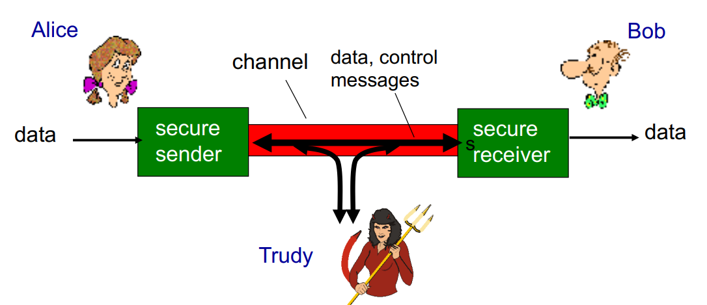

> # Network Security

---

> ## Introduzione

### Obbiettivi

L'obbiettivo di questo capitolo è:
- Capire i principi della sicurezza informatica
  - Crittografia e i suoi usi oltre la confidenzialità
  - Autenticazione
  - Integrità del messaggio
- Sicurezza nella pratica
  - Firewall e sistema di rilevamento delle intrusioni
  - Sicurezza nei livelli applicazione, trasporto, network e data link.

### Cosa è la sicurezza informatica?

Avere la sicurezza informatica è un insieme di obbiettivi da raggiungere:
- **Confidenzialità**: il messaggio non deve essere accessibile a chi non è autorizzato
  - Mittente cripta
  - Ricevente decripta
- **Autenticazione**: il mittente e il destinatario devono riconoscersi;
- **Integrità**: il messaggio non deve essere alterato durante il trasferimento (o anche dopo);
- **Acesso e disponibilità**: i servizi devono essere accessibili e disponibili agli utenti.

---

> ## Attacco in rete

### Esempio di attacco

In questa foto abbiamo quello che è conosciuto come *attacco Bizantino*. Si tratta di un attacco senza un particolare scopo, e che non si pone scrupoli su quello che fa.

Nella nostra immagine abbiamo Trudy (da "Traditore") che fa questo tipo di attacco. Essa si interpone tra i due utenti, Alice e Bob, e modifica, aggiunge o rimuove i messaggi che passano tra loro.

Nel dettaglio, cosa può fare Trudy?
- **Intercettare** i messaggi
- **Inserire** dei messaggi
- **Impersonificare** un utente, cambiando l'indirizzo del mittente nel proprio pacchetto
- **Hijacking**: prendere il controllo della rete, rimuovendo mittente o destinatario e diventando questo utente.
- **Denial of service**: prevenire che il servizio sia utilizzabile

