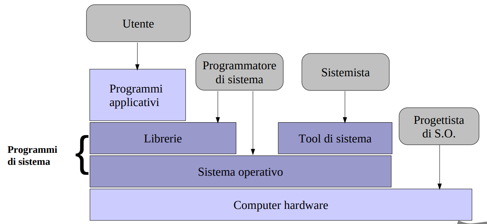

[//]: # (Stili di riferimento per il markdown)
<link rel="stylesheet" href="./res/style.css">

> # Introduzione secondo semestre

---

> ## Cos'è un sistema operativo

 

### Definizione

Un sistema operativo è un livello di astrazione:
- Realizza il concetto di processo
- Il "linguaggio" fornito dal S.O. è definito dalle system call.
- E' implementato tramite un programma che *controlla l'esecuzione dei programmi* applicativi e agisce come *interfaccia tra le applicazioni e l'hardware* del calcolatore.

### Obbiettivi

Deve essere *efficienete*, cioè usare al meglio le risorse del calcolatore in quanto la sua velocità va ad impattare la velocità di **tutti** i programmi che girano su di esso.

Deve essere anche *semplice*, cioè dovrebbe semplificare l'utilizzazione dell'hardware e delle risorse del calcolatore.

### Osservazioni

Gestendo le risorse di un calcolaltore, un S.O. controlla il funzionamento del calcolatore stesso, ma questo controllo è esercitato in maniera particolare.

Di solito il controllo è esterno al sistema controllato, ma nei sistemi operativi il controllo è interno al sistema controllato: il S.O. si affida al processore per riottenere il controllo del calcolatore.

### Visione a livello

Qua abbiamo gli utenti che interagiscono con il S.O. e in che modo lo fanno.

Da questa visione, possiamo denotare che il S.O.:
- Nasconde ai programmatori i dettagli dell'hardware e fornisce ai programmatori una API conveniente e facile da usare.
- Agisce come intermedio tra programmatore e hardware.

Parole chiave:
- Indipendenza dell'hardware
- Comodità di uso
- Programmabilità

Esempio: leggere un floppy disk, odiernamente, è identi a leggere qualsiasi altro file, mentre in passato era necessario conoscere i dettagli dell'hardware.

Ci vengono date tantissime funzioni, tra cui: esecuzioni di programmi, accesso semplificato ai dispositivi di I/O, accesso al file system, accesso al networking, accesso al sistema, rilevazione e risposta a errori, accounting, etc.