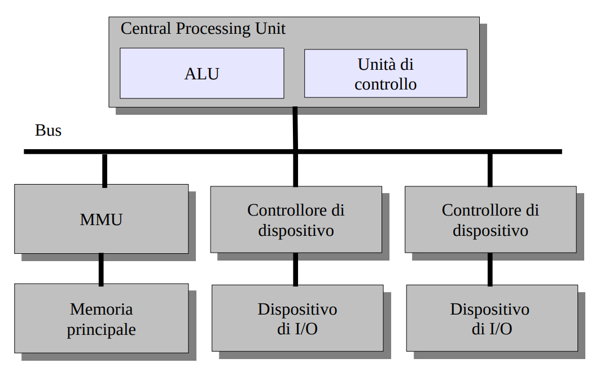
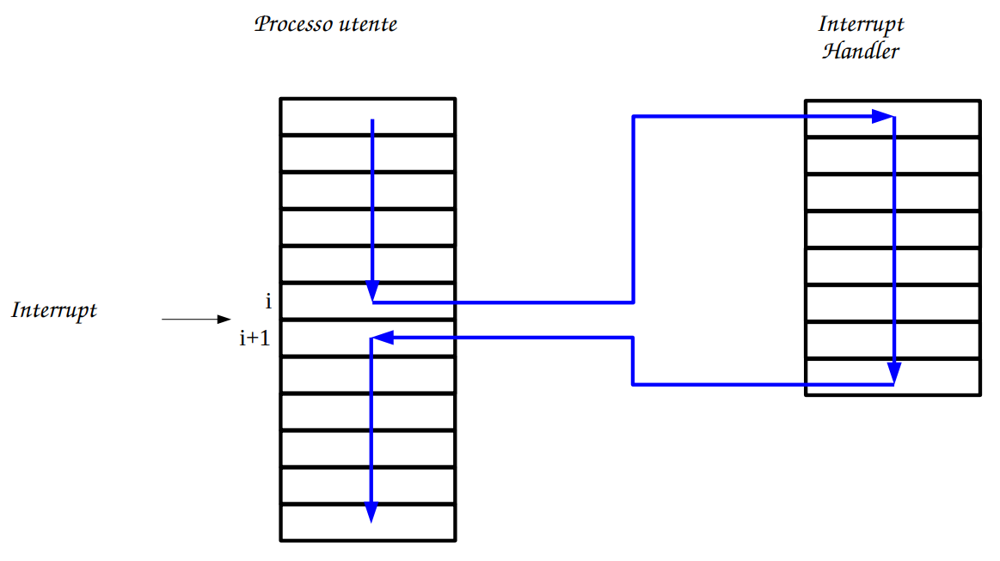

[//]: # (Date: 2023-23-02 13:00)
[//]: # (Stili di riferimento per il markdown)
<link rel="stylesheet" href="./res/style.css">

# Richiami architettura 

---

> ## Architettura di Von Neumann

### Come è formata

**Nota**: avere una macchina 64 bit vuol dire che il bus, gli indirizzi, i registri e i dati sono tutti 64 bit.

### Note su terminologie:

Queste ci vengono date in quanto altri studenti hanno avuto problemi con esse negli esami passati:

- **Device** è un *hardware* (disco, tastiera, ...)
- **Device controller** è una scheda elettrica del dispositivo: è sempre *hardware*
- **Device driver** è *software* ed è il codice che viene fornito al sistema operativo per "parlare" col controller e quindi col device
- **Memory Managment Unit** è *hardware*, è l'unità di controllo della memoria. Oggigiorno sono integrate nel processore, prima erano separate.
- **Memory Manager** è *software* ed è il codice del sistema operativo che configura e controlla la funzionalità della MMU.

---

> ## Gli interrupt

### Definizione

Gli interrupt sono un meccanismo che permette l'interruzione del normale ciclo di esecuzione della CPU.

### Caratteristiche

- Introdotti per aumentare l'efficienza di un sistema di calcolo
- Permettono ad un S.O. di "intervenire" durante l'esecuzione di un programma, allo scopo di gestire efficacemente le risorse del calcolare
  - Processore, memoria, dispositivi di I/O, ...
- Possono essere sia hardware che software
- Possono essere mascherati (ritardati) se la CPU sta svolgendo dei compiti non interrompibili

Gli interrupt più tipici sono quelli fisici, mentre quelli software sono dati dal processore per colpa dell'istruzione corrente

#### Interrupt hardware

Caso più comune è la fine di un I/O, gestito da questo tipo di interrupt. Sono eventi hardware asincroni, non causati dal processo in esecuzione. Vengono generati dai *controller dei dispositivi*.

Esempi:
- **Dispositivi di I/O** 
  - Per notifica di eventi quali il *completamento di un operazione di I/O*
- **Clock**
  - O anche interval timer, si tratta della scadenza di un timer.

#### Interrupt software (*Trap*)

Sono eventi causati dal programma.

Esempi:
- Errori come la divisione per 0 o problemi di indirizzamento 
- Richiesta di servizi di sistema (system call)

### Panoramica passaggi interrupt

Parte del processore [1-2], parte gestita dal sistema operativo [3-4]:
1. Un segnale "interrupt request" viene spedito al processore
2. Il processore:
   - Sospende le operazioni del processo corrente
   - Salta ad un particolare indirizzo di memoria contenente la routine di gestione dell'interrupt (interrupt handler)
3. L'interrupt handler:
   - Gestisce in modo opportuno l'interrupt
   - Ritorna il controllo al processo interrotto (o a un altro processo, nel caso di scheduling)
4. Il processore riprendere l'esecuzione del processo interrotto come se nulla fosse successo

Ovvero:

### Interrupt dettagliato
1. Un segnale di interrupt request viene spedito alla CPU
2. La CPU finisce l'esecuzione dell'istruzione corrente
3. La CPU verifica la presenza di un segnale di interrupt
4. Preparazione al trasferimento di controllo del programma all'interrupt handler
   - Metodo 1: salvataggio dei registri "critici"
     - Informazione minima richiesta, tipo PC e registro di stato.
   - Metodo 2: salvataggio dello stato completo della CPU
5. Selezione dell'interrupt handler appropriato
   - A seconda dell'architettura, vi può essere un singolo interrupt handler, uno per ogni tipo di interrupto uno per dispositivo
   - La selezione avviene tramite l'interrupt vecotr
6. Caricamento del PC con l'indirizzo iniziale dell'interrupt handler assegnato
7. Salvataggio dello stato del processore
   - Salvataggio delle informazioni critiche non salvate automaticamente dai meccanismi hardware di gestione interrupt
8. Gestione dell'interrupt
   - Lettura delle informazioni di controllo proveniente dal dispositivo
   - Eventualmente, spedizione di ulteriori informazioni al dispositivo stesso
9. Ripristino dello stato del processore
    - L'operazione inversa della numero 7
10. Ritorno del controllo al processo in esecuzione (o ad un altro processo, se necessario)

**I S.O. moderni sono detti *Interrupt Driven***
- Il codice del S.o: entra in funzione come interrupt handler
- Sono gli interrupt (o i trap) che guidano l'avvicendamento dei processi

### Più interrupt
Si possono avere più interrupt contemporaneamente, ma la CPU può gestirne solo uno alla volta. Per questo motivo, ci sono due apporcci possibili:
- **Interrupt annidati**: la CPU gestisce un interrupt alla volta, ma accetta altri interrupt durante la gestione dell'attuale
- **Disabilitazione degli interrupt**: la CPU gestisce un interrupt alla volta e non accetta altri interrupt fino a quando non ha completato la gestione dell'attuale

### Programmed e Interrupt-Driven I/O
Con il **programmed** I/O, ormai obsoleto, si caricarano i registri del controller del dispositivo con i dati da trasferire e si attende che il dispositivo termini l'operazione. Questo comporta un'attesa attiva, che è molto inefficiente.

Con l'**Interrupt-Driven** I/O, invece, si carica il controller del dispositivo con i dati da trasferire e si attende che il dispositivo termini l'operazione. Quando il dispositivo termina l'operazione, genera un interrupt che viene gestito dal sistema operativo. L'*interrupt* indica la *fine* dell'operazione di I/O.

Quando si ricevono le informazioni dal dispositivo, si copiano i dati del buffer locale del controller della memoria.